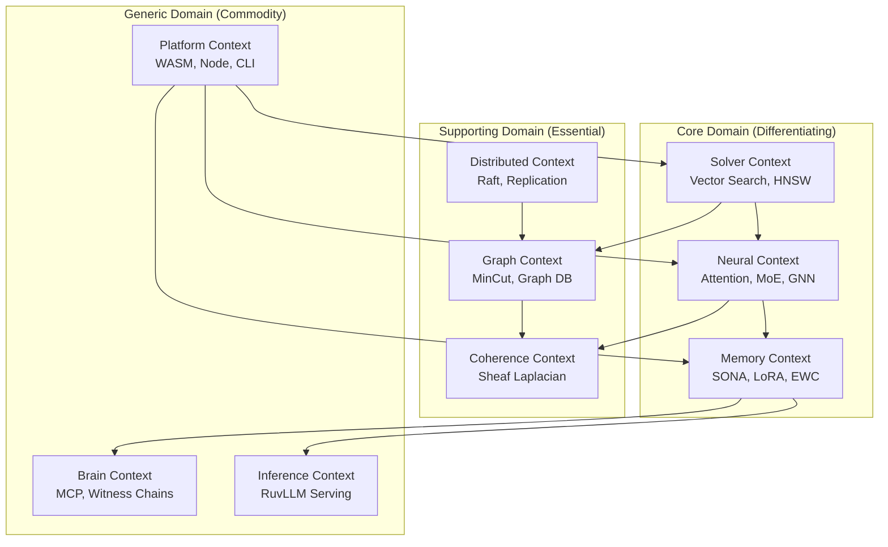
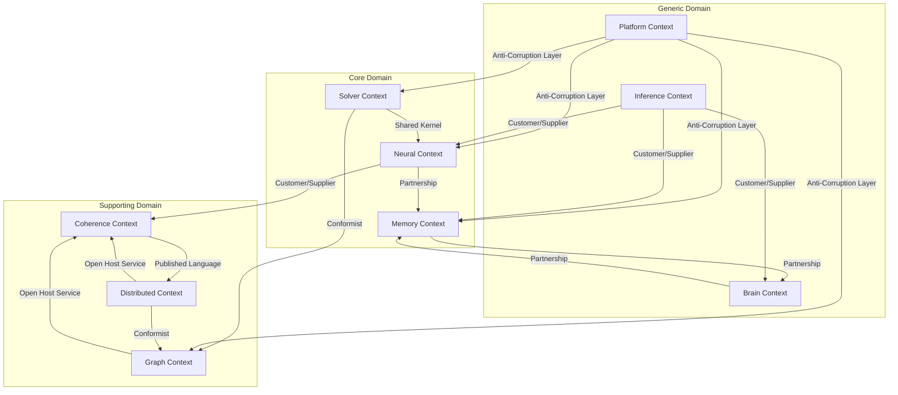
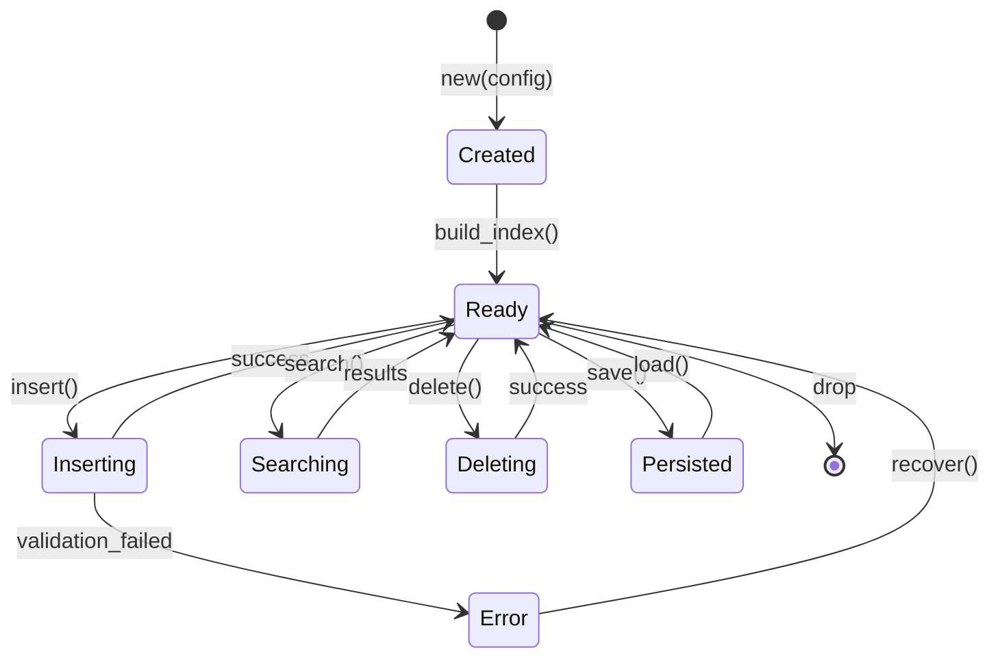
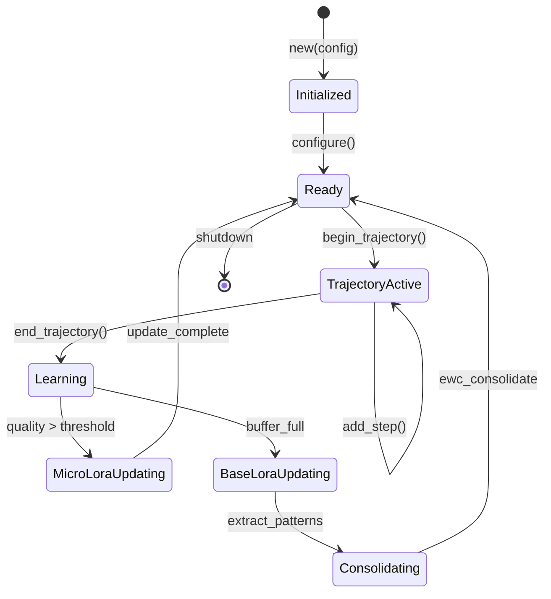
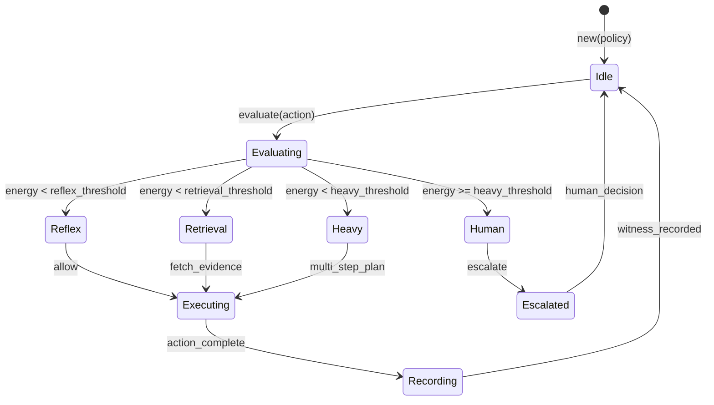
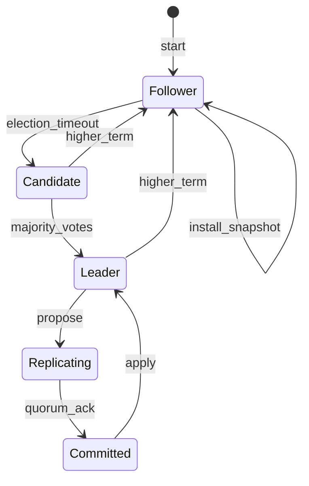
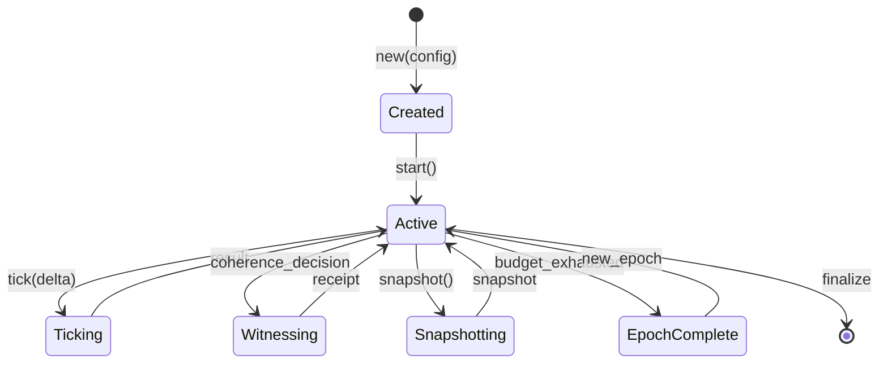

# Ruvector Domain-Driven Design Architecture

## Executive Summary

This document describes the comprehensive Domain-Driven Design (DDD) architecture for ruvector, a high-performance vector database ecosystem with neural capabilities, graph algorithms, distributed consensus, and collective intelligence. The architecture defines **nine bounded contexts**, their entities, value objects, aggregates, repositories, domain events, anti-corruption layers, and context maps.

## Table of Contents

1. [Strategic Design Overview](#1-strategic-design-overview)
2. [Bounded Contexts](#2-bounded-contexts)
3. [Domain Entities](#3-domain-entities)
4. [Value Objects](#4-value-objects)
5. [Aggregates and Repositories](#5-aggregates-and-repositories)
6. [Domain Events and Event Sourcing](#6-domain-events-and-event-sourcing)
7. [Anti-Corruption Layers](#7-anti-corruption-layers)
8. [Context Maps](#8-context-maps)
9. [Aggregate Lifecycle Diagrams](#9-aggregate-lifecycle-diagrams)

---

## 1. Strategic Design Overview

### 1.1 Domain Vision

Ruvector provides a unified platform for vector-based AI operations spanning:
- High-performance vector storage and similarity search
- Neural attention mechanisms (MoE, GNN, hyperbolic, sheaf-theoretic)
- Adaptive learning (SONA, LoRA, EWC)
- Graph algorithms (MinCut, HNSW, Graph Transformers)
- Distributed consensus (Raft, replication)
- Coherence verification (Prime-Radiant, sheaf cohomology)
- Cross-platform deployment (WASM, Node.js, CLI)
- Collective intelligence (MCP Brain, witness chains)
- LLM serving runtime (RuvLLM)

### 1.2 Domain Classification



### 1.3 Core Domain vs Supporting Domains

```
+------------------------------------------------------------------+
|                         CORE DOMAIN                               |
|  +------------------+  +-----------------+  +------------------+  |
|  | Solver Context   |  | Neural Context  |  | Memory Context   |  |
|  | (Vector Search)  |  | (Attention/MoE) |  | (SONA/LoRA/EWC)  |  |
|  +------------------+  +-----------------+  +------------------+  |
+------------------------------------------------------------------+
|                      SUPPORTING DOMAINS                           |
|  +------------------+  +-----------------+  +------------------+  |
|  | Graph Context    |  | Coherence Ctx   |  | Distributed Ctx  |  |
|  | (MinCut/GraphDB) |  | (Sheaf/Energy)  |  | (Raft/Replica)   |  |
|  +------------------+  +-----------------+  +------------------+  |
+------------------------------------------------------------------+
|                       GENERIC DOMAINS                             |
|  +------------------+  +-----------------+  +------------------+  |
|  | Platform Context |  | Brain Context   |  | Inference Ctx    |  |
|  | (WASM/Node/CLI)  |  | (MCP/Witness)   |  | (RuvLLM)         |  |
|  +------------------+  +-----------------+  +------------------+  |
+------------------------------------------------------------------+
```

### 1.4 Ubiquitous Language

| Term | Definition |
|------|------------|
| **Vector** | An n-dimensional floating-point array representing semantic content |
| **Embedding** | A vector representation of text, images, or other data |
| **HNSW** | Hierarchical Navigable Small World graph for approximate nearest neighbor search |
| **Quantization** | Compression technique reducing vector precision (Scalar, Product, Binary) |
| **Trajectory** | A sequence of execution steps with associated rewards for learning |
| **Pattern** | A learned cluster centroid extracted from successful trajectories |
| **Witness** | A cryptographic attestation of computation with Ed25519 signatures |
| **Attestation** | Proof that a cognitive operation was performed correctly |
| **MoE** | Mixture of Experts routing mechanism for specialized attention |
| **Sheaf** | Mathematical structure assigning data to open sets with consistency conditions |
| **Residual** | Contradiction energy at a graph edge: r_e = rho_u(x_u) - rho_v(x_v) |
| **Coherence Energy** | Global incoherence measure: E(S) = sum(w_e * ||r_e||^2) |
| **MinCut** | Minimum edge cut partitioning a graph into components |
| **Poincare Ball** | Hyperbolic space model for hierarchy-aware embeddings |
| **LoRA** | Low-Rank Adaptation for efficient fine-tuning |
| **EWC** | Elastic Weight Consolidation for preventing catastrophic forgetting |
| **Fisher Information** | Metric measuring parameter importance for consolidation |
| **RVF** | Ruvector Format for cognitive containers with witness chains |
| **Compute Lane** | Priority tier for coherence-gated execution (Reflex/Retrieval/Heavy/Human) |

---

## 2. Bounded Contexts

### 2.1 Solver Context (Core Algorithms)

**Purpose**: High-performance vector storage, indexing, and similarity search operations.

**Crates**:
- `ruvector-core` - Core vector database functionality
- `ruvector-solver` - Iterative sparse linear solvers (Neumann, CG, BMSSP)
- `ruvector-router-core` - Vector storage and HNSW indexing
- `ruvector-hyperbolic-hnsw` - Poincare ball embeddings with HNSW

**Responsibilities**:
- HNSW index construction and maintenance
- Distance calculations (Cosine, Euclidean, DotProduct, Manhattan, Poincare)
- Quantization (Scalar 4x, Int4 8x, Product 8-16x, Binary 32x)
- Sparse matrix solving (Neumann, CG, Forward-Push, BMSSP)
- Hyperbolic embeddings for hierarchical data
- Tangent space pruning for accelerated search

**Key Aggregates**:
- `VectorDB` - Root aggregate managing vectors, indices, and storage
- `HnswIndex` - Navigable small world graph structure
- `HyperbolicHnsw` - Poincare ball index with dual-space support

**Key Interfaces**:
```rust
// Core vector operations
pub trait VectorDB {
    fn insert(&self, entry: VectorEntry) -> Result<VectorId>;
    fn search(&self, query: SearchQuery) -> Result<Vec<SearchResult>>;
    fn delete(&self, id: &VectorId) -> Result<()>;
    fn batch_insert(&self, entries: Vec<VectorEntry>) -> Result<Vec<VectorId>>;
}

// Solver operations
pub trait SolverEngine<Scalar> {
    fn solve(&self, matrix: &CsrMatrix<Scalar>, rhs: &[Scalar]) -> SolverResult<Scalar>;
}

// Hyperbolic operations
pub trait HyperbolicIndex {
    fn insert(&mut self, vector: Vec<f32>) -> HyperbolicResult<usize>;
    fn search(&self, query: &[f32], k: usize) -> HyperbolicResult<Vec<SearchResult>>;
    fn search_with_pruning(&self, query: &[f32], k: usize) -> HyperbolicResult<Vec<SearchResult>>;
}
```

---

### 2.2 Neural Context (Attention, MoE, GNN)

**Purpose**: Advanced attention mechanisms and neural network operations for AI inference.

**Crates**:
- `ruvector-attention` - Multi-head, sparse, hyperbolic, sheaf, and MoE attention
- `ruvector-gnn` - Graph Neural Network layers, EWC, replay buffer
- `ruvector-cnn` - Convolutional operations
- `ruvector-graph-transformer` - Graph-aware transformer architecture

**Responsibilities**:
- Scaled dot-product and multi-head attention computation
- Mixture of Experts (MoE) routing with learned routers
- Hyperbolic attention in Poincare ball and Lorentz manifolds
- Graph attention with edge features and dual-space projections
- Sparse attention patterns (Flash, Linear, Local-Global)
- Information geometry (Fisher metric, natural gradients)
- Sheaf attention with coherence gating (ADR-015)
- PDE-based diffusion attention
- Optimal transport attention (Sliced Wasserstein)

**Key Aggregates**:
- `AttentionPipeline` - Composable attention layers
- `MoEAttention` - Expert routing and selection
- `SheafAttention` - Coherence-gated transformer layers
- `TopologyGatedAttention` - Adaptive attention with topology awareness

**Key Interfaces**:
```rust
// Attention trait hierarchy
pub trait Attention {
    fn compute(&self, query: &[f32], keys: &[&[f32]], values: &[&[f32]])
        -> AttentionResult<Vec<f32>>;
}

pub trait GeometricAttention: Attention {
    fn compute_with_geometry(&self, query: &[f32], keys: &[&[f32]], values: &[&[f32]])
        -> AttentionResult<(Vec<f32>, GeometryMetrics)>;
}

pub trait TrainableAttention: Attention {
    fn backward(&mut self, grad_output: &[f32], cache: &ForwardCache) -> Gradients;
    fn update(&mut self, gradients: &Gradients, learning_rate: f32);
}

// MoE routing
pub trait Router {
    fn route(&self, input: &[f32]) -> Vec<(usize, f32)>; // (expert_id, weight)
}

// Sheaf attention (ADR-015)
pub trait SheafAttentionLayer {
    fn forward_with_early_exit(&self, input: &[f32], coherence: f32)
        -> EarlyExitResult;
}
```

---

### 2.3 Memory Context (SONA, LoRA, EWC)

**Purpose**: Adaptive learning, continual learning, and memory consolidation for self-improving AI systems.

**Crates**:
- `sona` - Self-Optimizing Neural Architecture with ReasoningBank
- `ruvector-gnn` (ewc, replay modules) - Elastic Weight Consolidation
- `ruvllm` (reasoning_bank, sona, lora modules) - LLM integration with learning

**Responsibilities**:
- Micro-LoRA (rank 1-2) for instant adaptation (<0.05ms)
- Base-LoRA (rank 4-16) for background learning
- EWC++ for catastrophic forgetting prevention
- Trajectory recording and pattern extraction
- ReasoningBank for pattern storage with HNSW indexing
- Three-tier learning loops (Instant, Background, Coordination)
- Memory distillation and consolidation
- Verdict analysis for failed trajectories

**Key Aggregates**:
- `SonaEngine` - Root aggregate for adaptive learning
- `ReasoningBank` - Pattern storage with HNSW search
- `TrajectoryBuffer` - Accumulates execution traces
- `EwcPlusPlus` - Fisher-weighted parameter consolidation

**Key Interfaces**:
```rust
// SONA engine
pub trait SonaEngine {
    fn begin_trajectory(&self, embedding: Vec<f32>) -> TrajectoryBuilder;
    fn end_trajectory(&self, builder: TrajectoryBuilder, quality: f32);
    fn apply_micro_lora(&self, input: &[f32], output: &mut [f32]);
}

// LoRA operations
pub trait LoRALayer {
    fn forward(&self, input: &[f32]) -> Vec<f32>;
    fn update(&mut self, signal: &LearningSignal);
}

// EWC for forgetting mitigation
pub trait ElasticWeightConsolidation {
    fn compute_fisher(&self, gradients: &[Vec<f32>]) -> TaskFisher;
    fn consolidate(&mut self, new_params: &[f32], fisher: &TaskFisher);
}

// ReasoningBank
pub trait PatternStore {
    fn store(&mut self, pattern: Pattern) -> Result<PatternId>;
    fn search(&self, embedding: &[f32], k: usize) -> Result<Vec<PatternSearchResult>>;
    fn consolidate(&mut self, config: ConsolidationConfig) -> Result<ConsolidationStats>;
}
```

---

### 2.4 Graph Context (MinCut, GraphDB)

**Purpose**: Graph algorithms, dynamic connectivity, and graph-based data storage.

**Crates**:
- `ruvector-mincut` - Subpolynomial-time dynamic minimum cut
- `ruvector-graph` - Property graph database with Cypher
- `ruvector-dag` - Directed acyclic graph operations

**Responsibilities**:
- Exact and approximate minimum cut algorithms
- Subpolynomial O(n^{o(1)}) dynamic updates
- Graph sparsification and expander decomposition
- Link-cut trees and Euler tour trees
- Spiking Neural Network integration for graph optimization
- Neo4j-compatible Cypher queries
- ACID transactions on graphs
- Hyperedge support for higher-order relations
- Vector-graph hybrid queries

**Key Aggregates**:
- `DynamicMinCut` - Root aggregate for min-cut operations
- `GraphDB` - Property graph database
- `SubpolynomialMinCut` - Breakthrough subpoly algorithm
- `CognitiveMinCutEngine` - SNN-based optimization

**Key Interfaces**:
```rust
// Dynamic min-cut
pub trait DynamicMinCut {
    fn insert_edge(&mut self, u: VertexId, v: VertexId, weight: Weight) -> Result<f64>;
    fn delete_edge(&mut self, u: VertexId, v: VertexId) -> Result<f64>;
    fn min_cut_value(&self) -> f64;
    fn min_cut(&self) -> MinCutResult;
}

// Graph database
pub trait GraphDB {
    fn create_node(&mut self, labels: Vec<Label>, properties: Properties) -> Result<NodeId>;
    fn create_edge(&mut self, from: NodeId, to: NodeId, rel_type: RelationType) -> Result<EdgeId>;
    fn query(&self, cypher: &str) -> Result<QueryResult>;
    fn transaction(&self) -> Transaction;
}

// SNN graph optimization
pub trait CognitiveEngine {
    fn set_mode(&mut self, mode: OperationMode);
    fn run(&mut self, timesteps: usize) -> Vec<Spike>;
    fn get_metrics(&self) -> EngineMetrics;
}
```

---

### 2.5 Coherence Context (Sheaf Laplacian, Prime-Radiant)

**Purpose**: Structural consistency verification using sheaf-theoretic mathematics.

**Crates**:
- `prime-radiant` - Universal coherence engine
- `ruvector-coherence` - Coherence metrics
- `cognitum-gate-kernel` - Zero-knowledge attestation (256-tile fabric)

**Responsibilities**:
- Sheaf graph construction and maintenance
- Residual and energy computation
- Coherence gating with compute lanes (Reflex/Retrieval/Heavy/Human)
- Sheaf Laplacian and cohomology computation
- Obstruction detection for global inconsistency
- Tile-based parallel coherence (256-tile WASM fabric)
- SONA threshold tuning
- GPU-accelerated coherence (wgpu)
- Distributed coherence with Raft

**Key Aggregates**:
- `SheafGraph` - Knowledge substrate with nodes, edges, restriction maps
- `CoherenceEngine` - Computes residuals and energy
- `CoherenceGate` - Action execution with escalation
- `SheafLaplacian` - Spectral analysis operator

**Key Interfaces**:
```rust
// Coherence computation
pub trait CoherenceEngine {
    fn compute_energy(&self, graph: &SheafGraph) -> CoherenceEnergy;
    fn compute_residuals(&self, graph: &SheafGraph) -> Vec<Residual>;
    fn update_incremental(&mut self, node_id: NodeId, new_state: Vec<f32>) -> CoherenceEnergy;
}

// Coherence gate
pub trait CoherenceGate {
    fn evaluate(&self, action: &Action, energy: &CoherenceEnergy) -> GateDecision;
    fn escalate(&self, decision: &GateDecision) -> ComputeLane;
}

// Sheaf operations
pub trait Sheaf {
    fn get_stalk(&self, simplex: SimplexId) -> Option<&Stalk>;
    fn get_restriction(&self, from: SimplexId, to: SimplexId) -> Option<&RestrictionMap>;
    fn compute_cohomology(&self) -> CohomologyGroup;
}

// Obstruction detection
pub trait ObstructionDetector {
    fn detect_obstructions(&self, graph: &SheafGraph) -> Vec<Obstruction>;
    fn compute_severity(&self, obstruction: &Obstruction) -> ObstructionSeverity;
}
```

---

### 2.6 Distributed Context (Raft, Replication)

**Purpose**: Consensus, replication, and distributed state management.

**Crates**:
- `ruvector-raft` - Raft consensus implementation
- `ruvector-replication` - Multi-node data replication
- `ruvector-cluster` - Cluster coordination

**Responsibilities**:
- Leader election and term management
- Log replication with consistency guarantees
- Snapshot installation for state transfer
- Multi-node replica management
- Sync/async/semi-sync replication modes
- Conflict resolution (vector clocks, CRDTs)
- Change data capture and streaming
- Automatic failover and split-brain prevention

**Key Aggregates**:
- `RaftNode` - Consensus participant with state machine
- `ReplicaSet` - Collection of data replicas
- `SyncManager` - Replication coordination
- `FailoverManager` - Automated failover handling

**Key Interfaces**:
```rust
// Raft consensus
pub trait RaftNode {
    fn propose(&mut self, command: Vec<u8>) -> RaftResult<()>;
    fn request_vote(&self, request: RequestVoteRequest) -> RaftResult<RequestVoteResponse>;
    fn append_entries(&mut self, request: AppendEntriesRequest) -> RaftResult<AppendEntriesResponse>;
    fn get_state(&self) -> &RaftState;
}

// Replication
pub trait ReplicaSet {
    fn add_replica(&mut self, id: &str, address: &str, role: ReplicaRole) -> Result<()>;
    fn remove_replica(&mut self, id: &str) -> Result<()>;
    fn get_primary(&self) -> Option<&Replica>;
    fn promote(&mut self, id: &str) -> Result<()>;
}

// Conflict resolution
pub trait ConflictResolver {
    fn resolve(&self, local: &[u8], remote: &[u8], clock: &VectorClock) -> Vec<u8>;
}

// Sync management
pub trait SyncManager {
    fn set_sync_mode(&mut self, mode: SyncMode);
    fn sync(&self, entry: LogEntry) -> Result<SyncAck>;
    fn wait_for_quorum(&self, entry_id: u64) -> Result<()>;
}
```

---

### 2.7 Platform Context (WASM, Node, CLI)

**Purpose**: Cross-platform deployment and runtime abstraction layer.

**Crates**:
- `ruvector-wasm` - WebAssembly bindings
- `ruvector-node` - Node.js native bindings (NAPI-RS)
- `ruvector-cli` - Command-line interface
- `ruvector-server` - HTTP/gRPC server
- `ruvllm-wasm` - LLM serving in WebAssembly
- `*-wasm` and `*-node` variants of core crates

**Responsibilities**:
- WebAssembly compilation and JavaScript interop
- Node.js native module bindings with N-API
- CLI command parsing and execution
- HTTP API serving with REST/gRPC
- Platform capability detection and feature gating
- Binary distribution and npm packaging

**Key Aggregates**:
- Platform is primarily an infrastructure concern with adapters
- No domain aggregates; serves as Anti-Corruption Layer

**Key Interfaces**:
```rust
// Platform abstraction
#[cfg(target_arch = "wasm32")]
pub use wasm_bindings::*;

#[cfg(feature = "napi")]
pub use napi_bindings::*;

// Capability gating
pub const SIMD_AVAILABLE: bool = cfg!(target_feature = "simd128") || cfg!(target_feature = "avx2");
pub const PARALLEL_AVAILABLE: bool = !cfg!(target_arch = "wasm32");

// Feature gates
pub fn gate_feature<T, F: FnOnce() -> T>(feature: &str, fallback: T, enabled: F) -> T {
    if is_feature_available(feature) { enabled() } else { fallback }
}
```

---

### 2.8 Brain Context (MCP Server, Collective Intelligence)

**Purpose**: Shared intelligence, knowledge attestation, and cross-session learning.

**Crates**:
- `mcp-brain` - MCP server for shared brain (10 tools)
- `mcp-brain-server` - Axum-based HTTP server
- `ruvector-cognitive-container` - Verifiable cognitive containers
- `rvf` (17+ sub-crates) - Ruvector Format specification

**Responsibilities**:
- MCP tool serving (brain_share, brain_search, brain_vote, etc.)
- RVF cognitive container format with witness chains
- Ed25519 signature attestation for knowledge provenance
- Bayesian quality scoring with Beta distributions
- Mincut-based knowledge partitioning
- Cross-domain transfer learning with Thompson Sampling
- PII detection and stripping
- Brainpedia wiki-like collaborative knowledge

**Key Aggregates**:
- `BrainStore` - Root aggregate for collective memory
- `CognitiveContainer` - Sealed WASM container with witness chain
- `WitnessChain` - Cryptographic attestation history
- `BrainpediaPage` - Collaborative knowledge with deltas

**Key Interfaces**:
```rust
// MCP Brain operations
pub trait McpBrainServer {
    async fn share(&self, memory: BrainMemory) -> Result<String>;
    async fn search(&self, query: &str, limit: usize) -> Result<Vec<BrainMemory>>;
    async fn vote(&self, id: &str, direction: VoteDirection) -> Result<BetaParams>;
    async fn transfer(&self, source: &str, target: &str) -> Result<TransferResult>;
    async fn drift(&self, domain: Option<&str>, since: Option<&str>) -> Result<DriftReport>;
    async fn partition(&self, domain: &str, min_cluster: usize) -> Result<Vec<KnowledgeCluster>>;
}

// Witness chain
pub trait WitnessChain {
    fn append(&mut self, decision: CoherenceDecision) -> ContainerWitnessReceipt;
    fn verify(&self, receipt: &ContainerWitnessReceipt) -> VerificationResult;
    fn get_chain(&self) -> Vec<ContainerWitnessReceipt>;
}

// Cognitive container
pub trait CognitiveContainer {
    fn tick(&mut self, delta: Delta) -> TickResult;
    fn snapshot(&self) -> ContainerSnapshot;
    fn get_witness(&self) -> &WitnessChain;
}
```

---

### 2.9 Inference Context (RuvLLM Serving)

**Purpose**: LLM serving runtime with intelligent memory and continuous learning.

**Crates**:
- `ruvllm` - LLM serving with Ruvector integration
- `ruvllm-cli` - Command-line LLM interface
- `ruvllm-wasm` - Browser-based inference

**Responsibilities**:
- PagedAttention for memory-efficient inference
- Two-tier KV cache (FP16 tail + quantized store)
- LoRA adapter hot-swapping
- Session management with state persistence
- Policy store for learned thresholds
- Witness logging for audit trails
- SONA three-tier learning integration
- Model routing (Haiku/Sonnet/Opus)
- GGUF model loading and serving
- Quality scoring and reflection
- ReasoningBank trajectory learning

**Key Aggregates**:
- `RuvLLMEngine` - Root aggregate for inference
- `SessionManager` - Multi-session lifecycle
- `PolicyStore` - Semantic policy search
- `AdapterManager` - LoRA adapter registry

**Key Interfaces**:
```rust
// RuvLLM Engine
pub trait RuvLLMEngine {
    fn create_session(&self, user_id: Option<&str>) -> Result<Session>;
    fn search_policies(&self, embedding: &[f32], limit: usize) -> Result<Vec<PolicyEntry>>;
    fn record_witness(&self, entry: WitnessEntry) -> Result<()>;
    fn sona(&self) -> &SonaIntegration;
}

// Model routing
pub trait ModelRouter {
    fn route(&self, task: &str) -> ModelRoutingDecision;
    fn classify(&self, task: &str) -> TaskType;
}

// Adapter management
pub trait AdapterManager {
    fn load_adapter(&mut self, path: &str) -> Result<AdapterId>;
    fn activate_adapter(&mut self, id: AdapterId) -> Result<()>;
    fn compose_adapters(&mut self, ids: &[AdapterId], strategy: CompositionStrategy) -> Result<()>;
}

// Quality scoring
pub trait QualityScoringEngine {
    fn score(&self, output: &str, context: &ScoringContext) -> QualityMetrics;
    fn validate(&self, output: &str, schema: &SchemaValidator) -> ValidationResult;
}
```

---

## 3. Domain Entities

### 3.1 Vector Representations

```rust
/// Core vector entry with metadata
#[derive(Debug, Clone, Serialize, Deserialize)]
pub struct VectorEntry {
    pub id: Option<VectorId>,
    pub vector: Vec<f32>,
    pub metadata: Option<HashMap<String, serde_json::Value>>,
}

/// Search result with similarity score
#[derive(Debug, Clone, Serialize, Deserialize)]
pub struct SearchResult {
    pub id: VectorId,
    pub score: f32,
    pub vector: Option<Vec<f32>>,
    pub metadata: Option<HashMap<String, serde_json::Value>>,
}

/// Quantized vector representations (ADR-001)
pub enum QuantizedVector {
    Scalar(ScalarQuantized),      // 4x compression
    Int4(Int4Quantized),          // 8x compression
    Product(ProductQuantized),    // 8-16x compression
    Binary(BinaryQuantized),      // 32x compression
}

/// Hyperbolic vector in Poincare ball
pub struct HyperbolicVector {
    pub point: Vec<f32>,          // Coordinates in ball
    pub curvature: f32,           // Negative curvature c
    pub tangent_cache: Option<Vec<f32>>, // Log map at centroid
}
```

### 3.2 Graph Entities

```rust
/// Node in a property graph
#[derive(Debug, Clone)]
pub struct Node {
    pub id: NodeId,
    pub labels: Vec<Label>,
    pub properties: Properties,
    pub created_at: Timestamp,
    pub updated_at: Timestamp,
}

/// Edge with relationship type
#[derive(Debug, Clone)]
pub struct Edge {
    pub id: EdgeId,
    pub from: NodeId,
    pub to: NodeId,
    pub rel_type: RelationType,
    pub properties: Properties,
    pub weight: f64,
}

/// Sheaf node with state vector
#[derive(Debug, Clone)]
pub struct SheafNode {
    pub id: NodeId,
    pub state: Vec<f32>,         // State vector x_v
    pub metadata: NodeMetadata,
}

/// Sheaf edge with restriction maps
#[derive(Debug, Clone)]
pub struct SheafEdge {
    pub from: NodeId,
    pub to: NodeId,
    pub rho_from: RestrictionMap,  // F(from) -> F(edge)
    pub rho_to: RestrictionMap,    // F(to) -> F(edge)
    pub weight: f64,
}
```

### 3.3 Pattern and Memory Entities

```rust
/// Learned pattern from trajectory clustering
#[derive(Clone, Debug, Serialize, Deserialize)]
pub struct LearnedPattern {
    pub id: u64,
    pub centroid: Vec<f32>,
    pub cluster_size: usize,
    pub total_weight: f32,
    pub avg_quality: f32,
    pub created_at: u64,
    pub last_accessed: u64,
    pub access_count: u32,
    pub pattern_type: PatternType,
}

/// Query trajectory for learning
#[derive(Clone, Debug, Serialize, Deserialize)]
pub struct QueryTrajectory {
    pub id: u64,
    pub query_embedding: Vec<f32>,
    pub steps: Vec<TrajectoryStep>,
    pub final_quality: f32,
    pub latency_us: u64,
    pub model_route: Option<String>,
}

/// ReasoningBank pattern with provenance
pub struct Pattern {
    pub id: TrajectoryId,
    pub category: PatternCategory,
    pub embedding: Vec<f32>,
    pub key_lessons: Vec<KeyLesson>,
    pub confidence: f32,
    pub fisher_importance: FisherInformation,
}

/// Compressed trajectory for storage
pub struct CompressedTrajectory {
    pub id: TrajectoryId,
    pub summary_embedding: Vec<f32>,
    pub step_count: usize,
    pub total_reward: f32,
    pub compression_ratio: f32,
}
```

### 3.4 Distributed Entities

```rust
/// Raft node state
pub struct RaftNode {
    pub id: NodeId,
    pub current_term: Term,
    pub voted_for: Option<NodeId>,
    pub log: Vec<LogEntry>,
    pub commit_index: LogIndex,
    pub last_applied: LogIndex,
    pub role: RaftRole,
}

/// Replica in a replica set
pub struct Replica {
    pub id: String,
    pub address: String,
    pub role: ReplicaRole,
    pub status: ReplicaStatus,
    pub lag_ms: u64,
    pub last_heartbeat: Timestamp,
}

/// Replication log entry
pub struct LogEntry {
    pub index: u64,
    pub term: Term,
    pub command: Vec<u8>,
    pub timestamp: Timestamp,
}
```

### 3.5 Agent and Contributor Entities

```rust
/// Brain memory (collective knowledge)
#[derive(Debug, Clone, Serialize, Deserialize)]
pub struct BrainMemory {
    pub id: String,
    pub category: BrainCategory,
    pub title: String,
    pub content: String,
    pub tags: Vec<String>,
    pub code_snippet: Option<String>,
    pub quality_score: f64,
    pub contributor_id: String,
    pub partition_id: Option<u32>,
    pub created_at: String,
    pub updated_at: String,
}

/// Witness entry for audit logging
#[derive(Debug, Clone, Serialize, Deserialize)]
pub struct WitnessEntry {
    pub session_id: String,
    pub request_type: String,
    pub latency: LatencyBreakdown,
    pub routing: RoutingDecision,
    pub quality_score: f32,
    pub embedding: Vec<f32>,
}

/// Container witness receipt (attestation)
pub struct ContainerWitnessReceipt {
    pub epoch: u64,
    pub decision: CoherenceDecision,
    pub prev_hash: [u8; 32],
    pub signature: [u8; 64],
}
```

---

## 4. Value Objects

### 4.1 Dimensions and Metrics

```rust
/// Distance metric for similarity calculation
#[derive(Debug, Clone, Copy, PartialEq, Eq)]
pub enum DistanceMetric {
    Euclidean,    // L2 distance
    Cosine,       // Cosine similarity
    DotProduct,   // Dot product (maximization)
    Manhattan,    // L1 distance
    Poincare,     // Hyperbolic geodesic distance
}

/// Attention configuration
#[derive(Debug, Clone)]
pub struct AttentionConfig {
    pub dim: usize,
    pub num_heads: usize,
    pub head_dim: usize,
    pub dropout: f32,
    pub causal: bool,
}

/// MoE configuration
#[derive(Debug, Clone)]
pub struct MoEConfig {
    pub num_experts: usize,
    pub top_k: usize,
    pub load_balance_weight: f32,
    pub expert_capacity: f32,
}

/// Quality metrics (5 dimensions)
pub struct QualityMetrics {
    pub coherence: f32,
    pub completeness: f32,
    pub correctness: f32,
    pub diversity: f32,
    pub overall: f32,
}

/// Coherence energy with breakdown
pub struct CoherenceEnergy {
    pub total: f64,
    pub per_edge: Vec<(EdgeId, f64)>,
    pub spectral_gap: f64,
    pub stability: f64,
}

/// Compute lane for coherence gating
#[derive(Debug, Clone, Copy, PartialEq, Eq)]
pub enum ComputeLane {
    Reflex,     // Lane 0: <1ms, local updates
    Retrieval,  // Lane 1: ~10ms, evidence fetching
    Heavy,      // Lane 2: ~100ms, multi-step reasoning
    Human,      // Lane 3: escalation to human
}
```

### 4.2 Scores and Parameters

```rust
/// Bayesian quality score (Beta distribution)
#[derive(Debug, Clone)]
pub struct BetaParams {
    pub alpha: f64,  // Successes + 1
    pub beta: f64,   // Failures + 1
}

impl BetaParams {
    pub fn mean(&self) -> f64 {
        self.alpha / (self.alpha + self.beta)
    }

    pub fn update(&mut self, success: bool) {
        if success { self.alpha += 1.0; }
        else { self.beta += 1.0; }
    }

    pub fn variance(&self) -> f64 {
        let ab = self.alpha + self.beta;
        (self.alpha * self.beta) / (ab * ab * (ab + 1.0))
    }
}

/// Learning signal with REINFORCE gradient
#[derive(Clone, Debug)]
pub struct LearningSignal {
    pub query_embedding: Vec<f32>,
    pub gradient_estimate: Vec<f32>,
    pub quality_score: f32,
    pub metadata: SignalMetadata,
}

/// Fisher information for EWC
#[derive(Clone, Debug)]
pub struct FisherInformation {
    pub diagonal: Vec<f32>,  // Diagonal approximation
    pub importance_sum: f32,
    pub task_id: usize,
}

/// SONA configuration (optimized defaults)
#[derive(Clone, Debug)]
pub struct SonaConfig {
    pub hidden_dim: usize,           // 256
    pub embedding_dim: usize,        // 256
    pub micro_lora_rank: usize,      // 2 (optimal for SIMD)
    pub base_lora_rank: usize,       // 8
    pub micro_lora_lr: f32,          // 0.002 (+55% quality)
    pub ewc_lambda: f32,             // 2000.0
    pub pattern_clusters: usize,     // 100 (2.3x faster search)
    pub quality_threshold: f32,      // 0.3
}

/// HNSW index configuration
#[derive(Debug, Clone)]
pub struct HnswConfig {
    pub m: usize,                // Connections per layer (32)
    pub ef_construction: usize,  // Build-time list size (200)
    pub ef_search: usize,        // Search-time list size (100)
    pub max_elements: usize,     // Capacity (10M)
}

/// Poincare ball configuration
#[derive(Debug, Clone)]
pub struct PoincareConfig {
    pub curvature: f32,          // Default: 1.0
    pub eps: f32,                // Numerical stability: 1e-5
    pub max_norm: f32,           // Clamp threshold: 1.0 - eps
}
```

### 4.3 Configuration Objects

```rust
/// Database options
#[derive(Debug, Clone)]
pub struct DbOptions {
    pub dimensions: usize,
    pub distance_metric: DistanceMetric,
    pub storage_path: String,
    pub hnsw_config: Option<HnswConfig>,
    pub quantization: Option<QuantizationConfig>,
}

/// Quantization configuration
#[derive(Debug, Clone)]
pub enum QuantizationConfig {
    None,
    Scalar,
    Product { subspaces: usize, k: usize },
    Binary,
    Int4 { groupsize: usize },
}

/// Container configuration
#[derive(Debug, Clone)]
pub struct ContainerConfig {
    pub memory_budget: usize,
    pub epoch_budget: ContainerEpochBudget,
    pub component_mask: ComponentMask,
    pub witness_chain_enabled: bool,
}

/// Coherence gate policy
#[derive(Debug, Clone)]
pub struct PolicyBundle {
    pub id: PolicyBundleId,
    pub thresholds: ThresholdConfig,
    pub escalation_rules: Vec<EscalationRule>,
    pub created_at: Timestamp,
    pub approvers: Vec<ApproverId>,
}

/// Lane thresholds for gating
#[derive(Debug, Clone)]
pub struct LaneThresholds {
    pub reflex_max: f64,      // E < reflex_max -> Lane 0
    pub retrieval_max: f64,   // E < retrieval_max -> Lane 1
    pub heavy_max: f64,       // E < heavy_max -> Lane 2
    // E >= heavy_max -> Lane 3 (Human)
}
```

---

## 5. Aggregates and Repositories

### 5.1 Solver Context Aggregates

```rust
/// VectorDB Aggregate Root
pub struct VectorDB {
    // Internal state
    index: Arc<HnswIndex>,
    storage: Arc<Storage>,
    config: DbOptions,

    // Invariants:
    // - All vectors must have dimensions == config.dimensions
    // - IDs must be unique within the database
    // - Index and storage must be kept in sync
}

impl VectorDB {
    // Aggregate boundary: all operations go through VectorDB
    pub fn insert(&self, entry: VectorEntry) -> Result<VectorId>;
    pub fn search(&self, query: SearchQuery) -> Result<Vec<SearchResult>>;
    pub fn delete(&self, id: &VectorId) -> Result<()>;
    pub fn batch_insert(&self, entries: Vec<VectorEntry>) -> Result<Vec<VectorId>>;
}

/// VectorDB Repository Interface
pub trait VectorRepository {
    fn save(&self, db: &VectorDB) -> Result<()>;
    fn load(&self, path: &str) -> Result<VectorDB>;
    fn snapshot(&self, db: &VectorDB) -> Result<Snapshot>;
}

/// HyperbolicHnsw Aggregate Root
pub struct HyperbolicHnsw {
    nodes: Vec<HnswNode>,
    config: HyperbolicHnswConfig,
    tangent_cache: Option<TangentCache>,
    dual_space: Option<DualSpaceIndex>,

    // Invariants:
    // - All points projected to Poincare ball (norm < 1)
    // - Curvature consistent across operations
    // - Tangent cache updated after bulk insertions
}
```

### 5.2 Neural Context Aggregates

```rust
/// AttentionPipeline Aggregate Root
pub struct AttentionPipeline {
    layers: Vec<Box<dyn Attention>>,
    config: AttentionConfig,
    cache: ForwardCache,
}

impl AttentionPipeline {
    pub fn forward(&self, input: &[f32]) -> Vec<f32>;
    pub fn backward(&mut self, grad: &[f32]) -> Gradients;
}

/// MoE Router Aggregate
pub struct MoEAttention {
    experts: Vec<Expert>,
    router: Box<dyn Router>,
    config: MoEConfig,

    // Invariants:
    // - sum(routing_weights) == 1.0 per token
    // - top_k experts selected per forward pass
    // - load balancing auxiliary loss maintained
}

/// SheafAttention Aggregate (ADR-015)
pub struct SheafAttention {
    restriction_maps: Vec<RestrictionMap>,
    token_router: TokenRouter,
    early_exit: EarlyExitConfig,

    // Invariants:
    // - Restriction maps maintain linear transformation
    // - Early exit triggers when coherence > threshold
    // - Sparse residual computation conserves tokens
}
```

### 5.3 Memory Context Aggregates

```rust
/// SONA Engine Aggregate Root
pub struct SonaEngine {
    micro_lora: MicroLoRA,
    base_lora: BaseLoRA,
    ewc: EwcPlusPlus,
    reasoning_bank: ReasoningBank,
    trajectory_buffer: TrajectoryBuffer,
    config: SonaConfig,

    // Invariants:
    // - micro_lora updated on every quality signal
    // - ewc consolidation prevents forgetting
    // - patterns extracted when buffer reaches capacity
}

/// ReasoningBank Repository
pub trait PatternRepository {
    fn store(&self, pattern: Pattern) -> Result<PatternId>;
    fn search(&self, query: &[f32], k: usize) -> Result<Vec<PatternSearchResult>>;
    fn consolidate(&mut self, min_age_hours: u64) -> Result<ConsolidationStats>;
}

/// Trajectory Repository
pub trait TrajectoryRepository {
    fn record(&mut self, trajectory: QueryTrajectory) -> Result<TrajectoryId>;
    fn retrieve(&self, id: TrajectoryId) -> Result<Option<QueryTrajectory>>;
    fn extract_patterns(&self, min_quality: f32) -> Result<Vec<LearnedPattern>>;
}
```

### 5.4 Graph Context Aggregates

```rust
/// DynamicMinCut Aggregate Root
pub struct DynamicMinCut {
    graph: Arc<RwLock<DynamicGraph>>,
    algorithm: MinCutAlgorithm,
    config: MinCutConfig,
    stats: AlgorithmStats,

    // Invariants:
    // - Graph connectivity maintained
    // - Cut value updated after each mutation
    // - Certificates valid for verification
}

/// GraphDB Aggregate Root
pub struct GraphDB {
    nodes: HashMap<NodeId, Node>,
    edges: HashMap<EdgeId, Edge>,
    indices: GraphIndices,
    tx_manager: TransactionManager,

    // Invariants:
    // - Edge endpoints exist as nodes
    // - Indices consistent with data
    // - ACID properties on transactions
}

/// MinCut Repository
pub trait MinCutRepository {
    fn save(&self, cut: &DynamicMinCut) -> Result<()>;
    fn load(&self, path: &str) -> Result<DynamicMinCut>;
    fn export_certificate(&self, cut: &DynamicMinCut) -> Result<CutCertificate>;
}
```

### 5.5 Coherence Context Aggregates

```rust
/// SheafGraph Aggregate Root
pub struct SheafGraph {
    nodes: HashMap<NodeId, SheafNode>,
    edges: Vec<SheafEdge>,
    subgraphs: Vec<SheafSubgraph>,

    // Invariants:
    // - Node IDs unique
    // - Edge endpoints exist
    // - Restriction map dimensions match stalk dimensions
}

/// CoherenceEngine Aggregate
pub struct CoherenceEngine {
    config: CoherenceConfig,
    residual_cache: ResidualCache,
    energy_history: EnergyHistory,

    // Invariants:
    // - Cache consistent with graph state
    // - History bounded by window size
}

/// SheafGraph Repository
pub trait SheafRepository {
    fn save(&self, graph: &SheafGraph) -> Result<()>;
    fn load(&self, id: &GraphId) -> Result<SheafGraph>;
    fn append_delta(&self, graph_id: &GraphId, delta: SheafDelta) -> Result<()>;
}
```

### 5.6 Distributed Context Aggregates

```rust
/// RaftNode Aggregate Root
pub struct RaftNode {
    state: PersistentState,
    volatile: VolatileState,
    leader_state: Option<LeaderState>,
    config: RaftNodeConfig,

    // Invariants:
    // - Term monotonically increasing
    // - Vote given at most once per term
    // - Committed entries never deleted
}

/// ReplicaSet Aggregate Root
pub struct ReplicaSet {
    id: String,
    replicas: HashMap<String, Replica>,
    primary_id: Option<String>,
    config: ReplicaSetConfig,

    // Invariants:
    // - At most one primary at a time
    // - Quorum available for writes
}

/// Raft Log Repository
pub trait RaftLogRepository {
    fn append(&mut self, entries: Vec<LogEntry>) -> RaftResult<()>;
    fn get(&self, index: LogIndex) -> RaftResult<Option<LogEntry>>;
    fn truncate_after(&mut self, index: LogIndex) -> RaftResult<()>;
    fn install_snapshot(&mut self, snapshot: Snapshot) -> RaftResult<()>;
}
```

### 5.7 Brain Context Aggregates

```rust
/// BrainStore Aggregate Root
pub struct BrainStore {
    memories: HnswIndex,
    contributors: HashMap<String, ContributorStats>,
    partitions: Vec<KnowledgeCluster>,
    quality_scores: HashMap<String, BetaParams>,
    witness_chain: WitnessChain,

    // Invariants:
    // - All memories have Ed25519 signatures
    // - Quality scores updated via Bayesian updates
    // - Witness chain links all modifications
}

/// Policy Repository (from prime-radiant)
pub trait PolicyRepository: Send + Sync {
    fn store_policy(&self, policy: PolicyEntry) -> Result<PolicyId>;
    fn get_policy(&self, id: &PolicyId) -> Result<Option<PolicyEntry>>;
    fn search_policies(&self, embedding: &[f32], k: usize) -> Result<Vec<PolicyEntry>>;
}

/// Witness Repository
pub trait WitnessRepository: Send + Sync {
    fn record(&mut self, entry: WitnessEntry) -> Result<WitnessId>;
    fn search(&self, embedding: &[f32], k: usize) -> Result<Vec<WitnessEntry>>;
    fn verify_chain(&self) -> Result<VerificationResult>;
}

/// Cognitive Container Aggregate
pub struct CognitiveContainer {
    config: ContainerConfig,
    epoch_controller: EpochController,
    witness_chain: WitnessChain,
    memory_arena: Arena,

    // Invariants:
    // - Epoch budget not exceeded
    // - Witness chain integrity maintained
    // - Memory within budget limits
}
```

### 5.8 Inference Context Aggregates

```rust
/// RuvLLMEngine Aggregate Root
pub struct RuvLLMEngine {
    config: RuvLLMConfig,
    policy_store: PolicyStore,
    session_manager: SessionManager,
    session_index: SessionIndex,
    adapter_manager: AdapterManager,
    witness_log: WitnessLog,
    sona: SonaIntegration,

    // Invariants:
    // - Sessions have unique IDs
    // - Policies searchable by embedding
    // - Witness log append-only
}

/// Session Repository
pub trait SessionRepository {
    fn create(&mut self, config: SessionConfig) -> Result<Session>;
    fn get(&self, id: &str) -> Result<Option<Session>>;
    fn update_state(&mut self, id: &str, state: SessionState) -> Result<()>;
    fn delete(&mut self, id: &str) -> Result<()>;
}

/// AdapterPool Aggregate
pub struct AdapterPool {
    adapters: HashMap<AdapterId, LoraAdapter>,
    active: Option<AdapterId>,
    composer: AdapterComposer,

    // Invariants:
    // - Adapters have unique IDs
    // - At most one active composition
    // - EWC weights maintained across swaps
}
```

---

## 6. Domain Events and Event Sourcing

### 6.1 Solver Events

```rust
/// Events emitted during solver operations
#[derive(Debug, Clone, Serialize, Deserialize)]
#[serde(tag = "type")]
pub enum SolverEvent {
    /// A solve request was received
    SolveRequested {
        algorithm: Algorithm,
        matrix_rows: usize,
        matrix_nnz: usize,
        lane: ComputeLane,
    },

    /// One iteration completed
    IterationCompleted {
        iteration: usize,
        residual: f64,
        elapsed: Duration,
    },

    /// Solver converged successfully
    SolveConverged {
        algorithm: Algorithm,
        iterations: usize,
        residual: f64,
        wall_time: Duration,
    },

    /// Fallback to different algorithm
    AlgorithmFallback {
        from: Algorithm,
        to: Algorithm,
        reason: String,
    },

    /// Budget exhausted before convergence
    BudgetExhausted {
        algorithm: Algorithm,
        limit: BudgetLimit,
        elapsed: Duration,
    },

    /// Vector inserted
    VectorInserted {
        id: VectorId,
        dimensions: usize,
        quantization: Option<String>,
    },

    /// Search completed
    SearchCompleted {
        query_id: String,
        results_count: usize,
        latency_us: u64,
        metric: DistanceMetric,
    },
}
```

### 6.2 Graph Events

```rust
/// Events emitted during graph operations
#[derive(Debug, Clone, Serialize, Deserialize)]
#[serde(tag = "type")]
pub enum GraphEvent {
    /// Edge inserted
    EdgeInserted {
        u: VertexId,
        v: VertexId,
        weight: Weight,
        new_min_cut: f64,
    },

    /// Edge deleted
    EdgeDeleted {
        u: VertexId,
        v: VertexId,
        new_min_cut: f64,
    },

    /// Min-cut recomputed
    MinCutRecomputed {
        value: f64,
        cut_edges: Vec<(VertexId, VertexId)>,
        partition_sizes: (usize, usize),
    },

    /// Algorithm escalation
    AlgorithmEscalated {
        from: String,
        to: String,
        reason: String,
    },

    /// Node added to property graph
    NodeCreated {
        id: NodeId,
        labels: Vec<Label>,
    },

    /// Transaction committed
    TransactionCommitted {
        tx_id: String,
        operations: usize,
        duration_ms: u64,
    },
}
```

### 6.3 Coherence Events (prime-radiant)

```rust
/// Comprehensive domain events for coherence engine
#[derive(Debug, Clone, Serialize, Deserialize)]
#[serde(tag = "type")]
pub enum DomainEvent {
    // Graph Events
    NodeAdded { node_id: String, payload: Vec<f32> },
    EdgeAdded { from: String, to: String, weight: f64 },
    NodeRemoved { node_id: String },
    NodeStateUpdated { node_id: String, old_state: Vec<f32>, new_state: Vec<f32> },

    // Coherence Events
    CoherenceComputed { score: f64, method: String },
    DriftDetected { delta: f64, threshold: f64 },
    StabilityChanged { from: f64, to: f64 },
    ResidualSpiked { edge_id: String, residual: f64, threshold: f64 },

    // Governance Events
    PolicyCreated { policy_id: String, policy_type: String },
    PolicyApplied { policy_id: String, target: String },
    WitnessRecorded { receipt_hash: String },
    ThresholdTuned { old: LaneThresholds, new: LaneThresholds },

    // Learning Events
    PatternLearned { pattern_id: u64, quality: f32 },
    TrajectoryCompleted { trajectory_id: u64, reward: f32 },
    ConsolidationTriggered { patterns_merged: usize },
    EwcFisherUpdated { task_id: usize, importance_sum: f32 },

    // Gate Events
    ActionGated { action_id: String, lane: ComputeLane, energy: f64 },
    EscalationTriggered { from_lane: ComputeLane, to_lane: ComputeLane, reason: String },
}

/// Event metadata for sourcing
#[derive(Debug, Clone, Serialize, Deserialize)]
pub struct EventMetadata {
    pub event_id: Uuid,
    pub aggregate_id: String,
    pub aggregate_type: String,
    pub timestamp: DateTime<Utc>,
    pub version: u64,
    pub causation_id: Option<Uuid>,
    pub correlation_id: Option<Uuid>,
}

/// Persisted event record
#[derive(Debug, Clone, Serialize, Deserialize)]
pub struct EventRecord {
    pub metadata: EventMetadata,
    pub event: DomainEvent,
    pub snapshot_version: Option<u64>,
}
```

### 6.4 Distributed Events

```rust
/// Events emitted during Raft operations
#[derive(Debug, Clone, Serialize, Deserialize)]
#[serde(tag = "type")]
pub enum RaftEvent {
    /// Leader elected
    LeaderElected {
        term: Term,
        leader_id: NodeId,
    },

    /// Entry committed
    EntryCommitted {
        index: LogIndex,
        term: Term,
    },

    /// Snapshot installed
    SnapshotInstalled {
        last_included_index: LogIndex,
        last_included_term: Term,
    },

    /// Follower fell behind
    FollowerLagging {
        follower_id: NodeId,
        match_index: LogIndex,
        leader_commit: LogIndex,
    },
}

/// Events emitted during replication
#[derive(Debug, Clone, Serialize, Deserialize)]
#[serde(tag = "type")]
pub enum ReplicationEvent {
    /// Primary changed
    PrimaryChanged {
        old: Option<String>,
        new: String,
    },

    /// Replica synced
    ReplicaSynced {
        replica_id: String,
        log_position: u64,
    },

    /// Conflict detected
    ConflictDetected {
        key: String,
        local_clock: VectorClock,
        remote_clock: VectorClock,
    },

    /// Failover initiated
    FailoverInitiated {
        reason: String,
        from: String,
        to: String,
    },

    /// Split-brain detected
    SplitBrainDetected {
        partitions: Vec<Vec<String>>,
    },
}
```

### 6.5 Learning Events

```rust
/// Events emitted during SONA learning
#[derive(Debug, Clone, Serialize, Deserialize)]
#[serde(tag = "type")]
pub enum LearningEvent {
    /// Trajectory started
    TrajectoryStarted {
        id: TrajectoryId,
        initial_embedding: Vec<f32>,
    },

    /// Step recorded
    StepRecorded {
        trajectory_id: TrajectoryId,
        step_index: usize,
        embedding: Vec<f32>,
        reward: f32,
    },

    /// Trajectory ended
    TrajectoryEnded {
        id: TrajectoryId,
        final_quality: f32,
        step_count: usize,
    },

    /// Micro-LoRA updated
    MicroLoraUpdated {
        signal_quality: f32,
        weight_delta_norm: f32,
    },

    /// Pattern extracted
    PatternExtracted {
        pattern_id: u64,
        cluster_size: usize,
        avg_quality: f32,
    },

    /// EWC consolidation
    EwcConsolidated {
        task_id: usize,
        params_protected: usize,
        lambda: f32,
    },

    /// Base LoRA merged
    BaseLoRAMerged {
        adapter_id: String,
        merge_ratio: f32,
    },
}
```

### 6.6 Event Sourcing Infrastructure

```rust
/// Event store trait for persistence
pub trait EventStore {
    fn append(&mut self, events: Vec<EventRecord>) -> Result<()>;
    fn load(&self, aggregate_id: &str) -> Result<Vec<EventRecord>>;
    fn load_from_version(&self, aggregate_id: &str, version: u64) -> Result<Vec<EventRecord>>;
    fn load_by_type(&self, event_type: &str, since: DateTime<Utc>) -> Result<Vec<EventRecord>>;
}

/// Event bus for pub/sub
pub trait EventBus {
    fn publish(&self, event: DomainEvent) -> Result<()>;
    fn subscribe<F>(&mut self, handler: F) where F: Fn(&DomainEvent) + Send + Sync + 'static;
    fn subscribe_to_type<F>(&mut self, event_type: &str, handler: F)
        where F: Fn(&DomainEvent) + Send + Sync + 'static;
}

/// Sharded event bus for high throughput (ruvector-nervous-system)
pub struct ShardedEventBus<E: Event + Copy> {
    shards: Vec<EventRingBuffer<E>>,
    shard_count: usize,
}

impl<E: Event + Copy> ShardedEventBus<E> {
    pub fn publish(&self, event: E) {
        let shard = event.timestamp().as_nanos() as usize % self.shard_count;
        self.shards[shard].push(event);
    }
}

/// Event projection for read models
pub trait EventProjection {
    type State;
    fn project(&self, state: &mut Self::State, event: &DomainEvent);
    fn initial_state(&self) -> Self::State;
}
```

---

## 7. Anti-Corruption Layers

### 7.1 Solver-Neural ACL

```rust
/// Adapts solver outputs for neural context consumption
pub struct SolverNeuralAdapter {
    solver: Box<dyn SolverEngine<f32>>,
}

impl SolverNeuralAdapter {
    /// Convert sparse solver result to dense attention weights
    pub fn to_attention_weights(&self, result: &SolverResult<f32>) -> Vec<f32> {
        // Map sparse solution to dense format expected by attention
        let mut weights = vec![0.0; result.x.len()];
        weights.copy_from_slice(&result.x);

        // Apply softmax normalization for attention compatibility
        softmax(&mut weights);
        weights
    }

    /// Convert attention gradients to solver-compatible format
    pub fn from_attention_gradients(&self, gradients: &[f32]) -> CsrMatrix<f32> {
        // Build sparse matrix from dense gradients
        CsrMatrix::from_dense(gradients)
    }

    /// Adapt hyperbolic search results to attention context
    pub fn hyperbolic_to_attention(&self, results: &[SearchResult], curvature: f32) -> Vec<f32> {
        // Convert Poincare distances to attention-compatible scores
        results.iter()
            .map(|r| (-r.distance / curvature).exp())
            .collect()
    }
}
```

### 7.2 Neural-Memory ACL

```rust
/// Adapts neural outputs for memory context consumption
pub struct NeuralMemoryAdapter;

impl NeuralMemoryAdapter {
    /// Convert attention outputs to learning signals
    pub fn to_learning_signal(
        output: &AttentionOutput,
        quality: f32,
    ) -> LearningSignal {
        LearningSignal {
            query_embedding: output.query.clone(),
            gradient_estimate: output.attention_weights.clone(),
            quality_score: quality,
            metadata: SignalMetadata::default(),
        }
    }

    /// Convert learned patterns to attention biases
    pub fn to_attention_bias(
        patterns: &[LearnedPattern],
        query: &[f32],
    ) -> Vec<f32> {
        patterns.iter()
            .map(|p| p.similarity(query))
            .collect()
    }

    /// Convert MoE routing to trajectory steps
    pub fn moe_routing_to_trajectory(
        routing: &[(usize, f32)],
        expert_embeddings: &[Vec<f32>],
    ) -> TrajectoryStep {
        let weighted_embedding: Vec<f32> = routing.iter()
            .map(|(idx, weight)| {
                expert_embeddings[*idx].iter()
                    .map(|v| v * weight)
                    .collect::<Vec<_>>()
            })
            .reduce(|acc, v| acc.iter().zip(v.iter()).map(|(a, b)| a + b).collect())
            .unwrap_or_default();

        TrajectoryStep {
            embedding: weighted_embedding,
            reward: 0.0, // Set by caller
            metadata: Default::default(),
        }
    }
}
```

### 7.3 Memory-Brain ACL

```rust
/// Adapts memory patterns for brain collective
pub struct MemoryBrainAdapter;

impl MemoryBrainAdapter {
    /// Convert learned pattern to brain memory
    pub fn to_brain_memory(
        pattern: &LearnedPattern,
        contributor_id: &str,
    ) -> BrainMemory {
        BrainMemory {
            id: format!("pattern-{}", pattern.id),
            category: Self::pattern_type_to_category(pattern.pattern_type.clone()),
            title: format!("Learned Pattern #{}", pattern.id),
            content: Self::serialize_centroid(&pattern.centroid),
            tags: vec![pattern.pattern_type.to_string()],
            code_snippet: None,
            quality_score: pattern.avg_quality as f64,
            contributor_id: contributor_id.to_string(),
            partition_id: None,
            created_at: chrono::Utc::now().to_rfc3339(),
            updated_at: chrono::Utc::now().to_rfc3339(),
        }
    }

    /// Convert brain memory to pattern search context
    pub fn to_pattern_context(memory: &BrainMemory) -> Vec<f32> {
        Self::deserialize_centroid(&memory.content)
    }

    /// Apply PII stripping before sharing
    pub fn strip_pii(content: &str) -> String {
        // Regex-based PII detection and redaction
        PII_PATTERNS.iter()
            .fold(content.to_string(), |acc, pattern| {
                pattern.replace_all(&acc, "[REDACTED]").to_string()
            })
    }

    fn pattern_type_to_category(pt: PatternType) -> BrainCategory {
        match pt {
            PatternType::CodeGen => BrainCategory::Pattern,
            PatternType::Reasoning => BrainCategory::Architecture,
            PatternType::Factual => BrainCategory::Solution,
            _ => BrainCategory::Pattern,
        }
    }
}
```

### 7.4 Graph-Coherence ACL

```rust
/// Adapts graph operations for coherence context
pub struct GraphCoherenceAdapter;

impl GraphCoherenceAdapter {
    /// Convert DynamicGraph to SheafGraph
    pub fn to_sheaf_graph(graph: &DynamicGraph, state_dim: usize) -> SheafGraph {
        let mut sheaf = SheafGraph::new();

        for vertex in graph.vertices() {
            let state = vec![0.0; state_dim]; // Initial state
            sheaf.add_node(SheafNode::new(vertex.to_string(), state));
        }

        for edge in graph.edges() {
            let rho = RestrictionMap::identity(state_dim);
            sheaf.add_edge(SheafEdge::new(
                edge.u.to_string(),
                edge.v.to_string(),
                rho.clone(),
                rho,
                edge.weight,
            )).ok();
        }

        sheaf
    }

    /// Convert MinCut result to coherence partition
    pub fn mincut_to_coherence_partition(result: &MinCutResult) -> Vec<SheafSubgraph> {
        if let Some((s, t)) = &result.partition {
            vec![
                SheafSubgraph::from_nodes(s.iter().map(|v| v.to_string()).collect()),
                SheafSubgraph::from_nodes(t.iter().map(|v| v.to_string()).collect()),
            ]
        } else {
            vec![]
        }
    }

    /// Convert coherence energy to graph weight updates
    pub fn energy_to_edge_weights(energy: &CoherenceEnergy) -> Vec<(EdgeId, f64)> {
        energy.per_edge.iter()
            .map(|(id, e)| (id.clone(), 1.0 / (1.0 + e)))
            .collect()
    }
}
```

### 7.5 Distributed-Local ACL

```rust
/// Adapts distributed state for local operations
pub struct DistributedLocalAdapter;

impl DistributedLocalAdapter {
    /// Convert Raft log entry to local operation
    pub fn log_entry_to_operation(entry: &LogEntry) -> Result<LocalOperation> {
        let op: LocalOperation = bincode::deserialize(&entry.command)?;
        Ok(op)
    }

    /// Convert local operation to Raft proposal
    pub fn operation_to_proposal(op: &LocalOperation) -> Result<Vec<u8>> {
        Ok(bincode::serialize(op)?)
    }

    /// Convert replication stream to local events
    pub fn change_event_to_domain_event(change: &ChangeEvent) -> DomainEvent {
        match change.operation {
            ChangeOperation::Insert => DomainEvent::NodeAdded {
                node_id: change.key.clone(),
                payload: change.value.clone().unwrap_or_default(),
            },
            ChangeOperation::Update => DomainEvent::NodeStateUpdated {
                node_id: change.key.clone(),
                old_state: change.old_value.clone().unwrap_or_default(),
                new_state: change.value.clone().unwrap_or_default(),
            },
            ChangeOperation::Delete => DomainEvent::NodeRemoved {
                node_id: change.key.clone(),
            },
        }
    }
}
```

### 7.6 Platform-Core ACL

```rust
/// Adapts core functionality for WASM environment
pub struct WasmCoreAdapter;

impl WasmCoreAdapter {
    /// Convert Rust types to JS-compatible types
    pub fn to_js_search_results(results: Vec<SearchResult>) -> JsValue {
        serde_wasm_bindgen::to_value(&results).unwrap()
    }

    /// Convert JS arrays to Rust vectors
    pub fn from_js_vector(js_array: &JsValue) -> Vec<f32> {
        serde_wasm_bindgen::from_value(js_array.clone()).unwrap()
    }

    /// Handle missing SIMD gracefully
    pub fn distance_with_fallback(a: &[f32], b: &[f32], metric: DistanceMetric) -> f32 {
        #[cfg(target_feature = "simd128")]
        return simd_distance(a, b, metric);

        #[cfg(not(target_feature = "simd128"))]
        return scalar_distance(a, b, metric);
    }
}

/// Adapts core functionality for Node.js environment
pub struct NodeCoreAdapter;

impl NodeCoreAdapter {
    /// Convert async Rust futures to Node.js promises
    pub fn to_napi_async<F, T>(future: F) -> napi::Result<AsyncTask<T>>
    where
        F: Future<Output = Result<T>>,
        T: Serialize,
    {
        AsyncTask::new(future)
    }

    /// Convert Node.js Buffer to Rust Vec
    pub fn from_napi_buffer(buffer: Buffer) -> Vec<u8> {
        buffer.to_vec()
    }
}
```

### 7.7 Inference-Memory ACL

```rust
/// Adapts inference outputs for memory context
pub struct InferenceMemoryAdapter;

impl InferenceMemoryAdapter {
    /// Convert generation result to trajectory step
    pub fn generation_to_step(
        result: &GenerationResult,
        input_embedding: &[f32],
    ) -> TrajectoryStep {
        TrajectoryStep {
            embedding: input_embedding.to_vec(),
            reward: result.quality_score.unwrap_or(0.0),
            metadata: Default::default(),
        }
    }

    /// Convert policy search to model routing
    pub fn policies_to_routing(
        policies: &[PolicyEntry],
        context: &[f32],
    ) -> ModelRoutingDecision {
        let best_policy = policies.iter()
            .max_by(|a, b| a.confidence.partial_cmp(&b.confidence).unwrap());

        match best_policy {
            Some(p) => p.to_routing_decision(),
            None => ModelRoutingDecision::default(),
        }
    }

    /// Convert witness entry to audit record
    pub fn witness_to_audit(entry: &WitnessEntry) -> AuditRecord {
        AuditRecord {
            session_id: entry.session_id.clone(),
            request_type: entry.request_type.clone(),
            latency_ms: entry.latency.total_ms,
            quality: entry.quality_score,
            timestamp: chrono::Utc::now(),
        }
    }
}
```

---

## 8. Context Maps

### 8.1 Full Context Map Diagram



### 8.2 Integration Patterns Detail

```
+------------------+                    +------------------+
|  Solver Context  |<--- Conformist --->|  Neural Context  |
|                  |                    |                  |
| VectorDB         | -> Attention Bias  | Attention        |
| HNSW Index       | <- Gradient Update | MoE Router       |
| Quantization     |                    | Graph Attention  |
| Hyperbolic HNSW  |                    | Sheaf Attention  |
+------------------+                    +------------------+
        |                                        |
        | Shared Kernel                          | Partnership
        v                                        v
+------------------+                    +------------------+
|  Memory Context  |<--- Partnership -->|  Brain Context   |
|                  |                    |                  |
| SONA Engine      | -> Pattern Export  | MCP Brain        |
| LoRA/EWC         | <- Transfer Learn  | Witness Chains   |
| ReasoningBank    |                    | Quality Voting   |
| Trajectories     |                    | Brainpedia       |
+------------------+                    +------------------+
        |                                        |
        | Customer/Supplier                      |
        v                                        |
+------------------+                    +------------------+
|  Graph Context   |<--- Open Host ---->| Coherence Ctx    |
|                  |                    |                  |
| DynamicMinCut    | -> Sheaf Graphs    | SheafLaplacian   |
| GraphDB          | <- Energy Updates  | CoherenceGate    |
| SNN Integration  |                    | Prime-Radiant    |
+------------------+                    +------------------+
        |                                        |
        | Conformist                             | Published Language
        v                                        v
+-----------------------------------------------+
|              Distributed Context              |
|                                               |
|  Raft Consensus | Replication | Failover      |
+-----------------------------------------------+
        |
        | Anti-Corruption Layer
        v
+-----------------------------------------------+
|              Platform Context                 |
|                                               |
|  WASM  |  Node.js  |  CLI  |  Server          |
+-----------------------------------------------+
        |
        v
+-----------------------------------------------+
|              Inference Context                |
|                                               |
|  RuvLLM | Sessions | Policies | Adapters      |
+-----------------------------------------------+
```

### 8.3 Relationship Descriptions

| Upstream | Downstream | Pattern | Description |
|----------|------------|---------|-------------|
| Solver | Neural | Shared Kernel | Core vector operations shared via `ruvector-core` |
| Neural | Memory | Partnership | Attention outputs feed learning; patterns bias attention |
| Memory | Brain | Partnership | Learned patterns shared with collective; transfer learning received |
| Solver | Graph | Conformist | Solver consumes graph structures |
| Graph | Coherence | Open Host Service | Graph exposes API for coherence computation |
| Coherence | Distributed | Published Language | Coherence events distributed via consensus |
| Neural | Coherence | Customer/Supplier | Neural gates based on coherence energy |
| Distributed | Graph | Conformist | Distributed layer replicates graph state |
| Platform | * | Anti-Corruption Layer | Platform adapts all contexts for deployment |
| Memory | Inference | Customer/Supplier | Inference uses memory for learning |
| Neural | Inference | Customer/Supplier | Inference uses neural for attention |
| Brain | Inference | Customer/Supplier | Inference uses brain for policies |

### 8.4 Shared Kernel Contents

The shared kernel across all contexts includes:

```rust
// From ruvector-core
pub use types::{VectorId, DistanceMetric, SearchResult, VectorEntry};
pub use error::{Result, RuvectorError};
pub use quantization::{ScalarQuantized, ProductQuantized, BinaryQuantized};

// From ruvector-math (if available)
pub use linalg::{dot_product, cosine_similarity, euclidean_distance};
pub use simd::{simd_dot_f32, simd_l2_f32};

// Common configuration types
pub use config::{HnswConfig, QuantizationConfig};

// Shared identifiers
pub use ids::{NodeId, EdgeId, VectorId, PatternId, SessionId};
```

---

## 9. Aggregate Lifecycle Diagrams

### 9.1 VectorDB Lifecycle



### 9.2 SonaEngine Lifecycle



### 9.3 CoherenceGate Lifecycle



### 9.4 RaftNode Lifecycle



### 9.5 CognitiveContainer Lifecycle



---

## Appendix A: Crate to Context Mapping

| Context | Core Crates | Platform Crates |
|---------|-------------|-----------------|
| Solver | `ruvector-core`, `ruvector-solver`, `ruvector-router-core`, `ruvector-hyperbolic-hnsw` | `ruvector-solver-wasm`, `ruvector-solver-node` |
| Neural | `ruvector-attention`, `ruvector-gnn`, `ruvector-cnn`, `ruvector-graph-transformer` | `ruvector-attention-wasm`, `ruvector-gnn-wasm`, `ruvector-attention-node` |
| Memory | `sona`, `ruvector-gnn` (ewc, replay), `ruvllm` (reasoning_bank) | `sona` (wasm feature) |
| Graph | `ruvector-mincut`, `ruvector-graph`, `ruvector-dag` | `ruvector-mincut-wasm`, `ruvector-graph-wasm` |
| Coherence | `prime-radiant`, `ruvector-coherence`, `cognitum-gate-kernel` | `cognitum-gate-tilezero` |
| Distributed | `ruvector-raft`, `ruvector-replication`, `ruvector-cluster` | N/A |
| Platform | `ruvector-cli`, `ruvector-server` | `ruvector-wasm`, `ruvector-node`, `ruvllm-wasm` |
| Brain | `mcp-brain`, `mcp-brain-server`, `ruvector-cognitive-container`, `rvf/*` | `rvf-wasm` |
| Inference | `ruvllm`, `ruvllm-cli` | `ruvllm-wasm` |

---

## Appendix B: Performance Targets by Context

| Context | Metric | Target |
|---------|--------|--------|
| Solver | HNSW Search | 2.5K queries/sec (10K vectors) |
| Solver | SIMD Distance | 16M ops/sec (512-dim) |
| Solver | Poincare Distance | <500ns |
| Neural | Flash Attention | 2.49x-7.47x speedup |
| Neural | MoE Routing | <1ms per token |
| Neural | Sheaf Early Exit | 30% token reduction |
| Memory | SONA Adaptation | <0.05ms |
| Memory | Pattern Search | 150x-12,500x faster (HNSW) |
| Memory | EWC Consolidation | <10ms |
| Graph | MinCut Update | O(n^{o(1)}) amortized |
| Graph | Subpoly Query | <1ms (100K edges) |
| Coherence | Residual Calc | <1us |
| Coherence | Full Energy (10K) | <10ms |
| Coherence | Gate Evaluation | <500us |
| Distributed | Raft Consensus | <50ms |
| Distributed | Replication Lag | <100ms |
| Platform | WASM Cold Start | <100ms |
| Platform | CLI Startup | <500ms |
| Brain | MCP Response | <100ms |
| Brain | Witness Append | <1ms |
| Inference | Token Generation | 50+ tokens/sec |
| Inference | Session Create | <10ms |

---

## Appendix C: Glossary

| Term | Context | Definition |
|------|---------|------------|
| Aggregate | DDD | A cluster of domain objects treated as a single unit |
| Anti-Corruption Layer | DDD | A translation layer between bounded contexts |
| Bounded Context | DDD | A logical boundary within which a model is defined |
| Conformist | DDD | Downstream context follows upstream model |
| Customer/Supplier | DDD | Upstream serves downstream's needs |
| Open Host Service | DDD | Context exposes well-defined API |
| Partnership | DDD | Contexts collaborate with mutual dependencies |
| Published Language | DDD | Shared formal language between contexts |
| Shared Kernel | DDD | Code/data shared between contexts |
| CRDT | Brain | Conflict-free Replicated Data Type for distributed state |
| EWC | Memory | Elastic Weight Consolidation for forgetting prevention |
| Fisher Information | Memory | Metric measuring parameter importance for EWC |
| HNSW | Solver | Hierarchical Navigable Small World graph |
| LoRA | Memory | Low-Rank Adaptation for efficient fine-tuning |
| MCP | Brain | Model Context Protocol for AI tool serving |
| MoE | Neural | Mixture of Experts for conditional computation |
| Poincare Ball | Solver | Hyperbolic space model in unit ball |
| Residual | Coherence | Contradiction energy at a sheaf edge |
| RVF | Brain | Ruvector Format for cognitive containers |
| Sheaf | Coherence | Mathematical structure for consistency checking |
| SONA | Memory | Self-Optimizing Neural Architecture |
| Trajectory | Memory | Sequence of steps with rewards for RL learning |
| Witness Chain | Brain | Cryptographic attestation chain for provenance |

---

## Appendix D: ADR References

| ADR | Title | Primary Context |
|-----|-------|-----------------|
| ADR-001 | Quantization Strategy | Solver |
| ADR-006 | Unified Memory Pool | Inference |
| ADR-014 | Coherence Engine Architecture | Coherence |
| ADR-015 | Sheaf Attention (Coherence-Gated Transformer) | Neural |
| ADR-026 | Intelligent Model Routing | Inference |
| ADR-090 | Quantization-Aware Training | Neural |
| ADR-092 | MoE Memory-Aware Routing | Neural |

---

*Document Version: 2.0.0*
*Last Updated: 2025-03-13*
*Architecture Reference: ADR-001, ADR-006, ADR-014, ADR-015, ADR-026, ADR-090, ADR-092*
