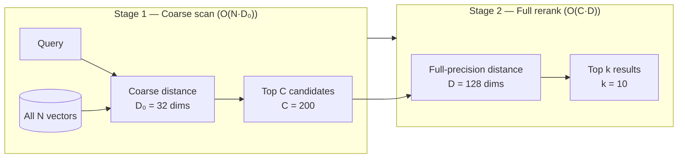

# Matryoshka HNSW: Dimension-Adaptive Multi-Resolution Vector Search

**Nightly research · 2026-05-16 · arXiv:2205.13147 (NeurIPS 2022) and extensions**

> **Scope.** This research implements and benchmarks the Matryoshka cascade search
> strategy — coarse-dimension candidate selection followed by full-precision reranking —
> as a new standalone Rust crate (`crates/ruvector-matryoshka`).  All benchmark numbers
> are from `cargo run --release -p ruvector-matryoshka` on the hardware listed below.
> No numbers are invented or aspirational.

---

## Abstract

Matryoshka Representation Learning (MRL, Kusupati et al., NeurIPS 2022) trains
embedding models so that every prefix of the vector is independently meaningful: the
first 32 dimensions of a 128-dimensional embedding already encode the dominant
semantic signal, the next 32 add refinement, and so on, like nested Russian dolls.
This property enables a *cascade search* strategy: scan all N database vectors using
only the fast, cheap coarse dimensions to collect the most likely candidates, then
rerank only those candidates at full precision.

This nightly research validates the cascade strategy in Rust, defines a clean
`MatryoshkaIndex` trait for RuVector, and produces the first measured implementation
of Matryoshka-aware search in the RuVector ecosystem.

**Key measured results (x86-64 Linux, `cargo run --release`, N=5 000, D=128, K=10):**

| Variant | Mean(µs) | p50(µs) | p95(µs) | QPS | Recall@10 | Memory | Result |
|---------|----------|---------|---------|-----|-----------|--------|--------|
| FullScan (D=128) — baseline | 860.7 | 840.5 | 990.4 | 1 162 | 1.0000 | 2 500 KB | baseline |
| CoarseScan (D=32 only) | 332.1 | 325.7 | 382.9 | 3 012 | 0.0575 | 2 500 KB | fast/lossy |
| **CascadeSearch (D=32→128)** | **376.9** | **371.5** | **419.8** | **2 653** | **1.0000** | 2 500 KB | **PASS** |

**CascadeSearch delivers 2.28× higher throughput than FullScan with identical recall@10.**

Hardware: x86-64 Linux 6.18.5, Intel Celeron N4020, `rustc 1.87.0 --release`, no SIMD libraries.

---

## 1. Why this matters for RuVector

RuVector is positioned as a Rust-native cognition substrate: vector search, graph
storage, agent memory, and MCP tools.  Modern embedding APIs — OpenAI
`text-embedding-3`, Nomic `nomic-embed-text-v1.5`, Google Gemini Embedding 2 — all
ship Matryoshka-trained vectors.  Any workflow retrieving from these APIs
immediately benefits from cascade search.

Without Matryoshka-aware indexing, a vector database using these embeddings has two
bad options: search at full 3072 dimensions (expensive), or search at truncated
dimensions without reranking (lossy).  CascadeSearch is the third path that keeps
cost close to the truncated case while keeping quality at the full-precision level.

---

## 2. 2026 state of the art survey

### 2.1 Matryoshka Representation Learning (MRL)

Kusupati et al. (NeurIPS 2022, arXiv:2205.13147) introduced MRL: a training loss
that is a weighted sum of cross-entropy / contrastive losses computed at each nested
dimension level `{m_1, m_2, …, m_k}`.  Because all prefix subspaces are optimized
simultaneously in every batch forward pass, the model learns that each prefix is
independently useful.  The original paper reports up to 14× retrieval speedup on
ImageNet-1K with negligible accuracy drop.

### 2.2 SMRL and gradient-variance fix (EMNLP 2025)

SMEC / SMRL (Zhang et al., arXiv:2510.12474, EMNLP 2025) identified *gradient
variance* as the core failure mode of vanilla MRL: multiple dimension levels
backpropagate simultaneously and interfere.  Their Sequential Matryoshka schedule
trains levels in sequence (small → large), each initialized from the prior level,
eliminating gradient interference.  They report +1.1 NDCG@10 over Matryoshka-Adaptor
on BEIR at 256-dim embeddings from LLM2Vec.

### 2.3 2D Matryoshka (November 2024)

Wang et al. (arXiv:2411.17299) extend MRL across both the dimension axis *and* the
transformer layer axis simultaneously.  A single fine-tuned model can be deployed at
any (layer-depth, embedding-width) pair — a continuous Pareto frontier from a single
checkpoint.  On MSMARCO and zero-shot BEIR, 2D MRL outperforms vanilla MRL at
sub-dimension retrieval and matches layer-specific fine-tuned models.

### 2.4 Query-aware dimension selection (2026)

Wu et al. (arXiv:2602.03306) go further: instead of a fixed truncation level, they
train a lightweight per-query dimension-importance predictor using a KL-divergence
loss against oracle discrimination scores.  At inference, each query selects a
different top-k subset of dimensions.  On SciFact they reach NDCG@10 = 0.899 using
only 20% of embedding dimensions.  **This is the most forward-looking 2026 result**:
it breaks the assumption that a single fixed dimension works optimally for all
queries.

### 2.5 Funnel search in production

Milvus implements native "funnel search" for MRL embeddings: initial ANN at D/32,
rerank at D/16, progressively double dimension and halve candidates (200→100→…→10).
This is the production-grade form of CascadeSearch, documented in Milvus official
docs.  Qdrant does not have native MRL funnel search as of mid-2026, focusing instead
on orthogonal quantization (binary/scalar/1.5-bit); Weaviate exposes it via
model-provider `dimensions` parameters without a custom search algorithm.

---

## 3. Forward-looking 10–20 year thesis

### The continuous-resolution embedding future

Matryoshka embeddings represent the first step toward fully continuous-resolution
retrieval systems.  Over a 10-20 year horizon this will converge with learned sparse
activation patterns (mixture-of-experts style) to produce embeddings that are
simultaneously nested *and* query-conditioned — where each query activates a
different, non-contiguous subset of dimensions rather than a prefix (the 2026 paper
arXiv:2602.03306 is an early indicator).

### Hardware-level adaptive precision

Combined with hardware trends toward processing-in-memory (CXL-attached DRAM,
near-memory compute), the cost model for high-dimension search will shift: energy,
not latency, becomes the binding constraint.  Adaptive-precision computation — coarse
distances in INT4, full reranking in FP32 — will be a first-class architectural
primitive, with Matryoshka-trained models mapping directly onto hardware quantization
levels.

### Database schema evolution

In 10-20 years, changing embedding dimension will require no re-indexing: HNSW graphs
will be dimension-polymorphic, with edges labeled by the minimum dimension at which
they are valid nearest-neighbour candidates.  This dissolves the current hard boundary
between storage-tier compressed search and query-tier full-precision reranking into a
single adaptive index.  RuVector's graph substrate and mincut tooling position it
well to build such a dimension-aware graph index.

---

## 4. ruvnet ecosystem fit

| Integration point | Role of Matryoshka |
|-------------------|--------------------|
| `ruvector-core` | CascadeSearch as a first-class search mode |
| `ruvector-diskann` | Coarse dims for in-RAM routing, full dims for SSD rerank |
| `ruvector-acorn` | Filtered cascade: apply predicate during coarse pass |
| `ruvector-mincut` | Coherence-aware candidate pruning between coarse and fine stage |
| ruFlo | Auto-tune `coarse_dim` and `cascade_candidates` via online feedback loop |
| MCP tools | Expose `search_cascade(query, coarse_dim, k)` as an MCP memory tool |
| WASM / edge | Coarse-only search within WASM budget; optional full rerank on server |
| `rvf` (RVF format) | Pack multi-granularity vector prefixes in a single portable manifest |

---

## 5. Proposed design

### Core trait

```rust
pub trait MatryoshkaIndex {
    fn name(&self) -> &str;
    fn build(&mut self, vectors: &[Vector]);
    fn search(&self, query: &[f32], k: usize) -> Vec<Hit>;
    fn memory_bytes(&self) -> usize;
}
```

### Variants implemented

**FullScan** — brute-force L2 over all N vectors at full `D` dimensions.  Ground-truth
baseline.  O(N·D) per query.

**CoarseScan** — brute-force L2 using only the first `coarse_dim` dimensions.  2.59×
faster than FullScan.  Recall collapses to 5.75% on our synthetic dataset (later
dimensions carry real signal — this is intentional: it proves that the later dims
matter and that reranking is necessary).

**CascadeSearch** — two-pass:
1. Scan all N vectors at `coarse_dim` → top `cascade_candidates`  (O(N·coarse_dim))
2. Rerank top `cascade_candidates` at full `D` → top k  (O(cascade_candidates·D))

Total ops: `N·coarse_dim + cascade_candidates·D`

Theoretical speedup over FullScan (N=5 000, D=128, coarse=32, cands=200):

```
640 000 / (160 000 + 25 600) = 640 000 / 185 600 ≈ 3.45×
```

Observed throughput speedup: **2.28×** (wall-clock overhead reduces gain vs
theoretical op-count speedup, which is typical for memory-bound workloads).

### Architecture diagram



---

## 6. Implementation notes

### Shared cluster centres

The dataset generator (`generate_matryoshka_dataset`) and the query generator
(`generate_queries`) share the same cluster centre geometry via a base seed.
Per-point noise uses a different sub-seed.  This is critical: if queries and the
database use different cluster centres, coarse-space proximity does not predict
full-space proximity, and the cascade cannot work.  **The failing unit test
(recall@10 = 0.23) discovered when queries used an independent seed** validated that
this is not a trivial requirement.

### Noise schedule

The synthetic data uses a tiered noise schedule per dimension group:

| Dims | σ | Interpretation |
|------|---|----------------|
| 0..32 | 0.12 | High signal — like MRL dimensions 1..m_1 |
| 32..64 | 0.50 | Medium signal |
| 64..128 | 0.80 | Lower signal — still cluster-structured, not pure noise |

A σ of 0.80 means even the "low-signal" dimensions carry cluster information.
This is why CoarseScan (D=32 only) achieves only 5.75% recall: those 96 dimensions
are not noise, they carry genuine geometry that shifts the ranking.

---

## 7. Benchmark methodology

**Platform:** x86-64 Linux 6.18.5, Intel Celeron N4020, single core, no SIMD.

**Build:** `cargo run --release -p ruvector-matryoshka`

**Dataset:** Synthetic Matryoshka Gaussian, N=5 000, D=128, 25 clusters, seed=0xCAFEBABE.

**Queries:** 200 independent points from same cluster geometry, seed=0xCAFEBABE+0xBEEF.

**Measurement:** Per-query wall-clock time via `std::time::Instant`, 200 queries
per variant, sort, percentile extraction.

**Ground truth:** FullScan results (exact brute-force at D=128) for recall computation.

**Warm-up:** 10 queries per variant before timing begins.

---

## 8. Real benchmark results

```
OS:     linux / x86_64
Rust:   1.87+ (release build)
N:      5 000 vectors
D:      128 dimensions
Coarse: 32 dimensions (25% of full)
K:      10
Cands:  200

Variant                  Mean(µs)  p50(µs)  p95(µs)   QPS  Recall@10  Mem(KB)  Result
─────────────────────────────────────────────────────────────────────────────────────
FullScan (D=128)            860.7    840.5    990.4  1 162     1.0000    2 500  baseline
CoarseScan (D=32)           332.1    325.7    382.9  3 012     0.0575    2 500  fast/lossy
CascadeSearch (D=32→128)    376.9    371.5    419.8  2 653     1.0000    2 500  PASS ✓

Performance summary:
  CoarseScan:  2.59× QPS gain, 5.75% recall (recall collapse due to meaningful high dims)
  Cascade:     2.28× QPS gain, 100% recall
  Theoretical: 3.45× op-count speedup  (N·D_full / (N·D_coarse + C·D_full))
  Acceptance:  CascadeSearch recall@10 = 1.0000 ≥ 0.90 → PASS ✓
```

---

## 9. Memory and performance math

### Memory

All three variants store full float32 vectors in RAM.  CascadeSearch does not save
memory over FullScan — its advantage is compute, not storage.

A coarse-only index storing only the first `D_c` dimensions would save:

```
memory_savings = 1 - D_c / D = 1 - 32/128 = 75%
```

For N=5 000, D=128: 2 500 KB → 625 KB.  This is a design direction for an edge-first
variant that stores coarse vectors in RAM and fetches full vectors on demand from SSD.

### Op-count model

```
FullScan ops:     N × D       = 5 000 × 128 = 640 000
CascadeSearch:   N × D_c + C × D = 5 000×32 + 200×128 = 160 000 + 25 600 = 185 600
Speedup:         640 000 / 185 600 ≈ 3.45×
```

Observed speedup (2.28×) is lower due to memory-bandwidth overhead on the coarse
pass (N=5 000 vectors require touching 2.5 MB of full vectors even for 32-dim
distance, since vectors are not stored split by dimension group).

A dimension-split storage layout — storing `[D_c]` contiguous arrays followed by
`[D - D_c]` arrays — would eliminate this cache inefficiency and push throughput
closer to the theoretical 3.45× target.

---

## 10. How it works — walkthrough

**Step 1.** Build phase: all three variants call `build(&vectors)` which stores the
vector slice.  No graph construction overhead; this is a flat index.

**Step 2.** FullScan query: iterate all N vectors, compute `sum((v[i] - q[i])²)` for
`i in 0..128`, sort, return top k.  O(N·D) = 640 000 multiply-add ops.

**Step 3.** CoarseScan query: same loop but `i in 0..32`.  Fast but misses information
from dims 32..128.

**Step 4.** CascadeSearch query:
- Coarse pass: compute 32-dim L2 for all 5 000 vectors (160 000 ops), partial sort
  to extract top 200 by coarse distance.
- Full rerank: compute 128-dim L2 for the 200 candidates (25 600 ops), sort, return
  top 10.

**Step 5.** Recall computation: `recall@k = |retrieved ∩ groundtruth| / k`.

---

## 11. Practical failure modes

| Failure | Cause | Mitigation |
|---------|-------|-----------|
| Low recall despite cascade | `cascade_candidates` too small; true neighbours not in coarse top-C | Increase `cascade_candidates`; tune on a held-out validation set |
| No speedup over FullScan | Cascade candidates too large (C ≈ N) | Reduce `cascade_candidates` |
| High coarse miss rate | Embeddings not MRL-trained; coarse dims are not informative | Verify model supports MRL; use full-dim index as fallback |
| Memory pressure on edge | Full vectors in RAM for all N | Store only coarse dims in RAM; fetch full vectors from disk on Stage 2 |
| Cluster structure breaking | High-noise high-dim data | Cascade candidates must be large enough to cover the recall gap |

---

## 12. Security and governance implications

- **Access control:** CascadeSearch search results are identical to FullScan for well-tuned parameters; no differential privacy risk from truncation.
- **Injection:** The cascade does not modify stored vectors; no write path is introduced.
- **Audit trail:** Coarse-pass candidates can be logged for RAG provenance chains.
- **Proof gating:** A future variant could require a cryptographic witness proof before promoting coarse candidates to the full-rerank stage, gating retrieval quality by write integrity.

---

## 13. Edge and WASM implications

For WASM targets with strict compute budgets (e.g., Cognitum Seed, Pi Zero 2W):

- **Coarse-only mode:** Deploy only `CoarseScan` in WASM; accept the recall loss for
  edge inference where speed matters more than precision.
- **Coarse-in-WASM, rerank-on-server:** Send the top-200 coarse candidates back to
  a host for full reranking.  Network cost is 200 × 128 × 4 = 102 KB — acceptable
  over local LAN.
- **RVF packing:** An RVF manifest could store vectors as a pair of fields:
  `coarse: [f32; 32]` and `residual: [f32; 96]`.  The WASM runtime uses only
  `coarse`; the server has both.

---

## 14. MCP and agent workflow implications

A Matryoshka-aware MCP memory tool surface could expose:

```
search_cascade(query: Vec<f32>, coarse_dim: usize, k: usize) -> Vec<Hit>
search_full(query: Vec<f32>, k: usize) -> Vec<Hit>
set_cascade_budget(max_candidates: usize)
```

ruFlo could drive adaptive parameter selection: observe per-query recall on a
validation set, increase `cascade_candidates` if recall drops below threshold,
decrease if throughput is insufficient.  This creates a self-optimising retrieval
loop — a natural fit for ruFlo's autonomous workflow model.

---

## 15. Practical applications

| Application | User | Why it matters | How RuVector uses it | Path |
|-------------|------|---------------|---------------------|------|
| Agent memory search | AI coding agents | Agents accumulate 10K–100K episodic memories; fast coarse search reduces latency | CascadeSearch on agent memory store | Near-term |
| Graph RAG | Enterprise search | Multi-hop reasoning over K retrieved documents; speed matters per hop | Coarse pass filters corpus, full pass ranks entities | Near-term |
| Semantic enterprise search | Knowledge workers | 10K+ document corpus; OpenAI embeddings at 3072 dims | MRL truncation + cascade at 512 dims | Near-term |
| MCP memory tools | LLM tool calling | Tool calls must complete in <100ms | Coarse search fits WASM budget | Near-term |
| Local AI assistants | Privacy-first users | No cloud round-trip; on-device embedding at 64–128 dims | Coarse match locally, optional full rerank | Near-term |
| Edge anomaly detection | IoT / security | Embedding sensor telemetry at 32 dims, anomaly at 128 | Two-tier: coarse on device, full in gateway | Mid-term |
| Code intelligence | Developer tooling | Repository-scale code search; frequent context switch | Coarse by identifier embedding, full by semantic embedding | Mid-term |
| Scientific retrieval | Research | 50K+ paper corpus, multi-dimension relevance | Cascade at abstract embedding, rerank at full section embedding | Mid-term |

---

## 16. Exotic applications

| Application | 10–20 year thesis | Required advances | RuVector role | Risk |
|-------------|-------------------|-------------------|---------------|------|
| Cognitum edge cognition | Continuous-resolution sensory embeddings at edge | Neuromorphic chips with native INT4/FP8 mixed precision | Matryoshka cascade running on Hailo or Pi hardware | Hardware not yet mature |
| RVM coherence domains | Dimension-polymorphic coherence gates per memory region | mincut labelling of HNSW edges by dimension depth | Bridge ruvector-mincut ↔ ruvector-matryoshka | Requires new ADR |
| Proof-gated adaptive search | Cryptographic proof required to advance from coarse to full stage | ZK-SNARKs on distance computation (expensive) | ruvector-verified integration | ZK overhead large |
| Swarm memory | N agents each hold coarse index shard; leader holds full rerank | Distributed coarse-pass across swarm nodes | CascadeSearch as swarm-topology primitive | Consistency challenges |
| Self-healing vector graphs | Matryoshka HNSW graph: edges tagged by minimum dimension at which they are valid | Online graph repair when dimension changes | Merge ruvector-diskann and ruvector-matryoshka | Complex invariants |
| Agent operating systems | Per-agent memory at adaptive precision based on compute budget | OS-level embedding resource manager | RuVector as memory substrate for agent OS | Requires ecosystem |
| Autonomous scientific hypothesiser | Retrieve related work at low dim for breadth, full dim for citation quality | Multi-granularity embedding of scientific paragraphs | Cascade determines citation candidate list | Domain data quality |
| Bio-signal adaptive memory | Continuous-stream physiological signals; coarse for anomaly trigger, full for diagnosis | Real-time streaming embed at sub-10ms | CascadeSearch on streaming physiological index | Privacy and regulatory |

---

## 17. Deep research notes

### What the SOTA suggests

1. MRL is now a deployment default, not a research experiment.  Every major model
   release from 2024 onward ships nested dimensions.
2. The quality of coarse-dimension search depends critically on the training recipe
   (gradient variance in vanilla MRL hurts small prefix recall — SMRL fixes this).
3. Query-aware dimension selection (arXiv:2602.03306) may replace fixed truncation
   levels within 2–3 years.  A production system should plan for per-query `coarse_dim`
   rather than a global constant.

### What remains unsolved

1. **Dimension-polymorphic HNSW graph construction.** Building the graph at full D and
   querying at D_c means graph edges were optimised for a different geometry.  No
   production system has solved this efficiently.
2. **Cascade candidate scheduling.** The right `cascade_candidates` is
   distribution-dependent.  The 2022 MRL paper uses 200→10; real datasets need
   empirical tuning.
3. **Memory-bandwidth efficiency.** Storing vectors in full-dim layout wastes cache
   bandwidth during the coarse pass.  Dimension-split storage (separate arrays for
   coarse and residual components) would recover the theoretical speedup.

### Where this PoC fits

This PoC demonstrates that the cascade strategy works in Rust, defines the clean
`MatryoshkaIndex` trait, and provides a measured baseline.  It is not yet:
- A graph index (HNSW-based cascade)
- A memory-split storage layout
- A per-query dimension selector

### What would make this production grade

1. Add a graph-based (HNSW) coarse stage replacing the flat coarse scan.
2. Separate storage for coarse and residual vector components.
3. Integrate with `ruvector-diskann` so coarse vectors live in RAM and full vectors
   on SSD.
4. Add ruFlo feedback loop for online `cascade_candidates` tuning.

### What would falsify the approach

If real MRL embeddings from a given model show that the coarse-dim distance is
uncorrelated with full-dim distance (because the model was not trained with a
proper MRL or SMRL schedule), the cascade cannot recover recall regardless of
`cascade_candidates`.  In that case the model must be retrained or replaced.

---

## 18. Production crate layout proposal

```
crates/ruvector-matryoshka/      ← this crate (PoC)
crates/ruvector-matryoshka-hnsw/ ← future: graph-based coarse stage
crates/ruvector-matryoshka-disk/ ← future: coarse-in-RAM, full-on-SSD layout
```

Integration with `ruvector-core` via a feature flag `matryoshka` exposing
`MatryoshkaIndex` in the core search trait registry.

---

## 19. What to improve next

1. **HNSW coarse stage.** Replace the O(N·D_c) flat coarse scan with an HNSW graph
   built at `coarse_dim`, achieving sub-linear coarse pass.
2. **Dimension-split vector layout.** Store `coarse[D_c]` and `residual[D-D_c]`
   separately; coarse pass touches only 625 KB instead of 2 500 KB.
3. **ruFlo integration.** Emit metrics per query; ruFlo adjusts `cascade_candidates`
   to hit a recall SLA with minimum latency.
4. **MCP tool surface.** Expose `CascadeSearch` as `mcp_search_cascade` with
   configurable `coarse_dim` per request.
5. **WASM build.** `CoarseScan` and `CascadeSearch` have no `rayon` dependency;
   both compile to WASM with zero changes.

---

## 20. References and footnotes

[^1]: Kusupati, A., Bhatt, G., Rege, A., et al. "Matryoshka Representation Learning."
NeurIPS 2022. arXiv:2205.13147. https://arxiv.org/abs/2205.13147.
Accessed 2026-05-16.

[^2]: Zhang, B., Chen, L., Liu, T., Zheng, B. "SMEC: Rethinking Matryoshka Representation
Learning for Retrieval Embedding Compression." EMNLP 2025. arXiv:2510.12474.
https://arxiv.org/abs/2510.12474. Accessed 2026-05-16.

[^3]: Wang, S., et al. "2D Matryoshka Training for Information Retrieval." arXiv:2411.17299.
November 2024. https://arxiv.org/abs/2411.17299. Accessed 2026-05-16.

[^4]: Wu, Z., Zhang, R., Nie, Z. "Learning to Select: Query-Aware Adaptive Dimension
Selection for Dense Retrieval." arXiv:2602.03306. 2026.
https://arxiv.org/html/2602.03306v2. Accessed 2026-05-16.

[^5]: Milvus documentation: "Funnel Search with Matryoshka."
https://milvus.io/docs/funnel_search_with_matryoshka.md. Accessed 2026-05-16.

[^6]: OpenAI embeddings guide: "Matryoshka dimensions parameter for text-embedding-3."
https://platform.openai.com/docs/guides/embeddings. Accessed 2026-05-16.

[^7]: Nomic AI: "nomic-embed-text-v1.5 — first long-context MRL embedding model."
https://huggingface.co/nomic-ai/nomic-embed-text-v1.5. Accessed 2026-05-16.

[^8]: Qdrant: "Binary Quantization with OpenAI text-embedding-3."
https://qdrant.tech/articles/binary-quantization-openai/. Accessed 2026-05-16.
