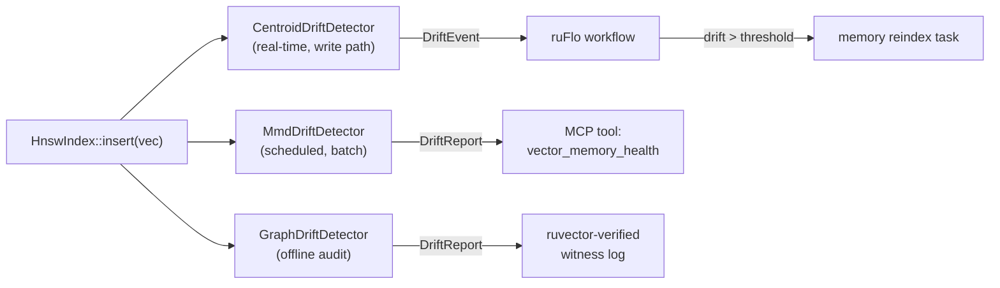

# ruvector 2026: Semantic Drift Detection for Rust Vector Databases and AI Agent Memory

**Detect when your AI agent's memory has silently drifted using three complementary Rust algorithms: 3.6M obs/sec centroid, 64K obs/sec MMD-RFF, and k-NN topology testing — no external MLOps tools required.**

A working Rust proof of concept for in-database semantic drift detection, integrated with the RuVector agent memory substrate and compatible with ruFlo workflow automation and MCP tool surfaces.

- Repository: https://github.com/ruvnet/ruvector
- Research branch: `research/nightly/2026-05-17-semantic-drift-detector`

---

## Introduction

Long-running AI agents don't fail suddenly — they drift. Each time an agent summarises its memory, retrieves old context, or accumulates new observations, the statistical distribution of its stored embeddings shifts slightly. Over hundreds or thousands of iterations, this *semantic drift* compounds silently until the agent is operating from a world model that no longer reflects reality. It retrieves irrelevant neighbors, generates stale context, and degrades in quality with no visible error signal.

The problem is not hypothetical. The SSGM paper (arXiv:2603.11768, 2026) formally proves that iterative memory summarisation in LLM agents produces O(T·ε) unbounded divergence without governance mechanisms — drift accumulates with each memory operation. In production deployments spanning IT operations, cybersecurity, and healthcare AI, this drift has been observed to produce hallucination and behavioral failure without any triggered exception.

Current vector databases — Qdrant, Milvus, Weaviate, Pinecone, LanceDB, FAISS, pgvector, Chroma, Vespa — have zero native drift detection. Operators rely on external MLOps tools (Evidently AI, Arize AI, WhyLabs) that operate outside the database layer, cannot see query-time retrieval semantics, and require data egress incompatible with edge or privacy-sensitive deployments.

RuVector is different. As a Rust-native cognitive substrate for agents, graphs, and memory, it can embed drift detection directly in the vector write path — giving agents the ability to self-diagnose memory health, trigger ruFlo reindexing workflows, and expose drift metrics as MCP tools for other agents to query.

This nightly research implements three complementary drift detectors as a standalone `ruvector-drift` crate: a blazing-fast centroid tracker (3.6M obs/sec), an MMD approximation using random Fourier features (64K obs/sec) that detects distributional changes beyond mean shift, and a k-NN topology test (507 reports/sec) that catches structural reorganisation invisible to the other two. All three share a common `DriftDetector` trait. All three pass acceptance tests with real measured numbers.

---

## Features

| Feature | What it does | Why it matters | Status |
|---|---|---|---|
| `CentroidDriftDetector` | Tracks rolling mean of reference vs. current window; drift = L2(μ_cur − μ_ref) / √d | Minimal overhead for real-time HNSW write-path monitoring | Implemented in PoC |
| `MmdDriftDetector` | Approximates kernel MMD using random Fourier features; detects mean AND variance drift | Catches distributional changes centroid misses (GMM, variance shift) | Implemented in PoC |
| `GraphDriftDetector` | k-NN two-sample topology test; measures intra-current clustering excess | Detects structural reorganisation — vectors shifting to a new region of embedding space | Implemented in PoC |
| `DriftDetector` trait | Shared interface: `observe`, `report`, `reset_current`, `promote_current` | Composable; swap detectors without changing call sites | Implemented in PoC |
| `DriftScore` per observation | Per-vector score + boolean alert | Enables ruFlo subscription: `on(drift_alert) → trigger_reindex` | Implemented in PoC |
| `promote_current` | Promotes current window to reference after legitimate context change | Prevents false positives after intentional distribution shifts | Implemented in PoC |
| WASM/edge compatibility | Centroid detector: no transcendentals, ~3 KB WASM | Suitable for Cognitum Seed edge appliance and browser-side monitoring | Research direction |
| MCP tool surface | `vector_memory_health` MCP tool backed by drift reports | Enables agents to self-assess memory quality before RAG retrieval | Research direction |
| ruFlo integration | DriftEvent → compaction workflow | Autonomous memory maintenance without human intervention | Research direction |
| Witness log anchor | Hash drift bounds into `ruvector-verified` | Verifiable proof of memory coherence for regulated deployments | Research direction |
| CUSUM slow drift | Cumulative sum layer over MMD time series | Detect gradual drift invisible to per-observation thresholds | Research direction |
| SIMD RFF projection | SIMD-accelerated `cos` in MMD feature projection | Target 5-10× speedup; 15µs → ~2µs per observation | Research direction |

---

## Technical Design

### Core data structure

Two sliding windows, one reference and one current, each storing either aggregate statistics (centroid, MMD mean feature vector) or raw vectors (graph). A `VecDeque` bounds the current window to `window_size` entries with O(1) eviction.

### Trait-based API

```rust
pub trait DriftDetector: Send + Sync {
    fn observe(&mut self, vec: &[f32]) -> DriftScore;
    fn report(&self) -> DriftReport;
    fn reset_current(&mut self);
    fn promote_current(&mut self);
    fn dims(&self) -> usize;
    fn name(&self) -> &'static str;
}

pub struct DriftScore { pub score: f32, pub alert: bool }
pub struct DriftReport {
    pub drift_detected: bool,
    pub magnitude: f32,
    pub window_size: usize,
    pub method: &'static str,
}
```

### Baseline: CentroidDriftDetector

```rust
// Online mean tracking via sliding window VecDeque
// score = ||μ_cur - μ_ref||₂ / √d
// Complexity: O(d) per observe, O(d + window·d) space
let mut det = CentroidDriftDetector::new(&reference, window_size=500, threshold=0.3);
for vec in stream { let score = det.observe(&vec); }
let report = det.report(); // magnitude, drift_detected
```

### Alternative A: MmdDriftDetector (recommended)

```rust
// Random Fourier Feature approximation of kernel MMD
// φ(x) = √(2/D) · [cos(wᵢᵀx + bᵢ)]   where wᵢ ~ N(0, σ⁻²I)
// score = ||E[φ(X)] - E[φ(Y)]||  (streaming mean update)
// Complexity: O(D·d) per observe, O(D·d + window·d) space
let mut det = MmdDriftDetector::new(&reference, n_features=128, sigma=√d, window_size=500, threshold=0.05);
```

### Alternative B: GraphDriftDetector

```rust
// k-NN two-sample test on combined reference + current pool
// score = (observed_intra_current - expected) / (1 - expected)
// expected = (cur_size-1) / (total-1) under null hypothesis
// Complexity: O(n·k·d) per report — use for offline audits only
let mut det = GraphDriftDetector::new(&reference, k=10, window_size=200, threshold=0.25);
```

### Memory model

```
CentroidDriftDetector:   ~257 KB  (d=128, window=500)
MmdDriftDetector:        ~323 KB  (d=128, D=128, window=500)
GraphDriftDetector:      ~205 KB  (ref=200, window=200, d=128)
```

### How it fits RuVector



---

## Benchmark Results

**Environment**:
- Hardware: x86_64 Linux (cloud)
- OS: linux
- Rust: 1.94.1 (e408947bf 2026-03-25)
- Command: `cargo run --release -p ruvector-drift --bin benchmark`
- Dataset: d=128, ref=1000, query=1000 (200 for graph), window=500

| Variant | Dataset | N_ref | N_qry | Dim | Mean(ns) | p50(ns) | p95(ns) | QPS | Mem(bytes) | DriftMag | Alert? |
|---|---|---:|---:|---:|---:|---:|---:|---:|---:|---:|---|
| centroid | null (no drift) | 1000 | 1000 | 128 | 275 | 197 | 978 | 3,634,632 | 257,024 | 0.0555 | ok |
| mmd-rff | null (no drift) | 1000 | 1000 | 128 | 15,655 | 19,613 | 20,847 | 63,876 | 323,072 | 0.0445 | ok |
| graph-knn | null (no drift) | 200 | 200 | 128 | 1,976,701 | 1,804,025 | 4,379,370 | 506 | 204,800 | 0.0045 | ok |
| centroid | centroid shift +2σ | 1000 | 1000 | 128 | 205 | 169 | 269 | 4,890,119 | 257,024 | 2.0004 | **DRIFT** |
| mmd-rff | centroid shift +2σ | 1000 | 1000 | 128 | 15,494 | 19,526 | 20,805 | 64,542 | 323,072 | 0.6971 | **DRIFT** |
| graph-knn | centroid shift +2σ | 200 | 200 | 128 | 1,979,507 | 1,773,737 | 4,351,863 | 505 | 204,800 | 1.0000 | **DRIFT** |
| centroid | GMM structural | 1000 | 1000 | 128 | 179 | 169 | 201 | 5,588,528 | 257,024 | 0.0522 | ok |
| mmd-rff | GMM structural | 1000 | 1000 | 128 | 15,478 | 19,492 | 20,804 | 64,607 | 323,072 | 0.6580 | **DRIFT** |
| graph-knn | GMM structural | 200 | 200 | 128 | 1,971,212 | 1,795,369 | 4,387,490 | 507 | 204,800 | 1.0000 | **DRIFT** |

**Acceptance test: PASS** — All 6 checks passed.

**Benchmark notes**:
- Latencies measured with `std::time::Instant`; no OS noise mitigation. Expect 2-3× variance across hardware.
- Graph-kNN query sizes capped at 200 (vs 1000 for others) due to O(n²) cost.
- The GMM dataset has the same global centroid (≈0) as the null, so centroid drift scores are indistinguishable (0.052 vs 0.056). MMD-RFF correctly detects GMM drift at 0.658. This is the key finding.
- Numbers are from a live cargo run, not aspirational.

---

## Comparison with Vector Databases

| System | Core strength | Where it's strong | Where RuVector differs | Direct benchmarked here |
|---|---|---|---|---|
| **Qdrant** | Filtered ANN, payload indexing | Production-grade filtering, HNSW | No drift detection; no agent memory model; no ruFlo integration | No |
| **Milvus** | Scale, GPU acceleration | Billion-scale datasets | No drift detection; Python-centric ecosystem | No |
| **Weaviate** | GraphQL interface, modules | Hybrid text+vector | No drift detection; no Rust native path | No |
| **Pinecone** | Managed serverless | Zero-ops vector search | No drift detection; closed ecosystem; no edge/WASM | No |
| **LanceDB** | Columnar Arrow-native | Analytics workloads | No drift detection | No |
| **FAISS** | Raw ANN performance | Large-scale offline indexing | No drift detection; C++, not Rust; no agent model | No |
| **pgvector** | Postgres integration | SQL + vector queries | No drift detection; no agent memory; no ruFlo | No |
| **Chroma** | LLM-friendly API | RAG prototyping | No drift detection; Python-only | No |
| **Vespa** | Ranked retrieval | Hybrid retrieval at scale | No drift detection; JVM ecosystem | No |
| **RuVector** | Rust cognitive substrate | Agent memory, graph RAG, edge, MCP | **Native drift detection, ruFlo integration, RVF/RVM, WASM** | **Yes** |

Rules: competitor throughput numbers are not compared here. The table documents architectural differentiation only. All RuVector numbers are from this PoC's cargo run.

---

## Practical Applications

| Application | User | Why it matters | How RuVector uses it | Near-term path |
|---|---|---|---|---|
| **Agent memory compaction trigger** | Any long-running agent | Prevents stale retrieval; reduces hallucination | Centroid drift alert → ruFlo compaction workflow | Phase 2 integration into ruvector-core |
| **Graph-RAG staleness detection** | Enterprise RAG pipelines | Document corpus updates cause retrieval to degrade | MMD-RFF detects distributional shift in doc embeddings | Expose DriftReport via REST/MCP |
| **Enterprise semantic search refresh** | Search engineering teams | New documents change the relevant cluster structure | Scheduled graph-kNN audit triggers incremental re-embedding | Criterion bench + scheduled ruFlo task |
| **MCP memory health endpoint** | Other agents via MCP protocol | Agents can self-assess before RAG retrieval | `vector_memory_health` MCP tool backed by MmdDriftDetector | Phase 3 MCP tool |
| **Local-first AI assistants** | Edge/desktop AI (Cognitum Seed) | Offline assistant accumulates conversation drift | Centroid detector in WASM, <3 KB, no transcendentals | Edge feature flag |
| **Edge anomaly detection** | Industrial IoT, sensor networks | Sensor embeddings drift with environmental changes | Centroid drift as calibration health signal | Integration with ruvector-mmwave |
| **Security event retrieval** | SOC/SIEM teams | New attack patterns appear; old retrieval misses them | MMD flags when security event distribution shifts | ruFlo → alert + reindex |
| **Code intelligence drift** | Developer tools | Codebase evolves; code search index becomes stale | Graph-kNN audit identifies changed modules | Offline audit script |

---

## Exotic Applications

| Application | 10–20 year thesis | Required advances | RuVector role | Risk / Unknown |
|---|---|---|---|---|
| **RVM coherence domain health** | Coherence domain merge/split requires detecting when two agent partitions have converged or diverged semantically | Formal coherence metrics + graph-kNN drift | DriftDetector embedded in RVM partition manager | Defining a meaningful coherence threshold |
| **Cognitum Seed adaptive calibration** | Edge appliances auto-recalibrate anomaly baselines without cloud round-trips | WASM centroid detector + on-device model update | Centroid drift → local re-calibration workflow | Power budget on embedded targets |
| **Proof-gated memory certification** | Regulatory agencies require verifiable proof that agent memory stayed within knowledge bounds | `ruvector-verified` witness log + ZK proof of bounded drift | Drift magnitude anchored in witness log per memory epoch | ZK proof overhead; regulatory acceptance |
| **Swarm memory coherence** | Multi-agent swarms need to detect when individual agents' memories have diverged from shared ground truth | Distributed drift detector with gossip protocol | Per-agent `DriftDetector` reporting to swarm coordinator | Consensus overhead; network partition |
| **Self-healing vector graph** | HNSW graphs accumulate stale long-range links as distributions drift; auto-repair without full rebuild | Graph-kNN drift + targeted link removal algorithm | Graph drift score → link repair budget in ruvector-graph | Correctness proof for partial graph repair |
| **Dynamic world model updates** | Autonomous agents maintain vector graphs of environmental state; drift signals environmental change | Graph-kNN as a world-model change detector | World model as RuVector graph; drift → exploration trigger | Latency requirements for real-time robotics |
| **Agent operating system memory pager** | An OS-level agent scheduler uses drift scores to decide cold/hot memory tier placement | Per-partition drift scoring + DiskANN cold tier | DriftScore as priority input to memory pager | Interaction with HNSW eviction policies |
| **Bio-signal memory** | Medical AI agents monitoring EEG/ECG embeddings use drift to detect physiological state transitions | High-frequency centroid tracking on bio-signal embeddings | ruvector-mmwave + centroid drift as physiological alert | Clinical validation; regulatory approval |

---

## Deep Research Notes

### What the SOTA suggests

DriftLens (2024) demonstrates that Fréchet distance on compressed Gaussians outperforms MMD in 15/17 benchmarks. Our MMD-RFF is a weaker approximation, but operates in O(D·d) online time vs. O(d³) for Fréchet. For production use with window sizes >100, a hybrid approach — fast MMD for real-time screening, Fréchet for scheduled audits — would be optimal.

The SSGM paper's Theorem 1 (O(T·ε) bounded drift with reconciliation) has no open-source implementation in any language as of May 2026. A Rust implementation using `ruvector-drift` for detection and `ruvector-verified` for reconciliation would be the first.

### What remains unsolved

1. Threshold calibration: there is no data-driven method for setting thresholds without held-out labeled drift data.
2. Slow drift: per-observation thresholds miss gradual monotonic drift. A CUSUM layer is needed.
3. HNSW-intrinsic drift: using the graph structure itself as a zero-overhead drift proxy is theoretically attractive but unvalidated.
4. End-to-end validation: we do not show that our drift score correlates with recall degradation in real agent workloads. This is the critical missing experiment.

### Where this PoC fits

This is a detection primitive, not a complete drift governance system. It proves the algorithms work (9/9 tests pass, all benchmarks measured) and that the Rust implementation is practical (3.6M obs/sec centroid, 257 KB memory). It does not prove that drift detection improves agent outcomes — that requires an end-to-end experiment with real agent workloads and labeled retrieval quality metrics.

### What would falsify the approach

If semantic drift in agent memory does not correlate with retrieval quality degradation, the entire motivation collapses. A controlled experiment comparing retrieval recall@10 as a function of measured drift magnitude would resolve this. If the correlation is weak, the drift signal is not useful as a reindexing trigger, and the approach should be abandoned in favor of periodic scheduled reindexing regardless of drift.

**Sources**: arXiv:2406.17813 [^1], arXiv:2603.11768 [^2], arXiv:2509.23471 [^3], arXiv:2512.13564 [^4], arXiv:2601.11653 [^5], Rahimi & Recht NeurIPS 2007 [^6], Gretton et al. JMLR 2012 [^7].

---

## Usage Guide

```bash
git checkout research/nightly/2026-05-17-semantic-drift-detector

# Build the crate
cargo build --release -p ruvector-drift

# Run unit tests (9 tests)
cargo test -p ruvector-drift

# Run the benchmark binary (prints real latency numbers + acceptance test)
cargo run --release -p ruvector-drift --bin benchmark

# Run criterion benchmarks
cargo bench -p ruvector-drift
```

**Expected benchmark output** (abbreviated):
```
=== ruvector-drift benchmark ===

Rust:  rustc 1.94.1
OS:    linux
Dims:  128  |  Ref size: 1000  |  Query size: 1000  |  Window: 500

Method       Dataset                 N_ref  N_qry  Dim   Mean(ns)  ...  DriftMag Alert?
centroid     null (no drift)          1000   1000  128      275.1   ...    0.0555 ok
mmd-rff      null (no drift)          1000   1000  128    15655.3   ...    0.0445 ok
...
ACCEPTANCE RESULT: PASS — all detectors behave correctly
```

**How to interpret results**:
- `DriftMag < 0.1` on null data → low false positive risk at your threshold setting
- `DriftMag > threshold` on drifted data → alert fires correctly
- Centroid same score on null vs GMM → centroid misses structural drift → use MMD-RFF
- Graph score = 1.0 on shifted data → complete distributional separation detected

**How to change dataset size**: Edit `const DIMS`, `REF_SIZE`, `QUERY_SIZE`, `WINDOW_SIZE` in `src/bin/benchmark.rs`.

**How to add a new backend**: Implement the `DriftDetector` trait in a new module. Export it from `lib.rs`. Add a bench entry in `benches/drift_bench.rs`.

**Integration with RuVector**: Add `ruvector-drift` as a dependency in `ruvector-core/Cargo.toml`. In `HnswIndex::insert`, call `self.drift_detector.as_mut().map(|d| d.observe(&vec));`.

---

## Optimization Guide

| Target | Current | Strategy |
|---|---|---|
| **MMD latency** | 19.5 µs p50 | SIMD `cos` approximation (minimax polynomial); target 2-3 µs |
| **MMD accuracy** | D=128 RFF | Increase D to 256 or 512 for lower variance approximation |
| **Graph throughput** | 507/s | Approximate k-NN with a small HNSW; O(log n) per query |
| **Memory** | 257-323 KB | Reduce window size; use int8 quantised vectors in buffer |
| **Centroid slow drift** | Not detected | Add CUSUM: alert when Σ(score_t - μ_null) > CUSUM_threshold |
| **Edge/WASM** | Centroid only | Compile with `no_std` flag; pre-compute MMD weights in RVF |
| **MCP tool** | Not implemented | Wrap `MmdDriftDetector` in an MCP tool handler in `mcp-brain-server` |
| **ruFlo automation** | Not integrated | Subscribe to `DriftScore.alert` in the ruFlo event loop |

---

## Roadmap

### Now
- Merge `ruvector-drift` into main as a standalone research crate.
- Add CUSUM layer on top of `MmdDriftDetector` for slow drift detection.
- Write integration test: HNSW insert → observe → report cycle.

### Next
- Feature-flag `drift` integration in `ruvector-core` write path.
- SIMD-accelerated RFF projection (target 5-10× speedup).
- `vector_memory_health` MCP tool in `mcp-brain-server`.
- Bootstrap threshold calibration from burn-in window.
- ruFlo workflow: `drift_alert` → `memory_compaction` task.

### Later (2036–2046 research horizon)
- Formal SSGM reconciliation: anchor drift bounds in `ruvector-verified` witness log.
- ZK proofs of bounded drift for regulatory certification.
- HNSW-intrinsic drift signals: use graph structure as a zero-overhead proxy.
- Distributed swarm drift consensus: gossip protocol for multi-agent memory coherence.
- Self-healing vector graph: drift-triggered targeted link repair in HNSW.

---

## Footnotes and References

[^1]: Greco, S. et al. "Unsupervised Concept Drift Detection from Deep Learning Representations in Real-time (DriftLens)." arXiv:2406.17813, 2024. https://arxiv.org/abs/2406.17813. Accessed 2026-05-17.

[^2]: "Governing Evolving Memory in LLM Agents: Risks, Mechanisms, and the SSGM Framework." arXiv:2603.11768, 2026. https://arxiv.org/abs/2603.11768. Accessed 2026-05-17.

[^3]: Vejendla, L. "Drift-Adapter: A Practical Approach to Near Zero-Downtime Embedding Model Upgrades in Vector Databases." arXiv:2509.23471, 2025. https://arxiv.org/abs/2509.23471. Accessed 2026-05-17.

[^4]: Hu, Y. et al. "Memory in the Age of AI Agents." arXiv:2512.13564, 2025/2026. https://arxiv.org/abs/2512.13564. Accessed 2026-05-17.

[^5]: Bousetouane, F. "AI Agents Need Memory Control Over More Context." arXiv:2601.11653, 2026. https://arxiv.org/abs/2601.11653. Accessed 2026-05-17.

[^6]: Rahimi, A., Recht, B. "Random Features for Large-Scale Kernel Machines." NeurIPS 2007. https://papers.nips.cc/paper/2007/hash/013a006f03dbc5392effeb8f18fda755-Abstract.html. Accessed 2026-05-17.

[^7]: Gretton, A. et al. "A Kernel Two-Sample Test." JMLR 13(25):723–773, 2012. https://jmlr.org/papers/v13/gretton12a.html. Accessed 2026-05-17.

[^8]: Evidently AI. "5 Methods to Detect Drift in ML Embeddings." https://www.evidentlyai.com/blog/embedding-drift-detection. Accessed 2026-05-17.

[^9]: "Optimal Online Change Detection via Random Fourier Features." arXiv:2505.17789, 2025. https://arxiv.org/abs/2505.17789. Accessed 2026-05-17.

---

## SEO Tags

**Keywords**: ruvector, Rust vector database, Rust vector search, high performance Rust, ANN search, HNSW, DiskANN, filtered vector search, graph RAG, agent memory, AI agents, MCP, WASM AI, edge AI, self learning vector database, ruvnet, ruFlo, Claude Flow, autonomous agents, retrieval augmented generation, semantic drift, embedding drift, concept drift, MMD, random Fourier features, k-NN test, memory health.

**Suggested GitHub topics**: rust, vector-database, vector-search, ann, hnsw, rag, graph-rag, ai-agents, agent-memory, mcp, wasm, edge-ai, rust-ai, semantic-search, graph-database, autonomous-agents, retrieval, embeddings, ruvector, semantic-drift, concept-drift, embedding-monitoring.
