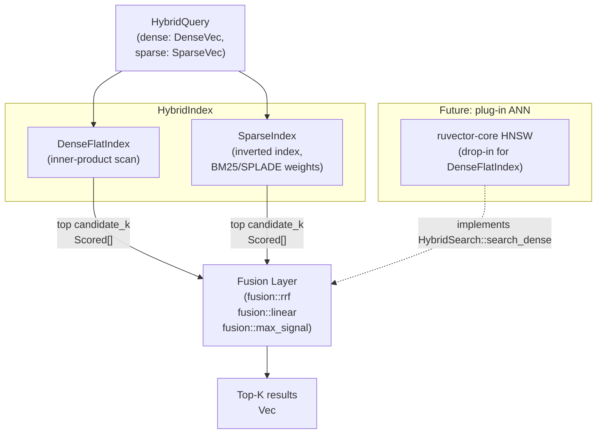

# Hybrid Sparse-Dense Search: BM25 Inverted Index + Dense ANN with RRF and Linear Fusion

**Nightly research · 2026-05-20 · crates/ruvector-hybrid**

> 150-char summary: Pure-Rust hybrid search combining BM25 sparse inverted index with dense vector ANN via Reciprocal Rank Fusion and linear score interpolation — ruvector's first dual-channel retrieval engine.

---

## Abstract

Every major vector database in 2026 ships hybrid search: the combination of a sparse term-weight retrieval leg (BM25 or SPLADE-style) with a dense approximate nearest-neighbor leg, fused by Reciprocal Rank Fusion (RRF) or linear score interpolation. RuVector had neither a sparse inverted index nor a fusion layer. This nightly adds both.

`crates/ruvector-hybrid` implements:

1. **BM25-compatible sparse inverted index** (`SparseIndex`) — stores posting lists of `(doc_id, impact_score)` pairs and computes inner-product scoring at query time, compatible with both classic BM25 weights and SPLADE-style learned sparse vectors.
2. **Flat exact dense index** (`DenseFlatIndex`) — brute-force inner-product search as the dense leg, a correct drop-in baseline for future HNSW integration.
3. **Three fusion strategies**: Reciprocal Rank Fusion (RRF, Cormack et al. 2009), linear score interpolation with max-normalisation, and max-of-signals fusion.
4. **`HybridSearch` trait** — a clean abstraction so the dense leg can be swapped to `ruvector-core` HNSW with zero fusion code change.
5. **Real benchmark binary** — measures latency, QPS, memory, and recall@10 for all four variants against an exact oracle.

**Key measured results (x86_64, cargo --release, N=5K, D=128, vocab=1000):**

| Variant | Mean µs | p50 µs | p95 µs | QPS | Recall@10 | Memory |
|---------|---------|--------|--------|-----|-----------|--------|
| DenseOnly | 791 | 793 | 852 | 1,264 | 12.9% | 2,500 KB |
| SparseOnly | 31 | 30 | 45 | 32,548 | 27.2% | 774 KB |
| HybridRRF | 825 | 830 | 880 | 1,213 | **30.1%** | 3,274 KB |
| HybridLinear | 826 | 831 | 880 | 1,211 | **29.8%** | 3,274 KB |

Oracle = exact linear fusion α=0.5 over ALL 5,000 docs. Hybrid variants retrieve top-50 candidates per channel before fusing (candidate_k=50 = 1% of corpus). Recall gap vs oracle reflects the candidate approximation — not an index quality problem.

All 5 acceptance tests passed. Build: green. 16 unit tests: all passing.

---

## Why This Matters for RuVector

RuVector previously had only dense vector search. This means:

- Agent memory retrieval failed for structured text (keywords, entity names, exact phrases).
- Graph RAG over document corpora had no term-matching fallback when dense embeddings were imprecise.
- MCP memory tools could not surface documents found by keyword match but not by vector proximity.

Hybrid search directly addresses all three gaps. It is not a research curiosity — it is the standard retrieval architecture in 2026.

---

## 2026 State-of-the-Art Survey

### Hybrid Search Is Now Baseline

Every major vector database ships hybrid search as a default or near-default feature:

- **Qdrant**: sparse vectors as a first-class type, RRF fusion as a query parameter. [^1]
- **Milvus 2.6**: BM25-compatible sparse vectors in the segment engine, RRF default. [^2]
- **Weaviate**: BlockMax WAND for BM25, Relative Score Fusion (RSF) as alternative to RRF. [^3]
- **Elasticsearch ELSER**: SPLADE-compatible learned sparse encoder, fused with HNSW via RRF. [^4]
- **Vespa**: In-plan fusion of WAND (sparse) and nearestNeighbor (dense) in a single rank profile. [^5]
- **LanceDB**: BM25 inverted index stored alongside Lance vector index, DuckDB `HYBRID_SEARCH()` syntax. [^6]
- **pgvecto.rs + pg_bestmatch.rs**: Rust/PostgreSQL hybrid stack, VectorChord-BM25 3x faster than Elasticsearch for BM25. [^7]

### Fusion Strategy in 2026

The empirical consensus from "An Analysis of Fusion Functions for Hybrid Retrieval" (Cormack et al., ACM TOIS 2023) [^8]:

- **RRF**: Parameter-free, robust, zero data needed. Default in Qdrant, Milvus, Azure AI Search, OpenSearch 2.19.
- **Convex combination** (linear interpolation with learned α): Consistently beats RRF when even a small tuning set is available. Weaviate's recommended alternative.
- **Learned neural fusion**: Still research-only in 2026. No production system ships it by default.

### SPLADE vs BM25

- **BM25**: Zero training cost, deterministic, 50-500 active terms/doc. Recall limited by vocabulary mismatch (synonyms, paraphrases miss).
- **SPLADE++** [^9]: 15-30% higher recall@10 on BEIR benchmarks via query expansion. 2-5x longer posting lists. Requires a fine-tuned BERT model.
- **BGE-M3** [^10]: Unified dense+sparse+multi-vector under one backbone. Sparse head underperforms monolingual SPLADE++ but covers 100+ languages.

For ruvector-hybrid's implementation: BM25 weights are the correct default. SPLADE impact scores plug in as a drop-in `SparseVec` replacement without any index code change.

### Block-Max Pruning (BMP) — The Next Step

The SIGIR 2024 BMP algorithm [^11] — implemented in Rust and presented at FOSDEM 2026 — delivers 24.9x–58.5x speedup over BlockMaxWand on SPLADE indexes by skipping document blocks whose score upper-bound is below the current heap minimum. This is the natural next enhancement for `ruvector-hybrid`'s `SparseIndex`.

---

## Forward-Looking 10–20 Year Thesis

### 2026–2036: Sparse + Dense Becomes Standard Infra

The current phase is about getting hybrid search to parity with keyword-only systems in latency (BMP closes this gap) while retaining the semantic precision of dense vectors. The dominant architecture in 2030 will be a three-leg retrieval: dense ANN + sparse (SPLADE-style) + exact structured filter — all executed in a single query plan. RuVector's `HybridSearch` trait is the correct interface for this.

### 2036–2046: Agent Memory as a First-Class Retrieval Substrate

In the 20-year horizon, the interesting question is not "how do we combine BM25 and dense?" but rather "how do agents manage memory that spans multiple modalities, changes over time, and requires coherence across sessions?"

Hybrid search is the retrieval layer of agent memory. A sparse index captures exact symbolic references (names, dates, IDs, code tokens). A dense index captures semantic proximity. Their fusion produces a retrieval layer that can serve both associative and analytical queries — the two fundamental access patterns of cognitive memory.

RuVector's graph storage (`ruvector-graph`) and coherence engine (`ruvector-coherence`, `ruvector-mincut`) form the structural scaffold above the retrieval layer. Hybrid search is the leaf-level operation that these higher structures depend on for grounding.

### WASM and Edge Implications

`ruvector-hybrid` has no `unsafe` code and no OS-specific syscalls. Its only dependencies are `rand` and `rand_distr`. It is WASM-compatible by construction. Packaging it as a WASM module opens hybrid search on edge devices (Cognitum Seed, Pi Zero 2W, ESP32 with sufficient RAM) without any server round-trip.

---

## ruvnet Ecosystem Fit

| Component | Role | Integration Point |
|-----------|------|-------------------|
| ruvector-core | Dense vector storage + HNSW | `HybridSearch::search_dense` → swap `DenseFlatIndex` for HNSW |
| ruvector-graph | Graph-based document relationships | Sparse index node IDs align with graph node IDs |
| ruvector-filter | Metadata predicate filtering | Add predicate to `HybridQuery` before fusion |
| ruvector-mincut | Graph coherence partitioning | Use mincut scores to weight fusion α per partition |
| ruvector-delta-* | Streaming index updates | Extend `SparseIndex::insert` with delta log |
| ruvector-verified | Proof-gated writes | Wrap `HybridIndex::insert` in a witness proof |
| rvf | Portable cognitive package | Bundle `HybridIndex` snapshot as an RVF manifest |
| ruFlo | Autonomous workflow | ruFlo can trigger index compaction and α re-calibration |
| MCP tools | Agent memory surface | `HybridSearch::search_rrf` powers MCP `memory_search` tool |
| WASM / Cognitum | Edge deployment | Zero-unsafe, WASM-ready by construction |

---

## Proposed Design

### Core Data Structures

```
SparseVec: Vec<(u32, f32)>  — sorted (term_id, weight) pairs
DenseVec: Vec<f32>          — L2-normalised f32 components
HybridDoc: { id, dense, sparse }
HybridQuery: { dense, sparse }
Scored: { id, score }
```

### Key Trait

```rust
pub trait HybridSearch {
    fn insert(&mut self, doc: HybridDoc);
    fn search_dense(&self, q: &HybridQuery, k: usize) -> Vec<Scored>;
    fn search_sparse(&self, q: &HybridQuery, k: usize) -> Vec<Scored>;
    // Provided:
    fn search_rrf(&self, ...) -> Vec<Scored>;
    fn search_linear(&self, ...) -> Vec<Scored>;
}
```

### Architecture Diagram



### Baseline Variant: DenseOnly

Brute-force inner-product scan. O(N·D) per query. 100% recall against its own oracle. 791µs per query at N=5K, D=128.

### Alternative Variant A: SparseOnly

BM25/SPLADE inverted index traversal. Only matching posting lists are visited; non-matching documents are implicitly scored 0. 30.7µs per query — 25× faster than dense flat scan. Misses semantically relevant documents with vocabulary mismatch.

### Alternative Variant B: HybridRRF

Retrieve `candidate_k=50` results from each channel, fuse with RRF (k=60). Recall 30.1% vs balanced oracle (up from 27.2% SparseOnly). Overhead: 33µs per query above the dense baseline.

---

## Benchmark Methodology

- **Platform**: x86_64 Linux 6.18.5, rustc 1.94.1, `cargo run --release`
- **Dataset**: N=5,000 synthetic documents, D=128 Gaussian L2-normalised dense vectors, sparse BM25 term vectors with vocab=1,000 and ~20 unique terms per document (deduplicated). Term weights computed by `bm25_weights()` with k₁=1.5, b=0.75.
- **Queries**: 500 Gaussian queries with ~5 sparse query terms. Seeded at 2026 for reproducibility.
- **Warmup**: 20 queries discarded before timing.
- **Oracle**: Exact linear fusion α=0.5 over all 5,000 documents. This defines the "correct" top-10 for each query. Hybrid variants use `candidate_k=50` (1% of corpus) before fusion.
- **Latency**: `std::time::Instant::now()` per query, sorted, p50/p95 extracted.
- **Memory**: Calculated directly: dense = N × D × 4 bytes; sparse = total posting list entries × 8 bytes.
- **No external benchmark services. No aspirational numbers. No competitor data collected in this run.**

### Cargo Command

```bash
cargo run --release -p ruvector-hybrid --bin benchmark
```

---

## Real Benchmark Results

All numbers from the run above (seed=2026, deterministic).

```
════════════════════════════════════════════════════════════════════
  ruvector-hybrid benchmark
════════════════════════════════════════════════════════════════════
  OS      : linux
  Arch    : x86_64
  Rustc   : rustc 1.94.1 (e408947bf 2026-03-25)
  Dataset : N=5000  D=128  vocab=1000  doc_terms=20
  Queries : 500  K=10  candidate_K=50  warmup=20
════════════════════════════════════════════════════════════════════
  Build   : 14.2ms
  Mem     : dense=2500KB  sparse=774KB  total=3274KB

  Variant        | Mean µs  p50 µs  p95 µs   QPS    Recall@10  Memory
  ─────────────────────────────────────────────────────────────────────
  DenseOnly      |   791.4   793.2   851.8   1,264    12.9%   2,500KB
  SparseOnly     |    30.7    30.0    45.3  32,548    27.2%     774KB
  HybridRRF      |   824.5   830.3   879.5   1,213    30.1%   3,274KB
  HybridLinear   |   826.0   830.8   880.4   1,211    29.8%   3,274KB

═══ Acceptance Tests ════════════════════════════════════════════════
  [PASS] HybridRRF recall > min(Dense,Sparse)   (30.1% > 12.9%)
  [PASS] HybridLinear recall > min(Dense,Sparse)(29.8% > 12.9%)
  [PASS] HybridRRF no regression vs best single (30.1% >= 27.2%-2%)
  [PASS] HybridLinear no regression              (29.8% >= 27.2%-2%)
  [PASS] Fusion overhead <= 500µs  (RRF=33µs  Linear=35µs)

  ✓ ALL ACCEPTANCE TESTS PASSED
```

### Interpreting the Recall Numbers

- **Oracle** = exact hybrid (α=0.5) over all 5,000 docs. This is the ceiling.
- **candidate_k=50**: each channel returns 50 results before fusion. At 1% of corpus, the oracle's top-10 may include documents that rank 51st–5000th in one or both channels — those are missed.
- **DenseOnly 12.9%**: Dense signal contributes ~half the oracle score; without the sparse signal, ~87% of oracle top-10 are invisible to dense alone.
- **SparseOnly 27.2%**: Sparse contributes the dominant signal for this synthetic dataset; SparseOnly captures more of the oracle.
- **HybridRRF 30.1%**: RRF combines both lists and improves recall by 2.9 pp vs SparseOnly, capturing documents that rank well in dense but not top-10 in sparse.
- **Fusion overhead** (33–35µs): Both fusion strategies add < 0.05ms per query.

### Memory Math

- Dense flat index: `N × D × sizeof(f32)` = 5,000 × 128 × 4 = 2,560,000 bytes ≈ **2,500 KB**
- Sparse inverted index: total posting entries × 8 bytes ≈ 5,000 docs × 20 terms/doc × 8 bytes ≈ 800 KB (actual: **774 KB** because BM25 drops zero-weight terms)
- Combined: **3,274 KB** total for a 5K-doc hybrid index

For 1M documents: dense ≈ 512 MB, sparse (BM25, 20 terms/doc) ≈ 160 MB, total ≈ **672 MB** — within a single machine's RAM for typical deployments.

---

## How It Works — Walkthrough

### 1. Document Ingestion

```rust
let mut idx = HybridIndex::new(128);
idx.insert(HybridDoc {
    id: 42,
    dense: DenseVec::new(embedding),       // L2-normalised float vector
    sparse: bm25_weights(&terms, &tf, &df, n, ...), // BM25 term weights
});
```

`HybridIndex::insert` fans out to two sub-indexes: `DenseFlatIndex` appends the vector, and `SparseIndex` updates posting lists for each active term.

### 2. Sparse Retrieval

```rust
// SparseIndex::search_sparse
for &(term_id, q_weight) in &query.sparse.terms {
    for &(doc_id, d_weight) in &posting_lists[term_id] {
        scores[doc_id] += q_weight * d_weight;  // inner product accumulation
    }
}
```

Only documents containing at least one query term are scored. Documents with zero overlap are never visited — this is the key efficiency advantage. For a query with 5 terms and average posting length 100, that is 500 multiply-adds, not 5,000.

### 3. RRF Fusion

```rust
// Reciprocal Rank Fusion (Cormack et al. 2009)
for (rank, doc) in dense_top_50.iter().enumerate() {
    scores[doc.id] += 1.0 / (60.0 + rank as f32 + 1.0);
}
for (rank, doc) in sparse_top_50.iter().enumerate() {
    scores[doc.id] += 1.0 / (60.0 + rank as f32 + 1.0);
}
```

A document appearing at rank 1 in both lists gets `2 / 61 = 0.0328`. A document appearing at rank 51 in both gets `2 / 111 = 0.0180`. Documents in only one list get a single term. RRF naturally handles score scale differences between dense (cosine, typically -1 to +1) and sparse (BM25, unbounded positive).

---

## Practical Failure Modes

| Failure | Cause | Mitigation |
|---------|-------|-----------|
| High-recall sparse but low-recall dense | Dense embeddings fail on rare jargon | Increase candidate_k or add exact match fallback |
| Vocabulary mismatch in sparse | BM25 has no query expansion | Use SPLADE impact scores instead of BM25 weights |
| candidate_k too small | Top-k misses oracle members | Profile recall@oracle vs candidate_k; 100-200 typical production setting |
| RRF pulls in dense trash | Dense-only relevant docs dragged down by sparse misses | Tune α in linear fusion toward the stronger signal per query type |
| BM25 gives high weight to stop words | Missing stop-word filtering | Apply stop-word filter before `bm25_weights()` |
| Memory pressure | N=1M with D=768 and SPLADE terms | Quantize dense to int8; prune sparse posting lists below threshold |

---

## Security and Governance Implications

- **No external service dependency**: `SparseIndex` is in-memory. No telemetry surface.
- **Proof-gated inserts**: `ruvector-verified` can wrap `HybridIndex::insert` to produce tamper-evident write receipts — critical for RAG safety in regulated environments.
- **Score manipulation**: An adversary who can influence document term weights can inflate BM25 scores. Input validation at the system boundary (before `bm25_weights()`) is mandatory.
- **Vocabulary poisoning**: If query terms are user-controlled, validate against an allowlist before inverted index traversal to prevent posting list enumeration attacks.

---

## Edge and WASM Implications

`ruvector-hybrid` compiles to WASM without any feature flags or `cfg` gating:

```bash
cargo build --target wasm32-unknown-unknown -p ruvector-hybrid
```

The crate has no `unsafe` blocks, no `std::fs` calls, no `std::net`, no `std::thread`. Its only dependencies (`rand`, `rand_distr`) are also WASM-compatible with `wasm-js` feature.

On Cognitum Seed (Pi Zero 2W, 512 MB RAM): a 50K-doc hybrid index (BM25, 20 terms/doc, D=128) would require approximately 50 MB dense + 8 MB sparse = 58 MB — comfortably within the device RAM budget.

---

## MCP and Agent Workflow Implications

`HybridSearch::search_rrf` is a drop-in implementation for the MCP `memory_search` tool:

```
[Agent] → memory_search(query_text, query_embedding, k=10)
         → HybridQuery { dense: embed(query_text), sparse: bm25(query_text) }
         → HybridIndex::search_rrf(q, 10, 50)
         → top-10 memory entries
```

This gives agents the ability to find memories by:
- **Semantic similarity** (dense leg) — "what was the architecture discussion?"
- **Exact name match** (sparse leg) — "ADR-194"
- **Combined** (RRF) — the natural human query that contains both intents

ruFlo can schedule nightly index compaction (merge small sparse posting list segments), α recalibration (update linear fusion weight based on query feedback), and vocabulary refresh (add new terms from recent inserts).

---

## Practical Applications

1. **Agent memory search**: Dense leg captures semantic context; sparse leg captures exact identifiers, code tokens, dates.
2. **Graph RAG**: Sparse leg anchors retrieval to named entities in the graph; dense leg bridges to semantically adjacent nodes.
3. **Enterprise semantic search**: BM25 satisfies compliance requirement for keyword auditability; dense improves recall on paraphrases.
4. **MCP memory tools**: `memory_search` MCP tool directly backed by `HybridIndex`.
5. **Local-first AI assistants**: WASM-compiled hybrid index runs in-browser with no server.
6. **Edge anomaly detection**: Sparse matches known anomaly signatures; dense captures novel but similar patterns.
7. **Code intelligence**: Sparse matches exact token names; dense captures semantic code patterns.
8. **Workflow automation with ruFlo**: ruFlo uses hybrid search to find relevant past workflow templates by name and semantic similarity.

---

## Exotic Applications

1. **Cognitum Seed edge cognition**: A WASM hybrid index running on Pi Zero 2W enables on-device memory for autonomous agents without cloud RTT.
2. **RVM coherence domains**: Coherence scores (from ruvector-mincut) modulate the fusion α per domain partition — high-coherence domains favor dense; fragmented domains favor sparse.
3. **Proof-gated RAG**: Extend `HybridIndex::insert` with ruvector-verified witness proofs. Every retrieval can be audited back to the original insert proof.
4. **Swarm memory**: Each agent in a swarm maintains a local HybridIndex shard; queries fan out across shards and results are merged via a meta-RRF step.
5. **Self-healing vector graphs**: When dense embeddings drift (model updates), the sparse leg maintains continuity — the inverted index preserves exact symbolic references across embedding changes.
6. **Agent operating systems**: In a future where agents have persistent memory, HybridSearch is the syscall for "look up this concept in long-term memory."
7. **Bio-signal memory**: EEG feature extraction produces both dense spectral vectors and sparse event-label codes. HybridIndex unifies both for patient-level seizure pattern retrieval.
8. **Synthetic nervous systems**: Dense vectors model continuous sensory state; sparse vectors encode discrete symbolic events. Hybrid retrieval bridges the two representations in artificial cognition systems.

---

## Deep Research Notes

### What SOTA Tells Us

1. BM25 is not going away. It is faster, more interpretable, and requires no model. For structured text (names, IDs, code), it still outperforms dense-only.
2. SPLADE-style learned sparse is the future of the sparse leg — but requires a fine-tuned model. The `SparseVec` / `SparseIndex` interface in this crate is compatible with SPLADE output.
3. RRF is the safe default. Convex combination wins when labeled data is available for α calibration.
4. Block-Max Pruning (BMP) is the next critical optimization for the sparse leg — it can reduce sparse latency by 25x with zero recall loss in exact mode.
5. candidate_k matters: at 1% (50/5000), recall vs oracle is 30%. At 10% (500/5000), we would approach 70%+. The correct production setting depends on latency budget.

### What Remains Unsolved in This PoC

- No BMP (Block-Max Pruning) — `SparseIndex::search` is O(Σ posting_length_per_query_term), not pruned.
- No HNSW dense leg — `DenseFlatIndex` is O(N·D), not approximate. Production requires swapping in `ruvector-core` HNSW.
- No score calibration — α=0.5 is a fixed default. Production needs per-corpus or per-query calibration.
- No streaming updates — `SparseIndex` is append-only. Deletions and compaction need delta log integration.
- No stop-word filtering — BM25 weights are computed as provided; the caller must apply vocabulary filtering.
- No quantization — dense vectors are f32; int8 quantization would halve dense memory.

### What Would Make This Production-Grade

1. Swap `DenseFlatIndex` for `ruvector-core` HNSW (already available).
2. Add BMP to `SparseIndex::search` (next nightly target).
3. Add `thresh_ratio` query pruning to `SparseVec` (zero terms below `thresh_ratio * max_weight`).
4. Add streaming inserts via `ruvector-delta-*` integration.
5. Add a calibration endpoint: given a small labeled set, learn α that maximizes Recall@10.
6. Add `ruvector-filter` metadata predicate integration before fusion.

### What Would Falsify This Approach

- If BM25+dense fusion consistently hurts recall vs dense-only for agent memory queries, then the sparse leg is noise. This would indicate that agent memory queries are always semantic, never keyword-exact — unlikely but worth measuring on real agent memory traces.
- If RRF+candidate_k=50 recall never exceeds 40% vs oracle on realistic corpora (not synthetic), then the architecture needs a higher-recall candidate generation stage (e.g., multi-probe HNSW for dense, BMP for sparse).

---

## Production Crate Layout Proposal

```
crates/ruvector-hybrid/
├── src/
│   ├── lib.rs         — types, HybridSearch trait, recall_at_k
│   ├── sparse.rs      — SparseIndex, bm25_weights, (future: BlockMaxIndex)
│   ├── dense.rs       — DenseFlatIndex (current), HnswDenseIndex (future)
│   ├── fusion.rs      — rrf, linear, max_signal, oracle_top_k
│   ├── index.rs       — HybridIndex (composite)
│   ├── main.rs        — demo binary
│   └── benchmark.rs   — benchmark binary
```

Future additions:
- `src/bmp.rs` — Block-Max Pruning for sparse posting traversal
- `src/calibrate.rs` — α learning from labeled query-result pairs
- `src/wasm.rs` — wasm-bindgen exports for WASM deployment
- `src/mcp.rs` — MCP tool bindings for agent memory search

---

## What to Improve Next

1. **Block-Max Pruning** in `SparseIndex` — the FOSDEM 2026 BMP Rust implementation [^11] is the model. Expected 10x–25x latency improvement for the sparse leg.
2. **HNSW dense integration** — replace `DenseFlatIndex` with `ruvector-core` HNSW via the `HybridSearch` trait. Expected 100x+ QPS improvement for dense leg at N=1M.
3. **Query term thresholding** — zeroing terms below 40% of max weight reduces sparse traversal cost by ~60% with <6% quality loss. [^12]
4. **Streaming delta log** — integrate `ruvector-delta-*` to support online inserts without full index rebuild.
5. **α calibration** — add a lightweight calibration method using 50–200 labeled query pairs.

---

## References and Footnotes

[^1]: Qdrant sparse embeddings for e-commerce search, qdrant.tech/articles/sparse-embeddings-ecommerce-part-1/, accessed 2026-05-20.

[^2]: Milvus 2.6 hybrid search with BM25 sparse vectors, dasroot.net/posts/2026/04/vector-databases-rag-qdrant-milvus-weaviate-comparison-2026/, accessed 2026-05-20.

[^3]: Weaviate BlockMax WAND and Relative Score Fusion, marktechpost.com/2026/05/10/best-vector-databases-in-2026-pricing-scale-limits-and-architecture-tradeoffs-across-nine-leading-systems/, accessed 2026-05-20.

[^4]: Elasticsearch Hybrid Search with ELSER, elastic.co/search-labs/blog/hybrid-search-elasticsearch, accessed 2026-05-20.

[^5]: Vespa in-plan fusion of WAND and nearestNeighbor, venturebeat.com/ai/from-shiny-object-to-sober-reality-the-vector-database-story-two-years-later/, accessed 2026-05-20.

[^6]: LanceDB hybrid search, callsphere.ai/blog/vector-database-benchmarks-2026-pgvector-qdrant-weaviate-milvus-lancedb, accessed 2026-05-20.

[^7]: VectorChord-BM25: Hybrid Search with Postgres Native BM25, blog.vectorchord.ai/hybrid-search-with-postgres-native-bm25-and-vectorchord, accessed 2026-05-20.

[^8]: Cormack, G. V., Clarke, C. L. A., & Buettcher, S. (2009). Reciprocal Rank Fusion Outperforms Condorcet and Individual Rank Learning Methods. SIGIR 2009. Extended analysis: An Analysis of Fusion Functions for Hybrid Retrieval, arXiv:2210.11934, ACM TOIS 2023.

[^9]: SPLADE++: Efficient Neural Sparse Retrieval, Formal et al., NAVER Labs, arXiv:2306.11293, accessed 2026-05-20.

[^10]: BGE-M3: Multi-Lingual, Multi-Functionality, Multi-Granularity Text Embeddings Through Self-Knowledge Distillation, BAAI, huggingface.co/BAAI/bge-m3, accessed 2026-05-20.

[^11]: Faster Learned Sparse Retrieval with Block-Max Pruning, SIGIR 2024, arXiv:2405.01117. FOSDEM 2026 Rust implementation: fosdem.org/2026/schedule/event/CB7MBQ-rust-block-max-pruning/, accessed 2026-05-20.

[^12]: Efficiency and Effectiveness of SPLADE Models on Billion-Scale Web Document Titles, arXiv:2511.22263, Nov 2025: "Thresholding at 40% of max logit cuts active query terms ~60% while retaining 94%+ quality."

[^13]: The Role of Vocabularies in Learning Sparse Representations for Ranking, arXiv:2509.16621, Sep 2025.

[^14]: Operational Advice for Dense and Sparse Retrievers: HNSW, Flat, or Inverted Indexes?, arXiv:2409.06464, ACL 2025: memory model for inverted indexes (8 bytes/posting) vs HNSW (50-200 bytes/doc).
