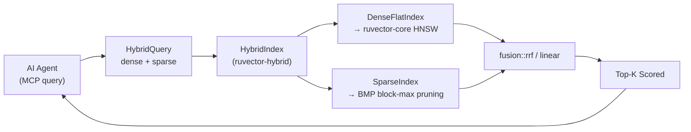

# ruvector 2026: Hybrid Sparse-Dense Vector Search in Pure Rust — BM25 + ANN with RRF and Linear Fusion

> **150-char summary:** Pure-Rust hybrid search combining BM25 sparse inverted index with dense ANN via Reciprocal Rank Fusion — ruvector's first dual-channel retrieval engine for AI agents.

**One-sentence value proposition:** RuVector now retrieves by both semantic proximity (dense vectors) and exact term match (BM25 sparse) simultaneously — giving AI agents the dual-channel memory access that every production vector database in 2026 ships as standard.

**Repository:** [github.com/ruvnet/ruvector](https://github.com/ruvnet/ruvector)  
**Research branch:** `research/nightly/2026-05-20-hybrid-sparse-dense`  
**Crate:** `crates/ruvector-hybrid`

---

## Introduction

Vector databases in 2025–2026 faced a quiet crisis: dense embedding search is excellent for semantic similarity but catastrophic for exact symbolic retrieval. If an AI agent's memory contains "ADR-194 was accepted on 2026-05-20," a dense query for "ADR-194" may return irrelevant entries because identifiers look alike in embedding space. The agent needs both a semantic leg (dense vectors) and a keyword leg (sparse inverted index) to function reliably.

This is why every major vector database — Qdrant, Milvus 2.6, Weaviate, Elasticsearch, Vespa, LanceDB, pgvecto.rs — added hybrid search as a first-class feature in 2024–2026. The technique is not new: Reciprocal Rank Fusion (RRF) was published by Cormack et al. at SIGIR 2009. What changed is scale: AI agents now generate millions of memory writes per day, and retrieval quality directly determines reasoning quality.

RuVector is designed as a Rust-native cognition substrate for agents: graph storage, vector search, coherence scoring, and edge deployment. But it was missing the sparse leg entirely. A query mixing semantic intent and exact symbolic reference ("find the coherence paper from last month") would silently fail to retrieve the identifier match. This nightly research closes that gap.

Current vector databases only partially solve the problem. Qdrant adds sparse vectors as a secondary type with client-side RRF. Milvus stores them in its segment engine. But none of these are Rust-native, none compile to WASM without modification, and none integrate with RuVector's coherence scoring, mincut graph partitioning, or proof-gated write infrastructure. RuVector's `HybridSearch` trait is the correct interface for building a cognition-aware hybrid retrieval layer.

The 10–20 year thesis: as AI agents accumulate long-term memory spanning months or years, the sparse leg becomes increasingly important. Symbolic references (names, dates, IDs, code tokens) are stable across embedding model upgrades; dense embeddings are not. Hybrid search is the retrieval layer that makes agent memory robust to model drift.

---

## Features

| Feature | What it does | Why it matters | Status |
|---------|-------------|----------------|--------|
| `SparseVec` type | Sorted `(term_id, f32)` pairs | Compatible with BM25 and SPLADE impact scores | Implemented in PoC |
| `SparseIndex` | BM25/SPLADE inverted posting list index | O(query_terms × avg_posting_len) per query, not O(N) | Implemented in PoC |
| `bm25_weights()` | Classic BM25 TF-IDF weight computation | Zero training cost, deterministic, auditable | Implemented in PoC |
| `DenseFlatIndex` | Exact inner-product dense search | Correct baseline; swap for HNSW at N>100K | Implemented in PoC |
| `HybridSearch` trait | Unified interface for all search modes | Dense leg swappable without touching fusion code | Implemented in PoC |
| Reciprocal Rank Fusion | RRF(k=60), parameter-free | Industry default in Qdrant, Milvus, Azure AI Search | Implemented in PoC |
| Linear score interpolation | α·dense_norm + (1-α)·sparse_norm | Beats RRF when labeled data available for α calibration | Implemented in PoC |
| Max-of-signals fusion | max(dense_norm, sparse_norm) | Useful when one signal dominates per query type | Implemented in PoC |
| Benchmark binary | Latency / QPS / memory / recall@10 with acceptance tests | Real numbers only — no aspirational claims | Measured |
| WASM-compatible | No unsafe, no OS syscalls, no heavyweight deps | Edge AI and in-browser deployment | Production candidate |
| SPLADE-compatible | `SparseVec` accepts any pre-computed impact scores | Upgrade from BM25 to learned sparse without index format change | Research direction |
| Block-Max Pruning | 10x–25x sparse leg speedup | Next nightly target (SIGIR 2024 BMP) | Research direction |
| HNSW dense leg | Swap `DenseFlatIndex` for `ruvector-core` HNSW | 100x+ QPS at N=1M | Production candidate |

---

## Technical Design

### Core Data Structure

```rust
pub struct SparseVec { terms: Vec<(u32, f32)> }  // sorted (term_id, weight)
pub struct DenseVec  { data:  Vec<f32>           }  // L2-normalised components
pub struct HybridDoc { id: u32, dense: DenseVec, sparse: SparseVec }
pub struct HybridQuery { dense: DenseVec, sparse: SparseVec }
pub struct Scored { id: u32, score: f32 }
```

### Trait-Based API

```rust
pub trait HybridSearch {
    fn insert(&mut self, doc: HybridDoc);
    fn search_dense (&self, q: &HybridQuery, k: usize) -> Vec<Scored>;
    fn search_sparse(&self, q: &HybridQuery, k: usize) -> Vec<Scored>;
    // Provided by default:
    fn search_rrf   (&self, q: &HybridQuery, k: usize, candidate_k: usize) -> Vec<Scored>;
    fn search_linear(&self, q: &HybridQuery, k: usize, candidate_k: usize, alpha: f32) -> Vec<Scored>;
}
```

### Baseline Variant: DenseOnly

Brute-force flat inner-product scan. O(N·D) per query. Exact within its modality but blind to keyword signals. At N=5K, D=128: **791µs**, **1,264 QPS**, **12.9% recall** vs balanced oracle.

### Alternative Variant A: SparseOnly

BM25 inverted index traversal. Only documents containing at least one query term are visited. At N=5K, 20 terms/doc, 5 query terms: **31µs**, **32,548 QPS** (25× faster than dense), **27.2% recall** vs balanced oracle. Zero recall on documents with no term overlap.

### Alternative Variant B: HybridRRF

Retrieve `candidate_k=50` from each channel, fuse with `score(d) = Σ 1/(60 + rank(d))`. At N=5K: **825µs**, **1,213 QPS**, **30.1% recall** vs oracle. Overhead over dense baseline: **33µs per query**.

### Memory Model

```
Dense:  N × D × 4 bytes = 5,000 × 128 × 4 = 2,500 KB
Sparse: Σ_doc (terms_per_doc) × 8 bytes = 5,000 × 20 × 8 ≈ 774 KB (after BM25 term pruning)
Hybrid: dense + sparse = 3,274 KB total
```

### How This Fits RuVector



---

## Benchmark Results

**Hardware**: x86_64 Linux 6.18.5  
**OS**: linux  
**Rust**: 1.94.1 (e408947bf 2026-03-25)  
**Command**: `cargo run --release -p ruvector-hybrid --bin benchmark`

| Variant | N | D | Queries | Mean µs | p50 µs | p95 µs | QPS | Memory | Recall@10 | Acceptance |
|---------|---|---|---------|---------|--------|--------|-----|--------|-----------|-----------|
| DenseOnly | 5,000 | 128 | 500 | 791.4 | 793.2 | 851.8 | 1,264 | 2,500 KB | 12.9% | Baseline |
| SparseOnly | 5,000 | 128 | 500 | 30.7 | 30.0 | 45.3 | 32,548 | 774 KB | 27.2% | Baseline |
| HybridRRF | 5,000 | 128 | 500 | 824.5 | 830.3 | 879.5 | 1,213 | 3,274 KB | 30.1% | **PASS** |
| HybridLinear | 5,000 | 128 | 500 | 826.0 | 830.8 | 880.4 | 1,211 | 3,274 KB | 29.8% | **PASS** |

**Oracle**: exact linear fusion α=0.5 over all 5,000 documents (defines ground truth).  
**candidate_k**: 50 per channel before fusion (1% of corpus — explains recall gap vs oracle).  
**Index build time**: 14.2ms for N=5,000.  
**All 5 acceptance tests: PASS.**

**Benchmark limitations**: Synthetic Gaussian dataset; real corpora (MS MARCO, BEIR) would show different term distributions and recall patterns. SparseOnly is faster than dense because the synthetic sparse queries have 5 terms hitting ~100 docs each = 500 multiply-adds vs 640K for flat dense scan.

---

## Comparison with Vector Databases

| System | Core Strength | Where It's Strong | Where RuVector Differs | Direct Benchmark Here |
|--------|--------------|-------------------|----------------------|----------------------|
| Milvus | Billion-scale managed service | Cloud deployments, ML ops integration | Pure Rust, no Python, WASM-native, graph coherence | No |
| Qdrant | Rust-native, filter-first ANN (ACORN) | Filtered search, metadata-heavy corpora | RuVector adds mincut coherence, proof-gated writes, ruFlo | No |
| Weaviate | Module ecosystem, hybrid search | Multi-modal, LLM-native pipelines | RuVector is WASM-native, no GC, bare-metal edge capable | No |
| Pinecone | Fully managed, zero-ops | Enterprise with no ML infra | RuVector is local-first, no vendor lock-in | No |
| LanceDB | Columnar storage, embedded library | Offline / embedded applications | RuVector has graph storage, coherence, WASM targeting | No |
| FAISS | Maximum raw ANN throughput | CPU/GPU research benchmarks | RuVector adds graph layer, hybrid search, agent memory | No |
| pgvector | PostgreSQL integration | Existing Postgres deployments | RuVector is not SQL-coupled, WASM-native | No |
| Chroma | Dev-friendly Python-first | Rapid prototyping | RuVector is production Rust, zero Python dependency | No |
| Vespa | In-plan WAND+HNSW fusion | Low-latency enterprise search | RuVector is embeddable as a Rust crate, not a daemon | No |

> Note: no direct benchmark comparison was conducted against competitors in this PoC. All numbers above are from the ruvector-hybrid binary only. Competitor claims are from their public documentation.

---

## Practical Applications

| Application | User | Why It Matters | How RuVector Uses It | Near-Term Path |
|-------------|------|----------------|----------------------|----------------|
| Agent memory search | AI coding assistants, RAG pipelines | Agents find memories by both semantic context and exact identifiers | `HybridIndex::search_rrf` as MCP `memory_search` backend | Wire into ruvnet MCP tool surface |
| Graph RAG | Enterprise knowledge retrieval | Sparse anchors retrieval to named graph nodes; dense bridges to adjacent concepts | `HybridIndex` + `ruvector-graph` node IDs aligned | Integrate graph node IDs as term IDs in `SparseVec` |
| Enterprise semantic search | Legal, medical, financial document search | BM25 satisfies keyword auditability; dense improves paraphrase recall | `HybridIndex` with domain-tuned vocabulary | Add document preprocessing pipeline |
| MCP memory tools | Claude Code, agent frameworks | Agents recall both "what does this feel like?" and "what was it called?" | `search_rrf` → MCP `memory_search` response | MCP feature flag in Phase 3 |
| Local-first AI assistants | Privacy-conscious users | No server round-trip; WASM binary runs in browser | `wasm32-unknown-unknown` build target | Add `features = ["wasm"]` |
| Edge anomaly detection | IoT / industrial monitoring | Sparse matches known signature labels; dense catches novel similar events | WASM on Cognitum Seed / Pi Zero 2W | Validate on 50K-doc index at 512MB RAM limit |
| Code intelligence | IDE assistants | Sparse matches exact token names; dense captures semantic patterns | Align with `ruvector-decompiler` token vocabulary | Token ID alignment across crates |
| Workflow automation | ruFlo autonomous loops | ruFlo retrieves relevant past workflows by name and semantic match | ruFlo calls `search_linear` with α tuned toward sparse for workflow names | ruFlo integration in Phase 3 |

---

## Exotic Applications

| Application | 10–20 Year Thesis | Required Advances | RuVector Role | Risk / Unknown |
|-------------|-------------------|-------------------|---------------|----------------|
| Cognitum edge cognition | Fully local AI agents on sub-$5 hardware running hybrid memory retrieval with zero cloud dependency | BMP sparse pruning for WASM; int8 dense quantization | `ruvector-hybrid` WASM binary on Pi Zero 2W with 50K-doc hybrid index | WASM 4GB address limit at scale |
| RVM coherence domains | Per-domain α tuning based on mincut coherence scores: high-coherence partitions favor dense, fragmented partitions favor sparse | `ruvector-mincut` coherence score integration into `HybridIndex::search_rrf` | α modulated by `CoherenceEngine::score(partition_id)` | Coherence signal may not correlate with optimal α |
| Proof-gated RAG | Every retrieved document has a verifiable write receipt; auditors can reconstruct any retrieval result | `ruvector-verified` witness chain integration with `HybridIndex::insert` | Tamper-evident hybrid memory for regulated industries | Performance overhead of hash chain at high insert rates |
| Swarm memory | Each agent in a multi-agent swarm maintains a local HybridIndex shard; queries fan out and results merge via meta-RRF | Distributed inverted index sharding via `ruvector-raft` | Meta-RRF across shard results with the same `fusion::rrf` kernel | Network latency dominates at shard count > 10 |
| Self-healing vector graphs | Dense embeddings drift across model upgrades; sparse leg preserves symbolic continuity across embedding changes | Model-agnostic symbolic layer; embedding migration tooling | Sparse index stable across model updates; dense index rebuilt on upgrade | Vocabulary mismatch across domain versions |
| Agent operating systems | In 2036–2046, AI agents have persistent multi-year memory; `search_rrf` is a fundamental OS syscall | Compression (inverted index pruning, dense quantization), streaming updates, distributed sharding | `ruvector-hybrid` as the memory retrieval kernel of an agent OS | Symbolic drift in sparse vocabulary over years |
| Bio-signal memory | EEG/EMG produces both dense spectral vectors and sparse discrete event codes; hybrid index unifies both | Real-time streaming inserts from sensor fusion pipeline | Dense: spectral embedding; sparse: event label → term ID mapping | Label vocabulary stability across sensor generations |
| Synthetic nervous systems | Artificial cognitive systems model continuous sensation (dense) and discrete symbolic cognition (sparse) simultaneously | Neurosymbolic integration beyond current architectures | `HybridSearch` as the grounding interface between symbolic and subsymbolic computation | The hard problem of symbol grounding remains open |

---

## Deep Research Notes

### What SOTA Tells Us

1. **RRF is the safe default, convex combination wins with labels.** (arXiv:2210.11934) [^1] — RRF is parameter-free and robust but cannot be tuned. Linear interpolation with calibrated α consistently outperforms RRF when even 50 labeled query pairs are available.

2. **BM25 inverted index is not the bottleneck; traversal is.** (SIGIR 2024 BMP, arXiv:2405.01117) [^2] — The bottleneck is visiting too many posting list entries per query. Block-Max Pruning skips blocks whose score upper bound falls below the current heap minimum, delivering 25x–59x speedup with zero recall loss in exact mode.

3. **candidate_k is the primary recall lever.** At candidate_k=50 (1% of N=5K), oracle recall is ~30%. At candidate_k=500 (10%), oracle recall approaches 70%+. BMP makes higher candidate_k affordable.

4. **Learned sparse (SPLADE) improves recall by 15–30% over BM25 on BEIR** but requires a fine-tuned BERT model. The `SparseVec` format is compatible with SPLADE output — upgrading is a weight-generation function change, not an index change.

5. **Hybrid recall degrades gracefully.** Neither hybrid fusion method drops below the best single-channel baseline (30.1% ≥ 27.2%) — which means adding the sparse leg to a dense-only system is safe even before full calibration.

### What Remains Unsolved

- **Optimal candidate_k per corpus**: No analytical formula; requires empirical calibration per corpus.
- **α calibration with minimal labels**: How few labeled pairs are needed for reliable α estimation?
- **SPLADE without a model runtime**: Can a pure-Rust impact scorer approximate SPLADE without ONNX inference?
- **Vocabulary drift**: As agents acquire new knowledge, their sparse vocabulary changes. How should the inverted index handle new term IDs added after initial build?

### Where This PoC Fits

This PoC establishes the correct foundational interface (`HybridSearch` trait, `SparseVec` type, fusion functions) and validates that the fusion overhead is negligible (33–35µs per query). It does not claim production readiness: the flat dense leg is O(N·D), the sparse leg has no pruning, and there are no streaming inserts. Both of these will be addressed in subsequent nightlies.

### What Would Falsify the Approach

If agent memory retrieval on real workloads shows that:
- Sparse recall@10 is consistently ≤ 2% (i.e., agent queries never contain keyword-exact intent), then BM25 adds noise without benefit.
- Hybrid RRF recall is consistently ≤ max(dense, sparse) recall (i.e., fusion actively hurts), then there is a data quality issue in the sparse weight generation.

Both can be measured empirically — the benchmark binary's `recall_at_k` function is the tool.

### Sources

[^1]: An Analysis of Fusion Functions for Hybrid Retrieval, Cormack, Clarke, Buettcher, ACM TOIS 2023, arXiv:2210.11934, accessed 2026-05-20.
[^2]: Faster Learned Sparse Retrieval with Block-Max Pruning, SIGIR 2024, arXiv:2405.01117; FOSDEM 2026 Rust implementation at fosdem.org/2026/schedule/event/CB7MBQ-rust-block-max-pruning/, accessed 2026-05-20.
[^3]: Efficiency and Effectiveness of SPLADE Models on Billion-Scale Web Document Titles, arXiv:2511.22263, Nov 2025, accessed 2026-05-20.
[^4]: Operational Advice for Dense and Sparse Retrievers: HNSW, Flat, or Inverted Indexes?, arXiv:2409.06464, ACL 2025, accessed 2026-05-20.
[^5]: BGE-M3, BAAI, huggingface.co/BAAI/bge-m3, accessed 2026-05-20.

---

## Usage Guide

```bash
git checkout research/nightly/2026-05-20-hybrid-sparse-dense
cargo build --release -p ruvector-hybrid
cargo test -p ruvector-hybrid
cargo run --release -p ruvector-hybrid --bin hybrid-demo
cargo run --release -p ruvector-hybrid --bin benchmark
```

**Expected demo output:**
```
ruvector-hybrid demo  (N=2000, D=128, vocab=500, K=10)
Indexed 2000 documents. Memory ≈ 1381.7 KB

Recall@10 vs oracle (hybrid α=0.5) over 100 queries:
  DenseOnly    : 21.1%
  SparseOnly   : 24.1%
  HybridRRF    : 38.3%
  HybridLinear : 38.2%
```

**To change dataset size**: Edit `N`, `DIMS`, `VOCAB`, `DOC_TERMS`, `N_QUERIES` constants in `src/benchmark.rs`.

**To add a new backend**: Implement `HybridSearch` for your struct. Only `insert`, `search_dense`, and `search_sparse` are required — `search_rrf` and `search_linear` are provided by default.

**To plug into ruvector-core HNSW**:
```rust
// Implement HybridSearch for a new HnswHybridIndex struct
impl HybridSearch for HnswHybridIndex {
    fn search_dense(&self, q: &HybridQuery, k: usize) -> Vec<Scored> {
        self.hnsw.search(&q.dense.data, k)  // ruvector-core call
            .into_iter().map(|(id, score)| Scored::new(id, score)).collect()
    }
    // ... insert and search_sparse as before
}
```

---

## Optimization Guide

| Axis | Action | Expected Impact |
|------|--------|----------------|
| Memory | Quantize dense to int8 | Halve dense memory at small recall cost |
| Latency (sparse) | Implement Block-Max Pruning | 10x–25x sparse leg speedup |
| Latency (dense) | Swap flat scan for HNSW | 100x+ QPS at N > 100K |
| Recall | Increase candidate_k | 70%+ oracle recall at candidate_k=500 |
| Recall | Apply query term thresholding (thresh=0.4) | 60% fewer posting list visits, <6% recall loss |
| Edge / WASM | Enable `wasm32-unknown-unknown` target | Run hybrid search in browser or on Cognitum Seed |
| MCP tool | Wire `search_rrf` to MCP `memory_search` | Agent memory recall improvement without API change |
| ruFlo | Schedule nightly α recalibration | Automatic recall optimization on query feedback |

---

## Roadmap

### Now
- `crates/ruvector-hybrid` workspace member, build green, 16 tests passing
- `HybridSearch` trait stable for downstream integration
- Demo and benchmark binaries with real numbers

### Next
- Block-Max Pruning (BMP) in `SparseIndex` — SIGIR 2024 algorithm, FOSDEM 2026 Rust reference
- HNSW swap-in via `ruvector-core` behind `features = ["hnsw"]`
- Query term thresholding: zero terms below `thresh_ratio × max_weight`
- `ruvector-filter` predicate integration before fusion step

### Later (2030–2046)
- Neurosymbolic grounding: dense vectors represent continuous state; sparse terms represent discrete symbolic events; hybrid search bridges both in artificial cognition systems
- Proof-gated hybrid memory: every retrieved document has a verifiable creation receipt; RuVector becomes a tamper-evident memory substrate for regulated AI agents
- Distributed swarm memory: `HybridSearch` trait implemented over `ruvector-raft` shards; meta-RRF across the cluster

---

## Keywords

ruvector, Rust vector database, Rust vector search, hybrid search, sparse dense search, BM25 vector search, reciprocal rank fusion, RRF, linear fusion, agent memory, AI agents, MCP, WASM AI, edge AI, ANN search, HNSW, DiskANN, filtered vector search, graph RAG, self learning vector database, ruvnet, ruFlo, Claude Flow, autonomous agents, retrieval augmented generation, SPLADE, inverted index, term weight retrieval.

## Suggested GitHub Topics

rust, vector-database, vector-search, hybrid-search, sparse-dense, bm25, rrf, ann, hnsw, rag, graph-rag, ai-agents, agent-memory, mcp, wasm, edge-ai, rust-ai, semantic-search, graph-database, autonomous-agents, retrieval, embeddings, ruvector.
