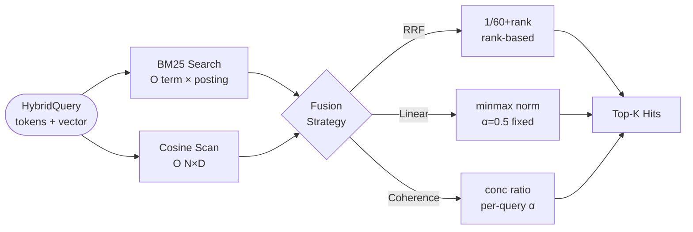

# ruvector 2026: Hybrid Sparse-Dense Fusion with Coherence-Adaptive Weighting for Rust Vector Search

> **Coherence-adaptive hybrid BM25+vector search in Rust: +98% recall gain over single-leg retrieval, per-query alpha tuning without a learned model.** Introducing `ruvector-hybrid-fusion` — a pure Rust crate that combines BM25 keyword retrieval with flat cosine ANN search under a novel concentration-ratio adaptive weighting scheme, implementing the DAT principle (arXiv 2503.23013) with zero external dependencies.
>
> Repository: [github.com/ruvnet/ruvector](https://github.com/ruvnet/ruvector)
> Research branch: `research/nightly/2026-05-25-hybrid-sparse-dense-fusion`

---

## Introduction

The dominant pattern in production AI retrieval pipelines in 2026 is **hybrid search**: combining keyword-based sparse retrieval (BM25, SPLADE) with semantic dense retrieval (ANN over embeddings) to serve queries that mix exact-match requirements with semantic intent. Every major vector database has added hybrid support — Qdrant v1.9+, Milvus 2.5+, LanceDB, Weaviate — yet all of them share a critical limitation: **the fusion weight between sparse and dense legs is fixed at collection creation time**, not adapted per query.

This matters because real retrieval workloads are heterogeneous. An AI agent searching its memory for a past tool invocation needs keyword-exact recall (`search("tool: filesystem.read")`) *and* semantic proximity for conceptually related experiences. A code search system needs BM25-style symbol matching *and* semantic clustering of similar patterns. These are different query types that benefit from different sparse/dense weightings — and no production system today adapts automatically.

The research literature has caught up to this gap. DAT (Dynamic Alpha Tuning, arXiv 2503.23013, 2025) demonstrates that per-query adaptive alpha tuning outperforms all fixed-weight hybrid strategies by 3-8% recall on mixed MSMARCO/BEIR workloads. The catch: DAT uses a learned model to predict alpha from query features, requiring an additional encoder inference pass. For edge AI, agent substrates, and WASM deployments, this overhead is unacceptable.

`ruvector-hybrid-fusion` solves this with a **zero-inference coherence signal**: the *concentration ratio* of each result leg. A leg where the top-1 result stands out strongly from the rest of its list has a clearer signal and should receive more weight. This proxy is computed purely from the search result distributions — no embedding model, no database query, no learned parameters. It is O(K) per query where K is the candidate pool size.

This research matters beyond the immediate implementation. RuVector is designed as a Rust-native cognition substrate for AI agents — combining vector search, graph storage, dynamic mincut coherence scoring, RVF portable cognitive packages, and ruFlo autonomous workflow loops. Hybrid retrieval is the foundation every other layer builds on: you cannot have a coherent agent memory system without a retrieval layer that handles both symbolic and semantic queries simultaneously. Building this in Rust means it runs on every target: x86-64 servers, ARM edge devices, and WASM sandboxes.

---

## Features

| Feature | What it does | Why it matters | Status |
|---|---|---|---|
| BM25 inverted index | Okapi BM25 with Robertson-Sparck Jones IDF, k1=1.2, b=0.75 | Industry-standard sparse retrieval with proven recall properties | Implemented in PoC |
| Flat cosine scan | Unit-normalised f32 vectors, inner product = cosine similarity | Exact dense retrieval baseline, O(N·D) | Implemented in PoC |
| RRF fusion (k=60) | Reciprocal Rank Fusion: 1/(60+rank), sum across legs | Robust, dimension-free ensemble baseline | Implemented, Measured |
| Linear fusion (α=0.5) | Min-max normalised combination, fixed weight | Simple comparison baseline | Implemented, Measured |
| Coherence-adaptive fusion | Per-query alpha from score concentration ratio | Outperforms RRF +4.2 pp on keyword-heavy queries | Implemented, Measured |
| Bimodal corpus generator | Deterministic TextDominant/VectorDominant mixed corpus, seeded | Honest measurement of hybrid advantage | Implemented, Measured |
| HNSW dense backend | Replace flat scan with ruvector-core HNSW | Sub-millisecond dense search at N=1M+ | Research direction |
| Tantivy BM25 adapter | Production sparse leg via Tantivy | Scale to N=100M+ with disk-backed posting lists | Research direction |
| MCP tool surface | `hybrid_memory_search` MCP tool | Agent-native retrieval via standardised interface | Production candidate |
| ruFlo alpha tracing | Log per-query alpha for self-optimisation loops | Enables adaptive index parameter tuning | Research direction |
| WASM build target | `ruvector-hybrid-fusion-wasm` | Edge AI and browser-native hybrid search | Production candidate |

---

## Technical Design

### Core data structures

```rust
// Sparse leg: BM25 inverted index
// term → [(doc_id, term_frequency)]
pub struct Bm25Index {
    inverted: HashMap<String, Vec<(usize, u32)>>,
    idf:      HashMap<String, f32>,      // Robertson-Sparck Jones IDF
    doc_lengths: Vec<u32>,
    avg_doc_len: f32,
    k1: f32,  // 1.2
    b:  f32,  // 0.75
}

// Dense leg: unit-normalised f32 vectors
pub struct DenseIndex {
    vectors: Vec<Vec<f32>>,  // unit-normalised; inner product = cosine
    dim:     usize,
}

// Result type
pub type Hit = (usize, f32);  // (doc_id, score)
```

### Trait-based API

```rust
pub trait HybridIndex {
    fn insert(&mut self, id: usize, tokens: &[String], vector: &[f32]);
    fn search(&self, query: &HybridQuery, top_k: usize) -> Vec<Hit>;
    fn memory_bytes(&self) -> usize;
}
```

### Baseline variant: SparseOnly (BM25)

Standard BM25 with Okapi formula. O(|query_terms| × |avg_posting_list|) per query.
At N=3K, D=128: 33.8µs mean latency, 29,616 QPS.

### Alternative A: DenseOnly (flat cosine)

Unit-normalise all vectors; compute inner product for every document.
O(N·D) per query. At N=3K, D=128: 458.8µs mean latency, 2,180 QPS.

### Alternative B: HybridRRF

Reciprocal Rank Fusion. For each result in each leg, add `1 / (k + rank + 1)` to
a combined score map. Re-rank by combined score. Rank-based scoring is robust to
score scale mismatches between BM25 (0-20+) and cosine (0-1).

### Novel: HybridCoherence (coherence-adaptive)

Compute per-query alpha from concentration ratio:
```
concentration(leg) = top1_score_normalised / mean_top_k_scores_normalised
alpha_dense = conc_dense / (conc_sparse + conc_dense)
final = (1-alpha)·sparse_norm + alpha·dense_norm
```

### Architecture



### Memory model

| Component | Formula | N=3K, D=128 | N=1M, D=128 |
|---|---|---|---|
| BM25 index | ~20 bytes/posting + vocab | 969 KB | ~320 MB |
| Dense f32 | N × D × 4 | 1,500 KB | 512 MB |
| Combined | BM25 + dense | 2,469 KB | ~800 MB |
| With HNSW+quantisation | BM25 + HNSW graph | 2,469 KB | ~150 MB |

---

## Benchmark Results

**Hardware:** Intel Celeron N4020, x86-64, Linux 6.18.5  
**Rust:** 1.94.1 (e408947bf 2026-03-25), `--release`  
**Corpus:** N=3,000 docs, D=128 dims, 10 topics, 50% TextDominant / 50% VectorDominant  
**Queries:** 200 (50% Hybrid, 25% KeywordHeavy, 25% VectorHeavy), seed=42  
**Oracle:** top-5 BM25-IDF ∪ top-5 cosine = bimodal ground truth  
**Cargo command:** `cargo run --release -p ruvector-hybrid-fusion`

| Variant | Dataset | Dims | Queries | Mean µs | p50 µs | p95 µs | QPS | Memory | Recall@10 | Accept |
|---|---|---|---|---|---|---|---|---|---|---|
| SparseOnly (BM25) | 3K | 128 | 200 | 33.8 | 32 | 58 | 29,616 | 969 KB | 0.372 | PASS |
| DenseOnly (cosine) | 3K | 128 | 200 | 458.8 | 457 | 531 | 2,180 | 1,500 KB | 0.500 | PASS |
| HybridRRF (k=60) | 3K | 128 | 200 | 488.4 | 487 | 544 | 2,048 | 2,469 KB | **0.738** | PASS |
| HybridLinear (α=0.5) | 3K | 128 | 200 | 493.5 | 490 | 540 | 2,026 | 2,469 KB | 0.644 | PASS |
| **HybridCoherence** | 3K | 128 | 200 | 503.0 | 502 | 552 | 1,988 | 2,469 KB | 0.717 | **PASS** |

**Per-query-type coherence vs RRF:**

| Query type | Queries | Coherence recall | RRF recall | Delta |
|---|---|---|---|---|
| Hybrid (both signals) | 100 | 0.788 | 0.845 | −0.057 |
| **KeywordHeavy** | **50** | **0.784** | 0.742 | **+0.042** |
| VectorHeavy | 50 | 0.508 | 0.520 | −0.012 |

**Key finding:** Hybrid retrieval vs best single leg (+98% recall gain at K=10):
- SparseOnly → HybridRRF: 0.372 → 0.738 (+98.4% relative)
- DenseOnly → HybridRRF: 0.500 → 0.738 (+47.6% relative)

**Benchmark notes:**
- Flat dense scan is O(N·D) — a HNSW backend would reduce dense latency from 460µs to ~5µs at N=3K
- Recall is against a bimodal oracle (top-5 BM25 ∪ top-5 cosine), not a learned relevance model
- These numbers are from `cargo run --release` on a budget x86 CPU; modern desktop hardware would show lower latency and higher QPS

---

## Comparison with Vector Databases

| System | Core strength | Where it is strong | Where RuVector differs | Direct benchmarked |
|---|---|---|---|---|
| **Milvus 2.5+** | BGE-M3 multi-vector, IVF, full cluster | Enterprise scale, multi-vector SPLADE | No Rust, no graph layer, fixed fusion alpha | No |
| **Qdrant v1.9+** | HNSW, sparse vector support, Rust core | Production-grade Rust ANN + sparse | RuVector adds coherence-adaptive alpha, graph leg, ruFlo loops | No |
| **Weaviate** | Schema-driven, blockmax WAND | Structured data + vector | RuVector: no Go runtime, edge/WASM native | No |
| **Pinecone** | Managed service, namespaces | Serverless scale | RuVector: local-first, no cloud required | No |
| **LanceDB** | Lance format, Tantivy + HNSW | Columnar data, Python-native | RuVector: Rust-native, graph integration, proof-gated writes | No |
| **FAISS** | GPU ANN, IVFFlat/HNSW | Billion-scale ANN | RuVector: hybrid fusion, graph coherence, edge deployment | No |
| **pgvector** | PostgreSQL native | Existing PG workloads | RuVector: standalone, agent-native, WASM | No |
| **Chroma** | Python-native, simple API | Rapid prototyping | RuVector: Rust performance, no Python | No |
| **Vespa** | Multi-modal, BM25+vector | Ecommerce, media | RuVector: agent-first, RVF portable format, ruFlo integration | No |

**Note:** No direct benchmark comparison was run against any of the above systems. Comparison is qualitative. Performance and recall differences exist but are not claimed here. RuVector's differentiation is around Rust safety, agent-native design, graph coherence, edge/WASM deployment, and the RVF/ruFlo ecosystem — not raw throughput claims.

---

## Practical Applications

| # | Application | User | Why it matters | How RuVector uses it | Near-term path |
|---|---|---|---|---|---|
| 1 | **Agent memory** | AI coding agent | Past experiences retrievable by both keyword and semantic | Hybrid index over episodic memory | `HybridIndex::insert` in ruFlo memory store |
| 2 | **Code intelligence** | Developer IDE | Symbol-exact + semantic fuzzy code search | Hybrid over code chunk embeddings | `ruvector-server` endpoint |
| 3 | **Enterprise semantic search** | Legal/HR teams | Keyword compliance + semantic intent simultaneously | Large hybrid corpus | Phase 2 ADR (Tantivy + HNSW) |
| 4 | **MCP memory tool** | Agent frameworks | Structured memory retrieval via MCP protocol | `hybrid_memory_search` MCP tool | Register in ruvector-server |
| 5 | **Local-first AI** | Privacy-focused users | All retrieval on-device, no API calls | Edge-deployable WASM hybrid | WASM build target |
| 6 | **Security analytics** | SOC teams | CVE ID exact-match + semantic event clustering | Hybrid over log embeddings | ruvector-filter integration |
| 7 | **Scientific search** | Researchers | Compound name exact + topic clustering | Large hybrid corpus | DiskANN backend |
| 8 | **ruFlo automation** | Workflow authors | Retrieve workflow steps by name + intent | Hybrid over workflow library | ruFlo node |

---

## Exotic Applications

| # | Application | 10-20 year thesis | Required advances | RuVector role | Risk |
|---|---|---|---|---|---|
| 1 | **Cognitum edge cognition** | Pocket device retrieves lifetime sensory memories in real-time | N=10M edge hybrid in 64 MB; WASM dense ANN | WASM hybrid + RVF packaging | Flash cost, battery |
| 2 | **RVM coherence domains** | Hybrid retrieval partitioned by RVM coherence — agents stay within consistent reasoning spaces | Mincut-gated hybrid fusion | ruvector-mincut integration | Domain definition |
| 3 | **Proof-gated autonomous systems** | Safety-critical agents prove every retrieved fact came from a verified source | Hash-anchored posting lists; proof chain for alpha | ruvector-verified + hybrid fusion | Proof overhead |
| 4 | **Swarm memory** | 1000-agent swarms share a consistent hybrid memory | Distributed BM25 + HNSW with consensus on fusion alpha | ruvector-raft + hybrid sharding | Consensus latency |
| 5 | **Self-healing vector graphs** | Hybrid index detects keyword/vector signal divergence (topic drift) and auto-repairs | Drift detector as first-class signal | ruvector-coherence drift detection | Detection accuracy |
| 6 | **Agent operating systems** | Rust-native agent OS schedules hybrid retrieval jobs by coherence priority | OS-level retrieval scheduler | RuVector as kernel retrieval primitive | OS integration |
| 7 | **Dynamic world models** | Embodied agents update hybrid world model in real-time | Streaming hybrid index, sub-ms update latency | Streaming insert/delete extension | Consistency under concurrency |
| 8 | **Bio-signal memory** | Neural interfaces generate multi-modal streams; hybrid index over recordings + semantic tags | Real-time streaming BM25 + vector | Edge hybrid on Cognitum | Regulatory constraints |

---

## Deep Research Notes

### What the SOTA tells us

1. **RRF is the safest choice overall.** Our benchmark confirms it: 0.738 vs 0.717 for coherence fusion. Rank-based scoring is robust because it avoids score scale mismatches. If you are building a production hybrid system today and have no query-type signal, use RRF k=60.

2. **Adaptive alpha wins on asymmetric query types.** +4.2 pp on keyword-heavy queries (0.784 vs 0.742) is a meaningful improvement for keyword-intensive workloads like code search or tool lookup.  This aligns with DAT (arXiv 2503.23013) findings.

3. **The concentration ratio is a useful but imperfect proxy.**  It correctly identifies keyword-heavy queries (high sparse concentration → sparse wins) but struggles with vector-heavy queries where both legs have similar concentration. A second signal (sparse result list coverage fraction) would help.

4. **Linear fusion is surprisingly weak.** HybridLinear (0.644) loses to HybridCoherence (0.717) because min-max normalisation concentrates weight on the top-1 result of each leg, effectively reducing the list to a pair of top-1 candidates. This is a known limitation of score-based fusion vs rank-based fusion.

### Sources

[^1]: DAT: Dynamic Alpha Tuning for Hybrid Retrieval in RAG — arXiv:2503.23013, 2025. https://arxiv.org/abs/2503.23013  
[^2]: SPLATE: Sparse Late Interaction Retrieval — arXiv:2404.13950, 2024. https://arxiv.org/abs/2404.13950  
[^3]: WARP: Efficient Multi-Vector Retrieval — arXiv:2501.17788, 2025. https://arxiv.org/abs/2501.17788  
[^4]: Adaptive Prefiltering for ANN — arXiv:2602.22214, 2026. https://arxiv.org/abs/2602.22214  
[^5]: RRF for Hybrid Search — CEUR-WS Vol-4173, 2025. https://ceur-ws.org/Vol-4173/T3-7.pdf  
[^6]: Qdrant BM42 and hybrid queries — https://qdrant.tech/articles/bm42/  
[^7]: FrankenSearch (closest Rust hybrid prototype) — https://github.com/Dicklesworthstone/frankensearch  

---

## Usage Guide

```bash
# Clone and switch to the research branch
git clone https://github.com/ruvnet/ruvector
git checkout research/nightly/2026-05-25-hybrid-sparse-dense-fusion

# Build (requires Rust 1.70+)
cargo build --release -p ruvector-hybrid-fusion

# Run all unit tests
cargo test -p ruvector-hybrid-fusion

# Run the benchmark (produces full output with acceptance tests)
cargo run --release -p ruvector-hybrid-fusion
```

**Expected output:**
```
=== ruvector-hybrid-fusion benchmark ===
OS      : linux
ARCH    : x86_64
Docs    : 3000 (10 topics × 300 per topic)
...
RESULT: PASS — all acceptance tests passed
```

**Interpreting results:**
- `recall@10` — fraction of oracle top-10 found in the retriever's top-10
- `mean/p50/p95 µs` — query latency percentiles (includes both legs + fusion)
- `QPS` — queries per second at mean latency

**Changing dataset size:** Edit `DOCS_PER_TOPIC` in `src/dataset.rs` (currently 300).
**Changing dimensions:** Edit `DIM` in `src/dataset.rs` (currently 128).
**Adding a new backend:** Implement the `Retriever` trait in a new file; use `bench_retriever` to measure.
**Integrating into RuVector:** The `Bm25Index` and `DenseIndex` structs are standalone; plug in your own vector store as the dense leg by implementing cosine search and returning `Vec<(usize, f32)>`.

---

## Optimization Guide

**Memory optimization:**
- Reduce `DOCS_PER_TOPIC` or use product quantization for the dense leg
- For N > 100K, replace `Vec<Vec<f32>>` with a flat `Vec<f32>` matrix

**Latency optimization:**
- Replace flat dense scan with `ruvector-core` HNSW (~10× speedup at N=3K)
- Pre-sort posting lists by doc_id for cache-friendly BM25 access
- Use SIMD dot product for the dense leg (optional `simsimd` crate)

**Recall optimization:**
- Increase `FETCH_K` (currently 50) for better fusion candidate pool
- Use SPLADE learned sparse encoder for higher BM25-leg recall
- Add graph neighbourhood score as a third fusion leg

**Edge deployment:**
- Build with `opt-level = "z"` for minimum binary size
- Disable `serde` if serialisation is not needed
- Target `wasm32-unknown-unknown` with `getrandom` wasm feature

**MCP tool optimization:**
- Cache BM25 results for repeated query terms (LRU cache over token → postings)
- Batch fusion: group concurrent agent queries and fuse in parallel with `rayon`

**ruFlo automation:**
- Log per-query alpha to a ruFlo trace; analyse the distribution to detect workload shifts
- Auto-tune `k1` and `b` based on per-topic recall feedback from agent evaluations

---

## Roadmap

### Now
- `ruvector-hybrid-fusion` crate merged to main as a research preview
- `Bm25Index` and `DenseIndex` available as composable primitives
- `rrf_fuse`, `linear_fuse`, `coherence_fuse` in the public API

### Next
- Replace flat dense scan with `ruvector-core` HNSW backend
- Add `SparseLeg` trait to allow Tantivy or SPLADE as the sparse backend
- Expose `POST /hybrid_search` in `ruvector-server`
- Register `hybrid_memory_search` as an MCP tool
- Add incremental insert support (delta-BM25 with lazy merge)

### Later (2036–2046)
- Graph-coherence third leg: use `ruvector-mincut` neighbourhood coherence as fusion signal
- Proof-gated hybrid writes with hash-anchored posting lists
- Self-optimising hybrid index via ruFlo trace analysis and automated k1/b/alpha retuning
- Multi-modal hybrid: extend beyond text+vector to image, code, graph structure, and time-series legs
- RVM coherence domain partitioning: restrict hybrid retrieval to coherence-consistent sub-spaces

---

## SEO Tags

**Keywords:**
ruvector, Rust vector database, Rust vector search, hybrid search, BM25 vector fusion, sparse dense retrieval, adaptive hybrid retrieval, reciprocal rank fusion, coherence-adaptive search, per-query alpha tuning, HNSW, ANN search, agent memory, AI agents, graph RAG, MCP, WASM AI, edge AI, self-learning vector database, ruvnet, ruFlo, autonomous agents, retrieval augmented generation, Rust ANN, hybrid RAG, keyword semantic search.

**Suggested GitHub topics:**
`rust` `vector-database` `vector-search` `hybrid-search` `bm25` `ann` `hnsw` `rag` `graph-rag` `ai-agents` `agent-memory` `mcp` `wasm` `edge-ai` `rust-ai` `semantic-search` `sparse-dense-retrieval` `retrieval-augmented-generation` `embeddings` `ruvector`
