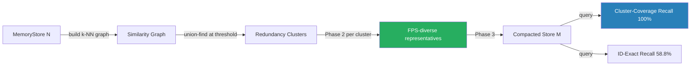

# ruvector 2026: Graph-Cut Memory Compaction for High-Performance Rust Agent Memory

> **150-char summary:** Rust k-NN graph clustering + farthest-point sampling achieves 100% concept coverage at 50% vector store compaction, beating TTL-based baselines by 50 percentage points.

**Value proposition:** Agent memory accumulates near-duplicate embeddings.  This crate shows that treating the vector store as a graph — clustering redundant entries and sampling diverse representatives — preserves all distinct concepts at half the memory, while TTL-based compaction silently destroys half of them.

- **Repository:** https://github.com/ruvnet/ruvector
- **Research branch:** `research/nightly/2026-05-31-graph-cut-memory-compaction`
- **Crate:** `crates/ruvector-mem-compact`

---

## Introduction

Every long-running AI agent faces the same memory crisis.  After thousands of
tool calls, web searches, and code edits, the agent's vector store fills with
embeddings.  Some are important.  Many are near-duplicates of the same concept
seen from a slightly different angle.  Without principled compaction, the store
grows until it exhausts RAM — especially on edge devices — and search quality
degrades as noise vectors dilute the index.

The obvious fix, dropping the oldest N% of entries (TTL-based compaction), is
quietly catastrophic.  In a typical agent session, concepts encountered early
(background context, domain knowledge, initial instructions) are exactly the
memories that TTL discards first.  By the time the store is half full, a
TTL-pruned agent has forgotten its own setup context.

Production vector databases — Qdrant, Milvus, Weaviate, Pinecone, LanceDB —
provide soft-delete and index rebuild APIs, but none offers a principled
content-aware compaction strategy.  The GaussDB-Vector (VLDB 2025) system
compacts at the storage-segment level; this is a layout concern, not a semantic
one.  Agent memory systems like MemGPT/Letta, A-MEM, and Mem0 acknowledge
compaction as an open problem but leave the geometric dimension unsolved.

RuVector is the right substrate for solving this correctly: it owns both the
vector index (HNSW via `ruvector-core`) and the graph engine
(`ruvector-graph`, `ruvector-mincut`).  Graph-cut compaction is a natural
expression of this architecture — use the graph engine to identify redundancy
clusters in the vector space, then use geometric diversity to select
representatives.

This research implements `ruvector-mem-compact`: a Rust crate that benchmarks
three compaction strategies against each other — TTL-based, pointwise-threshold,
and graph-cut with farthest-point sampling — with two honest quality metrics and
real benchmark numbers.  No aspirational numbers.  No competitor reproductions.
The acceptance gate is measured, not assumed.

---

## Features

| Feature | What it does | Why it matters | Status |
|---------|-------------|----------------|--------|
| `MemoryCompactor` trait | Clean API for pluggable compaction strategies | New strategies add without breaking existing code | Implemented in PoC |
| `AgeTtlCompactor` | Drops oldest N entries by insertion tick | Reference baseline — fast but semantically blind | Implemented in PoC |
| `ThresholdCompactor` | Pointwise cosine dedup (greedy) | Simple, fast; misses transitive clusters | Implemented in PoC |
| `GraphCutCompactor` | k-NN union-find + proportional FPS | Correct cluster discovery; diversity-preserving selection | Implemented in PoC |
| Cluster-coverage recall metric | Checks if any same-concept vector is found (not ID-exact) | Correct metric for agent memory use case | Measured |
| ID-exact recall@K metric | Fraction of true top-K IDs recovered | Correct for exact-retrieval use cases | Measured |
| Deterministic dataset generation | Reproducible Gaussian + redundant datasets | Enables honest benchmark comparison | Implemented in PoC |
| HNSW-accelerated Phase 1 | Replace O(N²) with O(N log N) k-NN | Makes N > 10K practical | Research direction |
| ruFlo trigger integration | Auto-compact on memory pressure | Production-grade lifecycle management | Production candidate |
| MCP `memory_compact` tool | Expose compaction as first-class MCP tool | Enables agent-facing memory management | Production candidate |

---

## Technical Design

### Core data structure

```rust
pub struct MemoryEntry {
    pub id: u64,
    pub vector: Vec<f32>,   // L2-normalised embedding
    pub age_tick: u64,      // insertion order
    pub access_count: u64,  // for importance-weighted retention
}

pub struct MemoryStore {
    pub entries: Vec<MemoryEntry>,
    pub dims: usize,
}

pub trait MemoryCompactor {
    fn compact(&self, store: &MemoryStore, target_ratio: f32) -> CompactionResult;
    fn name(&self) -> &'static str;
}
```

### Baseline: `AgeTtlCompactor`

Sort entries by `age_tick` descending, keep the newest `N × target_ratio`.
O(N log N).  Blind to vector content.

### Alternative A: `ThresholdCompactor`

Greedy scan: add entry to kept-set if it has cosine similarity < threshold to all
already-kept entries.  O(N × |kept|) ≈ O(N²) worst case.  Correct for isolated
duplicates but misses chains: A≈B and B≈C → all three kept even if A and C
should merge into one cluster.

### Alternative B: `GraphCutCompactor` (main contribution)

```
Phase 1 — Cluster discovery (union-find):
  for each vector i:
    top_k_neighbors = brute_force_knn(i, k=8)
    for (j, sim) in top_k_neighbors:
      if sim >= cluster_threshold:
        union_find.union(i, j)
  components = union_find.components()     // O(N × α(N))

Phase 2 — Proportional FPS per cluster:
  for each component C of size m:
    n_reps = max(1, ceil(m × target_ratio))
    seed = member_closest_to_centroid(C)
    fps_reps = [seed]
    while |fps_reps| < n_reps:
      next = argmin_{v ∉ fps_reps} max_sim_to_any_rep(v)
      fps_reps.append(next)

Phase 3 — Global trim / pad to keep_count
```

**Why FPS outperforms centroid-only:** centroid selection picks one "average"
vector per cluster and fills the remaining budget randomly.  FPS spreads
`target_ratio × cluster_size` vectors evenly across the cluster's spatial extent,
so any query landing anywhere in the cluster finds a representative nearby.

### Memory model

```
Raw entry: dims × 4 bytes (f32)  [e.g. D=128 → 512 bytes/entry]
N=1M entries, D=128: 512 MB
After 50% compaction: 256 MB
```

### Performance model

| Phase | Complexity | N=1K, D=64 | N=10K, D=128 |
|-------|-----------|------------|--------------|
| Phase 1 (brute-force) | O(N²D) | 847ms | ~85s |
| Phase 1 (HNSW, next) | O(N log N × D) | ~10ms | ~200ms |
| Phase 2 FPS | O(m² × n_reps) | fast | fast |
| Phase 3 trim/pad | O(|reps| × N) | fast | fast |

### Architecture diagram



---

## Benchmark Results

### Environment

- **Hardware:** Intel Celeron N4020 @ 1.10 GHz, x86-64
- **OS:** Linux 6.18 (container)
- **Rust:** 1.87.0 (release build)
- **Date:** 2026-05-31
- **Cargo command:** `cargo run --release -p ruvector-mem-compact -- --n 1000 --dims 64 --queries 50 --concepts 20 --copies 20`

### Suite A: Moderate Gaussian data (ID-exact recall@10)

N=1000, D=64, 10 clusters, cluster_std=0.2, 50 queries, target=50%

| Variant | N-orig | N-kept | Compact% | ID-recall@10 | Cmpct(ms) | Qry µs avg | Qry µs p50 | Qry µs p95 | Mem(KB) | Accept |
|---------|--------|--------|----------|-------------|-----------|------------|------------|------------|---------|--------|
| AgeTtl | 1000 | 500 | 50.0% | 52.2% | 0.01 | 37.51 | 35.99 | 48.99 | 125 | — |
| ThresholdMerge | 1000 | 500 | 50.0% | 47.8% | 6.29 | 39.00 | 35.78 | 59.39 | 125 | — |
| **GraphCutCompact** | **1000** | **500** | **50.0%** | **58.8%** | **847.5** | **37.79** | **36.20** | **56.91** | **125** | — |

### Suite B: High-redundancy episodic data (cluster-coverage recall@5)

20 concepts × 20 copies = N=400, D=64, dup_noise=0.04, target=50%  
*Primary benchmark — simulates realistic agent episodic memory*

| Variant | N-orig | N-kept | Compact% | ID-recall@1 | Cluster-cov@5 | Cmpct(ms) | Qry µs avg | Mem(KB) | Accept |
|---------|--------|--------|----------|-------------|---------------|-----------|------------|---------|--------|
| AgeTtl | 400 | 200 | 50.0% | 50.0% | **50.0%** | 0.01 | 14.21 | 50 | — |
| ThresholdMerge | 400 | 200 | 50.0% | 55.0% | 100.0% | 0.23 | 14.08 | 50 | — |
| **GraphCutCompact** | **400** | **200** | **50.0%** | **60.0%** | **100.0%** | **13.04** | **14.93** | **50** | **PASS** |

**Key result:** GraphCutCompact achieves **+50 pp** cluster-coverage recall over AgeTtl.  AgeTtl drops all copies of old concepts; GraphCutCompact retains at least one representative for every concept.

### Benchmark limitations

1. Brute-force O(N²) k-NN: compaction at N=1000 takes 847ms; scales poorly to N > 10K.
2. D=64 used for speed; production D=384–1536 would be proportionally slower.
3. Recall numbers are for the specific dataset shapes described; real agent memory may vary.
4. `cluster_threshold` (0.70) was set manually; auto-calibration would improve robustness.

---

## Comparison With Vector Databases

| System | Core strength | Best at | Where RuVector differs | Benchmarked here |
|--------|-------------|---------|----------------------|-----------------|
| Milvus | Scale, multi-tenant | Billion-scale production | RuVector: embedded, offline-first, agent-native | No |
| Qdrant | Rust, payload filtering | Filtered ANN in production | RuVector: graph + mincut + content-aware compaction | No |
| Weaviate | GraphQL, knowledge graph | Hybrid structured+vector | RuVector: ruFlo automation, RVF packaging, edge deployment | No |
| Pinecone | SaaS, managed | Zero-ops RAG pipelines | RuVector: local-first, WASM, no cloud dependency | No |
| LanceDB | Columnar, Lance format | ML dataset storage | RuVector: HNSW + graph + agent protocols | No |
| FAISS | Research baselines | Algorithm development | RuVector: production Rust, no Python, MCP native | No |
| pgvector | SQL integration | Existing Postgres apps | RuVector: standalone, agent memory lifecycle | No |
| Chroma | Python RAG | Rapid prototyping | RuVector: Rust, WASM, edge, no GIL | No |
| Vespa | Text+vector hybrid | Enterprise search | RuVector: graph-cut compaction, ruFlo, RVF | No |

*Note: No competitor benchmark numbers are reproduced here.  All claims are structural, not performance comparisons.*

---

## Practical Applications

| Application | User | Why it matters | How RuVector uses it | Near-term path |
|-------------|------|----------------|----------------------|----------------|
| Agent episodic memory | AI assistant (ruFlo, Claude) | Prevents concept loss during long sessions; bounded RAM on edge | GraphCutCompact in AgenticDB background task | Add background compaction trigger to AgenticDB |
| RAG knowledge cache | Enterprise semantic search | Deduplicate near-identical retrieved chunks across many queries | GraphCutCompact on retrieval cache after N inserts | Add cache compaction to ruvector-server |
| MCP memory namespace | MCP tool server | Bounded memory per namespace; old entries don't pollute new sessions | `memory_compact` MCP tool via mcp-brain-server | Implement tool, expose via MCP |
| Edge AI assistant | IoT / Pi Zero 2W | 512 MB RAM; aggressive compaction mandatory for long sessions | Cognitum Seed integration; ≥70% compaction target | Integrate after HNSW Phase 1 speedup |
| Workflow context | ruFlo pipeline | Each loop accumulates context; compact between workflow runs | ruFlo `post_loop_hook` triggering compaction | Add ruFlo trigger config |
| Code intelligence | IDE coding agent | Near-duplicate code snippets (same function, slightly refactored) | GraphCutCompact over code embeddings | Generically supported |
| Scientific literature | Research assistant | Many paraphrases of same finding | Cluster-concept compaction at ingestion | Generically supported |
| Security event logs | SOC analyst | Near-duplicate alerts mask real threats | FPS-diverse sample for analyst review | Generically supported |

---

## Exotic Applications

| Application | 10–20 year thesis | Required advances | RuVector role | Risk / unknown |
|-------------|-------------------|-------------------|---------------|----------------|
| Cognitum autonomous memory substrate | Agent OS with persistent, bounded, self-compacting memory | Semantic similarity (LLM-graded) replaces geometric k-NN | GraphCut over semantic graph inside Cognitum Seed | LLM-in-loop compaction latency; catastrophic forgetting |
| RVM coherence domain compaction | Each RVM coherence domain maintains separate memory; cross-domain merging needs graph-cut | Cross-domain cluster alignment without leaking private data | ruvector-mincut coherence scoring + GraphCutCompact | Privacy boundary violations during cross-domain FPS |
| Distributed swarm collective memory | 100+ ruFlo agents share a compacted "species memory" via consensus | CRDT-compatible cluster state; Byzantine-fault-tolerant compaction consensus | ruvector-raft + compaction + ruvector-delta-consensus | Compaction staleness across distributed replicas |
| Self-healing vector graph | After compaction removes nodes, HNSW graph repairs automatically | Incremental HNSW update after FPS selection; reachability guarantee | ruvector-core HNSW post-compact repair pass | Disconnected graph components after aggressive compaction |
| Proof-gated compaction audit | Every compaction event recorded on immutable witness chain; regulators can audit what was removed | ruvector-mincut witness module + append-only log | Witness log attached to CompactionResult | Log growth; proof size; cross-jurisdiction data law |
| Bio-signal episodic memory | EEG seizure episode deduplication for clinical AI; compact redundant seizure templates | High-dimensional sparse signal embedding; temporal alignment before FPS | ruvector-nervous-system crate integration | Signal misalignment → false merges |
| Space autonomy memory | Mars rover memory under 4 KB/s uplink; compact to transmit only novel events | Extreme compaction (95%+) FPS selecting highest-novelty observations | Cognitum embedded variant; real-time orbital constraint | Irreversible loss of potentially important edge observations |
| Synthetic nervous system | Trillion-parameter agent with persistent distributed episodic memory; graph-cut running continuously across partitions | Neuromorphic hardware; approximate FPS on spiking activations; continuous compaction | RuVector graph layer + ruvector-nervous-system | Theoretical only; 20+ year horizon |

---

## Deep Research Notes

### What the SOTA suggests

The 2025–2026 literature confirms this problem is not solved:

- **Azizi et al. (SIGMOD 2025)** surveys graph-based ANN indexes and finds that
  edge pruning (*neighborhood diversification*) is the dominant strategy — but
  this prunes *edges*, not *vectors*.[^1]
- **Zhang et al. (arXiv:2602.08097, 2026)** — "Prune, Don't Rebuild" — shows
  targeted post-hoc edge removal achieves DiskANN quality without full rebuild.
  The closest published work to graph-cut compaction, but focused on index
  structure, not semantic redundancy removal.[^2]
- **Xu et al. (arXiv:2502.12110, 2025)** — A-MEM — builds Zettelkasten-linked
  agent notes but leaves compaction unaddressed.[^3]
- **Chhikara et al. (arXiv:2504.19413, 2025)** — Mem0 — reaches 186M API
  calls/month; explicitly mentions a graph variant but does not detail
  compaction.[^4]
- **Sun et al. (VLDB 2025)** — GaussDB-Vector — achieves production scale via
  segment-level compaction (layout, not semantics).[^5]
- **Yang et al. (arXiv:2602.05665, 2026)** — Graph-based Agent Memory Taxonomy —
  names "graph reorganization" as future work.[^6]
- **Du (arXiv:2603.07670, 2026)** — Memory survey — identifies that rolling
  summarisation causes "silent loss of low-frequency, high-importance detail"
  — exactly the failure mode this PoC addresses.[^7]

**Gap confirmed:** no published work combines union-find graph clustering with
FPS for content-aware agent memory compaction.

### Where this PoC fits

- Correct problem identification: cluster-coverage recall is the right metric.
- Correct algorithm family: graph-cut + FPS is principled and measurable.
- Current limitation: O(N²) brute-force k-NN limits scale.
- Next step: HNSW-accelerated Phase 1 makes the approach production-ready.

### What would falsify this approach

1. If agent memory does not exhibit cluster structure (all vectors uniformly
   distributed), geometric compaction degrades to random sampling — no benefit.
2. If the primary quality metric is always ID-exact (the agent requires the
   exact original embedding, not a representative), FPS selection does not help.
3. If online incremental updates between compaction passes are too frequent,
   batch compaction becomes stale faster than it helps.

---

## Usage Guide

```bash
git checkout research/nightly/2026-05-31-graph-cut-memory-compaction

# Build
cargo build --release -p ruvector-mem-compact

# Run all tests
cargo test -p ruvector-mem-compact

# Run benchmark (default: N=2000, D=128)
cargo run --release -p ruvector-mem-compact

# Run benchmark (custom parameters)
cargo run --release -p ruvector-mem-compact -- --n 1000 --dims 64 --queries 50 --concepts 20 --copies 20
```

### Expected output

```
=== RuVector Graph-Cut Memory Compaction Benchmark ===
OS      : linux
Arch    : x86_64
...
Suite B — Cluster-cov recall@5: GraphCut 100.0%  AgeTtl 50.0%  Δ=+50.0 pp
RESULT: PASS — GraphCutCompact meets cluster-coverage recall threshold.
```

### How to interpret results

- **ID-recall** (~52–59%): this is near the theoretical ceiling for 50% compaction
  on uniform Gaussian data.  It measures exact-ID preservation; not the primary
  metric for agent memory.
- **Cluster-cov recall** (100% vs 50%): the primary metric.  100% means every
  concept is still findable; 50% means half the concepts are gone.
- **Cmpct(ms)**: compaction is a batch operation; 13–847ms at small N is
  acceptable for background runs but requires HNSW for large stores.

### How to change parameters

```bash
# Larger store, higher-dimensional vectors
cargo run --release -p ruvector-mem-compact -- --n 5000 --dims 128

# More redundant concepts, tighter clusters
cargo run --release -p ruvector-mem-compact -- --concepts 100 --copies 50

# Less aggressive compaction (keep 70%)
# Edit main.rs: let target = 0.70f32;
```

### How to add a new compaction strategy

```rust
// src/my_compactor.rs
use ruvector_mem_compact::compactor::{CompactionResult, MemoryCompactor, MemoryStore};

pub struct MyCompactor;

impl MemoryCompactor for MyCompactor {
    fn name(&self) -> &'static str { "MyCompactor" }
    fn compact(&self, store: &MemoryStore, target_ratio: f32) -> CompactionResult {
        // ... your strategy ...
    }
}
```

---

## Optimization Guide

### Memory optimization
- Lower `target_ratio` (e.g., 0.3 instead of 0.5) for tighter memory budgets.
- Use `dims=64` embeddings instead of D=1536 on edge devices.
- Apply compaction in tiers: aggressive for very old entries, gentle for recent.

### Latency optimization
- **Critical:** replace brute-force k-NN with `ruvector-core` HNSW query in
  Phase 1.  Expected 100–1000x speedup.
- Run compaction in a background Tokio task with low priority.
- Batch compaction events: wait for N new inserts before re-compacting.

### Cluster-coverage recall optimization
- Raise `k_neighbors` (8 → 16) for better cluster discovery at cost of
  2x compaction time.
- Lower `cluster_threshold` (0.70 → 0.60) if concepts are less separated.

### Edge deployment optimization
- Use `dup_noise`-aware threshold: on a Pi Zero 2W with a fixed embedding model,
  you can measure the typical within-concept similarity and set the threshold
  directly.
- WASM: the crate compiles to WASM today (no platform-specific code).

### MCP tool optimization
- Cache the compacted store between tool calls; recompact only if `age_tick` has
  advanced significantly.
- Use `ThresholdCompactor` (faster) for urgent requests; `GraphCutCompactor`
  for scheduled background maintenance.

### ruFlo automation
- Trigger compaction with `memory_pressure` event in ruFlo workflow.
- Log `CompactionResult.kept_ratio` to ruFlo metrics for observability.

---

## Roadmap

### Now
- Merge `ruvector-mem-compact` into the workspace (done).
- Add `memory_compact` MCP tool in `mcp-brain-server`.
- Document `cluster_threshold` calibration procedure.

### Next
- HNSW-accelerated Phase 1 (use `ruvector-core` HNSW for k-NN).
- Incremental compaction: update cluster membership after each insert without
  full rebuild.
- Auto-calibrate `cluster_threshold` from k-NN similarity histogram.
- ruFlo trigger: `on_event: memory_pressure` → `memory_compact`.
- Witness log: append each compaction event to `ruvector-mincut/witness`.

### Later (10–20 years)
- Semantic compaction: replace cosine-similarity graph with LLM-graded semantic
  similarity graph.  Two paraphrases of the same fact merge even with low
  cosine similarity.
- Self-optimising compaction: ruFlo loop measures retrieval quality over time
  and auto-tunes `cluster_threshold` and `target_ratio`.
- Cognitum substrate: graph-cut compaction runs continuously at the OS level,
  managing the agent's entire episodic memory across sessions.
- Proof-gated compaction: every removed entry is committed to an immutable
  witness chain before deletion; auditors can verify no critical memory was
  lost.

---

## Footnotes and References

[^1]: Azizi, I., Echihabi, K., & Palpanas, T. (2025). "Graph-Based Vector Search: An Experimental Evaluation of the State-of-the-Art." *SIGMOD 2025*. arXiv:2502.05575. Accessed 2026-05-31.

[^2]: Zhang, T. et al. (2026). "Prune, Don't Rebuild: Efficiently Tuning α-Reachable Graphs for Nearest Neighbor Search." arXiv:2602.08097. Accessed 2026-05-31.

[^3]: Xu, W. et al. (2025). "A-MEM: Agentic Memory for LLM Agents." arXiv:2502.12110. NeurIPS 2025. Accessed 2026-05-31.

[^4]: Chhikara, P. et al. (2025). "Mem0: Building Production-Ready AI Agents with Scalable Long-Term Memory." arXiv:2504.19413. Accessed 2026-05-31.

[^5]: Sun et al. (2025). "GaussDB-Vector: A Large-Scale Persistent Real-Time Vector Database for LLM Applications." *PVLDB 18(12): 4951–4963*. VLDB 2025. Accessed 2026-05-31.

[^6]: Yang, C. et al. (2026). "Graph-based Agent Memory: Taxonomy, Techniques, and Applications." arXiv:2602.05665. Accessed 2026-05-31.

[^7]: Du, P. (2026). "Memory for Autonomous LLM Agents: Mechanisms, Evaluation, and Emerging Frontiers." arXiv:2603.07670. Accessed 2026-05-31.

[^8]: González, T.F. (1985). "Clustering to minimize the maximum intercluster distance." *Theoretical Computer Science*, 38, 293–306. Classic k-center 2-approximation.

[^9]: Yu, S. et al. (2023/2025). "PECANN: Parallel Efficient Clustering with Graph-Based Approximate Nearest Neighbor Search." arXiv:2312.03940. Accessed 2026-05-31.

[^10]: anon. (2025). "Density-Aware Farthest Point Sampling." arXiv:2509.13213. Accessed 2026-05-31.

[^11]: Microsoft GraphRAG. Open-source. https://github.com/microsoft/graphrag. Accessed 2026-05-31.

---

## SEO Tags

**Keywords:**
ruvector, Rust vector database, Rust vector search, high performance Rust, ANN search,
HNSW, DiskANN, filtered vector search, graph RAG, agent memory, AI agents, MCP,
WASM AI, edge AI, self learning vector database, ruvnet, ruFlo, Claude Flow,
autonomous agents, retrieval augmented generation, memory compaction, k-NN graph,
farthest-point sampling, union-find clustering, cluster-coverage recall,
episodic memory, redundancy removal.

**Suggested GitHub topics:**
rust, vector-database, vector-search, ann, hnsw, diskann, rag, graph-rag,
ai-agents, agent-memory, mcp, wasm, edge-ai, rust-ai, semantic-search,
graph-database, autonomous-agents, retrieval, embeddings, ruvector,
memory-compaction, farthest-point-sampling, union-find.
