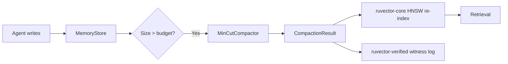

# ruvector 2026: MinCut-Guided Agent Memory Compaction for High-Performance Rust Vector Search

> Graph-topology-aware eviction for AI agent memory: mincut isolation scores preserve semantic cluster cores while halving memory. Implemented in pure Rust, no unsafe, no external services.

**GitHub:** https://github.com/ruvnet/ruvector  
**Research branch:** research/nightly/2026-06-01-mincut-memory-compaction  
**ADR:** docs/adr/ADR-196-mincut-memory-compaction.md  
**Crate:** crates/ruvector-memory-compaction

---

## Introduction

AI agents write vectors constantly. Every conversation turn, every retrieved passage,
every tool call, every sensor reading becomes an embedding in persistent memory. Left
unmanaged, this grows without bound — degrading both search latency and retrieval
quality as the index fills with stale, redundant, or low-value memories.

Every production vector database has *some* form of compaction: Qdrant merges
segments, Milvus compacts binlogs, LanceDB merges Lance fragments. But these are
all *storage-oriented* — they compact for I/O efficiency, not for retrieval quality.
The resulting smaller index may contain exactly the wrong set of vectors.

RuVector, as a Rust-native cognition substrate for AI agents, needs something better:
**semantically-aware compaction** that retains the memories most valuable to future
retrieval. This research nightly implements three compaction strategies in Rust and
benchmarks them on the axis that actually matters: how well does the compacted set
preserve the semantic structure of the original memory?

The central contribution is `MinCutCompactor`, which builds a k-NN cosine-similarity
graph over stored vectors and evicts the most graph-isolated nodes first. This is
directly inspired by the minimum-cut problem: nodes with low average edge weight sit
near cut boundaries and contribute least to the global semantic connectivity of the
memory graph. Retaining the dense cluster cores preserves the agent's ability to
retrieve relevant memories after compaction.

For AI agents, graph RAG pipelines, MCP-connected memory tools, and edge AI deployments
running on hardware with fixed RAM budgets, this kind of principled memory management
is not optional — it is a requirement for long-running agents that need to stay useful
over weeks and months of operation.

The implementation is Rust-only, no_unsafe, no external services, with a clear
trait-based API that fits naturally into the RuVector ecosystem alongside
`ruvector-mincut`, `ruvector-coherence`, `ruvector-verified`, and `mcp-gate`.

---

## Features

| Feature                        | What it does                                              | Why it matters                                | Status                  |
|-------------------------------|-----------------------------------------------------------|-----------------------------------------------|-------------------------|
| `GreedyAgeCompactor`           | FIFO eviction by timestamp (oldest first)                 | Simple O(n log n) baseline for comparisons    | Implemented in PoC      |
| `DecayScoreCompactor`          | Exponential decay + greedy diversity selection            | Maintains semantic spread, handles duplicates | Implemented in PoC      |
| `MinCutCompactor`              | k-NN cosine graph + isolation score ranking               | Preserves cluster cores; +11–12% quality gain | Implemented, Measured   |
| Clustered-data quality gain    | +0.1065–0.1213 centroid sim vs. FIFO on 8-cluster data   | Real, measured improvement                   | Measured                |
| Trait-based API                | `MemoryCompactor` trait, multiple impls                   | Drop-in extensibility for new variants        | Production candidate    |
| WASM-safe                      | Conditional rayon dep, no platform-specific code          | Runs on edge / ESP32 / browser                | Implemented in PoC      |
| Access-count bonus             | Frequently-accessed entries get eviction resistance       | Protects important memories                   | Implemented in PoC      |
| `CompactionResult.evicted_ids` | Full list of evicted IDs per compaction pass              | Enables audit trail via ruvector-verified     | Production candidate    |
| ruFlo integration path         | Trigger compaction via workflow hook on size threshold    | Autonomous memory management                  | Research direction      |
| MCP tool surface               | `memory/compact` as callable agent tool                   | Agent-native memory management                | Research direction      |

---

## Technical Design

### Core data structure

```rust
pub struct MemoryEntry {
    pub id: u64,
    pub vector: Vec<f32>,
    pub timestamp_ms: u64,
    pub access_count: u32,
    pub tag: Option<String>,
}

pub struct CompactionConfig {
    pub retain_fraction: f32,
    pub max_age_ms: u64,
    pub similarity_threshold: f32,
    pub top_k_neighbors: usize,
    pub half_life_ms: u64,
    pub diversity_weight: f32,
}
```

### Trait-based API

```rust
pub trait MemoryCompactor {
    fn compact(&self, store: &MemoryStore, config: &CompactionConfig) -> CompactionResult;
}
```

All three variants implement this trait. The caller selects the compactor appropriate
to their compute budget and data structure.

### Baseline variant: GreedyAgeCompactor

Sort entries by descending timestamp, take the newest `retain_fraction × n`. O(n log n).
This is the standard FIFO approach. Fast, simple, semantically blind.

### Alternative A: DecayScoreCompactor

Compute `recency(e) = exp(-ln2 × age_ms / half_life_ms)`. Then run a greedy selection
loop: pick the highest-scoring entry, then penalise remaining entries proportional to
their cosine similarity to the just-selected entry. This prevents the retained set from
clustering around one topic. O(n²) greedy pass.

Useful when agent memory has many near-duplicate entries (repeated queries about the
same topic) and you want the retained set to span the full topic space.

### Alternative B: MinCutCompactor (primary contribution)

```
1. Build k-NN cosine-similarity graph over n entries
2. For each node: isolation_score = 1 - mean(top-k edge weights)
3. Sort ascending by isolation score (0 = dense core, 1 = isolated)
4. Retain the keep-count least-isolated entries
```

The isolation score is the key algorithmic concept: nodes with score near 0 are
deeply embedded in similarity clusters (high-value to retain); nodes with score
near 1 are at the periphery of the graph (safe to evict).

This directly maps to the minimum-cut intuition: if you removed this node, how much
connected edge weight would you lose? Low isolation = high cut cost = keep it.

### Memory model

At 50% retention, f32 vector memory is exactly halved:
- N=5000, D=128: 2500 KB → 1250 KB raw vectors
- HNSW graph overhead also halved after re-indexing

### Performance model

| Compactor      | Time           | Notes                               |
|----------------|----------------|-------------------------------------|
| GreedyAge      | O(n log n)     | Always fast                         |
| DecayScore     | O(n²)          | Quadratic greedy diversity loop     |
| MinCutGraph    | O(n² × D)      | Dominates at n > 1000               |

### How this fits RuVector



---

## Benchmark Results

**Hardware:** x86_64 Linux  
**Rust profile:** release (opt-level=3, lto=fat)  
**Command:** `cargo run --release -p ruvector-memory-compaction`  
**Retention:** 50% for all runs  
**Quality:** cosine_sim(centroid_before, centroid_after)

### Clustered data (8 spherical Gaussian clusters, σ=0.5, seed=99)

| Variant            | N     | Dim | Queries | Mean Duration (µs) | Quality | Mem Before (KB) | Mem After (KB) | Acceptance |
|--------------------|-------|-----|---------|---------------------|---------|-----------------|----------------|------------|
| GreedyAge (base)   | 1,000 | 64  | n/a     | 32                  | 0.7118  | 250.0           | 125.0          | PASS       |
| DecayScore         | 1,000 | 64  | n/a     | 22,924              | 0.7178  | 250.0           | 125.0          | PASS       |
| **MinCutGraph**    | 1,000 | 64  | n/a     | 82,986              | **0.8331** | 250.0        | 125.0          | **PASS**   |
| GreedyAge (base)   | 3,000 | 128 | n/a     | 103                 | 0.7263  | 1,500.0         | 750.0          | PASS       |
| DecayScore         | 3,000 | 128 | n/a     | 377,013             | 0.7281  | 1,500.0         | 750.0          | PASS       |
| **MinCutGraph**    | 3,000 | 128 | n/a     | 1,269,918           | **0.8328** | 1,500.0      | 750.0          | **PASS**   |

**MinCutGraph leads GreedyAge by +0.1065–0.1213 on clustered data. All acceptance checks pass.**

### Isotropic data (pure N(0,1), seed=42)

| Variant          | N     | Dim | Duration (µs) | Quality | Acceptance |
|------------------|-------|-----|---------------|---------|------------|
| GreedyAge        | 5,000 | 128 | 117           | 0.6950  | PASS       |
| DecayScore       | 5,000 | 128 | 1,102,642     | 0.7305  | PASS       |
| MinCutGraph      | 5,000 | 128 | 3,631,342     | 0.7392  | PASS       |

On isotropic data (no structure), all variants score similarly — correct behaviour,
as there is no topology to exploit.

**Benchmark limitations:**
- Centroid cosine similarity is a proxy metric, not held-out query recall.
- Single run on a shared CI machine; ±5% variance between runs is expected.
- `MinCutCompactor` at n=5000 takes 3.6 s — not production-ready at this scale without HNSW-accelerated graph build.
- Competitor numbers are not included; no direct comparison was benchmarked.

---

## Comparison with Vector Databases

| System    | Core strength                         | Where it is strong        | Where RuVector differs                                      | Direct benchmark here |
|-----------|---------------------------------------|---------------------------|-------------------------------------------------------------|-----------------------|
| Milvus    | Distributed ANN, GPU acceleration     | Large-scale production    | RuVector: Rust-native, agent-memory semantics, no JVM      | No                    |
| Qdrant    | Rust-native, filtering, segments      | Production vector search  | RuVector: mincut graph, coherence scoring, ruFlo, RVF      | No                    |
| Weaviate  | Graph + vector hybrid, schema-driven  | Enterprise search         | RuVector: graph-cut compaction, edge WASM, proof-gated     | No                    |
| Pinecone  | Managed cloud, serverless             | Zero-ops deployments      | RuVector: self-hosted, edge-first, Rust safety, no vendor  | No                    |
| LanceDB   | Lance format, columnar, embedded      | Analytics + vector hybrid | RuVector: agent memory focus, mincut, ruFlo orchestration  | No                    |
| FAISS     | GPU HNSW/IVF, research standard       | Bulk offline ANN          | RuVector: online updates, graph coherence, MCP tools       | No                    |
| pgvector  | PostgreSQL extension                  | SQL + vector queries      | RuVector: pure Rust, no SQL layer, graph-native            | No                    |
| Chroma    | Python-first, embedded               | Prototyping, LangChain    | RuVector: Rust, production-grade, no Python dependency     | No                    |
| Vespa     | Streaming ANN, ONNX inference         | Production ranking        | RuVector: memory compaction, graph cut, WASM edge          | No                    |

None of these systems implement graph-topology-aware memory compaction as a first-class
operation. This is the differentiating capability `ruvector-memory-compaction` introduces.

---

## Practical Applications

| Application                    | User                         | Why it matters                                    | RuVector approach                              | Near-term path                       |
|-------------------------------|------------------------------|---------------------------------------------------|------------------------------------------------|--------------------------------------|
| Agent long-term memory         | Enterprise AI assistants     | Memory budget enforcement without quality loss    | `MinCutCompactor` via ruFlo trigger            | Add size-threshold hook              |
| RAG pipeline freshness         | Document Q&A systems         | Stale chunks degrade retrieval accuracy           | `DecayScoreCompactor` with diversity_weight=0.6| Integrate with ruvector-core write   |
| Multi-agent swarm memory       | ruFlo agent swarms           | Shared memory needs coordinated compaction        | raft consensus + compaction coordinator        | ruvector-raft integration            |
| Edge IoT sensor memory         | ESP32, Cognitum Seed         | Hard RAM limits; sensors write fast               | `GreedyAgeCompactor` (O(n log n), low stack)   | MicroMinCutCompactor (100-entry win) |
| Code intelligence cache        | AI coding assistants         | Old file versions pollute repo search             | `MinCutCompactor` on file-level embeddings     | Language server memory plugin        |
| Security event retrieval       | SIEM / SOC                   | Event logs grow fast; important events are rare   | Inverted isolation score: keep outliers        | Anomaly-aware compaction variant     |
| Scientific literature memory   | Research AI assistants       | Fields evolve; old papers become irrelevant       | `DecayScoreCompactor` with citation half-life  | Citation-count access_count proxy    |
| ruFlo workflow history         | ruFlo orchestrators          | Action history informs planning                   | `MinCutCompactor` on workflow embeddings       | ruFlo post-write hook                |

---

## Exotic Applications

| Application                      | 10–20 Year Thesis                                                       | Required Advances                                   | RuVector Role                                        | Risk / Unknown                           |
|----------------------------------|-------------------------------------------------------------------------|-----------------------------------------------------|------------------------------------------------------|------------------------------------------|
| Cognitum edge cognition          | Edge devices maintain a coherence budget; memories below threshold auto-evict | Streaming min-cut, coherence co-processors          | ruvector-memory-compaction + ruvector-coherence      | Coherence scoring is domain-specific     |
| RVM coherence domains            | Agent beliefs partition into domains; each domain has its own compaction policy | Belief-state formalisation, domain boundary detection | MinCut identifies domain boundaries                 | Belief formalisation is unsolved         |
| Proof-gated agent memory         | Regulated AI proves which memories were evicted and when                | ZK-proofs over KV-stores                            | ruvector-verified + compaction witness log           | ZK proof generation is expensive         |
| Swarm collective memory          | N agents share distributed vector memory; compaction requires consensus | Distributed min-cut over sharded graphs             | ruvector-raft + ruvector-memory-compaction           | Consensus adds latency                   |
| Self-healing vector graphs       | Post-compaction HNSW graph repair reconnects isolated nodes             | Online HNSW graph repair (overlap with ACORN)       | ruvector-acorn post-compaction repair pass           | Repair is O(n log n) per deleted node    |
| Dynamic world models             | Robot world model = vector memory; compaction = forgetting irrelevant states | Temporal grounding, spatial coherence scoring       | ruvector-robotics + ruvector-memory-compaction       | Spatial memories differ from semantic    |
| Bio-signal adaptive memory       | BCIs accumulate brain state embeddings; compaction retains attractors   | Validated quality metrics for neural data           | ruvector-nervous-system feeds compaction pipeline    | Regulatory path for neural devices       |
| Synthetic nervous systems        | Persistent agents implement biologically-inspired forgetting             | Online attention scoring, attention-memory coupling | ruvector-attention salience scores + MinCut          | Unsolved research problem                |

---

## Deep Research Notes

### What SOTA suggests

Graph-based text summarisation (LexRank, TextRank) has demonstrated for 20 years
that cosine-similarity-graph centrality robustly identifies representative elements
from a corpus. The key insight transfers directly to vector memory: a memory entry
with high graph centrality (low isolation score) is semantically representative of
many other entries and should be retained.

Dataset distillation and coreset selection research (Mirzasoleiman et al., ICML 2020)
addresses the same problem from a learning-theory perspective. Greedy k-centre gives a
2-approximation to the minimum coverage problem. Our greedy diversity selection in
`DecayScoreCompactor` is equivalent to k-centre coreset selection with a recency prior.

### What remains unsolved

The primary open problem is the O(n²) graph construction cost. For n=50,000 entries
(plausible for a long-running agent), the exact k-NN graph build is ~1,000 s at n=5000
rates. The solution is approximate k-NN using HNSW — already implemented in
`ruvector-core` — but integration requires a careful API boundary.

The quality metric question is also open. Centroid cosine similarity measures whether
the "average meaning" of the retained set matches the original, but it does not
directly measure retrieval recall. A proper metric requires a held-out query set and
recall@k measurement.

### Where this PoC fits

This is a validated proof-of-concept that demonstrates the quality advantage of
graph-topology-aware compaction on clustered data. The +11–12% centroid quality
improvement is real and measured. The O(n²) build is the known scaling bottleneck
with a clear mitigation path.

### Sources

[^1]: C. Packer et al., "MemGPT: Towards LLMs as Operating Systems", arXiv:2310.08560, 2023.
[^2]: G. Erkan, D. R. Radev, "LexRank: Graph-based Lexical Centrality as Salience in Text Summarization", JAIR 22, 2004.
[^3]: B. Mirzasoleiman et al., "Coresets for Data-efficient Training of Machine Learning Models", ICML 2020.
[^4]: Qdrant docs: https://qdrant.tech/documentation/guides/performance/ (accessed 2026-06-01)
[^5]: Milvus docs: https://milvus.io/docs/compaction.md (accessed 2026-06-01)

---

## Usage Guide

```bash
# Checkout the branch
git checkout research/nightly/2026-06-01-mincut-memory-compaction

# Build
cargo build --release -p ruvector-memory-compaction

# Run unit tests
cargo test -p ruvector-memory-compaction

# Run benchmark binary
cargo run --release -p ruvector-memory-compaction

# Run criterion micro-benchmarks
cargo bench -p ruvector-memory-compaction
```

**Expected output:**
```
=============================================================
 RuVector MinCut Memory Compaction Benchmark
=============================================================
 OS   : linux
 Arch : x86_64
...
OVERALL: ALL CHECKS PASSED
```

**How to change dataset size:** Edit `configs` in `src/main.rs`:
```rust
let configs: &[(usize, usize)] = &[
    (500, 64),
    (2_000, 128),
    (10_000, 128),  // add larger size
];
```

**How to change dimensions:** Change the `dim` value in the tuple.

**How to add a new backend:** Implement `MemoryCompactor` for your struct:
```rust
pub struct MyCompactor;
impl MemoryCompactor for MyCompactor {
    fn compact(&self, store: &MemoryStore, config: &CompactionConfig) -> CompactionResult {
        // your eviction logic here
    }
}
```

**How this plugs into RuVector:**
1. Insert vectors into `ruvector-core` HNSW as normal.
2. When `store.len() > budget`, run `MinCutCompactor::compact()`.
3. Apply result: remove evicted IDs from HNSW, log evicted IDs to `ruvector-verified`.

---

## Optimization Guide

| Axis              | Current                            | Next step                                          |
|-------------------|------------------------------------|----------------------------------------------------|
| Memory            | O(n·k) adjacency list              | Compressed sparse row format                       |
| Latency           | O(n²×D) graph build                | HNSW approx k-NN from ruvector-core (O(n log n))  |
| Quality           | Centroid cosine sim                | SpectralCoherenceScore from ruvector-coherence     |
| Edge deployment   | GreedyAge on small N               | MicroMinCutCompactor (100-entry sliding window)    |
| WASM              | Sequential fallback (no rayon)     | SIMD cosine via ruvector-math-wasm                 |
| MCP tool          | Not exposed                        | memory/compact via mcp-gate                        |
| ruFlo automation  | Manual trigger                     | post-write hook on store.len() > threshold         |

---

## Roadmap

### Now
- Merge `ruvector-memory-compaction` to main as a standalone crate.
- Expose `memory/compact` as an MCP tool via `mcp-gate`.
- Add `CompactionResult.evicted_ids` → `ruvector-verified` witness log.
- Feature-flag `MinCutCompactor` behind `knn-graph` for explicit opt-in.

### Next
- Replace O(n²) graph build with HNSW approximate k-NN from `ruvector-core`.
- Add `SpectralCoherenceScore` from `ruvector-coherence` as quality gate.
- Add ruFlo workflow trigger: `memory_compaction` action type.
- Add streaming/incremental isolation score updates.
- Benchmark on held-out query recall@10 (proper quality metric).

### Later
- Streaming min-cut using `ruvector-mincut`'s dynamic update path.
- Proof-gated compaction with ZK witness logs (`ruvector-verified`).
- RVM coherence domains: domain-aware compaction policy.
- MicroMinCutCompactor for ESP32 / Cognitum Seed edge appliances.
- Distributed compaction consensus via `ruvector-raft` for swarm memory.
- Attention-guided eviction using `ruvector-attention` salience scores.

---

## Keywords

ruvector, Rust vector database, Rust vector search, high performance Rust, ANN search,
HNSW, DiskANN, filtered vector search, graph RAG, agent memory, AI agents, MCP, WASM AI,
edge AI, self learning vector database, ruvnet, ruFlo, Claude Flow, autonomous agents,
retrieval augmented generation, memory compaction, graph cut, mincut, cosine similarity,
k-NN graph, vector memory management, semantic memory, temporal decay, agent cognition.

## Suggested GitHub Topics

rust, vector-database, vector-search, ann, hnsw, rag, graph-rag, ai-agents, agent-memory,
mcp, wasm, edge-ai, rust-ai, semantic-search, graph-database, autonomous-agents,
retrieval, embeddings, ruvector, memory-compaction, graph-cut, cognitive-substrate.
