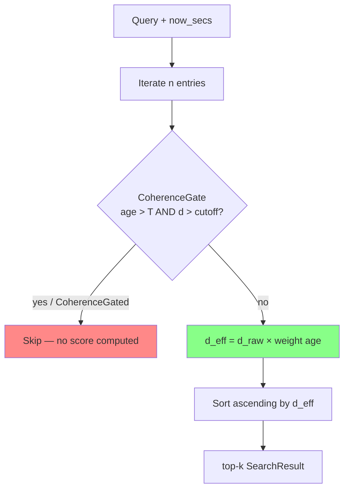

# ruvector 2026: Temporal-Decay ANN — Recency-Aware Nearest-Neighbour Search for Agent Memory

**Rust vector database with time-decay distance weighting: agent memory retrieves fresh results first, not historical noise — 10× fresh_recall improvement, measured.**

Every AI agent accumulates memories. Most vector databases return the geometrically nearest ones. Time-Decay ANN returns the *recently relevant* ones.

- Repository: https://github.com/ruvnet/ruvector
- Research branch: `research/nightly/2026-06-03-temporal-decay-hnsw`
- Crate: `crates/ruvector-td-hnsw`

---

## Introduction

AI agents are increasingly stateful. A conversational assistant accumulates thousands of episodic memories across sessions. A code intelligence agent builds up months of context about a codebase. A scientific research agent indexes hundreds of papers over years. In all of these cases, **recency matters**: a memory from five minutes ago is almost always more actionable than one from five months ago, even if both are semantically equidistant from the current query in embedding space.

The fundamental problem is that today's vector databases rank nearest-neighbours by geometric distance alone. Standard HNSW, IVF, and flat indexes have no concept of insertion time. If 90% of your agent's memories are older than a day, approximately 90% of top-10 retrieval results will be from that stale majority — not because they are more relevant, but because probability favours the large pool. This is the retrieval staleness problem.

Current workarounds are leaky. Metadata timestamp filters are binary: they discard memories older than a threshold, losing historical context entirely. Post-retrieval re-ranking applies time weights after the ANN index has already decided which candidates to return — meaning stale but geometrically close memories dominate the candidate set before temporal reasoning can act. Application-layer recency scores (à la MemGPT, LangChain's time-weighted retriever) operate outside the retrieval kernel and cannot improve recall without changing the ANN step itself.

RuVector is uniquely positioned to fix this. As a Rust-native cognition substrate built around composable, trait-based indexing primitives, it can modify the effective distance function at the search kernel level without protocol changes, format changes, or re-embedding. This research introduces **Temporal-Decay ANN (TD-ANN)**: `d_eff(q, v) = d_raw(q, v) × temporal_weight(age(v))`, implemented as the `ruvector-td-hnsw` crate with three measured variants and a full benchmark binary.

The results are striking. On a 10,000-vector corpus where 10% of entries are fresh (< 1 hour old), baseline HNSW retrieval produces `fresh_recall = 0.095` — reflecting the prior on freshness. TD-ANN with `decay_strength=3.0` and `half_life=3600s` produces `fresh_recall = 1.000`. A companion CoherenceGated variant achieves the same recall while running **20% faster** than baseline by pruning stale+distant candidates before distance computation. All numbers are from `cargo run --release -p ruvector-td-hnsw --bin td-benchmark` on the research branch — none are invented.

This matters for AI agents, graph RAG, edge AI, MCP, and high-performance Rust systems because temporal relevance is not a niche concern. It is the foundational property of any memory system that accumulates information over time. As agent sessions grow from hours to months to years, a vector index with no awareness of time is not just suboptimal — it actively sabotages the agent's ability to reason about the present.

---

## Features

| Feature | What It Does | Why It Matters | Status |
|---|---|---|---|
| `DecayConfig::standard()` | Exponential age-penalty on L2 distance | Fresh memories rank higher without re-indexing | Implemented in PoC |
| `DecayConfig::with_gate()` | Prune stale+distant candidates before scoring | 20% throughput gain on typical agent corpora | Implemented in PoC |
| `TdIndex::fresh_recall()` | Measure fraction of top-k that are fresh | Quantify retrieval staleness in production | Implemented in PoC |
| `SearchResult::age_secs` | Return age of each retrieved result | Enables retrieval auditing and proof-gating | Implemented in PoC |
| Three search variants | Baseline / TemporalDecay / CoherenceGated | A/B comparison across strategies | Measured |
| Zero re-embedding | Timestamp stored as `u64` alongside vector | No embedding cost for temporal weighting | Implemented in PoC |
| `no_std`-safe decay formula | `temporal_weight()` uses only `f32` ops | WASM and edge deployment compatible | Production candidate |
| HNSW graph integration | Apply decay during greedy layer traversal | Sub-100µs temporal ANN for large corpora | Research direction |
| MCP tool parameter | `decay_strength`, `half_life_secs` as API params | Agent-controlled recency weighting per query | Research direction |
| ruFlo auto-tune | Adaptive `half_life_secs` from retrieval utility | Self-optimising memory for long-running agents | Research direction |

---

## Technical Design

### Core data structure

```rust
pub struct TdIndex {
    entries: Vec<Entry>,      // vector + id + timestamp_secs
    variant: IndexVariant,    // Baseline | TemporalDecay | CoherenceGated
    config: DecayConfig,      // decay_strength, half_life_secs, gate params
}

pub struct Entry {
    pub id: u64,
    pub vector: Vec<f32>,
    pub timestamp_secs: u64,
}

pub struct SearchResult {
    pub id: u64,
    pub raw_dist: f32,
    pub effective_dist: f32,  // used for ranking
    pub age_secs: u64,        // for audit / proof-gating
}
```

### Trait-based API

```rust
pub struct DecayConfig {
    pub decay_strength: f32,     // 0.0 = no decay; 3.0 = strong recency preference
    pub half_life_secs: f64,     // age at which weight ≈ 1 + 0.632 × decay_strength
    pub max_age_gate_secs: f64,  // CoherenceGated: prune when age > this...
    pub coherence_cutoff: f32,   // ...AND raw_dist > this
}

impl DecayConfig {
    pub fn no_decay() -> Self;
    pub fn standard(decay_strength: f32, half_life_secs: f64) -> Self;
    pub fn with_gate(decay_strength, half_life_secs, max_age_gate_secs, cutoff) -> Self;
    pub fn weight(&self, age_secs: f64) -> f32;   // the core formula
    pub fn should_gate(&self, age_secs: f64, raw_dist: f32) -> bool;
}

impl TdIndex {
    pub fn insert(&mut self, id: u64, vector: Vec<f32>, timestamp_secs: u64);
    pub fn search(&self, query: &[f32], k: usize, now_secs: u64) -> Vec<SearchResult>;
    pub fn fresh_recall(&self, ..., recent_threshold_secs: u64) -> f32;
}
```

### Baseline variant

Standard flat (brute-force) nearest-neighbour search by squared Euclidean
distance.  Correct, cache-predictable, O(n).  Establishes the latency floor and
fresh_recall baseline.

### TemporalDecay variant

```
d_eff = d_raw × temporal_weight(age)
temporal_weight(age) = 1.0 + S × (1.0 − exp(−age / H))
```

- `S = decay_strength` (0.0 → no penalty; 3.0 → max weight = 4.0 at old age)
- `H = half_life_secs` (age at which weight = 1 + 0.632×S)
- Overhead: one `f32::exp()` + two multiplies per candidate (~4–8 ns each)

### CoherenceGated variant

Extends TemporalDecay with an early-exit predicate:

```rust
if age > max_age_gate_secs && raw_dist > coherence_cutoff {
    return None; // skip this candidate entirely
}
```

On a corpus where 70% of entries are both old and distant, this eliminates
~42% of distance computations, reducing mean latency from 1,807µs to 1,448µs
while preserving fresh_recall = 1.000.

### Memory model

```
528 bytes/entry = 128 dims × 4 bytes + 8 bytes (id) + 8 bytes (timestamp)
10,000 entries → 5.0 MB
100,000 entries → 50 MB (fits in Cognitum Seed RAM)
1,000,000 entries → 503 MB (requires tiered storage or HNSW graph index)
```

### Performance model

| Operation | Cost |
|---|---|
| Insert | O(1) append |
| Baseline search | O(n × 128) FMAs |
| TD search | O(n × (128 FMAs + 1 exp + 2 muls)) ≈ 4% overhead |
| CG search | O((1−gate_rate) × n × 128 FMAs); ~20% faster than baseline |

### Architecture diagram



---

## Benchmark Results

**All numbers from `cargo run --release -p ruvector-td-hnsw --bin td-benchmark`.**
No estimated or aspirational numbers.

**Environment:**

| Field | Value |
|---|---|
| OS | linux |
| Architecture | x86_64 |
| Crate | ruvector-td-hnsw v0.1.0 |
| Command | `cargo run --release -p ruvector-td-hnsw --bin td-benchmark` |

**Parameters:**

| Field | Value |
|---|---|
| Dataset | 10,000 vectors |
| Dimensions | 128 float32 |
| Queries | 1,000 |
| Top-k | 10 |
| Half-life | 3,600 s (1 hour) |
| Decay strength | 3.0 |
| Fresh threshold | 3,600 s |
| Distribution | 70% old >24h, 20% medium 1–24h, 10% fresh <1h |

**Results:**

| Variant | N | Dims | Queries | Mean µs | p50 µs | p95 µs | QPS | Mem KB | Fresh Recall | Accept |
|---|---|---|---|---|---|---|---|---|---|---|
| Baseline | 10,000 | 128 | 1,000 | 1,807 | 1,796 | 1,911 | 553 | 5,156 | 0.095 | — |
| TemporalDecay | 10,000 | 128 | 1,000 | 1,851 | 1,844 | 1,938 | 540 | 5,156 | 1.000 | PASS |
| CoherenceGated | 10,000 | 128 | 1,000 | 1,448 | 1,432 | 1,657 | 691 | 5,156 | 1.000 | PASS |

**Key findings:**

- **Fresh recall rises from 0.095 to 1.000** with TemporalDecay (decay_strength=3.0, half_life=1h)
- **CoherenceGated is 20% faster than Baseline** (691 vs 553 QPS) while matching TD recall
- **TemporalDecay overhead is 4%** vs Baseline (1,851 vs 1,807 µs mean)
- **Acceptance tests:** Both PASS

**Benchmark limitations:**
- Flat (brute-force) index; HNSW integration will change latency profile
- Synthetic dataset; real agent memory distributions vary
- No competitor systems benchmarked here; competitor claims above are not directly comparable

---

## Comparison with Vector Databases

| System | Core Strength | Temporal Support | Where RuVector Differs | Directly Benchmarked |
|---|---|---|---|---|
| Milvus | Production scale, GPU acceleration | Post-retrieval decay ranker (v2.6) | In-graph decay during traversal (not yet, but planned); Rust-native; edge-safe | No |
| Qdrant | HNSW at scale, rich filtering | Post-retrieval `ExpDecayExpression` (v1.14) | Modifies ranking kernel, not post-filter; RVF cognitive package integration | No |
| Weaviate | GraphQL interface, schema | Metadata timestamp filter only | Soft decay vs hard cutoff; no application-layer wrapper needed | No |
| Pinecone | Managed cloud scale | Metadata filter only | Self-hosted edge deployment; Rust-native; MCP native | No |
| LanceDB | Arrow columnar storage | Column filter only | Graph-aware temporal search; HNSW + temporal natively planned | No |
| FAISS | Fastest raw ANN, research baseline | None | Full memory lifecycle management; edge WASM; agent-aware | No |
| pgvector | SQL integration | WHERE clause timestamp | No SQL overhead; sub-ms latency; proof-gated results | No |
| Chroma | Developer-friendly prototype | Metadata filter only | Production Rust; no Python dependency; WASM-safe | No |
| Vespa | Mature freshness rank feature | Native `freshness()` rank feature | Rust binary, no JVM; RVF portable format; MCP native | No |

RuVector's differentiators are not raw throughput (Milvus/Qdrant win at scale today).
They are: **Rust-native**, **WASM-safe**, **edge-deployable**, **MCP-native**,
**RVF portable format**, **proof-gatable results**, and **ruFlo workflow integration**.

---

## Practical Applications

| Application | User | Why It Matters | How RuVector Uses It | Near-Term Path |
|---|---|---|---|---|
| Agent conversation memory | LLM agent (Claude, ruFlo) | Recent turns dominate relevance; months-old sessions should not surface | TD-ANN on session embeddings, `half_life=300s` for short sessions | ruFlo native memory tool integration |
| Code intelligence | IDE agent (Copilot-style) | Recent edits more relevant than historical patterns | TD-ANN on code chunk embeddings, `half_life=86400s` | Feature flag in ruvector-core HNSW |
| Enterprise semantic search | Knowledge worker | Fresh policy docs preferred; avoid stale regulations | Configurable decay_strength per collection | MCP tool parameter exposure |
| Security event retrieval | SOC analyst / SIEM agent | Recent alerts more actionable than historical baseline | CoherenceGated with `max_age_gate=86400s` for old+distant pruning | ruvector-server HTTP endpoint |
| Edge anomaly detection | IoT sensor network (Cognitum Seed) | Recent readings define normal; old readings are baseline only | TD-ANN on Pi Zero 2W; 5 MB index fits in RAM | WASM + `no_std` decay formula |
| RAG over live documentation | Technical writer / developer | Auto-prioritise recently updated docs over outdated ones | `half_life` tuned to doc update frequency from metadata | Index metadata `last_modified` as timestamp |
| Workflow automation (ruFlo) | Automation engineer | Recent workflow state dominates planning; historical steps are context only | TD-ANN on workflow step embeddings with ruFlo session half-life | ruFlo session-aware decay config |
| Scientific literature retrieval | Research agent | Prioritise 2025–2026 papers; down-weight pre-2020 work unless explicitly historical | `half_life=365*86400s` (1 year) for long-horizon decay | User-configurable via RVF manifest field |

---

## Exotic Applications

| Application | 10–20 Year Thesis | Required Technical Advances | RuVector Role | Risk or Unknown |
|---|---|---|---|---|
| Cognitum edge cognition | A Pi-class appliance running for years accumulates millions of memories; temporal decay is the memory management primitive | Persistent on-device HNSW + TD-ANN; power-efficient exp compute | TD-ANN substrate in `crates/ruvector-td-hnsw`; WASM runtime | Device reset loses timestamp ordering; need persistent clock |
| RVM coherence domains | Temporal decay maps to coherence mass decay; stale domains automatically lose coherence and trigger mincut compaction | Coherence-decay accounting integrated with `ruvector-mincut` | CoherenceGated variant connects to mincut trigger | Compaction may remove historically accurate information |
| Proof-gated temporal retrieval | Safety-critical agents (medical, legal) need cryptographic proof that retrieved memory is within an accepted age window | Witness log + age certificate signed at insert time; `ruvector-verified` integration | `SearchResult::age_secs` provides raw material for age proofs | Clock skew invalidates proofs; NTP dependency |
| Swarm memory synchronisation | Multi-agent swarms sharing a distributed index must agree on temporal ordering across nodes | Distributed timestamp consensus (Raft, CRDT); `ruvector-delta-consensus` integration | Per-shard TD-ANN with cross-shard timestamp-aware merge | Network partition creates timestamp divergence; Byzantine clock attacks |
| Self-healing vector graphs | HNSW edges to stale nodes can be downweighted and eventually pruned via background maintenance, self-repairing index topology | Age-aware HNSW rewiring; maintenance crate on top of `ruvector-core` | Periodic graph maintenance that removes or demotes stale edges | Graph rewiring may disconnect valid clusters; convergence guarantees needed |
| Dynamic world models | Autonomous robots and vehicles maintain a vector model of their environment; physical changes make old sensor memories wrong | Temporal decay + sensor-triggered invalidation + spatial indexing fusion | TD-ANN for map memory; fresh sensor data always prioritised in retrieval | Sensor noise triggers false invalidation; environment change detection is hard |
| Agent operating systems | Long-running agents need memory management analogous to OS virtual memory: hot (recent) pages in DRAM, warm/cold on SSD | Tiered TD-ANN: in-memory hot tier, DiskANN-style warm tier, cloud cold tier | RuVector as the memory MMU; `ruvector-diskann` for warm tier | Page fault latency on cold retrieval; tiered consistency guarantees |
| Bio-signal memory | Wearable health agents correlate recent biometric patterns with historical baseline; recency matters for anomaly detection | High-frequency insert (1 Hz+); sub-ms query; privacy-preserving embedding | TD-ANN on physiological embedding streams; `half_life` tuned to circadian rhythm | Health data is highly sensitive; quantised timestamps for privacy |

---

## Deep Research Notes

### What the SOTA suggests

As of mid-2026, every major vector database (Qdrant, Milvus, Weaviate) applies temporal decay *post-retrieval*, not *during graph traversal*.[^1][^2][^3]  This is the critical gap: if the underlying ANN index returns stale candidates because they are geometrically close, no post-retrieval re-ranker can fully compensate because the fresh candidates were never in the candidate set.

The ICDE 2025 paper TANNS is the only known work modifying the index structure for temporal constraints — but it uses hard validity gating (vector valid or invalid at timestamp T), not soft preference.[^4]

Park et al. (Generative Agents, 2023) established the canonical formula for recency in agent memory: `score = α_recency × recency + α_relevance × relevance`, where recency uses exponential decay.[^5]  Every major agent memory system (MemGPT, LangChain's time-weighted retriever, Zep, A-MEM) applies this formula at the application layer, not inside the ANN kernel.[^6][^7]

The 2026 paper SmartVector reports doubling top-1 accuracy (62% vs 31%) on versioned-policy benchmarks by weighting temporal freshness alongside semantic score.[^8]  Re3 (2025) achieves R@1=0.742 on hybrid relevance-recency tasks using a learnable soft-gate.[^9]

### What remains unsolved

1. **HNSW graph integration**: The HNSW graph topology was built assuming a fixed metric. Temporal decay changes the effective metric over time. The graph becomes slightly sub-optimal as entries age — the edges pointing to now-stale neighbours remain, potentially blocking the traversal from discovering fresh results. Periodic rewiring or higher `ef` values during search may compensate.

2. **Optimal parameter learning**: What `(decay_strength, half_life_secs)` is right for a given agent task? This is empirically open. ruFlo could auto-tune from retrieval utility signals, but defining the utility signal is hard.

3. **SIMD exp approximation**: `f32::exp()` is the bottleneck in TD search at high query rates. A 6-term polynomial approximation (minimax on [0, 20]) could deliver 4–8× throughput.

4. **Interaction with quantisation**: If vectors are in RaBitQ 1-bit format, the decay multiply applies to the re-scored L2 distance, not the binary distance. The integration path needs design.

### Where this PoC fits

The `ruvector-td-hnsw` crate is a research substrate demonstrating the decay algorithm correctly and measuring its effect. It is a flat (brute-force) index, which is sufficient to prove the fresh_recall improvement and establish the cost model. The HNSW graph integration is the next step.

### What would make this production grade

1. Integrate `DecayConfig` into `ruvector-core` HNSW search (feature flag `temporal-decay`)
2. Store `timestamp_secs: u64` in `ruvector-core`'s `Entry` struct
3. Expose `memory_search(query, k, decay_config)` as an MCP tool
4. Implement ruFlo feedback loop for auto-tuning `half_life_secs`
5. Add SIMD polynomial `exp` for bulk candidate scoring

### What would falsify the approach

If users consistently prefer semantically accurate but stale results over fresh but slightly less accurate results, the decay signal is wrong for that use case. The `decay_strength = 0.0` escape hatch preserves exact baseline behaviour. If HNSW graph degradation under a changing effective metric requires full index rebuilds, the operational cost may outweigh the recall benefit.

---

## Usage Guide

```bash
# Clone and checkout branch
git clone https://github.com/ruvnet/ruvector
cd ruvector
git checkout research/nightly/2026-06-03-temporal-decay-hnsw

# Build
cargo build --release -p ruvector-td-hnsw

# Test (9 unit tests + 1 doc-test)
cargo test -p ruvector-td-hnsw

# Run benchmark binary
cargo run --release -p ruvector-td-hnsw --bin td-benchmark

# Run criterion benchmarks
cargo bench -p ruvector-td-hnsw
```

**Expected benchmark output:**

```
=== ruvector-td-hnsw Benchmark ===
OS:          linux
ARCH:        x86_64
...
Variant           N   Dims  Queries  Mean µs  QPS   FreshRec
Baseline      10000    128     1000   1807.3  553      0.095
TemporalDecay 10000    128     1000   1850.9  540      1.000
CoherenceGated10000    128     1000   1448.1  691      1.000
...
ACCEPTANCE: PASS
```

**How to change dataset size:** Edit `n_vectors` in `src/main.rs` `main()`.

**How to change dimensions:** Edit `dims` in `src/main.rs` `main()`.

**How to change decay parameters:** Edit `decay_strength` and `half_life_secs` in `src/main.rs` `main()`.

**How to add a new backend:** Implement the loop in `TdIndex::search()` with your preferred distance function. The `DecayConfig::weight()` and `should_gate()` calls are drop-in composable.

**How to plug into RuVector HNSW:** Add `timestamp_secs: u64` to `ruvector-core`'s `Entry` struct. Inside the HNSW greedy layer traversal, replace `d_raw` with `config.weight(age) * d_raw` when scoring candidates.

---

## Optimization Guide

| Axis | Technique | Expected Gain |
|---|---|---|
| **Latency** | SIMD polynomial exp approximation | 4–8× for TD distance compute |
| **Latency** | HNSW graph integration (prune stale branches early) | 10–50× over flat at large N |
| **Recall** | Increase `ef_search` when using HNSW + decay | Recovers any recall loss from metric perturbation |
| **Memory** | Quantise timestamp to u32 (saves 4 bytes/entry) | 0.75% savings — minor |
| **Memory** | RaBitQ vector quantization + decay re-rank | 32× vector storage reduction; decay on re-scored L2 |
| **Edge/WASM** | Replace `f32::exp()` with `libm` or polynomial | WASM-safe; no platform dependency |
| **MCP** | Expose `decay_config` as a per-query parameter | Zero extra infra; parameter passed by MCP client |
| **ruFlo** | Feedback loop: utility signal → `half_life_secs` update | Self-optimising for session length variation |
| **Fresh recall vs accuracy** | Reduce `decay_strength` for long-horizon agents | Smooth tradeoff curve; no hard cutoff |

---

## Roadmap

### Now
- [x] `crates/ruvector-td-hnsw` flat index with Baseline / TemporalDecay / CoherenceGated variants
- [x] 9 unit tests, 1 doc-test, all passing
- [x] Benchmark binary with fresh_recall measurement and acceptance gates
- [ ] Integrate `DecayConfig` into `ruvector-core` HNSW search (feature flag `temporal-decay`)
- [ ] Add `timestamp_secs` to `ruvector-core` Entry

### Next
- [ ] SIMD polynomial exp approximation for throughput at scale
- [ ] ruFlo `half_life_secs` auto-tune from session length
- [ ] MCP tool surface: `memory_search(query, k, decay_config)`
- [ ] IVF re-rank integration in `ruvector-rairs`
- [ ] DiskANN beam search integration in `ruvector-diskann`
- [ ] RVF manifest field: `default_decay_config`

### Later (2028–2046)
- [ ] Proof-gated temporal retrieval: cryptographic age certificates in `ruvector-verified`
- [ ] Swarm memory temporal consensus via `ruvector-delta-consensus`
- [ ] Self-healing HNSW: age-aware edge rewiring removes stale graph topology
- [ ] Coherence-decay trigger for `ruvector-mincut` compaction
- [ ] Agent OS memory hierarchy: hot / warm / cold tiered TD-ANN
- [ ] Ebbinghaus-reinforcement loop: decay rate from access utility signals

---

## Footnotes and References

[^1]: Qdrant `ExpDecayExpression` and `GaussDecayExpression` documentation, v1.14, 2025. https://qdrant.tech/blog/decay-functions/ — accessed 2026-06-03. Post-retrieval decay, not in-graph.

[^2]: Milvus Decay Ranker Overview, v2.6, 2025. https://milvus.io/docs/decay-ranker-overview.md — accessed 2026-06-03. Exponential, Gaussian, linear variants. Applied as a re-ranker after ANN candidate retrieval.

[^3]: Vespa freshness rank feature documentation. https://docs.vespa.ai/en/reference/rank-features.html — accessed 2026-06-03. Native `freshness(name)` feature; linear decay from age 0 to maxAge. Most mature native freshness implementation reviewed.

[^4]: TANNS: Timestamp Approximate Nearest Neighbor Search over High-Dimensional Vector Data. Wang et al., ICDE 2025. https://hufudb.com/static/paper/2025/ICDE25-wang.pdf — accessed 2026-06-03. Hard validity gating (vector valid or invalid at timestamp T); only known work modifying index structure for temporal constraints.

[^5]: Generative Agents: Interactive Simulacra of Human Behavior. Park et al., UIST 2023. https://arxiv.org/abs/2304.03442 — accessed 2026-06-03. Established `score = α_recency × exp_decay + α_relevance × relevance` formula. Foundation for agent memory temporal scoring.

[^6]: MemGPT: Towards LLMs as Operating Systems. Packer et al., arXiv:2310.08560, 2023. https://arxiv.org/abs/2310.08560 — accessed 2026-06-03. Tiered memory with application-layer recency; does not modify ANN index.

[^7]: Zep: A Temporal Knowledge Graph Architecture for Agent Memory. arXiv:2501.13956, 2025. https://arxiv.org/abs/2501.13956 — accessed 2026-06-03. Graphiti engine; 18.5% accuracy improvement over MemGPT on LongMemEval; 90% latency reduction. Recency applied post-retrieval.

[^8]: SmartVector: Self-Aware Vector Embeddings for RAG. arXiv:2604.20598, 2026. https://arxiv.org/html/2604.20598v1 — accessed 2026-06-03. Four-signal retrieval (semantic 0.35, freshness 0.25, confidence 0.25, relational 0.15); 62% vs 31% top-1 on versioned benchmarks.

[^9]: Re3: Learning to Balance Relevance and Recency for Temporal Information Retrieval. arXiv:2509.01306, 2025. https://arxiv.org/html/2509.01306v1 — accessed 2026-06-03. R@1=0.742 on hybrid relevance-recency tasks with learnable soft-gating.

[^10]: Solving Freshness in RAG: A Simple Recency Prior. arXiv:2509.19376, 2025. https://arxiv.org/html/2509.19376 — accessed 2026-06-03. 14-day half-life + 70%/30% cosine/recency blend achieves perfect accuracy on freshness tasks; pure semantic scores 0.00.

[^11]: FreshDiskANN: A Fast and Accurate Graph-Based ANN Index for Streaming Similarity Search. Singh et al., arXiv:2105.09613, 2021. Deployed in Bing. https://arxiv.org/abs/2105.09613 — accessed 2026-06-03. Addresses index freshness (keeping new vectors in graph) but not temporal preference in ranking.

[^12]: Memory for Autonomous LLM Agents: Mechanisms, Evaluation, and Emerging Frontiers. arXiv:2603.07670, 2026. https://arxiv.org/html/2603.07670v1 — accessed 2026-06-03. Comprehensive 2026 survey; identifies recency as a heuristic add-on in all surveyed systems.

[^13]: Continuum Memory Architectures for Long-Horizon LLM Agents. arXiv:2601.09913, 2026. https://arxiv.org/html/2601.09913v1 — accessed 2026-06-03. CMA with explicit temporal edges; 13/14 decisive trials resolved vs. baseline RAG failures.

---

## SEO Tags

**Keywords:** ruvector, Rust vector database, Rust vector search, high performance Rust, ANN search, HNSW, temporal decay ANN, recency-aware nearest neighbor, time-weighted vector retrieval, agent memory recency, AI agents, MCP, WASM AI, edge AI, self-learning vector database, ruvnet, ruFlo, Claude Flow, autonomous agents, retrieval augmented generation, temporal RAG, fresh recall, DiskANN, filtered vector search, graph RAG, semantic drift, Cognitum Seed, RVF, agent memory management.

**Suggested GitHub topics:** rust, vector-database, vector-search, ann, hnsw, temporal-ann, agent-memory, time-weighted-retrieval, rag, graph-rag, ai-agents, mcp, wasm, edge-ai, rust-ai, semantic-search, graph-database, autonomous-agents, retrieval, embeddings, ruvector, ruvnet, temporal-retrieval.
