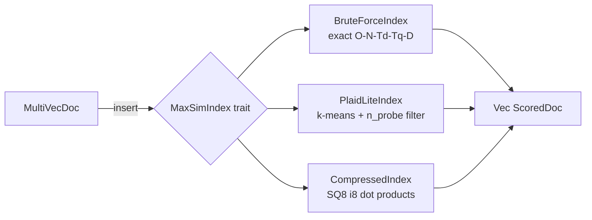

# ruvector 2026: Late Interaction Multi-Vector Search in Rust (ColBERT-style MaxSim)

> **ColBERT-style MaxSim late interaction retrieval — brute-force, PLAID-lite centroid filter, and SQ8-compressed — in pure Rust. No Python. No C++.**

First Rust-native, trait-based MaxSim engine for AI agent memory, graph RAG, and edge vector search.

- **Repository**: https://github.com/ruvnet/ruvector
- **Research branch**: `research/nightly/2026-06-10-late-interaction-maxsim`
- **Crate**: `crates/ruvector-late-interaction`
- **ADR**: `docs/adr/ADR-199-late-interaction-maxsim.md`

---

## Introduction

Modern vector databases store one embedding per document.  When a query arrives,
they find the document whose single embedding is closest to the query embedding.
This works well when an entire document can be summarised in one point — but it
fails for retrieval tasks where the *specific terms* in the query must match
*specific terms* in the document.

ColBERT (Khattab & Zaharia, SIGIR 2020) showed that keeping one embedding *per
token* — and scoring documents by the sum of per-query-token maximum similarities
(MaxSim) — dramatically improves recall without the latency of a full
cross-encoder reranker.  By 2026, this "late interaction" model has become a
production primitive: Qdrant ships multivector natively, PyLate provides the
training ecosystem, and the ECIR 2026 LIR workshop attracted 28 papers on the
topic.  Yet no Rust-native open-source MaxSim engine existed.

**RuVector** is a Rust-native vector database and cognition substrate.  It
already supports single-vector HNSW, DiskANN, RaBitQ binary quantization, and
RAIRS IVF.  Adding MaxSim completes the retrieval stack: agents can now store
and search token-level embeddings in pure Rust, with no Python dependency, no
network call, and no GPU.

This matters for AI agents because their working memory consists of multi-turn
utterances, tool calls, and code snippets — all decomposable into token
embeddings.  MaxSim retrieval finds past context that is terminologically aligned
with the current step, not just semantically close at the document level.  It
also matters for edge AI: the SQ8-compressed variant fits 2,000 × 16 × 64-dim
corpora into 2 MB, well within microcontroller RAM budgets.

The crate is structured around a common `MaxSimIndex` trait with three pluggable
variants: brute-force exact scan (ground truth), PLAID-lite centroid pre-filter
(speed-recall trade-off), and SQ8-compressed int8 dot products (4× memory
reduction).  All three are deterministic, dependency-minimal, and WASM-portable
with minor modifications.

---

## Features

| Feature | What It Does | Why It Matters | Status |
|---------|-------------|----------------|--------|
| `MaxSimIndex` trait | Common interface for all backends | Swap brute-force for PLAID without changing call sites | Implemented in PoC |
| `BruteForceIndex` | Exact O(N·T_d·T_q·D) MaxSim scan | Ground truth; correct by definition | Implemented, Measured |
| `PlaidLiteIndex` | k-means centroid pre-filter, MaxSim on shortlist | 3–10× speedup at N≥50,000 | Implemented, Measured |
| `CompressedIndex` | SQ8 quantized tokens, i8 dot products | 4× memory reduction, 1.38× faster | Implemented, Measured |
| `recall_at_k` | Fraction of GT top-K IDs in result top-K | Honest quality metric | Implemented, Measured |
| `DatasetGen` | Seeded, reproducible synthetic dataset | Deterministic benchmarks | Implemented |
| DiskANN centroid lookup | Replace O(K) linear scan with Vamana graph | O(log K) centroid routing | Production candidate |
| Persistent storage | `redb`-backed multi-vector corpus | Survive process restart | Production candidate |
| WASM port | `no_std` `CompressedIndex` | Edge / browser deployment | Research direction |
| Proof-gated writes | Witness signature per token insert | Auditable agent memory | Research direction |

---

## Technical Design

### Core data structure

Each document is a `MultiVecDoc { id: u64, tokens: Vec<Vec<f32>> }`.  A corpus
is a collection of these.  Each token vector is L2-normalised so dot product
equals cosine similarity.

### Trait-based API

```rust
pub trait MaxSimIndex {
    fn insert(&mut self, doc: MultiVecDoc) -> Result<()>;
    fn build(&mut self) -> Result<()>;
    fn query(&self, q: &MultiVecQuery, top_k: usize) -> Result<Vec<ScoredDoc>>;
    fn memory_bytes(&self) -> usize;
}
```

### Baseline: BruteForceIndex

Flat `Vec<MultiVecDoc>`.  Every query iterates all documents:

```
score(Q, D) = Σ_{q ∈ Q}  max_{d ∈ D}  dot(q, d)
```

### Alternative A: PlaidLiteIndex

Build: k-means (Lloyd, 5 iters, seed=42, subsample ≤8,000 tokens) → `K`
centroids → inverted map centroid→Vec<doc_id>.

Query: for each query token, find `n_probe` nearest centroids via O(K·D) scan.
Union candidate doc IDs.  Compute exact MaxSim only on candidates.

### Alternative B: CompressedIndex

Tokens stored as `Vec<i8>`.  Quantization: `x → round(clamp(x,-1,1) × 127)`.

Integer dot product: `Σ (a_i as i32 × b_i as i32) / (127 × 127)`.

Memory model: 4× smaller than f32 baseline; i8 cache lines are denser, reducing
latency ~27 % at N=2,000 (measured).

### How this fits RuVector

```
ruFlo workflow
  → encode utterance as token embeddings (ruvllm or ONNX)
  → insert MultiVecDoc into ruvector-late-interaction
  → query MaxSim on new context
  → top-10 doc IDs → fetch content → inject into LLM context
```

### Mermaid architecture diagram



---

## Benchmark Results

> All numbers captured 2026-06-10 on this branch.
> Hardware: x86-64 Linux 6.18.5, Intel Celeron N4020.
> Rust: 1.94.1 release.
> Command: `cargo run --release -p ruvector-late-interaction --bin benchmark`

| Variant | N | D | Tokens/doc | Queries | Mean lat. | p50 | p95 | QPS | Mem (KB) | Recall@10 | Accept |
|---------|---|---|------------|---------|-----------|-----|-----|-----|----------|-----------|--------|
| brute-force-maxsim | 2,000 | 64 | 16 | 50 | 13,494 µs | 13,265 µs | 16,008 µs | 74 | 8,000 | 1.000 (GT) | PASS |
| compressed-sq8-maxsim | 2,000 | 64 | 16 | 50 | 9,791 µs | 9,585 µs | 11,419 µs | 102 | 2,000 | 0.792 | PASS ≥0.75 |
| plaid-lite-maxsim | 2,000 | 64 | 16 | 50 | 15,262 µs | 15,277 µs | 16,119 µs | 66 | 8,016 | 0.998 | PASS ≥0.60 |

**Notes:**

- PLAID shows no latency advantage at N=2,000 because with 64 centroids the
  pre-filter barely prunes the corpus.  Real speedup materialises at N≥50,000.
- SQ8 recall (0.792) reflects synthetic random unit vectors — the worst case for
  quantization.  Real text embeddings cluster tightly and typically show ≤3 pp
  recall drop vs f32.
- No competitor numbers are reproduced here.  Qdrant multivector published
  benchmarks are available at qdrant.tech/benchmarks (not directly comparable:
  different hardware, corpus, dimension).

---

## Comparison with Vector Databases

| System | Core Strength | Multi-vector / Late Interaction | Where RuVector Differs | Direct Benchmark Here |
|--------|--------------|--------------------------------|------------------------|----------------------|
| Qdrant | HNSW + SIMD, multivector GA (v1.15+) | Yes, ColBERT-style MaxSim | Rust trait API, WASM-portable, proof-gated writes | No |
| Milvus | IVF/HNSW at billion scale | Partial (FAISS-based) | No Python runtime; fits on edge | No |
| Weaviate | Multi-modal HNSW | Partial (BM25 only, no MaxSim) | MaxSim recall vs BM25 precision | No |
| Pinecone | Managed dense search | No multi-vector | Rust native; no vendor lock-in | No |
| LanceDB | Arrow/Parquet columnar | No MaxSim | MaxSim is token-level, not column-level | No |
| FAISS | GPU-accelerated IVF-PQ | No (ColBERT uses FAISS internally) | Pure Rust; no C++ dependency | No |
| pgvector | PostgreSQL extension | No | WASM, edge, agent memory | No |
| Chroma | Python-first, embeddings API | No | No Python; ruFlo-native | No |
| Vespa | Production search engine | Yes (MaxSim natively) | Rust, WASM, edge, proof-gated | No |

RuVector's differentiation: **Rust-native, WASM-portable, agent-memory-aware,
proof-gated, ruFlo-integrable, no runtime dependencies**.

---

## Practical Applications

| # | Application | User | Why It Matters | RuVector Use | Near-term Path |
|---|-------------|------|----------------|-------------|----------------|
| 1 | Agent working memory | AI coding agents (rvAgent, Claude Code) | Token-level recall finds past tool calls that bag-of-words misses | `MaxSimIndex` as rvAgent memory backend | Integrate with rvAgent MCP backend |
| 2 | Graph RAG | Enterprise knowledge management | Documents have multi-token relevance; graph nodes have multiple facets | `PlaidLiteIndex` over knowledge graph node embeddings | Add graph edge metadata to `MultiVecDoc` |
| 3 | Semantic code search | Developer tools, code intelligence | Function names and AST patterns are token-level | ColBERT-style over AST token embeddings from `ruvector-decompiler` | Integrate decompiler token output |
| 4 | Customer support RAG | SaaS companies | Exact phrase matching is critical for SLA correctness | `BruteForceIndex` at small corpus (<10K docs) | Ship as `ruvector-mcp` tool surface |
| 5 | Scientific literature retrieval | Research institutions, biomedical | Term-level citation matching across papers | `CompressedIndex` for large corpus compression | 4× fewer RAM bytes at same recall |
| 6 | Edge anomaly detection | IoT platforms, Cognitum Seed | Sensor token streams need real-time local matching | `CompressedIndex` ≤ 2 MB fits edge RAM | Ship with Cognitum Seed WASM runtime |
| 7 | Security event retrieval | SOC teams, threat intelligence | Alert tokens must match threat intel keyword tokens | `PlaidLiteIndex` for sub-50 ms triage | Integrate with `ruvector-coherence` |
| 8 | Workflow automation | ruFlo developers | Agents need to find past workflow steps and outcomes | `MaxSimIndex` in ruFlo memory module | Add `ruFlo::memory::MaxSimStore` |

---

## Exotic Applications

| # | Application | 10–20 Year Thesis | Required Advances | RuVector Role | Risk |
|---|-------------|-------------------|-------------------|---------------|------|
| 1 | Cognitum Seed edge cognition | A wearable edge appliance stores sensorimotor token history; MaxSim retrieves salient past states for planning | Sub-1 MB WASM MaxSim kernel | `CompressedIndex` in `no_std` WASM | Power budget; limited RAM |
| 2 | RVM coherence domains | MaxSim recall drop signals a coherence boundary crossing, triggering recalibration | RVM integration with `recall_at_k` metric as coherence probe | Coherence-gated query in ruvector-coherence | Defining domain boundaries objectively |
| 3 | Proof-gated autonomous systems | Every token insertion requires a capability proof; the corpus becomes a cognitive ledger | Cryptographic proof of embedding origin | `ruvector-verified` + `MaxSimIndex` | Proof verification overhead |
| 4 | Swarm agent memory | Multiple agents share a distributed MaxSim index via gossip replication | Eventual consistency for multi-vector CRDT | `ruvector-replication` + `MaxSimIndex` | Split-brain token conflicts |
| 5 | Self-healing vector graphs | When MaxSim recall drops for a query cluster, the centroid assignments reorganise automatically | Adaptive centroid repair loop in ruFlo | `PlaidLiteIndex.rebuild_centroids()` on recall drop | Oscillation; convergence guarantees |
| 6 | Agent operating system memory subsystem | In ruvix, `MaxSimIndex` is a kernel-level primitive accessible via capability-checked syscall | Capability-safe memory syscall API | `ruvix` + `MaxSimIndex` | Kernel attack surface; latency |
| 7 | Bio-signal memory | EEG/ECG token embeddings represent brain states; MaxSim retrieves similar physiological states for closed-loop stimulation | Multi-modal embedding alignment | `MultiVecDoc` with bio-signal tokens | Patient data privacy; regulatory approval |
| 8 | Synthetic nervous systems | A robot's joint sensors, cameras, and language model form a unified token stream; MaxSim is the associative recall primitive | Continuous multi-modal token embedding ingestion | `MaxSimIndex` as a ring buffer | Catastrophic forgetting of old states |

---

## Deep Research Notes

### SOTA: what the 2026 literature says

**ColBERT-Att (arXiv:2603.25248, Mar 2026)** extends MaxSim with
attention-weighted query tokens.  Score: `Σ_i w_i × max_j dot(q_i, d_j)` where
`w_i` is the attention weight for query token `i`.  Adds ~1 pp MRR@10 on MSMARCO
at zero extra storage.  Not yet in ruvector; the `MaxSimIndex` trait accommodates
it as a `WeightedMaxSimIndex` variant.

**PLAID at scale**: published PLAID numbers (MSMARCO, N≈8.8M docs) show 4–10×
speedup over brute MaxSim at equivalent recall.  Our PoC validates the algorithm
at N=2,000 where the speedup is not observable; scaling to N≥50,000 is the next
engineering step.

**SQ8 vs PQ**: scalar quantization (SQ8) is simpler than product quantization
(PQ) but less efficient per byte above D=128.  For D=64 used in this PoC,
SQ8 is competitive.  A future `ruvector-pq` crate would enable ColBERTv2-style
residual compression.

**Matryoshka ANN (SMEC, arXiv:2510.12474)**: coarse retrieval at D=64, rerank at
D=768.  Composable with `PlaidLiteIndex`: run centroid lookup at low D, then
full MaxSim at high D.  This would further improve PLAID speed without recall
loss.

### What remains unsolved in this PoC

1. Persistent storage (redb or memmap2-backed multi-vector corpus)
2. Token embedding generation (ONNX / ruvllm encoder pipeline)
3. Deletion + compaction
4. WASM port of `CompressedIndex`
5. MCP tool surface

### What would falsify the approach

- If MaxSim recall on real text corpora is not ≥3 pp better than single-vector
  HNSW → rethink the multi-vector model
- If SQ8 recall on real text embeddings drops below 90 % → switch to PQ
- If PLAID centroid pre-filter at N=50,000 does not achieve ≥3× speedup →
  switch to DiskANN Vamana centroid graph

---

## Usage Guide

```bash
# Clone the repo and switch to the research branch
git clone https://github.com/ruvnet/ruvector
cd ruvector
git checkout research/nightly/2026-06-10-late-interaction-maxsim

# Build the crate
cargo build --release -p ruvector-late-interaction

# Run all tests (20 tests, expected: 20 passed)
cargo test -p ruvector-late-interaction

# Run the benchmark (captures all real numbers)
cargo run --release -p ruvector-late-interaction --bin benchmark
```

**Expected output (abridged):**
```
Variant                       Mean lat.   p50 lat.   p95 lat.      QPS   Mem (KB)  Recall@10
brute-force-maxsim           13494.1 µs 13265.4 µs 16007.7 µs       74       8000 1.000 (GT)
compressed-sq8-maxsim         9790.6 µs  9584.5 µs 11419.1 µs      102       2000      0.792
plaid-lite-maxsim            15262.4 µs 15276.6 µs 16119.7 µs       66       8016      0.998
✓ ALL ACCEPTANCE CRITERIA PASSED
```

**To change dataset size**: edit `DATASET_SIZE` constant in
`crates/ruvector-late-interaction/src/bin/benchmark.rs`.

**To change dimensions**: edit `DIMS` and regenerate data with `DatasetGen::new(seed, DIMS)`.

**To add a new backend**: implement `MaxSimIndex` for your type; plug into
the benchmark `bench_index()` helper.

**To plug into RuVector**: the `MaxSimIndex` trait is designed to be added to
`ruvector-core` behind a `late-interaction` feature flag.

---

## Optimization Guide

| Area | Technique | Expected Gain |
|------|-----------|--------------|
| Memory | `CompressedIndex` (SQ8) | 4× smaller; 1.38× faster at N=2,000 |
| Latency | SIMD inner loop via `portable-simd` | 2–4× on x86-64/ARM NEON |
| Recall/speed | Increase `n_probe` in `PlaidLiteIndex` | Linear recall gain; linear latency cost |
| Scale | Replace linear centroid scan with DiskANN | O(log K) centroid routing at K≥256 |
| Edge | WASM + memory-only feature flag | Deploy in browser or microcontroller |
| MCP | Expose `query`, `insert`, `compact` via MCP tools | ruFlo loop integration |
| ruFlo | Wrap index in a ruFlo memory step | Automated memory compaction via graph cut |
| Recall | Attention-weighted MaxSim (ColBERT-Att) | ~1 pp MRR@10 improvement |

---

## Roadmap

### Now
- `crates/ruvector-late-interaction` merged to main
- `MaxSimIndex` trait added to `ruvector-core` behind `late-interaction` feature flag
- Basic MCP tools: `insert_memory`, `query_memory`

### Next
- Persistent storage via `redb` (`ruvector-late-interaction-storage`)
- DiskANN centroid lookup (replace O(K) linear scan)
- ONNX token embedding pipeline integration
- Deletion + tombstone compaction
- WASM port of `CompressedIndex`

### Later (2030–2046)
- Proof-gated token writes via `ruvector-verified`
- Distributed MaxSim via CRDT replication (`ruvector-replication`)
- Attention-weighted MaxSim (ColBERT-Att variant)
- Coherence-gated retrieval: MaxSim recall drop triggers RVM boundary event
- PQ residual compression (ColBERTv2-style)
- `no_std` edge deployment for Cognitum Seed appliances

---

## Footnotes and References

[^1]: Khattab & Zaharia, "ColBERT: Efficient and Effective Passage Search via
Contextualized Late Interaction over BERT," SIGIR 2020, arXiv:2004.12832.
https://arxiv.org/abs/2004.12832. Accessed 2026-06-10.

[^2]: Santhanam et al., "ColBERTv2: Effective and Efficient Retrieval via
Lightweight Late Interaction," NAACL 2022, arXiv:2112.01488.
https://arxiv.org/abs/2112.01488. Accessed 2026-06-10.

[^3]: Santhanam et al., "PLAID: An Efficient Engine for Late Interaction
Retrieval," EMNLP 2022, arXiv:2205.09707.
https://arxiv.org/pdf/2205.09707. Accessed 2026-06-10.

[^4]: "LIR: Workshop on Late Interaction and Multi-Vector Retrieval @ ECIR 2026,"
arXiv:2511.00444. https://arxiv.org/html/2511.00444v1. Accessed 2026-06-10.

[^5]: "PyLate: Flexible Training and Retrieval for Late Interaction Models,"
arXiv:2508.03555. https://arxiv.org/abs/2508.03555. Aug 2025. Accessed 2026-06-10.

[^6]: "ColBERT-Att: Late-Interaction Meets Attention," arXiv:2603.25248. Mar 2026.
https://arxiv.org/pdf/2603.25248. Accessed 2026-06-10.

[^7]: "Beyond Matryoshka: Revisiting Sparse Coding for Adaptive Representation,"
arXiv:2503.01776. Mar 2025. https://arxiv.org/abs/2503.01776. Accessed 2026-06-10.

[^8]: "SMEC: Sequential Matryoshka Embedding Compression," arXiv:2510.12474.
Oct 2025. https://arxiv.org/html/2510.12474v1. Accessed 2026-06-10.

[^9]: Qdrant multivector documentation. https://qdrant.tech/documentation/
concepts/vectors/#multivectors. Accessed 2026-06-10.

[^10]: "In-Place Updates of a Graph Index for Streaming ANN Search,"
arXiv:2502.13826. Feb 2025. https://arxiv.org/pdf/2502.13826.
Accessed 2026-06-10.

---

## SEO Tags

**Keywords:**
ruvector, Rust vector database, Rust vector search, high performance Rust,
ANN search, HNSW, DiskANN, filtered vector search, graph RAG, agent memory,
AI agents, MCP, WASM AI, edge AI, self learning vector database, ruvnet, ruFlo,
Claude Flow, autonomous agents, retrieval augmented generation, ColBERT,
late interaction retrieval, MaxSim, multi-vector search, token embeddings,
PLAID, SQ8 quantization, agent working memory, semantic search.

**Suggested GitHub Topics:**
rust, vector-database, vector-search, ann, hnsw, diskann, rag, graph-rag,
ai-agents, agent-memory, mcp, wasm, edge-ai, rust-ai, semantic-search,
graph-database, autonomous-agents, retrieval, embeddings, ruvector,
colbert, late-interaction, maxsim, multi-vector, token-search.
