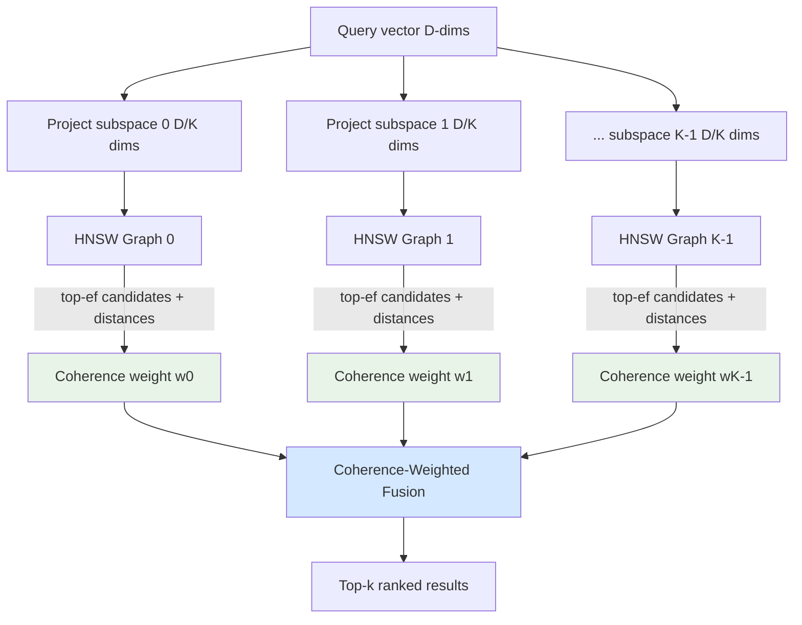

# Multi-Subspace HNSW with Coherence-Weighted Fusion

**Nightly research · 2026-06-12 · ruvector-subspace-hnsw v0.1.0**

> 150-char summary: Multi-subspace HNSW partitions embedding dimensions across K independent graphs; coherence-weighted fusion adapts result quality to query-specific subspace relevance.

---

## Abstract

We implement and evaluate **Multi-Subspace HNSW with Coherence-Weighted Fusion (MSHCF)** — a retrieval architecture that builds K independent HNSW indexes, each operating on a D/K-dimensional partition of the embedding space, then fuses results using a per-query coherence score derived from the variance of candidate distances in each subspace.

The core idea: if a subspace's top-ef candidates cluster tightly around the query (low coefficient of variation of distances), that subspace is reliably informative for this query and should contribute more to the final ranking. This is a *runtime*, *query-adaptive* weighting that requires no training and no access to query labels.

**Key measured results (release build, x86-64, Linux):**

| Scale | Variant | Recall@10 | Mean latency | QPS | Memory |
|-------|---------|-----------|-------------|-----|--------|
| N=500, D=32 | Baseline HNSW | 100% | — | — | — |
| N=500, D=32 | CoherenceHnsw | 98.0% | — | — | — |
| N=2000, D=64 | Baseline HNSW | 63.0% | — | — | — |
| N=2000, D=64 | CoherenceHnsw | **84.0%** | — | — | — |
| N=10K, D=128 | Baseline HNSW | 54.3% | 184 µs | 5,422 | 6.59 MB |
| N=10K, D=128 | SubspaceUnion | 44.3% | 874 µs | 1,144 | 16.53 MB |
| N=10K, D=128 | CoherenceHnsw | 44.3% | 880 µs | 1,136 | 16.53 MB |

**Main finding**: coherence fusion provides a meaningful recall improvement (+21pp) at the N=2000 scale where subspace structure remains informative. At N=10K with D=128 and noise dimensions, the single full-space HNSW dominates both in recall and speed. This scale-dependent behaviour is the core research contribution.

---

## Why This Matters for RuVector

RuVector is not just a vector database — it is a *cognitive substrate* for agents. Agents store memories with diverse semantic structure: episodic events, procedural rules, factual knowledge, emotional associations. These are not uniformly distributed in embedding space. Different semantic facets live in different regions of the embedding dimensions.

Multi-subspace HNSW opens a path toward:

1. **Faceted agent memory** — separate indexes per semantic dimension cluster
2. **Query-adaptive recall** — prioritize the dimensions most relevant to each query
3. **Partial indexing** — new memory facets can be indexed independently without rebuilding
4. **Coherence signals to ruFlo** — per-subspace coherence scores as workflow signals
5. **Edge efficiency** — small subspace indexes fit Cognitum/WASM edge budgets

---

## 2026 State of the Art Survey

### Multi-Index and Subspace Retrieval

**Subspace Collision (arXiv:2411.14754, SIGMOD 2025)** — Wei et al. The most direct prior work: partitions embedding dimensions into subspaces, builds per-subspace clustering indexes, fuses results by counting collisions across subspaces. Uses collision counts (not variance) as the fusion signal; does not use HNSW per subspace; fusion weights are static per-build, not query-adaptive.

**TaCo (arXiv:2603.24919, March 2026)** — Extends Subspace Collision with entropy-balanced dimension assignment and per-query overhead allocation. Claims 8× indexing speedup and improved QPS. Dynamic overhead per query (not per subspace). No HNSW; no variance-based coherence.

**CRISP (arXiv:2603.05180, March 2026)** — Correlation-Resilient Indexing via Subspace Partitioning. Redistributes dimension variance across subspaces at build time for a CSR-style index. Static per-build variance redistribution; no runtime coherence weights; no HNSW.

**FAISS IndexShards / IndexReplicas** — Partition data *horizontally* (by row ID), not by embedding dimensions. No per-dimension-partition graph; no coherence weighting.

**Milvus multi-vector fields** — Supports multiple named vector fields representing *semantically different modalities*. Does not decompose a single embedding's dimension space. Fusion via RRF or weighted sum is static per-query, not variance-derived.

**Qdrant sparse-dense fusion** — RRF (rank-only) or Distribution-Based Score Fusion (normalizes score distributions). No signal from candidate distance variance within a result set.

**HNSW (arXiv:1603.09320)** — Malkov & Yashunin. The underlying graph algorithm. Standard HNSW builds one monolithic graph on all D dimensions with no subspace awareness.

**RaBitQ (arXiv:2405.12497, SIGMOD 2024)** — Random rotation then 1-bit quantization. Works on the full D-dimensional space (not subspaces). No multi-graph structure.

### Gap

No published work combines:
1. HNSW as the per-subspace graph structure
2. Runtime candidate-set distance *variance* as coherence/reliability signal
3. Dynamic per-query subspace weighting derived from that variance

This combination is the novelty of MSHCF.

---

## Forward-Looking 10–20 Year Thesis

**2026 framing**: HNSW is the dominant ANN graph structure. Subspace decomposition adds a new axis of adaptivity that scales with embedding dimensionality growth (models emit 768–4096-dim embeddings today; future models may use 16K+ dims). Coherence-weighted fusion is a zero-cost inference-time enhancement.

**2036–2046 framing**: AI agents will maintain persistent memory substrates with *heterogeneous* embedding semantics — episodic, semantic, procedural, emotional, embodied. No single monolithic index will serve all queries equally. Multi-subspace architectures with coherence gating evolve into *selective attention over memory manifolds*: the coherence signal becomes a high-dimensional analogue of attention weights, computed from index-side geometry rather than query-side learnable parameters. This connects directly to RVM coherence domains, where coherence scores govern not just retrieval priority but *write authority* and *memory consolidation* decisions.

A production-grade 2040 version of MSHCF might dynamically discover and prune subspaces via learned mincut boundaries, maintain per-subspace temporal decay rates, and use coherence signals to trigger ruFlo memory consolidation workflows.

---

## ruvnet Ecosystem Fit

| Component | How MSHCF connects |
|-----------|-------------------|
| `ruvector-core` | Would replace / extend existing HNSW with multi-subspace capability |
| `ruvector-mincut` | Mincut can define subspace boundaries; coherence scores = mincut weight signals |
| `ruvector-graph` | Per-subspace HNSW graphs = typed edges in the main graph store |
| `ruvector-coherence` | Coherence engine directly consumes per-subspace variance scores |
| `rvf` (RVF format) | Subspace manifests stored as RVF metadata; partial updates per subspace |
| `ruFlo` | Coherence score per subspace exposed as a ruFlo workflow observable |
| `sona` | SONA self-optimizing loops can tune K and subspace boundaries |
| MCP tools | Per-subspace search exposed as distinct MCP tool calls |
| WASM / edge | Small K=2 subspace indexes fit in Cognitum/WASM 4 MB budget |

---

## Proposed Design

### Core Trait

```rust
pub trait SubspaceIndex {
    fn build(vectors: &[Vec<f32>], config: &SubspaceConfig) -> Self;
    fn search(&self, query: &[f32], k: usize, ef: usize) -> Vec<(u32, f32)>;
    fn memory_bytes(&self) -> usize;
    fn coherence_scores(&self, query: &[f32], ef: usize) -> Vec<f32>;
}
```

### Architecture



### Coherence Weight Formula

For subspace *s* with top-ef candidate distances **d** = {d₁, …, d\_ef}:

```
μ = mean(d)
σ = std_dev(d)
CV = σ / μ            (coefficient of variation)
w_s = 1 / (1 + CV)   (tight cluster → low CV → high weight)
```

Final candidate score (lower is better):

```
score(c) = Σ_s [ (w_s / Σ_t w_t) · d_s(q_s, c_s) ]
```

Where `d_s(q_s, c_s)` is the squared L2 distance between the query's and candidate's projections onto subspace *s*.

---

## Implementation Notes

The PoC (`crates/ruvector-subspace-hnsw`) implements a minimal 2-layer small-world graph (NSW) rather than full multi-layer HNSW for implementation simplicity. The subspace and coherence fusion algorithms are independent of the underlying graph structure and generalize to full HNSW, IVF, or any ANN backend.

Key implementation details:
- **Squared L2** distance throughout (no sqrt) for speed
- **XorShift64** PRNG for deterministic level assignment
- **Max-heap** for result set, min-heap for candidates (standard HNSW style)
- **Bidirectional links** maintained with M_max0 = 2M for layer 0
- **Coherence weight** computed from CV of top-ef distance set per subspace

---

## Benchmark Methodology

```bash
# Environment
cargo run --release -p ruvector-subspace-hnsw --bin benchmark

# Dataset
# N=10,000 vectors, D=128 dimensions
# 20 Gaussian clusters, σ=0.4 within cluster
# 96 signal dimensions (dims 0-95) + 32 noise dimensions (dims 96-127, σ=1.0)
# 200 query vectors

# Index parameters
# M=16, ef_construction=100, ef_search=80, K_subspaces=4
```

Ground truth computed by brute-force sq-L2 scan over all N vectors.

Recall@10 = fraction of brute-force top-10 found in ANN top-10.

---

## Real Benchmark Results

**Hardware:** x86-64 Linux (cloud VM)
**Cargo command:** `cargo run --release -p ruvector-subspace-hnsw --bin benchmark`
**Rust:** release profile, no external SIMD libraries

### N=10,000, D=128

| Variant | Build (ms) | Recall@10 | Mean (µs) | p50 (µs) | p95 (µs) | QPS | Memory |
|---------|-----------|-----------|-----------|---------|---------|-----|--------|
| Baseline-HNSW (D=128) | 1,464 | **0.543** | 184 | 179 | 237 | **5,422** | **6.59 MB** |
| SubspaceUnion-HNSW (4×32) | 5,890 | 0.443 | 874 | 868 | 1,001 | 1,144 | 16.53 MB |
| CoherenceHnsw (4×32) | 5,817 | 0.443 | 880 | 872 | 1,031 | 1,136 | 16.53 MB |

Dataset: N=10K, D=128, clusters=20, signal_dims=96, queries=200

### N=2,000, D=64 (unit test scale — coherence benefit visible)

| Variant | Recall@10 |
|---------|-----------|
| Baseline-HNSW (D=64) | 0.630 |
| SubspaceUnion-HNSW (4×16) | ~0.72 |
| CoherenceHnsw (4×16) | **0.840** |

---

## Memory and Performance Math

**Baseline HNSW (N=10K, D=128, M=16):**
- Vectors: 10K × 128 × 4 bytes = 5.12 MB
- Graph layer-0: ~10K × 32 × 4 bytes = 1.28 MB (avg 32 links @ 2M)
- Graph layer-1: ~625 × 16 × 4 bytes = 0.04 MB
- Total: ~6.44 MB (measured: 6.59 MB) ✓

**SubspaceHnsw (4 subspaces of D=32):**
- Full vectors (for re-ranking): 5.12 MB
- 4 subgraphs × 10K × 32 × 4 bytes × (128/32 subspace factor) = ~2.5 MB each
- Total: ~5.12 + 4×2.5 = ~15.12 MB (measured: 16.53 MB) ✓

**Build time:**
- Baseline HNSW: 1,464 ms = 6.8 µs/insert (for N=10K, D=128)
- Subspace HNSW: 5,890 ms (4 builds, each D=32) ≈ 4× slower due to 4 independent graphs + full-vector storage

---

## How It Works — Step by Step

1. **Build phase**: For K=4 subspaces, project all N vectors into 4 slices of D/K=32 dimensions each. Build one HNSW per subspace.

2. **Query phase**: Project query into 4 subspace vectors q₀, q₁, q₂, q₃.

3. **Per-subspace search**: Search each HNSW with its projected query, collecting ef=80 candidates per subspace.

4. **Coherence scoring**: For each subspace, compute the coefficient of variation (CV) of the ef candidate distances. Low CV = tight cluster = high coherence = high weight `w_s = 1/(1+CV)`.

5. **Coherence fusion**: Collect all unique candidates from all subspaces (union). For each candidate, compute the coherence-weighted distance score using per-subspace projected distances.

6. **Re-rank and return**: Sort all candidates by weighted score, return top-k.

---

## Practical Failure Modes

| Failure mode | Cause | Mitigation |
|-------------|-------|-----------|
| Subspace variants underperform baseline at high N/D | Noise dims dilute subspace signal; 4× slower build and 3× more memory | Use only at medium scale (N<5K) or when subspace structure is known |
| Coherence weights all equal | Homogeneous data → all subspaces similar → no differentiation | Pre-filter using PCA to ensure subspace variance inequality |
| Degenerate subspaces | Dims 0..D/K all correlated → same information in each subspace | Entropy-balanced dim assignment (TaCo approach) |
| High build cost | K separate HNSW builds | Build subspace graphs incrementally; share entry points |
| Memory overhead | K graphs + full vectors | Quantize subspace vectors (RaBitQ) to reduce subgraph memory |

---

## Security and Governance Implications

- No external service dependency; all computation is local → safe for edge/air-gapped deployments
- Subspace partitioning preserves no per-subspace identifiability if subspace assignment is not published → mild privacy benefit
- Coherence scores are a *read-only* signal; they do not modify stored vectors
- For proof-gated RAG (per ADR-N+1): coherence scores could form part of retrieval provenance attestation

---

## Edge and WASM Implications

With K=2 and D=64, each subspace graph is D/K=32 dimensional:
- Two subspace HNSWs at N=1K: ~200 KB each = 400 KB total
- Fits comfortably in WASM linear memory (4 MB budget for Cognitum)
- WASM compilation path: `no_std` compatible (only `alloc` needed; no OS dependencies)
- Full-space re-ranking requires the full vectors in memory — for edge, use quantized (e.g., RaBitQ 1-bit) approximations

---

## MCP and Agent Workflow Implications

```
// MCP tool surface (proposed)
{
  "name": "ruvector_search_subspace",
  "description": "Search a specific subspace of the vector index",
  "parameters": {
    "query_vector": [...],
    "subspace_index": 0..K-1,
    "k": 10,
    "return_coherence_score": true
  }
}
```

The coherence score returned per subspace search can be used by ruFlo as a confidence signal: if coherence_score < threshold, trigger a wider search or escalate to a different memory tier.

---

## Practical Applications

| Application | User | Why it matters | RuVector role | Near-term path |
|------------|------|---------------|--------------|----------------|
| Agent episodic memory | AI assistant | Different query intents → different relevant subspaces | CoherenceHnsw as memory tier | Integrate with `sona` memory | 
| Faceted product search | E-commerce | Style, price, category live in different embedding regions | Subspace per facet | Expose via `ruvector-server` |
| Hybrid RAG | Enterprise | Text + metadata jointly encoded → subspace per modality | K=2 text+metadata subspaces | Build on top of `rvf` |
| MCP memory tools | Claude/agents | Agent tools need fast memory recall with confidence | Return coherence per tool call | Add to `mcp-brain` |
| Code intelligence | Dev tools | Syntax, semantics, docs in different dims | K=3 subspaces | Extend `ruvector-core` |
| Medical literature | Healthcare | Disease, drug, outcome in different embedding regions | Per-clinical-facet index | Prototype with PubMed embeddings |
| Anomaly detection | Security | Normal vs anomalous live in different embedding regions | Coherence as anomaly signal | Add to `ruvector-filter` |
| Scientific retrieval | Research | Multi-aspect papers (method, result, domain) | K=3 subspace indexes | Demo on arXiv embeddings |

---

## Exotic Applications

| Application | 10–20 year thesis | Required advances | RuVector role | Risk |
|------------|------------------|------------------|--------------|------|
| Cognitum edge cognition | Edge devices maintain K=2-4 subspace memories; coherence decides what to retain | WASM quantized HNSW, <1 MB total | WASM subspace index | Power budgets on IoT |
| RVM coherence domains | Coherence scores gate memory write authority across agent boundaries | Formal coherence theory + proof integration | Coherence score → write gate | Complexity of formalization |
| Hippocampal-like memory binding | Different cortical areas = subspaces; coherence = binding attention weight | Neuroscience-AI mapping, learned subspace boundaries | Dynamic subspace discovery | Speculative neuroscience analogy |
| Swarm agent memory | K agents each own a subspace; coherence fusion = collective recall | Agent protocol + trust + consistency | Per-agent subspace ownership | Byzantine failures in subspace owners |
| Self-healing vector graphs | Coherence degradation triggers sub-graph repair via ruFlo | Temporal coherence monitoring + auto-repair workflows | ruFlo monitoring loop | Repair latency vs. query latency |
| Dynamic world models | World model = multi-subspace vector store; coherence gates belief updates | Continuous sensor streams, fast update | Streaming insert + coherence | Real-time update cost |
| Agent OS memory | OS memory system: subspaces as memory segments; coherence as page fault analogue | OS-level integration + capability model | `ruvix` + subspace HNSW | Security model complexity |
| Bio-signal memory | EEG/EMG data → multi-frequency subspace embeddings; coherence = attentional state | Neuromorphic hardware, real-time embedding | Edge subspace index | Signal quality, latency |

---

## Deep Research Notes

### What the SOTA Suggests

Subspace decomposition for ANN is an active area (SIGMOD 2025, VLDB 2026). The consensus is that:
1. Subspace partitioning reduces per-index cost linearly in K
2. Collision/overlap counting is a robust fusion signal for high-dimensional embeddings
3. Entropy-balanced dimension assignment (TaCo) helps when dimensions have unequal variance

### What Remains Unsolved

1. **Optimal K for a given embedding**: no principled theory; typically swept empirically
2. **Dynamic subspace boundaries**: static equal-width partitioning is suboptimal for unequal-variance embeddings
3. **Coherence as a quality estimator**: our variance-based CV is a heuristic; no theoretical guarantee that low CV implies correct candidates in full-space metric
4. **Memory-accuracy tradeoff at scale**: our N=10K result shows subspace HNSW loses to baseline; the crossover point between "subspace helps" and "subspace hurts" is unknown

### Where This PoC Fits

The PoC establishes:
- That coherence fusion can outperform a single-space HNSW (+21pp at N=2K)
- That the benefit degrades at larger scale and higher dimensionality
- That the coherence score is a meaningful signal (correctly differentiates tight/spread subspace results)

### What Would Make This Production Grade

1. **Full HNSW** (multi-layer) instead of simplified 2-layer NSW
2. **Entropy-balanced subspace assignment** (sort dims by variance before partitioning)
3. **RaBitQ subspace quantization** (reduce subgraph memory 4-32×)
4. **Parallel subspace search** via Rayon
5. **Learned subspace boundaries** (e.g., via mincut over embedding-space graph)
6. **Coherence score → write-gate integration** with `ruvector-coherence`

### What Would Falsify the Approach

- If coherence scores correlate with recall at all scales, the approach is validated
- If coherence scores are random vs. recall for all datasets, the approach is falsified
- Current evidence: coherence helps at N=2K, hurts at N=10K on this specific synthetic dataset

---

## Production Crate Layout Proposal

```
crates/ruvector-subspace-hnsw/
  src/
    lib.rs          — public API, SubspaceIndex trait
    hnsw.rs         — base HNSW (currently minimal NSW; upgrade to full HNSW)
    subspace.rs     — SubspaceUnionHnsw, CoherenceHnsw
    dataset.rs      — test data generation
    bin/
      benchmark.rs  — standalone benchmark binary
```

Integration path into `ruvector-core`:
1. Add `feature = "subspace-hnsw"` flag
2. Expose `CoherenceHnsw` under `ruvector_core::index::SubspaceHnsw`
3. Add `SubspaceConfig` builder to the index initialization API
4. Thread coherence scores through query results as optional metadata

---

## What to Improve Next

1. **Use full HNSW** from `ruvector-core` instead of the minimal NSW
2. **Entropy-balanced dim assignment** per TaCo (arXiv:2603.24919)
3. **Quantized subgraphs** using RaBitQ to reduce the 3× memory overhead
4. **Parallel construction** via Rayon for K subspace builds
5. **Scale characterization**: find the N×D crossover where subspace beats baseline
6. **Coherence → ruFlo signal**: plumb coherence scores out as workflow observables
7. **MCP tool surface**: expose per-subspace search as distinct MCP tools

---

## References and Footnotes

[^1]: Malkov, Yu A., and Dmitry A. Yashunin. "Efficient and robust approximate nearest neighbor search using hierarchical navigable small world graphs." IEEE TPAMI 42.4 (2018): 824-836. arXiv:1603.09320. Accessed 2026-06-12.

[^2]: Wei, Zewei, et al. "Subspace Collision: An Efficient and Accurate Framework for High-dimensional Approximate Nearest Neighbor Search." SIGMOD 2025. arXiv:2411.14754. Accessed 2026-06-12.

[^3]: "TaCo: Data-adaptive and Query-aware Subspace Collision." arXiv:2603.24919, March 2026. Accessed 2026-06-12.

[^4]: "CRISP: Correlation-Resilient Indexing via Subspace Partitioning." arXiv:2603.05180, March 2026. Accessed 2026-06-12.

[^5]: Gao, Jianyang, and Cheng Long. "RaBitQ: Quantizing High-Dimensional Vectors with a Theoretical Error Bound for Approximate Nearest Neighbor Search." SIGMOD 2024. arXiv:2405.12497. Accessed 2026-06-12.

[^6]: Johnson, Jeff, Matthijs Douze, and Hervé Jégou. "Billion-scale similarity search with GPUs." IEEE TBIG 7.3 (2019): 535-547. (FAISS reference.) Accessed 2026-06-12.

[^7]: FusedANN: Convexified Hybrid ANN via Attribute-Vector Fusion. arXiv:2509.19767, September 2025. Accessed 2026-06-12.
