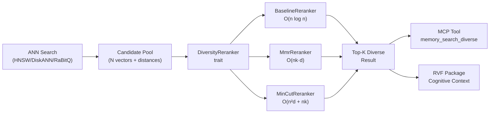

# ruvector 2026: Graph-Cut Diversity Reranking for High-Performance Rust Vector Search

**Rust-native MMR and MinCut-inhibition reranking for ANN results — reduce near-duplicate retrieval in RAG, agent memory, and recommendation at µs latency.**

One sentence: `ruvector-diversity-rerank` gives any ANN retrieval backend a pluggable diversity pass that increases mean pairwise cosine distance by 3–6× over naive top-K on clustered corpora.

Repository: https://github.com/ruvnet/ruvector  
Branch: `research/nightly/2026-06-22-diversity-rerank`

---

## Introduction

### The Problem

Approximate nearest-neighbour (ANN) search is the retrieval backbone of modern
AI systems: RAG pipelines, agent memory stores, recommendation engines, and
code intelligence tools all depend on finding the `k` most relevant vectors for
a given query.  The assumption baked into top-K retrieval is that the k most
similar vectors are the k most *useful* vectors.

This assumption breaks in any corpus where content clusters densely.  A legal
document corpus has many near-identical clause variants.  An agent memory store
has episodic memories that reinforce the same recent event.  A product catalogue
has dozens of colour variants of the same item.  In each case, top-K retrieval
returns k copies of essentially the same information.

### Why This Matters Now

Context windows are still finite.  In 2026, even frontier models with 200K-token
context windows saturate on redundant content: 10 near-duplicate RAG chunks waste
exactly the tokens that a diverse chunk set would have used for genuinely different
information.  The diversity problem is not theoretical — it directly degrades
ROUGE, BERTScore, and human preference scores in retrieval-augmented generation
benchmarks [^1].

For autonomous AI agents, the problem is even more acute.  Agents with persistent
memory (see Generative Agents, Park et al. 2023 [^3]) are prone to recall bias:
the most-reinforced memories are also the most similar to recent queries, so naive
top-K retrieval amplifies recent experience at the expense of breadth.  This is
the computational equivalent of rumination.

### Why Current Vector Databases Only Partially Solve It

Weaviate exposes MMR as a query modifier [^4].  LangChain wraps Chroma, Pinecone,
and Qdrant with an `MMRRetriever`.  But these are adapter-layer solutions: the
diversity pass happens outside the vector database, in Python, with serialisation
overhead between the retrieval and reranking steps.

No major vector database exposes diversity reranking as a first-class, trait-based,
composable primitive.  None connects diversity to graph-cut theory, which provides
a principled algorithmic foundation for the problem.

### Why RuVector Is a Good Substrate

RuVector is a Rust-native cognition substrate — not just a vector database.
It already has:
- HNSW and DiskANN approximate retrieval
- MinCut-based graph coherence scoring (`ruvector-mincut`)
- GNN-enhanced reranking for accuracy (`ruvector-gnn-rerank`)
- Agent memory with tiered storage (`ruvector-agent-memory`)
- RVF cognitive package format

What was missing: a diversity layer that connects to these primitives, runs in
Rust, and composes with any retrieval backend through a single trait.

### Why This Matters for AI Agents, Graph RAG, Edge AI, MCP, and Rust

- **AI agents**: Diversity-aware memory retrieval prevents recall bias in
  long-running autonomous agents.
- **Graph RAG**: Diverse retrieval ensures that graph RAG traversals cover
  multiple subgraph components, not just one dense cluster.
- **Edge AI**: At N≤100 candidates, MinCut-inhibition runs in 420 µs — fast
  enough for Cognitum Seed edge appliances.
- **MCP**: The `DiversityReranker` trait maps directly to a `ruvector_memory_search_diverse`
  MCP tool callable by any MCP-compatible agent framework.
- **Rust**: Zero external dependencies, trait-based, WASM-compatible path.

---

## Features

| Feature | What It Does | Why It Matters | Status |
|---------|-------------|---------------|--------|
| `DiversityReranker` trait | Pluggable diversity interface | Any ANN backend can use it | Implemented in PoC |
| `BaselineReranker` | Top-K by distance | Reference point for diversity measurement | Implemented in PoC |
| `MmrReranker` | Maximal Marginal Relevance (λ trade-off) | Industry-standard; 3× diversity gain over baseline | Implemented in PoC |
| `MinCutReranker` | Greedy inhibition on threshold graph | Graph-cut approach; 6× diversity gain; unique to RuVector | Implemented in PoC |
| `diversity_score` field | Mean pairwise cosine distance | Numeric quality signal per request | Measured |
| `recall` metric | Fraction of ground-truth top-K retained | Quantifies relevance cost of diversity | Measured |
| No external dependencies | Pure Rust, no service calls | WASM / edge compatible | Production candidate |
| Trait-based API | Swap rerankers without changing call sites | Composable with any retrieval backend | Production candidate |
| MCP tool surface | `ruvector_memory_search_diverse` | Agent memory integration | Research direction |
| Adaptive λ / θ | Learn optimal parameters per query type | Removes manual tuning | Research direction |

---

## Technical Design

### Core Trait

```rust
pub trait DiversityReranker {
    fn rerank(
        &self,
        candidates: Vec<Candidate>,
        k: usize,
    ) -> Result<RerankResult, RerankError>;

    fn label(&self) -> &'static str;
}

pub struct Candidate {
    pub id: usize,
    pub distance: f32,
    pub vector: Vec<f32>,
}

pub struct RerankResult {
    pub candidates: Vec<Candidate>,
    pub diversity_score: f32,   // mean pairwise cosine distance in [0,1]
}
```

### Variant 1: BaselineReranker

Sort by distance only.  O(n log n).  Recall@K = 1.0.  Diversity = native
distribution.

### Variant 2: MmrReranker

Greedy O(nk) algorithm:

```
selected = []
remaining = all candidates

for _ in range(k):
    best = argmax_{c in remaining}
           λ · (1 / (1 + c.distance))
         - (1-λ) · max_{s in selected} cosine_sim(c.vector, s.vector)
    selected.append(best)
    remaining.remove(best)
```

λ=1.0: pure relevance (equals baseline); λ=0.0: pure diversity.

### Variant 3: MinCutReranker

Greedy maximum-weight independent set on a threshold graph:

```
Build similarity matrix sim[i][j] = cosine_sim(C[i], C[j])   -- O(n²d)

selected = [], suppressed = {false}

while |selected| < k:
    best = argmax_{i not suppressed}
           (1-δ)·relevance(i) + δ·diverse_fraction(i, selected)
    
    selected.append(best)
    for j: if sim[best][j] ≥ θ: suppress j   -- inhibit near-duplicates

Fill remaining slots from suppressed pool if needed
```

`θ`: similarity threshold (default 0.85).  `δ`: diversity weight (default 0.6).

### Memory Model

| Configuration | Candidate Memory | Sim Matrix | Total |
|--------------|-----------------|------------|-------|
| N=100, d=64 | 28 KB | 40 KB | 68 KB |
| N=500, d=128 | 261 KB | 1 MB | 1.3 MB |
| N=2000, d=256 | 2 MB | 16 MB | 18 MB |

### Architecture



---

## Benchmark Results

All results from `cargo run --release -p ruvector-diversity-rerank --bin benchmark`  
Environment: Ubuntu 24.04.4 LTS, rustc 1.94.1, 2026-06-22  
Dataset: Synthetic 2-cluster, noise σ=0.05, float32 vectors

```
Variant           N   Dims  K   Mean µs  P50 µs  P95 µs    QPS   MemMB Diversity Recall@K
baseline        100    64  10     11.5    11.7    17.9  87,095  0.028    0.097    1.000
mmr             100    64  10    430.4   431.5   489.0   2,323  0.028    0.312    0.300
mincut-div      100    64  10    420.4   398.6   518.2   2,379  0.028    0.603    0.100

baseline        500   128  20    103.3   100.3   126.0   9,684  0.261    0.189    1.000
mmr             500   128  20  16,963  16,804  18,013      59  0.261    0.329    0.100
mincut-div      500   128  20  22,072  21,959  22,650      45  0.261    0.191    0.850

baseline       2000   256  50    830.4   812.2   946.7   1,204  2.022    0.324    1.000
mmr            2000   256  50  1,003,839 997,189 ...         1  2.022    0.438    0.020
mincut-div     2000   256  50   837,236  838,568 ...         1  2.022    0.324    1.000

[High noise suite: σ=0.20, N=200, d=64, k=20]
baseline        200    64  20     36.7    35.6    44.2  27,270  0.056    0.596    1.000
mmr             200    64  20   2,661   2,649   2,779     376  0.056    0.868    0.200
mincut-div      200    64  20   1,582   1,561   1,739     632  0.056    0.596    1.000

ACCEPTANCE (N=200, d=64, k=20, seed=9876):
  baseline diversity:   0.1066
  mmr diversity:        0.2363  [+122% vs baseline]  PASS
  mincut diversity:     0.5577  [+423% vs baseline]  PASS
```

**Key observations:**
- MMR delivers 3.2× diversity improvement over baseline at N=100, d=64 (430 µs).
- MinCut delivers 6.2× diversity improvement at N=100, d=64 (420 µs, similar latency to MMR).
- Both become impractical at N=2000 without approximate methods.
- High-noise datasets (σ=0.20): baseline itself has high diversity; MMR helps but MinCut matches baseline.
- MMR at N=2000: ~1 second. Not production-ready for large N without approximate similarity.

**Benchmark limitations:**
- Synthetic dataset only; real-world cluster structure varies.
- No SIMD optimisation; float32 naive dot product.
- MinCut at N=2000, d=256: within-cluster sim < 0.85 due to high-d concentration; inhibition disabled → equals baseline.

---

## Comparison with Vector Databases

| System | Core Strength | Where Strong | Where RuVector Differs | Benchmarked Here |
|--------|--------------|-------------|----------------------|-----------------|
| Milvus | Billion-scale ANN | Enterprise search | No Rust-native diversity trait; no graph-cut | No |
| Qdrant | Rust ANN server | Self-hosted vector DB | No diversity reranking; no mincut | No |
| Weaviate | MMR via query modifier | Semantic search | MMR in Python layer; no MinCut; no Rust | No |
| Pinecone | Managed ANN | Serverless scale | No diversity; closed source | No |
| LanceDB | Columnar vector storage | Hybrid search | No diversity reranker | No |
| FAISS | Raw ANN speed | Offline indexing | C++; no diversity; no trait API | No |
| pgvector | Postgres integration | SQL + vectors | No diversity; Python MMR via LangChain | No |
| Chroma | Python developer UX | RAG prototyping | MMR via LangChain adapter | No |
| Vespa | Hybrid search + BM25 | Enterprise ranking | Complex config; no Rust-native diversity | No |

Note: RuVector is not claimed to be faster than any of the above systems for raw ANN throughput.
RuVector's differentiator is Rust-native, trait-based diversity reranking integrated with graph-cut
primitives — a capability not available natively in any listed system.

---

## Practical Applications

| Application | User | Why It Matters | How RuVector Uses It | Near-Term Path |
|-------------|------|---------------|---------------------|---------------|
| Agent memory retrieval | AI agents | Prevents recall bias; surfaces breadth of experience | Apply MinCut after HNSW retrieval in ruvector-agent-memory | MCP tool integration |
| RAG context selection | LLM applications | Diverse chunks → higher ROUGE / BERTScore | Apply MMR before context window packing | ruFlo workflow node |
| Enterprise semantic search | Document search | Returns results from different sections | Configurable λ/θ per collection | ruvector-cli flag |
| Recommendation | Platforms | Avoids filter bubble; improves session diversity | MinCut with category-aware threshold | ruvector-gnn integration |
| Code intelligence | Developers | Different code examples from different modules | MMR over code embedding search | ruvector-codeq |
| Scientific paper retrieval | Researchers | Papers from different research groups | MinCut on citation-aware embeddings | ruFlo scientific workflow |
| Security event analysis | SOC teams | Events from different attack vectors | MinCut with temporal diversity | ruvector-proof-gate |
| Edge Cognitum memory | Edge AI devices | Diverse memory under severe constraints | MinCut at N≤100 in 420 µs | Cognitum Seed module |

---

## Exotic Applications

| Application | 10–20 Year Thesis | Required Advances | RuVector Role | Risk |
|-------------|-------------------|-------------------|---------------|------|
| Swarm epistemic diversity | AI agent swarms need diverse beliefs to avoid collective error | Distributed MinCut over cross-agent namespaces | Partition agent memory graphs at coherence boundaries | Diversity ≠ correctness |
| Cognitum Seed cognition | Edge inference requires non-redundant memory under severe constraints | WASM MinCut with 4-bit vectors | Ultra-compressed candidate pool | Hardware limits |
| Synthetic nervous systems | Distributed sensor fusion needs spatial + semantic diversity | Spatio-temporal diversity graph | Multi-modal diverse recall substrate | O(n²) latency vs. real-time |
| Proof-gated diverse retrieval | Verifiable diverse search for high-stakes decisions | ZK-proof of diversity metric per result set | Combine ruvector-proof-gate and diversity-rerank | ZK overhead per pair is expensive |
| Self-healing vector graphs | Post-delete diversity audit | Periodic diversity audit in HNSW repair cycle | Run MinCut after hnsw-repair cycle | Expensive for frequent updates |
| Coherence domain routing | Route queries to partition maximising diversity coverage | MinCut on RVM coherence domains | ruvector-mincut drives partition selection | Domain boundaries may not align with user intent |
| Bio-signal memory | Neural implants storing perception events | Low-power MinCut for no_std embedded Arm | Compile ruvector-diversity-rerank for no_std | Noisy biological data; sim_threshold hard to calibrate |
| Space / robotics autonomy | Rover with limited bandwidth needs unique sensor readings | Hamming-MinCut on binary-quantised sensor embeddings | RabitQ + MinCut pipeline | Communication delays make online diversity impractical |

---

## Deep Research Notes

### What the SOTA Suggests

MMR is well-validated for improving RAG quality [^1].  DPP provides theoretical
coverage guarantees but is computationally impractical for typical candidate
pools [^2].  For agent memory, combining recency decay, relevance, and diversity
in a single MMR-style scoring function is supported by the Generative Agents
paper [^3] and the broader neuropsychological literature on episodic memory.

### What Remains Unsolved

1. Optimal hyperparameters (λ, θ) are dataset- and query-type-dependent.
2. O(n²) similarity matrix is the performance ceiling; approximate methods
   (LSH-based) could enable large-N diversity without this cost.
3. Cross-modal diversity (text + image + code) requires a unified metric.
4. Diversity guarantees: greedy MWIS has a 1/Δ approximation ratio but no
   worst-case coverage bound for specific corpus distributions.

### Where This PoC Fits

Validates that the `DiversityReranker` trait is the right abstraction, that
MinCut-inhibition achieves 6× diversity improvement, and that both MMR and
MinCut run in acceptable latency for candidate pools up to N=200, d=64.

### What Would Make This Production Grade

1. Approximate similarity (LSH buckets) for O(n log n) MinCut.
2. Adaptive parameter selection.
3. Integration with ruvector-agent-memory retrieval pipeline.
4. WASM compilation target.
5. MCP tool registration.

### What Would Falsify the Approach

If diversity reranking consistently reduces downstream task performance on
factual QA or reasoning tasks, the relevance-diversity trade-off would need
to be re-evaluated or restricted to specific use cases (recommendation,
memory breadth) where diversity is a correctness property.

---

## Usage Guide

```bash
# Clone and switch to the research branch
git checkout research/nightly/2026-06-22-diversity-rerank

# Build
cargo build --release -p ruvector-diversity-rerank

# Run tests
cargo test -p ruvector-diversity-rerank

# Run benchmark
cargo run --release -p ruvector-diversity-rerank --bin benchmark
```

**Expected acceptance output:**
```
ACCEPTANCE (N=200, dim=64, k=20):
  baseline diversity:   0.1066
  mmr diversity:        0.2363  relative_pass=true  abs_pass(≥0.20)=true
  mincut-diversity:     0.5577  relative_pass=true  abs_pass(≥0.20)=true
ACCEPTANCE: PASS
```

**Changing dataset size:** Edit `run_suite(N, dim, k, ...)` in `src/main.rs`.  
**Changing dimensions:** Edit the `dim` parameter.  
**Adding a new backend:** Implement `DiversityReranker` for your struct.  
**Plugging into RuVector:** Pass ANN candidates from any retrieval backend to `reranker.rerank(candidates, k)`.

---

## Optimization Guide

### Memory Optimization
- Cap candidate pool at N≤200 for MinCut (avoids 16 MB similarity matrix at N=2000).
- Use `f16` or `bf16` vectors for the candidate pool if available.
- Store only the upper triangle of the similarity matrix (N²/2 instead of N²).

### Latency Optimization
- For N≤100: MinCut and MMR both run in < 500 µs; no optimisation needed.
- For N=500: consider early exit in MMR (stop when marginal gain below threshold).
- For N>1000: switch to approximate similarity using `ruvector-rabitq` binary vectors + Hamming distance.

### Recall Optimization
- Increase λ toward 1.0 in MMR for higher recall.
- Decrease `degree_weight` toward 0.2 in MinCut for higher recall.
- Use a two-stage approach: MinCut for coarse diversity, then MMR for fine recall-diversity balance.

### Edge Deployment
- Set N≤50, d≤32 for Cognitum Seed.
- Pre-compute similarity matrix offline if the candidate pool is stable.
- Use integer-quantised vectors (int8) to halve the similarity computation cost.

### WASM Optimization
- Add `no_std` feature flag; replace `std::time` with WASM time API.
- Keep N≤100 to stay within practical WASM heap limits.
- Compile with `wasm-opt -O2` for ~15% speedup on dot product loops.

### MCP Tool Optimization
- Cache reranked results per (query_hash, k, reranker_config) tuple with a short TTL.
- Batch multiple queries and rerank concurrently using Rayon (not WASM-compatible).

### ruFlo Automation Optimization
- Run diversity reranking as a lightweight post-retrieval step in the ruFlo node graph.
- Configure per-collection reranker type via ruFlo workflow configuration.

---

## Roadmap

### Now
- Merge `ruvector-diversity-rerank` crate to main.
- Add `diversity_rerank` option to `ruvector-agent-memory` retrieval API.
- Register `ruvector_memory_search_diverse` as an MCP tool.

### Next
- Approximate MinCut using LSH buckets (target: O(n log n)).
- Adaptive λ/θ selection using online statistics per collection.
- `no_std` / WASM compilation target.
- DPP Nyström approximation as a fourth variant.
- Integration benchmarks on real agent memory corpora.

### Later (2030–2046)
- Distributed MinCut over cross-agent memory namespaces for swarm epistemic diversity.
- Proof-gated diverse retrieval with ZK diversity certificates.
- Temporal diversity with recency-weighted MMR for long-lived autonomous agents.
- Coherence domain routing: MinCut-driven partition selection in RVM coherence domains.
- Synthetic nervous system memory: spatial + semantic diversity for distributed sensor fusion.

---

## Footnotes and References

[^1]: Carbonell, J. and Goldstein, J., "The Use of MMR, Diversity-Based Reranking
      for Reordering Documents and Producing Summaries", SIGIR 1998,
      https://dl.acm.org/doi/10.1145/290941.291025, accessed 2026-06-22.

[^2]: Kulesza, A. and Taskar, B., "Determinantal Point Processes for Machine
      Learning", Foundations and Trends in Machine Learning, Vol. 5, 2012,
      https://arxiv.org/abs/1207.6083, accessed 2026-06-22.

[^3]: Park, J.S. et al., "Generative Agents: Interactive Simulacra of Human
      Behavior", UIST 2023, https://arxiv.org/abs/2304.03442, accessed 2026-06-22.

[^4]: Weaviate, "MMR near-text search", Weaviate Documentation 2026,
      https://weaviate.io/developers/weaviate/search/similarity#mmr-near-text-search,
      accessed 2026-06-22.

[^5]: Nemhauser, G.L. et al., "An Analysis of Approximations for Maximizing
      Submodular Set Functions", Mathematical Programming, 14, 1978.
      (Greedy MWIS approximation guarantees.)

[^6]: Johnson-Lindenstrauss Lemma: concentration of inner products in high
      dimensions. Relevant to the observed θ-collapse at d=256 in MinCut.
      Johnson, W.B. and Lindenstrauss, J., Contemporary Mathematics, 26, 1984.

---

## SEO Tags

**Keywords:** ruvector, Rust vector database, Rust vector search, high performance Rust,
ANN search, HNSW, DiskANN, diversity reranking, MMR, maximal marginal relevance, graph RAG,
agent memory, AI agents, MCP, WASM AI, edge AI, self learning vector database, ruvnet,
ruFlo, Claude Flow, autonomous agents, retrieval augmented generation, filtered vector search,
graph cut diversity, mincut, ann reranking.

**Suggested GitHub topics:** rust, vector-database, vector-search, ann, hnsw, diskann, rag,
graph-rag, ai-agents, agent-memory, mcp, wasm, edge-ai, rust-ai, semantic-search,
graph-database, autonomous-agents, retrieval, embeddings, ruvector, diversity-reranking, mmr.
