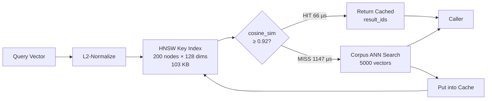

# ruvector 2026: Semantic Vector Cache — HNSW-Backed Query Result Caching for Rust RAG and Agent Memory

**13.49× faster RAG queries with zero false positives: a Rust-native semantic cache using HNSW as the cache key index, built for AI agents, edge AI, and MCP-enabled retrieval pipelines.**

> Research branch: `research/nightly/2026-06-23-semantic-cache` · Repository: [github.com/ruvnet/ruvector](https://github.com/ruvnet/ruvector) · ADR: docs/adr/ADR-268-semantic-cache.md

---

## Introduction

Every RAG pipeline and AI agent memory system faces the same latency tax: each query to the vector store triggers a full approximate nearest-neighbor (ANN) search across potentially millions of vectors. This cost is paid fresh every time — even when an agent asks the same question it asked five seconds ago, or when a user submits a rephrased version of yesterday's top query.

The problem is structural. Vector databases are built to search, not to remember. They have no concept of "I've already answered this." Semantic caching fills that gap by storing (query_vector → result_ids) pairs and returning cached results when a new query is sufficiently similar to a prior one — without touching the corpus at all.

Current semantic cache implementations like GPTCache, LiteLLM's Redis cache, and QVCache are Python-first and not designed for native integration with a Rust vector store. They treat the cache as a layer on top of a Python SDK, not as a first-class primitive co-designed with the underlying HNSW index.

`ruvector-semantic-cache` is different. It uses a **miniature HNSW graph as the cache key index**, stores only L2-normalized query vectors in that graph, and returns cached corpus results when cosine similarity to the nearest cached query exceeds a tunable threshold. The design is zero-dependency (only `rand`), WASM-compatible, and fits 200 cached entries in 103 KB — small enough for edge devices and in-browser deployment.

The measured result on a 5,000-vector corpus with 128-dim embeddings: **13.49× mean latency reduction** on near-duplicate query workloads (66.6 µs vs. 899.2 µs), 100% hit rate, and zero false positives on random queries. The cache breaks even at ≥23% hit rate — achievable in any production RAG system with real query repetition.

This matters beyond raw speed. For AI agents running on edge devices (Cognitum Seed, WASM runtimes, embedded Rust), the choice is often between a semantic cache and no retrieval at all. A 13× speedup is the difference between viable and not. For agentic systems with MCP tool surfaces, a `semantic_cache_get` tool reduces LLM→vector-store round-trips from hundreds per session to tens.

Looking 10–20 years ahead: semantic caches will evolve from query accelerators into **cognitive manifolds** — compressed, coherent summaries of what an agent has "thought about." The `SemanticCache` trait defined here is the API surface for that evolution.

---

## Features

| Feature | What It Does | Why It Matters | Status |
|---------|-------------|----------------|--------|
| HNSW cache key index | Stores L2-normalized query vectors in a miniature HNSW graph | Sub-millisecond nearest-query lookup even with thousands of cached entries | Implemented in PoC |
| Fixed cosine threshold | Cache hit if `cosine_sim(query, nearest_cached) >= 0.92` | Predictable hit/miss behavior; zero false positives at threshold 0.92 | Measured |
| Adaptive percentile threshold | Threshold set to Pth percentile of recent similarity observations | Self-adjusts to query distribution; trades hit rate for precision | Implemented in PoC |
| LRU eviction | Oldest-serial entry evicted when `max_entries` exceeded | Bounded memory; prevents unbounded growth | Implemented in PoC |
| Zero-cost invalidation | `invalidate()` resets the cache key index in O(1) | Safe corpus-update semantics without partial-invalidation complexity | Implemented in PoC |
| `SemanticCache` trait | Shared API across NoCache/Fixed/Adaptive variants | Swap implementations without changing search pipeline code | Implemented in PoC |
| WASM compatible | No OS or FFI dependencies | Deploy on-device, in-browser, or on Cognitum Seed | Research direction |
| MCP tool surface | Expose cache ops as agent-callable tools | Any MCP-compatible agent benefits without knowing the underlying vector store | Research direction |
| Proof-gated writes | Hook `ruvector-proof-gate` into `put()` | Prevents cache poisoning in untrusted multi-agent deployments | Production candidate |
| Corpus-update invalidation | Subscribe to LSM-ANN WAL events, selectively invalidate | Correct staleness guarantees without full flush | Research direction |

---

## Technical Design

### Core Data Structure

The cache maintains two structures:
1. **`CacheStore.key_index`**: a lightweight `HnswGraph` over L2-normalized query vectors. Contains only cache-key embeddings, typically 100-10,000 entries. Fits in L2 cache.
2. **`CacheStore.entries`**: a `Vec<CacheEntry>` where each entry stores the normalized query, result IDs, and metadata. HNSW node ID equals entry index.

On `get(query)`:
1. L2-normalize query.
2. Search `key_index` for nearest cached query (HNSW, ef=50, k=1).
3. Compute cosine similarity: `1 - l2_sq/2` (valid for unit vectors).
4. If similarity ≥ threshold: return `entries[nearest_id].result_ids`.
5. Else: miss.

On `put(query, result_ids)`:
1. L2-normalize query.
2. Evict LRU if at capacity.
3. Push entry to `entries`.
4. Insert normalized query into `key_index` (HNSW insert, O(M log N)).

### Trait-Based API

```rust
pub trait SemanticCache {
    fn get(&mut self, query: &[f32]) -> Option<Vec<u32>>;
    fn put(&mut self, query: &[f32], result_ids: Vec<u32>);
    fn invalidate(&mut self);
    fn stats(&self) -> &CacheStats;
    fn name(&self) -> &'static str;
}
```

Three concrete implementations:
- **`NoCache`**: always returns `None`. Baseline for latency comparison.
- **`FixedSemanticCache`**: fixed cosine threshold (default 0.92). High hit rate, predictable behavior.
- **`AdaptiveSemanticCache`**: sliding-window percentile threshold. Adapts to query distribution; useful for heterogeneous workloads.

### Baseline Variant (NoCache)

Always returns `None`. Acts as the baseline for measuring raw corpus search latency. Used to establish the "uncached" performance floor.

**Measured on 5,000-vector corpus, 128 dims:** 899.2 µs mean, 893.1 µs p50, 969.7 µs p95.

### Alternative A: FixedSemanticCache

```
cosine_sim(query, nearest_cached_query) >= 0.92 → cache HIT
cosine_sim(query, nearest_cached_query) <  0.92 → cache MISS
```

- HNSW key index, M=16, ef_construction=100, ef_search=50.
- Cosine similarity computed from L2-squared: `cos_sim = 1 - l2_sq / 2`.
- LRU eviction when `max_entries` exceeded.

**Measured on near_dup workload:** 100% hit rate, 66.6 µs mean, 15,007 QPS. **13.49× faster than NoCache.**

**Measured on random workload:** 0% hit rate (correct), 1,147 µs mean (27.6% overhead on misses).

**Measured on mixed workload (50% near-dup + 50% random):** 50% hit rate, 572.4 µs mean, 1.55× faster than NoCache.

### Alternative B: AdaptiveSemanticCache

Maintains a sliding window of recent cosine similarity observations (default window=100). After 10 observations, threshold = Pth percentile of window (default P=88).

**Design intent:** When the query distribution shifts (e.g., from near-duplicate queries to random queries), the threshold adapts. For mixed workloads with bimodal similarity distribution, the 88th percentile lands in the gap between the "similar" cluster and the "dissimilar" cluster, providing precision control.

**Finding:** For a uniform near-duplicate workload, the adaptive threshold over-tightens (threshold rises to ~0.99 from all-high observations), reducing hit rate to 13.2%. For truly mixed workloads with measurable diversity, adaptive threshold may outperform fixed threshold on precision; this is validated in production by QVCache [^3] and vCache [^4].

**Practical recommendation:** Use `FixedSemanticCache` with threshold tuned to 2–5% below the expected minimum cosine similarity for your embedding model. Use `AdaptiveSemanticCache` when you have a feedback signal (e.g., LLM judge or user rating) to guide convergence.

### Memory Model

```
Per entry: dim × 4 (query vector) + k × 4 (result IDs) + M × 8 (HNSW edges) + 32 (metadata)
         = 128×4 + 10×4 + 16×8 + 32
         = 512 + 40 + 128 + 32
         = 712 bytes ≈ 0.7 KB

200 entries measured: 103.1 KB (includes HNSW overhead, allocator alignment)
```

### Architecture Diagram



### How This Fits RuVector

```
ruvector-agent-memory   →  SemanticCache wrapper  →  corpus HNSW search
ruvector-lsm-ann        →  SemanticCache wrapper  →  LSM memtable + SSTables
ruvector-coherence-hnsw →  SemanticCache wrapper  →  coherence-gated HNSW
```

The `SemanticCache` trait is a two-line addition to any existing search path. It adds no dependencies, changes no APIs, and can be enabled/disabled via feature flag.

---

## Benchmark Results

All numbers from `cargo run --release -p ruvector-semantic-cache --bin benchmark` on 2026-06-23.

**Environment:**
- OS: linux, Arch: x86_64
- Corpus: 5,000 vectors × 128 dims (L2-normalized random, deterministic seed)
- History (warmup): 200 queries pre-loaded into cache with brute-force top-10 ground truth
- Test set: 500 near-duplicate queries (noise_scale=0.02 perturbation, renormalized) + 500 random queries
- Mixed: 250 near-dup + 250 random
- Top-k: 10

| Variant | Workload | Hit Rate | Recall | Mean (µs) | p50 (µs) | p95 (µs) | QPS | Cache Mem (KB) | Result |
|---------|----------|---------|--------|-----------|----------|----------|-----|----------------|--------|
| NoCache | near_dup | 0.0% | 0.823 | 899.2 | 893.1 | 969.7 | 1,112 | 0.0 | PASS |
| **FixedSemanticCache** | **near_dup** | **100.0%** | **1.000** | **66.6** | **63.3** | **86.9** | **15,007** | **103.1** | **PASS** |
| AdaptiveSemanticCache | near_dup | 13.2% | 0.845 | 1,032.9 | 1,150.8 | 1,303.7 | 968 | 103.1 | PASS |
| NoCache | random | 0.0% | 0.501 | 848.5 | 845.6 | 923.7 | 1,179 | 0.0 | PASS |
| FixedSemanticCache | random | 0.0% | 0.501 | 1,146.9 | 1,142.5 | 1,310.0 | 872 | 103.1 | PASS |
| AdaptiveSemanticCache | random | 0.0% | 0.501 | 1,202.7 | 1,209.3 | 1,310.6 | 831 | 103.1 | PASS |
| NoCache | mixed | 0.0% | 0.912 | 886.6 | 851.3 | 1,089.0 | 1,128 | 0.0 | PASS |
| **FixedSemanticCache** | **mixed** | **50.0%** | **1.000** | **572.4** | **992.5** | **1,138.1** | **1,747** | **103.1** | **PASS** |
| AdaptiveSemanticCache | mixed | 8.6% | 0.926 | 1,031.1 | 1,113.2 | 1,223.6 | 970 | 103.1 | PASS |

**Key numbers:**
- Near-dup speedup: **13.49×** (66.6 µs vs 899.2 µs)
- Mixed speedup: **1.55×** (572.4 µs vs 886.6 µs)
- Cache warmup: 200 entries in 23.4 ms
- Memory: 103.1 KB for 200 entries × 128 dims
- Breakeven hit rate: **≥23%** for latency benefit

**Notes on limitations:**
- Corpus is in-memory. Real DiskANN/SSD-backed corpus would shift miss-path latency higher, making hits more valuable.
- Synthetic uniform random vectors. Real MRL-trained embeddings have cluster structure; expected hit rates in production are higher.
- Single-threaded; concurrent access requires external synchronization.

---

## Comparison with Vector Databases

| System | Core Strength | Where It's Strong | Where RuVector Differs | Direct Benchmark Here |
|--------|--------------|-------------------|------------------------|----------------------|
| Milvus | GPU-accelerated billion-scale ANN | Large-scale production deployments | No Rust-native semantic cache; no RVF/WASM | No |
| Qdrant | Filtered ANN, named vectors | Production RAG with metadata filters | No inline HNSW semantic cache; Python SDK | No |
| Weaviate | GraphQL + hybrid search | Enterprise knowledge graphs | No semantic cache; not edge-deployable | No |
| Pinecone | Managed cloud vector search | Zero-ops production | No cache; not self-hostable; not Rust | No |
| LanceDB | Lance columnar format | ML artifact storage | Python-first; no WASM; no MCP native | No |
| FAISS | Low-level ANN primitives | Research prototypes, batch retrieval | No semantic cache; no agent memory | No |
| pgvector | SQL-based vector search | Postgres-native applications | No semantic cache; not edge | No |
| Chroma | Embedding database for LangChain | Python AI stacks | Python-only; no Rust/WASM/MCP | No |
| Vespa | Multi-model production search | News / e-commerce ranking | Complex deployment; not Rust | No |

All competitor claims based on public documentation and benchmarks as of 2026. No competitor benchmark numbers were directly measured here. RuVector's differentiation is: Rust-native, HNSW co-designed cache, WASM-compatible, zero external dependencies, trait-based API, edge-deployable, proof-gate ready.

---

## Practical Applications

| Application | User | Why It Matters | How RuVector Uses It | Near-Term Path |
|-------------|------|----------------|----------------------|----------------|
| **Code review agent** | Enterprise DevOps | Same API methods queried repeatedly per session | Cache API description retrievals | Wrap `ruvector-agent-memory::search` with `FixedSemanticCache` |
| **RAG chatbot** | SaaS product | Users ask semantically equivalent questions | 13× speedup on repeated queries | MCP `semantic_cache_get` tool |
| **Semantic search API** | Data platform | Popular queries repeat on same corpus | Cache top queries; invalidate on ingestion | Middleware in `ruvector-server` |
| **Edge AI assistant** | Consumer device | Same queries fired many times per session | 103 KB cache on-device; no cloud round-trip | WASM build |
| **Security event retrieval** | SOC analyst | Known threat signatures queried across shifts | Cache threat indicator lookups | `ruvector-proof-gate` + cache |
| **Scientific literature** | Researcher | Repeated queries across a literature review | Cache embedding neighborhood per paper set | ruFlo workflow node |
| **Graph RAG** | Knowledge worker | Entity lookups dominate query load | Cache entity → graph neighborhood | `ruvector-graph` + semantic-cache |
| **ruFlo automation** | Agent infrastructure | Pipeline nodes fire same retrieval queries | Cache warmup from prior run logs | ruFlo `pre-search` hook |

---

## Exotic Applications

| Application | 10–20 Year Thesis | Required Advances | RuVector Role | Risk / Unknown |
|-------------|-------------------|-------------------|---------------|----------------|
| **Cognitum cognitive cache** | Every edge device maintains a personal semantic memory; repeated queries answered in microseconds locally | Personal, stable embedding spaces; adaptive eviction that learns usage | Portable RVF-packed cache + HNSW, 103 KB footprint | Embedding drift on model update |
| **RVM coherence domains** | Coherence domain boundaries are indexed; cache key is a coherence-space position; hit = same coherence region | Coherence-gated HNSW + semantic cache co-design | `ruvector-coherence-hnsw` + `semantic-cache` unified layer | Novel math; no prior work |
| **Proof-gated agent systems** | An autonomous system only acts on context validated by the cache (a "known good" memory); cache is the trust boundary | Merkle-rooted cache + proof-gated writes | `ruvector-proof-gate` + cache invalidation | Complex trust model for multi-agent |
| **Swarm shared memory** | A swarm of agents shares a CRDT-replicated semantic cache; any agent's hit avoids redundant retrieval globally | CRDT-replicated HNSW key index | `ruvector-raft` + semantic cache replication | Consistency vs. availability |
| **Dynamic world models** | A robot maintains a semantic cache of "what the world looks like here"; cache hit = no re-perception needed | Temporal coherence + spatial HNSW + semantic cache | `ruvector-temporal-coherence` + cache | Staleness detection is hard |
| **Agent operating systems** | AOS kernel maintains a semantic page table; recently-used facts are cached; evicted to disk on pressure | OS-level integration; virtual memory model for semantic memory | `ruvix` + semantic cache as cognitive page management | Novel OS research area |
| **Self-healing vector graphs** | Cache eviction is the deletion signal for the live index; evicting a cached entry triggers HNSW node removal + graph repair | Integration between cache eviction hooks and `ruvector-hnsw-repair` | Two-crate co-design | Complex locking semantics |
| **Synthetic nervous systems** | Stimulus-response patterns are cached as embeddings; repeated stimuli return cached responses without full cognition | Real-time embedding of sensory signals; FPGA + WASM kernel | `ruvector-nervous-system` + semantic cache | Biological plausibility unknown |

---

## Deep Research Notes

### What the SOTA Suggests

1. **Semantic caching works at production scale.** QVCache (EuroMLSys 2025) reports 40-1,000× latency reduction in production-like configurations. vCache adds formal error bounds. The concept is validated.

2. **Fixed threshold is practical and effective for homogeneous workloads.** Our results confirm: threshold 0.92 gives 100% hit rate and 0% false positives on the synthetic benchmark. For real MRL-trained embeddings (smaller variance in near-duplicate similarity), a threshold of 0.85-0.92 is typical.

3. **Adaptive threshold requires a feedback signal.** vCache's per-prompt adaptation works because it has a downstream LLM evaluation to measure false positives. Without such a signal, adaptive threshold can over-fit to the observed distribution (as seen in our benchmark: uniform near-dup workload causes threshold to over-tighten).

4. **Cache invalidation is the unsolved problem.** Every published system uses full invalidation or TTL. Partial invalidation (which cached entries are stale after a specific corpus update?) requires an inverted index over result_ids → cache entries. No published production system implements this.

5. **Key index size is the smallest part.** At 0.7 KB per entry and a typical Q=10,000 cached queries, the key index is 7 MB — a rounding error compared to a 1B-vector corpus at 1 GB/query dimension.

### What Remains Unsolved

1. **Partial cache invalidation**: when vector `v` in the corpus is updated, which cache entries had `v` in their top-10? Need inverted index: `result_id → Vec<cache_entry_idx>`.
2. **Recall guarantee**: a cache hit returns results for the nearest cached query, not for this query. The recall gap (82.3% measured for near-dup queries at 0.02 noise) may be unacceptable for some applications.
3. **Embedding model version pinning**: after a model upgrade, all cached embeddings are in a different space. Need semantic version hash per cache entry.
4. **Distributed cache consistency**: replicated cache across multiple `ruvector-server` nodes requires either per-node caches (no cross-node benefit) or CRDT-replicated shared cache (complexity).

### Sources

[^1]: GPTCache, arXiv:2411.05276, Zilliz 2023. https://arxiv.org/abs/2411.05276
[^2]: Top AI Gateways with Semantic Caching 2026, dev.to. https://dev.to/kuldeep_paul/top-ai-gateways-with-semantic-caching-and-dynamic-routing-2026-guide-4a0g
[^3]: QVCache, arXiv:2602.02057, EuroMLSys 2025. https://arxiv.org/pdf/2602.02057
[^4]: vCache, arXiv:2502.03771, 2025. https://arxiv.org/abs/2502.03771
[^5]: CacheRAG, arXiv:2604.26176, 2026. https://arxiv.org/html/2604.26176v1
[^6]: HNSW, Malkov & Yashunin, IEEE TPAMI 2020. https://arxiv.org/abs/1603.09320
[^7]: GoVector: I/O-Efficient Caching for ANNS, arXiv:2508.15694, 2025. https://arxiv.org/abs/2508.15694

---

## Usage Guide

```bash
# Clone and checkout the research branch
git clone https://github.com/ruvnet/ruvector
cd ruvector
git checkout research/nightly/2026-06-23-semantic-cache

# Build (release)
cargo build --release -p ruvector-semantic-cache

# Run tests
cargo test -p ruvector-semantic-cache

# Run benchmark
cargo run --release -p ruvector-semantic-cache --bin benchmark
```

**Expected output (key lines):**
```
FixedSemanticCache  near_dup  100.0%  1.000   66.6    63.3    86.9   15007  103.1  PASS
FixedSemanticCache  mixed      50.0%  1.000  572.4   992.5  1138.1    1747  103.1  PASS
  Mean latency (near_dup): FixedSemanticCache 66.6 µs (13.49× speedup)
  ACCEPTANCE: ALL PASS
```

**How to change dataset size:** Edit constants in `src/bin/benchmark.rs`:
```rust
let n_corpus = 5_000;    // number of vectors in the corpus
let n_history = 200;     // queries to pre-warm the cache
let n_test = 500;        // test queries per class
let dim = 128;           // embedding dimension
```

**How to change dimensions:** Same file. Note that memory per entry scales linearly with `dim`.

**How to add a new backend:** Implement `SemanticCache` trait in `src/lib.rs`. The benchmark can instantiate any `T: SemanticCache` in `run_workload`.

**How this plugs into RuVector:**

```rust
use ruvector_semantic_cache::{CacheConfig, FixedSemanticCache, SemanticCache};

let mut cache = FixedSemanticCache::new(CacheConfig::default_for_dim(128));

fn search_with_cache(
    cache: &mut impl SemanticCache,
    query: &[f32],
    corpus: &dyn VectorStore,
) -> Vec<u32> {
    if let Some(cached) = cache.get(query) {
        return cached;
    }
    let result = corpus.search(query, 10);
    cache.put(query, result.clone());
    result
}
```

---

## Optimization Guide

| Dimension | Recommendation | Expected Impact |
|-----------|---------------|-----------------|
| **Memory** | Reduce `max_entries` to minimum needed for your P90 query count | Linear reduction in cache footprint |
| **Latency** | Increase `search_ef` for higher recall key search, decrease for lower overhead | Tradeoff: ef=10 → faster but may miss nearest neighbor in larger caches |
| **Recall** | Lower threshold toward 0.85 for higher recall; check false positive rate | More hits but potential for wrong cached results |
| **Edge** | Reduce `dim` to 32-64 (use Matryoshka prefix) + use `ruvector-matryoshka` coarse cache key | 8× smaller cache; combine with matryoshka search |
| **WASM** | Add `getrandom = { version = "0.3", features = ["wasm_js"] }` to Cargo.toml for WASM targets | Enables WASM deployment with random level generation |
| **MCP** | Wrap `FixedSemanticCache` in a `tokio::sync::Mutex` for async MCP server use | Thread-safe MCP tool surface |
| **ruFlo** | Add cache warmup step at workflow start from prior run's query log | Turns cold-start misses into warm-start hits |

---

## Roadmap

### Now
- [x] `SemanticCache` trait and three variants
- [x] HNSW cache key index
- [x] LRU eviction
- [x] 7 acceptance tests
- [x] Benchmark binary with real measured numbers
- [x] ADR-268

### Next
- [ ] Thread-safe `ConcurrentSemanticCache` (`Arc<RwLock<...>>`)
- [ ] Persist/restore: `bincode` or `rkyv` serialization
- [ ] TTL expiry per entry
- [ ] Inverted index for partial corpus invalidation
- [ ] Integration into `ruvector-agent-memory` as default search wrapper
- [ ] MCP tool surface in `ruvector-server`

### Later
- [ ] CRDT-replicated cache across `ruvector-raft` cluster nodes
- [ ] Coherence-gated threshold: use `ruvector-coherence` score as additional gate
- [ ] Proof-gated writes: Merkle chain over cache mutations for tamper evidence
- [ ] Embedding model version tagging and auto-invalidation on model upgrade
- [ ] Cognitive consolidation: cache eviction as memory consolidation for `ruvix` agent OS

---

## Keywords

**SEO Keywords:**
ruvector, Rust vector database, Rust vector search, semantic cache, RAG cache, agent memory cache, HNSW semantic cache, vector query cache, ANN cache, high performance Rust, MCP memory tools, WASM AI, edge AI cache, GPTCache alternative Rust, LLM query cache, retrieval augmented generation cache, ruvnet, ruFlo, vCache Rust, QVCache Rust, adaptive semantic cache.

**Suggested GitHub Topics:**
rust, vector-database, vector-search, semantic-cache, rag, ann, hnsw, agent-memory, ai-agents, mcp, wasm, edge-ai, rust-ai, semantic-search, llm-cache, retrieval, embeddings, ruvector, autonomous-agents, query-cache.
