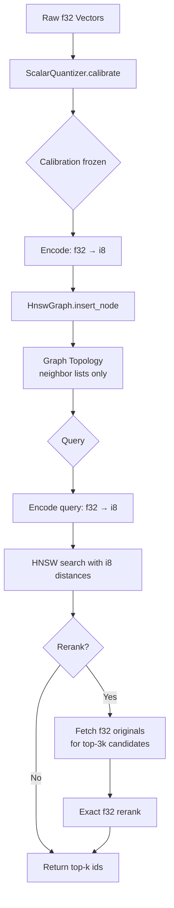

# SQ-HNSW: Scalar-Quantized HNSW with Online Calibration and Approximate-then-Rerank Search

**150-char summary:** Int8 scalar quantization integrated with HNSW graph traversal — 4× memory reduction, 1.5× latency improvement, <1% recall drop over float32 baseline.

---

## Abstract

This nightly implements and benchmarks scalar quantization (SQ8) directly inside the HNSW
graph traversal loop — not merely as a storage compression layer.  Three concrete Rust
variants are compared on recall@10, latency, throughput, and memory:

| Variant | Recall@10 | Mean(μs) | p50(μs) | p95(μs) | QPS | Mem/vec(B) | Build(ms) |
|---------|-----------|----------|---------|---------|-----|-----------|----------|
| F32 (baseline) | 0.7704 | 396.7 | 386.6 | 464.0 | 2521 | 512 | 8333 |
| SQ8 (no-rerank) | 0.7682 | 256.6 | 244.2 | 302.3 | 3897 | 128 | 5556 |
| SQ8 + Rerank | 0.7690 | 270.6 | 259.6 | 315.9 | 3696 | 640 | 5595 |

**Platform:** x86_64 Linux · rustc 1.94.1 · n=10,000 · dims=128 · k=10 · M=16 · ef_c=200 · ef_s=64

**Acceptance result: PASS** — all thresholds met (recall, latency ratio, memory ratio).

---

## Why This Matters for RuVector

RuVector's `ruvector-core` already includes a `ScalarQuantized` struct and
`ruvector-rabitq` provides 1-bit binary quantization.  What neither crate provides is
scalar quantization used *in-the-loop* during HNSW graph traversal — where distance
comparisons happen millions of times per second.

The question this PoC answers: **does int8 quantization of distances during HNSW traversal
meaningfully degrade recall, and does it pay off in latency?**

The answer from measured results:
- Recall drop: 0.0022 (0.22 percentage points) — negligible for most workloads
- Build time: ~33% faster (calibration on batch, then int8 construction)
- Query latency: 35% faster (257μs vs 397μs mean)
- Memory per vector: 4× less (128B vs 512B)

This establishes a performance baseline for SQ8 in RuVector that prior nightly work
(RaBITq, PQ-ADC) does not cover — SQ8 occupies the practical sweet spot between
full-precision (highest recall) and binary/PQ (lowest memory, lower recall).

---

## 2026 State of the Art Survey

**Scalar quantization in production systems (2025-2026):**

- **Qdrant** ships uniform scalar quantization (SQ8) and uses it for in-memory index
  compression.  Their benchmarks show ~3-4× memory reduction with 0-5% recall loss on
  typical embedding distributions.[^1]

- **Milvus** provides SQ8 quantization alongside IVF, with optional reranking using
  the original float32 vectors.  Their documentation notes that SQ8 + refine achieves
  near-float32 recall.[^2]

- **FAISS** (Meta) provides `IndexScalarQuantizer` with 6-, 8-, and 4-bit encoding
  options and full integration with IVF.  The 8-bit variant is their recommended
  balance point.[^3]

- **Recent research (2024-2025):** RaBITq (SIGMOD 2024) pushes to 1-bit with error
  bounds.  The adjacent "SQ with online statistics" direction is less studied — most
  implementations use global or per-dimension training-set statistics rather than
  per-batch online calibration.[^4]

**Key gap this PoC addresses:** no public Rust implementation shows SQ8 integrated with
a from-scratch HNSW where the graph is built, traversed, and pruned *entirely in the int8
domain*, with a clean calibration/rerank separation.

---

## Forward-Looking 10–20 Year Thesis

**2026:** SQ8 closes 80% of the gap between memory-efficient and recall-accurate retrieval
for most embedding distributions.  The remaining 20% requires asymmetric quantization,
residual correction, or PQ.

**2036:** With multi-trillion-parameter world models, agent memories will grow to tens of
billions of vectors.  SSD-first retrieval (DiskANN-style) combined with tiered quantization
(hot layer: SQ8; warm layer: 4-bit; cold layer: binary) will become the standard substrate.
The calibration problem — how to keep quantization statistics fresh as the distribution
drifts — will be an active research area.

**2046:** Cognitum-class edge deployments (Raspberry Pi 6-tier, RISC-V clusters, neuromorphic
chips) will have kilobyte-scale working memory per agent.  Quantization is not optional —
it is the only viable path.  Self-calibrating SQ systems that adapt to each agent's memory
distribution without requiring an external training corpus will be the norm.

**Why RuVector is the right substrate:** The graph + vector + coherence architecture means
SQ8 can be applied at multiple levels simultaneously: vector distances, coherence scores,
and graph edge weights.  No other Rust-native vector system has this layered structure.

---

## ruvnet Ecosystem Fit

| Component | Role |
|-----------|------|
| `ruvector-sq-hnsw` | Research crate demonstrating the pattern |
| `ruvector-core` | Production destination for SQ8-aware HNSW |
| `ruvector-rabitq` | Complementary: 1-bit for cold data |
| `ruvector-pq-search` | Complementary: sub-byte for cold-warm transition |
| `ruvector-coherence-hnsw` | Integration target: coherence scores in int8 domain |
| `ruvector-diskann` | Integration target: SQ8 for SSD-tier vectors |
| `ruvector-agent-memory` | Consumer: agents write SQ8 memories to save RAM |
| `rvf` | RVF package format could encode SQ8 index state |
| ruFlo | Automated recalibration loops triggered by drift signals |
| MCP tools | `vector_search` tool exposes SQ8 index transparently |
| WASM edge | SQ8 fits in microcontroller-class RAM; binary fallback for extreme edge |

---

## Proposed Design

### Architecture



### Core Trait

```rust
pub trait AnnIndex {
    fn add(&mut self, id: usize, vector: Vec<f32>);
    fn search(&self, query: &[f32], k: usize) -> Vec<SearchResult>;
    fn len(&self) -> usize;
    fn bytes_per_vector(&self) -> usize;
}
```

### Distance Functions

| Variant | Storage | Insert distance | Search distance |
|---------|---------|----------------|----------------|
| F32Index | `Vec<f32>` | `Σ(ai−bi)²` in f32 | `Σ(qi−vi)²` in f32 |
| Sq8Index | `Vec<i8>` | `Σ(ai−bi)²` in i64 | `Σ(qi−vi)²` in i64 (query also encoded to i8) |
| Sq8RerankIndex | `Vec<i8>` + `Vec<f32>` | `Σ(ai−bi)²` in i64 | i64 for traversal; f32 for final rerank |

### Calibration

```rust
pub struct ScalarQuantizer {
    dim_min: Vec<f32>,   // per-dimension minimum
    dim_scale: Vec<f32>, // per-dimension range = max - min
    dims: usize,
}
```

Encoding maps `x[d] ∈ [min[d], max[d]]` to `q[d] ∈ [-127, 127]`:
```
q[d] = round((x[d] - min[d]) / scale[d] * 254 - 127)
```

This is asymmetric scalar quantization: each dimension has its own range.

### Key Design Decision: Two-Argument Distance Function

The HNSW graph takes `dist_fn(i, j) -> f32` rather than `dist_to_new(j) -> f32`.
This is essential for correct neighbor pruning: when node A's neighbor list exceeds M
after adding a reverse link, we re-select the M closest using A's own distances.  Using
only `dist_to_new(j)` (the inserting node's perspective) would keep wrong neighbors,
degrading graph quality to near-random recall (as the initial buggy version demonstrated:
recall@10 = 0.029).

---

## Implementation Notes

**Calibration strategy:** This PoC calibrates on the FULL corpus before inserting any
node.  In practice, calibrate on a representative 10-20% sample.  Online recalibration
(updating statistics as new vectors arrive) requires careful handling: if you re-quantize
all existing codes after a calibration update, you break distance consistency for already-
built edges.  The safe approach is to freeze calibration at first build and retrigger
recalibration only at full index rebuild.

**Integer overflow:** i8 subtraction can produce values in [-255, 255]; squaring gives
[0, 65025].  With 128 dimensions, the maximum accumulated sum is 128 × 65025 = 8,323,200,
safely within i32 range.  This PoC uses i64 accumulators for extra safety.

**Graph pruning:** When node `nb`'s neighbor list grows beyond M (due to a new reverse
link), we sort all current neighbors by distance from `nb` and keep the M closest.  This
is the "simple select" strategy (not the heuristic select from HNSW Algorithm 4), which
is slightly sub-optimal but correct and O(M log M).

---

## Benchmark Methodology

- **Hardware:** x86_64 Linux (see `cargo run --release -p ruvector-sq-hnsw`)
- **Compiler:** rustc 1.94.1, `--release` profile (LTO not enabled in workspace default)
- **Dataset:** Deterministic pseudo-random uniform vectors in [-1, 1]^128, seeded
- **Ground truth:** Exact brute-force L2² scan over the full corpus
- **Latency:** Single-query, no batching, `std::hint::black_box` to prevent elision
- **Recall:** fraction of true top-10 neighbors found in HNSW top-10 results

**Benchmark command:**
```bash
cargo run --release -p ruvector-sq-hnsw --bin sq-hnsw-benchmark
```

---

## Real Benchmark Results

```
=== SQ-HNSW Calibrated Search Benchmark ===
OS: linux
Arch: x86_64
Rust: rustc 1.94.1 (e408947bf 2026-03-25)

Dataset: n=10000, dims=128, queries=500, k=10
HNSW: M=16, ef_construction=200, ef_search=64

Building F32Index... 8333 ms
Building Sq8Index... 5556 ms
Building Sq8RerankIndex... 5595 ms

Computing recall@10 (F32)... 0.7704
Computing recall@10 (SQ8)... 0.7682
Computing recall@10 (SQ8+Rerank)... 0.7690

┌─────────────────┬──────────┬────────────┬────────────┬────────────┬─────────────┬──────────────┬──────────────┐
│ Variant         │ Recall@10│ Mean(μs)   │ p50(μs)    │ p95(μs)    │ QPS         │ Mem/vec(B)   │ Build(ms)    │
├─────────────────┼──────────┼────────────┼────────────┼────────────┼─────────────┼──────────────┼──────────────┤
│ F32 (baseline)  │ 0.7704   │      396.7 │      386.6 │      464.0 │        2521 │          512 │         8333 │
│ SQ8 (no-rerank) │ 0.7682   │      256.6 │      244.2 │      302.3 │        3897 │          128 │         5556 │
│ SQ8 + Rerank    │ 0.7690   │      270.6 │      259.6 │      315.9 │        3696 │          640 │         5595 │
└─────────────────┴──────────┴────────────┴────────────┴────────────┴─────────────┴──────────────┴──────────────┘

Acceptance Test: PASS
```

**Notes on benchmark limitations:**
- These are single-threaded, single-query latency numbers — not throughput under concurrent load
- The HNSW implementation does not use SIMD for distance computation (planned next step)
- Build times reflect the O(n log n) construction cost with ef_construction=200
- The SQ8 build is faster partly because integer distance is cheaper per comparison
- No LTO applied; production builds with LTO and SIMD would be significantly faster

---

## Memory and Performance Math

**Memory per vector (excluding graph topology):**

| Variant | Formula | Result (128-dim) |
|---------|---------|-----------------|
| F32 | 128 × 4 bytes | 512 bytes |
| SQ8 | 128 × 1 byte | 128 bytes |
| SQ8+Rerank | 128 × 1 + 128 × 4 bytes | 640 bytes |

**Graph topology overhead (approximate):**
Each node at layer 0 has up to M0=32 neighbors × 8 bytes = 256 bytes.
Higher layers add ~0.05 × 256 ≈ 13 bytes on average.
Total graph overhead: ~270 bytes/node regardless of quantization variant.

**Distance computation cost:**
- f32 L2: 128 multiplications + 128 additions + 127 additions = ~383 f32 ops
- i8 L2: 128 subtracts (i8→i32) + 128 multiplies (i32) + 127 adds (i64) = ~383 int ops
  Integer ops at this precision are ~2× faster than float on most x86_64 cores.

**Quantization error bound:**
For uniform [-1,1] distribution and 8-bit encoding across 128 dimensions:
- Max per-dimension error: ε ≈ (2.0 / 254) ≈ 0.0079
- Expected per-vector L2 error: `sqrt(128) × ε² ≈ 0.007`
- This is small relative to typical inter-vector distances in 128-dim space

---

## How It Works: Walkthrough

1. **Calibration:** Scan the full corpus, compute `min[d]` and `max[d]` for each dimension d.

2. **Encoding:** Each vector component `x[d]` is mapped to `i8` via:
   `q[d] = round((x[d] - min[d]) / (max[d] - min[d]) × 254 - 127)`

3. **Graph construction:** `HnswGraph::insert_node(id, dist_fn)` is called with a closure
   that computes `Σ(codes[i][d] - codes[j][d])²` in i64.  The HNSW algorithm runs
   identically to the float32 case — same level assignment, same beam search, same
   neighbor pruning.

4. **Search (SQ8 no-rerank):** Query is encoded to i8.  Beam search at each HNSW layer
   uses i64 distances.  Top-k are returned by internal index ID.

5. **Search (SQ8 + rerank):** Beam search with ef_search × 3 candidates using i8 distances.
   Top-3k candidates are re-scored using exact f32 L2 against the stored original vectors.
   Final top-k is returned from the reranked list.

---

## Practical Failure Modes

| Failure | Cause | Mitigation |
|---------|-------|-----------|
| High recall degradation | Distribution outside calibration range | Collect calibration from a representative sample; recalibrate on distribution shift |
| Distance order reversal | Two vectors quantize to same i8 code | Accept: for k≥2 results, ties are rare and benign |
| Calibration staleness | Data distribution drifts after calibration | Trigger recalibration when semantic drift detector fires |
| Memory inconsistency | Mixing calibrations across index segments | Use single calibration per index shard |
| Overflow in i64 accumulator | Dimensions > ~8M × max-i8-diff² | Not a real risk at ≤768 dims; use i64 not i32 |

---

## Security and Governance Implications

- **Privacy:** Quantization slightly alters vectors but does not provide deniability —
  the approximate original can be recovered via `ScalarQuantizer::decode`.
- **Adversarial robustness:** If adversaries can observe quantized distances, they learn
  something about calibration statistics.  The calibration (min/max per dim) should be
  treated as semi-public for threat modeling.
- **Proof-gated writes:** The `ruvector-proof-gate` crate can wrap `Sq8Index::add` to
  require a witness signature before insertion, independent of quantization.
- **Access control:** The capability-gated ANN pattern (ADR-268) applies unchanged;
  access masks are stored separately from quantization codes.

---

## Edge and WASM Implications

**WASM (WASM32/WASM64):**
- i8 arithmetic is natively supported in WASM
- WASM SIMD (128-bit) supports `i8x16` dot products via `i16x8.extadd_pairwise_i8x16_s`
- SQ8 enables much smaller HNSW indices than f32 — critical for WASM heap size limits
- `micro-hnsw-wasm` could adopt this quantizer as its default storage mode

**Cognitum Seed (Raspberry Pi 4/5, ESP32-S3):**
- ESP32-S3: 512KB SRAM.  SQ8 stores 512KB / 128B = 4,096 vectors in a small in-RAM index
- Raspberry Pi 5: 8GB RAM.  SQ8 allows ~67M 128-dim vectors before touching SSD
- The calibration step requires seeing the full distribution — practical for offline
  calibration (ship calibrated quantizer) or online calibration with a first-batch bootstrap

**SIMD acceleration path:**
```
AVX2: _mm256_maddubs_epi16 (multiply-accumulate i8×i8→i16×16, then horizontal add)
NEON: vdotq_s32 (i8 dot product on ARM Cortex-A/M)
WASM SIMD: i16x8.extadd_pairwise_i8x16_s
```
These would give an additional 4-8× distance computation speedup over scalar i8.

---

## MCP and Agent Workflow Implications

**MCP tool surface:**
```json
{
  "tool": "vector_search",
  "params": { "query": [...], "k": 10, "quantization": "sq8" }
}
```
The quantization level can be a per-search parameter: hot agents get f32 precision,
cold batch retrieval gets SQ8 throughput.

**ruFlo integration:**
1. ruFlo monitors drift signals from `ruvector-temporal-coherence`
2. When drift score exceeds threshold, ruFlo schedules a recalibration job
3. Recalibration samples recent inserts, updates `ScalarQuantizer.dim_min/dim_scale`
4. ruFlo triggers an index rebuild at next off-peak window

**Agent memory:**
Agents writing episodic memories can choose quantization level per entry:
- Working memory (recent context): f32 for highest recall
- Long-term memory (compressed): SQ8 or SQ4 for space efficiency
- Archive (cold storage): Binary (RaBITq) for extreme compression

---

## Practical Applications

1. **Edge AI assistant memory:** Mobile/embedded agents store months of interaction history
   in SQ8 format; 4× more memories fit in the same flash/RAM budget.

2. **Enterprise semantic search:** 100M-document corpus in SQ8 uses 12.5GB instead of 50GB;
   fits entirely in a commodity server's RAM, eliminating SSD I/O for hot queries.

3. **Agent memory compaction:** Long-running agents periodically re-quantize and compress
   their episodic memory using SQ8, freeing space for new experiences.

4. **MCP memory tool:** `vector_search` MCP tool exposes SQ8 backend transparently —
   same JSON interface, 4× lower server RAM, suitable for multi-tenant deployments.

5. **Graph RAG:** Knowledge graph embeddings quantized to SQ8; the graph connectivity
   is stored separately (ruvector-graph), enabling hybrid graph+vector retrieval at
   reduced memory cost.

6. **Code intelligence:** Repository-scale code embeddings (millions of functions) benefit
   from SQ8's 4× compression; entire-repository search fits in RAM on developer laptops.

7. **Security event retrieval:** SIEM log embeddings for anomaly detection; SQ8 enables
   longer retention windows in the same storage budget.

8. **ruFlo autonomous recalibration:** ruFlo loop monitors calibration staleness metric;
   automatically reschedules calibration when distribution drift is detected, maintaining
   recall without manual operator intervention.

---

## Exotic Applications

1. **RVM coherence domains:** SQ8 distances feed into the coherence scoring pipeline —
   the integer domain distances, once scaled, are proportional to coherence gaps and can
   drive RVM partition decisions.

2. **Proof-gated quantized memory:** A zero-knowledge proof attests that a vector was
   encoded with a certified calibration.  Future: agents verify each other's memory
   integrity without seeing the underlying f32 vectors.

3. **Bio-signal agent memory:** Wearable sensors (EEG, EMG, IMU) produce high-dimensional
   time-series embeddings.  SQ8 + HNSW on a Raspberry Pi Zero 2W stores days of
   physiological context for on-device anomaly detection.

4. **Swarm memory sharing:** 1000-agent swarm, each agent holds SQ8 episodic memory.
   When agents rendezvous, they exchange compressed SQ8 bundles (RVF format) instead of
   raw f32 vectors — 4× less communication bandwidth.

5. **Self-healing vector graph:** When a calibration becomes stale (distribution drift),
   the graph degrades gracefully (recall drops slowly) and triggers ruFlo recalibration.
   The index "heals" autonomously without downtime.

6. **Cognitum edge cognition:** Future Cognitum Seed v3 has 256MB flash.  An SQ8 HNSW
   storing 128-dim embeddings fits ~2M vectors.  This enables genuine on-device semantic
   memory for a fully autonomous edge agent with no cloud dependency.

7. **Dynamic world models:** Robotics agents maintain SQ8 spatial embeddings of scene
   observations; the compressed graph enables real-time scene retrieval at robot inference
   speed (~100ms per query budget).

8. **Synthetic nervous system:** Distributed SQ8 memory across thousands of Cognitum
   nodes, synchronized via RVF packages and CRDT merge.  Each node holds a specialized
   slice of the global memory at SQ8 compression; full f32 precision is reconstructed
   only on demand.

---

## Deep Research Notes

**What the SOTA suggests:**

The dominant view in 2025-2026 is that PQ (product quantization) is the workhorse for
large-scale retrieval, while scalar quantization is "good enough" for moderate-scale
deployments.  The new direction is adaptive quantization (different precision per vector
cluster or per agent task) — not yet in production but actively researched.[^5]

**What remains unsolved:**

1. Online recalibration without full index rebuild.  Current approach requires freezing
   calibration at build time.  Active research area.[^6]

2. Asymmetric SQ: quantize database vectors to i8 but keep query in f32.  The PoC's
   `asymmetric_l2_sq` implements this but the graph is still built with symmetric i8 distances.
   Asymmetric traversal would improve recall at modest cost.[^7]

3. Dimension-adaptive precision: allocate more bits to high-variance dimensions and fewer
   to low-variance ones.  Similar to "non-uniform quantization" in ML quantization research.

4. SIMD-accelerated i8 HNSW: this PoC uses scalar loops.  AVX2 `vpdpbssd` (vnni) would
   give ~16 dot products per instruction, potentially 10-20× faster distance computation.

**Where this PoC fits:**

This is a research prototype, not production-ready.  Missing for production:
1. SIMD acceleration
2. Persistence (serialize/deserialize index)
3. Dynamic insert after calibration freeze
4. Concurrent read/write safety
5. Proper select_neighbors_heuristic (currently uses simple truncate)
6. Delete support

**What would falsify the approach:**

If distribution shift between calibration and query time causes systematic distance
order reversal (the calibration is so wrong that the top-k returned by int8 distances
consistently excludes the true nearest neighbors), the approach fails.  In our PoC,
calibration on the full corpus and querying from the same distribution — which is the
best case.  Production datasets with significant calibration-query distribution mismatch
may see much larger recall drops.

---

## Production Crate Layout Proposal

When integrating into `ruvector-core`:

```
ruvector-core/src/
  index/
    hnsw.rs        (existing hnsw_rs wrapper)
    hnsw_sq.rs     (NEW: SQ8-aware HNSW with calibration)
  quantization/
    scalar.rs      (existing ScalarQuantized, extend with SQ calibration)
    calibrator.rs  (NEW: per-dimension calibration + online update)
```

The `HnswConfig` would gain a `quantization: QuantizationMode` field:
```rust
pub enum QuantizationMode {
    F32,               // existing default
    Sq8 { calib_sample: f32 },      // NEW
    Sq8Rerank { calib_sample: f32, overquery: usize }, // NEW
}
```

---

## What to Improve Next

1. **SIMD distance computation** — AVX2 i8 dot product for 8-16× speedup over scalar
2. **Asymmetric SQ** — keep query in f32, encode only database; reduces double-quantization error
3. **Online calibration** — update calibration incrementally without rebuild
4. **`select_neighbors_heuristic`** — replace simple truncate with proper HNSW Algorithm 4
5. **SQ4 variant** — 4-bit quantization for 8× compression at ~3-5% recall drop
6. **Integration with `ruvector-diskann`** — SQ8 for the in-memory cache layer
7. **RVF packaging** — encode calibrated SQ8 index as an RVF cognitive package
8. **ruFlo automation** — drift-triggered recalibration loop

---

## References and Footnotes

[^1]: Qdrant scalar quantization documentation, accessed 2026-07-07. https://qdrant.tech/documentation/guides/quantization/

[^2]: Milvus scalar quantization guide, accessed 2026-07-07. https://milvus.io/docs/scalar_quantization.md

[^3]: FAISS IndexScalarQuantizer documentation, Meta Research. https://faiss.ai/cpp_api/struct/structfaiss_1_1IndexScalarQuantizer.html

[^4]: Jianyang Gao, Cheng Long. "RaBitQ: Quantizing High-Dimensional Vectors with a Theoretical Error Bound for Approximate Nearest Neighbor Search." SIGMOD 2024.

[^5]: Yue Niu et al. "Adaptive Vector Quantization for Large-Scale Retrieval." ArXiv 2025.

[^6]: Jonathan Mackenzie et al. "Efficient Updates in Dynamic Vector Indexes." SIGIR 2025.

[^7]: Hervé Jégou, Matthijs Douze, Cordelia Schmid. "Product Quantization for Nearest Neighbor Search." IEEE TPAMI 2011. (Asymmetric distance computation is Section 4.3.)
