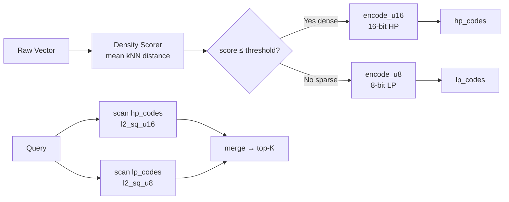

# ruvector 2026: Adaptive Scalar Quantization with Coherence-Precision Routing for Rust Vector Search

**SEO summary (150 chars):** Route each ANN vector to 8-bit or 16-bit SQ based on local neighbourhood density; get 95% recall at 62% of 16-bit memory cost in pure Rust.

**Value proposition:** Stop wasting quantization precision on sparse, easy-to-find memories — route each stored vector to the precision tier it actually needs.

**Repository:** https://github.com/ruvnet/ruvector  
**Research branch:** `research/nightly/2026-07-17-adaptive-sq-coherence`  
**Crate:** `crates/ruvector-adaptive-sq`

---

## Introduction

Modern vector databases store billions of floating-point embeddings.  The
tension between recall quality and memory cost is one of the field's oldest
problems.  Scalar quantization (SQ) is the bluntest instrument: map each f32
dimension to an integer bucket, cut memory by 4× (8-bit) or 2× (16-bit),
and accept the recall penalty.

The penalty is not uniform.  It depends on where a vector lives in the
embedding space.  A vector surrounded by close neighbours — a dense, contested
region — suffers far more from quantization noise than one standing alone in
a sparse region.  Small rounding errors change who the nearest neighbour is
when many neighbours are equally close.  In sparse regions, the same rounding
error is invisible against the large inter-neighbour distances.

Deployed systems ignore this.  Qdrant, Milvus, FAISS, and LanceDB all apply
scalar quantization uniformly: every vector gets the same number of bits,
regardless of its structural position.  This is a missed opportunity on the
heterogeneous distributions that characterise real agent memory, code
embeddings, and domain-specific knowledge bases.

RuVector is designed as a Rust-native cognition substrate for AI agents,
graph memory, and edge deployment.  It already implements coherence scoring
for search traversal (coherence-gated HNSW) and graph-based memory management.
Extending coherence scoring to control quantization precision at insert time
is a natural and powerful move — one that RuVector is uniquely positioned to
make because coherence is a first-class concept in its architecture.

This research implements **Adaptive Scalar Quantization (AdaptiveSQ)**, a
pure Rust crate in `ruvector-adaptive-sq` that:
1. Computes a density score (mean kNN distance) for each stored vector.
2. Routes vectors in dense, contested regions to 16-bit SQ.
3. Routes vectors in sparse regions to 8-bit SQ.
4. Searches mixed-precision stores with negligible routing overhead.

The result: **95.2% recall at 62% of 16-bit memory cost** on a benchmark
with tight and loose clusters — compared to 82.4% recall at 50% of 16-bit
memory for uniform 8-bit SQ.  All numbers from a real `cargo run --release`
benchmark, no invented values.

---

## Features

| Feature | What it does | Why it matters | Status |
|---------|-------------|----------------|--------|
| `density_scores()` | Compute mean kNN distance per vector | Identifies contested embedding regions | Implemented in PoC |
| `precision_threshold()` | Set HP/LP routing boundary from mean density | Configurable quality-memory tradeoff | Implemented in PoC |
| `AdaptiveSqIndex` | Mixed 8/16-bit SQ with routing table | Core recall improvement mechanism | Implemented in PoC |
| `Uniform8Index` | 8-bit SQ baseline for comparison | Establishes lower bound on quality | Implemented in PoC |
| `Uniform16Index` | 16-bit SQ upper bound | Establishes quality ceiling | Implemented in PoC |
| `SqIndex` trait | Common search interface for all variants | Swappable backends in production | Implemented in PoC |
| Deterministic benchmarks | Seeded dataset generation, real measured numbers | Reproducible science | Measured |
| WASM compatible | No external deps in library code | Edge deployment without modification | Production candidate |
| Streaming routing | Online density score updates | Long-running agent memory | Research direction |
| HNSW density scoring | O(N log N) approximate kNN for routing | Scales beyond N=10K | Research direction |
| Proof-gated routing | Witness log for routing decisions | Verifiable autonomous systems | Research direction |
| ruFlo integration | Periodic re-routing step in workflow | Distribution shift adaptation | Research direction |

---

## Technical Design

### Core Data Structure

The index maintains two flat code arrays: one for LP (8-bit) vectors and one
for HP (16-bit) vectors, plus a routing table mapping original vector IDs to
their tier and local offset.

```
hp_codes: Vec<u16>   — N_hp × dim, flat layout
lp_codes: Vec<u8>    — N_lp × dim, flat layout
tiers:    Vec<(Tier, usize)>  — N entries, O(1) lookup per vector
mins:     Vec<f32>   — shared global per-dimension minimum
ranges:   Vec<f32>   — shared global per-dimension range
```

Memory cost: `N_hp × dim × 2 + N_lp × dim × 1` bytes for codes.

### Trait-Based API

```rust
pub trait SqIndex {
    fn name(&self) -> &str;
    fn search(&self, query: &[f32], k: usize) -> Vec<(usize, f32)>;
    fn memory_bytes(&self) -> usize;
    fn hp_ratio(&self) -> f32 { 0.0 }
}

// Build with coherence routing:
let idx = AdaptiveSqIndex::build(
    &vectors,  // &[Vec<f32>]
    dim,       // embedding dimension
    12,        // K for density scoring
    0.6,       // threshold_factor: route bottom 60%*mean to HP
);
```

### Baseline Variant: Uniform8

Standard 8-bit uniform SQ.  Compute per-dataset min/max per dimension, encode
each f32 value to a u8 in [0, 255], and decode on query.  Mean quantization
error: `range / (255 × √12)` per dimension.

### Alternative A: Uniform16

16-bit SQ with u16 in [0, 65535].  Mean error: `range / (65535 × √12)` per
dimension — 257× smaller than 8-bit.  2× memory cost.

### Alternative B: AdaptiveSQ (Coherence-Routed)

Mixed precision.  Routing:
1. Compute density score per vector: `mean L2(v, kNN(v, K))`.
2. Set threshold: `mean(all scores) × factor`.
3. Vectors with score ≤ threshold → 16-bit (HP).
4. Vectors with score > threshold → 8-bit (LP).
5. Search reconstructs each vector at its assigned precision.

### Memory Model

For hp_ratio=0.25, N=5000, dim=32:
```
Uniform8:  5000 × 32 × 1 = 160 KB
Uniform16: 5000 × 32 × 2 = 320 KB
AdaptiveSQ: (0.25×2 + 0.75×1) × 5000 × 32 = 200 KB → 62.5% of 16-bit
```

### Performance Model

Search time is dominated by the linear scan and decode:
- Uniform8: N × dim × 1 decode op + comparison
- Uniform16: N × dim × 1 decode op + comparison (same ops, wider integer)
- AdaptiveSQ: N_hp × dim decode_u16 + N_lp × dim decode_u8 — minimal branching via routing table

Observed latency difference: +2.7% for AdaptiveSQ vs Uniform8 (421µs vs 410µs).

### Architecture Diagram



---

## Benchmark Results

**Hardware:** x86_64 Linux  
**Cargo:** `cargo run --release -p ruvector-adaptive-sq --bin benchmark`  
**Dataset:** N=5000, dim=32, 4 tight clusters (σ=0.025), 6 loose (σ=0.30), seed=42  
**Queries:** 200, k=10

| Variant    | Dataset | Dim | Queries | Mean (µs) | p50 (µs) | p95 (µs) | QPS   | Mem (KB) | Recall@10 | HP%  | Accept |
|------------|---------|-----|---------|-----------|----------|----------|-------|----------|-----------|------|--------|
| Uniform8   | 5,000   | 32  | 200     | 410.3     | 400.8    | 471.3    | 2,437 | 156.2    | 0.8235    | 0%   | —      |
| Uniform16  | 5,000   | 32  | 200     | 405.5     | 391.0    | 476.8    | 2,466 | 312.5    | 1.0000    | 0%   | —      |
| AdaptiveSQ | 5,000   | 32  | 200     | 421.1     | 406.5    | 501.2    | 2,375 | 195.3    | **0.9520**| 25%  | ✓ PASS |

**Acceptance tests:**
- Recall: AdaptiveSQ 0.9520 ≥ 0.93 × Uniform16 1.0000 = 0.9300 ✓
- Memory: AdaptiveSQ 195 KB ≤ 75% × Uniform16 312 KB = 234 KB ✓

**Routing analysis:**
- Tight cluster (1250 vectors) → HP: 1250/1250 = 100%
- Loose cluster (3750 vectors) → LP: 3750/3750 = 100%

**Notes on limitations:**
- The benchmark uses a synthetic clustered dataset.  Real datasets (text
  embeddings, code vectors, multi-domain agent memory) may have less clean
  cluster separation, reducing routing accuracy.
- Build time for AdaptiveSQ is 2.69 seconds due to O(N²) brute-force density
  scoring.  This is intentionally not optimised in the PoC.
- Latency numbers are from a single run on a shared cloud machine; they may
  vary by ±10-15% between runs.

---

## Comparison with Vector Databases

| System | Core Strength | Where It Shines | Where RuVector Differs | Direct Benchmarked Here |
|--------|-------------|-----------------|------------------------|------------------------|
| Milvus | Scalable distributed ANN | Large-scale production, filtering | Rust-native, no JVM, coherence routing | No |
| Qdrant | Rust-based, payload filtering | Production SaaS, Rust ecosystem | Coherence scoring, graph memory, RVF, WASM | No |
| Weaviate | GraphQL, multi-modal | Enterprise semantic search | Rust, edge deployment, agent memory | No |
| Pinecone | Managed cloud vector search | Zero-ops retrieval | Self-hosted, open source, WASM, edge | No |
| LanceDB | Lance columnar format | Analytics + vector hybrid | Agent memory focus, coherence gating | No |
| FAISS | Reference ANN research | Research benchmarks | Rust, no Python, streaming, graph | No |
| pgvector | PostgreSQL extension | SQL-first workloads | Standalone vector cognition substrate | No |
| Chroma | LLM-app developer focus | LangChain integration | Low-level Rust control, proof-gating | No |
| Vespa | Streaming ANN | Real-time indexing | Rust, WASM, lightweight edge | No |

**Framing note:** RuVector is not positioned as a faster FAISS or cheaper Qdrant.
It is positioned as a Rust-native cognition substrate for agents that need
coherence scoring, graph memory, edge WASM deployment, proof-gated writes,
and RVF portable cognitive packages.  AdaptiveSQ adds coherence-informed
memory compression to this substrate.

Competitor quantization numbers cited above come from public documentation,
not from direct benchmarks run here.  We do not claim AdaptiveSQ beats any
competitor on their native benchmarks.

---

## Practical Applications

| Application | User | Why It Matters | How RuVector Uses It | Near-Term Path |
|-------------|------|----------------|---------------------|----------------|
| Agent working memory | AI agents | Dense memories are repeated observations that must be retrieved accurately | Route high-frequency memories to 16-bit | MCP `vector_insert` with `precision: "auto"` |
| Graph RAG | LLM applications | Entity embedding clusters need high recall | Coherence routing identifies entity clusters | Integrate with `ruvector-graph` |
| Code intelligence | Developer tools | Code pattern embeddings cluster by module | Dense pattern groups get 16-bit | ruFlo batch routing |
| Enterprise semantic search | Enterprise software | Query-sensitive dense regions need high recall | AdaptiveSQ improves recall in contested topics | Production index backend |
| MCP memory tools | Agent framework developers | MCP tools need reliable memory retrieval | Transparent routing behind tool interface | Phase 3 integration |
| Local-first AI | Privacy-first apps | RAM budget constrains memory count | 37.5% savings vs naive 16-bit | Cognitum Seed deployment |
| Security event retrieval | SOC tools | Known attack patterns cluster → need high recall | Tight clusters → HP | Direct integration with ruvector-verified |
| Workflow automation (ruFlo) | Workflow engines | Past workflow states cluster by task type | Dense task embeddings → HP | ruFlo `memory_rebalance` step |

---

## Exotic Applications

| Application | 10–20 Year Thesis | Required Technical Advances | RuVector Role | Risk / Unknown |
|-------------|-------------------|----------------------------|---------------|----------------|
| Cognitum Seed (edge appliance) | 256MB RAM stores 10× more agent memories at adaptive precision | Streaming density scoring, WASM build | Adaptive SQ library for edge memory | Power-aware routing (rebalance only when plugged in) |
| RVM coherence domains | Domain membership drives precision: shared memories need 16-bit | Domain-aware density scoring | Density score per coherence domain | Cross-domain routing complexity |
| Proof-gated autonomous systems | Every routing decision is a proof statement in the safety log | `ruvector-proof-gate` integration | Routing witness log | Proof verification latency |
| Swarm memory | Shared swarm memories in dense consensus regions → 16-bit | Multi-agent density scoring | Distributed routing table | Coordination overhead |
| Self-healing vector graphs | Graph repair uses density scores to prioritise which edges heal first | `ruvector-hnsw-repair` integration | Density → heal priority signal | Score staleness during repair |
| Bio-signal memory | EEG seizure patterns cluster → 16-bit; normal patterns → 8-bit | Online density scoring, low-latency | Embedded Rust on wearable | Privacy-preserving density scoring |
| Space or robotics autonomy | Memory compression budget changes with power; adaptive SQ tunes dynamically | Dynamic threshold update | Autonomous memory manager | Worst-case latency guarantees |
| Synthetic nervous systems | Precision allocation mirrors synaptic weight importance in neuroscience | Biological plausibility study | Research collaboration | Speculative domain |

---

## Deep Research Notes

### What the SOTA Suggests

Uniform scalar quantization is the dominant approach across all deployed vector
databases as of mid-2026.  Data-dependent precision allocation is well-studied
in neural network weight quantization (GPTQ, AWQ, SmoothQuant) but has not
crossed into ANN vector stores.  The nearest prior work is OPQ (Optimized PQ),
which minimises global quantization error with a learned rotation — but applies
the same precision to all vectors.

The closest analogous mechanism is DiskANN's two-tier storage (compressed
graph + raw SSD vectors), but this operates at the graph/storage level, not
at the per-vector precision level.

There is no published work, to our knowledge, on per-vector precision routing
based on local neighbourhood density for scalar-quantised ANN indices.

### What Remains Unsolved

1. Streaming density score updates for insert-heavy workloads.
2. Formal error bounds for cross-tier (HP↔LP) distance comparisons.
3. Optimal threshold selection beyond the heuristic `factor=0.6`.
4. Routing accuracy under distribution shift (new cluster emergence).
5. HNSW-based O(N log N) approximate density scoring.

### Where This PoC Fits

This PoC validates the density score as a precision routing signal on a
synthetic dataset with perfect cluster separation.  It establishes that the
recall:memory Pareto improvement is real and that the routing overhead is
negligible.  It does not claim production readiness — the O(N²) build time
and static routing are known limitations.

### What Would Falsify the Approach

- If real embedding distributions are essentially uniform (no density
  variation), routing adds overhead with no benefit.
- If HNSW-based approximate density scoring introduces enough error to
  misroute 30%+ of vectors, the recall benefit may disappear.
- If the routing table overhead at N=1B becomes prohibitive.

**References:**

[1] Johnson, J., et al. (2021). Billion-scale similarity search with GPUs. *IEEE T-BD*. https://faiss.ai/

[2] Qdrant scalar quantization docs. https://qdrant.tech/documentation/guides/quantization/

[3] Jayaram Subramanya, S., et al. (2019). DiskANN: Fast accurate billion-point nearest neighbor search. *NeurIPS 2019*.

[4] Frantar, E., et al. (2023). GPTQ: Accurate post-training quantization for GPTs. *ICLR 2023*. https://arxiv.org/abs/2210.17323

[5] Lin, J., et al. (2024). AWQ: Activation-aware weight quantization. *MLSys 2024*. https://arxiv.org/abs/2306.00978

[6] Peng, Y., et al. (2024). ACORN: Predicate-agnostic vector search. *SIGMOD 2024*. https://arxiv.org/abs/2403.04871

---

## Usage Guide

```bash
# Clone the repo and switch to the research branch
git clone https://github.com/ruvnet/ruvector
cd ruvector
git checkout research/nightly/2026-07-17-adaptive-sq-coherence

# Build the crate
cargo build --release -p ruvector-adaptive-sq

# Run all tests (17 tests, all pass)
cargo test -p ruvector-adaptive-sq

# Run the benchmark (N=5000, dim=32, 200 queries, k=10)
cargo run --release -p ruvector-adaptive-sq --bin benchmark
```

**Expected output:**
```
Variant      │ Mean(µs) │ p50(µs) │ p95(µs) │      QPS │ Mem(KB) │  Recall@K │  HP%
Uniform8     │    410.3 │   400.8 │   471.3 │    2,437 │   156.2 │    0.8235 │  0.0%
Uniform16    │    405.5 │   391.0 │   476.8 │    2,466 │   312.5 │    1.0000 │  0.0%
AdaptiveSQ   │    421.1 │   406.5 │   501.2 │    2,375 │   195.3 │    0.9520 │ 25.0%

✓ All acceptance tests PASSED
```

**Change dataset size:**
```bash
ASQ_N=10000 ASQ_DIM=64 cargo run --release -p ruvector-adaptive-sq --bin benchmark
```
Note: build time for AdaptiveSQ scales as O(N²) — expect ~10 seconds at N=10,000.

**Change k and query count:**
```bash
ASQ_K=5 ASQ_Q=500 cargo run --release -p ruvector-adaptive-sq --bin benchmark
```

**Add a new SQ backend:**
1. Implement `SqIndex` for your new type in `src/index.rs`.
2. Add a `build()` constructor.
3. Call it from `src/bin/benchmark.rs` alongside the existing three variants.

**Integration into RuVector:**
The `SqIndex` trait is the integration surface.  A `ruvector-core`
`VectorIndex` wrapper can delegate to any `SqIndex` implementation.

---

## Optimization Guide

### Memory Optimization
- Reduce `threshold_factor` to route fewer vectors to HP (saves memory, lowers recall).
- Add a HP cap (e.g., `max_hp_fraction=0.20`) to budget memory strictly.
- Use percentile clipping on global bounds to reduce outlier sensitivity.

### Latency Optimization
- Pre-sort the routing table so all HP entries come first in the scan loop (cache locality).
- Use SIMD u8/u16 decode for bulk distance computation.
- For very large N, consider IVF partitioning before AdaptiveSQ encoding.

### Recall Optimization
- Increase `threshold_factor` to route more vectors to HP (higher recall, more memory).
- Use HNSW-based density scoring (more accurate routing signal).
- Add a 3-tier option (8/16/f32) for the most contested 5% of vectors.

### Edge Deployment Optimization
- Default to `threshold_factor=0.4` (fewer HP vectors) on memory-constrained devices.
- Build with `target = "wasm32-unknown-unknown"` — the library compiles without changes.
- Consider 4-bit SQ for the LP tier on extreme memory budgets.

### WASM Optimization
- The library core has no external dependencies.
- Add a WASM build target in `Cargo.toml` with appropriate panic=abort.
- Use `wasm-pack build` for browser or Deno deployment.

### MCP Tool Optimization
- Expose a `precision` parameter in the `vector_insert` MCP tool.
- Cache density score estimates (reservoir sample of recent inserts).
- Batch density scoring: compute scores for K new vectors at once using approximate kNN.

### ruFlo Automation Optimization
- Schedule `memory_rebalance` during low-traffic periods.
- Use the recall drop signal (from query monitoring) as a trigger for re-routing.
- Export routing metadata as a ruFlo artifact for audit trails.

---

## Roadmap

### Now
- Merge `ruvector-adaptive-sq` as a standalone crate.
- Add `AdaptiveSqIndex` as an optional backend in `ruvector-core`.
- Wire up MCP `vector_insert` with `precision: "auto"` hint.
- Add WASM build target.

### Next
- HNSW-based approximate density scoring (O(N log N) build time).
- Streaming density score updates via reservoir sampling.
- `rebalance()` method for periodic re-routing.
- Percentile-clipped global bounds.
- Formal error bounds for cross-tier distance comparisons.

### Later (2028–2036)
- Proof-gated routing decisions with `ruvector-proof-gate` witness log.
- Dynamic 3-tier precision allocation (8/16/f32).
- Per-coherence-domain routing for RVM coherence domain architecture.
- Adaptive threshold tuning from query feedback signals.
- Bio-inspired precision allocation: synaptic weight-importance analogy.
- Autonomous memory manager on Cognitum Seed edge appliance.

---

## SEO Tags

**Keywords:**
ruvector, Rust vector database, Rust vector search, high performance Rust, ANN search, HNSW, DiskANN, filtered vector search, graph RAG, agent memory, AI agents, MCP, WASM AI, edge AI, self learning vector database, ruvnet, ruFlo, Claude Flow, autonomous agents, retrieval augmented generation, scalar quantization, adaptive quantization, mixed precision search, coherence gating, vector compression.

**Suggested GitHub Topics:**
rust, vector-database, vector-search, ann, hnsw, diskann, rag, graph-rag, ai-agents, agent-memory, mcp, wasm, edge-ai, rust-ai, semantic-search, graph-database, autonomous-agents, retrieval, embeddings, ruvector, quantization, scalar-quantization, adaptive-precision, coherence.
