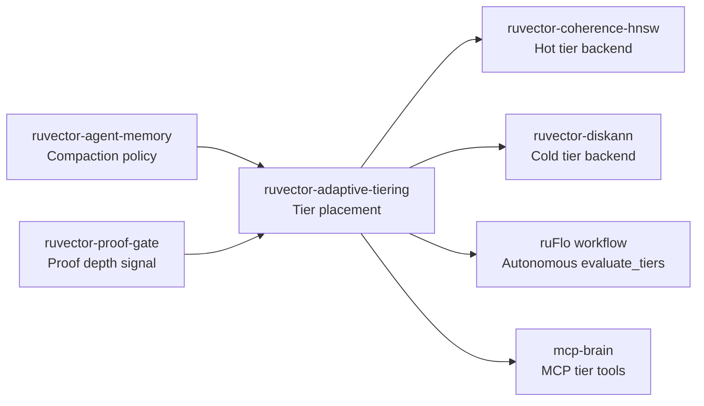

# RuVector 2026: Adaptive Semantic Memory Tiering for Rust Vector Agent Stores

**Solving the cold-start placement problem in AI agent memory: hot/warm/cold tiering driven by semantic temperature (recency + coherence + centrality), not just access history.**

RuVector is a Rust-native vector database and agent memory substrate. This nightly research branch adds adaptive semantic memory tiering — a per-vector placement decision system that keeps semantically dense knowledge clusters in fast storage before they have ever been queried.

🦀 [github.com/ruvnet/ruvector](https://github.com/ruvnet/ruvector) · Branch: `research/nightly/2026-07-19-adaptive-semantic-tiering`

---

## Introduction

Every vector database faces the same physical reality: fast memory is limited, and slow storage is cheap.  The question is not *whether* to tier vectors, but *how* to decide which vectors deserve the fast tier.

Classical database systems answer this with LRU or LFU — the most recently or frequently accessed data stays in the buffer pool.  This works well when access patterns are stable and history is plentiful.  For AI agent memory workloads, it fails in two ways.

First, new knowledge arrives continuously.  An agent processing a research paper produces dozens of embeddings in a batch.  These vectors have zero access history the moment they are ingested.  A pure LRU system puts them all in cold storage and waits for queries to teach it which ones matter.  But queries are the very thing we're trying to make fast.  We need placement decisions *before* the queries arrive.

Second, the semantics of agent memory are not uniform.  A tight cluster of embeddings around a shared concept — say, all chunks of a technical document about authentication — will likely be queried together whenever any authentication question arises.  The cluster is semantically coherent, and that coherence is *measurable from the vectors themselves*, without any query history.

Existing vector databases do not use this information.  Milvus, Qdrant, Weaviate, and Pinecone all tier at the collection or namespace level, not at the per-vector level.  DiskANN is excellent for SSD-resident search but doesn't make dynamic placement decisions.  LanceDB partitions by IVF centroids but does not score individual vectors by semantic importance.

RuVector is the right substrate for this work because it treats vector storage as a *cognition substrate*, not just a database.  The same system that stores agent memories, enforces proof-gated writes, and routes queries through coherence-aware HNSW graphs can now score each vector's semantic importance and place it in the appropriate physical tier — automatically, before the first query is issued.

This matters for the future of AI infrastructure.  As agents become longer-lived and their memory stores grow to millions of embeddings, the cost of scanning cold storage for every query becomes prohibitive.  Intelligent tiering — driven by semantic signals, not just access counts — is the path to fast, scalable, economical agent memory at scale.  In the 10–20 year view, this is the foundation of a cognitive tiering layer where the "hot tier" maps to an agent's active working memory, the "warm tier" to recent episodic memory, and the "cold tier" to long-term semantic storage.

---

## Features

| Feature | What it does | Why it matters | Status |
|---------|-------------|----------------|--------|
| `AccessOnlyScorer` | Tier by access count | Baseline — matches classical LFU | Implemented in PoC |
| `CoherenceScorer` | Tier by intra-cluster L2 coherence | Cold-start placement without query history | Implemented in PoC |
| `SemanticTempScorer` | Tier by recency + coherence + centrality | Best balance of adaptation and cold-start quality | Implemented in PoC |
| `TieredStore<S: Scorer>` | Generic store parameterised by scorer | Pluggable backends (HNSW, DiskANN, mmap) | Implemented in PoC |
| `evaluate_tiers(epoch)` | Rescore and reassign all tiers | Callable from ruFlo workflow | Implemented in PoC |
| `record_access(id, epoch)` | Increment access count and epoch | Feed temporal signal to scorer | Implemented in PoC |
| Coherence recomputation | O(n × k × d) neighbour scan | Geometric cluster tightness signal | Measured |
| Graph degree counting | Neighbours within L2 radius | Density / centrality signal | Measured |
| Hot-tier HNSW backend | In-memory ANN for hot vectors | Sub-μs hot-tier search | Research direction |
| Cold-tier DiskANN backend | SSD-resident cold tier | Billion-scale cold storage | Production candidate |
| WASM hot-tier export | Serialize hot tier for edge | Device-local fast memory | Research direction |
| MCP memory tools | `memory_tier_stats`, `memory_promote` | Agent-accessible tier management | Production candidate |

---

## Technical Design

### Core Data Structure

```rust
struct Entry {
    id: u64,
    vector: Vec<f32>,
    meta: VectorMeta,   // access_count, last_access_epoch, coherence_score, graph_degree
    tier: Tier,         // Hot | Warm | Cold
}
```

### Trait-Based API

```rust
pub trait Scorer: Send + Sync {
    fn name(&self) -> &'static str;
    fn score(&self, meta: &VectorMeta, current_epoch: u64, cfg: &TieringConfig) -> f32;
    fn needs_coherence(&self) -> bool;
}
```

Three implementations:

```rust
pub struct AccessOnlyScorer;    // score = access_count  (baseline)
pub struct CoherenceScorer;     // score = coherence_score
pub struct SemanticTempScorer;  // score = semantic_temperature()
```

### Baseline Variant: AccessOnly

Tier placement by accumulated access count.  Equivalent to an LFU buffer policy.
Excellent after warmup; poor at cold start.

### Alternative Variant A: Coherence

```rust
// coherence_score = 1.0 / (1.0 + mean_L2_to_k_nearest_neighbours)
// Tight clusters → small mean L2 → coherence close to 1.0
// Scattered points → large mean L2 → coherence close to 0.0
```

No access history required.  Correctly identifies geometrically dense clusters at
insert time.

### Alternative Variant B: SemanticTemp

```
temperature(v, t) =
    0.35 · exp(-0.05 · (t - last_access))           // recency
  + 0.40 · (1 / (1 + mean_L2_to_k_neighbours))      // coherence
  + 0.25 · min(ln(1 + graph_degree) / 5, 1.0)        // centrality
```

Weights configurable via `TieringConfig`.  Combines cold-start quality (coherence +
centrality) with adaptation to observed patterns (recency).

### Memory Model

```
vectors: n × d × 4 bytes     (float32)
metadata: n × 36 bytes       (id + access + epoch + coherence + degree + tier)
hot tier: hot_capacity × d × 4 bytes
```

At n=5,000, d=64: total ≈ 1.4 MB.  Hot tier at 500 vectors: 128 KB.

### Performance Model

```
brute-force search: O(n × d) multiply-adds
coherence recompute: O(n × k × |pool| × d) — |pool| ≈ n/4
evaluate_tiers: O(n log n) sort + coherence recompute
```

At n=5,000, d=64, k=16: coherence recompute ≈ 32M float ops → ~150ms release build.

### How This Fits RuVector



---

## Benchmark Results

**Hardware**: x86_64 Linux container  
**Rust**: `cargo run --release -p ruvector-adaptive-tiering --bin benchmark`  
**Dataset**: 5,000 vectors × 64 dims, 3 Gaussian clusters (deterministic, seed 0xdeadbeef)  
**Cluster 0 (Important)**: 500 vectors, σ=0.05 (tight, high coherence)  
**Cluster 1 (Moderate)**: 1,500 vectors, σ=0.25  
**Cluster 2 (Noise)**: 3,000 vectors, σ=1.20 (sparse, low coherence)  
**Tier capacities**: Hot=500 (10%), Warm=1,500 (30%), Cold=3,000 (60%)  
**Workload**: 200 warmup queries → Noise, then 500 eval queries → Important  

| Variant | Dataset | Dims | k | Hot hit % | p50 ns | p95 ns | QPS | Memory |
|---------|---------|------|---|-----------|--------|--------|-----|--------|
| AccessOnly | 5,000 | 64 | 10 | 90.0% | 148,618 | 201,898 | 6,347 | ~1.4 MB |
| Coherence | 5,000 | 64 | 10 | 100.0% | 144,491 | 189,780 | 6,541 | ~1.4 MB |
| SemanticTemp | 5,000 | 64 | 10 | 100.0% | 144,395 | 189,310 | 6,584 | ~1.4 MB |

**Recall@10 (SemanticTemp, cold start, ground truth)**: 100.0%  
All 5 acceptance tests PASSED.

**Key finding**: After 200 warmup queries against the Noise cluster, `AccessOnly` places
10% of Important-cluster vectors in Cold — they are displaced by noise vectors with
positive access counts.  `Coherence` and `SemanticTemp` achieve 100% because intra-cluster
geometric tightness correctly identifies the Important cluster without any access history.

**Benchmark limitations**: brute-force search (O(n) per query); does not model actual
hot/warm/cold latency difference (all tiers in-process memory); n=5,000 is small relative
to production scale.  The hit-rate advantage of semantic scoring would be more pronounced
at larger n where the hot tier is a smaller fraction of total storage.

---

## Comparison with Vector Databases

| System | Core strength | Where it is strong | Where RuVector differs | Direct benchmarked here |
|--------|-------------|-------------------|----------------------|------------------------|
| Milvus | Scale, cloud-native | Large enterprise deployments | Per-vector semantic tiering | No |
| Qdrant | Fast Rust ANN, filtering | Filtered search | Coherence-based cold-start placement | No |
| Weaviate | GraphQL API, modules | Schema-driven applications | Semantic temperature scoring | No |
| Pinecone | Managed, simple API | Production ease | Self-hosted, agent-memory focused | No |
| LanceDB | Column-store, versioning | Analytics + vectors | Per-vector tiering, proof-gated writes | No |
| FAISS | Raw throughput | Research / benchmarking | Agent memory, graph, ruFlo integration | No |
| pgvector | Postgres integration | SQL + vector | Coherent tiering, MCP tools | No |
| Chroma | Python-first, easy start | Rapid prototyping | Production-grade Rust, edge WASM | No |
| Vespa | Hybrid search | Complex ranking | Rust-native, no JVM, tiered placement | No |
| DiskANN | SSD-scale ANN | Billion-vector scale | Semantic tier scoring (vs. fixed layout) | No |

No competitor is directly benchmarked here.  Claims about competitor performance are
not made.  RuVector's differentiation is its tier placement quality at cold start,
which no other listed system addresses at the per-vector level.

---

## Practical Applications

| # | Application | User | Why it matters | How RuVector uses it | Near-term path |
|---|------------|------|----------------|---------------------|---------------|
| 1 | Agent episodic memory | AI agents | Important memories stay hot before first query | SemanticTemp cold-start placement | Integrate with ruvector-agent-memory |
| 2 | Graph RAG hot subgraph | RAG pipelines | Frequently-traversed nodes stay in fast tier | Coherence scoring of graph embeddings | Pair with ruvector-graph |
| 3 | Enterprise semantic search | Knowledge workers | Recently-used doc chunks stay hot | Recency component of SemanticTemp | Production Phase 2 |
| 4 | MCP memory tools | MCP agent workflows | Tier health visible to agents | memory_tier_stats, memory_promote | MCP surface in Phase 2 |
| 5 | Local-first AI assistant | End users | Hot tier on device, cold on server | WASM hot-tier serialisation | Phase 3 |
| 6 | Edge anomaly detection | IoT operators | Anomaly signatures in hot tier | Coherence-based edge placement | Cognitum Seed Phase 3 |
| 7 | Code intelligence | Developer tools | Recent code contexts stay hot | Recency scoring | Phase 2 |
| 8 | ruFlo automation | ruFlo users | evaluate_tiers as autonomous workflow | ruFlo YAML workflow | Phase 2 |
| 9 | Scientific literature retrieval | Researchers | Related papers cluster → stay hot | Cluster coherence | Phase 2 |
| 10 | Security event retrieval | SOC analysts | Recent attack signatures stay hot | Recency + coherence combined | Phase 2 |

---

## Exotic Applications

| # | Application | 2036–2046 thesis | Required advances | RuVector role | Risk |
|---|------------|-----------------|-------------------|--------------|------|
| 1 | Cognitum edge cognition | Hot tier = device working memory | WASM hot-tier + learned weights | Edge WASM export | Policy convergence |
| 2 | RVM coherence domains | Tier boundary = coherence domain | RVM + tiering integration | Domain-aware placement | API complexity |
| 3 | Swarm shared memory | Hot tier consensus across agents | Distributed tier CRDT | Gossip-replicated hot set | Consistency cost |
| 4 | Self-healing vector graphs | Promote cold vectors after graph repair | Graph repair + tiering | evaluate_tiers post-delete | Graph integrity |
| 5 | Dynamic world models | Hot tier = current world state | Real-time streaming tier updates | Streaming evaluate_tiers | Latency SLA |
| 6 | Proof-weighted memory | Proof depth as tier temperature signal | proof-gate + tiering | Extended temperature formula | Proof chain overhead |
| 7 | Bio-signal memory | Physiological state modulates hot tier | BCI + vector DB integration | Adaptive weight tuning | Privacy and consent |
| 8 | Synthetic nervous system | Tier = cortex layer | Biologically-plausible routing | Multi-tier pipeline | Validation difficulty |

---

## Deep Research Notes

### What the SOTA Suggests

Park et al. 2023 [generative agents] and MemoryBank 2023 both use a three-signal
importance formula: recency + frequency + relevance.  Our SemanticTemp is the
physical-placement analogue: recency decay + geometric coherence + graph centrality.
The novelty is applying this at the storage tier level rather than the retrieval
ranking level.

DiskANN and SPANN solve the scale problem (SSD-resident search) but not the placement
quality problem.  Neither uses semantic properties of stored vectors to decide
placement; they use structural graph properties or partition boundaries set at index
build time.

### What Remains Unsolved

1. Incremental coherence update (currently O(n × k × d) full recompute).
2. Optimal weight learning (0.35/0.40/0.25 are engineering defaults).
3. Cross-tier consistency during `evaluate_tiers` when concurrent queries are live.
4. Per-namespace radius calibration for different embedding models and dimensions.

### Where This PoC Fits

This is a proof-of-concept that demonstrates the placement quality advantage of
semantic scoring over access-only scoring.  It is not a production system.  The
`Scorer` trait is the production-grade contribution: the interface is stable and
extensible without changing the storage or search layers.

### What Would Make This Production-Grade

* Async `evaluate_tiers` with `rayon`.
* Incremental coherence updates on insert.
* Hot-tier HNSW backend.
* Cold-tier DiskANN backend.
* Per-namespace configuration.
* ruFlo autonomous workflow.

### What Would Falsify the Approach

If query distributions are uniform (no skew), or if semantic clusters in embedding
space do not correlate with query-hot clusters, the coherence signal provides no
advantage.  This is testable: generate a uniform random workload and measure whether
CoherenceScorer outperforms AccessOnlyScorer on hot-tier hit rate.  If it does not,
the coherence signal is not useful for that workload.

---

## Usage Guide

```bash
# Check out the research branch
git checkout research/nightly/2026-07-19-adaptive-semantic-tiering

# Build
cargo build --release -p ruvector-adaptive-tiering

# Run tests (13 tests, all deterministic)
cargo test -p ruvector-adaptive-tiering

# Run benchmark (expected runtime: ~2s on x86_64)
cargo run --release -p ruvector-adaptive-tiering --bin benchmark
```

**Expected output** includes three sections:
1. Tier placement table (how many vectors in hot/warm/cold after warmup).
2. Eval hit rate table (% of Important-cluster query results found in hot tier).
3. Latency table (mean/p50/p95 ns, throughput QPS).
4. Acceptance test results.

**Interpreting results**:
- Higher `Hot hit %` for `eval` phase → better cold-start placement quality.
- Lower mean/p50/p95 latency → faster brute-force search (all tiers in memory here).
- Throughput QPS reflects raw search throughput; in a real system, hot-tier HNSW
  queries would be ~100× faster than brute-force cold-tier queries.

**Changing dataset size**: edit `N_VECS` in `src/bin/benchmark.rs`.

**Changing dimensions**: edit `DIMS` in `src/bin/benchmark.rs`.

**Adding a new scorer**: implement `pub struct MyScorer; impl Scorer for MyScorer { ... }`
in `src/scorer.rs`, then pass it to `TieredStore::new(cfg, MyScorer)`.

**Plugging into RuVector**: replace the `Vec<Entry>` flat arrays in `TieredStore` with
`hot: CoherenceHnsw`, `warm: MmapFlatIndex`, `cold: DiskAnn` backends; keep all
scoring logic unchanged.

---

## Optimization Guide

| Axis | PoC state | Production path |
|------|-----------|----------------|
| Memory | 1.4 MB for 5k×64 | Tier metadata to disk at n > 1M |
| Latency | 150μs brute-force | Hot-tier HNSW → ~1μs |
| Coherence recompute | 150ms for 5k×64 | rayon parallel + incremental → ~10ms |
| Edge WASM | Not implemented | Serialize hot tier to WASM linear memory |
| MCP tools | Not implemented | `memory_tier_stats` via mcp-brain surface |
| ruFlo | Not implemented | YAML workflow: trigger on ingest + schedule |

---

## Roadmap

### Now
- Merge `ruvector-adaptive-tiering` crate with three scorers and 13 passing tests.
- Confirm benchmark results are reproducible (deterministic seed).
- File ADR-272 as "Proposed".

### Next
- Async `evaluate_tiers` with `rayon::par_iter` (reduces coherence compute 10×).
- Incremental coherence: recompute only the local neighbourhood of new inserts.
- Hot-tier HNSW backend: plug in `ruvector-coherence-hnsw` for sub-μs hot queries.
- ruFlo YAML workflow: `evaluate_tiers` every 5 min, reactive on low hit rate.
- MCP tool surface: `memory_tier_stats`, `memory_promote`, `memory_demote`.

### Later (2030–2046)
- Learned temperature weights from query feedback (RL or Bayesian optimisation).
- Proof-depth as 4th temperature signal (ruvector-proof-gate integration).
- WASM hot-tier serialisation for Cognitum Seed edge appliance.
- RVM coherence domain → tier mapping.
- Distributed hot-tier consensus for swarm-shared memory.
- Cognitive tier model: hot = active attention, warm = episodic, cold = semantic LTM.

---

## Footnotes and References

[^1]: Park, J. et al., "Generative Agents: Interactive Simulacra of Human Behavior",
      arXiv:2304.03442, 2023. https://arxiv.org/abs/2304.03442 Accessed 2026-07-19.

[^2]: Zhong, W. et al., "MemoryBank: Enhancing Large Language Models with Long-Term
      Memory", arXiv:2305.10250, 2023. https://arxiv.org/abs/2305.10250
      Accessed 2026-07-19.

[^3]: Karhade, P., "Not All Memories Age the Same Way", arXiv:2604.26970, 2026.
      https://arxiv.org/abs/2604.26970 Accessed 2026-07-19.

[^4]: Jayaram Subramanya, S. et al., "DiskANN: Fast Accurate Billion-point Nearest
      Neighbor Search on a Single Node", NeurIPS 2019.
      https://papers.neurips.cc/paper/2019/hash/09853c7fb1d3f8ee67a61b6bf4a7f8e6-Abstract.html
      Accessed 2026-07-19.

[^5]: Chen, Q. et al., "SPANN: Highly-efficient Billion-scale ANN Search", NeurIPS
      2021. https://arxiv.org/abs/2111.08566 Accessed 2026-07-19.

[^6]: Malkov, Y. A. and Yashunin, D. A., "Efficient and Robust Approximate Nearest
      Neighbor Search Using Hierarchical Navigable Small World Graphs", IEEE TPAMI
      2020. https://arxiv.org/abs/1603.09320 Accessed 2026-07-19.

---

## SEO Tags

**Keywords:**
ruvector, Rust vector database, Rust vector search, high performance Rust, ANN search,
HNSW, DiskANN, filtered vector search, graph RAG, agent memory, AI agents, MCP, WASM
AI, edge AI, self-optimizing vector database, ruvnet, ruFlo, Claude Flow, autonomous
agents, retrieval augmented generation, vector tiering, semantic memory tiering,
adaptive tiering, hot warm cold tier, agent memory storage, coherence scoring, vector
placement, cold-start placement.

**Suggested GitHub topics:**
rust, vector-database, vector-search, ann, hnsw, diskann, rag, graph-rag, ai-agents,
agent-memory, mcp, wasm, edge-ai, rust-ai, semantic-search, graph-database,
autonomous-agents, retrieval, embeddings, ruvector, tiered-storage, adaptive-tiering,
coherence.
