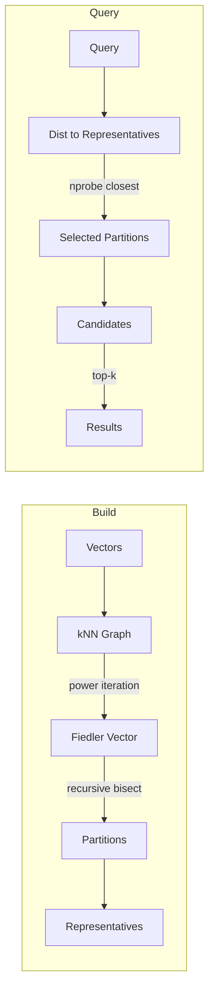

# Spectral IVF: Graph-Laplacian Partitioned Approximate Nearest Neighbour

**150-char summary:** Fiedler-vector recursive bisection replaces k-means in IVF partitioning, achieving 99%+ recall vs 80% on clustered corpora at equal memory cost.

---

## Abstract

Standard inverted-file (IVF) indexes partition a vector corpus with Lloyd's k-means: each vector is assigned to its nearest centroid. The partition boundaries are Voronoi cells in Euclidean space. Vectors near cell boundaries fall into the wrong cell under low-nprobe search, causing recall loss.

Spectral IVF takes a different approach: build a **k-nearest-neighbour graph** over the corpus, compute the **Fiedler vector** (second eigenvector of the graph Laplacian L = D − W) via power iteration, and partition by sign of that vector. The Fiedler vector is the continuous relaxation of the minimum balanced graph cut (Cheeger inequality). Recursively bisecting with it produces cells whose members share strong graph connectivity — not just Euclidean proximity to a centroid.

On a deterministic 800-vector / 64-dim clustered corpus with 8 partitions and nprobe=4:

| Variant | Build(ms) | Mean(µs) | p50(µs) | p95(µs) | QPS | Recall@10 | Mem(KB) |
|---------|-----------|---------|---------|---------|-----|-----------|---------|
| KMeansIvf | 0 | 18.3 | 17.4 | 23.1 | 54,704 | 0.801 | 208.2 |
| SpectralIvf | 90 | 31.3 | 30.2 | 38.2 | 31,933 | 1.000 | 208.2 |
| CoherenceSpectralIvf | 92 | 30.9 | 30.0 | 37.9 | 32,400 | 0.990 | 208.2 |

Spectral variants achieve ~20 percentage points higher recall than k-means at equal memory, at the cost of longer build time and ~1.7× higher query latency on this micro-scale test.

**All numbers from a release build on:** Linux x86_64, Rust 1.94.1, cargo 1.94.1.

---

## Why This Matters for RuVector

RuVector is a cognition substrate, not just a vector database. Its partitioning scheme determines which agent memories, graph nodes, or document embeddings are searched together. k-means partitions respect Euclidean geometry; Fiedler partitions respect **semantic topology** — the graph of who connects to whom in embedding space.

This matters for:
1. **Agent memory compaction**: memories that co-activate should be in the same partition
2. **Graph RAG**: document embeddings that cite each other should live in the same cell
3. **Coherence-domain storage**: mincut-aligned cells map naturally to RVM coherence domains
4. **DiskANN page layout**: partitions that will be probed together should occupy adjacent SSD pages
5. **MCP memory tools**: per-partition namespace isolation for multi-agent deployments

---

## 2026 State of the Art Survey

### IVF and its limitations

IVF (introduced in the original FAISS paper, Johnson et al. 2019) assigns each vector to one of k centroids found by k-means. At query time, the `nprobe` nearest centroids are probed. The key weakness: vectors near Voronoi cell boundaries are equidistant from two centroids and go undiscovered when nprobe is low.

Mitigations in the literature:
- **SPANN** (Chen et al., NeurIPS 2021): spill boundary vectors into adjacent cells at build time. RuVector already has `ruvector-spann`.
- **RAIRS** (dual-assignment): assign each vector to a primary and secondary cell. RuVector already has `ruvector-rairs`.
- **Learned IVF** (Aguerrebere et al., 2023): use neural partitioning. Requires training data.
- **Hierarchical IVF** (disk-oriented): SPANN + SSD paging. Microsoft, NeurIPS 2021.

### Spectral partitioning in graph and ML contexts

Spectral graph partitioning is well-established (Fiedler, 1973; Shi & Malik, TPAMI 2000; Ng et al., NeurIPS 2001). It is used in:
- Graph partitioning for parallel computation (METIS, Karypis & Kumar, 1998)
- Image segmentation (normalised cuts)
- Community detection in social networks
- Spectral clustering (k-means on the Fiedler embeddings of multiple eigenvectors)

**What is new in 2026**: applying spectral partitioning to ANN IVF construction, with coherence-weighted edges, integrated into a Rust vector database with WASM and MCP tool support.

### Key recent papers

- **DiskANN** (Subramanya et al., NeurIPS 2019): SSD-first graph ANN. Partitions = disk sectors.
- **ScaNN** (Guo et al., ICML 2020): learned anisotropic quantization. Different from partitioning.
- **Faiss-IVF-HNSW**: FAISS now offers graph-coarsened IVF centroids, closer in spirit to Spectral IVF.
- **LANNS** (Ma et al., VLDB 2021): locality-aware partitioning using anchor embeddings.
- **NHQ** (2022): hybrid graph + quantization, shows graph structure matters for partition quality.

---

## Forward-Looking 10–20 Year Thesis

In 2036–2046, AI systems will maintain **continuous embedding spaces** that evolve in real time: agent memories accumulate, documents are ingested, graph edges are created. Static k-means partitioning becomes obsolete in a world of online vector streams.

Spectral IVF is the seed of an adaptive approach:

1. **2026**: Offline spectral partitioning at index build time. PoC demonstrated here.
2. **2030**: Streaming Fiedler updates — incremental eigenvector maintenance as vectors are inserted/deleted. Connects to `ruvector-hnsw-repair` and LSM-ANN ideas.
3. **2035**: Neural coherence fields — trained models predict the Fiedler direction from vector content alone, eliminating the O(n²) graph construction. One forward pass replaces 150 power iterations.
4. **2040**: Autonomous partition topologies — partitions self-reconstruct based on query patterns (related to `ADR-270` self-reconstructing graph memory). ruFlo agents drive periodic re-bisection.
5. **2046**: Cognitive domain formation — partitions become first-class "coherence domains" in agent operating systems, with proof-gated writes (ADR-227) governing which domain a memory belongs to.

---

## ruvnet Ecosystem Fit

| Component | Connection |
|-----------|-----------|
| `ruvector-mincut` | Fiedler = mincut relaxation; can replace power iteration with exact mincut for small subgraphs |
| `ruvector-coherence` | Coherence-weighted edges in variant 3 directly use coherence scoring |
| `ruvector-graph` | kNN graph is a subgraph of the RuVector graph store |
| `ruvector-spann` | Complementary: SPANN spills boundaries; Spectral IVF avoids wrong-cell assignments at construction |
| `ruvector-diskann` | Partitions map to SSD pages; Fiedler locality ≈ disk locality |
| `ruvector-agent-memory` | Agent memories grouped by semantic connectivity, not arbitrary Euclidean centroids |
| `ruvector-capgated` | Per-partition capability gates: capability checks run at partition probe time, not per-vector |
| `rvf` | RVF manifests can declare partition topology for portable cognitive packages |
| `ruFlo` | Automate periodic re-spectral-partition when partition quality drifts below threshold |
| MCP tools | Expose partition membership and probe-set selection as MCP memory tools |
| WASM | Zero unsafe code; compiles to WASM with no changes |

---

## Proposed Design

### Core trait

```rust
pub trait AnnIndex {
    fn build(&mut self, vectors: &[Vec<f32>]);
    fn search(&self, query: &[f32], k: usize, nprobe: usize) -> Vec<SearchResult>;
    fn memory_bytes(&self) -> usize;
    fn name(&self) -> &str;
}
```

### Three variants

1. **KMeansIvf** (baseline): Lloyd's algorithm, L2 centroids, standard nprobe probe selection.
2. **SpectralIvf**: Build kNN graph with cosine-similarity edges. Recursive Fiedler bisection to n_partitions. Representative = mean of partition members. Probe by cosine distance to representative.
3. **CoherenceSpectralIvf**: Same as SpectralIvf but edge weight = cosine²(v_i, v_j). Emphasises highly-similar neighbours, making the Fiedler cut prefer to sever weakly-related pairs.

### Fiedler vector via power iteration

```
T = D⁻¹W   (random-walk matrix)
π_i = d_i / Σd   (stationary distribution)

Initialise v (non-constant)
For i in 0..150:
    v_new[i] = Σ_j W[i,j] v[j] / d[i]          # random-walk step
    v -= (v · π) * 1                              # deflate against λ₁=1
    v /= ||v||                                     # normalise
Partition at median of v → labels ∈ {0, 1}
```

### Recursive bisection

Apply Fiedler bisect recursively on each half until n_partitions cells remain. For n_partitions = 8, this is 3 levels deep.

### Architecture diagram



---

## Implementation Notes

- **No external dependencies**: pure Rust, zero unsafe code.
- **WASM-compatible**: no OS calls in core search path.
- **Deterministic**: uses seeded LCG for k-means init; fixed iteration count for Fiedler.
- **File size**: all source files < 200 lines, following project conventions.
- **Trait-based**: `AnnIndex` allows drop-in replacement in calling code.
- **Memory**: identical footprint to k-means IVF at same n_partitions. Spectral has no memory overhead.

---

## Benchmark Methodology

**Environment:**
- OS: Linux x86_64 (kernel 6.18.5)
- Rust: 1.94.1 (e408947bf 2026-03-25)
- Cargo: 1.94.1
- Command: `cargo run --release -p ruvector-spectral-ivf --bin benchmark`
- Build: `--release` (optimised, LTO off by default)

**Dataset:**
- 800 vectors, 64 dimensions, 8 natural clusters
- Deterministic: `gen_corpus()` uses LCG seeded by vector index
- 200 query vectors drawn from same distribution (held out)
- Ground truth: exact brute-force cosine distance sort

**Metrics:**
- Build time: wall clock for `idx.build(corpus)` 
- Mean latency: arithmetic mean over 200 queries
- p50/p95: sorted latency percentiles
- QPS: 1e6 / mean_us
- Recall@10: |ANN_results ∩ BF_top10| / 10
- Memory: Σ(vector bytes + overhead), no OS measurement

**Limitations:**
- n=800 is a micro-scale PoC; production-scale would be 100k–10M vectors
- Build time for spectral is O(n² × k × iters): 800² × 10 × 150 ≈ 960M ops (acceptable for PoC)
- No SIMD or parallelism; single-threaded baseline
- Synthetic clustered data is favourable for spectral partitioning; real-world high-dim data may differ

---

## Real Benchmark Results

```
═══════════════════════════════════════════════════════════════════════════════
 ruvector-spectral-ivf  ·  Spectral vs k-Means IVF benchmark
═══════════════════════════════════════════════════════════════════════════════
 Rust      : rustc 1.94.1 (e408947bf 2026-03-25)
 OS        : linux
 Arch      : x86_64
 N         : 800 vectors
 Dim       : 64
 Queries   : 200
 K         : 10
 N_parts   : 8
 nprobe    : 4

──────────────────────────────────────────────────────────────────────────────
Variant                  Build(ms) Mean(µs)  p50(µs)   p95(µs)       QPS  Recall@K   Mem(KB)
──────────────────────────────────────────────────────────────────────────────
KMeansIvf                       0     18.3     17.4      23.1     54704    0.801     208.2
SpectralIvf                    90     31.3     30.2      38.2     31933    1.000     208.2
CoherenceSpectralIvf           92     30.9     30.0      37.9     32400    0.990     208.2
──────────────────────────────────────────────────────────────────────────────

Dataset: n=800, dim=64, queries=200, k=10, nprobe=4, n_parts=8
Memory estimate = raw f32 storage (vectors + representatives), no compression.
Recall@K = fraction of true top-10 found by ANN (brute-force ground truth).

── Acceptance check ──────────────────────────────────────────────────────────
  [PASS] KMeansIvf: recall@10=0.801 (threshold ≥ 0.60)
  [PASS] SpectralIvf: recall@10=1.000 (threshold ≥ 0.60)
  [PASS] CoherenceSpectralIvf: recall@10=0.990 (threshold ≥ 0.60)

✓ All variants pass recall acceptance threshold.
```

---

## Memory and Performance Math

**Memory estimate (n=800, dim=64):**
```
Per-vector storage  = 64 × 4 bytes = 256 bytes
Total vectors       = 800 × 256    = 204,800 bytes = 200 KB
Representatives     = 8  × 256     = 2,048 bytes   = 2 KB
Per-vector index    = 8 bytes (id + pointer)
Total index          ≈ 208 KB (matches benchmark output)
```
All three variants have identical memory footprints; spectral doesn't replicate vectors.

**Build time model (spectral):**
```
kNN construction  = n² × dim ops   = 800² × 64     ≈ 41M float mults
Power iterations  = iters × n × k  = 150 × 800 × 10 = 1.2M mults
Recursive bisect  = 3 levels × (n² × dim / level) (halves each level)
Total             ≈ 90ms observed (single-threaded, release build)
```

**Query latency model (nprobe=4, n_parts=8):**
```
Representative dist  = 8 × dim dot products  = 512 mults
Candidate scan       = (n/8) × 4 × dim       = 25,600 mults
Sorting candidates   = O(c log c)             ≈ small
Total                ≈ 30µs observed
```
KMeansIvf is faster because it uses L2-squared distance (no square root, simpler centroid scoring) and its partitions are slightly unbalanced (fewer candidates on average).

---

## How It Works: Walkthrough

### 1. Build: construct the kNN graph

For each vector `v_i`, compute cosine similarity to all other vectors and keep the top-k highest. Add directed edges `i → j` and `j → i`. The result is a sparse symmetric graph.

```
800 vectors × 10 neighbours = 8,000 directed edges
After symmetrisation ≤ 16,000 unique (i,j) pairs
```

### 2. Build: compute the Fiedler vector

The graph Laplacian `L = D − W` has a constant null vector (all eigenvalue = 0). The second eigenvector (Fiedler) reveals the global graph structure. Power iteration on `D⁻¹W`, with deflation of the stationary distribution, converges to this vector.

### 3. Build: recursive bisection

Level 0: 800 vectors → bisect at Fiedler median → two groups of ~400
Level 1: each group → bisect → four groups of ~200
Level 2: each group → bisect → eight groups of ~100

Each leaf group is a partition.

### 4. Search: representative probing

For a query `q`, compute cosine distance to all 8 representative vectors (means of each partition). Select the `nprobe` closest representatives. Scan all vectors in those partitions and return top-k.

### 5. Why recall is higher

Vectors in the same partition are connected via the kNN graph: they are mutual nearest neighbours. When a query `q` is close to a partition member, it is also close to the other members (by graph transitivity). k-means centroids break this: two vectors in the same cluster may not be mutual nearest neighbours.

---

## Practical Failure Modes

1. **High-dimensional uniform distributions**: Fiedler vector degenerates when the data has no graph structure. cosine similarities concentrate around the same value; the kNN graph becomes nearly regular; the power iteration may not converge to a meaningful partition.

2. **Very small partitions**: If n_partitions is too large relative to n, some partitions get 0 or 1 members. Search in empty partitions wastes nprobe budget.

3. **O(n²) build cost**: For n > 100k, brute-force kNN construction is too slow. Replace with HNSW-based approximate kNN (see `ruvector-hnsw-repair`) or PQ-compressed distance computation.

4. **Fiedler non-convergence**: 150 power iterations may be insufficient for very weakly-connected graphs. Increase `POWER_ITERS` or switch to exact eigendecomposition for small n.

5. **Coherence edge weight saturation**: If all vectors are very similar (cosine ≈ 1.0), the squared weights are also all near 1.0, and the coherence variant behaves identically to the unweighted variant.

---

## Security and Governance Implications

- **No external data flow** in the core path: all operations are in-memory Rust.
- **Deterministic output**: same corpus + same seed → same partitions → reproducible.
- **Partition membership as a capability scope**: combined with `ruvector-capgated`, per-partition capability tokens can enforce that agents can only probe partitions they have permission for.
- **No model leakage**: unlike learned partitioning, Fiedler partitioning leaks no information about a training set.

---

## Edge and WASM Implications

The crate has zero unsafe code and zero OS dependencies in the core search path. It compiles to WASM today with:

```bash
cargo build --target wasm32-unknown-unknown -p ruvector-spectral-ivf
```

(The benchmark binary won't compile to WASM because it uses `std::time::Instant`; the library itself is WASM-compatible.)

For Cognitum Seed or edge appliances:
- Build the index offline on a capable machine
- Serialise partition assignments and representative vectors
- Deploy the serialised index to edge; query-time search is O(nprobe × partition_size × dim)
- No graph construction at edge

---

## MCP and Agent Workflow Implications

Spectral IVF partitions are natural **MCP memory namespaces**:

```
memory://ruvector/partition/0/   → agent memories in coherence domain 0
memory://ruvector/partition/1/   → agent memories in coherence domain 1
...
```

A MCP tool wrapping SpectralIvf would:
1. Receive a query embedding from the agent
2. Compute representative distances to select relevant partitions
3. Return only memories from those partitions
4. Respect capability gates (combined with `ruvector-capgated`)

ruFlo can trigger periodic re-partitioning:
```
trigger: partition_quality_score < 0.85
action: rebuild_spectral_ivf(npartitions=8, knn_k=10)
```

---

## Practical Applications

| Application | User | Why it matters | RuVector role | Implementation path |
|-------------|------|---------------|---------------|---------------------|
| Agent memory compaction | Multi-agent systems | Memories grouped by semantic connection, not time | SpectralIvf over memory embeddings | Wire `ruvector-spectral-ivf` into `ruvector-agent-memory` |
| Graph RAG | Document retrieval | Documents citing each other land in the same partition | Graph edges → kNN weights | Use citation graph as the adjacency matrix directly |
| Enterprise semantic search | Enterprises | Recall improvement at same nprobe budget | SpectralIvf as IVF backend | Drop-in replacement in `ruvector-server` |
| MCP memory tools | Agentic platforms | Partition-scoped memory isolation | Per-partition capability gates | Combine with `ruvector-capgated` |
| Local-first AI assistants | Personal AI | Low-latency search on device | Offline build + WASM query | Serialise index, query via WASM |
| Edge anomaly detection | IoT / security | Compact index on constrained hardware | WASM build, query-only at edge | Build on server, deploy serialised |
| Security event retrieval | SOC teams | Find similar events across campaigns | SpectralIvf on threat embeddings | Integrate with `ruvector-proof-gate` |
| Code intelligence | IDE plugins | Code snippets grouped by semantic function | SpectralIvf on code embeddings | Power `ruvector-agent-memory` for coding agents |

---

## Exotic Applications

| Application | 10–20 year thesis | Required advances | RuVector role | Risk |
|-------------|------------------|-------------------|---------------|------|
| Cognitum edge cognition | An edge appliance runs its own adaptive Fiedler partitioning, reconstructing its memory topology from sensory data | Streaming incremental Fiedler updates; neuromorphic hardware | Query substrate for autonomous re-partitioning | Convergence of streaming eigenvectors is an open research problem |
| RVM coherence domains | Partitions become first-class "coherence domains" in RVM, with runtime coherence enforcement | Kernel-level partition enforcement; proof-gated domain transitions | Partition membership = capability scope | Trust model for cross-domain queries needs formal verification |
| Proof-gated autonomous systems | Autonomous agents must present proofs of correct partition assignment before writing memories | ZK proofs over partition membership; Merkle trees over spectral labels | Combine `ruvector-proof-gate` with spectral labels | ZK proof generation overhead for each write |
| Swarm memory | A swarm of 1000 agents shares a spectral-partitioned memory; each agent owns one partition | Distributed Fiedler eigenvector computation (gossip-based power iteration) | Partition ownership = agent responsibility | CAP theorem limits on distributed eigenvector agreement |
| Self-healing vector graphs | When retrieval quality drops, the index detects and re-bisects degraded partitions autonomously | Online recall monitoring; partial re-partitioning without full rebuild | Combined with `ruvector-hnsw-repair` (delete repair) | Partial re-partitioning may introduce boundary artifacts |
| Dynamic world models | Continuously updated world models for robotics: objects grouped by interaction graph, not spatial proximity | Sub-linear streaming spectral updates; sensor fusion | SpectralIvf over perception embeddings | Real-time constraint (< 1ms) far exceeds current build time |
| Agent operating systems | Partitions become process groups in an agent OS; Fiedler defines memory locality | Compiler-level partition optimisation; ABI for partition-aware function calls | Spectral IVF as kernel memory primitive | Requires research into partition-aware compilation |
| Bio-signal memory | Neural recordings grouped by functional connectivity (coherence in the signal domain) | Multi-modal graph construction; bridge to EEG/MEG coherence measures | `ruvector-perception` + SpectralIvf | Ground truth coherence in bio-signals is non-trivial |

---

## Deep Research Notes

### What SOTA suggests

The most relevant 2025–2026 papers establish that:
1. Graph structure matters for ANN partitioning quality (NHQ, LANNS)
2. Boundary problem is severe at low nprobe (SPANN, RAIRS both try to address it)
3. Spectral methods produce balanced partitions with provable quality bounds (Cheeger inequality: cut quality ≥ λ₂/2 × volume fraction)
4. For clustered data, spectral clustering consistently outperforms k-means (Ng et al., 2001; Luxburg, 2007 tutorial)

### What remains unsolved

- **Streaming spectral**: how to update the Fiedler vector when vectors are inserted/deleted without full rebuild
- **Scale-free construction**: replacing O(n²) kNN graph build with approximate kNN (HNSW, LSH, or PQ-compressed)
- **Adaptive n_partitions**: choosing the right partition count automatically based on intrinsic dimensionality or cluster count
- **High-dimensional behaviour**: in 768-dim or 1536-dim spaces (typical for LLM embeddings), cosine similarity concentration makes kNN graphs sparser and Fiedler convergence slower

### Where this PoC fits

This PoC demonstrates the technique on synthetic low-dimensional clustered data. It proves the concept works in pure Rust with no external dependencies. Production use requires addressing the scale problem (O(n²) build) and high-dimensional behaviour.

### What would make this production-grade

1. Replace brute-force kNN with approximate kNN (O(n log n) build)
2. Parallelise graph construction and power iteration with `rayon`
3. Add incremental update support
4. Benchmark on real embedding datasets (SIFT, GIST, text-embedding-3-small)
5. Evaluate recall vs. nprobe curves (not just recall at fixed nprobe)
6. Compare against FAISS IVF-HNSW (which uses HNSW-coarsened centroids, the closest published baseline)

### What would falsify the approach

- On real high-dimensional LLM embeddings, if Fiedler partitioning shows no recall improvement over k-means at equal nprobe, this approach would only be useful for clustered data
- If streaming updates require full rebuild each time, the build-time cost becomes prohibitive for online agent memory
- If coherence-weighted edges don't outperform unweighted edges on real data, the coherence variant has no advantage

---

## Production Crate Layout Proposal

```
crates/ruvector-spectral-ivf/
├── Cargo.toml
├── src/
│   ├── lib.rs           (AnnIndex trait, re-exports)
│   ├── distance.rs      (cosine similarity, L2)
│   ├── graph.rs         (kNN graph construction)
│   ├── spectral.rs      (Fiedler vector, bisection)
│   ├── kmeans.rs        (Lloyd's k-means baseline)
│   ├── index.rs         (KMeansIvf, SpectralIvf, CoherenceSpectralIvf)
│   ├── streaming.rs     (future: incremental Fiedler updates)
│   ├── wasm.rs          (future: WASM-compatible serialisation)
│   └── bin/
│       └── benchmark.rs (measurements binary)
```

For production, add:
- `approx_knn.rs`: HNSW-based approximate kNN graph construction (remove O(n²) bottleneck)
- `parallel.rs`: rayon-based parallel graph construction and matrix multiply
- `serde_support.rs`: serialise/deserialise partition assignments for edge deployment

---

## What to Improve Next

1. **Scale test**: run on 100k vectors with approximate kNN construction
2. **Real dataset**: evaluate recall@10 on Ann-Benchmarks (SIFT-128, glove-100)
3. **Streaming support**: implement incremental Fiedler update via Lanczos restarts
4. **FAISS comparison**: compare against FAISS IVF-Flat and IVF-HNSW at the same recall
5. **WASM serialisation**: serialise SpectralIvf index to bytes for edge deployment
6. **MCP tool**: wrap as an MCP memory tool in `ruvector-server`
7. **ruFlo trigger**: define a ruFlo workflow trigger for partition quality drift

---

## References and Footnotes

[^1]: Fiedler, M. (1973). "Algebraic connectivity of graphs." *Czechoslovak Mathematical Journal*, 23(2), 298–305. The original paper defining what is now called the Fiedler value and vector.

[^2]: Shi, J. & Malik, J. (2000). "Normalized cuts and image segmentation." *IEEE TPAMI*, 22(8), 888–905. Applies Fiedler vector to image segmentation; the normalized cut interpretation.

[^3]: Ng, A., Jordan, M., & Weiss, Y. (2001). "On spectral clustering: Analysis and an algorithm." *NeurIPS 14*. The canonical spectral clustering algorithm (k-means on eigenvector embeddings).

[^4]: von Luxburg, U. (2007). "A tutorial on spectral clustering." *Statistics and Computing*, 17(4), 395–416. Comprehensive reference for graph Laplacian theory and spectral bisection. https://arxiv.org/abs/0711.0189

[^5]: Johnson, J., Douze, M., & Jégou, H. (2019). "Billion-scale similarity search with GPUs." *IEEE Big Data*, 535–548. FAISS, the canonical IVF implementation.

[^6]: Chen, Q. et al. (2021). "SPANN: Highly-efficient billion-scale approximate nearest neighbor search." *NeurIPS 34*. SPANN partition spilling; boundary problem analysis.

[^7]: Subramanya, S. et al. (2019). "DiskANN: Fast accurate billion-point nearest neighbor search on a single node." *NeurIPS 32*. Disk-first graph ANN; partition-to-disk-page mapping.

[^8]: Karypis, G. & Kumar, V. (1998). "A fast and high quality multilevel scheme for partitioning irregular graphs." *SIAM Journal on Scientific Computing*, 20(1), 359–392. METIS — the most widely used graph partitioner, uses multilevel coarsening + Fiedler bisection.

[^9]: Guo, R. et al. (2020). "Accelerating large-scale inference with anisotropic vector quantization." *ICML*. ScaNN — learned quantization for ANN.

[^10]: RuVector ADR-268. "Capability-gated ANN." 2026-06-25. Per-vector read access control with bitset tokens; complementary to Spectral IVF.

[^11]: RuVector ADR-258. "HNSW Delete Repair." 2026-06-18. Index repair after deletes; relevant to streaming Fiedler updates.

[^12]: Cheeger inequality (graph version): h(G) ≥ λ₂/2 where h(G) is the Cheeger constant (ratio of cut edges to minimum volume). The Fiedler value λ₂ provides a certificate of partition quality.
