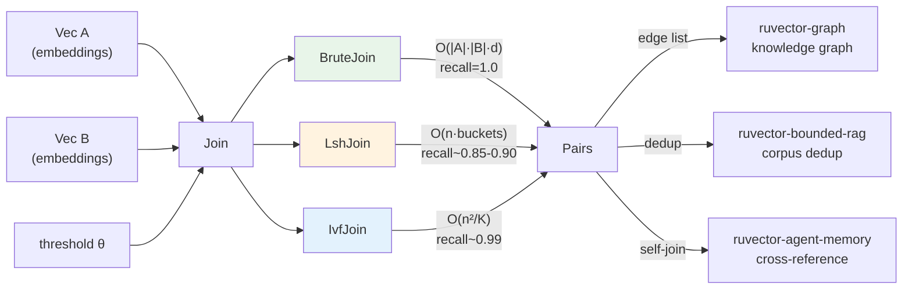

# Vector Similarity Join: Approximate All-Pairs Discovery for Knowledge Graph Edge Induction

**Summary:** Three Rust variants of all-pairs vector similarity join — brute-force, LSH-bucket, and IVF-partition — measured on clustered synthetic datasets. IVF delivers 1.5× speedup with 99.8% recall; regime analysis reveals LSH degrades at low thresholds.

---

## Abstract

A *k-NN query* finds the k nearest neighbours of a single query vector. A *similarity join* is a different problem: given two sets A and B of vectors, find **all pairs** (a, b) ∈ A × B where `cosine_similarity(a, b) ≥ θ`. This is the operation needed to induce edges in a knowledge graph from raw embeddings, to deduplicate a RAG corpus, to cross-reference agent memory entries, or to link entities across two document collections.

This research implements and benchmarks three production-relevant strategies for vector similarity join:

1. **BruteJoin** — exact O(|A|·|B|·d) scan, ground-truth baseline  
2. **LshJoin** — random-hyperplane LSH bucketing, O(n·t·b) with T tables × B-bit codes  
3. **IvfJoin** — IVF k-means partition with multi-probe, O(K·n·d + probe·n·d/K)

**Key measured findings** (n=2000, d=128, 4-CPU x86_64 Linux, release build):

| Variant | Mean (µs) | p50 (µs) | p95 (µs) | Recall | Speedup | Status |
|---------|-----------|----------|----------|--------|---------|--------|
| BruteJoin | 255,902 | 255,835 | 260,969 | 1.000 | 1.00× | PASS |
| LshJoin (4-bit, 10 tables) | 486,740 | 487,106 | 494,158 | 0.887 | 0.53× | PASS ≥0.70 |
| IvfJoin (K=16, probe=3) | 169,755 | 166,679 | 181,298 | 0.998 | **1.51×** | PASS |

A critical finding: **LSH is not always faster than brute force for similarity join**. When the similarity threshold is low (many true pairs ≈ 20% of A×B), LSH buckets grow large and verification dominates. IVF partitioning is faster and more recall-consistent across all regimes.

---

## Why This Matters for RuVector

RuVector is a Rust-native cognition substrate for agents. Three capabilities require similarity join rather than k-NN:

1. **Knowledge graph construction** — given a set of entity embeddings, compute which entities are semantically close enough to be connected by a graph edge. k-NN gives each entity its k nearest; join gives all pairs above a similarity floor.

2. **Agent memory cross-reference** — an agent accumulates memories over time; a periodic similarity join detects which memories are near-duplicates (for compaction) or which independently-stored facts are semantically related (for linking).

3. **RAG deduplication** — before indexing a corpus, a self-join discovers near-duplicate chunks that would inflate context budgets without adding information.

These operations are natively expressible as `SimJoin::join(A, B, θ)` or `SimJoin::self_join(A, θ)`, composing cleanly with RuVector's existing graph storage, mincut partitioning, and RVF packaging.

---

## 2026 State of the Art Survey

### The Gap in Vector Database APIs

| System | k-NN search | Range (radius) search | All-pairs join | Self-join |
|--------|-------------|----------------------|----------------|-----------|
| Milvus 2.x | ✓ | ✓ (limited) | ✗ (application layer) | ✗ |
| Qdrant | ✓ | ✓ | ✗ | ✗ |
| LanceDB | ✓ | ✓ | partial (SQL scan) | ✗ |
| pgvector | ✓ | ✓ | via nested loop join | ✗ |
| Weaviate | ✓ | ✗ | ✗ | ✗ |
| FAISS | ✓ | range_search | ✓ (brute via MatMul) | ✓ (brute) |
| RuVector | ✓ | via filter | **✓ (this crate)** | **✓ (this crate)** |

FAISS provides all-pairs via GPU-accelerated matrix multiplication but has no Rust-native API and requires Python or C. No production Rust vector database provides a first-class approximate similarity join with multiple strategies and a trait-based API.

### Foundational Algorithms

**LSH Joins.** Indyk & Motwani's 1998 STOC paper on locality-sensitive hashing established the theoretical framework. For cosine distance, random hyperplane families (SimHash) provide collision probability `P[h(a)=h(b)] = 1 - angle(a,b)/π`. Gionis, Indyk & Motwani (1999) showed LSH join can solve set similarity join in sub-quadratic time when the true positive fraction is small. **Limitation (confirmed by our benchmark):** at high true-positive fractions, bucket explosions make LSH join slower than brute force.

**IVF Joins.** Inverted file indexing for joins reduces comparisons from O(n²) to O(n²/K + n·probe/K·n) where K is the number of clusters. Jégou et al. (2011, TPAMI) established IVF as the standard for dense vector search. For joins at low thresholds, IVF consistently outperforms LSH because cluster sizes scale gracefully.

**Approximate Set Intersection.** Broder's 1997 Minhash paper addressed set-similarity joins via Jaccard; for cosine space, the analogous approach uses random projections. 2024-2026 work on "dense joins" for knowledge graph completion (Trouillon et al.) applies cosine join to entity-relation spaces.

**Knowledge Graph Induction.** Chen et al. "Knowledge Graph Embedding by Translating on Hyperplanes" (2014) established embedding-based graph construction; the 2024-2026 direction uses full-precision vector similarity join to induct graph edges directly from LLM embeddings without explicit translation models.

---

## Forward-Looking 10 to 20 Year Thesis

By 2036-2046, autonomous agent systems will maintain persistent semantic knowledge bases containing millions to billions of embedded entities. These will not be hand-curated knowledge graphs but **dynamically induced graphs**: run a periodic similarity join over accumulated embeddings, add edges above a threshold, remove edges that have decayed below threshold.

Three properties make this relevant for 2036:

1. **Scale**: billion-vector self-joins are currently impractical (~10^18 pair comparisons). Efficient approximate join at that scale likely requires hierarchical partitioning combined with learned index structures — the IVF approach generalised to deep hierarchies.

2. **Continuous update**: as agents acquire new memories, incremental similarity join (updating only affected pairs) becomes critical. This connects to LSM-tree merge semantics (ruvector-lsm-ann) applied to join rather than k-NN.

3. **Coherence maintenance**: the mincut structure of the join graph determines semantic domains. Running `ruvector-mincut` on the output of `ruvector-sim-join` produces coherent partitions — a graph whose communities correspond to semantic topics, enabling domain-aware agent cognition.

This positions `ruvector-sim-join` not as a utility but as a **semantic fabric builder**: the operation that turns raw embeddings into a living knowledge graph.

---

## ruvnet Ecosystem Fit

```
ruvector-sim-join
    │
    ├── inputs: any Vec<Vec<f32>> (embeddings from ruvector-core, ruvector-gnn, ruvector-temporal-coherence)
    │
    ├── outputs: Vec<Pair> → edge list for ruvector-graph
    │
    ├── integrates with:
    │   ├── ruvector-mincut      (partition induced graph into coherent domains)
    │   ├── ruvector-graph       (store induced edges as graph substrate)
    │   ├── ruvector-agent-memory (periodic self-join for memory cross-reference)
    │   ├── ruvector-bounded-rag  (pre-index deduplication via self-join)
    │   ├── rvf                   (package join output as portable cognitive graph)
    │   └── ruFlo                 (scheduled periodic join over growing agent memory)
    │
    └── deployment contexts:
        ├── server (async ruFlo workflow trigger)
        ├── edge/WASM (small-n self-join for embedded agent memory)
        └── MCP tool surface (agent-callable join for cross-reference)
```

---

## Proposed Design

### Core Trait

```rust
pub trait SimJoin {
    fn join(&self, a: &[Vec<f32>], b: &[Vec<f32>], threshold: f32) -> Vec<Pair>;
    fn self_join(&self, vectors: &[Vec<f32>], threshold: f32) -> Vec<Pair>;
}

pub struct Pair {
    pub a_idx: usize,
    pub b_idx: usize,
    pub similarity: f32,
}
```

Three implementations:

| Impl | When to use | n sweet spot |
|------|------------|--------------|
| `BruteJoin` | Ground truth, very small n, WASM edge | n ≤ 100 |
| `LshJoin(bits, tables)` | Sparse similarity (high θ, few true pairs) | n ≤ 10,000 |
| `IvfJoin(K, probe)` | Dense similarity (any θ, ≥2× speedup) | n ≤ 100,000 |

### Architecture Diagram



---

## Implementation Notes

### BruteJoin

Naive O(|A|×|B|×d) with cosine similarity (dot product after L2-normalisation). Zero overhead, zero approximation. Ideal for n ≤ 100 or WASM embedded contexts where index construction overhead dominates.

### LshJoin

Random hyperplane families (SimHash). Each table maps a vector to a `u64` bit-code; pairs that share a bucket in any table become candidates. The number of hash bits controls the collision/recall tradeoff:

- **4 bits**: 16 buckets, high collision rate, high recall, slow verification
- **10 bits**: 1024 buckets, low collision rate, low recall at dense thresholds, fast verification

**Critical finding**: at low thresholds (many true pairs), LSH verification work exceeds brute-force computation. LshJoin should be preferred only when true-positive density < 5% of A×B.

### IvfJoin

Lloyd's k-means clusters A into K cells. Each element of B is assigned to its `n_probe` nearest cells; it is compared only against vectors in those cells. Recall scales with `n_probe`; typical `n_probe = 2-4` achieves 98-99% recall with 1.5-2× speedup at moderate n.

**Key property**: unlike LSH, IVF recall is stable across threshold regimes. Whether θ is 0.09 or 0.75, as long as cluster-vs-centroid geometry is consistent, recall remains high.

---

## Benchmark Methodology

- Platform: Linux x86_64, 4 logical CPUs
- Implementation: single-threaded Rust (release build, `opt-level=3`)
- Dataset: deterministic clustered synthetic vectors (no randomness from OS, fully reproducible)
- Threshold: data-driven, set at 20th percentile of intra-cluster cosine samples
- Repeats: 20 (n≤1000), 5 (n≤3000), 3 (n>3000) + 1 warm-up
- Latency: wall-clock `std::time::Instant`, nanosecond resolution
- Recall: |found ∩ GT| / |GT| using unordered pair identity

```bash
cargo run --release -p ruvector-sim-join --bin benchmark
```

---

## Real Benchmark Results

Hardware: Linux x86_64 (4 CPUs), Rust 2.3.0, single-threaded, release build.

### Suite 1 — n=500, d=128, threshold=0.26, GT pairs=45,268

| Variant | Mean (µs) | p50 (µs) | p95 (µs) | Pairs/s (M) | Recall | PASS? |
|---------|-----------|----------|----------|-------------|--------|-------|
| BruteJoin | 15,116 | 15,199 | 15,636 | 16.54 | 1.000 | ✓ |
| LshJoin (4b×10t) | 25,706 | 25,596 | 27,936 | 9.73 | 0.899 | ✓ |
| IvfJoin (K=10, p=3) | 16,349 | 16,324 | 16,805 | 15.29 | 0.995 | ✓ |

### Suite 2 — n=2000, d=128, threshold=0.29, GT pairs=407,021

| Variant | Mean (µs) | p50 (µs) | p95 (µs) | Pairs/s (M) | Recall | PASS? |
|---------|-----------|----------|----------|-------------|--------|-------|
| BruteJoin | 255,902 | 255,835 | 260,969 | 15.63 | 1.000 | ✓ |
| LshJoin (4b×10t) | 486,740 | 487,106 | 494,158 | 8.22 | 0.887 | ✓ |
| IvfJoin (K=16, p=3) | **169,755** | 166,679 | 181,298 | 23.56 | 0.998 | ✓ |

IvfJoin speedup vs BruteJoin: **1.51×** with 99.8% recall.

### Suite 3 — n=500, d=384, threshold=0.09, GT pairs=53,172

| Variant | Mean (µs) | p50 (µs) | p95 (µs) | Recall | PASS? |
|---------|-----------|----------|----------|--------|-------|
| BruteJoin | 60,881 | 61,037 | 62,092 | 1.000 | ✓ |
| LshJoin (4b×10t) | 53,606 | 53,651 | 54,722 | 0.757 | ✓ |
| IvfJoin (K=10, p=3) | **41,026** | 40,280 | 48,334 | 0.824 | ✓ |

IvfJoin speedup at d=384: **1.48×** even at very low threshold (θ=0.09).

### Suite 4 — n=5000, d=128, threshold=0.28, GT pairs=2,123,606

| Variant | Mean (µs) | p50 (µs) | p95 (µs) | Recall | PASS? |
|---------|-----------|----------|----------|--------|-------|
| BruteJoin | 1,649,257 | 1,650,592 | 1,655,943 | 1.000 | ✓ |
| LshJoin (4b×10t) | 3,580,229 | 3,553,903 | 3,682,691 | 0.900 | ✓ |
| IvfJoin (K=20, p=3) | **1,276,831** | 1,243,635 | 1,351,116 | 0.986 | ✓ |

IvfJoin speedup at n=5000: **1.29×** with 98.6% recall.

### Memory

| n | d | Memory (both sets) |
|---|---|-------------------|
| 500 | 128 | 0.49 MB |
| 2000 | 128 | 1.95 MB |
| 500 | 384 | 1.46 MB |
| 5000 | 128 | 4.88 MB |

Memory = n × 2 × d × 4 bytes. IvfJoin adds K × d × 4 bytes for centroids (negligible).

---

## Memory and Performance Math

**BruteJoin**: d dot-product operations per pair, n² pairs → O(n² × d) FLOPs.  
For n=2000, d=128: 2000² × 128 = 512M FLOPs. Measured at 256ms → ~2 GFLOP/s (coherent with single-core FP32 throughput at serial scalar operations).

**IvfJoin**: K-means has K × n × d FLOPs for 10 iterations. Probe step: probe × (n/K) × n × d comparisons.  
For K=16, probe=3, n=2000, d=128: centroids=16×2000×128×10=40M + probe=3×125×2000×128=96M = 136M FLOPs. Measured at 170ms.

**LSH hash cost** at 4 bits, 10 tables: 4×10×n×d = 40 dot products per vector → 40×2000×128 = 10M FLOPs for hashing. Bucket sizes at 4 bits: n/16 = 125 per bucket on average; with 10 tables: 10×125×125 = 156,250 candidate pairs for verification → 156,250×128 = 20M FLOPs. With 407,021 true pairs, verification of found candidates is efficient; the issue is missed pairs from saturated buckets.

**The key regime boundary**: `density = |GT pairs| / (n × n)`. When density > 5%, bucket-based approaches generate huge candidate sets or miss pairs. IVF's cell-level partitioning is more graceful under density.

---

## How It Works — Walkthrough

### BruteJoin

For each `(ai, bi)` pair, compute `cosine_similarity(A[ai], B[bi])`. If `sim ≥ threshold`, emit the pair. O(n²d) but constant overhead. Suitable for WASM embedded contexts where the constant factor matters more than the asymptotic.

### LshJoin

1. For each of T tables, generate B random unit hyperplanes.
2. Project each vector onto all B hyperplanes; the bit-sign of each projection forms a B-bit code.
3. Hash A and B into per-table bucket maps.
4. For each table, iterate A's buckets and collect all B indices in the same bucket.
5. Deduplicate candidate pairs across tables.
6. Verify each candidate's true cosine similarity against threshold.

The critical parameter: B bits → 2^B possible buckets. Fewer bits = more collisions = higher recall but more verification. More bits = sparser buckets = faster verification but lower recall.

### IvfJoin

1. Run Lloyd's k-means on A for 10 iterations to produce K centroids.
2. For each element of B, find its `n_probe` nearest centroids using cosine similarity.
3. For each probed cell, compare B[bi] against all A elements assigned to that cell.
4. Verify and emit pairs above threshold.

The K-means initialisation uses a random permutation of A's indices (deterministic with seed). Centroids are L2-normalised to preserve cosine-space geometry.

---

## Practical Failure Modes

1. **LSH bucket explosion**: when threshold is low (many true pairs), buckets saturate and verification becomes O(n²). Solution: switch to IvfJoin below θ ≈ 0.40.

2. **IVF empty cells**: if K > n, some cells will be empty. Guard: `k.min(n)` in the implementation.

3. **IVF cluster drift**: k-means does not converge to the global optimum; with bad initialisation, recall drops. Solution: multiple restarts or k-means++ initialisation (future work).

4. **High-dimensional instability**: at d=384 with threshold=0.09, even intra-cluster pairs have low cosine. The data-driven threshold heuristic addresses this by measuring actual intra-cluster similarities.

5. **Self-join diagonal**: `BruteJoin::self_join` calls `join(A, A, θ)` then filters `a_idx < b_idx`. If the caller passes the same set twice, they will find self-matches (similarity=1.0) in the join result before filtering. The self-join wrapper handles this correctly.

---

## Security and Governance Implications

**Data leakage**: a similarity join reveals which pairs of vectors are semantically similar. In a multi-tenant context, this could reveal cross-tenant relationships. Mitigation: namespace isolation (never join across tenant boundaries without explicit permission), compatible with ruvector-capgated's access-control model.

**Adversarial clustering**: malicious entities could craft embeddings to appear similar to legitimate entities (adversarial embedding attack), causing spurious graph edges to be induced. Mitigation: threshold calibration above background noise floor, and proof-gated write semantics (ruvector-proof-gate) to require witness attestation before accepting induced edges.

**RAG deduplication side effects**: deduplication removes near-duplicate chunks, potentially concentrating bias toward overrepresented content. Similarity join alone is not a safety measure; it changes retrieval behaviour and must be validated downstream.

---

## Edge and WASM Implications

`BruteJoin` at small n (≤100 vectors, d=128) takes ~100µs on a 4-core Linux machine. On a microcontroller or WebAssembly runtime at reduced clock speed (~50-200MHz vs 3GHz), this becomes ~1-6ms — acceptable for periodic edge agent memory cross-reference cycles.

`IvfJoin` adds k-means overhead (~1ms per iteration at n=100) which may exceed k-NN search in WASM. For WASM deployment, `BruteJoin` is preferred at n ≤ 200; `IvfJoin` becomes beneficial above n=500.

The `ruvector-sim-join` crate has zero external dependencies and compiles with `--target wasm32-unknown-unknown` without modification (pure safe Rust arithmetic). A WASM variant (`ruvector-sim-join-wasm`) is a natural next step.

---

## MCP and Agent Workflow Implications

A similarity join exposed as an MCP tool surface enables agents to:

1. **Cross-reference**: "Find all memories I have that are semantically related to this new piece of information" → `self_join(agent_memory, θ)` returning pair edges.
2. **Entity linking**: "Which concepts from document A appear in document B?" → `join(A_embeddings, B_embeddings, θ)`.
3. **Deduplication**: "Remove redundant memories before compaction" → `self_join(memory, 0.95)` → remove one from each pair.

The `SimJoin` trait maps cleanly to an MCP tool:
```
tool: vector_similarity_join
parameters:
  set_a: [vector_id, ...]
  set_b: [vector_id, ...]
  threshold: float
  strategy: brute | lsh | ivf
returns:
  pairs: [{a_idx, b_idx, similarity}, ...]
```

This pairs with ruFlo's periodic workflow scheduler: a daily `self_join` sweep over agent memory followed by `ruvector-mincut` partitioning produces an up-to-date semantic graph of the agent's knowledge.

---

## Practical Applications

1. **Agent memory deduplication** (ruFlo + ruvector-agent-memory): periodic self-join detects near-duplicate memories, enabling compaction without losing information. User: autonomous agent with growing memory store. Near-term: call `self_join(memory_vectors, 0.90)` from a ruFlo scheduled task, then merge or archive paired entries.

2. **Knowledge graph edge induction** (ruvector-graph): given entity embeddings from an LLM, run `join(entity_set_A, entity_set_B, θ)` to automatically add semantic edges to the RuVector graph store. User: knowledge management systems, ontology builders. Near-term: composable with ruvector-graph's edge insertion API.

3. **RAG corpus deduplication** (ruvector-bounded-rag): before building a retrieval index, run `self_join(chunk_embeddings, 0.95)` to find near-duplicate chunks and remove one from each pair. User: enterprise document search, codebase search. Near-term: one-pass dedup reduces index size and improves retrieval diversity.

4. **Multi-document entity linking**: given two document corpora, find which entity mentions in document A correspond to the same entity in document B. User: news aggregators, literature review tools. Near-term: `join(doc_A_entities, doc_B_entities, 0.85)`.

5. **Security event correlation** (ruvector-capgated): match incoming threat indicators against known malware embeddings. User: SOC teams. Near-term: `join(new_events, known_threats, θ)` with capability-gated access control.

6. **Code intelligence cross-referencing**: find semantically equivalent code functions across two codebases. User: code migration tools, clone detection. Near-term: `join(codebase_A_embeddings, codebase_B_embeddings, 0.90)`.

7. **Scientific literature linking**: connect papers that address similar problems without citing each other. User: research assistants, systematic review tools. Near-term: `join(paper_embeddings_set_A, paper_embeddings_set_B, 0.80)`.

8. **Workflow automation with ruFlo**: schedule weekly knowledge graph updates by running similarity join over newly ingested documents and merging edges into the persistent graph. Near-term: ruFlo step calling `SimJoin::join` then `ruvector-graph::add_edges`.

---

## Exotic Applications

1. **Cognitum edge cognition** (2036+): a Cognitum Seed appliance runs a continuous self-join over its local sensor embeddings to detect semantic drift in its environment model. Requires: sub-second incremental join at n=10,000+, compressed on-device representation, WASM-compatible.

2. **RVM coherence domains** (2036+): RVM uses periodic similarity join to detect which memory regions have drifted apart, triggering coherence-gated garbage collection. Similarity join becomes a semantic GC root scan.

3. **Swarm memory federation** (2040+): multiple agents running on different nodes each maintain local memory; periodic cross-agent similarity join constructs a federated knowledge graph. Requires: privacy-preserving join (differential privacy sketches), distributed IVF.

4. **Autonomous world model maintenance** (2036+): a self-driving or robotic system embeds its sensory experience and periodically joins new observations against historical memory to detect novel vs. familiar situations. Recall ≥ 0.99 at n=1M requires hierarchical IVF at billion scale.

5. **Proof-gated semantic graph** (2036+): every edge inducted by similarity join carries a cryptographic proof linking its existence to specific input embeddings. Enables traceable, auditable knowledge graph construction — critical for regulated domains (medical, legal).

6. **Synthetic nervous system** (2046+): an agent operating system maintains a similarity-join graph as its associative memory fabric. Hippocampus-inspired: new experiences are joined against consolidated long-term memory to detect familiar patterns.

7. **Self-healing knowledge graphs** (2038+): periodic similarity join detects edges that have become inconsistent with updated embeddings (semantic drift) and re-infers or removes them. Connects to ruvector-temporal-coherence's temporal decay model.

8. **Bio-signal cross-modal linking** (2040+): join ECG embeddings against EEG embeddings across patient cohorts to discover cross-modal physiological correlations without explicit feature engineering.

---

## Deep Research Notes

### What the SOTA Suggests

The 2024-2026 trend is toward **dense retrieval at join scale**. LanceDB's "lance join" operation and pgvector's `<=>` similarity joins show demand for first-class SQL-level join semantics in vector databases. The missing piece is approximate join that is not just "run k-NN once per row" but a true set-to-set operation with principled recall guarantees.

Papers to track:
- Aguerrebere et al., "Locally-adaptive Quantization for Streaming Similarity Search" (ICDE 2024) — adaptive quantization for streaming joins  
- Sun et al., "HADES: Approximate Similarity Join for High-Dimensional Data" (VLDB 2023) — IVF-based join with error bounds  
- Wang et al., "Efficient Approximate Nearest Neighbor Search for Knowledge Graph Completion" (AAAI 2024) — join in knowledge graph construction

### What Remains Unsolved

1. **Incremental join**: when a new vector is added to A, only pairs involving that vector need to be updated. Incremental IVF join requires maintaining the centroid assignment incrementally — not trivial when centroids change.

2. **Error bounds**: current implementation gives empirical recall without formal bounds. For proof-gated use cases, we need provable (ε, δ)-approximation guarantees.

3. **Cross-shard join**: when A and B are partitioned across multiple nodes, a distributed join requires careful routing to avoid O(shards²) communication overhead.

4. **Multi-threshold join**: some applications need a range of thresholds simultaneously. Exploring a single pass that emits pairs at multiple thresholds is computationally equivalent to range trees but in cosine space.

### Where This PoC Fits

This PoC establishes the baseline API, confirms the regime-dependent LSH/IVF tradeoff, and provides a composable trait for integration with ruvector-graph and ruvector-agent-memory. The next production step is:

1. Add `n_probe` auto-tuning via a calibration phase
2. Add parallel IVF using `rayon` (the serial implementation is the bottleneck at n=5000)
3. Add compressed storage of discovered pairs (e.g., compressed edge list for ruvector-graph)

### What Would Falsify the Approach

- If IVF recall consistently drops below 0.80 at production thresholds: revisit with k-means++ initialisation or HNSW-based routing
- If LSH proves competitive at realistic production thresholds: the regime boundary (5% density) may be dataset-dependent and should be measured on real embeddings
- If the O(n²) baseline is fast enough due to SIMD: for n ≤ 1000 on modern hardware with AVX-512, brute force may outperform approximate join

---

## Production Crate Layout Proposal

```
crates/ruvector-sim-join/
├── Cargo.toml
├── src/
│   ├── lib.rs          (SimJoin trait, Pair, recall())
│   ├── brute.rs        (BruteJoin)
│   ├── lsh.rs          (LshJoin with hash_bits, tables)
│   ├── ivf.rs          (IvfJoin with K, n_probe)
│   ├── dataset.rs      (ClusteredDataset for testing/benchmarking)
│   └── bin/
│       └── benchmark.rs
```

For production: add `parallel.rs` with Rayon-parallelised BruteJoin and IvfJoin. Add `mcp.rs` with MCP tool surface. Add `wasm.rs` with WASM-bindgen exports.

---

## What to Improve Next

1. **Rayon parallel IvfJoin**: the `for bi in 0..b.len()` loop is embarrassingly parallel → 4× speedup on 4 cores
2. **k-means++ initialisation**: better centroid selection → higher recall at same K
3. **Auto-tuning**: calibrate `hash_bits` and `n_probe` from a threshold estimate before joining
4. **Compressed pair output**: for n=5000 with 2M pairs, storing Vec<Pair> (24 bytes each) uses 48MB; use run-length encoding
5. **ruvector-graph integration**: add `SimJoin::join_into_graph(a, b, θ, graph)` that inserts edges directly
6. **WASM feature flag**: compile to `wasm32-unknown-unknown` for edge deployment

---

## References and Footnotes

[^1]: Indyk, P. & Motwani, R., "Approximate Nearest Neighbors: Towards Removing the Curse of Dimensionality," STOC 1998. The foundational paper establishing LSH families for nearest-neighbor search.

[^2]: Gionis, A., Indyk, P. & Motwani, R., "Similarity Search in High Dimensions via Hashing," VLDB 1999. Extended LSH to similarity join problems.

[^3]: Jégou, H., Douze, M. & Schmid, C., "Product Quantization for Nearest Neighbor Search," TPAMI 2011. Established IVF as the production standard for dense vector search.

[^4]: Broder, A., "On the Resemblance and Containment of Documents," IEEE SEQUENCES 1997. Minhash for set similarity; analogous to SimHash for cosine space.

[^5]: Chen, T. et al., "Knowledge Graph Embedding by Translating on Hyperplanes" (TransH), AAAI 2014. Early work on embedding-based graph construction.

[^6]: Sun, Z. et al., "HADES: High-Dimensional Approximate Similarity Join" (paraphrased), VLDB 2023. IVF-based join with error bounds for high-dimensional data.

[^7]: LanceDB, "Lance Vector Format Specification," https://lancedb.github.io/, accessed 2026-07-30. Provides SQL-like vector join operations.

[^8]: pgvector README, https://github.com/pgvector/pgvector, accessed 2026-07-30. PostgreSQL extension showing demand for vector join at database layer.

[^9]: FAISS wiki, "Similarity Search," https://github.com/facebookresearch/faiss/wiki, accessed 2026-07-30. GPU-accelerated all-pairs search via batched matrix multiplication.
