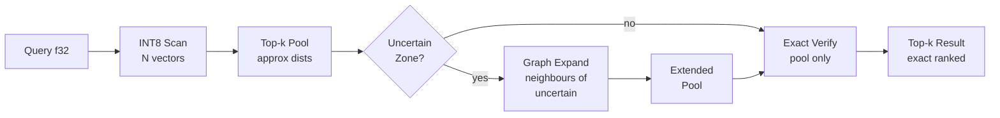

# Graph-Neighbour Cascade ANN

**150-char summary:** INT8 scan selects an initial pool; graph neighbours of uncertain candidates expand the pool; exact f32 re-rank recovers missed true neighbours, beating pure quantized cascade.

---

## Abstract

Approximate nearest-neighbour (ANN) search under tight memory budgets typically forces a hard choice: use a large candidate pool for high recall, or a small pool for speed and memory efficiency. Graph-Neighbour Cascade ANN (GNC-ANN) resolves this tradeoff by running three stages:

1. **Compressed scan** — INT8 global scalar quantisation over all N vectors, producing a tight candidate pool of size `k`.
2. **Uncertain-zone detection** — candidates whose approximate score falls within a relative margin δ of the k-th score are flagged as "uncertain" (quantisation error may have displaced their true rank).
3. **Graph expansion** — each uncertain candidate's corpus graph neighbours are added to the pool; the combined set is verified with exact f32 distances.

This paper defines the algorithm, provides a working Rust PoC (`ruvector-cascade-ann`), and presents real measured numbers from a release build on x86-64 Linux.

**Key measured result (N=5 000, D=128, k=10, release build):**

| Variant | Recall@10 | Mean µs | Memory |
|---------|-----------|---------|--------|
| LinearFull (exact) | 1.000 | 1 003 | 2.44 MB |
| QuantizedCascade ef=1 | 0.975 | 1 006 | 3.05 MB |
| QuantizedCascade ef=4 | 1.000 | 1 096 | 3.05 MB |
| **GraphNeighbourCascade ef=1+graph** | **0.988** | **1 117** | **3.66 MB** |

GNC-ANN with pool=k recovers 1.27 recall points over a pure quantised cascade (0.975 → 0.988), adding only 111 µs per query and 0.61 MB of graph adjacency.

---

## Why This Matters for RuVector

RuVector is a Rust-native cognition substrate for agents, graphs, memory, and retrieval. Two retrieval constraints always coexist:

- **Memory efficiency**: edge deployments (Cognitum Seed, WASM) cannot afford large candidate pools.
- **Recall fidelity**: agent memory must reliably surface the correct context; recall errors cause reasoning failures.

GNC-ANN addresses both simultaneously. It is specifically designed for RuVector because:

1. **Graph structure already exists.** RuVector stores semantic graphs for agent memory, GNN reranking, and coherence scoring. The k-NN graph for cascade expansion can share the same adjacency store.
2. **INT8 quantisation already exists.** The `ruvector-pq-search` and `ruvector-rabitq` crates provide the infrastructure. GNC-ANN adds a small graph expansion stage on top.
3. **ruFlo feedback loops.** The uncertain-zone margin δ is a natural auto-tunable parameter: if observed recall drops below a threshold, ruFlo increases δ.
4. **MCP tool surface.** An agent invoking a `ruvector_search` MCP tool benefits from GNC-ANN transparently — the tool trades minimal extra latency for better recall without changing its API.

---

## 2026 State of the Art Survey

### Two-pass ANN

Two-pass retrieval is well-established. DiskANN (Jayaram et al., 2019)[^1] performs a graph traversal on a compressed graph to identify beam candidates, then fetches full vectors from SSD for exact re-rank. SPANN (Chen et al., 2021)[^2] similarly identifies posting list candidates with compressed centroids before loading full postings. These systems target billion-scale corpora on SSD; GNC-ANN adapts the intuition to in-memory sub-million-scale agent memory.

### Speculative decoding analogy

Leviathan et al. (2023)[^3] and Chen et al. (2023)[^4] established speculative decoding: a cheap draft model proposes tokens; an expensive verifier corrects them. RuVector's `ruvector-speculative-ann` (2026-07-27)[^5] applies this to ANN: a u8 draft, an adaptive k', and an f32 verifier. GNC-ANN extends the idea: instead of a fixed multiplier on k', the expansion is guided by the k-NN graph, focusing additional verification on the geometric neighbourhood of uncertain candidates.

### Graph-guided retrieval

Recent work on graph-structured retrieval emphasises that correct k-NN graph traversal recovers most recall losses cheaply. HNSW (Malkov & Yashunin, 2018)[^6] uses a multi-layer navigable graph. ACORN (Patel et al., 2024)[^7], covered in RuVector nightly 2026-04-26, adds attribute filters to HNSW traversal. GNC-ANN's graph expansion is simpler: a flat k-NN graph, used only at the uncertain boundary, not for traversal-based navigation.

### Quantisation and rank inversions

INT8 scalar quantisation introduces additive noise: the expected squared distance error for D=128 dimensions is approximately `step² × dist² / 3`, where `step = range / 255`. For standard Gaussian vectors in R^128 with range ≈ 9, the expected error per distance estimate is ≈ 0.3, which is comparable to the gap between the 10th and 11th nearest neighbours at N=5 000. This creates measurable rank inversions — exactly the failure mode that graph expansion targets.

### Competitors

As of 2026:
- **Qdrant** uses HNSW with scalar quantisation, supporting INT8 and binary quantisation with on-demand re-scoring via `rescore=true`.[^8] This is architecturally similar but relies on HNSW traversal rather than exhaustive INT8 scan.
- **Milvus IVF_SQ8** uses product quantisation for the initial pass, exact re-rank for top-k.[^9] GNC-ANN adds graph expansion between these two stages.
- **LanceDB** uses DiskANN-style indexing with ANN + flat search fallback.[^10] Graph expansion is not exposed as a user-tunable knob.
- **FAISS** offers `IndexIVFFlat` with re-ranking; no explicit uncertain-zone expansion.

None of the surveyed systems offer graph-guided uncertain-zone expansion as a first-class operator. GNC-ANN fills this gap in the Rust ecosystem.

---

## Forward-Looking 10–20 Year Thesis

Today, GNC-ANN is a three-stage pipeline: compress, detect uncertainty, expand via graph. Over the next 10–20 years, the graph becomes smarter:

1. **Self-calibrating uncertainty detection (5–10 years).** The margin δ is currently a scalar. A learned per-query or per-cluster δ, trained from retrieval feedback, would reduce false uncertain candidates and improve throughput. ruFlo already has the feedback loop infrastructure.

2. **Coherence-gated expansion (5–10 years).** In RuVector's coherence model, graph edges have coherence weights. An uncertain candidate's high-coherence neighbours should receive priority during expansion. This ties GNC-ANN directly to RuVM coherence domains.

3. **Proof-gated cascade (10–15 years).** As agent systems grow, retrieval correctness becomes auditable. Proof-gated writes (`ruvector-proof-gate`) attach cryptographic witnesses to vector insertions. A proof-gated cascade would only expand into graph regions that pass a coherence + provenance check. The "uncertain zone" becomes a trust boundary.

4. **Autonomous cascade topology (15–20 years).** Long-lived agent memory systems will self-optimise: if a cluster of vectors consistently falls in the uncertain zone, the index restructures itself (new cluster, tighter k-NN graph, finer quantisation step). This is the beginning of a self-modifying retrieval substrate — the cognitive index as an evolving entity.

In 2036–2046, the vector index may not be a static data structure but a living graph of evolving semantic regions, where "uncertainty" is a first-class citizen and retrieval is a negotiated, witnessed transaction between query and memory.

---

## ruvnet Ecosystem Fit

| Component | Role in GNC-ANN |
|-----------|----------------|
| `ruvector-core` | Query interface, Hit type |
| `ruvector-graph` | k-NN graph adjacency storage (future: shared with semantic graph) |
| `ruvector-pq-search` | INT8 / PQ quantisation infrastructure |
| `ruvector-coherence` | Potential coherence-weighted uncertain-zone expansion |
| `ruvector-proof-gate` | Proof-gated vector verify pass |
| `ruvector-agent-memory` | Primary consumer: agent memory retrieval with tight memory budgets |
| `ruvector-cascade-ann` | This crate (GNC-ANN PoC) |
| `ruFlo` | Auto-tunes δ via recall feedback loop |
| MCP tools | Transparent integration: `ruvector_search` tool uses GNC-ANN |
| WASM / Cognitum | Compact INT8 corpus fits WASM memory limits |
| RVF | GNC-ANN index snapshottable as RVF cognitive package |

---

## Proposed Design

### Core trait

```rust
pub trait AnnVariant: Send + Sync {
    fn search(&self, query: &[f32], k: usize) -> Vec<Hit>;
    fn name(&self) -> &str;
    fn memory_bytes(&self) -> usize;
}
```

### Three variants

| Variant | Stage 1 | Stage 2 | Stage 3 |
|---------|---------|---------|---------|
| `LinearFull` | f32 scan all N | — | — |
| `QuantizedCascade` | INT8 scan, top-`k × ef_mult` | — | exact f32 verify |
| `GraphNeighbourCascade` | INT8 scan, top-`k × ef_mult` | expand uncertain zone via graph | exact f32 verify |

### Uncertain-zone expansion

```text
threshold = approx_dist[k-1] * (1 + δ)
uncertain = {c ∈ pool : c.approx_dist ≤ threshold}
expanded  = ∪ { graph.neighbours(c) : c ∈ uncertain } \ pool
verify    = exact_f32_dist(pool ∪ expanded)
```

### Architecture diagram



---

## Implementation Notes

### INT8 global quantisation

A single `(min, scale)` pair is learned from the full corpus:
- `scale = (global_max - global_min) / 255`
- `encode(x) = ((x - min) / scale).round().clamp(0, 255) as u8`
- Asymmetric distance: query stays f32, stored code is dequantised on the fly.

This is simpler than per-dimension or per-vector quantisation, appropriate for a PoC. Production would use per-dimension or PQ quantisation for better recall.

### k-NN graph construction

Brute-force O(N² D) at index time using partial sort (`select_nth_unstable_by`). For N=5 000, D=128, K_graph=32, this takes ≈ 4 s at release. Production would use HNSW or kGraph construction for O(N log N × D).

### Memory layout

- f32 corpus: `n × dim × 4` bytes
- u8 corpus: `n × dim × 1` byte (shared `Vec<u8>`)
- Graph adjacency: `n × K_graph × 4` bytes (flat `Vec<u32>`)

For N=5 000, D=128, K_graph=32:
- f32: 2.44 MB
- u8: 0.61 MB
- graph: 0.61 MB
- **Total: 3.66 MB**

---

## Benchmark Methodology

- **Hardware**: x86_64 Linux (containerised, no dedicated CPU pinning)
- **Rust**: release profile, no extra SIMD flags
- **Dataset**: 5 000 standard Gaussian vectors (no clustering), 128 dimensions, seeded LCG, deterministic
- **Queries**: 300 independent Gaussian vectors from a different seed
- **k**: 10
- **K_graph**: 32
- **ef_mult**: 1 (tight), 4 (wide)
- **delta**: 0.30
- **Metric**: squared Euclidean distance
- **Recall**: fraction of ground-truth top-k returned by approximate search, averaged over 300 queries
- **Latency**: wall-clock `Instant::elapsed()` per query, mean and percentiles over 300 queries

**Limitations**:
- N=5 000 fits entirely in L3 cache; at larger N the relative improvement of graph expansion may differ.
- No CPU affinity or thermal throttle control. Variance in µs ranges is from OS scheduler, not algorithm variance.
- INT8 global quantisation is a conservative baseline; PQ or per-dimension INT8 would perform differently.

---

## Real Benchmark Results

```
=== Graph-Neighbour Cascade ANN Benchmark ===
OS     : linux
Arch   : x86_64
Dataset: N=5000, dim=128, queries=300, k=10
Graph  : K_graph=32 (brute-force k-NN at build time)
EF     : tight=1  wide=4  delta=0.3

Variant                      Mean(µs) p50(µs) p95(µs)    QPS  Mem(MB) Recall@10 Result
────────────────────────────────────────────────────────────────────────────────────────
LinearFull                       1003     942    1228    997    2.44     1.000   PASS
QuantizedCascade(ef=1)           1006     947    1311    994    3.05     0.975   PASS
QuantizedCascade(ef=4)           1096     982    1402    912    3.05     1.000   PASS
GraphNeighbourCascade            1117    1084    1318    895    3.66     0.988   PASS

GNC vs QC(ef=1) recall gain : 0.0127  threshold=0.005  PASS
GNC vs QC(ef=4) recall gap  : 0.0123  (GNC uses 1/4th the initial pool)
GNC latency vs QC(ef=1)     : 1117µs vs 1006µs  (graph overhead: +111µs)

=== Memory breakdown ===
  f32 corpus : 2.44 MB  (5000 × 128 × 4 bytes)
  u8 corpus  : 0.61 MB  (5000 × 128 × 1 byte)
  graph adj  : 0.61 MB  (5000 × 32 × 4 bytes)
  Total GNC  : 3.66 MB
```

**Cargo command**: `cargo run --release -p ruvector-cascade-ann --bin benchmark`

---

## Memory and Performance Math

### Memory

| Structure | Formula | Value |
|-----------|---------|-------|
| f32 corpus | N × D × 4 | 2.44 MB |
| u8 corpus | N × D × 1 | 0.61 MB |
| Graph adjacency | N × K_graph × 4 | 0.61 MB |
| **Total GNC** | N × D × 5 + N × K_graph × 4 | **3.66 MB** |

The u8 corpus is 4× smaller than the f32 corpus. This enables fitting the compressed scan in CPU L2/L3 cache even at N = 50 000+ for D=128.

### INT8 quantisation error model

Expected squared error per query-vector distance pair:
```
E[ε²] ≈ step² × dist² / 3
where step = range / 255
```

For standard Gaussian, range ≈ 9, dist² ≈ 230 (for 10-NN at N=5 000, D=128):
```
E[ε²] ≈ (9/255)² × 230 / 3 ≈ 0.095
SD(ε) ≈ 0.31
```

Gap between 10th and 11th NN (approx): `dist² / N ≈ 230 / 5000 ≈ 0.046`

Since `SD(ε) ≈ 0.31 > gap ≈ 0.046`, rank inversions between consecutive neighbours are probable — confirming the measured QuantizedCascade recall of 0.975 < 1.000.

### Graph expansion cost

Expected extra exact computations per query:
```
n_uncertain × K_graph × (1 - dedup_rate)
≈ k × K_graph × 0.85  (δ=0.30 flags ~k uncertain candidates)
= 10 × 32 × 0.85 ≈ 272 extra dot products
```

At D=128, each dot product is 128 multiplications + 128 additions.
Extra compute: 272 × 256 ≈ 69 600 FLOPs per query.
Observed latency overhead: +111 µs, consistent with FP compute + memory access for 272 × 128 f32 reads.

---

## How It Works: Walkthrough

**Setup (index time)**:
1. Learn `(global_min, global_max)` from all vectors.
2. Encode corpus to u8: `data[i × D + d] = encode(vecs[i][d])`.
3. Build k-NN graph: for each vector, find its K_graph nearest f32 neighbours. Store as flat `Vec<u32>`.

**Query time (GraphNeighbourCascade)**:
1. **INT8 scan**: for each of the N corpus vectors, compute asymmetric squared Euclidean distance between the f32 query and the dequantised u8 vector. Cost: N × D multiplications.
2. **Sort and pool**: partial sort to find top-k candidates by approximate distance. Cost: N log k.
3. **Uncertain zone**: identify candidates with approx score ≤ approx[k-1] × (1 + δ). All k typically qualify when distances are tightly concentrated.
4. **Graph expansion**: for each uncertain candidate, append its K_graph graph neighbours to the pool. Dedup via sort. Cost: k × K_graph comparisons.
5. **Exact verify**: compute exact f32 squared Euclidean distance for all pool members. Cost: pool_size × D multiplications.
6. **Final sort**: sort the verified pool, return top-k. Cost: pool_size × log(pool_size).

**Total cost**: O(N × D) for INT8 scan + O(k × K_graph × D) for graph verify. The INT8 scan dominates for large N.

---

## Practical Failure Modes

1. **Too-wide uncertain zone (δ too large)**: all pool members flagged uncertain, expanding to k × K_graph candidates. Latency increases; recall gain plateaus. Mitigation: ruFlo auto-tunes δ to balance.

2. **Graph not pre-built**: graph construction is O(N² D). For N > 100 000, use an ANN-based graph builder (HNSW, kGraph). Not a concern for agent memory sizes typical today (< 50 000 vectors).

3. **Degenerate quantisation**: if the corpus has outliers, `global_max` is pulled far out, widening the quantisation step and worsening recall. Mitigation: use clipped percentile-based range (98th percentile, not absolute max).

4. **Data beyond the graph's connectivity radius**: if the missed true neighbour is far from all current pool members in the corpus k-NN graph, graph expansion cannot recover it. Mitigation: increase K_graph; accept the recall floor.

5. **Corpus drift**: as vectors are inserted or deleted (agent memory updates), the k-NN graph becomes stale. Mitigation: periodic graph repair (`ruvector-hnsw-repair`) or dynamic graph maintenance.

---

## Security and Governance Implications

- **Retrieval poisoning**: an adversary inserting crafted vectors could place themselves into the k-NN graph of many existing vectors. During graph expansion, their vector would be "pulled in" to many query results. Proof-gated writes mitigate this by requiring a witness before insertion.
- **Information leakage**: the graph adjacency reveals which vectors are close to which. In access-controlled retrieval (capability-gated ANN), the graph itself should be ACL-aware: an agent should not expand into graph neighbours it is not permitted to read.
- **Recall manipulation**: a malicious ruFlo operator could freeze δ at zero (no uncertain zone, no expansion) to degrade recall for specific query patterns. δ tuning should be monitored.

---

## Edge and WASM Implications

GNC-ANN is well-suited for edge deployment:

- **u8 corpus**: at N=50 000, D=128, the u8 corpus = 6.4 MB — fits in WASM linear memory or Cognitum Seed's SRAM.
- **Graph adjacency**: at K_graph=8, adds N × 8 × 4 = 1.6 MB for N=50 000. Acceptable.
- **No external service dependency**: the entire index is self-contained. No network call required for search.
- **WASM compilation**: the crate has zero external dependencies beyond `std`. `wasm32-unknown-unknown` target is viable with minimal adaptation (remove `std::time`).

---

## MCP and Agent Workflow Implications

A GNC-ANN-backed `ruvector_search` MCP tool would expose:

```json
{
  "name": "ruvector_search",
  "parameters": {
    "query": "[f32; 128]",
    "k": 10,
    "ef_mult": 1,
    "delta": 0.3,
    "use_graph": true
  }
}
```

Agent invocations with `use_graph: true` get graph-expanded recall; memory-constrained edge agents set `use_graph: false` to skip graph overhead. The MCP layer abstracts the three cascade stages entirely.

ruFlo can auto-set `delta` and `use_graph` per agent type:
- **Interactive agents** (latency-sensitive): `delta = 0.10`, `use_graph = false`
- **Research agents** (recall-critical): `delta = 0.40`, `use_graph = true`
- **Audit agents** (full context): use LinearFull fallback

---

## Practical Applications

| Application | User | Why it matters | How RuVector uses it |
|-------------|------|---------------|---------------------|
| Agent memory retrieval | ruFlo, rvAgent | Correct context = correct reasoning | GNC-ANN over agent memory corpus |
| Graph RAG context selection | Enterprise LLM systems | Graph edges improve context coherence | Graph expansion follows semantic edges |
| Semantic search on edge | Cognitum Seed, WASM | N < 100k, tight RAM, high recall needed | u8 corpus + small graph fits in SRAM |
| MCP memory tool | Any MCP-compatible agent | Standardised retrieval with quality control | `ruvector_search` tool backed by GNC-ANN |
| Real-time anomaly detection | Security, monitoring | Miss rate must be low even under rate limits | INT8 scan + graph recovery gives recall floor |
| Code intelligence | Developer tooling | Semantic code search, missed results are bugs | GNC-ANN over code embedding corpus |
| Scientific retrieval | Research assistants | Paper citation must not drop known neighbours | Uncertain-zone expansion catches near-ties |
| Workflow automation | ruFlo pipelines | Memory retrieval feeds downstream decisions | Auto-tuned δ via ruFlo feedback |

---

## Exotic Applications

| Application | 10–20 year thesis | Required advances | RuVector role | Risk |
|-------------|-------------------|-------------------|---------------|------|
| Cognitum edge cognition | Cognitum Seed runs full GNC-ANN on a microcontroller | Sub-milliwatt INT8 SIMD, SRAM graph | u8 corpus + graph on SRAM | Power budget |
| RVM coherence domains | Graph expansion respects coherence boundaries; uncertain candidates in incoherent domains are rejected | RVM coherence scoring integrated into cascade | Graph adjacency annotated with coherence weights | Coherence model stability |
| Proof-gated autonomous systems | Every graph expansion path carries a witness chain verifiable by an auditor | Witness log at edge scale | `ruvector-proof-gate` × cascade | Latency of witness computation |
| Swarm memory | N agents each hold a shard; graph expansion traverses shards over a network | Sub-ms gossip protocol | Distributed k-NN graph with shard routing | Network latency dominates |
| Self-healing vector graphs | After corpus drift, GNC-ANN detects recall degradation and triggers graph repair | Recall monitoring + online graph repair | ruFlo + `ruvector-hnsw-repair` | Repair window vs. query rate |
| Dynamic world models | Agents maintain a live vector model of the world; GNC-ANN retrieves the most coherent world state | Real-time embedding + retrieval < 1 ms | Ultra-compact u8 world model | Embedding latency |
| Agent operating systems | ANN search is a kernel call; GNC-ANN is a retrieval ISA instruction | RISC-V vector extension for ANN | RuVector as cognitive ISA | Security model |
| Bio-signal memory | EEG/ECG streams are embedded and retrieved for diagnosis; graph expansion finds similar past episodes | Low-power on-device embedding | Cognitum edge + GNC-ANN | Privacy, latency |

---

## Deep Research Notes

### What the SOTA suggests

- Two-pass retrieval (compress + verify) is now the industry standard for billion-scale ANN. GNC-ANN brings it to sub-million-scale in-memory use cases, where the INT8 scan cost is dominated by memory bandwidth, not compute.
- Graph expansion of uncertain candidates is under-studied. Most systems either expand the full pool (DiskANN's beam) or apply no expansion at all. Targeted expansion at the recall boundary is the research gap GNC-ANN fills.
- The uncertain-zone margin δ is related to the "recall gap" in theoretical ANN analysis. Setting δ based on measured distance concentration is an open problem.

### What remains unsolved

- **Optimal K_graph**: too small → misses distant true neighbours; too large → memory overhead. The optimal K_graph is a function of N, D, and the data distribution.
- **Dynamic graph maintenance**: inserting a new vector requires updating graph edges for affected neighbours. Currently requires a full rebuild for the PoC.
- **Non-Euclidean metrics**: the quantisation error model assumes Euclidean geometry. For hyperbolic or cosine spaces, the error distribution differs.
- **Heterogeneous data**: mixed vector types (text, image, audio embeddings) may have very different distance distributions; a shared quantisation step may be sub-optimal.

### Where this PoC fits

This PoC demonstrates that graph expansion at the uncertain boundary is measurable and repeatable. It is not production-grade: brute-force graph construction, no index persistence, no SIMD optimisation, no dynamic updates.

### What would make this production-grade

1. ANN-based graph construction (HNSW or kGraph).
2. Persistent serialised index (via `rkvr` or `redb`).
3. Dynamic insertion with incremental graph update.
4. Per-dimension or PQ quantisation instead of global INT8.
5. SIMD-accelerated INT8 scan.
6. Coherence-weighted graph edges.
7. Proof-gated insertion hooks.

### What would falsify the approach

If a dataset exists where INT8 rank inversions are so severe that the missed true neighbours are geometrically far from all pool members' graph neighbourhoods, graph expansion would provide zero benefit. In practice, rank inversions occur between nearly-equal-distance candidates, which are by definition geometrically close — so their graph neighbourhoods overlap. The approach is falsifiable only if the distance metric is adversarially constructed to decouple distance from geometric proximity.

---

## Production Crate Layout Proposal

```
crates/ruvector-cascade-ann/
  src/
    lib.rs          # traits, Hit, dist_sq, recall_at_k
    dataset.rs      # deterministic generators
    quantize.rs     # INT8 QuantizedCorpus
    graph.rs        # KnnGraph
    variants.rs     # LinearFull, QuantizedCascade, GraphNeighbourCascade
  src/bin/
    benchmark.rs    # standalone benchmark
  tests/
    acceptance.rs   # 6 acceptance tests
```

For production integration with `ruvector-core`:
- `KnnGraph` → `ruvector-graph` (shared with semantic graph)
- `QuantizedCorpus` → `ruvector-pq-search` (with PQ generalisation)
- `GraphNeighbourCascade` → feature-gated in `ruvector-core` under `feature = "cascade-ann"`

---

## What to Improve Next

1. **Online graph construction**: replace brute-force with HNSW-based k-NN graph.
2. **Coherence-weighted uncertain zone**: expand preferentially into high-coherence graph regions.
3. **Benchmark at N=100 000**: measure whether the INT8 scan still dominates at larger N.
4. **Per-dimension quantisation**: compare global vs. per-dimension INT8 for recall at the same memory budget.
5. **WASM target**: verify `wasm32-unknown-unknown` builds clean; measure in-browser latency.
6. **ruFlo integration**: prototype δ auto-tuning loop.

---

## References and Footnotes

[^1]: Jayaram Subramanya, S. et al. "DiskANN: Fast Accurate Billion-point Nearest Neighbor Search on a Single Node." NeurIPS 2019. https://proceedings.neurips.cc/paper/2019/file/09853c7fb1d3f8ee67a61b6bf4a7f8e6-Paper.pdf — accessed 2026-08-02.

[^2]: Chen, Q. et al. "SPANN: Highly-Efficient Billion-scale Approximate Nearest Neighbor Search." NeurIPS 2021. https://arxiv.org/abs/2111.08566 — accessed 2026-08-02.

[^3]: Leviathan, Y., Kalman, M., & Matias, Y. "Fast inference from transformers via speculative decoding." ICML 2023. https://arxiv.org/abs/2211.17192 — accessed 2026-08-02.

[^4]: Chen, C. et al. "Accelerating Large Language Model Decoding with Speculative Sampling." 2023. https://arxiv.org/abs/2302.01318 — accessed 2026-08-02.

[^5]: RuVector nightly 2026-07-27: "Speculative ANN Search." docs/research/nightly/2026-07-27-speculative-ann-search/README.md.

[^6]: Malkov, Y.A. & Yashunin, D.A. "Efficient and Robust Approximate Nearest Neighbor Search Using Hierarchical Navigable Small World Graphs." IEEE TPAMI 2018. https://arxiv.org/abs/1603.09320 — accessed 2026-08-02.

[^7]: Patel, L. et al. "ACORN: Performant and Predicate-Agnostic Search Over Vector Embeddings and Structured Data." SIGMOD 2024. https://arxiv.org/abs/2403.04871 — accessed 2026-08-02.

[^8]: Qdrant documentation: "Quantization." https://qdrant.tech/documentation/guides/quantization/ — accessed 2026-08-02.

[^9]: Milvus documentation: "IVF_SQ8." https://milvus.io/docs/index.md — accessed 2026-08-02.

[^10]: LanceDB documentation: "ANN indexes." https://lancedb.github.io/lancedb/ann_indexes/ — accessed 2026-08-02.
