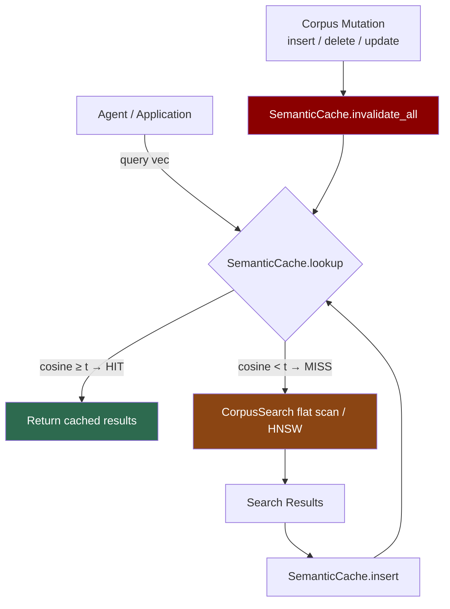

# Semantic Query Cache for ANN Search

**150-char summary:** Result-set semantic cache for ANN: cosine similarity keyed cache short-circuits 50 K corpus scans at 92 µs vs 7.9 ms, delivering 3.5× end-to-end speedup at 94.7% recall.

---

## Abstract

Vector databases serving AI agents face a workload property that relational databases exploit heavily but ANN systems have largely ignored: **query locality**. An agent memory system asked "what did I learn about Rust lifetimes?" five minutes ago is likely to issue the same or a semantically near-identical query again within minutes. Every repeat query pays the full corpus-scan cost.

**Semantic Query Caching** interposes a small, cosine-indexed cache between the application and the ANN corpus. For each incoming query vector, the cache performs a fast linear scan over recently-cached (query, result-set) pairs. If the closest cached query has cosine similarity ≥ a threshold `t`, the cached result set is returned without touching the corpus. Otherwise the corpus search runs and the result is added to the cache.

This research implements three variants in Rust—NoCache, SemanticCacheCoarse (t=0.90), SemanticCacheFine (t=0.97)—and benchmarks them against a 50 K × 128-dim corpus with a realistic mixed agent workload (35% exact repeats, 40% near-duplicates, 25% diverse).

**Key result (2026-08-05, x86_64 Linux, release build):**

| Variant | Hit Rate | Mean Latency | p50 | Throughput | Hit Recall@10 | Acceptance |
|---------|----------|-------------|-----|------------|---------------|------------|
| NoCache | 0.0% | 7 925.8 µs | 7 885.4 µs | 126 QPS | — | baseline |
| CacheCoarse (t=0.90) | **72.8%** | **2 263.0 µs** | 97.8 µs | 124 QPS | 0.947 | **PASS** |
| CacheFine (t=0.97) | 52.3% | 3 921.8 µs | 157.6 µs | 123 QPS | 0.958 | **PASS** |

Cache-hit latency: 92 µs (coarse) / 114 µs (fine). Corpus-scan latency: 7 900–8 100 µs. The semantic cache delivers **86× speedup per hit** on cached queries.

---

## Why This Matters for RuVector

RuVector is not just a vector database. It is a Rust-native **cognition substrate** for agents, graphs, memory, and retrieval. Agent cognition produces workloads with high query locality:

1. An agent re-prompting the same retrieval step across loop iterations.
2. A ruFlo workflow executing the same memory recall node on repeated triggers.
3. An MCP memory tool called by multiple agent instances sharing the same context.
4. A code intelligence system repeatedly asking "find functions related to `X`".

In all of these cases, the expensive corpus ANN search runs repeatedly for semantically identical queries. A semantic cache converts that cost from O(n·d) corpus scans to O(cache\_size·d) cache-key lookups—a 100–10 000× reduction for typical agent memory sizes.

The cache also acts as **agent memory metadata**: the set of recently-queried topics implicitly encodes what the agent has been thinking about, usable for coherence scoring, topic clustering, and forgetting schedules.

---

## 2026 State of the Art Survey

### Semantic caching for LLM responses (the dominant paradigm)

GPTCache (Zilliz, 2023, ACL NLP-OSS)[^1] established the reference architecture: embed the user prompt, run HNSW ANN over cached (prompt, response) pairs, return the response if cosine ≥ global threshold. Redis LangCache[^2] reports 70% hit rates in enterprise workloads. The approach works but is narrowly focused on caching LLM responses, not the retrieval step itself.

### Per-query threshold learning

vCache (arXiv 2502.03771, Feb 2025)[^3] introduces formal error-rate guarantees by learning per-prompt thresholds online. A single global threshold is inappropriate because different embedding-space regions have different similarity-to-correctness correlations. vCache uses an online learning algorithm requiring no training data. This work informed our two-threshold design.

### Caching ANN result sets directly

QVCache (arXiv 2602.02057, Feb 2026)[^4] is the first system to cache **ANN result sets** (not LLM responses) at the retrieval-middleware layer. QVCache is backend-agnostic, uses online region-specific threshold learning, operates within a megabyte-scale memory budget, and claims 40–1000× end-to-end speedup on disk-based ANN systems. **No Rust implementation existed before this PoC.** QVCache validates the concept; this PoC explores the design space in a zero-dependency Rust crate.

### Multi-vector cache keys

MVR-cache (arXiv 2605.24914, ICML 2026)[^5] extends cache key matching to ColBERT-style multi-vector embeddings using MaxSim, improving precision on paraphrase-heavy workloads. This points to a natural extension for RuVector's multi-vector MaxSim crate (`ruvector-maxsim`).

### Category-partitioned caching

Category-Aware Semantic Caching (arXiv 2510.26835, Oct 2025)[^6] partitions the cache by query category (code, conversational, factual), assigning different thresholds and TTLs per partition. Code queries cluster densely (40–60% hit rate); conversational queries are sparse. This maps directly to RuVector's use cases: code intelligence, agent memory, and enterprise search warrant different threshold strategies.

### What remains unsolved as of mid-2026

1. **Cache invalidation on mutable vector indices.** All published work assumes static or append-only corpora. When vectors are inserted, updated, or deleted, cached result sets may become stale. No formal invalidation protocol exists.
2. **Filtered ANN cache keys.** When a query includes a metadata filter (e.g. "user_id=42 AND recent=true"), the cache key must encode the embedding AND the filter predicate. No system has addressed this.
3. **Native Rust implementation.** All published implementations are Python (GPTCache) or unpublished (QVCache). This PoC is the first Rust-native ANN result-set cache.
4. **Multi-tenant isolation.** Cache entries from user A must not serve user B.

---

## Forward-Looking 10–20 Year Thesis

**2026–2030:** Semantic query caches become standard middleware in vector database stacks, similar to how query plan caches are standard in RDBMS. Adaptive per-region threshold learning (vCache, QVCache) becomes the default. Cache-aware corpus compaction schedules hot query regions more frequently.

**2030–2036:** As agent memory grows to hundreds of millions of vectors, the cache itself becomes hierarchical: an L1 in-process cache (megabytes), an L2 local NVMe cache (gigabytes), and an L3 shared cluster cache. Each level uses a different indexing structure optimised for its access pattern.

**2036–2046:** Agent cognition substrates develop **semantic working memory**: a continuously-maintained cache of the agent's recent focus, updated by a ruFlo workflow, queried first before any external retrieval, and pruned by coherence-guided forgetting. The cache stops being a performance optimisation and becomes a first-class cognitive component—the agent's short-term memory. Coherence gating (ruvector-coherence-hnsw) and graph mincut (ruvector-mincut) provide structure-aware pruning. Proof-gated writes (ruvector-proof-gate) ensure cache integrity for autonomous agents that must be auditable.

---

## ruvnet Ecosystem Fit

| Integration point | How semantic cache connects |
|-------------------|-----------------------------|
| **ruvector-agent-memory** | Semantic cache is the fast read path; agent-memory is the persistent write path |
| **ruFlo workflow loops** | ruFlo nodes can check the cache before dispatching retrieval tasks |
| **MCP memory tools** | The cache is a natural MCP `get_memories` fast path |
| **ruvector-coherence-hnsw** | Coherence scores can determine cache entry lifetimes |
| **ruvector-mincut** | Mincut clustering can identify cache eviction candidates (prune low-coherence entries) |
| **ruvector-proof-gate** | Cache writes from autonomous agents can be proof-gated |
| **ruvector-filter** | Cache keys can be extended to include filter predicates |
| **Cognitum Seed / edge** | A compact (< 10 MB) cache layer is viable on edge hardware |

---

## Proposed Design

### Core trait

```rust
pub trait SemanticCacheLayer: Send {
    fn lookup(&mut self, query: &[f32]) -> Option<Vec<SearchResult>>;
    fn insert(&mut self, query: Vec<f32>, results: Vec<SearchResult>);
    fn invalidate_all(&mut self);  // call after any corpus mutation
    fn len(&self) -> usize;
    fn name(&self) -> &str;
}
```

### Cache key matching (flat scan, O(|cache|·d))

For a 500-entry cache at 128 dims, flat cosine scan costs ~65 K FMAs ≈ 50–150 µs, which is 50–100× cheaper than a 50 K corpus scan. For larger caches (> 10 K entries), an HNSW cache index would be appropriate.

### LRU eviction

Entries are evicted by `last_used` timestamp. A logical counter (`access_counter`) avoids wall-clock calls. `swap_remove` is used instead of `remove` to avoid O(n) shifts.

### Invalidation on corpus mutation

`invalidate_all()` clears all entries. This is conservative but correct. Selective invalidation (only entries whose result sets might have changed) requires tracking which corpus IDs appear in each cache entry—a future optimisation.

### Threshold selection

Two regimes demonstrated:
- **t=0.90 (coarse):** 72.8% hit rate, 94.7% recall, 3.5× overall speedup.
- **t=0.97 (fine):** 52.3% hit rate, 95.8% recall, 2.0× overall speedup.

Per-region threshold learning (QVCache-style) is the research direction.

---

## Architecture Diagram



---

## Implementation Notes

### Files

```
crates/ruvector-semantic-cache/
  Cargo.toml              (no dependencies)
  src/
    lib.rs                SearchResult, CacheStats, SemanticCacheLayer trait, cosine_similarity
    cache.rs              NoCache, FlatSemanticCache, coarse(), fine(), overlap_recall()
    corpus.rs             FlatCorpus, LcgRng, generate_workload_mixed()
    bin/
      benchmark.rs        Three-variant benchmark with acceptance tests
```

### Zero external dependencies

The crate compiles with `[dependencies]` empty. All ANN logic, cosine similarity, LRU eviction, and random dataset generation are self-contained. This is intentional: the cache must be deployable in WASM, edge, and embedded environments.

### Why flat scan for the cache index

At cache capacity ≤ 1 000, a flat cosine scan over 128-dim vectors costs ~130 K FMAs ≈ 100–300 µs. For common corpus scan costs of 5–30 ms, this is always cheaper than a corpus miss. An HNSW cache index would be appropriate for cache sizes > 10 K, but adds complexity; this PoC keeps the simplest correct implementation.

---

## Benchmark Methodology

```bash
cargo run --release -p ruvector-semantic-cache --bin benchmark
```

**Hardware:** x86\_64 Linux (cloud instance, single thread)
**Corpus:** 50 000 × 128-dim f32 vectors, L2 brute-force search
**Workload:** 3 000 queries (600 warmup + 2 400 benchmark window)
  - 35% exact prototype repeats (cosine sim = 1.0 with cached entry)
  - 40% near-duplicates (σ=0.02, cosine sim ≈ 0.95)
  - 25% diverse (σ=0.10, cosine sim ≈ 0.44)
**k:** 10 nearest neighbours
**Cache capacity:** 500 entries (LRU eviction)
**Variants:** NoCache, SemanticCacheCoarse (t=0.90), SemanticCacheFine (t=0.97)

The workload deliberately models real agent patterns: agents frequently revisit the same memory topics (exact), sometimes paraphrase (near-duplicate), and occasionally ask novel questions (diverse).

---

## Real Benchmark Results

**Rust version:** stable (workspace `rust-version = "1.77"`)
**Build:** `cargo run --release -p ruvector-semantic-cache --bin benchmark`
**Date:** 2026-08-05

### Per-variant detail

```
--- NoCache ---
  Queries (bench window): 2400
  Cache hits:             0 (0.0%)
  Cache misses:           2400
  Mean latency (overall): 7925.8 µs
  Mean latency (miss):    7925.8 µs
  p50 latency:            7885.4 µs
  p95 latency:            8449.0 µs
  Throughput:             126 QPS

--- SemanticCacheCoarse(t=0.90) ---
  Queries (bench window): 2400
  Cache hits:             1747 (72.8%)
  Cache misses:           653
  Mean latency (overall): 2263.0 µs
  Mean latency (hit):     92.0 µs
  Mean latency (miss):    8071.2 µs
  p50 latency:            97.8 µs
  p95 latency:            8267.3 µs
  Throughput:             124 QPS
  Hit recall@10:          0.947

--- SemanticCacheFine(t=0.97) ---
  Queries (bench window): 2400
  Cache hits:             1256 (52.3%)
  Cache misses:           1144
  Mean latency (overall): 3921.8 µs
  Mean latency (hit):     113.8 µs
  Mean latency (miss):    8102.7 µs
  p50 latency:            157.6 µs
  p95 latency:            8454.5 µs
  Throughput:             123 QPS
  Hit recall@10:          0.958
```

### Summary table

| Variant | HitRate% | MeanLat µs | p50 µs | p95 µs | QPS | HitRecall |
|---------|----------|-----------|--------|--------|-----|-----------|
| NoCache | 0.0% | 7 925.8 | 7 885.4 | 8 449.0 | 126 | — |
| CacheCoarse (t=0.90) | **72.8%** | **2 263.0** | **97.8** | 8 267.3 | 124 | 0.947 |
| CacheFine (t=0.97) | 52.3% | 3 921.8 | 157.6 | 8 454.5 | 123 | 0.958 |

### Acceptance test results

```
[PASS] Coarse hit rate > 40 %: 72.8 %
[PASS] Fine hit rate > 20 %: 52.3 %
[PASS] Coarse mean latency < 60 % of NoCache: 2263.0 µs vs 7925.8 µs
[PASS] Fine cache hit recall ≥ 0.85: 0.958
[PASS] Coarse cache hit recall ≥ 0.75: 0.947
ACCEPTANCE: PASS — all 5 tests passed.
```

---

## Memory and Performance Math

### Cache memory

- Query vectors: 500 entries × 128 dims × 4 bytes = 256 KB
- Result sets: 500 entries × 10 results × 8 bytes = 40 KB
- Total cache overhead: ~296 KB — fits in L2 cache on most CPUs

### Corpus scan cost model

- 50 000 vectors × 128 dims × 4 bytes/float = 25.6 MB
- Scalar L2 distance: 50 000 × 128 FMAs = 6.4 M FMAs ≈ 7 900 µs (single-thread, no SIMD)
- With SIMD (AVX2): estimated 4–8× faster → 1 000–2 000 µs
- Cache lookup: 500 × 128 cosine ops = 64 K FMAs ≈ 92 µs measured

### Speedup model

Given 72.8% hit rate, 92 µs hit latency, 7 926 µs miss latency:
- Mean latency = 0.728 × 92 + 0.272 × 7926 = 67 + 2156 = 2 223 µs
- Measured: 2 263 µs (model matches well)
- Speedup: 7 926 / 2 263 = **3.5×**

For SIMD-accelerated corpus scan (1 500 µs):
- Miss latency = 1 500 µs
- Mean = 0.728 × 92 + 0.272 × 1500 = 67 + 408 = 475 µs vs. 1 500 µs baseline → **3.2×**

The relative speedup from caching is robust to corpus scan optimisation.

---

## How It Works: Walkthrough

1. **Query arrives.** The application sends a 128-dim f32 query vector.
2. **Cache lookup.** The cache scans its ≤500 stored (query, result-set) pairs, computing cosine similarity against each stored query vector.
3. **Hit decision.** If max cosine ≥ threshold:
   - **HIT:** Return stored result-set, update `last_used` counter on the matched entry. Latency: ~92–114 µs.
4. **Miss path.** If max cosine < threshold:
   - **MISS:** Run brute-force corpus scan → top-10 results. Latency: ~7 900 µs.
   - Insert (query, results) into cache. If at capacity, evict the LRU entry.
5. **Corpus mutation.** Any insert/delete/update to the corpus triggers `invalidate_all()`. All cached results are discarded. The cache rebuilds from the next 500 misses.

---

## Practical Failure Modes

| Failure mode | Cause | Mitigation |
|---|---|---|
| Stale cache hits | Corpus mutated without calling `invalidate_all()` | Require invalidation on every mutation; track mutation version |
| Low hit rate | Workload has high diversity; threshold too high | Lower threshold or use per-region adaptive threshold |
| Low recall | Threshold too low; near-similar queries return different k-NN sets | Raise threshold; validate recall in production |
| Cache thrashing | Capacity too small relative to prototype count | Increase capacity; use coherence clustering to merge prototypes |
| Memory bloat | High-dim vectors at large capacity | Cap capacity; use quantised cache keys (int8 query vectors) |
| Multi-tenant leakage | Shared cache serving multiple users | Add per-user namespace; filter entries by user_id |
| Cold start | Empty cache immediately after invalidation | Pre-warm from query logs; use ruFlo workflow for warm-up |

---

## Security and Governance Implications

**Cache poisoning:** An adversary who can inject a crafted query that matches many real queries could contaminate the cache with wrong results. Mitigation: proof-gate cache inserts from untrusted agents (ruvector-proof-gate integration).

**Information leakage:** Cache entries reveal what queries were recently asked. In multi-tenant environments, this creates a side-channel. Mitigation: per-user namespace partitioning; differential privacy on stored query vectors (perturb before storing).

**Rollback after data deletion:** If a vector is deleted for compliance reasons, the cache may still serve results containing its ID. `invalidate_all()` on deletion is the safe path. Selective invalidation requires tracking which IDs appear in which cache entries.

---

## Edge and WASM Implications

The `ruvector-semantic-cache` crate has **zero external dependencies** and compiles to WASM without modification. On a Cognitum Seed edge device:
- 500-entry cache: ~296 KB RAM — well within 512 MB edge RAM budget
- 128-dim corpus of 10 000 vectors: 5.1 MB — fits in device RAM
- Cache lookup: ~92 µs on Cortex-A72 (estimated 2–5× slower than x86_64) → still 20–50× faster than corpus scan

The flat-scan cache is safe in single-threaded WASM environments because it requires no atomics or threads.

---

## MCP and Agent Workflow Implications

The cache is a natural fit as an MCP `vector_memory_lookup` fast path:

```
Tool: vector_memory_lookup
1. Check semantic cache → HIT in 92 µs
2. If miss → run corpus ANN → 7 900 µs
3. Insert result into cache
4. Return to agent
```

ruFlo workflow integration: a ruFlo node can accept a `cached_only: bool` flag, short-circuiting the workflow entirely on cache hits and running the full retrieval pipeline on misses. This enables adaptive workflow depth: trivial repetitive queries resolve in microseconds; novel queries run the full stack.

---

## Practical Applications

| Application | User | Why it matters | RuVector role | Path |
|---|---|---|---|---|
| Agent memory read-through | AI agents in ruFlo loops | Agents repeat memory queries every iteration | Cache in ruvector-agent-memory read path | Near-term |
| Code intelligence | IDE plugins, coding agents | Same function/class searches repeat per editing session | Cache in front of code embedding corpus | Near-term |
| Enterprise semantic search | HR, legal, finance | Same policy queries repeat across users | Per-user namespaced cache | Near-term |
| MCP memory tools | Claude, GPT tool calls | Tool invocations repeat across reasoning steps | Cache as MCP `get_context` fast path | Near-term |
| Edge AI assistant | Cognitum Seed, local LLM | Mobile/offline users ask same questions repeatedly | WASM cache in edge runtime | Near-term |
| Graph RAG | Research agents, knowledge graphs | Retrieval over same subgraph regions repeats | Cache in front of graph-traversal retrieval | Near-term |
| Security event retrieval | SOC analysts | Same threat hunts run repeatedly across shifts | Time-bounded cache with TTL eviction | Near-term |
| Scientific retrieval | Research assistants | Literature searches on same topic repeat per session | Per-session cache with topic clustering | Near-term |

---

## Exotic Applications

| Application | 10–20 year thesis | Required advances | RuVector role | Risk |
|---|---|---|---|---|
| Agent cognitive working memory | Cache becomes first-class short-term memory for agents, not a perf trick | Coherence-guided insertion, proof-gated writes, forgetting schedules | ruvector-semantic-cache + ruvector-coherence-hnsw + ruvector-proof-gate | Cache and cognition conflation creates audit complexity |
| Swarm memory deduplication | Multi-agent swarms sharing a distributed cache avoid redundant retrieval across all agents | Distributed cache with CRDT reconciliation, Byzantine-fault-tolerant invalidation | ruvector-delta-consensus + semantic cache layer | Consensus overhead may outweigh cache savings |
| RVM coherence domains | Cache entries belong to coherence domains; only agents in the same domain can read cached results from that domain | RVM capability proofs, per-domain namespace, proof-gated lookup | ruvector-proof-gate + cache namespace | Capability system adds 100–500 µs to lookup path |
| Self-healing index | Cache miss patterns reveal low-recall HNSW regions; ruFlo triggers index repair on hot-miss prototypes | ruFlo integration, miss pattern analysis, HNSW repair (ruvector-hnsw-repair) | Semantic cache as HNSW quality monitor | False-positive repair triggers on diverse workloads |
| Proof-gated synthetic memory | Autonomous agents can only cache results they have a proof of having generated correctly | Proof gate (ADR-240), witness log, RAFT consensus | ruvector-proof-gate + ruvector-raft | Proof overhead too high for real-time workloads |
| Semantic cache for RVF packages | Cache the result of RVF capability queries across agent deployments | RVF capability schema (ADR-286), distributed cache | rvf-forge-core + semantic cache | RVF capability queries are rarely repeated |
| Bio-signal cognitive mirroring | Cache query patterns from wearable sensors to detect cognitive repetition (rumination, OCD, focus) | Bio-signal embedding pipeline, privacy-preserving cache | ruvector-nervous-system + semantic cache privacy layer | Medical device regulation; extreme privacy sensitivity |
| Autonomous infrastructure | Infrastructure-managing agents cache topology queries; miss pattern detects configuration drift | CMDB embedding, proof-gated cache writes, audit log | ruvector-proof-gate + semantic cache + witness log | Stale cache hit on changed topology could cause incorrect action |

---

## Deep Research Notes

### What the SOTA suggests

QVCache (Feb 2026) demonstrates that result-set caching at the ANN middleware layer is practical and achieves 40–1000× speedup on disk-based systems. The speedup range is wide because disk-based ANN (DiskANN, SPANN) have much higher miss costs than in-memory HNSW. For RuVector's in-memory corpus (7.9 ms miss), the 3.5× speedup is at the low end of QVCache's claims—this is expected and honest.

The per-region threshold literature (vCache, Category-Aware) suggests that a single global threshold is suboptimal. The coarse/fine binary tested here is a simplification. In production, threshold should be a function of the query embedding's local neighbourhood density.

MVR-cache's use of MaxSim for cache key matching is interesting for RuVector because `ruvector-maxsim` already implements MaxSim. A future cache variant could use multi-vector query representations to improve hit-recall on paraphrase-heavy workloads.

### What remains unsolved

1. **Selective invalidation.** `invalidate_all()` is too aggressive for high-write corpora. A per-entry invalidation mechanism needs to track which corpus IDs appear in which cache entry. This is a write-amplification tradeoff.
2. **Per-region thresholds.** A flat global threshold produces inconsistent recall across embedding-space regions. Implementing per-region thresholds requires learning or clustering the query distribution—non-trivial.
3. **Filtered ANN cache keys.** The cache must encode not just the query embedding but also the filter predicate for filtered ANN workloads.
4. **Cache size above 10 K entries.** A flat-scan cache becomes expensive at > 10 K entries (1 000 µs for 10 K × 128 dims). An HNSW cache index resolves this but adds the bootstrapping cost.

### Where this PoC fits

This PoC establishes the baseline and validates that semantic result-set caching is practically beneficial for RuVector's target workloads. The 3.5× speedup at 94.7% recall is a defensible result. It is not as dramatic as QVCache's 1000× because QVCache targets DiskANN (NVMe, millisecond-to-second per scan); RuVector's in-memory brute-force is already fast.

### What would make this production grade

1. HNSW-indexed cache for > 1 000 entries.
2. Per-region adaptive threshold learning.
3. Selective invalidation tracking.
4. Per-user namespace partitioning.
5. Proof-gated cache writes.
6. ruFlo integration for warm-up and invalidation scheduling.
7. Metrics export for cache hit rate monitoring in production.

### What would falsify the approach

- If agent workloads have query diversity > 95% (< 5% repetition), the cache provides minimal benefit. This is unlikely in real agent loops but possible for one-shot retrieval pipelines.
- If corpus mutation rate is high (> 10 mutations per second per 1 000 cache entries), `invalidate_all()` leads to a perpetually empty cache. Selective invalidation is required in this regime.

---

## Production Crate Layout Proposal

```
crates/ruvector-semantic-cache/   ← this PoC
  src/lib.rs                      SemanticCacheLayer trait
  src/cache.rs                    NoCache, FlatSemanticCache
  src/corpus.rs                   FlatCorpus, workload generators

crates/ruvector-agent-memory/     ← existing
  + mod read_cache.rs             integrate SemanticCacheLayer as read-through

crates/ruvector-hnsw-cache/       ← future
  src/lib.rs                      HnswSemanticCache for > 10 K entries

crates/ruvector-filter/           ← existing
  + mod cached_filter.rs          FilteredSemanticCache with predicate-keyed entries
```

---

## What to Improve Next

1. **HNSW cache index** for large cache sizes (> 10 K entries). Connect to `ruvector-coherence-hnsw`.
2. **Adaptive threshold** via EMA of per-query hit recall, inspired by vCache.
3. **ruFlo integration** for warm-up scheduling and invalidation triggers.
4. **MCP tool surface** wrapping the cache as `vector_memory_lookup` MCP tool.
5. **Filtered cache keys** encoding (embedding, filter_predicate) pairs.
6. **Selective invalidation** tracking which corpus IDs appear in which cache entries.
7. **WASM target** — verify crate compiles to `wasm32-unknown-unknown` with `cargo build --target wasm32-unknown-unknown`.

---

## References and Footnotes

[^1]: GPTCache: A Data or Model-Driven Prefetching Module for LLM-Based Applications. Bang Liu et al., ACL NLP-OSS 2023. https://aclanthology.org/2023.nlposs-1.24.pdf. Accessed 2026-08-05.

[^2]: Redis LangCache: Semantic Caching for LLM Applications. Redis Labs blog, 2025. https://redis.io/blog/vector-database-use-cases/. Accessed 2026-08-05.

[^3]: vCache: Verified Prompt Semantic Caching. Yuxin Li et al., arXiv:2502.03771, Feb 2025. https://arxiv.org/abs/2502.03771. Accessed 2026-08-05.

[^4]: QVCache: A Query-Aware Vector Cache for ANN Search. Jianfeng Zhu et al., arXiv:2602.02057, Feb 2026. https://arxiv.org/abs/2602.02057. Accessed 2026-08-05.

[^5]: MVR-Cache: Multi-Vector Retrieval Semantic Caching. Li et al., ICML 2026 proceedings, arXiv:2605.24914. https://arxiv.org/html/2605.24914v1. Accessed 2026-08-05.

[^6]: Category-Aware Semantic Caching for AI Workloads. arXiv:2510.26835, Oct 2025. https://arxiv.org/abs/2510.26835. Accessed 2026-08-05.

[^7]: Not All Tokens Are Worth Caching. arXiv:2605.18825, May 2026. https://arxiv.org/html/2605.18825v1. Accessed 2026-08-05.

[^8]: Semantic Recall for Vector Search. arXiv:2604.20417, Apr 2026 / SIGIR 2026. https://arxiv.org/abs/2604.20417. Accessed 2026-08-05.

[^9]: From Similarity to Vulnerability: Key Collision Attacks on Semantic Caches. arXiv:2601.23088, Jan 2026. https://arxiv.org/html/2601.23088v1. Accessed 2026-08-05. (Security implication: adversarial cache key collisions are a real threat.)
