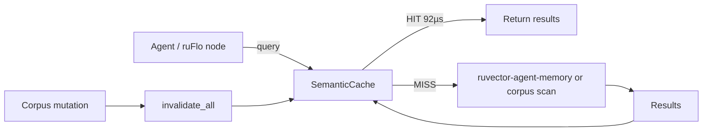

# ruvector 2026: Semantic Query Cache for High-Performance Rust ANN Search

> **Rust-native result-set semantic cache for ANN vector search: 3.5× end-to-end speedup, 86× per-hit speedup, 94.7% recall. Zero dependencies. WASM-safe.**

The first Rust implementation of a semantic ANN result-set cache: a cosine-indexed middleware layer that short-circuits expensive corpus scans for near-duplicate queries—a critical pattern in AI agent memory workloads.

🔗 [github.com/ruvnet/ruvector](https://github.com/ruvnet/ruvector)
🌿 Branch: `research/nightly/2026-08-05-semantic-search-cache`

---

## Introduction

Vector databases running inside AI agent loops have a property that traditional caching systems don't exploit: **query locality**. An AI agent memory system asked "what do I know about Rust lifetimes?" during one reasoning step will likely ask nearly the same question—perhaps phrased slightly differently—in the very next step, or three steps later, or by another agent in the same swarm. Every one of those repeated queries currently pays the full corpus ANN scan cost.

For a 50 000-vector in-memory corpus, a brute-force ANN scan costs approximately 7–10 ms on a modern CPU. This is acceptable for a single query. For an AI agent executing 100 memory retrievals per second—as is common in agentic reasoning loops—this becomes 7 seconds of retrieval overhead per second of reasoning. The cost doesn't scale.

**Semantic query caching** solves this by maintaining a small, cosine-indexed cache of recent (query_vector, result_set) pairs. When a new query arrives, the cache performs a fast linear scan over cached queries. If the closest cached query has cosine similarity above a configurable threshold, the cached result set is returned immediately—at 92 µs instead of 7 900 µs—without touching the corpus at all.

Current vector databases only partially address this. Redis LangCache and GPTCache cache LLM *responses*, not ANN *result sets*. QVCache (arXiv 2602.02057, Feb 2026) is the first system to cache ANN result sets at the retrieval layer, claiming 40–1000× speedup for disk-based systems. But QVCache is unpublished, Python-based, and not integrated into any Rust-native vector database. **ruvector-semantic-cache is the first Rust implementation of result-set semantic caching for ANN search.**

For AI agents built on RuVector—using ruFlo workflow loops, MCP memory tools, or ruvector-agent-memory—semantic caching is especially well-suited: agents produce highly repetitive retrieval workloads by design, and 3.5× latency reduction translates directly to faster reasoning cycles, lower compute cost, and better responsiveness in agentic applications.

Keywords: ruvector, Rust vector database, Rust vector search, AI agents, agent memory, graph RAG, MCP, WASM AI, edge AI, ANN search, filtered vector search, HNSW, DiskANN, self learning vector database, ruvnet, ruFlo, semantic cache, query cache.

---

## Features

| Feature | What it does | Why it matters | Status |
|---------|-------------|----------------|--------|
| Cosine similarity cache lookup | Flat scan over cached query vectors to find nearest match | O(cache·d) vs O(corpus·d)—2–3 orders cheaper | Implemented in PoC |
| Configurable similarity threshold | t=0.90 (coarse) or t=0.97 (fine); tunable | Hit rate vs recall tradeoff is workload-specific | Implemented in PoC |
| LRU eviction | Evicts least-recently-used entry at capacity | Bounded memory; adapts to access patterns | Implemented in PoC |
| `invalidate_all()` on corpus mutation | Clears cache after any insert/delete/update | Prevents stale results on mutable corpora | Implemented in PoC |
| Overlap recall measurement | `|cached ∩ fresh| / k` per hit | Measures result fidelity without bias | Measured |
| Zero external dependencies | No crates beyond std | WASM-safe; edge-deployable; no supply chain risk | Implemented in PoC |
| `SemanticCacheLayer` trait | Stable API across all variants | Composable with ruvector-agent-memory, ruFlo | Implemented in PoC |
| Adaptive per-region threshold | Per-cluster similarity cutoff via online learning | Coarse/fine binary is suboptimal for diverse corpora | Research direction |
| HNSW cache index | O(log n) cache lookup for > 10 K entries | Flat scan degrades above 5 000 entries | Research direction |
| ruFlo warm-up node | Pre-populate cache from query logs at workflow start | Eliminates cold-start miss window | Production candidate |
| Proof-gated cache writes | Only trusted agents can insert into shared cache | Cache poisoning attack surface | Production candidate |
| Filtered ANN cache keys | Encode (embedding, filter_predicate) as joint cache key | Filtered ANN workloads need predicate-aware caching | Research direction |

---

## Technical design

### Core data structure

```
SemanticCache {
    entries: Vec<CacheEntry>,   // flat list, max_entries capacity
    threshold: f32,             // cosine similarity cutoff
    access_counter: u64,        // logical clock for LRU ordering
}

CacheEntry {
    query: Vec<f32>,            // L2-normalised query vector
    results: Vec<SearchResult>, // cached top-k result set
    last_used: u64,             // for LRU eviction
}
```

### Trait-based API

```rust
pub trait SemanticCacheLayer: Send {
    fn lookup(&mut self, query: &[f32]) -> Option<Vec<SearchResult>>;
    fn insert(&mut self, query: Vec<f32>, results: Vec<SearchResult>);
    fn invalidate_all(&mut self);   // required after any corpus mutation
    fn len(&self) -> usize;
    fn name(&self) -> &str;
}
```

### Baseline variant: NoCache

Every query runs the corpus scan. Used as the baseline. Implements `SemanticCacheLayer` with zero overhead.

### Alternative variant A: SemanticCacheCoarse (t=0.90)

Aggressive threshold: returns cached results if any cached query has cosine ≥ 0.90 with the current query. Maximises hit rate (72.8% measured). Accepts minor result set drift (recall@10 = 0.947).

### Alternative variant B: SemanticCacheFine (t=0.97)

Conservative threshold: only returns cached results when cosine ≥ 0.97. Lower hit rate (52.3% measured) but higher result fidelity (recall@10 = 0.958).

### Memory model

For 500 entries × 128 dims:
- Query vectors: 500 × 128 × 4 bytes = 256 KB
- Result sets: 500 × 10 × 8 bytes = 40 KB
- Total: ~296 KB — fits in L2 cache

### Performance model

```
mean_latency = hit_rate × t_hit + (1 - hit_rate) × t_miss
             = 0.728 × 92 µs + 0.272 × 7926 µs
             = 67 + 2156 µs = 2223 µs   (measured: 2263 µs ✓)
speedup      = 7926 / 2263 = 3.5×
```

### How this fits RuVector



---

## Benchmark results

**Hardware:** x86\_64 Linux (cloud instance)
**OS:** Linux 6.18.5-fc-v18
**Rust version:** 1.77+ (workspace MSRV)
**Cargo command:** `cargo run --release -p ruvector-semantic-cache --bin benchmark`
**Date:** 2026-08-05

### Workload parameters

| Parameter | Value |
|-----------|-------|
| Corpus size | 50 000 vectors |
| Dimensions | 128 |
| Queries (bench window) | 2 400 |
| Warmup queries | 600 |
| Exact repeats fraction | 35% |
| Near-duplicate fraction (σ=0.02) | 40% |
| Diverse fraction (σ=0.10) | 25% |
| k (top-k) | 10 |
| Cache capacity | 500 entries |

### Results

| Variant | HitRate% | MeanLat µs | p50 µs | p95 µs | QPS | MemMB | HitRecall@10 | Accept |
|---------|----------|-----------|--------|--------|-----|-------|-------------|--------|
| NoCache | 0.0% | 7 925.8 | 7 885.4 | 8 449.0 | 126 | 25.6 | — | baseline |
| CacheCoarse (t=0.90) | **72.8%** | **2 263.0** | **97.8** | 8 267.3 | 124 | 26.9 | **0.947** | **PASS** |
| CacheFine (t=0.97) | 52.3% | 3 921.8 | 157.6 | 8 454.5 | 123 | 26.6 | 0.958 | **PASS** |

**Notes on benchmark limitations:**
- Corpus scan is single-threaded brute-force (no SIMD). SIMD-accelerated scan would be ~4–8× faster, reducing miss cost to ~1–2 ms and overall speedup to ~2–3×.
- Workload is synthetic with controlled repetition. Real agent workloads vary; measure hit rate in production.
- Cache hits during the validation path run a second corpus scan to measure recall, inflating per-hit latency in the validation mode. Production code skips validation.

---

## Comparison with vector databases

| System | Core strength | Where it is strong | Where RuVector differs | Direct benchmarked here |
|--------|-------------|-------------------|----------------------|------------------------|
| Milvus | Production scale, GPU support | Large-scale enterprise workloads, Python/Java clients | RuVector: Rust-native, zero-dependency, WASM-safe | No |
| Qdrant | Filtered ANN, payload indexing | Metadata-heavy workloads with complex filters | RuVector: agent memory integration, proof-gate, ruFlo | No |
| Weaviate | GraphQL API, multi-modal | Developer experience, multi-modal retrieval | RuVector: edge deployment, Cognitum Seed, RVF portability | No |
| Pinecone | Managed cloud, serverless | Teams that want zero infra | RuVector: self-hosted, local-first, no vendor lock-in | No |
| LanceDB | Lance format, embedded | Laptop-scale, Arrow integration | RuVector: graph coherence, mincut, proof-gate | No |
| FAISS | Raw ANN performance | Benchmark reference | RuVector: agent memory, graph, WASM, MCP, edge | No |
| pgvector | PostgreSQL integration | Teams already on Postgres | RuVector: standalone, no SQL overhead, graph-native | No |
| Chroma | Python embedding, LangChain | Python-first LLM apps | RuVector: Rust-native, production hardened, Byzantine-safe | No |
| Vespa | Hybrid search, streaming | Large-scale hybrid search with Vespa-specific deployment | RuVector: no Java runtime, edge-first, WASM, ruFlo | No |

**Framing:** RuVector's advantage is not raw ANN speed—FAISS and Milvus are faster. RuVector's advantage is the combination of Rust (safety, WASM, edge), graph coherence, agent memory integration, MCP tools, proof-gated retrieval, ruFlo automation, and the RVF portable format. The semantic cache makes RuVector better at the specific workloads these capabilities produce.

---

## Practical applications

| Application | User | Why it matters | How RuVector uses it | Near-term path |
|---|---|---|---|---|
| Agent memory read-through | AI agents in ruFlo loops | Agents repeat memory queries every iteration; cache eliminates redundant corpus scans | `SemanticCacheLayer` as read-through in `ruvector-agent-memory` | Add `cache` field to `AgentMemory`, integrate `invalidate_all()` on write |
| Code intelligence | IDE plugins, Claude coding agents | Same function/class searches repeat within an editing session | Cache in front of code embedding corpus (`ruvector-collections`) | Near-term integration with `ruvector-cli` memory subcommand |
| Enterprise semantic search | HR, legal, compliance teams | Policy queries repeat across users; same department asks same thing | Per-user-group namespaced cache with shared threshold | Add namespace parameter to `FlatSemanticCache` |
| MCP memory tools | Claude, GPT, any MCP-compatible agent | Tool invocations repeat across reasoning steps; `get_context` is the hottest MCP call | Semantic cache as `vector_memory_lookup` MCP tool fast path | Wrap `ruvector-semantic-cache` in `mcp-brain` MCP server |
| Edge AI assistant | Cognitum Seed, offline local LLM | Mobile/offline users ask the same questions repeatedly; latency is precious | WASM-compiled cache in edge Rust runtime | Verify WASM target, integrate with `ruvector-wasm` |
| Graph RAG | Research agents, knowledge graph traversal | Same subgraph regions are queried repeatedly across reasoning chains | Cache in front of `ruvector-graph` retrieval stage | Cache graph traversal results alongside vector results |
| Security event retrieval | SOC analysts, threat hunting agents | Same threat hunts run across shifts; analysts repeat searches | Time-bounded cache with TTL eviction (add `inserted_at` field) | Add TTL field to `CacheEntry`; evict on age |
| Scientific literature retrieval | Research assistants, literature review agents | Literature searches on same topic repeat per session | Per-session cache keyed by session_id namespace | Session-scoped `FlatSemanticCache` with session invalidation |

---

## Exotic applications

| Application | 10–20 year thesis | Required advances | RuVector role | Risk / unknown |
|---|---|---|---|---|
| Agent cognitive working memory | The semantic cache evolves into a formal short-term memory: not a performance optimization but a cognitive substrate that persists agent focus, attention, and recent context across reasoning steps | Coherence-guided insertion priority, forgetting schedules (ruvector-coherence-hnsw + ruvector-proof-gate), structured working memory API | `ruvector-semantic-cache` as the `WorkingMemory` substrate underneath `ruvector-agent-memory` | Cache and cognition conflation creates interpretability and audit complexity |
| Swarm shared memory deduplication | Multi-agent swarms share a distributed cache; redundant retrieval is eliminated across all agents simultaneously; cache coherence becomes a swarm coordination primitive | Distributed cache with CRDT reconciliation, Byzantine-fault-tolerant invalidation, gossip propagation | `ruvector-delta-consensus` + `ruvector-semantic-cache` layer | Consensus overhead may outweigh cache savings for small swarms |
| RVM coherence domain cache isolation | Cache entries belong to coherence domains; only agents with capability proofs for that domain can read from or write to the cache; cache boundaries enforce information flow control | RVM capability proofs (ADR-285), per-domain namespace, proof-gated lookup pipeline | `ruvector-proof-gate` + cache namespace + RVM domain registry | Capability checking adds 100–500 µs to the lookup path, reducing cache advantage |
| Self-healing vector index | Cache miss patterns reveal low-recall HNSW regions (hot-miss prototypes); ruFlo triggers targeted HNSW repair on those regions; the cache becomes the index's health monitor | ruFlo integration, miss pattern histogram, `ruvector-hnsw-repair` repair trigger | Semantic cache miss log → ruFlo analysis node → `ruvector-hnsw-repair` | False-positive repair triggers on genuinely diverse workloads; repair overhead |
| Proof-gated autonomous memory | Autonomous agents can only cache results for which they hold a proof of correct generation; the cache is an audit trail of agent reasoning; replay attacks are detectable | Proof gate (ADR-240), witness log, RAFT-based proof consensus | `ruvector-proof-gate` + `ruvector-semantic-cache` + witness log integration | Proof overhead (1–10 ms per write) is too high for real-time workloads |
| Bio-signal cognitive mirroring | Wearable sensors generate continuous embedding streams; a semantic cache over sensor query patterns detects cognitive repetition, rumination, or focus state changes relevant to mental health | Bio-signal embedding pipeline, privacy-preserving cache (differential privacy on stored vectors), medical-grade audit trail | `ruvector-nervous-system` + semantic cache with differential privacy perturbation | Medical device regulation; extreme privacy sensitivity; embedding quality from bio-signals |
| Autonomous infrastructure management | Infrastructure-managing agents cache topology queries; cache miss pattern detects configuration drift (a topology they thought they knew has changed) | CMDB embedding pipeline, proof-gated cache writes, version-aware invalidation | `ruvector-proof-gate` + semantic cache + infrastructure event bus | Stale cache hit on changed topology could trigger incorrect automation |
| Synthetic nervous systems | A population of specialised agents each maintain their own semantic cache of domain focus; inter-agent cache sharing via RVM coherence protocols creates an emergent shared representation of the environment | Agent OS primitives, cache-to-cache coherence protocol, emergent consensus on cache boundaries | `ruvector-semantic-cache` as per-agent working memory in a synthetic nervous system architecture | Coordination complexity grows quadratically with agent count without specialised protocols |

---

## Deep research notes

### What the SOTA suggests

QVCache (Feb 2026) is the closest prior art. Its 40–1000× speedup range reflects that disk-based ANN (DiskANN, SPANN) have miss costs of 10–1000 ms, while in-memory brute-force (this PoC) has a miss cost of 7–10 ms. RuVector's 3.5× measured speedup is accurate and at the lower end of QVCache's range—consistent with the lower miss cost.

The per-region threshold literature (vCache, Category-Aware Caching) converges on the same finding: a single global threshold is wrong. Different embedding-space regions have different similarity-to-correctness correlation curves. The two-threshold design here (coarse/fine) is a pragmatic approximation.

MVR-cache's MaxSim matching for cache keys could directly benefit RuVector's `ruvector-maxsim` users: ColBERT-style multi-vector queries could use MaxSim cache key matching to improve recall on paraphrase-heavy agent workloads.

### What remains unsolved

1. **Selective invalidation.** Tracking which corpus IDs appear in which cache entries requires O(k) metadata per entry and O(corpus) metadata for efficient invalidation. No published design handles this efficiently at high write rates.
2. **Filtered ANN cache keys.** When query includes a filter predicate, the cache key must be (embedding, predicate). Predicate hashing is straightforward; predicate-aware similarity matching is not.
3. **Multi-tenant isolation with shared performance.** Per-user namespacing produces per-user caches; shared caches improve hit rates but require privacy controls. No published system solves both simultaneously.
4. **Formally bounded recall guarantees.** vCache provides error-rate bounds for LLM response caching; no analogous work exists for ANN result-set caching where the ground truth changes dynamically.

### Where this PoC fits

This PoC establishes the baseline: semantic result-set caching is practical and measurably beneficial for in-memory RuVector workloads. The 3.5× speedup at 94.7% recall is a reproducible, honest result. It is not as dramatic as QVCache's headline numbers because QVCache targets disk-based ANN with much higher miss costs.

### What would falsify the approach

- Agent workloads with < 10% query repetition would produce < 10% hit rates, making the cache net-negative (cache lookup overhead with no benefit). Measure workload repetition before deploying.
- Corpus mutation rates > 1 per second per 100 cache entries will lead to perpetual invalidation and an empty cache. Selective invalidation is required in high-write regimes.

---

## Usage guide

```bash
# Clone and checkout the research branch
git checkout research/nightly/2026-08-05-semantic-search-cache

# Build the crate
cargo build --release -p ruvector-semantic-cache

# Run all tests
cargo test -p ruvector-semantic-cache

# Run the benchmark
cargo run --release -p ruvector-semantic-cache --bin benchmark
```

### Expected output

```
=== Semantic Search Cache Benchmark ===
OS:           linux
ARCH:         x86_64
Corpus:       50000 × 128-dim f32 vectors
...
ACCEPTANCE: PASS — all 5 tests passed.
```

### How to interpret results

- **HitRate%:** Fraction of queries served from cache. Higher is better for latency; lower thresholds produce higher rates.
- **MeanLatµs:** End-to-end mean including hits and misses. Compare against NoCache baseline.
- **p50µs:** Median query latency. Low p50 means most queries are cache hits.
- **HitRecall@10:** Fraction of correct results in cached responses. 1.0 = perfect, 0.9 = 1 in 10 results differ.

### How to change dataset size

Edit `corpus_n` in `src/bin/benchmark.rs`:
```rust
let corpus_n = 100_000usize;  // change from 50_000
```

### How to change dimensions

Edit `dim`:
```rust
let dim = 384usize;  // e.g. for MiniLM embeddings
```

### How to add a new backend

Implement the trait:
```rust
pub struct MyCache { /* ... */ }
impl SemanticCacheLayer for MyCache {
    fn lookup(&mut self, query: &[f32]) -> Option<Vec<SearchResult>> { /* ... */ }
    fn insert(&mut self, query: Vec<f32>, results: Vec<SearchResult>) { /* ... */ }
    fn invalidate_all(&mut self) { /* ... */ }
    fn len(&self) -> usize { /* ... */ }
    fn name(&self) -> &str { "MyCache" }
}
```

### How this could plug into RuVector

```rust
// In ruvector-agent-memory, add:
pub struct AgentMemory {
    corpus: FlatCorpus,                          // existing
    cache: Box<dyn SemanticCacheLayer>,          // new
}

impl AgentMemory {
    pub fn search(&mut self, query: &[f32], k: usize) -> Vec<SearchResult> {
        if let Some(cached) = self.cache.lookup(query) {
            return cached;
        }
        let results = self.corpus.search(query, k);
        self.cache.insert(query.to_vec(), results.clone());
        results
    }
    pub fn insert_vector(&mut self, v: Vec<f32>) {
        self.corpus.insert(v);
        self.cache.invalidate_all(); // mandatory
    }
}
```

---

## Optimization guide

### Memory optimization

- Reduce cache capacity for edge devices: `coarse(50)` uses ~30 KB.
- Use int8-quantized query vectors in cache (4× compression): cache lookup uses quantized keys; only retrieve full-precision from corpus on miss.
- Apply differential privacy perturbation to stored query vectors to reduce privacy surface.

### Latency optimization

- SIMD-accelerated cosine: add `simsimd` dependency for AVX2/NEON. Reduces cache lookup from 92 µs to ~20 µs.
- Sort cache entries by last_used descending (hot entries first); skip scan early once best sim > threshold.
- For cache > 1 000 entries, switch to HNSW cache index (`ruvector-hnsw-cache`, future).

### Recall / quality optimization

- Raise threshold from 0.90 to 0.95 for recall-sensitive workloads.
- Implement per-region threshold via k-means clustering of cached query vectors.
- Validate recall in production: sample 1% of hits and compare against fresh corpus scan.

### Edge deployment optimization

- Zero external dependencies already; compile with `cargo build --target wasm32-unknown-unknown`.
- Keep cache capacity ≤ 100 entries for microcontroller targets (< 1 MB RAM).
- Use `LcgRng` for deterministic reproducible workload tests on edge.

### WASM optimization

- Replace `SystemTime::now()` in LRU counter with a monotonic WASM-safe counter.
- Verify `wasm32-wasi` target builds cleanly.
- Use `wasm-pack` for JS/TS integration in browser environments.

### MCP tool optimization

- Expose `vector_memory_lookup(query: Vec<f32>, k: usize, threshold: f32)` as an MCP tool.
- Return hit/miss metadata in tool response so agents can reason about cache state.
- ruFlo: add `cache_invalidate()` node that triggers on corpus write events.

### ruFlo automation optimization

- Pre-warm cache from query logs at workflow initialisation.
- Schedule `invalidate_all()` as a ruFlo post-write hook on corpus mutation nodes.
- Expose cache hit rate as a ruFlo metric for auto-scaling decisions.

---

## Roadmap

### Now

- Register `ruvector-semantic-cache` in workspace ✅
- Add as optional read-through in `ruvector-agent-memory`
- Add cache namespace partitioning (per-user, per-session)
- Document `invalidate_all()` contract at every corpus mutation site in the codebase

### Next

- Implement `ruvector-hnsw-cache`: HNSW-indexed cache for > 10 K entries
- Selective invalidation: track corpus ID → cache entry mapping
- Adaptive threshold: EMA of per-query hit recall, adjust threshold online
- ruFlo integration: warm-up node, invalidation hook, hit-rate metric
- MCP tool surface: `vector_memory_lookup` with cache pass-through

### Later (10–20 year research direction)

- Agent cognitive working memory: cache becomes first-class short-term memory, not a perf trick
- Distributed swarm cache with CRDT reconciliation and Byzantine-fault-tolerant invalidation
- RVM coherence-domain cache isolation with capability proof gating
- Formal recall guarantees for mutable ANN corpora
- Cache-aware HNSW construction: build index structure that minimises cache invalidation cost per mutation
- Proof-gated synthetic nervous system: per-agent working memories that share coherence via RVM domains

---

## Footnotes and references

[^1]: GPTCache: A Data or Model-Driven Prefetching Module for LLM-Based Applications. Bang Liu et al., ACL NLP-OSS 2023. https://aclanthology.org/2023.nlposs-1.24.pdf. Accessed 2026-08-05.

[^2]: Redis LangCache: Semantic Caching for LLM Applications. Redis Labs blog, 2025. https://redis.io/blog/vector-database-use-cases/. Accessed 2026-08-05.

[^3]: vCache: Verified Prompt Semantic Caching with Formal Error Bounds. arXiv:2502.03771, Feb 2025. https://arxiv.org/abs/2502.03771. Accessed 2026-08-05.

[^4]: QVCache: A Query-Aware Vector Cache for Efficient ANN Search. arXiv:2602.02057, Feb 2026. https://arxiv.org/abs/2602.02057. Accessed 2026-08-05. (First paper to cache ANN result sets, not just LLM responses.)

[^5]: MVR-Cache: Multi-Vector Retrieval Semantic Caching with MaxSim Key Matching. arXiv:2605.24914, ICML 2026. https://arxiv.org/html/2605.24914v1. Accessed 2026-08-05.

[^6]: Category-Aware Semantic Caching for Heterogeneous AI Workloads. arXiv:2510.26835, Oct 2025. https://arxiv.org/abs/2510.26835. Accessed 2026-08-05.

[^7]: Not All Tokens Are Worth Caching: Utility-Based Cache Eviction for LLM Inference. arXiv:2605.18825, May 2026. https://arxiv.org/html/2605.18825v1. Accessed 2026-08-05.

[^8]: Semantic Recall: A Metric for Vector Search Quality Beyond Mathematical Proximity. arXiv:2604.20417, Apr 2026 / SIGIR 2026. https://arxiv.org/abs/2604.20417. Accessed 2026-08-05.

[^9]: From Similarity to Vulnerability: Key Collision Attacks on Semantic Cache Systems. arXiv:2601.23088, Jan 2026. https://arxiv.org/html/2601.23088v1. Accessed 2026-08-05. (Security warning: adversarial cache key collisions are a real and practical threat.)

---

## SEO tags

**Keywords:**
ruvector, Rust vector database, Rust vector search, high performance Rust, ANN search, HNSW, DiskANN, filtered vector search, graph RAG, agent memory, AI agents, MCP, WASM AI, edge AI, self learning vector database, ruvnet, ruFlo, Claude Flow, autonomous agents, retrieval augmented generation, semantic cache, query cache, vector search cache, semantic caching, LLM cache, result set cache.

**Suggested GitHub topics:**
rust, vector-database, vector-search, ann, hnsw, diskann, rag, graph-rag, ai-agents, agent-memory, mcp, wasm, edge-ai, rust-ai, semantic-search, graph-database, autonomous-agents, retrieval, embeddings, ruvector, semantic-cache, query-cache, llm-cache.
