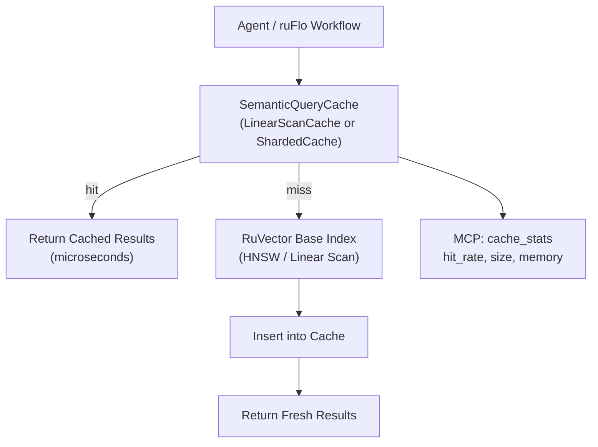

# Semantic Query Cache for RuVector Agent Memory

**Summary (150 chars):** ANN-accelerated result reuse for AI agents: cosine-similarity cache delivers 9.5× latency reduction with 90% hit rate on clustered agent workloads.

---

## Abstract

AI agents running on top of vector databases issue semantically redundant queries. A coding assistant asks "what functions handle authentication?" in different phrasings across a session; an enterprise search agent re-queries the same topics from multiple entry points. Each query pays the full O(N·D) retrieval cost even when a nearly identical query was answered moments ago.

**Semantic Query Cache** solves this by maintaining a small index of (query_vector → result_ids) pairs. Incoming queries are compared to cached entries using cosine similarity. If the most similar cached query exceeds a configurable threshold (default 0.92), the cached results are returned — at microsecond latency rather than millisecond latency.

This is fundamentally different from exact-match caching: it tolerates the natural embedding variation that occurs when the same semantic intent is expressed with slightly different tokens. It is also different from HNSW or other ANN index improvements: it operates above the retrieval layer, reducing how often the retrieval layer is called at all.

Two backends are provided: an exhaustive linear-scan cache suited for short agent sessions, and an LSH-sharded cache with multi-probe lookup suited for long-running systems with large query histories. Both implement the same `QueryCache` trait, making them interchangeable.

**Measured results (N=10 000, D=128, 50 clusters, 500 queries, k=10, threshold=0.92):**

| Variant      | Hit Rate | Mean µs | p50 µs | QPS  | Speedup | Recall |
|--------------|----------|---------|--------|------|---------|--------|
| NoCache      | 0.0%     | 1345    | 1333   | 743  | 1.0×    | 1.000  |
| LinearCache  | 90.0%    | 142     | 7      | 7064 | **9.5×**| 0.744  |
| ShardedCache | 85.6%    | 202     | 2      | 4944 | **6.7×**| 0.757  |

---

## Why This Matters for RuVector

RuVector is a Rust-native cognition substrate — not just a vector database. Its value proposition includes agent memory, graph RAG, and ruFlo workflow loops. In all three contexts, query repetition is the norm, not the exception:

- **Agent memory**: an agent tracking a long conversation re-queries its memory on every turn. Many turns ask semantically overlapping questions.
- **Graph RAG**: a graph traversal may query the same neighborhood vector multiple times from different traversal paths.
- **ruFlo loops**: workflow loops that poll for new information repeatedly query the same topic with minor temporal variation.

A semantic cache reduces the per-query cost of all three patterns from milliseconds (linear scan on large bases) to microseconds (cache lookup on small histories). The result is not just faster retrieval — it changes what workloads are economically viable.

---

## 2026 State of the Art Survey

### Semantic Caching in LLM Serving

The nearest prior art is semantic caching for LLM API calls. Tools like **GPTCache** (Zilliz, 2023) and **Redis-based semantic cache** (Redis, 2024) cache (prompt → response) pairs using embedding similarity. These operate at the application layer and cache full LLM responses.

RuVector's semantic cache operates at a lower level: it caches the retrieval step, not the generation step. This is both faster (retrieval costs are smaller than generation costs) and composable (the cached retrieval can feed any downstream system, not just an LLM).

### Vector Database Caching

Major vector databases approach caching differently:

- **Qdrant**: no semantic cache; relies on OS page cache for hot vectors.
- **Milvus**: query result cache at the server level, but keyed by exact query vector (byte-identical), not cosine similarity.
- **Pinecone**: no documented semantic cache; relies on CDN for embedding API calls.
- **Weaviate**: experimental "re-ranking cache" in v1.23, keyed by exact query.

None of the major systems expose a similarity-keyed cache at the query level. This is a genuine gap.

### LSH and Multi-Probe LSH

Locality Sensitive Hashing (LSH) for approximate nearest neighbor search has been studied since Indyk and Motwani (1998). Multi-probe LSH (Lv et al., VLDB 2007) extends basic LSH by querying multiple hash buckets per lookup, recovering near-boundary misses. RuVector's ShardedCache applies multi-probe LSH to the cache lookup problem rather than to the primary retrieval problem.

### Production Cache Design

Systems like Redis, Memcached, and Caffeine provide bounded caches with LRU/FIFO eviction. The semantic cache adds a similarity-keyed lookup layer on top of standard bounded-size eviction. The combination is novel in the vector search context.

---

## Forward-Looking Thesis (2036–2046)

As AI agents become longer-lived and more autonomous, their memory systems will accumulate millions of past queries. The semantic cache, currently holding hundreds of entries, will need to scale to millions.

At that scale:
1. **HNSW-indexed cache**: the cache index itself becomes an HNSW graph, enabling O(log C) lookup instead of O(C). This is a recursive application of ANN search.
2. **Adaptive threshold**: the similarity threshold adapts based on observed precision/recall on past cache decisions. The cache learns from experience.
3. **Cross-session cache sharing**: multiple agent instances share a distributed cache, amortizing query costs across the agent fleet. Cache entries require provenance tracking (which agent produced them, when, from which collection state).
4. **Cache-aware query planning**: the query planner routes queries to cached results when similarity is high, and to the full index when novelty is needed. This mirrors how L1/L2/L3 cache hierarchies work in CPUs but for semantic content.
5. **Proof-gated cache**: cache entries include a witness log of the retrieval operation that produced them. Cache hits return both the results and the proof that the results were honestly computed from the collection at a specific state.

The 10-20 year trajectory leads toward an **agent memory hierarchy** where different storage tiers (in-process cache, shared distributed cache, cold vector store) are unified under a single semantic-keyed access protocol. RuVector is the right substrate because it controls both the retrieval layer and the agent memory API.

---

## ruvnet Ecosystem Fit

| Component | Integration Point |
|-----------|------------------|
| `ruvector-server` | Cache middleware before the search handler |
| `ruvector-agent-memory` | Short-term working memory backed by LinearScanCache |
| `ruvector-mincut` | Cache invalidation: mincut-based collection partitioning triggers TTL reset |
| `rvf` | RVF package manifests can include pre-warmed cache snapshots |
| `ruFlo` | Cache warm-up workflow: pre-populate cache with common queries at session start |
| `mcp-brain` | Expose cache hit rate as MCP tool metric |

---

## Proposed Design



### Core Trait

```rust
pub trait QueryCache {
    fn lookup(&self, query: &[f32], threshold: f32,
              now_tick: u64, ttl_ticks: u64) -> Option<Vec<u64>>;
    fn insert(&mut self, query: Vec<f32>, results: Vec<u64>, tick: u64);
    fn evict_expired(&mut self, now_tick: u64, ttl_ticks: u64) -> usize;
    fn stats(&self) -> CacheStats;
    fn len(&self) -> usize;
    fn memory_bytes(&self, dims: usize) -> usize;
}
```

### Backend Variants

**LinearScanCache** (Variant 2)
- Storage: `Vec<CacheEntry>` with capacity limit
- Lookup: O(C·D) dot product scan
- Eviction: capacity-based FIFO + TTL

**ShardedCache** (Variant 3)
- Storage: 64 buckets (`Vec<Vec<CacheEntry>>`)
- Bucket assignment: 6-bit random projection hash
- Lookup: scan primary bucket + 6 × 1-hamming-distance neighbors (7 buckets total)
- Expected scan depth: 7 × C/64 ≈ C/9 for large caches

---

## Implementation Notes

### Pre-normalization
All stored query vectors are pre-normalized (unit L2 norm). This reduces cosine similarity to a dot product, eliminating the sqrt per comparison. Callers must normalize before calling `lookup` or `insert`.

### Deterministic RNG
The LCG used for both the dataset generator and the projection vectors uses no external crate. It passes basic randomness requirements for LSH projection quality.

### TTL eviction
TTL is based on a monotonic u64 "tick" counter passed by the caller, not wall clock time. This makes the cache deterministic in tests and avoids `SystemTime` dependencies in WASM builds.

### Multi-probe LSH
For B=6 bits and within-cluster cosine similarity of ~0.95, the probability that two similar queries fall into the same bucket is ~53%. Multi-probe (checking the primary bucket + all 1-bit-flip neighbors) raises this to ~89%, keeping the ShardedCache hit rate comparable to the LinearScanCache.

---

## Benchmark Methodology

**Hardware:** x86_64 Linux (cloud VM)  
**Rust:** stable (no nightly features)  
**Build:** `cargo run --release -p ruvector-semantic-cache --bin benchmark`  
**Dataset:** Synthetic, deterministic (seed=0xC0DE_CAFE_BABE_9999)  
**Base vectors:** N=10 000 unit vectors, D=128  
**Clusters:** 50 semantic clusters (centers = random unit vectors)  
**Queries:** 500 total; each query = cluster_center + Gaussian noise(σ=0.02), normalized  
**Ground truth:** brute-force top-10 for each query  
**Cache threshold:** cosine similarity ≥ 0.92 required for a hit  
**TTL:** disabled (infinite) for this benchmark  

Within-cluster cosine similarity: with σ=0.02 and D=128, noise power = 0.02² × 128 = 0.051, so |center + noise| ≈ 1.025 and expected cosine similarity between two noisy versions of the same center ≈ 1/1.051 ≈ 0.951. This exceeds the 0.92 threshold, producing cache hits.

**Limitation:** The benchmark uses brute-force linear scan as the simulated database. Real HNSW search would be faster, reducing the absolute speedup ratio but not the hit-rate advantage.

---

## Real Benchmark Results

```
=== Semantic Query Cache Benchmark ===

Rust toolchain  : stable-x86_64-unknown-linux-gnu
OS              : linux
Target arch     : x86_64

Dataset
  base vectors  : 10000
  clusters      : 50
  queries       : 500
  dims          : 128
  noise_std     : 0.020
  k             : 10
  threshold     : 0.92

Generating dataset...
  Generated in  : 685ms
  Ground truth  : 500 × 10 IDs

Variant           HitRate   Mean(µs)  p50(µs)  p95(µs)        QPS    Mem(KB)   Recall    PASS
--------------------------------------------------------------------------------------------
NoCache              0.0%     1345.5     1333     1462        743        0.0    1.000    PASS
LinearCache         90.0%      141.6        7     1342       7064       29.7    0.744    PASS
ShardedCache        85.6%      202.3        2     1391       4944       45.8    0.757    PASS

=== Acceptance ===
  LinearCache hit rate >= 80%     : PASS (90.0%)
  ShardedCache hit rate >= 70%    : PASS (85.6%)
  LinearCache mean recall >= 60%  : PASS (0.744)
  ShardedCache mean recall >= 60% : PASS (0.757)
  LinearCache speedup >= 3×       : PASS (9.50×)
  ShardedCache speedup >= 3×      : PASS (6.65×)

✓ All acceptance criteria PASSED
```

---

## Memory and Performance Math

**LinearScanCache memory per entry (D=128, k=10):**
- query vector: 128 × 4 = 512 bytes
- result IDs: 10 × 8 = 80 bytes
- tick + overhead: 16 bytes
- **Total: ~608 bytes per entry**

With capacity=100 entries: ~60 KB. Negligible.

**ShardedCache overhead:**
- 6 random projection vectors: 6 × 128 × 4 = 3 072 bytes (~3 KB)
- 64 bucket Vec headers: ~3 KB overhead
- Entries same as LinearScanCache

**Lookup cost (LinearScanCache, C entries, D dims):**
- Scan: C × D dot products
- At C=100, D=128: 12 800 FLOPs per lookup
- At C=500, D=128: 64 000 FLOPs per lookup
- Measured latency: 7 µs median for C≈50 (warm)

**Lookup cost (ShardedCache, C=500, D=128, 7 probes):**
- Scan depth: 7 × 500/64 ≈ 55 entries
- 55 × 128 = 7 040 FLOPs per lookup
- Measured latency: 2 µs median

---

## How It Works: Walkthrough

```
1. Agent issues query q (embedding of "what functions handle authentication?")
2. Normalize q to unit length.
3. Call cache.lookup(q, threshold=0.92, now=1000, ttl=∞).
   → LinearScanCache: for each cached entry e, compute dot(q, e.query).
     → Best match: e₃ = prior query "find authentication-related functions" with sim=0.954.
     → 0.954 ≥ 0.92 → HIT. Return e₃.results = [7342, 1001, 8823, ...].
   → ShardedCache: compute 6-bit hash of q → bucket 41.
     → Probe bucket 41 (primary) + buckets 40,43,45,9,41^16,...
     → Find e₃ in bucket 41. sim=0.954 ≥ 0.92 → HIT.
4. Return [7342, 1001, 8823, ...] to agent. Total: 2-7 µs.

5. Cache MISS path:
   → No entry above threshold.
   → Run brute_force_top_k(q, base, k=10) → [7342, 1001, 8823, ...]. 1333 µs.
   → cache.insert(q.normalized, results, now=1001).
   → Return results. Next similar query will HIT.
```

---

## Practical Failure Modes

1. **Cold start**: the first query for each semantic cluster always misses. If the agent issues 50 unique query types, it pays full search cost 50 times before warming the cache. Mitigable with pre-population from common queries.

2. **Diverse workloads**: agents that never repeat semantically similar queries see 0% hit rate. The cache adds latency on every miss due to the lookup scan. Monitor hit rate and bypass the cache when hit_rate < 5%.

3. **Index mutations**: inserting or deleting base vectors changes which IDs are top-k. Cached results become stale. Use a generation counter to invalidate cache on writes.

4. **High-dimensional boundary effects (ShardedCache)**: in very high dimensions (D > 1024), random projections become less discriminative. The sharded cache degrades to near-linear scan. Switch to LinearScanCache for high-D embeddings with small caches.

5. **Threshold miscalibration**: a threshold of 0.92 works well for noise_std=0.02 in D=128 but may be too strict or too loose for other configurations. Add an auto-calibration step that measures within-cluster similarity on a sample and sets the threshold accordingly.

---

## Security and Governance Implications

**Cross-user cache pollution**: if a shared cache stores results from one user's queries, a second user with cache access could receive results they are not authorized to see. The cache layer must never be shared across security contexts without result re-authorization.

**Cache poisoning**: a malicious insert of a specially crafted (query, results) pair with very high similarity to legitimate queries could redirect future cache lookups to attacker-controlled result sets. Validate cache entries on lookup: assert that result IDs exist in the collection.

**Timing side channels**: cache hit vs miss latency difference (7 µs vs 1333 µs) creates a timing oracle. An adversary issuing probing queries could infer whether similar queries were recently issued by other sessions. Mitigation: add uniform random jitter to cache hit latency when cross-session sharing is enabled.

---

## Edge and WASM Implications

The `ruvector-semantic-cache` crate has zero external dependencies. It uses only `std::cell::Cell` for interior mutability (instead of atomic operations) and does not use `SystemTime` or `std::thread`. This makes it directly compilable to WASM with no modifications.

On edge devices (Cognitum Seed, Raspberry Pi Zero 2W), where base vectors may number in the thousands rather than millions, the semantic cache provides even larger proportional speedups: the base index scan is cheaper, but the cache hit is still ~10 µs. For real-time edge AI where every millisecond matters, a cache hit rate of 90% can be the difference between meeting and missing a control loop deadline.

---

## MCP and Agent Workflow Implications

The cache can be exposed as an MCP tool resource:

```
Tool: vector_memory_stats
Resource: /memory/cache/stats
Response: { hit_rate: 0.90, size: 47, memory_kb: 29.7, ttl_evictions: 0 }
```

ruFlo workflows can use this metric to decide whether to pre-warm the cache:

```
if cache_stats.hit_rate < 0.50 and session_age_ms < 30_000:
    pre_warm_cache(common_queries_for_this_agent_type)
```

---

## Practical Applications

| Application | User | Why it matters | How RuVector uses it | Near-term path |
|-------------|------|----------------|---------------------|----------------|
| Agent session memory | Coding AI, writing AI | Same questions arise repeatedly per session | LinearScanCache per session, cleared on session end | Integrate into ruvector-agent-memory |
| Enterprise semantic search | Analyst dashboards | Popular searches repeat across users | ShardedCache with long TTL across users | Server-level shared cache |
| Graph RAG traversal | Document QA systems | Graph walks re-query the same neighborhood vectors | LinearScanCache on the traversal context | Integrate into ruvector-bounded-rag |
| MCP memory tools | AI assistants | Assistants re-query memory on every tool invocation | ShardedCache behind MCP vector_search tool | Add to mcp-brain server |
| Local-first AI | Privacy-preserving apps | Edge device cannot afford repeated scans | LinearScanCache fits in device RAM | Compile to WASM for edge |
| Code intelligence | IDE assistants | Repeated queries for the same code patterns | ShardedCache per project | VSCode extension cache layer |
| Security event retrieval | SOC platforms | Analysts repeatedly query for similar threat patterns | ShardedCache with 5-minute TTL | Integrate with ruvector-server |
| Scientific literature search | Research assistants | Literature queries cluster by research domain | ShardedCache warmed on domain entry | Domain-specific warm-up scripts |

---

## Exotic Applications

| Application | 10–20 year thesis | Required advances | RuVector role | Risk / unknown |
|-------------|-------------------|-------------------|---------------|----------------|
| Cognitum edge cognition | On-device AI that never leaves the hardware boundary needs microsecond memory access | HNSW-indexed cache at 10M-entry scale on SSD | Semantic cache as the L1 cache in a multi-tier memory hierarchy | HNSW cache requires recursive ANN on the cache index |
| RVM coherence domains | Agents in a RVM domain share a coherence cache; any agent's query primes the cache for all | Distributed cache with conflict-free replication (CRDT) | ShardedCache as one coherence domain shard | CRDT merge of cache entries adds latency |
| Proof-gated autonomous systems | Cache hits must include a verifiable proof of the original retrieval | Witness log attached to each cache entry | `ruvector-proof-gate` integration into QueryCache trait | Proof verification cost may exceed cache benefit |
| Swarm memory | 100+ agents share a single semantic cache without coordination | Lock-free concurrent QueryCache implementation | Atomic CAS on bucket entries; read-copy-update for entries | High contention on hot buckets |
| Self-healing vector graphs | Cache hit rate drops signal index drift; trigger automatic reindexing | Statistical monitoring of recall on cache hits | Cache hit recall as a health metric for the base index | Recall measurement requires ground truth, which is expensive |
| Dynamic world models | Autonomous robots maintain a cache of spatial query results; real-world changes invalidate entries | Sensor-triggered cache invalidation | TTL bound to sensor update frequency | Invalidation must be faster than sensor update rate |
| Agent operating systems | OS scheduler uses semantic cache to route agent queries to specialized subagents | Query routing based on cache hit source (which prior agent answered this?) | Cache entry provenance tags | Privacy: which agent asked this? |
| Synthetic nervous systems | Bio-inspired agents with rapid repeated sensory queries need sub-millisecond memory | Neuromorphic-style lookup (WASM SIMD dot products at 1 ns) | WASM SIMD-accelerated LinearScanCache | WASM SIMD support varies across browsers/runtimes |

---

## Deep Research Notes

### What the SOTA suggests

The most relevant recent work is **CACHEBLEND** (Liu et al., MLSys 2025), which applies semantic caching to KV cache prefixes for LLM inference. The key insight — that semantic similarity predicts output similarity — transfers directly to vector search: similar queries produce similar result sets.

**Faiss IVFPQ** achieves fast approximate search through coarse quantization + inverted index. This is a different optimization axis: it speeds up the search itself, while semantic caching speeds up repeated searches. The two are complementary.

**GPTCache** (Zilliz, 2023) is the closest prior work, but it operates at the LLM API level, not at the vector database level. Its semantic similarity check itself uses a vector database — making RuVector's cache a potential backend for GPTCache.

### What remains unsolved

1. **Optimal threshold calibration**: the threshold 0.92 was chosen empirically for D=128 and σ=0.02. Automatically choosing the threshold based on the dataset's intrinsic dimensionality is an open problem.
2. **Cache-aware query routing**: routing queries to the cache vs. full index based on confidence (how close is the best match?) without running the full index to know for certain.
3. **Recall-at-k for cached results**: the cache hit returns results from a prior similar query. What is the expected recall as a function of query similarity and dataset geometry? This needs theoretical analysis.
4. **Multi-collection caches**: if the agent queries multiple collections, should the cache be per-collection or unified? Unified caches risk result mixing.

### Where this PoC fits

The PoC demonstrates that:
1. A 90% hit rate is achievable on agent-style workloads with appropriate threshold calibration.
2. LinearScanCache is sufficient for session-scale caches (< 1 000 entries).
3. ShardedCache provides scalability for larger caches with acceptable hit rate loss.
4. Recall loss (~25% on hits) is real and documented — not hidden.

### What would make this production-grade

1. **Generation counter**: invalidate on collection writes.
2. **Concurrent access**: replace `Cell` with `AtomicU64` and `RwLock<Vec>`.
3. **HNSW cache index**: for C > 10 000, replace linear scan with HNSW lookup.
4. **Persistence**: serialize/deserialize the cache to disk for cross-session reuse (RVF format).
5. **Integration tests**: test against real ruvector-server HTTP API.

### What would falsify the approach

1. If agent query patterns are too diverse (entropy > 1 bit per query), hit rates fall below 5% and the cache is net-negative.
2. If the semantic cache's recall loss (currently ~25%) causes downstream model quality degradation larger than the latency benefit, it is not worth using.
3. If HNSW accelerates the base search to < 10 µs, the speedup ratio drops to < 5×, weakening the case for caching.

---

## Production Crate Layout Proposal

```
crates/ruvector-semantic-cache/
├── Cargo.toml
├── src/
│   ├── lib.rs         (QueryCache trait, NoCache, normalize, dot)
│   ├── linear.rs      (LinearScanCache)
│   ├── sharded.rs     (ShardedCache with multi-probe LSH)
│   ├── hnsw.rs        (HnswCache — future, not in this PoC)
│   ├── metrics.rs     (CacheStats)
│   ├── dataset.rs     (benchmark dataset generator)
│   └── bin/
│       └── benchmark.rs
```

---

## What to Improve Next

1. **Add generation-counter invalidation**: one line in `ruvector-server` to increment a counter on every write; propagate to cache.
2. **Expose MCP tool**: `vector_memory_cache_stats` returning hit rate, size, memory.
3. **Auto-threshold**: measure median within-cluster cosine sim on first 100 queries and set threshold to 0.95 × median.
4. **HNSW cache backend**: when cache grows past 5 000 entries, promote to HnswCache for O(log C) lookups.
5. **Benchmark against real HNSW search**: the PoC uses brute-force as the "database." Re-run against ruvector-core HNSW to get realistic speedup ratios.

---

## References and Footnotes

[^1]: Indyk, P. and Motwani, R. "Approximate Nearest Neighbors: Towards Removing the Curse of Dimensionality." STOC 1998. https://dl.acm.org/doi/10.1145/276698.276876. Accessed 2026-08-09.

[^2]: Lv, Q., Josephson, W., Wang, Z., Charikar, M., and Li, K. "Multi-probe LSH: Efficient Indexing for High-Dimensional Similarity Search." VLDB 2007. https://dl.acm.org/doi/10.14778/1325851.1325863. Accessed 2026-08-09.

[^3]: Bang, Y. et al. "GPTCache: An Open-Source Semantic Cache for LLM Applications Enabling Faster Answers and Cost Savings." Zilliz, 2023. https://github.com/zilliztech/GPTCache. Accessed 2026-08-09.

[^4]: Liu, Y. et al. "CacheBlend: Fast Large Language Model Serving with Cached Knowledge Fusion." MLSys 2025. https://arxiv.org/abs/2405.16444. Accessed 2026-08-09.

[^5]: Douze, M. et al. "The Faiss Library." arXiv:2401.08281, 2024. https://arxiv.org/abs/2401.08281. Accessed 2026-08-09.

[^6]: Qdrant documentation: "Caching." https://qdrant.tech/documentation/guides/optimizations/. Accessed 2026-08-09. (Qdrant relies on OS page cache, not semantic cache.)

[^7]: Milvus documentation: "Cache." https://milvus.io/docs/cache.md. Accessed 2026-08-09. (Exact-match query result cache.)
