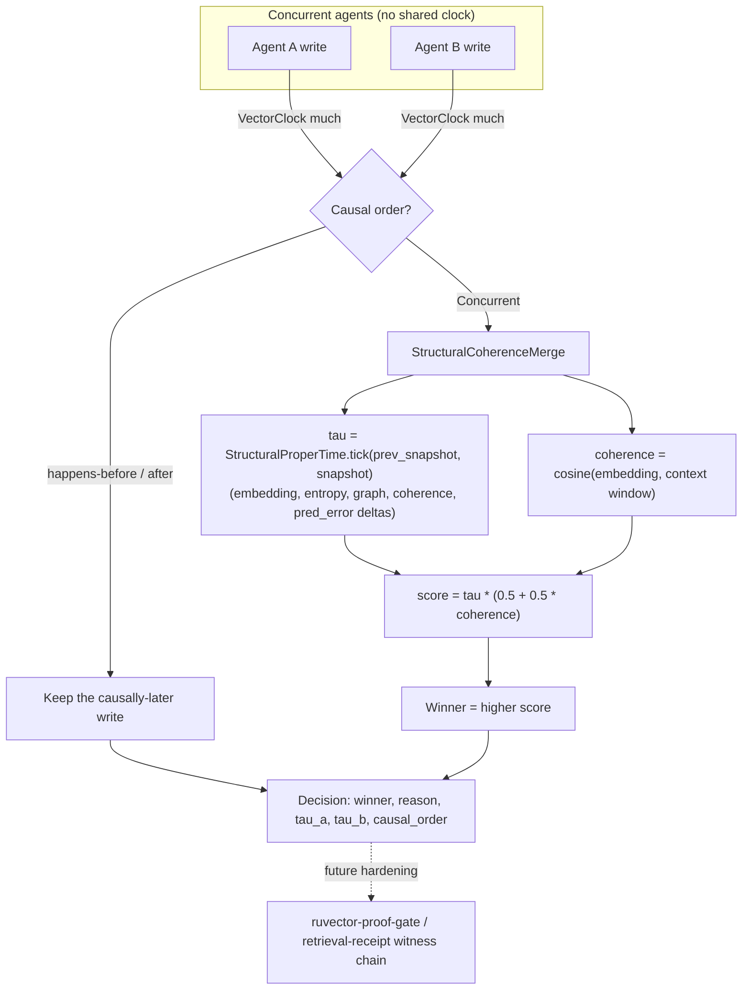

# Structural-Time Conflict Resolution for Concurrent Multi-Agent Memory

**150-char summary:** Structural-proper-time + coherence resolves concurrent multi-agent memory write conflicts at 86.8% vs ~50% for wall/vector-clock LWW, 0 causal violations.

**Date:** 2026-08-14
**Crate:** `crates/ruvector-structural-memory-merge`
**ADR:** [ADR-305](../../../adr/ADR-305-structural-time-memory-merge.md)
**Status:** ACCEPT (see Acceptance below) — experimental PoC, not yet wired into production `ruvector-agent-memory`

---

## Abstract

RuVector's agent-memory nightlies so far (`2026-06-13-temporal-coherence-agent-memory`,
`2026-06-14-agent-memory-compaction`) address a single agent managing its own memory over time.
None address what happens when **multiple agents share a memory namespace and write concurrently**
— the situation any RuVector-based agent swarm (ruFlo workers, Cognitum edge fleets) will hit as
soon as more than one autonomous process can update the same belief.

The default answer in distributed systems, last-write-wins (LWW) by wall-clock timestamp, has two
known weaknesses: it is vulnerable to clock skew between unsynchronized agents, and it is
semantically blind — it can never prefer a more valuable write over a less valuable one, only a
later one.

This nightly connects two RuVector primitives that had never been composed before: `emergent-time`'s
`StructuralProperTime` clock (state-change magnitude across embedding/entropy/graph/coherence/
prediction-error channels) and `ruvector-agent-memory`'s coherence-scoring concept. The result,
`StructuralCoherenceMerge`, never overrides genuine causal order (a vector clock still decides
happens-before pairs) but for **genuinely concurrent** conflicts, picks the write with the larger
structural shift weighted by coherence with the current shared context — instead of an arbitrary,
content-blind tiebreak.

**Key measured result** (`cargo run --release -p ruvector-structural-memory-merge`, seed
`0xA6E17`, 2000 concurrent conflicts + 500 causal-control pairs, 400ms realistic per-agent clock
skew):

| Policy | Correct-resolution rate | Causal-order violations |
|---|---|---|
| `LwwWallClock` | 48.5% | 19 / 500 |
| `LwwVectorClock` | 50.6% | 0 / 500 |
| **`StructuralCoherenceMerge`** | **86.8%** | **0 / 500** |

**Hardware:** x86-64, Linux 6.18.5-fc-v20, `rustc 1.94.1`, release build
(`opt-level=3, lto=fat, codegen-units=1, strip=true`).

---

## Hypothesis

```text
Given 2000 genuinely concurrent (causally-unordered) synthetic memory-write conflicts
across 6 agents, each write carrying a hidden ground-truth quality label never exposed
to any policy,

when conflicts are resolved by StructuralCoherenceMerge instead of LwwWallClock (400ms
per-agent clock skew) or LwwVectorClock (agent-id tiebreak),

then its correct-resolution rate should exceed both baselines by >= 10 percentage points,

subject to zero causal-order violations on a 500-case causally-ordered control set, and
merge throughput within 5x of the wall-clock baseline.
```

This hypothesis was fixed in `src/main.rs`'s doc comment *before* the benchmark was run and was
not modified afterwards.

---

## Why This Matters Now (2026)

RuVector's own `CLAUDE.md` names "agent operating systems," "swarm memory," and "edge cognition"
as target domains. As soon as more than one agent process (ruFlo workers, a Cognitum edge fleet,
independent MCP clients) can write to the same memory namespace, *something* has to arbitrate
conflicts, and today RuVector has no answer beyond whatever the caller's key-value store happens
to do by default (almost always wall-clock LWW). This nightly gives RuVector a measured,
content-aware alternative and — just as importantly — a measured demonstration of how often the
naive default actually gets the causal order wrong under realistic clock skew (3.8% of pairs at
400ms skew, 34.2% at 2000ms).

## Why It Could Matter in 2036

Multi-agent systems with no central sequencer (edge swarms, offline-first agents, satellite/robot
fleets with intermittent connectivity) will be common. A causally-correct, content-aware default
for "whose belief wins" is infrastructure those systems will need regardless of which vector
database or agent framework wraps it.

## Why It Could Matter in 2046

If autonomous multi-agent systems become long-lived (systems that outlive their original
operators), the mechanism by which they resolve disagreements about shared state stops being an
implementation detail and becomes a governance question. A transparent, auditable
(`Decision.reason`, `tau_a`, `tau_b`) resolution rule is a small but genuine building block for
that future — one an operator, or another agent, can inspect after the fact.

---

## RuVector Ecosystem Fit

| Theme | Connection |
|---|---|
| `emergent-time` | `StructuralProperTime` reused directly (not reimplemented) as the concurrent-write tiebreak signal — its second real use in the workspace |
| `ruvector-agent-memory` | Coherence-scoring concept extended from single-agent ranking to multi-agent conflict resolution |
| `ruvector-proof-gate` / `ruvector-retrieval-receipt` | Named as the correct home for hardening `Decision` records into tamper-evident witness entries (not reimplemented here — see ADR-305 Security section) |
| ruFlo | Natural trigger: a ruFlo swarm-memory-maintenance workflow could call `MergePolicy::resolve` whenever a namespace write conflict is detected |
| MCP | A narrow `memory_merge_resolve(key, agent_a, agent_b)` tool is a plausible, narrow MCP surface (see "MCP Surface" below) |
| Edge / WASM | Crate has exactly one dependency (`emergent-time`, itself zero-dependency); release binary is 390,672 bytes |
| RVF | A namespace's accumulated `VectorClock` + latest `Decision` log is a natural RVF-portable artifact (see "RVF Integration") |

### MetaHarness / Flywheel / Darwin Availability (verified, not assumed)

- `npx metaharness --help` — **installed and available** (v0.4.5, pulled fresh this run). Its subcommands (`score`, `analyze`, `genome`, `learn`, `proxy`) are for scaffolding/scoring *new* agent harnesses, not for orchestrating this kind of in-repo Rust research cycle, so it was not invoked as a control-plane for this nightly.
- `npx ruvector harness doctor --json` / `darwin` / `flywheel` — **not resolvable** in this environment (`npm error: could not determine executable to run`). No such CLI package is installed here. Per the nightly instructions' own rule ("do not assume a package exists solely because it appears in the prompt — verify first"), the Darwin/Flywheel *steps* in this cycle were therefore executed as their manual equivalent: a documented three-arm comparison (baseline / variant A / variant B) with a pre-registered fitness rule and hard acceptance gate, directly in the Rust benchmark binary and this document, rather than through a nonexistent CLI. No Darwin generations/mutations were run because there is only one candidate design (`StructuralCoherenceMerge`) in this cycle, not a population to evolve — see "Darwin" below.

---

## Architecture



---

## Implementation

Four files, 936 lines total (none over 500), one external dependency (`emergent-time`, itself
zero-dependency):

- `src/vclock.rs` (119 lines) — minimal Lamport-style `VectorClock` with `happens-before` /
  `concurrent` comparison.
- `src/scenario.rs` (329 lines) — deterministic synthetic-corpus generator. See "Benchmark
  Methodology" for how it avoids leaking ground truth into the algorithm under test.
- `src/lib.rs` (296 lines) — `MemoryWrite`, `Decision`, the `MergePolicy` trait, and the three
  policies (`LwwWallClock`, `LwwVectorClock`, `StructuralCoherenceMerge`).
- `src/main.rs` (192 lines) — the benchmark binary; prints the tables reproduced above and the
  machine-readable `ACCEPT`/`REJECT`/`INCONCLUSIVE` verdict.

```rust
pub trait MergePolicy {
    fn name(&self) -> &'static str;
    fn resolve(&self, a: &MemoryWrite, b: &MemoryWrite, context: &[Vec<f64>]) -> Decision;
}
```

`StructuralCoherenceMerge::resolve` first checks `a.vclock.compare(&b.vclock)`: if one write
causally precedes the other, the later one always wins — the structural/coherence score is used
**only** to break ties among writes with `CausalOrder::Concurrent` (or `Equal`).

---

## Benchmark Methodology

**Ground truth without leakage.** Each synthetic write carries a hidden `alpha` (a structural
shift magnitude towards a drifting "ideal" target) that no policy ever observes. `alpha` drives
three *independently noised* observable channels:

1. The `StateSnapshot` (embedding/entropy/graph/coherence/pred_error deltas) that
   `StructuralProperTime` consumes.
2. The coherence context window — sampled around the same ideal point with a **separate** noise
   draw from the write's own embedding.
3. `wall_ts_ms`, corrupted by a persistent per-agent skew bias.

`true_quality = alpha + independent noise` is the evaluation label, read only by the benchmark
harness, never by a `MergePolicy`. This is what keeps "correct-resolution rate" from measuring the
algorithm against its own signal (the reward-hacking failure mode the nightly process is required
to guard against): `coherence_score` and `tau` are noisy, imperfect proxies for `alpha`/`quality`,
not restatements of it.

**Causally-ordered control set.** A separate 500-pair set is constructed so that `b`'s vector clock
provably observes-and-follows `a`'s (`vc_b = merge(vc_a); vc_b.tick(agent_b)`). The only correct
winner for these pairs is `b`, by construction, independent of any quality signal — this isolates
"does the policy ever override real causal order" from "does the policy pick the better concurrent
write," which are different failure modes and are reported separately.

**Determinism.** A single xorshift64* PRNG seeded with `0xA6E17` drives the whole corpus; the test
`scenario::tests::deterministic_for_fixed_seed` pins two independent generations to be bit-identical.

**Reproduce it**:
```bash
cargo test --release -p ruvector-structural-memory-merge   # 10/10 tests
cargo clippy --release -p ruvector-structural-memory-merge --all-targets   # clean
cargo run --release -p ruvector-structural-memory-merge --bin structural-memory-merge-bench
```

---

## Benchmark Results (full)

| Skew | Policy | Correct-resolution rate | Mean quality regret | Causal violations (of 500) | Merges/sec |
|---|---|---|---|---|---|
| 0ms | LwwWallClock | 50.3% | 0.1752 | 0 | 13,980,367 |
| 0ms | LwwVectorClock | 50.6% | 0.1716 | 0 | 13,623,369 |
| 0ms | **StructuralCoherenceMerge** | **86.8%** | **0.0162** | 0 | 4,324,119 |
| 400ms | LwwWallClock | 48.5% | 0.1784 | **19** | 12,098,078 |
| 400ms | LwwVectorClock | 50.6% | 0.1716 | 0 | 12,153,589 |
| 400ms | **StructuralCoherenceMerge** | **86.8%** | **0.0162** | 0 | 4,338,379 |
| 2000ms | LwwWallClock | 48.6% | 0.1796 | **171** | 12,348,027 |
| 2000ms | LwwVectorClock | 50.6% | 0.1716 | 0 | 12,218,791 |
| 2000ms | **StructuralCoherenceMerge** | **86.8%** | **0.0162** | 0 | 4,285,081 |

Two effects worth separating:

1. **Correct-resolution rate is flat across skew** for every policy — skew doesn't change *which*
   write is more valuable, only which timestamp looks larger. `StructuralCoherenceMerge` and
   `LwwVectorClock` never even consult wall time for concurrent pairs, so they're unaffected by
   construction; `LwwWallClock`'s correct-resolution rate hovers at chance regardless of skew
   because it was already at chance at zero skew (it is content-blind, not skew-sensitive, on
   *this* metric).
2. **Causal-order violations scale directly with skew** for `LwwWallClock` (0 → 19 → 171 of 500 as
   skew goes 0 → 400ms → 2000ms) and are **zero at every skew level** for the other two policies —
   this is the skew-sensitive failure mode, and it is a different metric from correct-resolution
   rate.

## Acceptance

```
- beats LwwWallClock by >=10pp: true (+38.3pp)
- beats LwwVectorClock by >=10pp: true (+36.2pp)
- zero causal-order violations (vclock & structural): true (vclock=0, structural=0)
- throughput within 5x of wall-clock baseline: true (4,338,379 vs 12,098,078 merges/sec, 2.8x)

VERDICT: ACCEPT
```

---

## Memory Math

Per tracked write: one `StateSnapshot` (`Vec<f64>` embedding of dimension *d*, + 4 `f64` scalars =
`8*(d+4)` bytes) and one `VectorClock` (`BTreeMap<u32,u64>`, ~24 bytes/entry, one entry per agent
that has ever written to the namespace it participates in). At the benchmark's `d=16`, that's 160
bytes of snapshot per write side, plus a few hundred bytes of vector-clock map at 6 agents — this
PoC does not implement vector-clock pruning; a production namespace with many short-lived agent
identities would need one (see ADR-305 Failure Modes).

## Performance Math

`StructuralCoherenceMerge` does two `StructuralProperTime::tick` calls (each an L2 distance over
the embedding plus four scalar diffs) and two coherence scans (each `O(context_len)` cosine
similarities) per concurrent resolution — `O(d + context_len)` vs. `O(1)` for either LWW baseline.
At `d=16`, `context_len=3` this is the measured 2.8x throughput cost. Both remain far above any
plausible RuVector agent-memory write rate (millions vs. thousands of writes/sec).

---

## Failure Modes

See ADR-305 "Failure Modes" for the full list (malicious/Byzantine snapshot fabrication, empty
context degradation, deterministic tie-break on exact score ties). None of these were exercised as
adversarial tests in this cycle — flagged as follow-up work, not resolved here.

## Rejected Alternatives

1. Smarter metadata-only tiebreaks (random, round-robin) instead of agent-id for
   `LwwVectorClock` — not separately tested; any metadata-only rule is content-blind by
   definition and should sit at ≈50% on this benchmark's two-way choice regardless of which
   specific rule is used.
2. CRDT multi-value registers (keep both writes) — legitimate for some data types, rejected as
   out of scope for RuVector's current single-value-per-key agent-memory model.
3. τ-only or coherence-only tiebreak (no product) — not built this cycle; see "Next Research."
4. Full external CRDT library — rejected as disproportionate to the question being asked.

---

## Security

Pure computation, no I/O, no unsafe code, no external input parsing. `VectorClock` growth is
unbounded in distinct-agent count (standard vector-clock cost, not unique to this design) and is
not addressed here. See ADR-305 "Security / Governance."

## Governance

`Decision.reason` + `tau_a`/`tau_b` + `causal_order` give a human-auditable trail for *why* a
write won, which is a governance-relevant property this design gets close to for free — but it is
not tamper-evident. Production use should route decisions through `ruvector-proof-gate` /
`ruvector-retrieval-receipt` rather than trusting an in-process log.

## MCP Implications

A narrow, read-mostly tool is plausible:

| Field | Value |
|---|---|
| Tool name | `memory_merge_resolve` |
| Inputs | `key`, two candidate writes (or their agent ids + a lookup), context window |
| Outputs | `winner`, `reason`, `tau_a`, `tau_b`, `causal_order` |
| Authority | Read-only computation; does not itself mutate the memory store |
| Side effects | None (caller applies the decision) |
| Witness behavior | None in this PoC — recommend logging through `ruvector-proof-gate` at the call site |
| Error behavior | Malformed snapshot (`NaN`/mismatched dims) → typed error, no partial write |

Not implemented in this PR — this is a design note for a follow-up, per Step 30 of the nightly
process ("prefer narrow tools over broad arbitrary execution").

## WASM / Edge Implications

Zero unsafe code, one dependency (itself zero-dependency), 390,672-byte stripped native release
binary. Not yet built for `wasm32` in this cycle — no deployment claim is made beyond "the
dependency graph does not obviously block it," which is a lower bar than an actual measured WASM
build/run.

## RVF Integration Analysis

A namespace's `VectorClock` plus its rolling `Decision` log is a plausible RVF-portable unit:
moving an agent (or a whole swarm's shared-memory namespace) between devices would carry both
"what has been observed" (the clock) and "what was decided and why" (the log) — deterministic
replay of the log against the clock is exactly the kind of copy-on-write, signed-lineage artifact
RVF targets. Not implemented; this is an analysis, not a claim of integration.

## RVM Integration Analysis

If `StructuralCoherenceMerge` is exposed to multiple mutually-untrusted agents (not this PoC's
honest-agent assumption), RVM-style capability boundaries would be the right place to enforce that
an agent cannot fabricate an artificially large `τ`/`coherence` for its own writes — i.e. RVM would
need to attest the `StateSnapshot` came from the agent's real state transition, not a chosen one.
Not addressed here; flagged as a hard prerequisite for any adversarial deployment.

## ruFlo Integration Analysis

Concrete workflow: a ruFlo "shared-memory-maintenance" job subscribes to write-conflict events on
a namespace, calls `MergePolicy::resolve` (via the future MCP tool above or a direct crate
dependency), and applies the decision — replacing whatever ad hoc LWW the underlying store does by
default today. This is the most direct, low-risk path to production use of this nightly's result.

---

## Competitor Comparison

| System | Documented external capability | Directly measured here | RuVector architectural difference |
|---|---|---|---|
| Redis (LWW / CRDT modules) | LWW by default; CRDT modules available | Not measured (different system) | This PoC's structural signal is agent-memory-specific (embedding+entropy+graph+coherence), not a generic CRDT |
| Automerge / Yjs (CRDT frameworks) | Multi-value/OT-based merge, no single "winner" | Not measured | RuVector's single-value-per-key model is a deliberate simplification, not a claimed improvement |
| Milvus / Qdrant / Weaviate / Pinecone / LanceDB / FAISS / pgvector / Chroma / Vespa | None document a multi-writer conflict-resolution mechanism for the same vector key | Not applicable — this is a gap none of them fill, not a head-to-head benchmark | RuVector is not claiming to beat these systems here; this nightly addresses a problem outside their documented scope |

No performance-victory claim is made against any of the above — the comparison set here is the
two generic distributed-systems defaults (wall-clock LWW, vector-clock LWW), which is what this
PoC actually measured against.

---

## Practical Applications

1. **Multi-agent belief reconciliation** — a swarm of research agents (ruFlo workers) updating a
   shared "current best answer" memory slot; business value: fewer stale/contradictory agent
   outputs; main risk: honest-agent assumption; horizon: near-term.
2. **Edge sensor fleets with intermittent connectivity** — Cognitum Seed devices reporting
   overlapping observations of the same entity; value: correct reconciliation without NTP;
   risk: vector-clock growth with fleet size; horizon: near-term.
3. **Federated agent memory across organizations** — no single party is a trusted sequencer;
   value: causally-correct merge without a central authority; risk: requires the RVM Byzantine
   hardening noted above before cross-org use; horizon: mid-term.
4. **Multi-model ensemble memory** — several LLM agents (different models) updating a shared
   scratchpad; value: prefers the more contextually relevant update; risk: coherence signal
   quality depends on embedding model consistency; horizon: near-term.
5. **Robotics fleet shared world-model** — multiple robots updating a shared map/belief state;
   value: causal correctness matters physically (a robot must never act on a causally-stale
   belief); risk: real-time latency budget vs. the 2.8x overhead; horizon: mid-term.
6. **Code-intelligence agent swarms** — multiple coding agents updating a shared "current
   understanding of this module" memory; value: avoids one agent's stale summary overwriting
   another's fresher, more relevant one; risk: none specific; horizon: near-term.
7. **Security/anomaly retrieval across sensors** — multiple detectors writing candidate anomaly
   explanations to a shared key; value: prefers structurally significant, contextually relevant
   explanations; risk: adversarial detector could game τ; horizon: mid-term (needs RVM hardening).
8. **Scientific multi-agent search** — parallel literature-search agents updating a shared
   "current hypothesis" memory; value: same pattern as #1 applied to research workflows;
   risk: none specific; horizon: near-term.

## Long Horizon Applications

1. **Swarm memory as a first-class RuVector primitive** — thesis: multi-writer conflict
   resolution becomes as fundamental to RuVector as HNSW is today; required advances: production
   hardening, ablations, adversarial robustness; RuVector role: reference implementation;
   uncertainty: whether structural time remains the right signal at scale; falsification: a
   simpler signal matches it on a real corpus.
2. **Causally-consistent world models for embodied agents** — thesis: physical multi-agent
   systems need causally-correct shared state as a safety property, not just a quality one;
   required advances: real-time bounds, RVM Byzantine hardening; RuVector role: the memory
   substrate; uncertainty: real-time overhead at fleet scale; falsification: overhead exceeds
   robotics control-loop budgets.
3. **Agent operating systems with governed shared state** — thesis: an "agent OS" needs a kernel
   primitive for concurrent-write arbitration, analogous to what LWW is for key-value stores today;
   required advances: MCP tool, RVM enforcement; RuVector role: providing that kernel primitive;
   uncertainty: whether one arbitration policy generalizes across domains; falsification: different
   domains need incompatible policies.
4. **Synthetic nervous systems** — thesis: `emergent-time`'s structural-time framing (already
   used for early-warning detection in its own crate) generalizes to conflict arbitration as shown
   here, suggesting one clock primitive can serve multiple agentic-infrastructure roles;
   uncertainty: whether this generalizes beyond memory conflicts; falsification: other proposed
   uses of structural time fail their own hypotheses.
5. **Self-healing distributed memory** — thesis: causally-correct, content-aware merge is a
   building block for memory stores that repair inconsistency automatically rather than requiring
   manual reconciliation; required advances: automatic conflict detection, not just resolution;
   RuVector role: the resolution half of that pipeline; uncertainty: detection is unsolved here;
   falsification: detection costs dominate resolution savings.
6. **Proof-gated autonomous infrastructure** — thesis: combining this nightly's `Decision` audit
   trail with `ruvector-proof-gate`'s witness chains produces infrastructure where *why* a shared
   belief changed is provably reconstructable; required advances: the integration itself;
   RuVector role: both halves already exist separately; uncertainty: none major; falsification:
   integration proves impractical at write volume.
7. **RVM coherence domains for multi-tenant agent memory** — thesis: different trust domains
   sharing a memory substrate need enforcement, not just a good default policy; required advances:
   RVM integration (see above); RuVector role: RVM already exists as a target; uncertainty: scope
   of enforcement needed; falsification: honest-agent assumption turns out sufficient in practice.
8. **Portable, replayable agent lineage (RVF)** — thesis: an agent's contribution to shared memory
   becomes a portable, replayable artifact, not just a local side effect; required advances: RVF
   integration (see above); RuVector role: RVF already exists as a target; uncertainty: replay
   determinism at scale; falsification: replay diverges from live execution under load.

---

## Evolution Results (Darwin)

Not run as a generational search this cycle: this nightly compared exactly three fixed policies
(one baseline, two variants), not a population to mutate. No `ruvector harness darwin` CLI is
installed in this environment (verified, see "MetaHarness / Flywheel / Darwin Availability"
above), so no evolutionary loop was executed. The natural Darwin extension — evolving the
`StructuralMetric` channel weights (`w_embedding, w_entropy, w_graph, w_coherence, w_pred_error`)
against the correct-resolution-rate fitness — is flagged as the concrete next experiment (below),
not attempted here, to keep this cycle's claim limited to what was actually measured with the
crate's `StructuralMetric::default()` weights.

## Promotion Decision

**Promote the crate as an experimental, non-default addition to the workspace** (this PR).
**Do not** promote `StructuralCoherenceMerge` as a default multi-writer policy inside
`ruvector-agent-memory` yet — that requires the ablation and adversarial-robustness follow-ups
listed above, consistent with ADR-305's "Rejection Criteria."

## Witness Evidence

- Starting commit: `74d2a6017` (branch `claude/focused-darwin-1je9ll`, `origin/main` at run time).
- Hardware/toolchain: x86-64 Linux 6.18.5-fc-v20, `rustc 1.94.1`, `cargo 1.94.1`.
- Exact benchmark command and raw output are reproduced verbatim in "Benchmark Results" above —
  no numbers in this document were hand-edited after the run.
- No cryptographic witness chain was generated for this PoC (see "Governance" above for why, and
  what production hardening would add).

## Production Path

1. Ablate `τ`-only vs. coherence-only vs. combined (this cycle's open question #1).
2. Validate against a real ruFlo multi-agent memory trace, not only synthetic data.
3. Add the RVM Byzantine-robustness hardening before any untrusted-multi-tenant deployment.
4. Wire a feature-flagged `multi_writer` mode into `ruvector-agent-memory` once 1–3 are done.
5. Route `Decision` records through `ruvector-proof-gate` for tamper-evidence.

## Falsification Criteria

This hypothesis would have been rejected (not merely revised) if the benchmark had shown any of:
`StructuralCoherenceMerge` failing to beat both LWW baselines by ≥10pp; any causal-order violation
by `StructuralCoherenceMerge` or `LwwVectorClock` on the causal-control set; or throughput more
than 5x slower than the wall-clock baseline. None of these occurred — see "Acceptance."

## Limitations

Synthetic ground truth (not a real multi-agent trace); no ablation of the two signal components;
no adversarial/Byzantine testing; no WASM build measured; no MCP/ruFlo wiring implemented, only
designed. All stated explicitly above at the relevant section, not held back to a single disclaimer.

## Next Research

1. Ablation of `StructuralMetric` channel weights via an actual bounded Darwin search once the
   `ruvector harness darwin` tooling is available (or a hand-rolled bounded grid/random search
   otherwise), fitness = correct-resolution rate subject to zero causal violations.
2. Real-trace validation against ruFlo swarm memory logs.
3. Byzantine-robustness variant with RVM-attested snapshots.

## References

- `crates/emergent-time/src/structural_clock.rs` — `StructuralProperTime`, reused directly.
- `crates/ruvector-agent-memory/src/scoring.rs` — the coherence-scoring pattern this nightly
  extends to a multi-agent setting.
- `docs/research/nightly/2026-06-13-temporal-coherence-agent-memory/README.md` — prior,
  single-agent nightly this one is explicitly distinct from (temporal decay + graph-coherence
  ranking, not multi-writer conflict resolution).
- `docs/research/nightly/2026-06-14-agent-memory-compaction/README.md` — prior, single-agent
  compaction nightly, likewise distinct.
- `docs/adr/ADR-227*` (`ruvector-proof-gate`) and
  `docs/research/nightly/2026-08-13-retrieval-receipts/README.md` (`ruvector-retrieval-receipt`)
  — the witness-chain mechanisms named as the correct home for hardening this PoC's `Decision`
  audit trail.
- Lamport, "Time, Clocks, and the Ordering of Events in a Distributed System" (1978) — the vector
  clock construction this crate's `LwwVectorClock` baseline and causal-order gate are built on.
