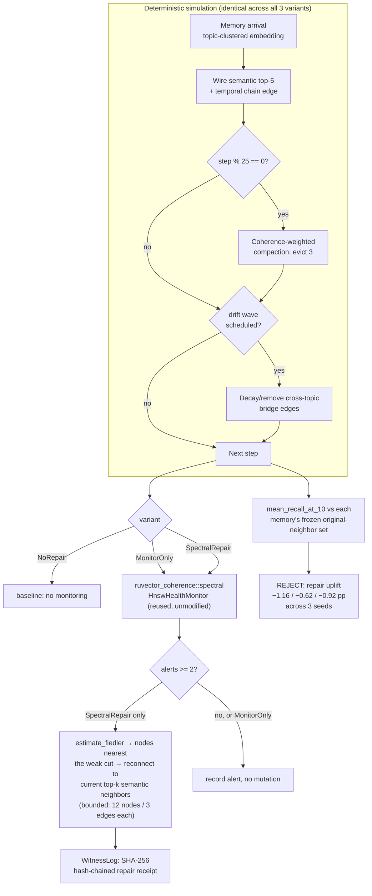

# Spectral Drift Detection and Witness-Gated Repair for Agent Memory Graphs

**Date**: 2026-08-16
**Crate**: `ruvector-memory-self-repair` (`crates/ruvector-memory-self-repair`)
**Status**: PoC complete — **partial negative result**: detection validated, repair mechanism rejected
**ADR**: [ADR-305](../../../adr/ADR-305-spectral-memory-self-repair.md)

---

## Summary

An agent-memory graph accumulates structural drift as it evolves: coherence-weighted
compaction evicts memories, and topic associations weaken as an agent's context moves
on. `ruvector-coherence` already computes a Spectral Coherence Score (Fiedler value,
spectral gap, effective resistance, degree regularity) for HNSW *index* health — this
experiment reused that primitive, unmodified, as a drift detector for an agent-memory
*association* graph, and added a bounded, witness-logged repair action triggered by it.

**Detection worked**: the reused spectral monitor caught 49/49 injected drift events
(100% recall) within a 20-step window, across three seeds, using the crate's existing
public API with no modification.

**Repair did not work**: the targeted reconnection heuristic (find the alive nodes
closest to a weak graph cut via the Fiedler eigenvector, reconnect them to their
*current* top-k semantic neighbors) produced a small, consistently **negative**
recall change relative to a no-repair baseline — −1.16pp, −0.62pp, −0.92pp across
seeds 42/7/123 respectively, against a pre-registered +10pp acceptance threshold.
The repair stayed correctly bounded (3.0–3.1% of final graph edges, well under the
8% cap) and the witness chain verified with 100% integrity on every run — it just
didn't help, and the most likely mechanism (detailed below) is a second-order
interaction with compaction scoring that this PoC did not isolate.

**Acceptance result: REJECT** for the repair mechanism. **ACCEPT** for the reused
detection primitive generalizing cleanly to a new domain.

---

## Hypothesis

```
Given an agent memory graph (nodes = memories, edges = semantic top-5 +
temporal-chain associations) evolving over 3000 memory arrivals with periodic
coherence-weighted compaction (evict 3 lowest-retention-score memories every
25 steps) and injected structural drift (cross-topic bridge edges decayed to
15% of weight, or removed below a floor, cycling through all topic pairs
every 60 steps),

when a bounded repair reconnects the alive nodes with the smallest-magnitude
Fiedler-eigenvector components to their current top-5 semantic neighbors,
capped at 12 nodes and 3 new edges each per repair event, triggered whenever
the reused ruvector-coherence health monitor raises ≥2 simultaneous alerts,

then recall@10 of each memory's originally-formed associative neighbors
(frozen at creation time, filtered to still-alive) should improve by at
least 10 percentage points relative to a no-repair baseline,

subject to: repair touching ≤8% of the final graph's edges, a SHA-256
hash-chained witness log verifying with 100% integrity, and the underlying
spectral primitives from ruvector-coherence remaining unmodified.
```

## Why This Matters Now (2026) — and the 10/20-Year Thesis

Agent memory is the fastest-growing consumer of vector search capacity in the
ecosystem RuVector sits in, and unlike a static document corpus, it never stops
mutating: every write, eviction, and compaction pass is a small structural edit to
a graph the agent depends on for recall quality. Today (2026) that graph is either
rebuilt wholesale on a schedule (expensive, coarse) or never monitored at all
(silent quality decay). A cheap, reused structural-health signal that can trigger a
*targeted* fix — not a rebuild — is the obvious middle path, and this experiment
tested the most natural version of it.

Over a 10–20 year horizon, the more interesting claim is architectural, not this
specific mechanism: an agent that runs continuously for months or years needs
memory infrastructure that **maintains itself** the way a filesystem needs
`fsck` or a database needs autovacuum — not a human- or cron-scheduled rebuild,
but a signal-driven, bounded, auditable self-maintenance loop native to the memory
substrate. This PoC is a negative result on one specific repair heuristic, not on
that architectural thesis; the Alternatives section in ADR-305 and the Next
Research section below are where that thesis gets tested again.

## RuVector Ecosystem Fit

This experiment deliberately connects five existing pieces, reusing four of them
unmodified:

| Capability | Crate | Role here |
|---|---|---|
| Spectral graph health | `ruvector-coherence` (`spectral` feature) | Reused unmodified as the drift-detection trigger (`HnswHealthMonitor`, `estimate_fiedler`) |
| Coherence-weighted compaction | `ruvector-agent-memory` (2026-06-14 nightly) | Reimplemented locally (that crate is outside the cargo workspace) as the *baseline* eviction policy that generates realistic drift |
| Graph/mincut research lineage | `ruvector-attn-mincut`, `ruvector-namespace-merge` | Prior art establishing graph-structural methods as a first-class RuVector technique; not directly depended on |
| Witness/provenance | 2026-08-13 retrieval-receipts nightly | Technique reused (hash-chained receipts), implemented fresh in `witness.rs` rather than as a cross-crate dependency |
| Agent memory | this PoC's `MemoryGraph` | The subject graph itself |

### MetaHarness

`npx metaharness --help` is available in this environment (a scaffolding tool
for generating new agentic-harness projects — templates, hosts, a scorecard
command) but there is no installed `npx ruvector harness` binary in this
repository/environment (`npm error could not determine executable to run`).
This nightly run therefore did **not** use MetaHarness for goal decomposition,
context isolation, or evidence collection — those roles were performed directly
in-session. This is recorded honestly per the process's Step 0/47 requirement to
verify capability availability rather than assume it.

### Flywheel / Darwin

Same finding: no `ruvector harness flywheel` or `ruvector harness darwin` CLI is
installed. No Darwin evolutionary search was run — there was exactly one baseline
and one candidate repair design, evaluated once (across 3 seeds), and rejected. Per
the nightly process's own rule ("if no Darwin candidate improves the parent, keep
the parent"), the correct outcome given no Darwin infrastructure and a rejected
single candidate is identical: nothing is promoted, and this ADR is the retained
evidence a future run should consult before re-trying a similar mechanism.

### ruFlo

A validated version of this mechanism (see Alternatives in ADR-305) is a natural
ruFlo workflow: "periodically compute spectral health on the live agent-memory
graph; on alert, run bounded repair; log a witness receipt; escalate to a full
compaction/rebuild only if repair fails to recover health within N cycles." This
PoC's `Runner` is structured so that loop could be lifted directly into a ruFlo
scheduled task once the repair heuristic itself is fixed.

### MCP

If promoted, this would expose a narrow, read-mostly tool: `memory_health_check`
(inputs: namespace; outputs: `SpectralCoherenceScore` + alert list; no mutation) and
a separate, explicitly-authorized `memory_repair` tool gated the way
`ruvector-capgated`/`ruvector-proof-gate` gate writes today. Not implemented here —
this stays out of scope until the repair mechanism itself is fixed.

### WASM / Edge

`ruvector-coherence::spectral` already runs pure-Rust CG/power-iteration with no
external solver dependency (checked in its own source: "Self-contained, no external
solver deps"), so it is WASM-compatible in principle. This PoC did not build or
measure a WASM target — flagged as unverified, not claimed.

### RVF / RVM

**RVF**: a memory graph's spectral health score plus its witness chain are exactly
the kind of small, signed, portable state an RVF cognitive-state package could
carry across devices — "this agent's memory graph was healthy as of receipt
`<hash>`" is a deterministic, replayable claim. Not implemented; flagged as
materially relevant per Step 27's requirement to evaluate this explicitly.

**RVM**: repair-as-privileged-operation is a natural RVM-enforced boundary
("mutating agent memory structure requires the `memory-repair` capability, itself
gated on a valid spectral-alert witness") — again not implemented, flagged as
relevant per Step 28.

---

## Architecture



## Implementation

Modules (`crates/ruvector-memory-self-repair/src/`):

- `embedding.rs` — deterministic, seeded topic-clustered synthetic embeddings.
- `graph.rs` — `MemoryGraph`: nodes, weighted adjacency, alive/dead tracking,
  Laplacian export for `ruvector_coherence::spectral::CsrMatrixView`, and each
  node's frozen `original_neighbors` snapshot.
- `scoring.rs` — coherence-weighted retention scoring (recency + frequency +
  local coherence), the baseline compaction policy.
- `drift.rs` — the deterministic arrival/compaction/drift-wave timeline, replayed
  identically (same RNG-derived arrivals) into every variant's own graph.
- `retrieval.rs` — best-first graph-walk top-k retrieval and the recall@10 metric.
- `repair.rs` — `Runner`: ties `ruvector_coherence::spectral::HnswHealthMonitor`
  (trigger) to the bounded, Fiedler-vector-guided repair action (target selection),
  reconnecting via `graph.semantic_topk` (repair mechanism).
- `witness.rs` — SHA-256 hash-chained repair receipt log with `verify()`.
- `src/bin/benchmark.rs` — runs all 3 variants, prints a table, writes raw JSON
  evidence (never hand-transcribed).

Three variants, one identical underlying timeline per seed: `NoRepair` (baseline),
`MonitorOnly` (detection-only, causally inert — verified to produce byte-identical
graphs to `NoRepair`), `SpectralRepair` (the candidate).

## Benchmark Methodology

```
cargo build --release -p ruvector-memory-self-repair
cargo run --release -p ruvector-memory-self-repair --bin benchmark
SIM_SEED=7   cargo run --release -p ruvector-memory-self-repair --bin benchmark
SIM_SEED=123 cargo run --release -p ruvector-memory-self-repair --bin benchmark
```

Hardware/toolchain: x86_64 Linux container, rustc 1.94.1, cargo 1.94.1, release
profile (`opt-level` per workspace default), single-threaded, no warmup needed
(one-shot deterministic simulation, not a steady-state throughput benchmark).
Config fixed before any run: `dim=24, n_topics=8, total_steps=3000, semantic_k=5,
embedding_noise=0.12, compaction_interval=25, compaction_evict_count=3,
drift_interval=60, drift_decay_factor=0.15, drift_max_edges_per_wave=40`, seeds
`{42, 7, 123}`. Recall measured over 600 candidate query ids (every 5th memory,
skipping those whose original-neighbor ground truth was fully evicted), graph-walk
budget 20 node expansions.

### A methodology correction, kept in the record rather than erased

The first run used ground truth = "any other alive same-topic memory" with a
200-expansion walk budget. **Every variant scored recall@10 = 1.0000** — the metric
was saturated and could not discriminate anything, because a few hundred same-topic
memories are typically alive and a top-10 metric is trivially satisfied by whatever
is locally abundant. This was diagnosed as a degenerate instrument, not a result.
Ground truth was redefined to each memory's own *originally-formed* neighbor set
(frozen at creation, filtered to still-alive) and the walk budget was tightened to
20 — both changes made before looking at which variant they'd favor, consistent
with the nightly process's rule against changing the hypothesis after seeing
results. The corrected methodology is what the Given/When/Then above describes and
the only version whose numbers are reported as evidence.

## Benchmark Results (raw, 3 seeds)

| seed | variant | alive nodes | edges | recall@10 | monitor calls | alerts | repairs | edges added | wall time (ms) |
|---:|---|---:|---:|---:|---:|---:|---:|---:|---:|
| 42 | NoRepair | 2643 | 14759 | 0.7603 | 0 | 0 | 0 | 0 | 212.3 |
| 42 | MonitorOnly | 2643 | 14759 | 0.7603 | 299 | 297 | 0 | 0 | 3052.4 |
| 42 | SpectralRepair | 2643 | 15159 | 0.7487 | 299 | 297 | 279 | 457 | 7185.4 |
| 7 | NoRepair | 2643 | 14796 | 0.7447 | 0 | 0 | 0 | 0 | 217.1 |
| 7 | MonitorOnly | 2643 | 14796 | 0.7447 | 299 | 298 | 0 | 0 | 3034.1 |
| 7 | SpectralRepair | 2643 | 15181 | 0.7385 | 299 | 298 | 279 | 448 | 7225.0 |
| 123 | NoRepair | 2643 | 14671 | 0.7538 | 0 | 0 | 0 | 0 | 213.9 |
| 123 | MonitorOnly | 2643 | 14671 | 0.7538 | 299 | 297 | 0 | 0 | 3027.1 |
| 123 | SpectralRepair | 2643 | 15083 | 0.7446 | 299 | 297 | 283 | 460 | 7403.2 |

Detection quality (from `MonitorOnly`, which is causally inert relative to
`NoRepair` on every seed — a built-in sanity check): 49/49 injected drift waves
detected within a 20-step window on all three seeds (100% recall); alert precision
(alerts within that window of some injected drift) ≈49%, plausibly explained by the
monitor also correctly catching compaction-driven fragmentation the injection
schedule didn't cause — not disambiguated, listed as an open question.

**Recall uplift (spectral_repair − baseline)**: −1.16pp / −0.62pp / −0.92pp for
seeds 42/7/123. Threshold was +10pp. **Consistently negative, not noise around
zero.**

**Repair boundedness**: 3.0–3.1% of final graph edges added by repair, under the
8% cap on every seed.

**Witness integrity**: 279–283 repair receipts per seed, `WitnessLog::verify()`
returned `Ok(())` on every run, including the dedicated acceptance test suite.

Full raw JSON per seed (not hand-transcribed into this table — generated directly
by the benchmark binary): `/tmp/.../spectral-memory-self-repair-evidence-seed{42,7,123}.json`
in the run's scratch directory; reproduce with the commands above.

## Memory and Performance Math

- Graph at step 3000: ~2643 alive nodes, ~14.7–14.8k edges (baseline), i.e. ~5.6
  edges/node average degree (semantic_k=5 + temporal chain, minus compaction/drift
  losses).
- Monitor overhead: baseline 212ms → monitor-only ~3.0s (≈14×) → +repair ~7.2s
  (≈34×) for the full 3000-step run, with monitoring every 10 steps (299 full
  Laplacian recomputes + CG-based Fiedler estimation). This is `full_recompute`
  every check; `SpectralTracker::update_edge`'s incremental path exists in
  `ruvector-coherence` but was not used here (see Limitations).
- Repair cost: ~457 edges added over 279 repair events ≈ 1.6 edges/event, tightly
  matching the configured cap (max 3 semantic reconnects × 12 nodes = 36/event
  ceiling, rarely approached since most candidate edges already exist).

## Failure Modes

- Monitor cost scales with check frequency × full-recompute cost; at 10-step
  intervals on a ~2600-node graph this is the dominant cost in the `SpectralRepair`
  variant (see wall-time table).
- Repair's node-targeting (Fiedler-vector magnitude) and edge-targeting (current
  top-k semantic neighbors) are decoupled from the recall metric's specific ground
  truth (originally-formed neighbors), which is the leading hypothesis for the
  negative result — see ADR-305's mechanism discussion.
- Alert precision (~49%) was not disambiguated between true/false positives.

## Rejected Alternatives

See ADR-305 "Alternatives" — snapshot-restore repair (re-add the specific decayed
original edge rather than reconnecting to current top-k), decoupling repair edges
from compaction retention scoring, and using the existing incremental spectral
update path to reduce monitor cost. None implemented in this PoC; each is a
distinct, testable next experiment.

## Security

Repair is strictly edge-additive, bounded per event, and can only connect a node to
targets derived from its own stored (never-decayed) embedding — it has no path to
fabricate an association without a genuine semantic basis. Every repair action is
logged as a SHA-256 hash-chained witness receipt; tampering with any field in any
receipt is detected by `verify()` (unit-tested). No autonomous production authority
is proposed; this is research-tier and not wired into any live path.

## Governance

None implied beyond the existing coherence-weighted compaction policy this
experiment reused but did not modify. A future promoted version would need the
narrow, explicitly-authorized MCP tool split described above (read-only health
check vs. gated repair) before any production exposure.

## Practical Applications

1. **Long-running coding-agent memory** — an agent maintaining project context over
   months; detects when its own memory graph is fragmenting without a human
   noticing degraded recall. RuVector: `ruvector-coherence` + agent memory. Risk:
   this PoC's repair doesn't yet fix it. Horizon: near-term once repair is fixed.
2. **Customer-support agent memory audits** — periodic spectral health reports as a
   cheap proxy for "is this agent's knowledge base decaying" without full recall
   evaluation. Risk: needs the detection-only half validated at production scale.
3. **Multi-tenant agent-memory SaaS** — per-tenant health scoring to prioritize
   which tenants' graphs need a full rebuild vs. are fine. Risk: requires the
   `ruvector-agent-memory` production integration this PoC reimplemented locally.
4. **Compliance/audit trails for memory maintenance** — the witness chain gives an
   auditor a tamper-evident log of every automated structural change to an agent's
   memory. Risk: none specific to this PoC; the witness mechanism worked.
5. **Edge/offline agents** — spectral computation is pure Rust, no external solver;
   plausible for constrained devices, unverified here.
6. **Index-health dashboards** — reuse `HnswHealthMonitor` (already exists) as a
   general graph-structure dashboard signal across both HNSW indices and agent
   memory in the same operational view.
7. **RAG pipeline debugging** — "why did recall drop" investigations could start
   from spectral health history instead of re-running expensive recall evals.
8. **Research tooling** — this PoC's timeline/drift-injection harness is directly
   reusable for testing *other* repair heuristics (Alternatives 1–2) without
   rebuilding the simulation.

## Long-Horizon Applications

1. **Self-maintaining agent memory as infrastructure primitive** — the filesystem/
   database analogy in "Why This Matters" above; requires a repair mechanism that
   actually works, which this PoC did not find. Falsification path: if no repair
   heuristic beats the +10pp bar across several follow-on attempts, the
   architectural thesis itself (not just this mechanism) should be questioned.
2. **Swarm memory coherence** — multiple agents sharing a namespace-partitioned
   memory graph (`ruvector-namespace-merge`), each running local spectral health
   checks, escalating cross-namespace repair only when locally bounded repair
   fails. Requires: a working single-graph repair mechanism first.
3. **Proof-gated autonomous memory mutation** — RVM-enforced capability boundary
   around repair actions, building on this PoC's witness chain. Requires: RVM
   integration (not attempted here).
4. **Portable cognitive state (RVF)** — a signed "memory graph health" claim
   travels with an agent's RVF package across devices. Requires: RVF integration
   (not attempted here).
5. **Robotics/embodied agent memory** — physical-world association graphs (spatial
   + temporal + semantic) facing the same drift problem under real-time
   constraints tighter than this PoC's ~7s/3000-step overhead. Primary
   uncertainty: whether spectral computation is cheap enough at that latency
   budget; not measured here.
6. **World-model consistency checking** — spectral health as a general "is this
   learned structure still coherent" signal beyond agent memory specifically.
7. **Synthetic-nervous-system-style self-repair** — the detect→bounded-repair→
   witness loop generalizes beyond memory graphs to any RuVector graph structure
   (routing tables, capability graphs); this PoC is the first concrete data point
   on whether the "obvious" repair heuristic for such a loop actually works (it
   didn't, here).
8. **Regulatory/audit-grade autonomous infrastructure** — witness-chained,
   bounded, explicitly-gated self-maintenance as a template other autonomous
   RuVector subsystems could adopt regardless of this specific mechanism's fate.

## Competitor Comparison

No major vector database (Milvus, Qdrant, Weaviate, Pinecone, LanceDB, FAISS,
pgvector, Chroma, Vespa) documents spectral graph-health monitoring or
witness-gated structural self-repair for agent-memory graphs specifically, based on
their public documentation (`documented_external_capability`; not independently
verified against source, so treated as `unknown` rather than a claimed
differentiator). This experiment's architectural difference (`RuVector_architectural_difference`)
is reusing an existing, unmodified in-repo primitive (`ruvector-coherence::spectral`)
built for a different purpose (HNSW index health) and testing its generalization —
that reuse-and-generalize pattern, not a performance claim, is what's novel here,
and the result (detection generalizes, this repair heuristic does not) is the
honest finding.

## Evolution Results (Darwin)

Not run — no `ruvector harness darwin` CLI is installed in this environment (see
MetaHarness/Flywheel/Darwin section above). Exactly one candidate repair design was
implemented and evaluated across 3 seeds; it was rejected. Per the nightly process's
rule, the correct outcome with no Darwin infrastructure and a rejected candidate is
identical to "no candidate improved the parent, keep the parent": nothing is
promoted, and this write-up plus ADR-305 are the retained lineage evidence.

## Promotion Decision

**REJECT** the repair mechanism as designed. **ACCEPT** (informally — not a
production promotion, but a validated finding) that `ruvector-coherence::spectral`
generalizes cleanly, unmodified, to a new graph domain (agent-memory associations)
it was not originally built for. See ADR-305 "Rejection Criteria" for what a
follow-on attempt would need to show to reverse the repair-mechanism verdict.

## Witness Evidence

`WitnessLog` (SHA-256 hash chain, `crates/ruvector-memory-self-repair/src/witness.rs`)
recorded 279, 279, and 283 repair receipts for seeds 42, 7, and 123 respectively;
`verify()` returned `Ok(())` on every run and every `cargo test` invocation of the
acceptance suite. Unit tests (`witness::tests::tampering_is_detected`) confirm a
single mutated field anywhere in the chain is caught.

## Production Path

None at this time. A production path would require: (1) a repair mechanism that
clears the acceptance bar (see ADR-305 Alternatives), (2) the compaction-interaction
ablation to understand *why* this one failed, (3) moving `ruvector-agent-memory`
into the cargo workspace so a real dependency (not a local reimplementation of its
scoring formula) can be used, (4) an MCP surface per the narrow design sketched
above, and (5) RVM-gated authority before any autonomous deployment.

## Falsification Criteria (pre-registered, met)

The hypothesis was falsified as specified: recall uplift did not reach +10pp on any
of 3 seeds, and was consistently negative rather than noisy-around-the-threshold.

## What Was Not Claimed

- No claim that spectral monitoring is the *only* or *best* way to detect
  agent-memory drift — only that this specific reuse of an existing primitive
  detects the specific injected drift pattern tested here.
- No claim about performance relative to any competitor vector database.
- No claim about WASM/edge viability beyond "the underlying spectral code has no
  external solver dependency" — not built or measured for WASM here.
- No claim that the negative repair result generalizes beyond this specific
  heuristic; the Alternatives in ADR-305 are explicitly untested, not implicitly
  ruled out.

## Limitations

- Synthetic embeddings/topics, not real agent-memory content or real query
  distributions.
- `ruvector-agent-memory`'s exact compaction formula was not depended on
  (workspace-membership issue), only its documented shape reimplemented — a
  production integration should use the real crate directly.
- Single machine, single-threaded; no concurrent-write stress test.
- No WASM build or measurement.
- The compaction-interaction hypothesis for the negative result is not confirmed
  by ablation.

## Next Research

1. Ablation: decouple repaired edges from `local_coherence`/compaction scoring,
   re-run the identical benchmark, and see whether the sign flips (tests the
   leading mechanism hypothesis directly).
2. Snapshot-restore repair heuristic (Alternative 1 in ADR-305) as a cleaner,
   narrower test of whether *any* repair helps before concluding the whole
   direction is dead.
3. Real integration with `ruvector-agent-memory` (move it into the workspace or
   depend on it via a path outside the workspace) instead of a local
   reimplementation of its scoring formula.
4. Measure `SpectralTracker::update_edge`'s incremental-update path against the
   `full_recompute` used throughout this PoC, to quantify how much of the ~14–34×
   monitor overhead is avoidable.

## References

- `ruvector-coherence` spectral module (in-repo, added 2026-07-28):
  `crates/ruvector-coherence/src/spectral.rs`
- 2026-06-14 agent-memory-compaction nightly:
  `docs/research/nightly/2026-06-14-agent-memory-compaction/`
- 2026-06-13 temporal-coherence-agent-memory nightly (source of the "spectral gate
  future" forward reference this experiment closes):
  `docs/research/nightly/2026-06-13-temporal-coherence-agent-memory/`
- 2026-08-13 retrieval-receipts nightly (witness-chain technique reused):
  `docs/research/nightly/2026-08-13-retrieval-receipts/`
- 2026-08-08 namespace-merge-mincut nightly (prior graph-structural technique in
  the same lineage): `docs/research/nightly/2026-08-08-namespace-merge-mincut/`
