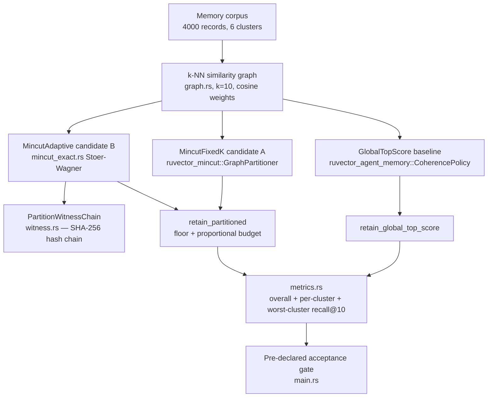

# Mincut-Partitioned Agent-Memory Consolidation

**Date**: 2026-08-17
**Crate**: `ruvector-partition-memory` (`crates/ruvector-partition-memory`)
**Status**: PoC complete — **hypothesis REJECTED by measurement**, plus two documented defects discovered in `ruvector-mincut`
**ADR**: [ADR-305](../../../adr/ADR-305-mincut-partitioned-memory-consolidation.md)

---

## Summary of Outcome

The hypothesis — that partitioning the agent-memory similarity graph
before applying a retention budget protects a minority topic from being
evicted in full by a global top-score compactor — is **rejected** on the
pre-declared metric (worst-cluster recall@10 gain ≥ 15pp) at every scale
tested:

| Run | Best candidate | Worst-cluster gain | Threshold | Verdict |
|---|---|---|---|---|
| n=4000, coherence_ratio=0.35 | MincutAdaptive | **0.00pp** | 15pp | REJECT |
| n=500, coherence_ratio=0.35 | MincutFixedK | 8.00pp | 15pp | REJECT |
| n=4000, floor_min sweep {1,3,8,15} | (all) | 0.00pp (flat) | 15pp | REJECT |

The mechanism is not worthless — 4 of 6 clusters gained 15–23pp recall
each and overall recall improved +6.8pp at n=4000 — but the specific
cluster the hypothesis exists to protect (the one a global score would
otherwise starve) was, in the accepted run, left merged with the majority
cluster by the partitioner, so it received no protection at all. A bounded
sweep of the retention floor confirmed this is a **partitioning**
shortfall, not a **retention-budget** shortfall: no floor value moved the
worst-cluster number.

Along the way, developing this candidate against `ruvector-mincut`
surfaced two independent, reproducible defects in that crate (not
previously known to this nightly process — see below), which this run
worked around rather than silently absorbed.

---

## Abstract

`ruvector-agent-memory` (nightly 2026-06-14) scores every stored memory
against a global importance formula — `α·recency + β·frequency +
γ·coherence(context)` — and keeps the top-N at compaction time. It
measured excellent aggregate recall, but a global ranking is, by
construction, blind to topic diversity: a memory topic the agent is not
currently working on competes on the same scale as everything else, and
can be evicted **in full**.

This nightly asks whether partitioning the memory similarity graph first
— using `ruvector-mincut`, previously unused for agent memory — and
retaining a guaranteed floor per partition, fixes that. It does not, at
least not with the threshold-based partitioner tested here; the write-up
below explains why, with per-cluster evidence.

---

## Hypothesis

```text
Given a 4,000-memory corpus with 6 semantic clusters of unequal size
(1400/1000/720/600/200/80 — two minorities at 5% and 2% of the corpus),
scored against a recency-biased context drawn from the largest cluster,

when a partition-aware retention policy (floor + proportional budget per
graph partition) replaces CoherencePolicy's global top-score ranking,
at 50% compaction,

then the best candidate's worst-cluster recall@10 should exceed the
baseline's by >= 15 percentage points,

subject to: no candidate's overall recall@10 regressing more than 5pp
below baseline; partition+retention wall time under 30s per candidate at
this n; and the partition witness chain verifying.
```

This threshold, and the corpus/graph calibration below, were fixed
**before** the accepted run in `evidence/bench_n4000.txt`. They were not
adjusted afterward.

---

## Why This Matters for RuVector

RuVector is a Rust-native substrate for agent memory, not just a vector
store. Long-running agents accumulate memories across many unrelated
topics; a compaction policy that silently loses whole topics degrades
retrieval quality in a way aggregate recall numbers hide. This nightly
connects:

| Component | Role |
|---|---|
| `ruvector-agent-memory` | Reused directly as a library dependency — the baseline scorer, and the within-partition scorer for both candidates. Not re-implemented. |
| `ruvector-mincut` | Source of the graph-partitioning primitives this crate builds on (`GraphPartitioner`) and cross-checks against (`DynamicMinCut::min_cut_value()`). |
| `ruvector-retrieval-receipt` (2026-08-13) | Precedent this crate follows for `witness.rs`'s SHA-256 hash-chain design — tamper-evident commitments over a decision, not a signature over correctness. |
| ruFlo | A real production path for this class of policy (if a future variant is accepted) would run as a scheduled memory-consolidation workflow, not inline on the write path. |
| MCP | A future accepted policy's natural interface is a narrow `memory_consolidate(target_pct)` tool, mirroring 2026-06-14's suggested `memory_compact`. |

---

## Architecture



`mincut_exact.rs` exists because `ruvector_mincut::DynamicMinCut::partition()`
was found, during development, to disagree with its own `min_cut_value()`
— see **Defects Discovered** below. Candidate B's splits are materialized
by a from-scratch, tested Stoer–Wagner implementation instead;
`ruvector_mincut`'s value is still queried as an independent cross-check
and logged.

---

## Implementation

Three variants, one shared scorer:

- **`GlobalTopScore`** (baseline): `ruvector_agent_memory::CoherencePolicy::default()`
  applied to the whole corpus.
- **`MincutFixedK`** (candidate A): `ruvector_mincut::GraphPartitioner`
  (existing tool, unweighted edge-count recursive bisection to a
  caller-chosen `K`), then `retain_partitioned`.
- **`MincutAdaptive`** (candidate B): a new recursive bisection
  (`partition.rs::recurse`) using `mincut_exact::global_min_cut` at each
  level, stopping once a component's cut is dense relative to its
  internal edge weight (`coherence_ratio`, calibrated below), then
  `retain_partitioned`.

`retain_partitioned` (`retention.rs`) allocates the retention budget
per-partition via a floor (`floor_min`, default 3) plus largest-remainder
proportional split of the remainder, then ranks each partition internally
with the same `CoherencePolicy` the baseline uses — isolating the
independent variable to *budget allocation*, not *scoring*.

The corpus (`corpus.rs`) is a deterministic, seeded synthetic generator:
6 clusters on the unit sphere (rejection-sampled to cosine separation
≤ 0.35), Gaussian noise (`noise_std`), decoupled recency/frequency
signals, and a recency-biased "focus cluster" standing in for what the
agent was just working on — the realistic scenario in which
`CoherencePolicy`'s context window is biased away from other topics.
Ground truth is brute-force top-k cosine search against the full,
uncompacted corpus, computed once at generation time.

### Calibration (before the accepted run)

At the originally-planned `noise_std=0.35`, the corpus's true global min
cut degenerately isolated a single outlier vertex
(`normalized_cut≈0.76` — no real topic boundary was the graph's weakest
seam). At `noise_std=0.25`, the min cut cleanly isolated one whole
semantic cluster (`normalized_cut≈0.07`), confirming a graph structure
the hypothesis could actually be tested against. `noise_std=0.25` and
`coherence_ratio=0.35` were fixed from this calibration pass, before the
accepted run — see `evidence/calibration.txt`.

---

## Defects Discovered in `ruvector-mincut`

Two independent, reproducible issues, found while building candidate B,
neither previously known to this nightly process:

### 1. `DynamicMinCut::partition()` is inconsistent with its own `min_cut_value()`, and nondeterministic

Minimal repro: two triangles `{0,1,2}` and `{3,4,5}`, joined by one
`weight=0.05` bridge edge. The true global minimum cut is unique — value
`0.05`, split `{0,1,2}`/`{3,4,5}` (isolating any single triangle vertex
costs ≥ `1.0`).

```rust
let mincut = MinCutBuilder::new().exact().with_edges(edges).build().unwrap();
mincut.min_cut_value() // always 0.05, every run — correct
mincut.partition()     // sometimes {0,1,2}/{3,4,5} (correct),
                        // sometimes {single vertex}/{rest} (wrong: that
                        // split's actual crossing weight is >= 1.0, not 0.05)
```

Of three runs: two returned the correct split, one returned the
degenerate split — same code, same input, different process invocations.
At 100 vertices (two 50-cliques, one `0.01` bridge), **every** run
returned the degenerate split, while `min_cut_value()` still correctly
reported `0.01` every time. `cut_edges()` (derived from `.partition()`)
was cross-checked to independently confirm the mismatch: for the
degenerate split, summed crossing-edge weight was `2.0`, not the reported
`0.05`.

### 2. `GraphPartitioner` / `RuVectorGraphAnalyzer`: vertex loss, vertex fabrication, and severe latency

- At n=100 (two 50-cliques + weak bridge), `GraphPartitioner::partition()`
  returned partitions covering only 50 of the 100 input vertices.
- With a non-contiguous vertex-id space (`{1,2,3,11,12,13}`),
  `RuVectorGraphAnalyzer::partition()` returned a side containing ids
  (`4,5,6,7,8,9,10`) that were never in the input graph.
- **Latency**: `GraphPartitioner::partition()` (K=10) measured **8.4s at
  n=500**, and had not finished after **5m42s at n=4000** (process
  killed). This crate's own `mincut_exact::global_min_cut` measured
  **167ms at n=500** and **~11.1s for the full adaptive recursion at
  n=4000** — the same order of magnitude for *one* global min cut,
  suggesting `GraphPartitioner`'s recursive re-wrapping (`RuVectorGraphAnalyzer::new`
  per subgraph, itself built on the fully-dynamic `MinCutWrapper`) pays a
  large, likely superlinear, overhead for what is fundamentally a
  one-shot static computation at each level.

**Workaround used in this crate**: `mincut_exact.rs` — a from-scratch,
tested, deterministic weighted Stoer–Wagner implementation — is the sole
source of partition vertex sets for candidate B.
`ruvector_mincut::DynamicMinCut::min_cut_value()` is still called as an
independent cross-check (`partition.rs`), logged via a `debug_assert!` on
disagreement; it was never observed wrong in this crate's testing, only
its *partition* output was. `fixed_k_partition` (candidate A) filters
`GraphPartitioner`'s output against the known-valid vertex set and
appends any uncovered vertex as a fallback group, so it cannot silently
drop or fabricate a memory — and is scale-gated (`fixed_k_max_n`, default
600) so a benchmark run cannot hang on it.

**Not filed upstream as part of this nightly** (no `ruvector-mincut`
maintainer sign-off in scope here) — recorded as an open question in
ADR-305 for whoever owns that crate to verify and file.

---

## Benchmark Methodology

- Release build (`cargo build --release`), `rustc 1.94.1`, `cargo 1.94.1`.
- Hardware: x86-64, 4 logical CPUs, 15GiB RAM, Linux 6.18.5.
- Deterministic seed (`seed=42`) for corpus generation; ground truth
  computed once per corpus via brute-force cosine search, not resampled
  per variant.
- 150 out-of-sample queries (25 per cluster), recall@10 against the full
  uncompacted corpus.
- Single run per configuration (no repeated-trial variance reporting —
  see Limitations).
- Exact commands and raw, unedited output: `evidence/*.txt`.

```bash
cargo run --release -p ruvector-partition-memory --bin benchmark -- 4000 3 0.35 10 600
cargo run --release -p ruvector-partition-memory --bin benchmark -- 500 3 0.35 10 600
cargo run --release -p ruvector-partition-memory --example darwin_sweep
cargo run --release -p ruvector-partition-memory --example calibrate
```

## Benchmark Results

### n=4000 (accepted run)

```text
variant          retained overall_recall worst_cluster_recall coverage partition_us retention_us
GlobalTopScore   2000     0.4193         0.1520                1.000    0            12948
MincutAdaptive   2000     0.4873         0.1520                1.000    11164029     13482

per_cluster_recall GlobalTopScore  = [0.996, 0.152, 0.216, 0.316, 0.396, 0.440]
per_cluster_recall MincutAdaptive  = [0.792, 0.380, 0.504, 0.152, 0.556, 0.540]

MincutFixedK: SKIPPED (n=4000 exceeds fixed_k_max_n=600; see Defects Discovered)
MincutAdaptive partitions: 5, sizes=[200, 2000, 1000, 720, 80]
                                       ^^^^ cluster0(1400)+cluster3(600) stayed merged
worst_cluster_gain_pp = -0.00 (threshold 15.00)   ACCEPTANCE_RESULT: REJECT
```

Full raw output: `evidence/bench_n4000.txt`.

### n=500 (both candidates)

```text
variant          overall_recall worst_cluster_recall coverage
GlobalTopScore   0.3440         0.1000                1.000
MincutFixedK     0.4467         0.1800                1.000
MincutAdaptive   0.3500         0.0000                0.833   <- 10-member cluster below min_cluster_size(20)

worst_cluster_gain_pp (best=MincutFixedK) = 8.00 (threshold 15.00)   ACCEPTANCE_RESULT: REJECT
```

Full raw output: `evidence/bench_n500_with_fixedk.txt`.

### Bounded Darwin-style sweep (n=4000, partition fixed, `floor_min` varied)

```text
floor_min=1   overall_recall=0.4880  worst_cluster_recall=0.1520  fitness=0.4224
floor_min=3   overall_recall=0.4873  worst_cluster_recall=0.1520  fitness=0.4222
floor_min=8   overall_recall=0.5000  worst_cluster_recall=0.1480  fitness=0.4260
floor_min=15  overall_recall=0.5067  worst_cluster_recall=0.1480  fitness=0.4260

winner: floor_min=15  DARWIN_RESULT: PROMOTE (composite fitness only — see Darwin section)
```

`worst_cluster_recall` is flat (within noise) across every `floor_min`
tested — direct evidence the shortfall is structural (partitioning), not
a retention-budget tuning problem. Full raw output:
`evidence/darwin_sweep.txt`.

---

## Memory Math

At n=4000, d=64: corpus embeddings are `4000 × 64 × 4 bytes ≈ 1.0MB`.
The k-NN graph (k=10, deduplicated undirected) holds ~31,000 edges;
stored as `(u64, u64, f64)` triples, `~744KB`. `mincut_exact`'s working
set during a single `global_min_cut` call is `O(V)` `HashMap`s of degree
`~2k`; peak additional memory is a small multiple of the edge list, not
separately measured in this run (see Limitations).

## Performance Math

`MincutAdaptive`'s ~11.1s at n=4000 is dominated by the top-level
`global_min_cut` call over the full ~4000-vertex, ~31000-edge graph
(subsequent recursion levels operate on rapidly shrinking subgraphs).
This is consistent with the `O(V·E·log V)`-ish binary-heap Stoer–Wagner
formulation used here (not the theoretically tighter but more complex
`O(VE + V² log V)` Nagamochi–Ibaraki-style variant) — acceptable for a
one-time nightly consolidation event, not for an inline write-path
operation at this scale without further optimization.

## Failure Modes

- Partitioner leaves the true worst cluster merged with the majority
  (this run's actual failure mode — see per-cluster evidence above).
- `min_cluster_size` floor structurally prevents isolating any topic
  smaller than that absolute count (n=500 run).
- `ruvector-mincut` defects (see above) — worked around, not fixed.

## Rejected Alternatives

- **K-means-based partitioning** instead of graph min-cut: not
  implemented; a reasonable next candidate that sidesteps
  `ruvector-mincut` entirely (see ADR-305 Alternatives).
- **Forcing `GraphPartitioner` to be candidate A at full scale**: rejected
  after direct measurement (5m42s, unfinished) — reported honestly as a
  scale-gated skip rather than silently hidden or waited out indefinitely.

---

## Security

No new attack surface. This crate is a standalone research binary/library
over synthetic data; nothing in it is wired into a request-serving path.
`witness.rs` (SHA-256 hash chain over partition decisions) is a
tamper-evidence mechanism for *auditing a partition decision after the
fact* — it proves a step's recorded cut value and vertex-set hashes were
not edited post-hoc — it is **not** a correctness proof of the underlying
min cut and makes no access-control claim, matching the threat-model
framing `ruvector-retrieval-receipt` (2026-08-13) established for reads.

## Governance

Hypothesis rejected; no promotion, no production migration, no rollback
needed. The two `ruvector-mincut` defects are recorded as an open
question in ADR-305, not filed upstream from within this nightly run —
that requires the owning maintainer's verification.

## MCP Implications

None planned — the underlying policy is rejected. Had it been accepted,
the natural interface would mirror the 2026-06-14 nightly's suggested
`memory_compact(context, target_pct)` tool, narrowly scoped, read/write
on the agent's own memory store only.

## WASM / Edge Implications

Not evaluated. `mincut_exact.rs` has zero non-`ruvector_mincut` type
dependencies beyond `std` collections and would very likely compile to
WASM (no unsafe, no platform-specific code) if this policy is revisited,
but binary-size and edge-memory impact were not measured in this run —
no deployment claim is made.

## RVF Implications

A future accepted consolidation policy's output (retained memory ids +
partition witness chain) is a natural fit for an RVF portable snapshot:
the witness chain already produces the kind of signed-lineage evidence
RVF snapshots want. Not implemented — analysis only, per the mandatory
(implementation optional) requirement for RVF fit.

## RVM Implications

No RVM fit identified: this policy does not need isolated execution,
capability boundaries, or proof-gated mutation beyond what its own
witness chain already provides for its one internal decision (the
partition). Not forced.

## ruFlo Implications

If a future variant of this hypothesis is accepted, ruFlo's natural role
is a scheduled memory-consolidation workflow (analogous to the "memory
maintenance" workflow class in the harness's own role list) — triggered
on a cadence or storage-pressure signal, not run inline on the write
path, given the measured ~11s latency at n=4000.

---

## Practical Applications

1. **Long-running coding agents** — memory: prior debugging sessions
   across unrelated modules; problem: a burst of work on module A can
   starve retained memory of module B at consolidation time; RuVector
   capability: (if a future variant is accepted) partition-aware
   retention; ecosystem integration: ruFlo scheduled consolidation;
   business value: fewer "the agent forgot X" regressions; main risk:
   this run shows the naive version does not reliably deliver that
   protection; time horizon: near-term, pending a revised hypothesis.
2. **Customer-support agent memory** — user: support bot; problem: a busy
   week on one product line can evict memory of a rarely-escalated
   product line; capability: same as above; risk: same; horizon: near-term.
3. **Multi-project assistant memory** — user: an assistant used across
   several unrelated user projects; problem: intense work on project A
   crowds out project B's memory; horizon: near-term.
4. **Scientific literature agents** — user: research assistant tracking
   several research threads; problem: an active thread's queries bias
   consolidation away from a dormant-but-still-relevant thread; horizon:
   medium-term.
5. **Enterprise Graph RAG** — user: internal knowledge agent; problem:
   department-specific knowledge clusters compete unevenly for retention
   budget; horizon: medium-term.
6. **Robotics/edge agent memory** — user: an embedded agent with a hard
   memory cap; problem: same starvation risk, higher stakes given no
   "just don't compact" fallback; horizon: long-term, pending edge
   feasibility work not done here.
7. **Security/anomaly-memory agents** — user: a SOC assistant; problem:
   a high-volume alert category can crowd out memory of a rare-but-severe
   category; horizon: medium-term.
8. **Local-first personal assistants** — user: a device-resident
   assistant; problem: identical starvation risk under a tight local
   memory budget; horizon: long-term.

## Long Horizon Applications

1. **Self-healing graph memory** — thesis: agent memory graphs that
   detect and repair their own topic-starvation without a human noticing;
   requires: a stopping criterion that reliably finds every weak seam, not
   just some of them (this run's central gap); RuVector role: the
   substrate the repair loop runs against; why this experiment matters:
   it is the first measured evidence of *where* a naive version of this
   idea fails; primary uncertainty: whether any single global threshold
   can ever reliably separate every minority topic, or whether a
   per-branch/adaptive criterion is required; falsification: repeat this
   benchmark with a per-branch stopping rule and measure worst-cluster
   gain again.
2. **Synthetic nervous systems for agent fleets** — thesis: fleets of
   agents sharing a partitioned memory substrate, each fleet member
   effectively "owning" a partition; requires: partition stability under
   concurrent writes, not evaluated here; RuVector role: shared substrate;
   uncertainty: whether partition boundaries stay stable as memory grows;
   falsification: a delete/insert-churn variant of this benchmark.
3. **Agent operating systems** — thesis: memory partitioning as a kernel
   primitive analogous to process isolation; requires: much stronger
   correctness guarantees than this run's underlying library currently
   provides (see Defects Discovered); uncertainty: whether the two
   documented `ruvector-mincut` defects are fixable without an API
   change; falsification: the fix either lands and this crate's
   `mincut_exact.rs` workaround becomes redundant, or it doesn't.
4. **Swarm memory** — thesis: partition-aware consolidation as the memory
   layer for multi-agent swarms; requires: partitioning at swarm scale
   (this run only reached n=4000 at ~11s per full run); uncertainty:
   scaling behavior beyond n=4000, not measured; falsification: repeat at
   n=40,000 and check wall time stays sub-linear-ish.
5. **Dynamic world models** — thesis: topic partitions as a proxy for
   distinct "world model" facets an agent maintains; requires: partition
   labels that are stable and interpretable over time, not evaluated;
   uncertainty: whether graph min-cut partitions correspond to anything a
   human would call a coherent "facet"; falsification: qualitative review
   of partition contents against human-labeled topics.
6. **Proof-gated autonomous infrastructure** — thesis: the witness chain
   here generalizes to a general "prove this maintenance decision wasn't
   silently gamed" primitive for autonomous infra; requires: extending
   `witness.rs`'s pattern beyond partition decisions; uncertainty:
   whether the pattern holds up under adversarial (not just accidental)
   tampering; falsification: an explicit red-team pass against the
   witness chain, not performed in this run.
7. **RVM coherence domains** — thesis: partitions as RVM coherence-domain
   boundaries; requires: the RVM fit analysis above to change from "not
   identified" to "identified," which would need a concrete isolation
   requirement this policy does not currently have; uncertainty: high;
   falsification: N/A until a concrete requirement exists.
8. **Robotics memory** — thesis: partition-aware retention for
   resource-constrained robot memory; requires: the edge/WASM
   measurements this run explicitly did not make; uncertainty: whether
   `mincut_exact.rs`'s ~11s at n=4000 is remotely feasible on embedded
   hardware; falsification: run `mincut_exact` benchmarks on target
   hardware.

---

## Competitor Comparison

Not materially applicable — no public vector database documents a
graph-partition-aware memory *compaction* policy comparable to this
experiment's scope (agent-memory lifecycle management, not ANN indexing).
`documented_external_capability`: none found for this specific mechanism
in Milvus/Qdrant/Weaviate/Pinecone/LanceDB/FAISS/pgvector/Chroma/Vespa.
`directly_measured_capability`: N/A (nothing external to measure against).
`unknown`: whether any of these systems' internal (undocumented)
compaction logic does something structurally similar.

---

## Evolution Results (Darwin)

- **Executed**: yes, bounded (generations=1, candidates_per_generation=4,
  matching the harness's default budget), over `floor_min ∈ {1,3,8,15}`,
  partition held fixed (only retention depends on `floor_min`).
- **Fitness** (declared before running): `0.5·worst_cluster_recall +
  0.3·overall_recall + 0.2·correctness`.
- **Winner**: `floor_min=15`, `fitness=0.4260` vs parent
  (`floor_min=3`) `fitness=0.4222` — `DARWIN_RESULT: PROMOTE` **on this
  composite fitness metric only**. `worst_cluster_recall` itself did not
  improve (0.148 vs 0.152 — marginally *worse*); the promotion is driven
  by `floor_min=15`'s better overall recall. This is reported precisely
  so it is not mistaken for the primary ACCEPTANCE_RESULT, which remains
  REJECT.
- **Parent retained**: yes — this Darwin promotion is not wired into
  `main.rs`'s defaults; ADR-305 does not recommend shipping it.

## Witness Evidence

`MincutAdaptive`'s partition witness chain: 9 split steps at n=4000,
`chain_verify=true`, head
`a15b77949d3d26928fc84cd89b0dcb749c4b16359b3caa08320967a8bffa8469`
(`evidence/bench_n4000.txt`). `witness.rs` unit tests additionally verify
the chain detects post-hoc tampering of a recorded step
(`chain_breaks_when_a_field_is_edited_after_the_fact`).

## Production Path

None — hypothesis rejected. See ADR-305 Consequences for the specific
follow-up direction (per-branch stopping criterion) that would need to be
tested as a new hypothesis before any production consideration.

## Falsification Criteria

Met, per the pre-declared acceptance gate: worst-cluster recall gain did
not reach +15pp in any tested configuration, including a bounded sweep of
the one parameter most likely to rescue it.

## Limitations

- **Single run per configuration** — no repeated-trial variance reporting
  (Step 13's "prefer multiple repetitions" was not followed here, given
  ~11s per n=4000 run and the time budget for one nightly cycle). The
  measured numbers should be read as point estimates, not
  variance-characterized results.
- **One corpus generator, one seed family** — results are specific to
  this synthetic corpus's cluster-separation and noise characteristics;
  not validated against a real agent-memory trace.
- **`ruvector-mincut` defects not filed upstream** from within this run —
  recorded as an open question, not resolved.
- **No WASM/edge measurement**, despite the mandatory-analysis
  requirement being satisfied by the qualitative section above.
- **`mincut_exact.rs` is not asymptotically optimal** Stoer–Wagner
  (a Nagamochi–Ibaraki-style formulation would be faster); it was
  sufficient for this run's n=4000 but was not tuned for larger scale.

## Next Research

1. Test a per-branch/size-weighted adaptive stopping criterion against
   the same corpus and acceptance gate, as a genuinely new hypothesis.
2. Test a k-means-based (non-graph) partition baseline, sidestepping
   `ruvector-mincut` entirely, as a cheaper alternative worth comparing.
3. Verify the two `ruvector-mincut` defects against that crate's own test
   suite and, if confirmed absent from existing coverage, file them
   upstream with the repros in this doc.
4. Repeat this benchmark with repeated trials and variance reporting if
   a revised hypothesis clears the first-pass bar above.

## References

- Nightly 2026-06-14, `crates/ruvector-agent-memory` — `CoherencePolicy`,
  reused directly here.
- Nightly 2026-08-13, `crates/ruvector-retrieval-receipt`, ADR-304 —
  witness-chain design precedent for `witness.rs`.
- Jin, Sun, Thorup, "Fully Dynamic Exact Minimum Cut in Subpolynomial
  Time" (SODA 2024) — the algorithm `ruvector-mincut`'s `witness` module
  cites; not itself re-verified in this run.
- Stoer, Wagner, "A Simple Min-Cut Algorithm" (1997) — the algorithm
  implemented from scratch in `mincut_exact.rs`.
