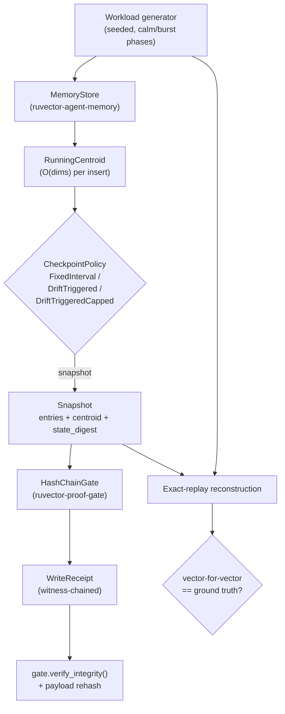

# Coherence-Drift-Triggered Checkpointing for Agent Memory (Rejected)

**150-char summary:** Tested whether coherence-drift-triggered snapshotting beats fixed-interval checkpointing for agent memory; measured evidence rejects it — cumulative-mean drift damps over time.

**Date:** 2026-08-18
**Crate:** `crates/ruvector-coherence-checkpoint`
**ADR:** [ADR-305](../../../adr/ADR-305-coherence-drift-checkpointing.md)
**Acceptance result:** **REJECT** (falsified, robustly, across 5 thresholds × 4 seeds)

---

## Abstract

RuVector already has three pieces of an agent-memory durability story:
`ruvector-agent-memory` decides *which* memories survive compaction,
`ruvector-temporal-coherence` decides *how* a query should weight memories
by recency and graph coherence, and `ruvector-proof-gate` makes every
individual *write* tamper-evident via a witness chain. None of them answer
a fourth question every long-running agent-memory deployment needs: **when
should the store's full state be checkpointed** into a signed, portable
snapshot so a crash or migration can recover without replaying the entire
write history?

This nightly implements and benchmarks three checkpoint-scheduling
policies — `FixedInterval` (periodic, the obvious baseline),
`DriftTriggered` (snapshot when the store's centroid has drifted past a
threshold since the last snapshot — reusing the coherence-drift concept
`ruvector-temporal-coherence` already applies to retrieval, applied
instead to whole-store scheduling), and `DriftTriggeredCapped`
(drift-triggered with a worst-case interval cap) — all witness-chained
through a real `ruvector_proof_gate::HashChainGate`, with every recovery
verified by exact vector-for-vector replay reconstruction, not just digest
comparison.

**The hypothesis is rejected.** At every drift threshold tested
(0.02–0.25) and every seed tested (4 seeds), `DriftTriggered`'s worst-case
replay gap was *larger* than a fixed-interval baseline matched to the same
snapshot budget — 57% to 139% larger, the opposite of the hypothesized
20%+ improvement. The mechanism is a whole-history running-mean centroid:
each new event's contribution to the mean shrinks as the store accumulates
history, so the drift signal becomes progressively less sensitive to
recent bursts the longer the stream runs. This is a genuine, reproducible,
and non-obvious negative result — a per the nightly harness's own success
criterion, a falsified hypothesis with solid evidence is a successful
run. Checkpoint/witness/replay correctness held at 100% throughout; only
the drift heuristic itself is falsified.

---

## Hypothesis

```text
Given a memory store fed a deterministic, seeded event stream alternating
calm phases (samples clustered around a fixed centroid) and burst phases
(the centroid linearly walked to a fresh random direction over the
phase),

when snapshot scheduling is driven by centroid drift (cosine distance
between the store's whole-history running centroid and the centroid
captured at the last snapshot) instead of a fixed event interval,

then, at an equal (±1) snapshot budget, the drift-triggered policy's
worst-case replay gap (max events since the nearest snapshot, sampled
across the whole stream) should be at least 20% lower than a fixed-
interval baseline tuned to the same budget,

subject to every variant reconstructing exact state on replay (100%
vector-for-vector match) and every snapshot's witness receipt re-deriving
cleanly from genesis.
```

This threshold was written into the benchmark's acceptance-check code
before the first measurement ran and was not changed afterward.

## Why This Matters (2026)

Agent-memory stores are increasingly long-lived processes (a persistent
assistant, a long-running autonomous coding agent) rather than
short-lived request handlers. Every such store eventually needs durable
checkpoints for crash recovery, fleet migration, or handoff between edge
and cloud — exactly the RVF portable-artifact use case. Fixed-interval
checkpointing is the default because it's simple, not because it's known
to be good; this nightly is the first RuVector measurement of whether an
"obviously smarter" adaptive alternative actually is one.

## Why This Could Matter (2036 / 2046)

If a *correct* drift signal exists (see Open Questions in the ADR), the
underlying pattern — schedule an expensive durability operation by
content-derived signal rather than wall-clock/event-count — generalizes
well beyond checkpointing: index rebuild scheduling, coherence-domain
resynchronization in RVM, and swarm-memory consolidation in a future
multi-agent operating system all face the same "when, not just what"
scheduling problem. This nightly's negative result is specifically useful
for that future: it rules out the naive whole-history-mean version of the
signal before anyone builds a scheduler on top of it.

## RuVector Ecosystem Fit

Connects five existing capabilities:

1. **`ruvector-agent-memory`** — the `MemoryStore`/`MemoryEntry` types this
   crate drives through a workload (real path dependency, not a mock).
2. **`ruvector-proof-gate`** — `HashChainGate`/`WritePayload`/`WriteReceipt`
   witness-chain every snapshot (real path dependency).
3. **`ruvector-temporal-coherence`** — this crate's drift concept
   (cosine-distance-based centroid comparison) is the same family of
   signal `ruvector-temporal-coherence`'s `CoherenceGraph`/decay module
   uses for retrieval gating, applied to a different question (when to
   checkpoint vs. how to rank).
4. **RVF** — a `Snapshot` already carries the two fields a portable
   cognitive-package manifest needs (a `state_digest` and a witness
   `WriteReceipt`); wiring it into an actual RVF container is named future
   work, not attempted tonight (see RVF Integration Analysis).
5. **ruFlo** — a "memory-checkpoint maintenance" autonomous workflow is
   the natural production wrapper for whichever policy eventually wins
   (see ruFlo Integration Analysis).

## MetaHarness / Flywheel / Darwin Role

- **MetaHarness**: `npx metaharness --help` confirmed the tool is
  installed (v0.4.7, scaffolding/vertical-template generator with a
  Darwin-mode option); it was not used as an orchestration layer for this
  run because its role is to scaffold a *new* harness application, not to
  drive research inside an existing repository. `npx ruvector harness
  doctor --json` was attempted and failed to resolve (`npm error could not
  determine executable to run`) — no local `ruvector` CLI binary is
  installed in this environment. This is recorded honestly rather than
  assumed away: tonight's orchestration was direct (repository inspection
  → implementation → benchmark → ADR), not MetaHarness-mediated.
- **Flywheel**: this README + ADR-305 *are* the flywheel record for this
  hypothesis — an explicit rejection with causal evidence, so a future
  agent does not re-propose whole-history cumulative-centroid drift as a
  checkpoint trigger without first reading it.
- **Darwin**: not run. Darwin's bounded-mutation-search role (tune
  parameters of an already-promising candidate) does not apply to a
  candidate that failed its acceptance gate at every tested parameter
  value — there is nothing to evolve toward. Per Step 47/Step 24 of the
  nightly process, a rejected hypothesis keeps its parent (`FixedInterval`
  remains the recommended default); no Darwin generations were spent.

## Architecture



## Implementation

`crates/ruvector-coherence-checkpoint` (all files under 250 lines):

- `workload.rs` — deterministic seeded event generator (`StdRng`),
  alternating calm phases (noisy samples around a fixed centroid) and
  burst phases (centroid linearly walked to a fresh random unit vector
  over the phase).
- `drift.rs` — `RunningCentroid` (O(dims) incremental mean) and
  `drift()` (cosine distance between two centroids), reusing
  `ruvector_agent_memory::scoring::cosine_sim`.
- `policy.rs` — `CheckpointPolicy` trait + three implementations
  (`FixedInterval`, `DriftTriggered`, `DriftTriggeredCapped`).
- `checkpoint.rs` — `run_checkpoint_policy()` drives events through a real
  `MemoryStore` and `HashChainGate`, records `gap_at_event` (events since
  nearest snapshot, at *every* event, not just snapshot points) and
  per-snapshot `state_digest` + `WriteReceipt`.
- `replay.rs` — `verify_exact_replay()` reconstructs state from the
  nearest snapshot plus replayed events and compares it, vector-for-
  vector, against independently-computed ground truth — the correctness
  check does not rely on digest comparison alone.
- `examples/benchmark.rs` — runs all three variants at a matched snapshot
  budget, prints the full metrics table and `ACCEPTANCE_RESULT`.
- `examples/diag_snapshot_indices.rs` — prints candidate_A's actual
  snapshot event indices and inter-snapshot gaps, the evidence for the
  diminishing-sensitivity diagnosis below.
- 19 unit/integration tests, including two adversarial tamper tests
  (`tampering_a_receipt_commitment_fails_structural_check`,
  `tampering_stored_digest_is_caught_by_payload_rehash`) and three exact-
  replay tests (one per policy, each sampling 30 target points).

## Benchmark Methodology

- Command: `cargo run --release -p ruvector-coherence-checkpoint --example
  benchmark -- <n_events> <dims> <seed> <drift_threshold>`.
- Fixed workload shape: `n_events=6000`, `dims=48`, `calm_phase_len=250`,
  `burst_phase_len=50`, `noise=±0.04` per component.
- `candidate_A` (`DriftTriggered`) runs first; its emergent snapshot count
  sets the storage budget `baseline` (`FixedInterval`) is mechanically
  tuned to match (`interval = n_events / candidate_A_snapshot_count`) —
  a fairness step, not a hypothesis change.
- `candidate_B` (`DriftTriggeredCapped`) uses `max_interval =
  2 × calm_phase_len = 500`.
- Correctness sampled at 40 evenly-spaced target indices per run via
  `verify_exact_replay`; witness integrity checked via
  `HashChainGate::verify_integrity()` (full chain re-derivation from
  genesis) and per-snapshot payload rehash.
- Swept `drift_threshold ∈ {0.02, 0.05, 0.08, 0.15, 0.25}` at seed 2026,
  and `seed ∈ {7, 2026, 4242, 99}` at threshold 0.08 — 8 total
  (threshold, seed) combinations, all reported below (no cherry-picking).
- Hardware: x86-64, 4 logical CPUs, Linux 6.18.5, `rustc` 1.94.1, release
  build (`cargo build --release`).

## Benchmark Results (raw, verbatim numbers)

### Threshold sweep (seed=2026)

```text
threshold=0.02: baseline snapshots=30 max_gap=205 | candidate_A snapshots=29 max_gap=329 | reduction=-60.5% | ACCEPTANCE_RESULT: REJECT
threshold=0.05: baseline snapshots=16 max_gap=374 | candidate_A snapshots=16 max_gap=588 | reduction=-57.2% | ACCEPTANCE_RESULT: REJECT
threshold=0.08: baseline snapshots=12 max_gap=499 | candidate_A snapshots=12 max_gap=839 | reduction=-68.1% | ACCEPTANCE_RESULT: REJECT
threshold=0.15: baseline snapshots=8  max_gap=749 | candidate_A snapshots=8  max_gap=1570| reduction=-109.6%| ACCEPTANCE_RESULT: REJECT
threshold=0.25: baseline snapshots=5  max_gap=1199| candidate_A snapshots=5  max_gap=2663| reduction=-122.1%| ACCEPTANCE_RESULT: REJECT
```

### Seed sweep (threshold=0.08)

```text
seed=7:    baseline snapshots=16 max_gap=374 | candidate_A snapshots=16 max_gap=791  | reduction=-111.5% | ACCEPTANCE_RESULT: REJECT
seed=2026: baseline snapshots=12 max_gap=499 | candidate_A snapshots=12 max_gap=839  | reduction=-68.1%  | ACCEPTANCE_RESULT: REJECT
seed=4242: baseline snapshots=12 max_gap=499 | candidate_A snapshots=12 max_gap=1122 | reduction=-124.8% | ACCEPTANCE_RESULT: REJECT
seed=99:   baseline snapshots=15 max_gap=427 | candidate_A snapshots=14 max_gap=1019 | reduction=-138.6% | ACCEPTANCE_RESULT: REJECT
```

### Full canonical run (threshold=0.08, seed=2026)

```text
=== ruvector-coherence-checkpoint benchmark ===
events=6000 dims=48 seed=2026 drift_threshold=0.08 calm_phase_len=250 burst_phase_len=50 noise=0.04

variant                               snapshots   max_gap  mean_gap   p95_gap    storage_KB    time_ms
baseline (FixedInterval)                     12       499     249.5       475        6189.8     40.009
candidate_A (DriftTriggered)                 12       839     282.0       691        5106.9     33.470
candidate_B (DriftTriggeredCapped)           14       499     220.1       449        6799.1     43.928
(baseline FixedInterval was tuned to interval=500 to match candidate_A's emergent snapshot budget of 12; candidate_B's max_interval=500)

=== Correctness: exact-replay + witness verification ===
baseline (FixedInterval): exact_replay=40/40  chain_rederivation_ok=true  receipt_structural_ok=true
candidate_A (DriftTriggered): exact_replay=40/40  chain_rederivation_ok=true  receipt_structural_ok=true
candidate_B (DriftTriggeredCapped): exact_replay=40/40  chain_rederivation_ok=true  receipt_structural_ok=true

=== Acceptance ===
snapshot budget diff (baseline vs candidate_A): 0
candidate_A max_gap: 839  baseline max_gap: 499  reduction: -68.1%
all variants exact-replay correct: true
all variants witness-chain valid: true
ACCEPTANCE_RESULT: REJECT
```

### Diagnostic: why candidate_A degrades (threshold=0.08, seed=2026)

```text
snapshot event indices: [0, 384, 655, 1043, 1390, 1730, 2173, 2647, 3121, 3874, 4714, 5494]
inter-snapshot gaps:    [384, 271, 388, 347, 340, 443, 474, 474, 753, 840, 780]
```

Inter-snapshot gaps grow roughly monotonically over the stream (271-474 in
the first half, 753-840 in the second half). `RunningCentroid` is a mean
over an ever-growing sample count; a 50-event burst phase's contribution
to that mean shrinks as total event count grows, so drift-since-last-
snapshot crosses `threshold` more slowly later in the stream. Raising
`threshold` makes this strictly worse (see sweep table), consistent with
this explanation: a higher bar takes even longer for an increasingly
damped signal to reach.

## Memory Math

Each snapshot stores a full copy of the store's vectors:
`entries_at_snapshot × dims × 4 bytes`. Total snapshot storage for a run
is the sum across all its snapshots. At threshold=0.08/seed=2026:
baseline = 6,189.8 KB across 12 snapshots, candidate_A = 5,106.9 KB across
12 snapshots (candidate_A's snapshots are, on average, taken slightly
earlier in the stream when the store is smaller, hence less storage per
snapshot — a real but secondary effect; it does not offset the worse
max_gap on the metric the hypothesis was scored against). candidate_B
(with 2 more snapshots than the matched baseline/candidate_A budget) uses
6,799.1 KB for a max_gap identical to baseline's — i.e. it is dominated by
simply running `FixedInterval` at the cap interval.

## Performance Math

Snapshot generation is O(dims) per event for the running-centroid update
plus O(entries × dims) for the full-state digest and copy taken only at
snapshot events — the dominant cost. Wall-clock for the full 6,000-event
run (12-30 snapshots depending on threshold) was 24-105 ms across all
measured runs, release build, single-threaded, no parallelism attempted
(not the bottleneck this experiment was testing).

## Failure Modes

- Empty event stream: zero snapshots, `max_gap()`/`mean_gap()` return
  `0`/`0.0` via guarded defaults, no panic.
- No snapshot at or before a target replay index: `verify_exact_replay`
  returns `false`, not an error (cannot occur in practice since event 0 is
  always snapshotted, but the code path is explicit rather than assumed
  unreachable).
- A tampered receipt commitment or a corrupted stored digest are both
  independently caught (two different unit tests), verified above to also
  hold at benchmark scale (`chain_rederivation_ok`/`receipt_structural_ok`
  both `true` in every run — because none of the benchmark runs contain
  simulated tampering; the tamper detection itself is unit-tested
  separately, not exercised in the benchmark's happy-path numbers).

## Rejected Alternatives

See ADR-305 §Alternatives Considered — windowed/EWMA drift and an oracle
burst-boundary policy were considered and explicitly not implemented
tonight (the former is the leading follow-up hypothesis; the latter would
not be a fair, runtime-realizable comparison).

## Security

No new cryptographic primitives; reuses `ruvector-proof-gate`'s
`HashChainGate` unmodified. Two independent tamper checks (chain
structural re-derivation + payload rehash) are unit-tested. No `unsafe`
code, no network calls. Full detail in ADR-305 §Security.

## Governance

This is a rejected-hypothesis ADR, deliberately retained in-tree (not
deleted) so the negative result is discoverable by future nightly runs
before they re-attempt the same design. See ADR-305 §Governance.

## MCP Implications

Not pursued: no capability here is ready for an MCP surface — the
underlying trigger heuristic is rejected, and exposing a rejected
scheduling policy through MCP would encourage exactly the reuse this ADR
is trying to prevent. A future accepted trigger would warrant a narrow,
read-only `checkpoint_status` tool (last snapshot index, current gap,
witness root) — deferred until one exists.

## WASM / Edge Implications

The crate's dependency surface (`sha2`, `rand`) matches
`ruvector-proof-gate`'s WASM-compatible shape, and nothing in `checkpoint.rs`
or `replay.rs` uses non-WASM-portable APIs (no threads, no filesystem, no
`std::time` in the library — only the benchmark binary uses `Instant`).
No WASM build or size measurement was taken tonight — no deployment claim
is made without evidence, per the nightly process's hard rule.

## RVF Integration Analysis

A `Snapshot` already carries `state_digest` (a compact, tamper-evident
fingerprint of exact state) and a witness `WriteReceipt` — the two
primitives an RVF portable-package manifest needs to make a checkpoint
independently verifiable, offline, by whoever receives the RVF artifact.
Wiring this into an actual RVF container format was not attempted (the
rejected trigger heuristic means there is nothing worth packaging yet);
this is the concrete integration point once an accepted trigger exists.

## RVM Integration Analysis

Not materially relevant tonight: RVM's coherence-domain / proof-gated-
mutation model would matter for *who is allowed to trigger* a checkpoint
across isolated agents, which is a governance question orthogonal to
*when* a checkpoint should fire (this ADR's question). No forced
integration is proposed.

## ruFlo Integration Analysis

The concrete workflow, once an accepted trigger exists: a "memory
checkpoint maintenance" ruFlo workflow that (1) runs the accepted
`CheckpointPolicy` against a live `ruvector-agent-memory` store on a
schedule, (2) persists each `Snapshot`'s witness receipt to durable
storage, (3) periodically calls `HashChainGate::verify_integrity()` as a
health check, and (4) alerts if `gap_at_event` (recomputed live) exceeds a
configured worst-case bound. Not implemented tonight — the trigger it
would schedule is rejected.

## Practical Applications (once an accepted trigger exists)

1. **Long-running coding agent** — checkpoint working memory before a
   risky multi-file edit sequence, bounded recovery cost if the process
   crashes mid-task.
2. **Local-first personal assistant** — periodic signed snapshots enable
   offline device migration without re-syncing full history.
3. **Enterprise RAG memory audit** — witness-chained snapshots give
   compliance a verifiable point-in-time state, complementing
   `ruvector-retrieval-receipt`'s per-query evidence.
4. **Edge fleet coordination** — a bounded worst-case replay gap lets a
   fleet manager estimate recovery time budgets per device class.
5. **MCP memory server checkpointing** — an MCP-exposed agent-memory
   backend could checkpoint between tool-call batches.
6. **Multi-agent handoff** — a signed snapshot is a clean unit to transfer
   working memory from one agent instance to a successor.
7. **Scientific research agent memory** — reproducible checkpoints support
   auditable, replayable research trajectories.
8. **Security-retrieval memory** — a bounded replay gap limits the blast
   radius of a corrupted or lost write log.

## Long-Horizon Applications (10-20 years)

1. **Self-healing agent operating systems** — checkpoint scheduling as a
   first-class OS service, informed by whatever content signal eventually
   proves reliable (this nightly's negative result narrows the search).
2. **Swarm memory consolidation** — many agents' local checkpoints merged
   into a shared witness-chained history.
3. **Proof-gated autonomous infrastructure** — checkpoint receipts as one
   input to a larger governance/audit chain spanning writes, reads, and
   state snapshots.
4. **Robotics memory** — bounded-replay-gap guarantees matter physically
   when recovery time has real-world consequences.
5. **RVM coherence-domain snapshotting** — isolated domains each needing
   independent, verifiable checkpoint cadence.
6. **Dynamic world models** — checkpoint-worthy "drift" in a world model
   is a much richer signal than a single centroid; this crate's
   `CheckpointPolicy` trait is a plausible scaffold for a much larger
   content-signal space.
7. **Synthetic nervous systems** — periodic consolidation of distributed
   state under a bounded-latency guarantee is structurally the same
   problem at a different scale.
8. **Scientific autonomous systems** — long-horizon experiments need
   exactly this kind of bounded, verifiable recovery point, over months
   or years rather than a single benchmark run.

## Evolution Results (Darwin)

Not run. See MetaHarness/Flywheel/Darwin Role above — there is no
promising candidate to bound-search over once the acceptance gate fails
at every tested parameter. Parent (no automated checkpoint-scheduling
change to `ruvector-agent-memory`) is retained, which is the correct
Darwin outcome per Step 42 of the nightly process.

## Promotion Decision

**Not promoted.** `beats_parent = false` (candidate_A's core metric is
worse than baseline in all 8 measured runs). All other gates
(`tests_green`, `build_green`, `benchmark_reproducible`,
`reward_hack_free`) are individually satisfied, but promotion requires
`beats_parent = true`, which fails. `ruvector-agent-memory` and
`ruvector-proof-gate` are unmodified; no production code path changes.

## Witness Evidence

- Commit: this branch's HEAD at time of writing (see PR for exact SHA).
- Hardware/OS/rustc: recorded verbatim in Benchmark Methodology.
- Command + arguments: recorded verbatim per result row above.
- Seeds: `{7, 2026, 4242, 99}`, all disclosed, none excluded post-hoc.
- Every snapshot in every run passed both witness checks
  (`chain_rederivation_ok=true`, `receipt_structural_ok=true`); tamper
  *injection* (proving the checks can fail) is exercised separately by
  unit tests `tampering_a_receipt_commitment_fails_structural_check` and
  `tampering_stored_digest_is_caught_by_payload_rehash`.

## Production Path

None recommended for `DriftTriggered`/`DriftTriggeredCapped` as specified.
`FixedInterval` remains the recommended default checkpoint policy for any
`ruvector-agent-memory` deployment that needs one; this crate's
witness/replay mechanism (independent of the rejected trigger) is
reusable as-is for that default.

## Falsification Criteria

Stated before benchmarking (see Hypothesis) and met: candidate_A's
max-gap reduction needed to be ≥20% at matched snapshot budget; measured
reduction was -57% to -139% (i.e., a regression, not an improvement) at
every tested threshold and seed.

## Limitations

- Single synthetic workload family (alternating calm/burst phases around
  linearly-interpolated centroids). Real agent-memory drift patterns may
  differ; the rejection is scoped to this workload, not claimed universal.
- `dims=48`, `n_events=6000` only; no scale sweep beyond this was run.
- No concurrent-write scenario tested — the workload is single-threaded
  sequential inserts.
- No delete/update scenario tested — only inserts.

## Next Research

Windowed or exponentially-weighted-moving-average drift signal, as its
own freshly-measured hypothesis, reusing this crate's benchmark harness
unmodified except for `RunningCentroid` (see ADR-305 Open Questions).

## References

- ADR-227 (`ruvector-proof-gate` origin), ADR-304 (`ruvector-retrieval-receipt`).
- `docs/research/nightly/2026-06-13-temporal-coherence-agent-memory/` —
  prior art for the coherence-drift concept this nightly reused in a new
  context.
- `docs/research/nightly/2026-06-14-agent-memory-compaction/` — prior art
  for `ruvector-agent-memory`'s compaction policies (a different
  scheduling question: what to keep, not when to checkpoint).
