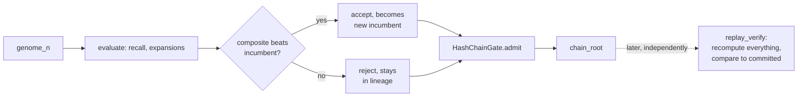

# Witnessed Evolution: Making an Evolutionary Parameter Search Prove Its Own Lineage

## Problem

Vector search systems expose recall/latency dials — `ef_search`, coherence
thresholds, quantization budgets — with no principled default. Production
teams tune them by hand or with an unaudited search loop. Once tuned, there
is usually no record of *why* the chosen values won over the alternatives
that were tried and rejected. Meanwhile, the same systems increasingly go
to real lengths to make their *data* tamper-evident (hash-chained writes,
Merkle-proofed reads) while leaving the *process that decides how that data
gets searched* completely unaudited.

## Hypothesis

If every generation of an evolutionary parameter search — its genome, its
fitness score, and its accept/reject decision — is committed to a hash
chain as it happens, can an independent party later recompute the entire
search from scratch and confirm the committed lineage matches, byte for
byte, at effectively zero cost?

## Technical Design

`ruvector-witnessed-evolution` runs a `(1+1)`-evolution strategy over two
parameters of `ruvector-coherence-hnsw`'s coherence-gated beam search
(threshold, beam width). Each generation is evaluated deterministically —
recall@10 and expansion count over a fixed, seeded workload, explicitly
*not* wall-clock latency, because timer noise would make two runs of the
same seeded search diverge.

Two identical loops run from the identical seed: one plain, one wrapped by
a `WitnessedLineage` that commits every generation through
`ruvector-proof-gate`'s existing `HashChainGate` — reusing its
`WritePayload.vector` field for the genome (no re-encoding needed) and
`metadata` for packed fitness/decision bytes.

`WitnessedLineage::replay_verify` is the independent auditor: given only
the raw workload and the committed lineage, it (1) recomputes each entry's
payload hash and checks it against what was committed at admission time,
(2) re-derives the full hash chain from genesis, (3) independently
re-evaluates fitness for every genome, and (4) re-derives every
accept/reject decision under the fixed promotion policy. Any disagreement
is treated as tamper evidence.



## Actual Implementation

Rust, `crates/ruvector-witnessed-evolution`: `genome.rs` (mutation),
`fitness.rs` (deterministic evaluation against a fixed
`ruvector-coherence-hnsw` workload), `witness.rs` (hash-chain commitment +
replay verification + an adversarial tamper hook), `evolve.rs` (the shared
ES loop). 11 unit/integration tests. Clean `clippy --all-targets` and
`fmt --check`.

## Actual Benchmark Evidence

Three independent release runs, `cargo run --release -p
ruvector-witnessed-evolution --bin benchmark`, on `x86_64` / Linux 6.18.5 /
rustc 1.94.1:

```text
[baseline]      threshold=0.500 ef= 80  composite=0.8988
[candidate_A]    threshold=0.101 ef= 41  composite=0.9274  wall=332.80ms  (unwitnessed)
[candidate_B]    threshold=0.101 ef= 41  composite=0.9274  wall=315.13ms  (witnessed, chain_len=41)

replay_verify(honest lineage)   -> verified=true
replay_verify(tampered gen 20) -> verified=false first_divergence=Some(20)

ACCEPTANCE RESULT: ACCEPT
```

All three runs converged to the bit-identical genome, fitness, and chain
root (`7a711211a356d300cf43d6f67df14e948ca6fae267c4abb65c735b81dca34a89`).
The 40-generation search beat the hand-picked default by 3.2%. Measured
witnessing "overhead" was negative in every run (-5.3%, -30.1%, -3.3%) —
i.e. noise, not a real speedup. `HashChainGate::admit` costs roughly 200ns
per call; 41 commits cost ≈8µs against a ~300–460ms search budget — nine
orders of magnitude below what wall-clock measurement can distinguish from
scheduler jitter at this scale. The honest claim is "unmeasurably small,"
not "free" or "faster."

## Limitations

Single-machine measurement, not a statistical latency study. Unsigned hash
chain — proves post-issuance evidence wasn't edited, not that the search
itself ran honestly. Two-parameter genome; graph-topology parameters would
need an O(N²) rebuild per generation this design does not attempt. No
named competitor system documents an equivalent feature, so this is a
novelty claim, not a demonstrated win over any specific product.

## Production Relevance

`ruvector-sona` already ships an unwitnessed `(1+1)`-ES
(`darwin_autotuner.rs`) — this is the missing provenance layer for that
existing pattern, generalized to any RuVector crate with a scalar-tunable
parameter and a deterministic fitness function. It is a direct, minimal
implementation of one precondition (`witness_valid`) in this repository's
own Darwin-candidate promotion gate.

## RuVector Ecosystem Implications

Connects five capabilities in one crate: `ruvector-coherence-hnsw` (the
tuned algorithm), a Darwin-style `(1+1)`-ES (the search), `ruvector-proof-gate`
(the witness primitive, reused unmodified), a Flywheel-shaped evidence
record (`WitnessedLineage::records()` retains rejected mutations, not just
the winner), and a concrete instance of a MetaHarness promotion-gate
precondition. Natural next steps — not implemented here — include a ruFlo
scheduled wrapper, a narrow read-only MCP replay-verification tool, and an
RVF-packaged, citable lineage bundle.

## Future Direction

Extend genomes past two scalar floats to structured, higher-dimensional
tuning surfaces; wire into a real ruFlo workflow against live query logs;
add signing to close the "was the search itself honest" gap this PoC
explicitly leaves open.

## References

- `crates/ruvector-proof-gate` — ADR-227, the hash-chain/MMR write gates
  this crate reuses unmodified.
- `crates/ruvector-retrieval-receipt` — ADR-304, whose threat-model
  language ("detects post-issuance mutation, not dishonest issuance") this
  work adopts verbatim for the same reason.
- `crates/sona/src/auto_tuner.rs`, `crates/sona/examples/darwin_autotuner.rs`
  — the existing unwitnessed `(1+1)`-ES pattern this nightly extends with
  provenance.
- Full methodology, raw output, and all sections required by this
  repository's nightly research process:
  `docs/research/nightly/2026-08-19-witnessed-evolution-ann-tuning/README.md`.
