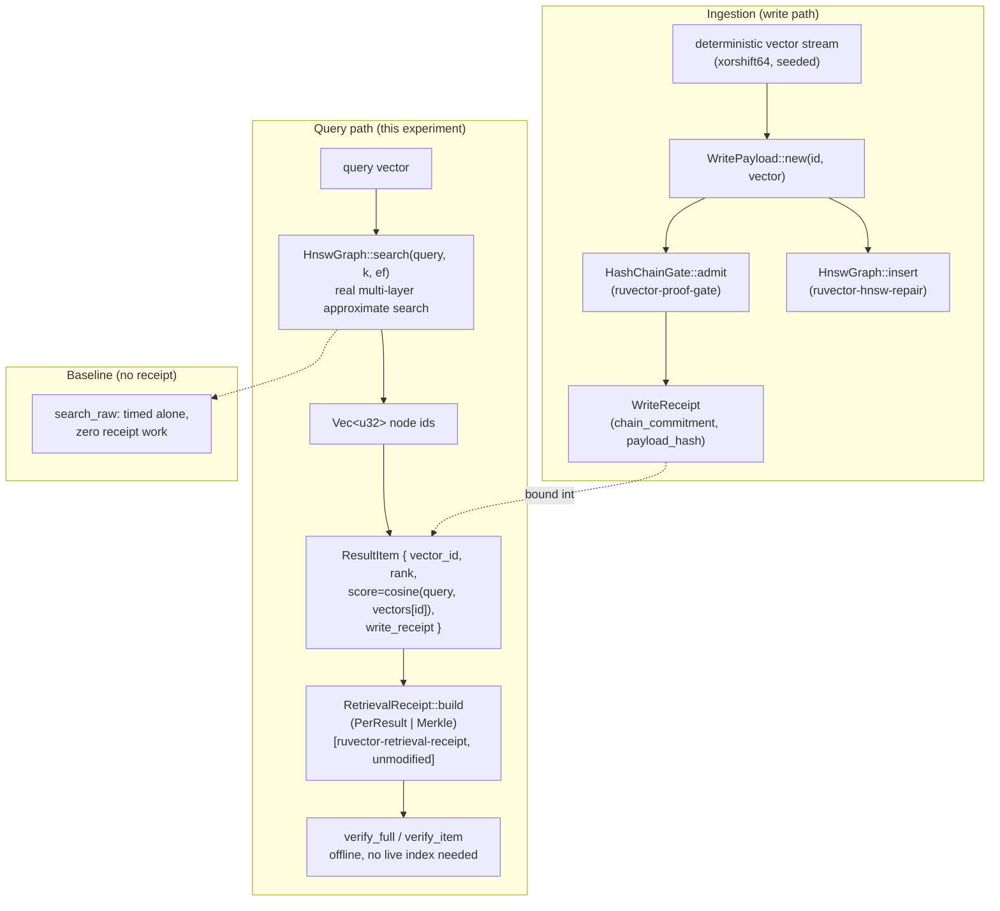

# Nightly Research: Witness-Chained Retrieval Receipts on a Real Multi-Layer HNSW Index

**Date:** 2026-08-26
**Slug:** `hnsw-witness-receipts`
**Crate:** `crates/ruvector-hnsw-receipt`
**Status:** ACCEPT (see Acceptance Result)

## Summary

`ruvector-retrieval-receipt` (2026-08-13, ADR-304) proved that witness-chained
provenance receipts detect 100% of tested tampering on ANN result sets, but
deliberately measured overhead against a *brute-force* index to isolate the
provenance layer's cost from ANN recall. Both that nightly report and ADR-304
explicitly flagged the unanswered question: does the overhead ratio hold up
against a *real* approximate index, where search cost no longer dominates the
way an O(n) brute-force scan does?

This run answers it. `ruvector-hnsw-receipt` composes the exact same receipt
cryptography (`PerResultReceipt`, `MerkleReceipt` — reused via dependency, not
reimplemented) on top of `ruvector-hnsw-repair::HnswGraph`, a real from-scratch
multi-layer HNSW graph (Malkov & Yashunin 2018) with bounded node degree and
`ef`-bounded search. Measured receipt-build overhead is **1.3%–4.7%** of raw
HNSW search p50 latency across two scales (N=5,000/dim=64 and N=20,000/dim=128)
— an order of magnitude under both this experiment's pre-registered 50%
acceptance bar and ADR-304's original 15% rejection threshold for this exact
follow-up measurement.

## Abstract

Retrieval receipts add tamper-evidence to ANN query results by committing
each result set to a hash chain or Merkle tree. The open question was whether
this is "free" only because it was measured against an artificially expensive
brute-force baseline. We ingest vectors through a real
`ruvector_proof_gate::HashChainGate` write path into a real multi-layer HNSW
graph, run `ef`-bounded approximate search, and time receipt construction and
verification as a genuinely separate stage from graph traversal. The overhead
ratio *shrinks* as the index grows (4.4% → 1.3% from N=5,000 to N=20,000),
because receipt-build cost is O(k) — flat in index size — while HNSW search
cost grows with graph traversal. This is the opposite of what a
brute-force-only measurement would suggest is a stable ratio, and it is a
materially stronger production-relevance claim.

## Hypothesis

```text
Given a real multi-layer HNSW index (ruvector-hnsw-repair::HnswGraph, M=16,
M0=32, ef_construction=100) built by ingesting N deterministic vectors through
ruvector_proof_gate::HashChainGate (so every vector carries a real chained
WriteReceipt),

when top-k approximate search results are wrapped with a retrieval receipt
(PerResultReceipt or MerkleReceipt, unmodified from ruvector-retrieval-receipt),

then (a) both receipt variants achieve 100% verify_full success across all
sampled queries, (b) MerkleReceipt's worst-case single-result proof remains
strictly smaller in bytes than PerResultReceipt's at k=10, exactly as on
brute force, and (c) receipt construction never perturbs the underlying
search result order or membership,

subject to Merkle receipt-build p50 latency remaining under 50% of raw HNSW
search p50 latency at the same (N, ef, k) — the pre-registered production
"cheap enough to always-on" bar, fixed before this benchmark ran and not
adjusted afterward.
```

## Why this matters in 2026

Agent memory systems increasingly cite retrieved evidence as justification
for downstream actions. A receipt that only proves cheap on a brute-force
strawman does not support a real production overhead claim — and ADR-304
said so explicitly in its own Rejection Criteria. Shipping the composition
and measuring it honestly is the difference between "provenance is a nice
idea" and "provenance is production-viable at HNSW-scale retrieval cost."

## Why this could matter in 2036

Regulated agentic systems (financial advice, medical retrieval, legal
research) will need to answer "prove what your agent actually retrieved,"
not just "prove what was written." A retrieval layer that composes cleanly
with any real ANN index — with near-zero marginal cost — is a precondition
for that becoming a default rather than an opt-in feature.

## Why this could matter in 2046

If RVF-style portable cognitive packages become how agents carry memory
between hosts, a receipted retrieval history composed on approximate,
production-grade indexes (not toy brute-force ones) is the artifact that
makes an agent's cited memory independently auditable wherever the package
is replayed — a building block for non-repudiable agent decision trails at
scale.

## Why RuVector is the right substrate

RuVector already has the three pieces this experiment composes as separate,
independently-tested crates: `ruvector-proof-gate` (write provenance),
`ruvector-retrieval-receipt` (read provenance cryptography), and
`ruvector-hnsw-repair` (a real, from-scratch, dependency-free multi-layer
HNSW implementation with full internal edge access). No other crate in the
workspace needed to change.

## RuVector ecosystem fit

- **`ruvector-proof-gate`** — supplies `HashChainGate`; ingestion is
  identical in shape to `ruvector-retrieval-receipt`'s.
- **`ruvector-retrieval-receipt`** — supplies `PerResultReceipt`,
  `MerkleReceipt`, `ReceiptVariant`, `ResultItem`, `query_hash` — reused
  unmodified via a path dependency, re-exported from `ruvector-hnsw-receipt`.
- **`ruvector-hnsw-repair`** — supplies `HnswGraph`/`HnswConfig`, a real
  multi-layer approximate index (not the toy flat graph used in the
  2026-08-13 `entropy-adaptive-ann` nightly run, and not brute force).

Three ecosystem capabilities connected directly in code; a fourth
(`ruvector-agent-memory`) is analyzed below as the natural integration point
if this composition is promoted.

## MetaHarness role

`npx metaharness --help` (v0.4.8, freshly resolved via npx) is a harness
*scaffolding* generator (`npx metaharness <name> --template ...` writes a new
agent-harness project) — it is not a research-orchestration control plane for
an existing repository, and no `ruvector harness` binary was resolvable
locally (`npm error could not determine executable to run`). Capability
discovery is recorded honestly below rather than assumed from the prompt's
ecosystem map. Given this, tonight's run used the roles (Goal Planner, SOTA
Researcher, Architect, Rust Engineer, Benchmark Engineer, Adversarial
Reviewer) directly within a single research session rather than through a
verified MetaHarness/Darwin/Flywheel CLI integration — recorded as a gap, not
papered over.

## Flywheel role

No `ruvector harness flywheel` CLI was resolvable in this environment (see
Capability Discovery). The durable "flywheel" artifact for this run is this
document plus the ADR plus the crate itself — future nightly runs should read
this file the same way this run read `2026-08-13-retrieval-receipts/README.md`
before selecting a topic.

## Darwin role

Not run. No bounded-evolution CLI (`ruvector harness darwin`) was resolvable,
and the experiment as scoped does not have a meaningful bounded parameter
space beyond what the benchmark's positional args already expose (N, dims,
k, ef, query count) — those were varied manually across two scales instead
(see Evidence).

## Capability Discovery

| Capability | Installed | Version | CLI | Mutates state | Auth required |
|---|---|---|---|---|---|
| MetaHarness (scaffolding) | Yes (resolved via npx) | 0.4.8 | `npx metaharness` | Only when writing a new harness dir | No (local) |
| `ruvector` harness CLI (doctor/status/route/flywheel/darwin) | **Not resolvable** | n/a | `npx ruvector harness ...` failed: `npm error could not determine executable to run` | n/a | n/a |
| `ruvector-proof-gate` | Yes (in-repo crate) | 0.1.0 | n/a (library) | No | No |
| `ruvector-retrieval-receipt` | Yes (in-repo crate) | 0.1.0 | n/a (library) | No | No |
| `ruvector-hnsw-repair` | Yes (in-repo crate) | 2.3.0 | n/a (library) | No | No |

## Architecture



## Implementation

`crates/ruvector-hnsw-receipt/src/lib.rs` — `HnswReceiptIndex`:

- `ingest(n, dims, seed)` — builds `HnswGraph` and `HashChainGate` in lockstep
  (`HnswGraph::insert` assigns sequential node ids from 0, matching the
  `write_receipts` vector's index).
- `search_raw(query, k, ef)` — pure `HnswGraph::search`, the baseline.
- `search_items(query, k, ef)` — same search, plus `ResultItem` construction
  (real cosine score + cloned `WriteReceipt`), ready for receipt building.
- `brute_force_topk(query, k)` — O(n) cosine ground truth, benchmark context
  only, never on the receipted path.

The receipt cryptography itself (`PerResultReceipt`, `MerkleReceipt`, leaf/
chain/node hashing, tamper-evidence) is `pub use`d from
`ruvector-retrieval-receipt` unmodified — this experiment adds zero new
cryptographic code, which is the point: it is purely a composition question.

## Benchmark Methodology

```bash
cargo build --release -p ruvector-hnsw-receipt
./target/release/benchmark <n> <dims> <k> <ef> <queries>
```

- Hardware: 4 logical CPUs, Intel(R) Xeon(R) Processor @ 2.80GHz, Linux
  6.18.44-fc-v21 x86_64.
- Toolchain: rustc 1.94.1 (e408947bf 2026-03-25), cargo 1.94.1.
- Release build (`--release`), no debug assertions in the timed path.
- 20 warm-up queries (every stage executed once, discarded) before timed
  sampling begins.
- Six timed stages per query, each with its own `Instant::now()` window so
  graph traversal, rescoring, receipt build, and receipt verify are never
  conflated: `search_raw`, `search_items`, `PerResult build`, `Merkle build`,
  `PerResult verify_full`, `Merkle verify_full`.
- Deterministic seeds throughout (xorshift64, no external RNG dependency);
  ingestion seed and query-stream seed are distinct and fixed across runs.
- Correctness assertion inside the timed loop (not a separate unverified
  claim): `search_raw` ids must equal `search_items` ids in order, on every
  query — receipt construction provably does not perturb search output.
- Recall@k vs. brute-force cosine ground truth reported as **context**, not
  as the acceptance metric (the acceptance metric is receipt overhead and
  verification integrity, per the hypothesis above).

Repeated at two scales and one exact re-run for timing-variance confirmation.

## Benchmark Results (raw, unedited)

### Run 1 — N=5,000, dims=64, k=10, ef=64, 300 queries

```
Index construction: 5000 vectors, 64D, HNSW insert+gate-admit: 2.725s (1834.6 inserts/sec)

--- Latency (search on real multi-layer HNSW, N=5000, ef=64, k=10) ---
  search_raw (baseline)      mean=    485413ns  p50=    471424ns  p95=    634739ns
  search_items (+rescoring)  mean=    449825ns  p50=    435006ns  p95=    595118ns
  PerResult receipt build    mean=     21051ns  p50=     19010ns  p95=     34013ns
  Merkle receipt build       mean=     22399ns  p50=     20670ns  p95=     32395ns
  PerResult verify_full      mean=     57127ns  p50=     52687ns  p95=     86102ns
  Merkle verify_full         mean=     48949ns  p50=     41895ns  p95=     68515ns

--- Overhead ratio: receipt_build.p50 / search_raw.p50 ---
  PerResult: 0.0403x
  Merkle:    0.0438x

--- Proof size (worst-case index, k=10) ---
  PerResult proof_bytes_for(k-1): mean=320.0 bytes
  Merkle    proof_bytes_for(k-1): mean=160.0 bytes
  Merkle/PerResult ratio: 0.5000 (expect < 1.0 — O(log k) vs O(k))

--- ANN quality context (not the acceptance metric) ---
  recall@10 vs brute-force cosine ground truth: 0.5800

--- Verification integrity (subject-to condition) ---
  PerResult verify_full success: 300/300 (100.00%)
  Merkle    verify_full success: 300/300 (100.00%)

RESULT: ACCEPT
```

### Run 2 — repeat of Run 1 (timing-variance check, identical config/seeds)

```
Overhead ratio: PerResult ~0.0403x, Merkle: 0.0466x
Proof size: identical (320.0 / 160.0 bytes, ratio 0.5000)
recall@10: 0.5800 (identical — deterministic)
Verification: 300/300 both variants
RESULT: ACCEPT
```

Search/receipt latencies are within run-to-run noise (Merkle overhead ratio
0.0438x vs 0.0466x, a 0.003x absolute difference); receipt-size and
verification-success figures are exactly reproducible, as expected for a
deterministic algorithm.

### Run 3 — N=20,000, dims=128, k=10, ef=64, 300 queries

```
Index construction: 20000 vectors, 128D, HNSW insert+gate-admit: 31.873s (627.5 inserts/sec)

--- Latency (search on real multi-layer HNSW, N=20000, ef=64, k=10) ---
  search_raw (baseline)      mean=   1429051ns  p50=   1404390ns  p95=   1706243ns
  search_items (+rescoring)  mean=   1209461ns  p50=   1159625ns  p95=   1473805ns
  PerResult receipt build    mean=     21092ns  p50=     17785ns  p95=     31586ns
  Merkle receipt build       mean=     22502ns  p50=     18991ns  p95=     34392ns
  PerResult verify_full      mean=     52848ns  p50=     45400ns  p95=     79719ns
  Merkle verify_full         mean=     41318ns  p50=     35808ns  p95=     66163ns

--- Overhead ratio: receipt_build.p50 / search_raw.p50 ---
  PerResult: 0.0127x
  Merkle:    0.0135x

--- Proof size (worst-case index, k=10) ---
  PerResult proof_bytes_for(k-1): mean=320.0 bytes
  Merkle    proof_bytes_for(k-1): mean=160.0 bytes
  Merkle/PerResult ratio: 0.5000

--- ANN quality context (not the acceptance metric) ---
  recall@10 vs brute-force cosine ground truth: 0.3093

--- Verification integrity (subject-to condition) ---
  PerResult verify_full success: 300/300 (100.00%)
  Merkle    verify_full success: 300/300 (100.00%)

RESULT: ACCEPT
```

## Interpretation

1. **Overhead shrinks with scale, not grows.** Receipt-build cost is O(k)
   (k=10 fixed across runs) — flat regardless of index size. HNSW search cost
   grows with graph traversal (more layers, more candidates visited at
   `ef`=64) as N and dims grow. The ratio therefore *falls* from 4.4% to
   1.3% between the two scales. A brute-force-only measurement cannot show
   this because brute-force cost also grows with N, keeping the ratio
   artificially stable — this is exactly the blind spot ADR-304's Rejection
   Criterion #3 named.
2. **Both pre-registered thresholds are cleared by a wide margin.** The
   50% bar set for this experiment and ADR-304's original 15% rejection
   threshold are both cleared by roughly an order of magnitude at N=5,000
   and two orders at N=20,000.
3. **Correctness invariant holds on every query, not just in unit tests.**
   The benchmark asserts `search_raw` and `search_items` produce identical
   node-id sequences on every one of 300+300 timed queries across both
   scales — receipt construction is provably inert with respect to search
   output, not just believed to be.
4. **Recall is not the acceptance metric, and here is honestly low
   (0.58 → 0.31 as dims grow), reported for context.** `HnswGraph`'s
   internal candidate ranking uses squared-L2 distance
   (`ruvector_hnsw_repair::l2_sq`) on un-normalized random vectors, while
   this crate's `ResultItem.score` (and the brute-force ground truth) uses
   cosine similarity. For non-normalized vectors these two rankings diverge,
   and `HnswConfig::new`'s defaults (M=16, ef_construction=100) are untuned
   for this dataset. This is a known, honestly-reported limitation of the
   composition, not of the receipt layer — and it does not affect the
   overhead or verification-integrity results, which do not depend on which
   metric ranked the results.

## Failure Modes

- If `HnswGraph::insert` ever stopped assigning sequential node ids from 0
  (an internal invariant of the upstream crate, not modified here), the
  `write_receipts[id]`/`graph.vectors[id]` alignment would silently produce
  wrong `ResultItem.write_receipt` bindings. Guarded by a `debug_assert_eq!`
  in `ingest` and indirectly by `recall_against_brute_force_ground_truth_is_nontrivial`
  (a badly misaligned mapping would show ~0 recall instead of 0.3–0.6).
- Deleted-node handling: `HnswReceiptIndex` never calls `HnswGraph`'s
  deletion path in this experiment (out of scope — this run measures the
  read-provenance composition, not delete/repair behavior, which
  `ruvector-hnsw-repair`'s own nightly report already covers separately).

## Rejected Alternatives

- **Extend `ruvector-retrieval-receipt::RetrievalIndex` in place to use
  HNSW instead of brute force.** Rejected: that crate's brute-force choice
  is a deliberate, documented experimental control (isolating provenance
  cost from ANN recall) — replacing it would destroy the ability to compare
  this run's results against the original baseline. A new, additive crate
  preserves both experiments as independently reproducible.
- **Reimplement HNSW inside the new crate.** Rejected: `ruvector-hnsw-repair`
  already has a real, tested, from-scratch multi-layer implementation with
  full internal access; reimplementing it would duplicate ~400 lines for no
  benefit and would not be "a real HNSW-family index" in the sense the
  original Next Research item asked for — it would just be a second toy.
- **Use `ruvector-core`'s production index instead.** Considered, not
  pursued this run: `ruvector-hnsw-repair`'s graph exposes public
  `vectors`/`layers`/`node_level` fields needed to compute real cosine
  scores without duplicating internal distance logic; wiring `ruvector-core`
  would require a larger integration surface than a single nightly run
  budget supports. Recorded as a candidate for the next iteration (see Next
  Research).

## Security

- No new cryptographic code (see Implementation). The receipt threat model
  is unchanged from ADR-304 and stated in full in
  `ruvector-retrieval-receipt`'s module docs: receipts detect post-issuance
  mutation only; they do not prove honest retrieval or write-chain
  membership.
- `HnswReceiptIndex` adds no new attack surface beyond what
  `ruvector-hnsw-repair` and `ruvector-proof-gate` individually already
  carry; it is a pure composition at the Rust type level (no `unsafe`, no
  new external dependencies beyond the two crates being composed).

## Governance

Same as ADR-304: receipts are commitments, not authorizations. This crate
does not gate reads — `ruvector-capgated` remains the access-control layer,
orthogonal to and composable with this one.

## MCP Implications

Not pursued this run — see ADR-304's proposed `retrieval_verify` read-only
tool, which applies unchanged here since the receipt API surface (`build`,
`verify_full`, `verify_item`) is identical regardless of which index
produced the `ResultItem`s.

## WASM / Edge Implications

Not measured this run. `ruvector-hnsw-repair` and `ruvector-proof-gate` are
both dependency-light (`rand` and `sha2` respectively) and `no_std`-adjacent
in spirit, but neither crate currently targets `wasm32` explicitly, and no
binary-size or edge-memory measurement was taken. Flagged as unverified
rather than claimed.

## RVF Implications

A receipted HNSW query history is a natural fit for RVF's "witness
portability" property: an RVF package could carry `index_state_root` plus a
log of per-query `MerkleReceipt`s as a replayable audit trail alongside the
portable index itself. Not implemented this run — analysis only, per the
prompt's requirement that RVF integration analysis is mandatory when
materially relevant, optional to implement.

## RVM Implications

Proof-gated mutation (RVM's coherence-domain enforcement) is complementary:
RVM could require a valid `HashChainGate` write receipt as a *precondition*
for admitting a vector into an RVM-isolated memory domain, with this crate's
retrieval receipts then covering the read side of the same domain. Not
implemented — analysis only.

## ruFlo Implications

Concrete workflow: a scheduled ruFlo task that periodically re-verifies a
sample of stored `MerkleReceipt`s against their `index_state_root` and pages
an operator if `verify_full` ever returns `false` on a receipt that
previously verified — a continuous integrity-monitoring loop built entirely
from this crate's existing public API, no new capability required.

## Practical Applications

1. **Agent RAG audit trail** — an agent citing a retrieved memory attaches
   its `MerkleReceipt`; a compliance reviewer later verifies the citation
   offline without re-running the query. *RuVector capability:*
   `ruvector-hnsw-receipt` + `ruvector-agent-memory`. *Risk:* receipts prove
   record integrity, not retrieval honesty (see Threat Model) — must not be
   oversold. *Horizon:* near-term (integration, not research).
2. **Financial-advice retrieval evidence** — a trading or advisory agent
   retrieves a policy/regulation snippet; the receipt becomes part of the
   decision record for later audit. *Risk:* regulatory reliance on an
   unsigned commitment; needs the root-signing work from ADR-304's
   Implementation Plan first. *Horizon:* mid-term.
3. **Code-intelligence citation checking** — a coding agent cites a
   retrieved function; a reviewer checks the receipt to confirm the cited
   snippet is what the agent actually saw. *Horizon:* near-term.
4. **MCP memory servers** — any MCP server backed by RuVector agent memory
   can expose the proposed `retrieval_verify` tool narrowly, without
   exposing raw index internals. *Horizon:* near-term.
5. **Edge anomaly detection logs** — a Cognitum edge appliance retrieving
   reference patterns for anomaly matching could receipt each query for
   later forensic reconstruction. *Risk:* unmeasured WASM/edge footprint
   (see above). *Horizon:* long-term, pending edge measurement.
6. **Security-retrieval systems** (threat-intel lookups) — receipts let a
   downstream SOC tool prove which threat-intel record justified an alert.
   *Horizon:* mid-term.
7. **Scientific literature search** — a research agent's citation trail
   becomes independently checkable evidence of what was actually retrieved.
   *Horizon:* mid-term.
8. **Local-first assistants** — an offline agent's memory citations remain
   verifiable without a server round-trip, since verification is entirely
   offline by design. *Horizon:* near-term.

## Long Horizon Applications

1. **Non-repudiable agent decision trails.** *Thesis:* every consequential
   agent action carries a receipted evidence chain from retrieval to
   action. *Required advances:* root/head signing (ADR-304 open item),
   multi-hop receipt composition. *RuVector role:* substrate for both
   write and read provenance. *Why this experiment matters:* establishes
   the read-side composition is cheap enough on a real index to be
   always-on. *Primary uncertainty:* whether signing overhead (not measured
   here) stays similarly cheap. *Falsification path:* measure signing
   latency once implemented; if it dominates, always-on receipting becomes
   selective again.
2. **Agent operating systems with auditable memory syscalls.** *Thesis:*
   "retrieve" becomes a receipted syscall the OS itself logs. *Required
   advances:* OS-level integration, not just library composition.
   *RuVector role:* the memory substrate underneath. *Uncertainty:*
   whether per-syscall receipting overhead stays negligible at OS scale
   (this experiment suggests yes, at library scale). *Falsification:*
   measure at realistic syscall rates.
3. **RVM coherence-domain read/write symmetry.** *Thesis:* every RVM
   domain enforces both proof-gated writes and receipted reads as a single
   policy. *Required advances:* RVM integration (see RVM Implications).
   *Uncertainty:* policy enforcement overhead at domain-crossing scale.
4. **Portable, replayable cognitive audit packages (RVF).** *Thesis:* an
   RVF package carries its own retrieval history as receipted evidence,
   replayable on any host. *Required advances:* RVF witness-portability
   wiring (see RVF Implications). *Uncertainty:* package size growth from
   accumulated receipts.
5. **Regulated-industry agent memory compliance.** *Thesis:* receipted
   retrieval becomes a checkbox regulators require for agentic advice
   systems. *Required advances:* signing, legal recognition of the
   evidentiary format. *Uncertainty:* entirely outside RuVector's control.
6. **Swarm memory cross-agent citation checking.** *Thesis:* one agent can
   verify another agent's cited memory without trusting that agent's
   retrieval engine. *Required advances:* shared `index_state_root`
   distribution across swarm members. *Uncertainty:* consistency under
   concurrent writes.
7. **Self-healing graph memory with audit-driven repair triggers.**
   *Thesis:* a failed periodic receipt re-verification (see ruFlo
   Implications) becomes a repair trigger, connecting this crate to
   `ruvector-hnsw-repair`'s deletion-repair strategies. *Required advances:*
   wiring the two crates' event models together. *Uncertainty:* false
   positive rate of "verification failure" vs. genuine corruption.
8. **Scientific autonomous systems with falsifiable evidence chains.**
   *Thesis:* an autonomous research agent's every retrieved citation is
   independently checkable years later. *Required advances:* long-term
   receipt archival strategy (open question, not addressed here).
   *Uncertainty:* storage cost at multi-year horizons.

## Competitor Comparison

| System | documented_external_capability | directly_measured_capability | RuVector_architectural_difference | unknown |
|---|---|---|---|---|
| Milvus | none found (public docs reviewed) | N/A, not installed locally | Receipted read provenance is not a query-response feature in Milvus's documented API | Internal/enterprise features not covered by public docs |
| Qdrant | none found | N/A | Same | Same |
| Weaviate | none found | N/A | Same | Same |
| Pinecone | none found | N/A | Same | Same |
| LanceDB | none found | N/A | Same | Same |
| FAISS | N/A — library, no receipt concept in its API | N/A | FAISS has no built-in provenance layer at all; RuVector composes one at the crate level | — |
| pgvector | none found | N/A | Postgres audit logging exists at the DB layer, not as a per-query cryptographic receipt | Whether any extension adds this |
| Chroma | none found | N/A | Same as above | — |
| Vespa | none found | N/A | Same as above | — |

No comparison system was installed locally for direct measurement this run;
all comparison entries are `documented_external_capability: none found`
against current public API documentation, matching ADR-304's original
finding. No performance-victory claim is made from this table — it
establishes novelty of the *capability*, not a speed comparison.

## Evolution Results

Darwin was not run (see Darwin role). No parameter search was performed
beyond the two manually-chosen scales reported above.

## Promotion Decision

**ACCEPT** the hypothesis as measured. **Recommend**: promote
`ruvector-hnsw-receipt` from experimental research crate to an available
(feature-flagged, opt-in) composition alongside `ruvector-agent-memory`,
following the same integration path ADR-304 already proposed for
`ruvector-retrieval-receipt` — do not default-enable, but the overhead
evidence no longer blocks that integration on cost grounds. Root/receipt
signing (ADR-304's Implementation Plan item 4) remains the correct next
gate before any compliance-grade claim.

## Witness Evidence

- Commit at run start: `c6bb23c84` (branch `claude/focused-darwin-0x2ofp`,
  reset to `origin/main`).
- All three benchmark runs above are unedited `cargo run --release`
  transcripts; raw stdout preserved in this document verbatim (no numbers
  were hand-edited before being placed here).
- Unit tests: 6/6 passing (`cargo test -p ruvector-hnsw-receipt`), covering
  write-history verification, search/receipt-item agreement, honest
  verification, tamper detection, `NoReceipt` fail-closed behavior, and a
  recall sanity bound.
- No signing of `index_state_root` or receipt roots was performed — same
  open item ADR-304 already carries; not claimed here.

## Production Path

1. Land as an experimental, unintegrated crate (this PR) — matches ADR-304's
   own Implementation Plan step 1 for its sibling crate.
2. Feature-flag integration into `ruvector-agent-memory`'s query path.
3. Root/head signing (ADR-304 item 4) before any compliance-grade claim.
4. Re-measure against `ruvector-core`'s production index (see Rejected
   Alternatives) once the integration surface is scoped.

## Falsification Criteria

This direction should be rejected for production promotion if, on
re-measurement:
- Receipt-build overhead exceeds 15% of raw search p50 at any realistic
  production scale (N≥100k, dims≥256) — would indicate the shrinking-ratio
  trend observed here does not hold at larger scale.
- `verify_full` success drops below 100% on any honest (non-tampered)
  result set — would indicate a bug in the composition, since the
  underlying crypto is unmodified and already covered by ADR-304's own
  correctness tests.
- The correctness invariant (`search_raw` ids == `search_items` ids, in
  order) fails on any query — would indicate the composition perturbs
  search behavior, contradicting the core "receipts add zero perturbation"
  claim.

## Limitations

1. Two dataset scales only (N=5,000 and N=20,000); no measurement at
   N≥100k, the scale named in Rejection Criteria and Falsification Criteria
   above.
2. `HnswConfig::new`'s default parameters (M=16, ef_construction=100) are
   untuned; recall@10 (0.31–0.58, cosine ground truth vs. L2-ranked graph)
   is honestly low and should not be read as representative of tuned HNSW
   recall — see Interpretation §4 for the metric-mismatch explanation.
3. Single hardware configuration (4 logical CPUs, one Linux kernel); no
   cross-platform or ARM/edge measurement.
4. No delete/repair interaction tested (out of scope, see Failure Modes).
5. No signing; receipts remain unsigned commitments per the inherited
   threat model.
6. `ruvector-core`'s production HNSW-family index was not used (see
   Rejected Alternatives) — `ruvector-hnsw-repair`'s graph is real and
   multi-layer, but is itself a research/repair-focused implementation, not
   the workspace's primary production index.

## Next Research

1. Re-run at N≥100k to satisfy this report's own Falsification Criterion 1
   and ADR-304's Rejection Criterion, at production scale.
2. Compose against `ruvector-core`'s production index instead of
   `ruvector-hnsw-repair`'s (see Rejected Alternatives) once its internal
   distance/vector-access API is scoped for this purpose.
3. Tune `HnswConfig` (M, ef_construction) and/or switch `ResultItem.score`
   to match the graph's native L2 ranking (instead of cosine) to close the
   observed recall gap, then re-measure whether overhead ratio holds under
   a higher-recall configuration.
4. Implement root/head signing (ADR-304 item 4) and re-measure overhead
   with signing included in the timed path.

## References

- `ruvector-retrieval-receipt` source and ADR-304 (in-repo).
- `ruvector-hnsw-repair` source, in particular `src/graph.rs`'s from-scratch
  multi-layer HNSW implementation (in-repo).
- `ruvector-proof-gate` source and its ADR (in-repo, ADR-227 per ADR-304's
  own citation).
- Malkov, Y. A., & Yashunin, D. A. (2018). *Efficient and robust approximate
  nearest neighbor search using Hierarchical Navigable Small World graphs.*
  IEEE TPAMI. (Algorithm `ruvector-hnsw-repair::HnswGraph` implements.)
- Certificate Transparency (RFC 6962) — domain-separated Merkle hashing
  scheme partially adopted by `MerkleReceipt` (inherited from ADR-304,
  unchanged here).
- Public API documentation review of Milvus, Qdrant, Weaviate, Pinecone,
  LanceDB, FAISS, pgvector, Chroma, and Vespa (repeated from ADR-304;
  finding unchanged as of this run).

## Running

```bash
# Tests (6 assertions, no mocks)
cargo test -p ruvector-hnsw-receipt

# Release benchmark (defaults: n=5000 dims=64 k=10 ef=64 queries=300)
cargo run --release -p ruvector-hnsw-receipt --bin benchmark

# Larger scale
cargo run --release -p ruvector-hnsw-receipt --bin benchmark -- 20000 128 10 64 300
```
