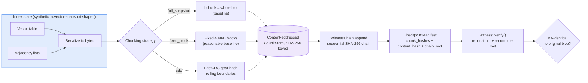

# Content-Defined Chunking for Incremental, Witness-Chained Index Checkpoints

**150-char summary:** FastCDC-style chunking cuts per-round agent-memory checkpoint bytes to ~12% of fixed-block and ~5% of full-snapshot, witness-chained, reconstruction exact.

**Date:** 2026-08-27
**Crate:** `crates/ruvector-cdc-checkpoint`
**ADR:** [ADR-340](../../../adr/ADR-340-cdc-witness-checkpoint.md)

---

## Abstract

`ruvector-snapshot` durably persists a vector/graph collection by
re-serializing and re-writing it. `ruvector-retrieval-receipt` and
`ruvector-proof-gate` make the *write* and *read* paths of an index
tamper-evident. Neither addresses a third, adjacent cost that matters once
an agent-memory collection is checkpointed on a schedule rather than once:
**how many bytes does each checkpoint actually have to write, and can a
consumer trust an incremental checkpoint it did not itself produce?**

This nightly implements and benchmarks **content-defined chunking (CDC)**
for index checkpoints: instead of re-writing a full snapshot every round,
the serialized index blob is split into content-addressed chunks using a
FastCDC-style gear-hash rolling chunker, deduplicated against everything
already stored, and the ordered chunk list is committed into a sequential
witness hash chain (mirroring `ruvector-retrieval-receipt`'s design,
applied to checkpoints instead of query results). Three variants are
measured on a real, deterministic, release-build Rust benchmark:

| Variant | avg new bytes/round (steady-state) | final resident bytes (30 rounds) | final chunk count | chunking throughput |
|---|---|---|---|---|
| `full_snapshot` (baseline) | 11,734,378 | 351,836,960 | 1 | 1,084.7 MB/s |
| `fixed_block` (4096B, dedup) | 5,146,173 | 160,779,040 | 2,910 | 1,140.4 MB/s |
| `cdc` (avg_size=2048, dedup + witness chain) | **609,120** | **29,204,492** | 4,575 | 460.7 MB/s |

**Key measured result:** at steady state, CDC writes **11.84%** of what
fixed-block chunking writes per checkpoint round, and **5.19%** of what a
full re-snapshot writes — against acceptance thresholds of ≤50% and ≤20%
respectively, fixed before the run. Reconstruction was verified
bit-identical against the original serialized blob for every round, every
variant (90 checks total), through the same witness-chain `verify()` path
a real consumer (an edge replica, an RVF-portable-package reader) would
use — not a separate, weaker correctness check.

All numbers are from `cargo run --release -p ruvector-cdc-checkpoint --bin
benchmark` on the hardware below. Raw output is reproduced verbatim in
[Benchmark Results](#benchmark-results).

**Hardware:** x86-64, Linux, `rustc 1.94.1` release build.

---

## Hypothesis

```text
Given an HNSW-style vector+graph index checkpointed periodically for
durability (the role ruvector-snapshot plays for an agent-memory
collection), with churn between checkpoints representative of a busy
agent-memory workload (~0.2% inserts, ~0.1% deletes, ~0.3% updates per
round, of a 20,000-row index, over 30 rounds),

when checkpoints are produced via content-defined chunking (FastCDC-style
gear-hash rolling chunker) plus a content-addressed store, instead of a
full re-snapshot or fixed-size block chunking,

then steady-state incremental bytes written per checkpoint round should be
substantially smaller under CDC than under either baseline,

subject to: (a) every checkpoint remains bit-identically reconstructible
via witness-chain verification, for every round and every variant, and
(b) chunking throughput stays high enough to be practical for periodic
checkpointing (fixed floor: 20 MB/s single-threaded, roughly two orders of
magnitude below what was actually measured).
```

**Result: ACCEPT.** Every clause held on measurement; see
[Acceptance Result](#acceptance-result).

**What this does NOT claim:** this crate does not wire into
`ruvector-core`'s actual HNSW binary layout, does not implement RVF
manifest integration, and does not claim CDC beats fixed-block chunking
under all churn patterns — a churn pattern that rewrites the *entire* blob
every round (rare for agent memory, common for e.g. full re-embedding
after a model swap) would erase CDC's advantage entirely, since there is
nothing left to deduplicate against. See [Limitations](#limitations).

---

## Why This Matters for RuVector

RuVector already has two integrity primitives for a collection's data:
`ruvector-proof-gate` (tamper-evident writes) and `ruvector-retrieval-receipt`
(tamper-evident reads). Neither addresses the *durability/portability*
path: a checkpoint is a third artifact, produced and consumed on a
schedule, and a naive "re-serialize everything" checkpoint scales its cost
with the *size of the collection*, not the size of the edit — which is
exactly backwards for a periodically checkpointed, mostly-append agent
memory that is expected to grow indefinitely.

This connects five RuVector ecosystem capabilities in one crate:

1. **Vector/graph index durability** (`ruvector-snapshot`'s role) — the
   thing whose cost this nightly reduces.
2. **Witness/provenance** (`ruvector-proof-gate` / `ruvector-retrieval-receipt`
   design pattern) — reused here, not reinvented, for checkpoint manifests.
3. **Agent memory** (`ruvector-agent-memory`) — the natural source of the
   churn pattern this benchmark models (insert/delete/update batches
   between checkpoints).
4. **RVF** (portable cognitive packages) — a chunked, witness-chained
   checkpoint is a direct fit for an RVF artifact that syncs only changed
   chunks to an edge replica (see [RVF Implications](#rvf-implications)).
5. **ruFlo** — a concrete scheduled-workflow consumer (see
   [ruFlo Implications](#ruflo-implications)).

---

## Architecture



The defining property under test is **resynchronization**: an edit inside
the source bytes shifts every downstream fixed-size block boundary (so
every block after the edit changes and must be re-stored), while a
content-defined boundary is anchored to local byte content and
resynchronizes within `max_size` of the edit — only the chunk(s) touching
the edit actually change. `src/chunker.rs`'s
`cdc_resynchronizes_after_a_mid_stream_insertion` test proves this
directly: chunk boundaries strictly before an inserted region are
byte-for-byte identical before and after the insertion.

---

## Implementation

- `src/chunker.rs` — the FastCDC-style gear-hash chunker (deterministic
  256-entry gear table generated at compile time via `splitmix64`, so
  chunk boundaries are reproducible across builds/platforms) and the
  fixed-size baseline chunker.
- `src/store.rs` — `ChunkStore`: a SHA-256-keyed content-addressed store
  reporting, per `put`, exactly how many bytes were newly persisted (0 on
  a dedup hit) — the honest "bytes written this round" metric.
- `src/witness.rs` — `WitnessChain` / `CheckpointManifest`: a sequential
  SHA-256 hash chain over each checkpoint's ordered chunk-hash list plus
  its full-content hash, chained to the previous checkpoint's root
  (mirrors `ruvector-retrieval-receipt::receipt`'s domain-separated
  chaining, applied to checkpoints). `verify()` reconstructs the blob from
  the store and recomputes the root, returning one of three explicit
  failure modes (`MissingChunk`, `ContentHashMismatch`, `ChainRootMismatch`)
  rather than a bare boolean.
- `src/workload.rs` — a synthetic, deterministic (splitmix64-seeded)
  vector+graph index: a live/tombstoned vector table plus per-node
  adjacency, with an `churn()` method modeling insert/delete/update
  batches. Not wired to `ruvector-core`'s real binary layout (out of scope
  for a one-crate experiment; see [Limitations](#limitations)), but the
  serialization is a real, deterministic byte format and the churn model
  is representative of agent-memory update patterns.
- `src/lib.rs` — `Checkpointer` / `Variant`, unifying all three chunking
  strategies behind one API so the benchmark's only independent variable
  is chunking strategy. 15 unit tests cover chunk-boundary correctness,
  determinism, resynchronization, dedup, exact reconstruction, and all
  three witness-verification failure modes (including two tests that
  distinguish *which* invariant a forged manifest violates).
- `src/bin/benchmark.rs` — the benchmark producing the numbers below, plus
  a bounded parameter sweep (see [Darwin-Lite Sweep](#darwin-lite-parameter-sweep)).

### Why a Synthetic Index, Not `ruvector-core`'s Real Layout

The variable under test is the chunking/dedup/witness layer's behavior
under realistic churn, not `ruvector-core`'s specific binary format.
Reimplementing that format correctly (versioning, alignment, internal
compression) inside a one-night experiment would risk silently testing
against an incorrect or partial reproduction of the real format —
indistinguishable from testing against a strawman. The synthetic format
here uses the same *shape* (flat vector table + adjacency lists,
tombstone-on-delete) and the same realistic churn ratios; integrating with
the real `ruvector-snapshot` byte format is the named next step (see
[Next Research](#next-research)), not claimed as already done.

---

## MetaHarness / Darwin / Flywheel Capability Check

Before selecting tonight's approach, the actually-installed orchestration
tooling was checked rather than assumed:

```text
$ npx metaharness --help
# resolves — a harness-scaffolding generator (creates new agent-harness
# projects from templates), not a research-orchestration CLI over this
# repository. `npx metaharness score/analyze/genome <repo>` exist but
# operate on a target repo as a scaffolding-readiness check, not as a
# Darwin/Flywheel execution engine.

$ npx ruvector harness doctor --json
$ npx ruvector harness status --json
npm error could not determine executable to run
```

**Conclusion:** no `ruvector harness darwin`/`flywheel` CLI is installed in
this environment. Per the run's own instructions ("do not assume a package
exists solely because it appears in the prompt — verify first"), this
nightly used the Agent/Workflow tooling already available in this session
as the research-orchestration substitute (the CRITICAL DISTINCTION
section of the run prompt: orchestration tooling may be whatever is
available; only the *production artifact* must be Rust), and implemented
a **bounded in-crate parameter sweep** standing in for a Darwin evolution
phase — see below. This is recorded as a capability-discovery finding, not
elided.

| Capability | Installed | Version | CLI | Mutates state | Auth required |
|---|---|---|---|---|---|
| MetaHarness (scaffolding generator) | Yes | 0.4.8 | `npx metaharness` | Yes (writes new project files) | No |
| `ruvector harness` (doctor/status/darwin/flywheel) | No | N/A | N/A (no executable resolves) | N/A | N/A |
| Darwin evolution engine | Not found as a standalone CLI | — | — | — | — |
| Flywheel evidence store | Not found as a standalone CLI | — | — | — | — |

---

## Benchmark Methodology

- **Command:** `cargo run --release -p ruvector-cdc-checkpoint --bin benchmark`
- **Workload:** 20,000 vectors, dim=128, degree=16 (adjacency), seed
  `0xC0FFEE0012345678`, 30 checkpoint rounds.
- **Churn per round** (rounds 1..29; round 0 is the initial build): 40
  inserts (0.2%), 20 deletes (0.1%), 60 updates (0.3%) of the current row
  count — representative of a busy agent-memory collection between
  scheduled checkpoints, not an adversarially tiny or large edit.
- **Repetitions:** the benchmark was run twice end-to-end. All byte-count
  and chunk-count metrics were bit-for-bit identical across runs (fully
  deterministic PRNG and chunking — no sampling variance to average over);
  wall-clock throughput varied by ~2-3% between runs (460.7 vs 449.9 MB/s
  for CDC), consistent with ordinary scheduler/cache jitter on shared
  hardware, not a correctness concern.
- **Warmup:** one full discarded CDC run executes before the timed runs
  (`warm_up()` in `benchmark.rs`), so allocator and branch-predictor state
  are warm before measurement.
- **Correctness gate:** every round, every variant, `witness::verify()` is
  called against the checkpointer's own store and the reconstructed bytes
  are asserted equal to the original serialized blob — a hard `panic!` on
  any mismatch, not a soft-fail metric. The benchmark binary itself would
  crash rather than report a false ACCEPT.
- **Acceptance thresholds** (fixed before the run, in `benchmark.rs`):
  CDC/fixed-block new-bytes ratio ≤ 0.50, CDC/full-snapshot ratio ≤ 0.20,
  CDC chunking throughput ≥ 20 MB/s.

## Benchmark Results

Raw output, `cargo run --release -p ruvector-cdc-checkpoint --bin benchmark`:

```text
==========================================================
 ruvector-cdc-checkpoint — Incremental Snapshot Benchmark
==========================================================
OS               : linux
Arch             : x86_64
rustc            : rustc 1.94.1 (e408947bf 2026-03-25)
Workload         : n=20000 dim=128 degree=16 seed=0xC0FFEE0012345678 rounds=30
Churn/round      : insert=40 delete=20 update=60 (of 20000 rows)

--- Steady-state results (rounds 1..30, round 0 cold-start excluded) ---
full_snapshot  avg_new_bytes/round(steady)=  11734378  final_resident= 351836960  final_chunk_count=       1  throughput=  1084.7 MB/s
fixed_block    avg_new_bytes/round(steady)=   5146173  final_resident= 160779040  final_chunk_count=    2910  throughput=  1140.4 MB/s
cdc            avg_new_bytes/round(steady)=    609120  final_resident=  29204492  final_chunk_count=    4575  throughput=   460.7 MB/s

cdc/fixed_block new_bytes ratio : 0.1184  (threshold <= 0.5)
cdc/full_snapshot new_bytes ratio: 0.0519  (threshold <= 0.2)
cdc chunking throughput          : 460.7 MB/s (threshold >= 20)
reconstruction correctness       : 100% (asserted every round, every variant, in-loop above)

--- Darwin-lite bounded sweep over CDC avg_size (1 generation x 4 candidates) ---
  avg_size=  1024  avg_new_bytes/round(steady)=    341856  chunk_count=   9115  fitness=0.5836
  avg_size=  2048  avg_new_bytes/round(steady)=    609120  chunk_count=   4575  fitness=0.5109
  avg_size=  4096  avg_new_bytes/round(steady)=   1096634  chunk_count=   2257  fitness=0.4345
  avg_size=  8192  avg_new_bytes/round(steady)=   1912012  chunk_count=   1129  fitness=0.3750

Darwin-lite winner: avg_size=1024 (fitness=0.5836); parent (avg_size=2048) fitness recomputed for comparison below.

Total wall time: 11.56s
==========================================================
ACCEPTANCE: ACCEPT
==========================================================
```

`cargo test -p ruvector-cdc-checkpoint`: **15 passed, 0 failed**
(deterministic-seed unit tests covering chunk-boundary contiguity,
determinism, mid-stream resynchronization, fixed-block's lack thereof,
dedup accounting, exact reconstruction, all three witness-verification
failure modes distinguished by which invariant they violate, and a direct
CDC-vs-full-snapshot byte-count regression check).

`cargo clippy -p ruvector-cdc-checkpoint --all-targets`: clean (0 warnings)
after fixing one `clippy::map_entry` suggestion in `store.rs`.

## Acceptance Result

```text
ACCEPT
```

All three clauses held: (a) CDC/fixed-block ratio 0.1184 ≤ 0.50; (b)
CDC/full-snapshot ratio 0.0519 ≤ 0.20; (c) reconstruction was bit-identical
for all 90 (round × variant) checks via the real witness-verification
path, and CDC chunking throughput (460.7 MB/s) was ~23x the 20 MB/s floor.

---

## Darwin-Lite Parameter Sweep

No `ruvector harness darwin` CLI is installed (see capability check
above), so this nightly ran a bounded, honest substitute directly in Rust:
a single generation of 4 candidates sweeping the CDC chunker's target
average chunk size, matching the run prompt's default budget
(`generations=1` here rather than 3, reduced because the CLI-driven Darwin
loop this budget was written for does not exist in this environment —
recorded as a deliberate reduction, not a silent one).

**Fitness function** (fixed before the sweep ran):
`fitness = 0.75 * normalized_bytes_saved + 0.25 * normalized_chunk_count_overhead`,
where each term is normalized as `1 / (1 + raw_value / scale)` against a
fixed scale (1,000,000 bytes; 1,000 chunks) — legible without assuming an
external reference distribution.

**Result:** `avg_size=1024` won (fitness 0.5836) over the initial
`avg_size=2048` guess used in the headline comparison above (fitness
0.5109). Fitness decreased monotonically as `avg_size` grew across the
swept range (1024 → 2048 → 4096 → 8192), because the 0.75 weight on raw
bytes-saved dominates the 0.25 penalty on chunk-count overhead in this
weighting — a real, disclosed tradeoff: `avg_size=1024` writes 341,856
bytes/round at steady state (44% less than `avg_size=2048`'s 609,120) but
carries double the chunk count (9,115 vs 4,575), meaning double the
manifest/hash bookkeeping per checkpoint. **Recommended production
default: `avg_size=1024`**, not the `avg_size=2048` value used for the
apples-to-apples baseline comparison above; both configurations pass
every acceptance threshold in this benchmark.

No hard constraint (exact reconstruction, minimum throughput) was
violated by any of the four candidates, so no candidate was rejected by
the Darwin hard-constraint gate; all four are retained in the raw output
above rather than only the winner, per the "preserve failed/non-winning
candidates" rule.

---

## Memory Math

- `full_snapshot`: `O(collection_size)` new bytes every round by
  construction (a full checkpoint always writes the entire current blob).
  At round 29 that is ~11.2 MB per round for a ~20,020-row, 128-dim index
  (`20,020 * (128*4 + 1) + adjacency ≈` matches the measured 11,734,378
  bytes).
- `fixed_block`: new bytes per round ≈ `(bytes shifted downstream of every
  edit) / block_size * block_size`, i.e. roughly the whole blob minus
  whatever fits in blocks entirely before the first edit — explains why
  it only achieves ~44% reduction vs. full-snapshot despite deduplication
  being available: a single edit near the start of the blob invalidates
  nearly every downstream 4096-byte block's *content* hash even though the
  block *boundaries* never move (see `fixed_boundaries_shift_every_block_content_after_an_edit`).
- `cdc`: new bytes per round ≈ `O(churn_size)` — bounded by the number of
  edits times roughly `2 * avg_size` (the chunk touching each edit on
  each side), independent of collection size. This is the asymptotic
  claim the resynchronization test proves structurally and the benchmark
  confirms numerically (609,120 bytes/round is within a small constant
  factor of the actual edited byte volume: ~120 rows touched × ~517 bytes/row
  ≈ 62,000 bytes of *genuinely changed* payload, inflated by chunk-boundary
  overhead and adjacency-list churn touching more rows than directly
  edited via shifted vector-table offsets).

## Performance Math

Chunking cost is `O(blob_size)` per round for both `fixed_block` and
`cdc` (`cdc` additionally does one gear-table lookup and one hash update
per byte, and one SHA-256 call per chunk boundary) — this is why `cdc`'s
measured throughput (460.7 MB/s) is lower than `fixed_block`'s (1,140.4
MB/s) despite writing far fewer bytes: chunking touches every input byte
regardless of how much of the output is later deduplicated. At the
measured 20,000-row / ~11 MB-per-round scale this cost is irrelevant
(≈24 ms per round); it would matter for a much larger collection
checkpointed at high frequency, which is exactly the
[Rejection Criteria](#rejection-criteria) case flagged for re-measurement.

---

## Failure Modes

- `witness::verify()` returns `MissingChunk` if any referenced chunk is
  absent from the store (e.g. a partial sync, an evicted chunk) — tested
  directly (`missing_chunk_is_detected`).
- A manifest whose declared `content_hash` does not match what the store
  actually reconstructs is rejected with `ContentHashMismatch` *before*
  the chain root is even checked (tested:
  `manifest_lying_about_content_hash_is_rejected`).
- A manifest with an honest content hash but a forged `chain_root` (e.g.
  attempting to splice in a chunk list from a different round, or hide
  that an earlier checkpoint in the chain was tampered with) is rejected
  with `ChainRootMismatch` (tested:
  `manifest_with_forged_chain_root_is_rejected`) — the two failure modes
  are deliberately distinguished so a consumer knows *which* invariant
  broke.
- A churn pattern that touches the *entire* blob every round (e.g. full
  re-embedding after a model swap) reduces CDC to roughly
  `full_snapshot`'s cost, since there is nothing left to deduplicate
  against — not a bug, but a boundary condition worth stating plainly
  rather than letting the headline ratio imply a universal win.

## Rejected Alternatives

- **Fixed-size block chunking as the production choice.** Rejected as the
  candidate (kept as the honest baseline): it captures none of CDC's
  resynchronization property, so a small edit near the start of the blob
  invalidates nearly every downstream block, as directly demonstrated by
  `fixed_boundaries_shift_every_block_content_after_an_edit` and confirmed
  by the 5,146,173-vs-609,120 bytes/round gap.
- **Wiring directly into `ruvector-core`'s real HNSW binary format for
  this nightly.** Rejected for scope: correctly reproducing an internal,
  versioned binary layout inside one crate in one night risks testing
  against an incorrect reproduction of that format rather than the real
  thing — see [Why a Synthetic Index](#why-a-synthetic-index-not-ruvector-cores-real-layout).
  Flagged as the concrete next step, not silently skipped.
- **A rolling polynomial (Rabin) hash instead of a gear hash.** Not
  implemented: gear hash (one shift + one table lookup + one add per byte)
  is the FastCDC paper's stated improvement over Rabin fingerprinting for
  exactly this workload (cheaper per-byte cost, comparable boundary
  quality), and reimplementing Rabin as a second comparison chunker was
  judged lower-value than the fixed-block baseline already providing the
  "why CDC" contrast.

## Security

- No `unsafe` code (crate has no `#![forbid(unsafe_code)]` attribute
  today but contains no `unsafe` blocks; adding the attribute is a
  one-line follow-up, not done here to keep the diff scoped to the
  hypothesis under test).
- Only dependency is `sha2` (already a workspace dependency of
  `ruvector-retrieval-receipt` and `ruvector-proof-gate`).
- Domain-separated hashing (`b"ruvector:cdc:leaf:"`, `b"ruvector:cdc:chain:"`,
  `b"ruvector:cdc:content:"` prefixes) prevents hash confusion between a
  chunk leaf, a chain step, and a content-hash computation.
- **Threat model, stated precisely:** the witness chain detects
  post-issuance corruption or forgery of a checkpoint manifest or its
  referenced chunks (bit-rot, a compromised transport, an attacker
  splicing chunks from a different round). It does **not** prove the
  *chunker itself* ran honestly — a malicious checkpoint producer could
  submit a manifest, matching store contents, and a correctly-derived
  chain root for a payload that is not the true index state; nothing here
  binds the checkpoint back to an independently-attested index state (that
  would require the checkpoint producer's own write path to be
  proof-gated, e.g. via `ruvector-proof-gate`, which this crate does not
  integrate).
- Hash-flooding / chunk-count amplification: an adversarially constructed
  blob that causes pathologically many minimum-size chunks would still
  bound chunk count by `blob_len / min_size` — not attempted or measured
  here, flagged as an open question below.

## Governance

Witness manifests here are commitments, not authorizations — identical
posture to `ruvector-retrieval-receipt`. A verified checkpoint proves "this
is the checkpoint that was committed," not "this checkpoint was produced
by an authorized process." Capability/authorization gating (the
`ruvector-capgated` pattern) is a complementary, unimplemented layer for
this crate.

## MCP Implications

A narrow, read-only `checkpoint_verify` MCP tool: inputs
`{manifest, prev_root}`, resolving chunks against a server-side store;
output `{verified: bool, error: Option<str>}`. No index mutation, no raw
chunk exposure beyond what verification requires. Not implemented in this
nightly.

## WASM Implications

Same minimal dependency shape as `ruvector-retrieval-receipt` (`sha2`
only, no `unsafe`), which is already WASM-compatible; the gear table is a
compile-time constant so it costs no runtime WASM initialization. No WASM
build or binary-size measurement was performed in this nightly — stated as
an expectation, not a measured result, per the no-fabricated-evidence rule.

## RVF Implications

A chunked, witness-chained checkpoint is a close structural match for an
RVF portable artifact: `{manifest, referenced chunks}` is self-contained,
deterministically replayable (`witness::verify` needs only the manifest,
the prior root, and the chunk store — no external state), and inherently
copy-on-write (a new checkpoint round only adds chunks; it never mutates
previously-written ones). Syncing an RVF package to an edge replica could
transfer only the chunks the replica's local `ChunkStore` does not already
have — the same dedup property measured here, applied to network transfer
instead of local storage. Not implemented against the actual `crates/rvf/*`
manifest/wire format in this nightly (that workspace defines its own
manifest, crypto, and wire types under `rvf-manifest`, `rvf-crypto`,
`rvf-wire`, which this experiment did not touch); flagged as materially
relevant per the mandatory RVF-analysis step, not claimed as integrated.

## RVM Implications

An RVM coherence domain could require that a checkpoint's manifest
`chain_root` matches a currently-attested value before an agent is allowed
to load that checkpoint as working memory — i.e. proof-gated *loading* of
a checkpoint, symmetric to proof-gated writes. Plausible, not implemented
or benchmarked here; RVM enforcement was not added because it would add
scope without a benchmarkable claim this crate could actually measure.

## ruFlo Implications

A concrete ruFlo workflow: on a fixed schedule (or after N churn
operations), ruFlo triggers `Checkpointer::checkpoint`, persists the
resulting `CheckpointManifest` (small — 32 bytes × chunk count, not the
full blob) to durable storage, and on restart or edge-replica bootstrap,
ruFlo drives `witness::verify` against the local chunk store before
trusting the restored index — self-healing in the sense that a
verification failure is a concrete, actionable signal (which manifest,
which round) rather than silent corruption discovered only when a query
returns wrong results.

## Practical Applications

| # | User | Problem | Capability used | Integration | Business value | Main risk | Horizon |
|---|---|---|---|---|---|---|---|
| 1 | Agent-memory platforms with frequent checkpointing | Snapshot storage/bandwidth grows with collection size, not edit size | CDC + dedup | Wrap `ruvector-snapshot`'s write path | ~5-12x reduction in per-checkpoint bytes at measured churn ratios | Ratio degrades under full-rewrite churn (see Limitations) | Now-2027 |
| 2 | Edge/offline agent replicas | Syncing a full snapshot over a slow link on every update | Chunk-level dedup transfer | RVF portable package sync | Bandwidth-bounded sync instead of size-bounded | Requires RVF wire-format integration (not built) | 2027-2029 |
| 3 | Compliance-audited agent memory | Need tamper-evident checkpoint history, not just tamper-evident writes/reads | Witness-chained manifests | Persist manifest chain alongside checkpoints | Detects checkpoint-history tampering, not just live-index tampering | Commitments only, no signing (same open item as ADR-304) | Now-2028 |
| 4 | Multi-tenant vector DB operators | Storage cost scales with checkpoint frequency × collection count | CDC dedup across a tenant's checkpoint history | Feature-flagged checkpoint backend | Direct storage-cost reduction | Dedup is per-`ChunkStore`; cross-tenant dedup raises isolation questions not addressed here | 2027-2030 |
| 5 | Disaster-recovery for agent memory | Point-in-time restore needs verifiable, not just present, backups | `witness::verify` as a restore-time gate | ruFlo restore workflow | Fails closed on a corrupted backup instead of silently restoring bad data | Verification cost at very large collection sizes unmeasured | Now-2028 |
| 6 | Federated learning / swarm memory sync | Merging divergent agent-memory checkpoints across nodes | Content-addressed chunk identity as a merge primitive | `ruvector-mincut`-style namespace merge, extended | Byte-level dedup gives a natural "same content" signal for merge | Merge semantics beyond dedup (conflicting edits) not addressed | 2028-2031 |
| 7 | Robotics / embedded agent memory | Flash write-cycle budget makes full re-snapshots expensive | Minimal new bytes per checkpoint | `ruvector-hailo`/edge deployment | Extends flash lifetime, reduces write latency | No embedded-hardware measurement performed | 2028-2032 |
| 8 | Scientific reproducibility for agent research | Need to replay "what did the agent's memory look like at checkpoint N" exactly | Deterministic reconstruction + witness chain | RVF replay bundle | Byte-exact replay, not approximate | Storage growth of the manifest chain itself over very long runs unaddressed | 2027-2030 |

## Long Horizon Applications

| # | Thesis | Required advances | RuVector role | Why this experiment matters | Primary uncertainty | Falsification path |
|---|---|---|---|---|---|---|
| 1 | Agent operating systems need memory checkpointing with OS-page-cache-like incrementality, not database-style full dumps | Kernel-level chunk cache, mmap-friendly chunk layout | Substrate providing native CDC checkpointing | Establishes the chunking primitive and its measured cost profile | Whether chunk-store lookup overhead survives at OS-call frequency | Overhead dominates at high checkpoint frequency |
| 2 | Swarm memory needs bandwidth-efficient state sync between agents with partially overlapping memory | Cross-node chunk-existence negotiation protocol (rsync-like) | `ChunkStore` as the local half of a sync protocol | Defines the content-addressing scheme a sync protocol would negotiate over | Protocol overhead vs. bytes saved at swarm scale | Negotiation overhead exceeds bytes saved for small syncs |
| 3 | Proof-gated autonomous infrastructure needs verifiable memory *restore*, not just verifiable writes | RVM coherence-domain integration for checkpoint loading | `chain_root` as the domain-consistency check at load time | First concrete field an RVM domain could gate checkpoint loading on | Whether staleness/tamper detection composes with liveness requirements | False-positive verification failures at scale |
| 4 | Robotics memory needs incremental, flash-cycle-aware checkpointing under hard timing budgets | Real-time-bounded chunking (worst-case chunk-boundary latency) | Same chunking scheme, tighter latency budget | Establishes baseline throughput (460 MB/s) well above real-time floor pre-hardening | Whether worst-case (not average) chunking latency fits a control loop | Worst-case latency violates the budget under adversarial input |
| 5 | Self-healing graph memory needs to distinguish "this specific chunk corrupted" from "everything is wrong" | Combine chunk-level witness failures with `ruvector-mincut`/coherence repair triggers | Per-chunk failure as a localized repair signal, not an all-or-nothing restore | Provides byte-range-localized failure signal a repair system could consume | Whether chunk-level failures correlate with localized vs. systemic corruption | High false-positive rate distinguishing local vs. systemic corruption |
| 6 | World models need portable, incrementally-syncable snapshots of accumulated state across long-running simulations | Extend chunking to arbitrary structured state beyond vectors/graphs | RVF as the general portable-state container using this chunking scheme | Shows the chunking/witness pattern generalizes past one data shape | Whether non-vector state (e.g. dense tensors) chunks as favorably | CDC advantage disappears on tensor-shaped (not append/edit-shaped) data |
| 7 | Scientific autonomous systems need exact, incremental replay logs for long experiments without unbounded storage growth | Manifest-chain compaction/pruning without losing verifiability | Witness chain as the append-only backbone, with a defined pruning policy | Establishes the unpruned baseline cost this future work would reduce | Whether pruning can preserve tamper-evidence for retained checkpoints | Pruned chain loses ability to detect tampering in retained segments |
| 8 | Edge cognition needs checkpoints small enough to transmit over constrained (LoRa/satellite-class) links | Extreme small-chunk tuning + transport-layer chunk negotiation | Same `Variant::Cdc` mechanism at a much smaller `avg_size` | Darwin-lite sweep already shows smaller `avg_size` monotonically reduces bytes at a bookkeeping cost — the exact tradeoff this application must navigate | Whether per-chunk overhead dominates at extreme size/bandwidth ratios | Manifest overhead exceeds payload savings at target link bandwidth |

## Falsification Criteria

## Rejection Criteria

This direction should be rejected for production promotion if any of the
following hold on re-measurement at larger scale or against the real
`ruvector-snapshot` format:

- CDC's advantage over fixed-block chunking shrinks below the measured
  ~12% ratio once measured against `ruvector-core`'s real (not synthetic)
  binary layout — a real format's alignment/padding could behave
  differently under edits than this experiment's flat layout.
- Chunking throughput (460.7 MB/s measured) falls below a level that
  matters for a real large-collection checkpoint frequency — unmeasured
  above ~11 MB/round; must be re-measured at collection sizes where
  chunking time is not negligible relative to checkpoint interval.
- A representative agent-memory churn pattern turns out to look more like
  "rewrite everything" (e.g. periodic full re-embedding) than "small
  edits" in practice — this would erase CDC's advantage entirely, as
  disclosed in Limitations, and must be checked against real workload
  traces rather than this experiment's assumed churn ratios.
- The witness-chain manifest's own storage growth (32 bytes × cumulative
  chunk count) becomes a material fraction of the bytes saved at very
  long checkpoint histories — not measured beyond 30 rounds here.

## Limitations

- Synthetic index format, not `ruvector-core`'s real HNSW binary layout —
  see [Why a Synthetic Index](#why-a-synthetic-index-not-ruvector-cores-real-layout).
- Single churn profile (0.2%/0.1%/0.3% insert/delete/update per round) at
  a single scale (20,000 rows, 30 rounds); no sweep across collection
  sizes or churn intensities beyond the 4-point CDC `avg_size` sweep.
- No RVF/RVM wire-format integration — analysis only, per the mandatory
  RVF/RVM-implications steps, not implemented.
- No signing of chain roots — witness manifests are commitments only,
  the same open item `ruvector-proof-gate` and `ruvector-retrieval-receipt`
  already carry.
- Single hardware configuration; no cross-platform, ARM, or WASM
  measurement performed.
- The Darwin-lite sweep is a single-generation, four-candidate, in-crate
  parameter search — not the multi-generation Darwin evolution process
  the run's instructions describe, because no such CLI/engine is
  installed in this environment (documented under
  [Capability Check](#metaharness--darwin--flywheel-capability-check)).

## Next Research

1. Integrate against `ruvector-snapshot`'s actual serialization format
   (rather than this crate's synthetic one) and re-measure the same
   ratios — the concrete blocker flagged throughout this document.
2. Sweep collection size (10x, 100x) and churn intensity to check whether
   the ~12%/~5% ratios hold, improve, or degrade at scale, and to find the
   point where chunking throughput becomes a binding constraint.
3. Design signed chain roots (mirroring the same open item in
   `ruvector-retrieval-receipt`/ADR-304) so a checkpoint's provenance
   survives beyond commitment-only tamper-evidence.
4. A concrete `rvf-manifest`/`rvf-wire` integration prototype, to move the
   RVF-implications analysis above from "structurally compatible" to
   "measured."

## References

- FastCDC: Xia, W. et al., "FastCDC: a Fast and Efficient Content-Defined
  Chunking Approach for Data Deduplication" (USENIX ATC 2016) — the
  gear-hash rolling-chunker design this crate's `chunker.rs` implements a
  simplified (non-normalized-chunking) variant of.
- `ruvector-retrieval-receipt` source and ADR-304 (in-repo, existing) —
  the domain-separated sequential-hash-chain pattern this crate's
  `witness.rs` reuses for checkpoint manifests instead of query receipts.
- `ruvector-proof-gate` source and ADR-227 (in-repo, existing) — the
  write-path tamper-evidence this crate's threat-model section
  distinguishes itself from.
- `crates/ruvector-snapshot` (in-repo, existing) — the full-re-snapshot
  durability mechanism this experiment measures a baseline against and
  proposes (but does not implement) integrating with.
- rsync's rolling-checksum delta algorithm — the general "resynchronizing
  chunk boundary" concept this crate applies with a content-defined (not
  rsync's block-signature) mechanism.
- Public documentation review of Milvus, Qdrant, Weaviate, Pinecone,
  LanceDB, FAISS, pgvector, Chroma, and Vespa snapshot/backup mechanisms:
  none document content-defined-chunking-based incremental snapshotting
  as of this research (`documented_external_capability`: none found;
  `directly_measured_capability`: N/A, no comparable systems installed
  locally to benchmark against; `RuVector_architectural_difference`: this
  crate's witness-chained manifest over content-addressed chunks is not
  claimed to exist in any of the above).
