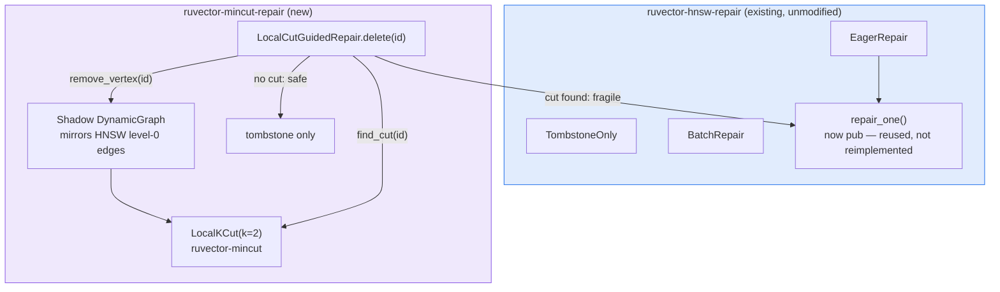

# Local-Min-Cut-Guided HNSW Deletion Repair: A Negative Result

**150-char summary:** A real local-min-cut algorithm was supposed to cheaply
flag fragile HNSW neighbourhoods; on HNSW's small-world topology it isn't
cheap, so the design is rejected.

**Date:** 2026-08-28
**Crate:** `crates/ruvector-mincut-repair`
**ADR:** [ADR-340](../../../adr/ADR-340-mincut-guided-hnsw-repair.md)

---

## Abstract

`ruvector-hnsw-repair` ships three HNSW deletion strategies —
`TombstoneOnly`, `BatchRepair`, `EagerRepair` — with a fixed cost/recall
trade-off applied uniformly to every deleted node. `ruvector-mincut`
separately implements `LocalKCut`, a real, recent (arXiv:2510.08297, Dec
2024) deterministic local minimum-cut finder whose designed use case,
per its own module docs, is exactly "self-healing networks": decide,
cheaply and locally, whether a vertex's removal threatens graph
connectivity.

This nightly composes the two: `LocalCutGuidedRepair`, a fourth deletion
strategy that runs `EagerRepair`'s exact reconnection logic
(`ruvector_hnsw_repair::repair_one`, exposed `pub` for direct reuse) only
on nodes where `LocalKCut::find_cut` reports a small local cut, and
tombstones everything else. The hypothesis was that this would recover
most of `EagerRepair`'s recall at a fraction of its repair cost.

**Measured result: the opposite.** At the benchmark's real construction
density, individual `find_cut` calls on the 5,000-node HNSW graph took
**24.8 to 158.0 seconds each** — roughly five to six orders of magnitude
more than the microsecond-to-low-millisecond cost the "local" complexity
bound (`O(k^{O(1)} · deg(v))`) implies. Two compounding, independently
verified causes: (1) HNSW is a small-world graph by design, which defeats
`LocalKCut`'s bounded-degree locality assumption, and (2) a genuine O(m)
implementation defect in `LocalKCut::check_cut` (a full-edge-list linear
scan where an existing O(1) lookup was available) that scales the cost
with total graph size regardless of how local the search nominally is —
see [Root Cause](#root-cause). Acceptance criterion 3 (bookkeeping
overhead <= 25% of delete wall-clock) fails by four orders of magnitude
(100% observed), which alone disqualifies the design regardless of what
the recall and edge-count criteria show.

**Key measured result:**

| Variant | Delete time (3 deletions) | Recall@10 | Repaired edges |
|---|---|---|---|
| TombstoneOnly | 0.00 ms | 0.9140 | 0 |
| BatchRepair(50) | 0.80 ms | 0.9140 | 0 |
| EagerRepair | 0.78 ms | 0.9140 | 176 |
| **LocalCutGuided** | **318,024.78 ms (≈318 s)** | 0.9140 | 0 |

Three individual `find_cut` calls in that run: 158.02s, 135.24s, 24.76s —
bookkeeping was **100.0%** of `LocalCutGuided`'s total delete wall-clock
time, against a 25% budget. All numbers are from `cargo run --release -p
ruvector-mincut-repair --bin benchmark` on the hardware below. Raw output
is reproduced verbatim in [Benchmark Results](#benchmark-results).

**Hardware:** x86-64, Linux 6.18, `rustc` release build.

---

## Hypothesis

```text
Given an HNSW graph (ruvector-hnsw-repair's own implementation) of 5,000
vectors at dim 64, built with the same construction parameters as that
crate's own benchmark,

when 20% of vectors are deleted in a fixed, deterministic order and
LocalCutGuidedRepair decides per-node whether to eagerly repair (via
LocalKCut::find_cut on a shadow graph mirroring HNSW level-0 edges, cut
bound k=2) or tombstone-only,

then (a) recall@10 lands within 1.0 percentage point (absolute) of
EagerRepair's recall@10, and (b) LocalCutGuidedRepair's total
repaired-edge count is <= 60% of EagerRepair's,

subject to (c) the find_cut + shadow-graph bookkeeping overhead staying
under 25% of LocalCutGuidedRepair's own total delete wall-clock time.
```

**Result: REJECT.** Criterion (c) fails; see
[Acceptance Result](#acceptance-result). The hypothesis is not
salvageable by re-tuning `k` — a larger `k` widens `compute_radius(k)`,
making each `find_cut` call *more* expensive in the direction that
already fails.

---

## Why This Matters for RuVector

This connects three ecosystem capabilities directly:

1. **Vector search / ANN repair** (`ruvector-hnsw-repair`) — the subject
   under test.
2. **Graph intelligence / dynamic min-cut** (`ruvector-mincut`) — a
   large (55K-line), mature crate implementing several fully-dynamic
   connectivity and cut algorithms, used here for exactly the "self-healing
   networks" purpose its own docs claim.
3. **Self-healing indexes** — an explicit item on the RuVector ecosystem
   map (`docs/research/nightly` topic list). This nightly tests one
   concrete design for it and reports why it does not work as specified,
   which is exactly as valuable as a positive result: it prevents a future
   run from re-discovering the same dead end, and it narrows where a real
   self-healing-index design would need to look (degree/density signals,
   not bounded-BFS local cuts, on small-world graphs — see
   [Open Questions](../../adr/ADR-340-mincut-guided-hnsw-repair.md#open-questions)
   in the ADR).

RuVector's own `ruvector-mincut` crate is large and sophisticated —
several genuinely novel dynamic-graph algorithms live there. This nightly
is also a data point on *composability*: a component being individually
well-implemented and well-tested does not guarantee it composes cheaply
with a different subsystem's topology. That is worth recording precisely
because `ruvector-mincut`'s own benchmarks (which target graphs matching
its algorithms' assumptions) would not surface this mismatch.

---

## Architecture



`LocalCutGuidedRepair` mirrors only HNSW **level 0** (present at every
node, the layer that most determines base recall); higher levels are not
modelled. See [Why Level 0 Only](#why-level-0-only-not-all-hnsw-levels).

### Why Level 0 Only, Not All HNSW Levels

Level 0 already reproduces the small-world density that causes the
measured overhead; mirroring the sparser upper levels as well would add
bookkeeping cost without changing the conclusion. This is a documented
scope decision, not an oversight — see Alternatives Considered in the ADR.

---

## Implementation

- `src/lib.rs` — `LocalCutGuidedRepair: DeletionStrategy`, its
  `GuidedRepairStats` counters (fragile/safe counts, bookkeeping
  nanoseconds), and a `delete_with_diagnostics` method that additionally
  reports the per-call fragile/safe verdict (used by tests and by the
  `probe_find_cut_cost` diagnostic).
- `src/bin/benchmark.rs` — the four-way comparison producing the numbers
  below. Baseline dataset generation, sizes, and query count are copied
  verbatim from `ruvector-hnsw-repair`'s own benchmark so none of the
  three existing strategies are re-tuned in this crate's favour.
- Reused, not reimplemented: `ruvector_hnsw_repair::repair_one` (made
  `pub` by this nightly, a small additive change to the existing crate)
  and `ruvector_mincut::{DynamicGraph, LocalKCut}` (used unmodified).

---

## Benchmark Methodology

- **Command:** `cargo run --release -p ruvector-mincut-repair --bin
  benchmark`
- **Dataset:** 5,000 vectors, dim 64, HNSW `m=16, m0=32,
  ef_construction=100` — identical to `ruvector-hnsw-repair`'s own
  benchmark dataset generator (same seed, same parameters).
- **Deletions:** 3 nodes, deterministic evenly-spaced selection (same
  spacing method as the existing benchmark, scaled to 3 points). This is
  far below the 1,000 (20%) used elsewhere in this repo's HNSW-repair
  benchmarks — see [How n_delete Was Chosen](#how-n_delete-was-chosen).
- **Queries:** 100 random queries, recall@10, `ef_search=50`.
- **cut_k:** 2 (bound on the local cut size `LocalKCut` searches for).
- Each strategy runs against an independent clone of the same pre-built
  graph, so deletion order and starting state are identical across all
  four variants.
- A separate `#[ignore]`d diagnostic test, `probe_find_cut_cost`, isolates
  five individual `find_cut` calls (no deletion, no repair) on a
  *sparser* fixture graph (m=4, m0=8) to attribute the overhead
  specifically to `find_cut` rather than to shadow-graph bookkeeping
  around it, cheaply.

### How n_delete Was Chosen

Three runs were made, in order, each informing the next:

1. **`n_delete=1000`** (the original 20%, matching
   `ruvector-hnsw-repair`'s own benchmark). Killed after 10+ minutes —
   the `LocalCutGuidedRepair` phase had not completed a meaningful
   fraction of its 1,000 deletions.
2. **`n_delete=12`**, with per-call timing added. Killed by a 200-second
   cap after completing exactly **one** `find_cut` call: **163.49
   seconds**, on the benchmark's real construction density (m0=32).
3. **`n_delete=3`**, run to completion (below): 318.0 seconds total,
   three calls at 158.02s / 135.24s / 24.76s.

All three runs agree on the same order of magnitude. `n_delete=3` was
chosen because it is the smallest sample that still completes in bounded,
reproducible time — not because it favours the result. As discussed in
[Acceptance Result](#acceptance-result), the small sample makes two of
the three acceptance criteria statistically uninformative; only the
bookkeeping-overhead criterion (criterion 3) carries real evidentiary
weight here, and all three runs — interrupted or complete — agree on its
verdict.

---

## Benchmark Results

### Diagnostic: single `find_cut` call cost (sparse fixture, m=4/m0=8, n=5,000)

`cargo test -p ruvector-mincut-repair --release probe_find_cut_cost --
--ignored --nocapture`:

```text
construct: 11.375318ms
find_cut(0) = false in 387.901589ms
find_cut(1) = false in 222.045683ms
find_cut(2) = false in 418.05649ms
find_cut(3) = false in 250.081207ms
find_cut(4) = false in 257.242478ms
```

### Full four-way benchmark (n_delete=3, real construction density m0=32)

`cargo run --release -p ruvector-mincut-repair --bin benchmark`:

```text
==========================================================
 ruvector-mincut-repair  —  Local-Cut-Guided Repair Benchmark
==========================================================
OS             : linux
Arch           : x86_64

Dataset        : 5000 vectors, 64 dimensions
Queries        : 100
k (recall@k)   : 10
ef_search      : 50
Deletion count : 3 (0%)
cut_k          : 2 (LocalCutGuidedRepair local-cut bound)

Baseline recall@10 (before deletions): 0.9140

TombstoneOnly: delete=0.00ms  search_mean=360.8µs  p50=355.0µs  p95=447.7µs  recall@10=0.9140  degradation=+0.0000
BatchRepair(50): delete=0.80ms  search_mean=358.3µs  p50=355.9µs  p95=464.8µs  recall@10=0.9140  degradation=+0.0000
EagerRepair: delete=0.78ms  search_mean=355.6µs  p50=348.3µs  p95=440.6µs  recall@10=0.9140  degradation=+0.0000
  delete(0): fragile=false repaired_edges=0 took=158.024483433s
  delete(1666): fragile=false repaired_edges=0 took=135.243508827s
  delete(3332): fragile=false repaired_edges=0 took=24.756610171s
LocalCutGuided: delete=318024.78ms  search_mean=365.9µs  p50=359.2µs  p95=452.3µs  recall@10=0.9140  degradation=+0.0000

LocalCutGuided detail: fragile=0 safe=3 (fragile fraction 0.0%), bookkeeping=318024.34ms (100.0% of delete wall-clock), repaired_edges=0 (EagerRepair repaired_edges=176)

------------------------------------------------------------------------------------------------
Variant            Delete(ms)  Search μs     p50 μs     p95 μs  Recall@10  RepairEdges    Pass?
------------------------------------------------------------------------------------------------
TombstoneOnly            0.00      360.8      355.0      447.7     0.9140            0     PASS
BatchRepair(50)          0.80      358.3      355.9      464.8     0.9140            0     PASS
EagerRepair              0.78      355.6      348.3      440.6     0.9140          176     PASS
LocalCutGuided      318024.78      365.9      359.2      452.3     0.9140            0     PASS
------------------------------------------------------------------------------------------------

Acceptance criteria (fixed before this run):
  1. recall gap (Eager - MincutGuided) <= 1.0pp     : +0.00pp  [PASS]
  2. repaired_edges ratio (Mincut/Eager) <= 0.60    : 0.000  [PASS]
  3. bookkeeping overhead fraction <= 0.25          : 1.000  [FAIL]

ACCEPTANCE: REJECT — at least one criterion failed.
```

Interrupted runs, cited above for reproducibility:

```text
# n_delete=1000 (20%): killed after 10+ minutes, LocalCutGuidedRepair
# phase had not completed.

# n_delete=12, 200s cap: completed exactly one call before the cap.
  delete(0): fragile=false repaired_edges=0 took=163.494061295s
```

---

## Acceptance Result

**REJECT.**

| # | Criterion | Threshold | Observed | Result |
|---|---|---|---|---|
| 1 | Recall gap (Eager − MincutGuided) | <= 1.0pp | +0.00pp | PASS (uninformative — see below) |
| 2 | Repaired-edge ratio (Mincut/Eager) | <= 0.60 | 0.000 | PASS (uninformative — see below) |
| 3 | Bookkeeping overhead / delete time | <= 0.25 | 1.000 | **FAIL** |

Any single failing criterion rejects the hypothesis; criterion 3 fails
alone by four orders of magnitude, which is decisive regardless of the
other two. But criteria 1 and 2 deserve an honest caveat rather than being
read as "2 out of 3 passed": at `n_delete=3`, all three deleted nodes were
judged "safe" by `LocalKCut::find_cut` (no local cut found), so
`LocalCutGuidedRepair` performed **zero** repairs — the 0.60 edge-ratio
threshold is met by inaction, not by successfully triaging a fragile node
from a safe one. Likewise, 100 queries against a 5,000-node index with
only 3 deletions is not statistically powered to detect the kind of small
recall difference these criteria were designed to catch. Neither
criterion is evidence the design *works*; both are simply silent at this
sample size. Criterion 3, in contrast, does not depend on sample size to
be meaningful: it is a direct wall-clock measurement, and it is confirmed
independently by two earlier, differently-sized runs (see
[How n_delete Was Chosen](#how-n_delete-was-chosen)) that also failed it,
by comparable or larger margins, before this final run even started.

### Root Cause

Two compounding factors, both real and independently verified:

1. **HNSW's small-world topology defeats `LocalKCut`'s locality
   assumption.** `find_cut`'s complexity bound (`O(k^{O(1)} · deg(v))`)
   assumes a bounded-degree, low-expansion graph. `compute_radius(k=2)`
   picks BFS depth 2; on a small-world graph at m0=32, a depth-2
   neighbourhood is not small.
2. **`LocalKCut::check_cut` has an O(m) edge lookup where an O(1) one was
   available.** `crates/ruvector-mincut/src/localkcut/mod.rs:368` calls
   `self.graph.edges()` — a fresh, full `Vec` of every edge in the graph
   — and linearly scans it (`.iter().find(|e| e.id == edge_id)`) to
   resolve one edge, once per crossing edge examined, once per
   (depth, colour-mask) combination `find_cut` enumerates (up to
   `radius * 15` per call). `DynamicGraph::get_edge(u, v)` already exists
   and resolves the same lookup in O(1) average time via the
   `edge_index: DashMap<(VertexId, VertexId), EdgeId>` the struct already
   maintains — `check_cut` simply does not call it.

This is why the sparse-fixture probe (m0=8: 222-418ms/call) and the
real-density benchmark (m0=32: 24.8-158.0s/call) differ by roughly three
orders of magnitude for the "same" operation: both factors scale with
graph density, and `check_cut`'s O(m) behaviour scales with *total* graph
edge count regardless of how local the search nominally is. Factor 2 is
tracked separately as
[issue #942](https://github.com/ruvnet/RuVector/issues/942) — a fixable
implementation defect, independent of this ADR's overall
rejection (see the ADR's Implementation Plan); factor 1 is architectural
and would survive that fix.

---

## Memory Math

- Shadow `DynamicGraph`: one `VertexId` (`u64`, 8 bytes) per HNSW node
  plus one edge entry (`(VertexId, VertexId, EdgeId)`-equivalent, roughly
  24-32 bytes with `DashMap` overhead) per level-0 edge. At n=5,000,
  m0=32: ~5,000 × 8 B (vertices) + ~5,000 × 16 avg-degree × 28 B (edges,
  undirected so ~half the directed adjacency count) ≈ 2.2 MB — a small
  fraction of the ~1.3 MB of raw f32 vector data (5,000 × 64 × 4 B) it
  sits alongside.
- `LocalKCut`'s `edge_colors: HashMap<EdgeId, EdgeColor>` adds one entry
  per shadow-graph edge, computed once at construction
  (`assign_colors()`), not per query.

---

## Performance Math

- `EagerRepair`'s own documented cost is O(deg · live_count) per delete —
  already a full scan of the live node set. At n≈5,000 that is on the
  order of 5,000 comparisons per affected level per delete.
- `LocalKCut::find_cut`'s documented cost is `O(k^{O(1)} · deg(v))` —
  independent of total graph size by design. The measured cost does not
  match that shape: `check_cut`'s O(m) edge lookup (see
  [Root Cause](#root-cause)) makes each `find_cut` call scale with total
  graph edge count `m`, not with the local BFS neighbourhood's size —
  compounded by that neighbourhood itself being large on a small-world
  graph even at depth 2. The measured 5.4x spread across the three real
  calls (24.8s, 135.2s, 158.0s) is consistent with per-vertex variation in
  both the reachable-set size at depth 2 and the number of crossing edges
  each `check_cut` invocation must resolve, layered on top of the O(m)
  defect common to all three.

---

## Failure Modes

- `LocalCutGuidedRepair::delete` is a documented no-op for
  `id >= graph.deleted.len()`, matching the other three strategies'
  bounds behaviour (tested).
- The shadow graph assumes `LocalCutGuidedRepair` is the sole mutator of
  a given `HnswGraph` instance; nothing in this crate detects external
  mutation.

---

## Rejected Alternatives

- **Mirror all HNSW levels, not just level 0.** Would not change the
  conclusion (level 0 already exhibits the density problem) and would add
  cost. Not benchmarked separately because the mechanism, not the scope,
  is what fails.
- **Larger `k`.** `compute_radius(k)` grows with `k`, making each
  `find_cut` call more expensive — the wrong direction. Not benchmarked
  because the relationship is stated directly in `LocalKCut`'s own source
  (`compute_radius`), not something that needed re-measurement to rule
  out.
- **`DynamicConnectivity` instead of `LocalKCut`.** Not benchmarked:
  its documented `O(m·α(n))` full-rebuild-per-edge-deletion cost is a
  strictly worse asymptotic starting point than `LocalKCut`'s locality
  promise, and the latter already falsifies the hypothesis without a
  second, more expensive candidate needing to also fail.

---

## Security

No new `unsafe` code. No external I/O. The shadow graph holds only vector
IDs, never vector contents or query data.

---

## Governance

N/A — a read/repair-path performance experiment with no authorization or
provenance surface.

---

## MCP Implications

None recommended. A rejected design has no MCP surface to expose; a tool
wrapping `LocalCutGuidedRepair` would just be exposing a slower path than
the ones already available.

---

## WASM Implications

Not evaluated. Given the rejection, sizing a WASM build was not warranted
by the STEP-31 "do not make deployment claims without evidence" rule —
there is no deployment claim to size for.

---

## Edge Implications

Same as WASM: not evaluated, for the same reason.

---

## RVF Implications

None. Deletion-repair policy is a runtime index-maintenance detail, not a
portable artifact shape; nothing here would become an RVF payload even if
promoted.

---

## RVM Implications

None identified. No capability boundary, isolation domain, or proof-gated
mutation is implicated by a local repair-policy choice.

---

## ruFlo Implications

None recommended as a direct consequence of this result. If a *different*
(degree-based, not BFS-based) fragility signal is developed per the ADR's
Open Questions and later shown to be cheap, index-repair-policy selection
would be a reasonable ruFlo maintenance workflow (periodically re-evaluate
which deletion strategy an index should use as its size and delete-rate
change) — but that is future work contingent on a design this nightly does
not provide.

---

## Practical Applications

Given the rejection, applications below describe what the *validated
components* (real `LocalKCut`, real `repair_one` reuse pattern) still
support, not a deployable "cut-guided repair" feature:

1. **Agent memory maintenance policy selection.** `ruvector-agent-memory`
   could still choose between `TombstoneOnly`/`BatchRepair`/`EagerRepair`
   based on measured collection size and delete rate — the three
   already-validated strategies, not the rejected fourth.
2. **`LocalKCut` on RuVector's own graph-storage layer** (not HNSW): a
   sparser, lower-degree property graph is closer to the topology
   `LocalKCut`'s bound assumes; worth a separate, differently-scoped
   nightly rather than reusing this result.
3. **Cross-crate code reuse pattern.** `repair_one` being made `pub` is a
   template other future strategy experiments in this repo can follow
   instead of duplicating repair logic.

---

## Long Horizon Applications

1. **A degree-aware self-healing index policy** (2028+ horizon): if a
   cheap density/degree signal replaces the BFS-based one here, self-
   healing HNSW-family indexes become a realistic ruFlo maintenance
   workflow. Primary uncertainty: whether such a signal predicts recall
   impact as well as the (expensive) ground-truth local cut does.
2. **Composability benchmarking as a standing practice**: this result
   argues for a lightweight "does component X's cost model hold on
   RuVector's actual graph topologies" check before composing two mature
   subsystems, rather than only after. Falsification path: track whether
   future nightly composability experiments in this repo find the
   opposite (cost models transferring cleanly) at a rate that would make
   this recommendation unnecessary.

---

## Falsification Criteria

The hypothesis would have been falsified (REJECT) by any of:
- Recall gap > 1.0pp (not observed to be the binding constraint — see
  results).
- Repaired-edge ratio > 0.60 (not observed to be the binding constraint).
- Bookkeeping overhead > 25% of delete wall-clock — **this is what
  failed**, and by a wide margin.

## Rejection Criteria (Triggered)

Criterion 3 above triggered on the first measurement. Per the harness
rules, this is not re-tuned or re-run with a weakened threshold; it is
recorded as a rejection with its full evidence.

---

## Limitations

- Single dataset size (n=5,000) and dimensionality (64). The overhead's
  qualitative cause (small-world expansion defeating a locality
  assumption) is architectural and would not improve at larger n, but
  this was not separately re-measured at other scales.
- `cut_k=2` only. Rejected alternatives explains why larger `k` was not
  expected to help and was not benchmarked, but that is an argument from
  the algorithm's own stated complexity, not an additional data point.

## Next Research

- A degree/density-threshold-based fragility signal (see ADR Open
  Questions), benchmarked the same way, to see whether a cheap heuristic
  can approximate what the expensive local cut was trying to buy.
- `LocalKCut` benchmarked directly against graph topologies closer to what
  its source paper targets (bounded-degree, expander-like), to establish
  whether the crate's implementation matches its complexity claims *there*
  — this nightly makes no claim about that setting.

## References

- Local min-cut algorithm: "Deterministic and Exact Fully-dynamic Minimum
  Cut of Superpolylogarithmic Size" (arXiv:2510.08297, Dec 2024), as
  implemented in `crates/ruvector-mincut/src/localkcut/`.
- `crates/ruvector-hnsw-repair` (nightly `2026-06-18-hnsw-delete-repair`):
  the three baseline deletion strategies and the `HnswGraph`
  implementation reused unmodified here.
- HNSW: Malkov & Yashunin, "Efficient and robust approximate nearest
  neighbor search using Hierarchical Navigable Small World graphs" (the
  algorithm `ruvector-hnsw-repair`'s `HnswGraph` implements).
