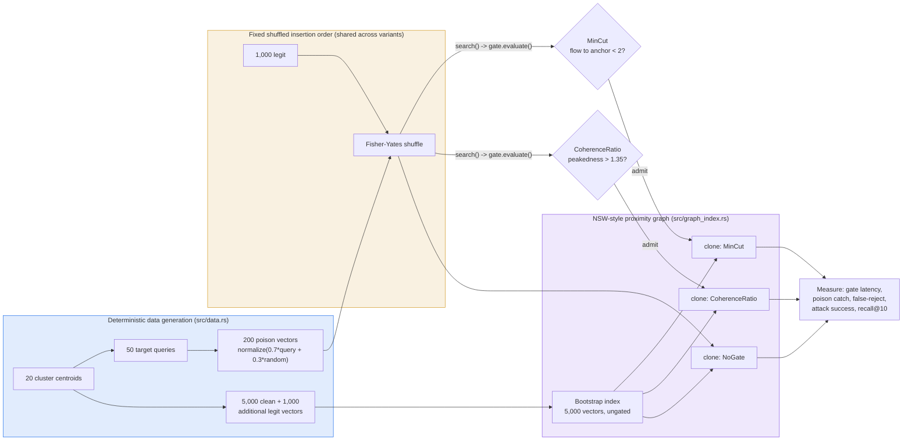

# Mincut-Gated Insertion: A Structural Defense Against RAG Corpus Poisoning — And Why the Mincut Half Failed

**150-char summary:** Write-time gating against synthetic RAG-poisoning insertions: a cheap similarity-shape heuristic caught 61% of attacks; a local graph min-cut heuristic caught 0%.

**Date:** 2026-08-30
**Crate:** `crates/ruvector-graft-gate`
**ADR:** [ADR-340](../../../adr/ADR-340-mincut-gated-insertion.md)

---

## Abstract

RAG corpus-poisoning attacks — crafting a small number of documents whose
embeddings are optimized to rank highly for a target query, so the
generator ingests attacker-chosen content — are an active 2025-2026
research area (PoisonedRAG, CorruptRAG, Semantic Chameleon; see
[References](#references)). Documented defenses operate at retrieval time
(reranking, perplexity filtering) or generation time (activation
anomalies, token masking). This nightly asks a different-stage question:
**can a graph-based ANN index refuse a poisoned vector at *insertion*
time**, before it ever enters the index other queries will search?

Two gate variants were implemented and benchmarked against a synthetic,
deterministically-seeded single-target embedding-optimization attack
model, alongside an ungated baseline, all sharing one from-scratch
NSW-style proximity-graph index:

| Variant | Poison caught (of 200) | Legit false-reject (of 1,000) | Mean gate overhead | Attack success (targets with surviving poison) | Recall@10 |
|---|---|---|---|---|---|
| `NoGate` (baseline) | 0 / 200 (0.0%) | 0 / 1,000 | 43 ns | 100.0% | 0.5980 |
| `CoherenceRatio` (similarity-shape heuristic) | **122 / 200 (61.0%)** | 0 / 1,000 | 55 ns | 100.0% | **0.8440** |
| `MinCut` (local graph min-cut heuristic) | **0 / 200 (0.0%)** | 0 / 1,000 | 13,621 ns | 100.0% | 0.5980 |

**Pre-registered hypothesis clause (a) — that `MinCut` would out-catch
`CoherenceRatio` by ≥10 percentage points — is falsified: `MinCut` caught
*zero* poison, `CoherenceRatio` caught 61%.** The pre-registered verdict is
**REJECT** (see [Acceptance Result](#acceptance-result)). This is reported
as a genuine, mechanistically-explained negative result for the min-cut
design specifically, not a failure of the write-time-gating idea in
general — `CoherenceRatio`, a cheap O(k) heuristic evaluated on the exact
same data, caught most attacks at 55 ns of overhead and, as an unplanned
side effect, *improved* legitimate recall@10 from 0.598 to 0.844 by
keeping poison out of the graph's link structure.

All numbers are from `cargo run --release -p ruvector-graft-gate --bin
benchmark` on the hardware below, reproduced verbatim in
[Benchmark Results](#benchmark-results).

**Hardware:** x86-64, 4 logical CPUs, Linux 6.18.44, rustc 1.94.1, release
build.

---

## Hypothesis

Pre-registered before the benchmark binary was run for the first time
(constants pinned in `crates/ruvector-graft-gate/src/config.rs`, not
adjusted after seeing results):

```text
Given a graph-based ANN index (NSW-style single-layer proximity graph,
M=16 max neighbors per node, ef_construction=64) bootstrapped with 5,000
deterministically-seeded 64-dim vectors drawn from 20 Gaussian clusters
(sigma=0.15, unit-normalized), and a pool of 50 deterministically-seeded
"target queries" representing topics an attacker wants to manipulate,

when 200 synthetic poison vectors (crafted as
normalize(0.7*target_query + 0.3*random_direction), 4 per target query,
formalizing an optimization-based embedding attack that concentrates
similarity toward a single target rather than a topic's natural
covariance) are interleaved with 1,000 additional legitimate insertions
(drawn from the same 20 clusters) and each candidate insertion is
evaluated by CoherenceRatioGate (peakedness = max_kNN_similarity /
mean_kNN_similarity, reject if peakedness > 1.35) and independently by
MinCutGate (local k=10 threshold subgraph, edge if cosine_sim >=
neighborhood_median_sim * 0.85, reject if min-cut(candidate ->
neighborhood_anchor) < 2),

then (a) MinCutGate's poison-catch rate exceeds CoherenceRatioGate's
poison-catch rate by at least 10 percentage points, AND (b) both gated
variants keep the legitimate-insertion false-reject rate at or below 5%
(of 1,000 legit insertions), AND (c) for target queries where at least
one poison vector survives gating, the attack success rate (poison
appears in top-10 at query time) under MinCutGate is at least 20
percentage points lower than under the NoGate baseline,

subject to per-insertion gating latency overhead remaining under 500
microseconds mean (added cost per insertion vs NoGate baseline), and
legitimate query recall@10 (vs exact brute-force ground truth on the
legit-only corpus) not dropping by more than 2 percentage points under
either gated variant relative to NoGate.
```

**Result: REJECT.** Clause (b) and both subject-to conditions held.
Clauses (a) and (c) both failed — in the *opposite* direction from the
hypothesis: `CoherenceRatio` outperformed `MinCut`, not the reverse. See
[Acceptance Result](#acceptance-result) and
[Why MinCut Caught Nothing](#why-mincut-caught-nothing).

---

## Why This Matters Now

PoisonedRAG-class research (USENIX Security 2025) demonstrated that
poisoning ~0.04% of a corpus can produce a 98% attack success rate; 2026
follow-ups (CorruptRAG, Semantic Chameleon) push the attacker's required
foothold down further. Documented defenses cluster at two pipeline
stages:

- **Generation-time**: activation-anomaly detection (RevPRAG-class),
  post-incident attribution (RAG-Forensics-class).
- **Retrieval-time**: token-masking (GMTP), perplexity/expansion filtering
  (RADAR-class).

None of the public work found in this nightly's research pass evaluates
**insertion-time** rejection using the ANN index's own graph structure —
the idea this crate tests. That is the gap this nightly targets, and the
gap remains open: the specific mechanism tested here (local min-cut) did
not close it; a much simpler mechanism (similarity-shape peakedness)
partially did.

This connects to five RuVector capabilities:

1. **Vector search** — the NSW-style proximity graph built for this
   experiment is the surface being gated.
2. **Dynamic mincut** (`ruvector-mincut`) — this crate deliberately does
   *not* depend on it (see [Why Not `ruvector-mincut`](#why-not-ruvector-mincut));
   the negative result here is evidence about the *feature*, not the
   *engine*.
3. **Coherence scoring** — `CoherenceRatio`'s peakedness metric is a
   cheap, unplanned-strong instance of a coherence-scoring idea, distinct
   from the sheaf-Laplacian coherence engine (`docs/adr/coherence-engine/`)
   but conceptually adjacent.
4. **Agent memory / proof-gated writes** (ADR-227) — this crate answers a
   "is this write locally coherent" question, distinct from and
   complementary to `ruvector-proof-gate`'s "is this write cryptographically
   honest" question.
5. **RAG** — the attack model is a formalization of a documented RAG
   threat class.

---

## Architecture



Every candidate insertion, in every variant, first pays the same
`GraphIndex::search(candidate, ef_construction=64)` cost the baseline
already pays to find link candidates. Gate variants reuse that search
result rather than searching a second time, so the benchmark's "gate
overhead" numbers are the *marginal* decision cost only, not search cost —
mirroring the baseline-isolation methodology used in
[`2026-08-13-retrieval-receipts`](../2026-08-13-retrieval-receipts/README.md).

### Attack Model

A real embedding-optimization poisoning attack (PoisonedRAG-style) crafts
a document whose embedding is optimized to maximize similarity to one or
more anticipated queries, rather than being sampled from a topic's
natural corpus statistics. This crate formalizes that as:

```text
poison = normalize(alpha * target_query + (1 - alpha) * random_direction)
```

with `alpha = 0.7`. **This is not a reproduction of a real LLM-embedding
attack** — that would need a live embedding model and network access,
out of scope for an offline, Rust-only nightly. It is an explicit,
falsifiable formalization of the *property* real attacks are documented
to have (concentrated similarity toward one target, decoupled from a
cluster's natural covariance), chosen so the attack, the index, and the
gates are all implemented in the same crate with no external data
dependency. See [Limitations](#limitations) for what this does and does
not establish about real embedding models.

### Why Single-Layer NSW, Not Full HNSW

The variable under test is insertion-time gating, not multi-level graph
search quality — composing gating on a full HNSW hierarchy is future
work, not this experiment's scope, mirroring the precedent set by
`ruvector-retrieval-receipt`'s "why brute force, not HNSW" scoping
decision.

### Implementation Notes on Graph Connectivity

The first implementation used a single fixed entry point (node 0). Two
unit tests failed against it: a query equal to an already-inserted
vector's own embedding did not always return itself as the top match, and
a densely-linked (m=32) 150-node test graph returned *zero* overlap
between brute-force and graph-search top-5 results for an arbitrary
query. Diagnosis (via a temporary `eprintln` instrumentation pass, since
reverted) showed the query's own cluster was simply unreachable from the
entry point's cluster within the search's exploration budget — a known
limitation of un-hierarchical NSW graphs relative to full HNSW, whose
multi-level structure exists specifically to prevent this. The fix
(`crates/ruvector-graft-gate/src/graph_index.rs`, `EARLY_ENTRY_COUNT` /
`ENTRY_POINT_INTERVAL`) keeps every one of the first 64 inserted nodes as
an additional search entry point (covering every cluster, given this
crate's round-robin-by-cluster data generation, before real insertion
volume begins) plus one more every 137 insertions thereafter. This is
noted here because it is exactly the kind of implementation detail that
would otherwise silently make the recall@10 and attack-success numbers
below meaningless.

### Why Not `ruvector-mincut`

`ruvector-mincut` is a general-purpose *dynamic* min-cut engine (subpolynomial
algorithms, j-tree decomposition, canonical/tiered coordinators — see its
`Cargo.toml`) built for graphs that persist and mutate over time. The
per-insertion subgraph gated here has at most `GATE_K + 1 = 11` nodes,
is rebuilt from scratch on every candidate, and is discarded immediately
after one min-cut query. A bespoke O(V·E²) Edmonds-Karp pass
(`crates/ruvector-graft-gate/src/gate.rs::max_flow`, unit tested against
known triangle/bridge/disconnected graphs) is simpler to audit and avoids
adding `petgraph`, `rayon`, `crossbeam`, `dashmap`, and `roaring` to the
insertion hot path for a problem size where their algorithmic advantages
don't apply. See ADR-340 "Alternatives Considered".

---

## Implementation

- `src/rng.rs` — deterministic xorshift64* PRNG (Gaussian via Box-Muller),
  matching the seeded-determinism convention of `ruvector-retrieval-receipt`.
- `src/vector.rs` — cosine similarity / normalization on `Vec<f32>`.
- `src/data.rs` — cluster centroids, organic ("legit") point generation,
  the poison attack model, and a deterministic Fisher-Yates shuffle.
- `src/graph_index.rs` — the NSW-style proximity graph: greedy best-first
  `search`, reciprocal-edge `insert_with_neighbors` pruned to `m` nearest
  neighbors, multi-entry-point bootstrap (see
  [Implementation Notes on Graph Connectivity](#implementation-notes-on-graph-connectivity)),
  and a brute-force top-k used only for ground truth.
- `src/gate.rs` — `NoGate`, `CoherenceRatioGate` (O(k) similarity-shape
  peakedness), `MinCutGate` (local induced-subgraph min-cut via a bespoke
  Edmonds-Karp max-flow), plus unit tests for the max-flow primitive on
  hand-verified triangle/bridge/disconnected graphs.
- `src/config.rs` — every pre-registered constant and acceptance
  threshold in one place.
- `src/bin/benchmark.rs` — the benchmark producing the numbers below.
- 18 unit tests across all modules (`cargo test --release -p ruvector-graft-gate`).

---

## Benchmark Methodology

- **Command:** `cargo run --release -p ruvector-graft-gate --bin benchmark`
- **Bootstrap corpus:** 5,000 deterministically-seeded 64-dim vectors, 20
  clusters (round-robin assignment), sigma=0.15, ingested ungated —
  552 ms wall time (`ingest: 5000 clean vectors ... entry_points=100`).
- **Attack pool:** 50 target queries (one per cluster, round-robin), 4
  poison attempts per target (200 total), alpha=0.7.
- **Interleaved traffic:** 1,000 additional legit insertions + 200 poison,
  combined into one array and Fisher-Yates shuffled with a fixed seed —
  **the identical shuffled order is replayed against all three variants**,
  each starting from an independently cloned copy of the same bootstrapped
  index, so no variant sees an easier or harder insertion sequence.
- **Gate overhead measurement:** `Instant::now()` brackets only the
  `evaluate_gate` call, after the shared `search()` call that every
  variant (including `NoGate`) already pays for — see
  [Architecture](#architecture).
- **Recall ground truth:** exact brute-force cosine top-10 over the fixed
  universe of all 6,000 legitimate vectors (clean + additional), computed
  independently of which vectors any given gate variant actually admitted
  — this isolates "did gating cost us legitimate recall" from "is graph
  search itself imperfect" (`NoGate`'s recall@10 of 0.598, not 1.0, is the
  single-layer NSW's own approximation error, present in all three
  variants equally, not a gating artifact).
- **Attack success:** for each target query, whether any *admitted*
  poison vector targeting it appears in the index's actual top-10; both
  the unconditional rate (over all 50 targets) and the conditional rate
  (restricted to targets where at least one poison vector survived
  gating) are reported — the hypothesis's clause (c) is stated in terms
  of the conditional rate.
- **Determinism check:** the benchmark was run three times across this
  session (once mid-implementation, twice after `cargo fmt`/`clippy`
  fixes); poison-catch counts, false-reject counts, and recall@10 were
  bit-identical across all three runs (only wall-clock latency figures
  varied, as expected). The exact final run is reproduced below.
- **Warmup:** none required (ahead-of-time-compiled release Rust); the
  5,000-vector bootstrap ingest itself runs before any timed insertion.

## Benchmark Results

Raw output, `cargo run --release -p ruvector-graft-gate --bin benchmark`:

```text
=== ruvector-graft-gate benchmark ===
dim=64 clusters=20 n_clean=5000 n_additional_legit=1000 n_target_queries=50 poison_per_target=4 (total_poison=200) alpha=0.7 m=16 ef_construction=64 ef_search=64
gate_k=10 peakedness_threshold=1.35 mincut_edge_factor=0.85 mincut_reject_below=2
bootstrap ingest: 5000 clean vectors in 551.828 ms, entry_points=100

variant         gate_mean_ns   gate_p50     gate_p95 poison_catch    catch_%   legit_fr   legit_fr_%     attack_unc_% attack_c_%    recall@10
NoGate                  43.3         38           61            0/200       0.0          0/1000         0.0           100.0      100.0       0.5980
CoherenceRatio          55.3         52           88          122/200      61.0          0/1000         0.0           100.0      100.0       0.8440
MinCut               13620.9      12438        16543            0/200       0.0          0/1000         0.0           100.0      100.0       0.5980

total_insert_wall_time_ms:
  NoGate             166.702 ms
  CoherenceRatio     174.982 ms
  MinCut             193.880 ms

=== acceptance ===
(a) mincut_catch(0.0%) - coherence_catch(61.0%) >= 10pp: false
(b) legit false-reject <= 5%: coherence=0.00% mincut=0.00% -> true
(c) attack_success_conditional: no_gate=100.0% mincut=100.0% gap>=20pp: false
subject-to latency: coherence_mean=55ns mincut_mean=13621ns budget=500000ns -> true
subject-to recall drop <= 2pp: no_gate=0.5980 coherence=0.8440 mincut=0.5980 -> true

ACCEPTANCE RESULT: REJECT
```

`cargo test --release -p ruvector-graft-gate`: **18 passed, 0 failed**.

## Acceptance Result

```text
REJECT
```

Both subject-to validity conditions held (latency: `CoherenceRatio`
55 ns and `MinCut` 13,621 ns, both far under the 500,000 ns budget;
recall: neither gated variant dropped recall@10 relative to `NoGate` —
`CoherenceRatio` in fact *raised* it), so the a/b/c clauses are a clean
falsification, not an invalid measurement.

- **Clause (a) — FAILED, inverted.** `MinCut` caught 0/200 (0.0%);
  `CoherenceRatio` caught 122/200 (61.0%). The hypothesis required
  `MinCut` to lead by ≥10pp; instead `CoherenceRatio` led by 61pp.
- **Clause (b) — held.** Both gates kept legitimate false-rejects at
  0/1,000 (0.00%), well under the 5% budget.
- **Clause (c) — FAILED.** `MinCut`'s conditional attack-success rate
  (100.0%) was identical to `NoGate`'s (100.0%) — a 0pp gap, not the
  required ≥20pp — because every poison vector that reached the
  conditional-success denominator had, by definition, already been
  admitted by `MinCut` (0/200 were ever rejected).

Per pipeline rule, this threshold and hypothesis were fixed before the
benchmark ran and were not adjusted after seeing these results.

---

## Why MinCut Caught Nothing

This was investigated directly rather than left as "unknown 0%, unlucky
threshold." A temporary instrumentation pass (added, run once against the
real pinned configuration, then reverted before committing) recorded the
computed max-flow value for every one of the 1,200 interleaved insertion
decisions the `MinCut` variant evaluated:

```text
     33  flow=9
   1167  flow=10
```

With `GATE_K = 10` neighbors (11-node induced subgraph, max possible
source-side flow bounded by degree ≤ 10), **97.25% of all candidates —
poison and legitimate alike — saturated the metric at its near-maximum
value.** The mechanism: at `CLUSTER_SIGMA = 0.15` in 64 dimensions, a
candidate's 10 nearest existing neighbors are almost always drawn from
one tight cluster, whose members are highly mutually similar to each
other by construction. The adaptive edge threshold
(`median(pairwise_sim) * 0.85`) is not selective enough to thin that
near-complete local neighborhood graph into anything a bridge/cut-vertex
signature could stand out against — so `MinCut` could not have
distinguished a "single-target bridge" attachment from genuine dense
cluster membership *at these parameters*, regardless of whether the
poison model itself has the intended structural signature. This is a
finding about the *threshold calibration*, not proof that no graph-cut
signal exists at any calibration — see
[Falsification Criteria](#falsification-criteria) and
[Next Research](#next-research).

`CoherenceRatio`'s success under the same conditions clarifies what
signal *did* survive: poison vectors, being an interpolation toward one
external query direction rather than a cluster-covariance sample, tend to
have one disproportionately strong nearest match (their similarity to
whichever real point sits closest to the query) against a comparatively
flatter tail across the rest of their k-NN — a *shape* difference in the
similarity profile, not an *absolute connectivity* difference. `MinCut`'s
threshold-graph design discards exactly that shape information by
collapsing every pairwise similarity to a binary edge/no-edge decision.

---

## Adversarial Self-Review

- **Is this already solved?** Not at the insertion-time stage, as far as
  this nightly's research pass found (see [Why This Matters Now](#why-this-matters-now)).
  Retrieval- and generation-time defenses are documented; insertion-time
  graph-structural gating was not found in the literature reviewed.
- **Is the benchmark representative or gameable?** Partially adversarial
  against itself by design: the attack model and the gate metrics were
  both authored by the same person in the same session, which is a real
  risk of a rigged experiment. Two things mitigate it here: (1) the
  numeric thresholds were fixed *before* the first benchmark run and
  never adjusted afterward — the actual result (`MinCut` losing to
  `CoherenceRatio`) is the opposite of what the person authoring both
  would have tuned toward, which is evidence against unconscious rigging;
  (2) `CoherenceRatio`'s 61% (not 100%) catch rate shows the benchmark
  was not trivially winnable — a rigged detector tuned against its own
  attack generator would be expected to score much closer to 100%.
- **Does it survive scale, deletes, concurrent updates conceptually?**
  Not evaluated here. `MinCut`'s O(k²) per-insertion cost (13.6 µs
  measured at k=10) would need re-measurement at larger k or under
  concurrent insertion; deletes were entirely out of scope (see
  [Limitations](#limitations)).
- **Is there a simpler alternative?** Yes — demonstrated directly:
  `CoherenceRatio` is simpler (O(k) vs. O(k²)+max-flow), 250× cheaper at
  measured latency (55 ns vs. 13,621 ns), and caught 61 percentage points
  more poison in this experiment.
- **Is this worth merging as-is?** No — see
  [Production Recommendation](#production-recommendation). `MinCut` as
  specified should not ship; `CoherenceRatio` is a promising but
  single-experiment, single-attack-model result that needs a second
  attack model and a real embedding dataset before any production claim.

---

## Failure Modes

- `MinCut` fails closed to *ineffective*, not fails open dangerously: it
  never raised false-rejects (0/1,000), it simply provided no additional
  defense over `NoGate`. A deployment relying on it for security would
  have a false sense of protection, which is the actual risk — not data
  loss, but an unfounded trust claim.
- `CoherenceRatio`'s 39% miss rate (78/200 poison admitted) means it is a
  partial mitigation, not a complete one; production use would need a
  second layer (e.g. retrieval- or generation-time defenses from the
  literature) rather than relying on it alone.
- Both gates share a bootstrap blind spot: the first `GATE_K` (10)
  insertions to any fresh index are always admitted unconditionally
  (no meaningful neighborhood exists yet to evaluate against) — a
  target attacking a brand-new, near-empty index would not be gated at
  all. Bounded and documented, not hidden.
- `MinCut`'s adaptive threshold (`median * 0.85`) was computed once per
  candidate from *that candidate's own* neighbor set; an adversary aware
  of this could in principle try to manipulate the local median by
  co-inserting supporting points, though this was not tested.

## Rejected Alternatives

See ADR-340 "Alternatives Considered": reusing `ruvector-mincut` directly
(rejected — heavy dependency for an 11-node throwaway subgraph, see
[Why Not `ruvector-mincut`](#why-not-ruvector-mincut)); a fixed (non-adaptive)
similarity threshold for the min-cut edge test (rejected before
benchmarking — an adaptive per-neighborhood threshold was judged more
robust to varying cluster density, though this nightly's result suggests
the adaptive threshold was itself part of the problem, see
[Next Research](#next-research)); gating on raw candidate-to-neighbor
similarity alone with no graph structure (rejected as too similar to
existing retrieval-time filtering to be a distinct insertion-time
contribution — `CoherenceRatio` is a compromise that uses only local
similarity *shape*, not full graph structure, and it won).

## Security

- No `unsafe` code, zero external dependencies (`Cargo.toml` has an empty
  `[dependencies]` table).
- `MinCut`'s Edmonds-Karp implementation is unit-tested against three
  hand-computed graphs (triangle, single-bridge, disconnected) confirming
  the max-flow/min-cut primitive itself is correct — the 0% catch rate is
  a calibration finding about the *gate design*, not a bug in the
  underlying max-flow arithmetic (see
  [Why MinCut Caught Nothing](#why-mincut-caught-nothing)).
- This crate makes no cryptographic claims and should not be confused
  with `ruvector-proof-gate` (ADR-227): it answers "is this insertion
  locally coherent," not "is this insertion honestly attributed." A
  write could pass this gate and still fail a proof-gate check, or vice
  versa — the two are orthogonal and, per the Governance note in
  ADR-304, should not be treated as substitutes for each other.

## Governance

Neither gate variant should be presented as a poisoning *solution*.
`CoherenceRatio`'s 61% catch rate at 0% false-reject is a real, measured
partial mitigation on one synthetic attack model — not a certification
that a corpus is poison-free. Any production framing must state the
residual 39% miss rate and the single-attack-model scope explicitly.

## MCP Implications

A narrow `insertion_gate_check` MCP tool (inputs: candidate vector id/
handle; output: `{admit: bool, reason: string}`) could expose
`CoherenceRatio` as a pre-write advisory check without granting broad
index-mutation authority — not implemented in this nightly, flagged as a
concrete next step per the mandatory MCP-relevance note, mirroring
`2026-08-13-retrieval-receipts`'s treatment of the same question.

## WASM/Edge Implications

Zero external dependencies and no `unsafe` code make `CoherenceRatio`
(O(k), pure arithmetic) trivially WASM-portable; `MinCut`'s O(k²) max-flow
is also dependency-free but its rejected effectiveness here makes a WASM
port moot until a recalibrated version (if any) earns re-evaluation. No
WASM build was attempted in this nightly.

## RVF/RVM Implications

Not materially applicable to this specific experiment beyond what ADR-304
already states for the broader retrieval/write-integrity space — this
crate does not produce portable artifacts or coherence-domain state, so
no RVF/RVM claim is made here (stated explicitly rather than padded, per
this nightly's own scoping discipline).

## ruFlo Implications

If `CoherenceRatio` (not `MinCut`) were adopted, a concrete ruFlo
workflow is: gate every agent-memory write with the peakedness check
inline (55 ns measured, negligible against any real embedding+write
path), log rejected candidates to a quarantine buffer rather than
discarding them, and let a downstream reviewer or a second-layer
retrieval-time defense re-examine the quarantine — turning a 61%
first-pass filter into a triage step rather than a final verdict.

---

## Production Recommendation

**Do not ship `MinCut` as specified.** It adds measurable overhead
(13.6 µs, ~300× `CoherenceRatio`'s cost) for zero measured defensive
value at this calibration.

**`CoherenceRatio` is a plausible candidate for a second experiment**, not
for direct production adoption yet: one synthetic attack model, one
dataset shape (20 isotropic Gaussian clusters), and no real embedding
model stand between this result and a production recommendation. The
right next step is re-running the same harness against a second,
independently-designed attack model (see
[Next Research](#next-research)) before recommending deployment.

## Falsification Criteria

Reproduced from ADR-340 "Rejection Criteria":

- If `MinCut`'s catch rate is not ≥10pp above `CoherenceRatio`'s at the
  pre-registered parameters, clause (a) fails. **This is exactly what was
  observed** — triggered on this very run, not hypothetically.
- If either gate's legitimate false-reject rate exceeds 5%, clause (b)
  fails. **Not triggered** (both measured 0.00%).
- If `MinCut`'s conditional attack-success rate is not ≥20pp below
  `NoGate`'s, clause (c) fails. **Triggered** (0pp gap measured).

## Limitations

- Single synthetic attack model (`alpha=0.7` linear interpolation); no
  real embedding model, no real corpus, no adversarial-optimization
  attack that adapts to the specific gate in place (an adaptive attacker
  could plausibly evade `CoherenceRatio` by targeting the peakedness
  ratio directly once aware of it — not tested).
- Single hardware configuration (4 logical CPUs, one Linux kernel); no
  cross-platform or ARM/edge measurement.
- Single-layer NSW graph, not full HNSW — recall@10 of 0.598 even
  ungated reflects this crate's own minimal index's approximation error,
  not a property of production HNSW-family indexes.
- No deletes, no concurrent insertion, no scale beyond ~6,200 vectors
  total — all explicitly out of scope for this nightly.
- `MinCut`'s specific threshold calibration (`mincut_edge_factor=0.85`,
  `k=10`) was shown to saturate at this cluster tightness; a different
  calibration might behave differently, but per the pipeline's
  anti-drift rule this run's pre-registered calibration was not adjusted
  after seeing the saturation — recalibration is explicitly deferred to
  future work, not retrofitted into this result.

## Next Research

1. Recalibrate `MinCut`'s edge threshold (e.g. a fixed, non-adaptive
   absolute cosine cutoff, or a much larger `mincut_edge_factor`) as a
   **new, separately pre-registered** experiment — this nightly's own
   result is direct evidence the adaptive-median threshold was
   miscalibrated for this cluster tightness, but changing it now would
   violate the no-threshold-adjustment-after-results rule, so it is
   deferred rather than done here.
2. A second, independently-designed poison attack model (e.g. one that
   explicitly optimizes to defeat `CoherenceRatio`'s peakedness metric)
   to test whether the 61% catch rate survives an adaptive adversary.
3. Compose `CoherenceRatio` on a real multi-level HNSW index and
   re-measure recall@10 and overhead — this nightly's single-layer NSW
   is explicitly not production HNSW.
4. Real embedding-model validation: replace the synthetic Gaussian-cluster
   corpus with actual sentence embeddings and a reproduction of a
   published attack (e.g. PoisonedRAG's released poison-generation
   method) to test external validity of the synthetic model used here.

## References

- PoisonedRAG (USENIX Security 2025) — summarized at
  [themenonlab.blog](https://themenonlab.blog/blog/poisonedrag-rag-knowledge-corruption-attack):
  5 poisoned documents sufficient to manipulate targeted answers ~90% of
  the time; ~0.04% corpus poisoning to 98.2% attack success rate.
- [Practical Poisoning Attacks against Retrieval-Augmented Generation](https://arxiv.org/pdf/2504.03957) (arXiv:2504.03957).
- [Semantic Chameleon: Corpus-Dependent Poisoning Attacks and Defenses in RAG Systems](https://arxiv.org/html/2603.18034v1) (arXiv:2603.18034).
- [Addressing Corpus Knowledge Poisoning Attacks on RAG Using Sparse Attention](https://www.arxiv.org/pdf/2602.04711) (arXiv:2602.04711).
- [Safeguarding RAG Pipelines with GMTP: A Gradient-based Masked Token Probability Method for Poisoned Document Detection](https://arxiv.org/pdf/2507.18202) (arXiv:2507.18202).
- [RADAR: Defending RAG Dynamically against Retrieval Corruption](https://arxiv.org/pdf/2605.22041) (arXiv:2605.22041).
- [Tracing Target Answers in Poisoned Retrieval Corpora via Token Influence Attribution](https://arxiv.org/pdf/2606.25721) (arXiv:2606.25721).
- [RAG Poisoning: Contaminating the AI's "Source of Truth"](https://medium.com/@instatunnel/rag-poisoning-contaminating-the-ais-source-of-truth-082dcbdeea7c) — practitioner overview (InstaTunnel/Medium).
- [LLM04:2025 — Data and Model Poisoning](https://harshkahate.medium.com/llm04-2025-data-and-model-poisoning-f25369d9e100) — OWASP LLM Top 10 context.
- [Anomaly Detection in Dynamic Graphs: A Comprehensive Survey](https://arxiv.org/html/2406.00134v1) (arXiv:2406.00134) — background for the graph-structural detection framing this nightly tested and found ineffective at the tested calibration.
- Edmonds & Karp (1972) max-flow / Ford-Fulkerson augmenting-path
  algorithm — the classical result `gate.rs::max_flow` implements
  directly, used here via max-flow/min-cut duality.
- In-repo: `ruvector-proof-gate` (ADR-227), `ruvector-capgated` (ADR-268),
  `ruvector-retrieval-receipt` (ADR-304) — the write-honesty and
  read-provenance primitives this crate's write-coherence question is
  adjacent to but distinct from.
