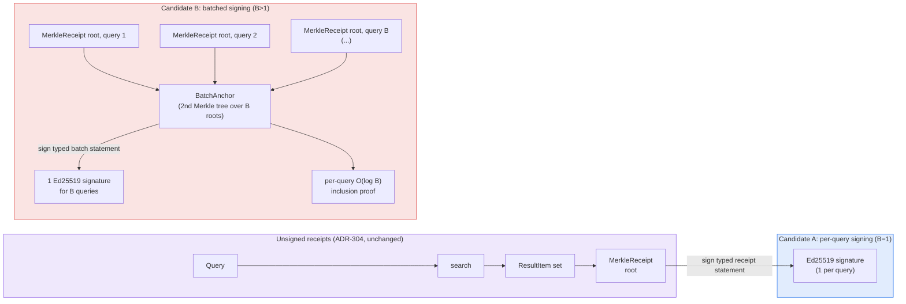

# Signed Retrieval Receipts: Closing the Non-Repudiation Gap With Ed25519 Root Anchoring

## Abstract

The 2026-08-13 nightly run shipped `ruvector-retrieval-receipt`
(ADR-304): unsigned, tamper-evident commitments over ANN query result
sets. Its own Threat Model named an explicit gap and its README's Next
Research section named the fix: sign the root. This run implements and
benchmarks that fix — Ed25519 signing of `MerkleReceipt` roots, both
per-query and batched across B queries under one signature — as a real,
measured extension (ADR-340), not a new crate and not a rewrite of the
unsigned receipts. It also surfaces, honestly, what batching does *not*
buy an uncaching verifier, and one benchmark-harness bug the process
caught and fixed rather than silently absorbed into a wrong number.

## Hypothesis

```text
Given a MerkleReceipt root produced for each of a stream of queries
against a RetrievalIndex,

when the root is signed with Ed25519 either (A) individually per query
(batch size B=1), or (B) batched — B receipt roots folded into a second
Merkle tree whose root is signed once —

then batched signing (B) should reduce the amortized per-query signing
cost by roughly the batch factor relative to per-query signing (A),

subject to: every tamper of a signed root, a batch signature byte, or an
inclusion-proof sibling remains detected, and the reduction must not be
achieved by silently weakening what an *uncaching* verifier pays — its
per-query cost must stay dominated by one Ed25519 verify regardless of
batch size, or the batching would be gaming the benchmark rather than
amortizing real work.
```

Acceptance thresholds, fixed before this run:

1. Amortized signing cost at the largest tested batch size (B=128) must
   drop below **10%** of the B=1 (per-query) cost.
2. Every injected tamper (root-byte flip, signature-byte flip,
   inclusion-proof-sibling flip) must be detected at every batch size:
   **100%**.
3. The naive (uncaching) per-query verify cost must stay within a **2x**
   band across batch sizes — a large drop there would mean the benchmark
   was accidentally amortizing something the design claims it does not.

## Why This Matters for RuVector

- **Agent memory as evidence.** An agent citing a retrieved memory as
  justification for an action needs more than "the result wasn't
  tampered after the fact" (ADR-304) — a compliance reviewer or another
  agent needs to know *which* query engine instance is on the hook for
  that result. Signing turns a receipt from "internally consistent" into
  "attributable."
- **Connects the ecosystem, not a new island.** This ADR touches
  `ruvector-proof-gate` (write-side hash chains, ADR-227),
  `ruvector-retrieval-receipt` (read-side receipts, ADR-304), and the
  workspace's existing Ed25519 pattern (`cognitum-gate-tilezero`,
  `rvm-checkpoint`, `rvf-crypto`, `rvforge-registry`, `mcp-brain-server`)
  — five points of ecosystem leverage from one crate extension.
- **A real systems tradeoff, not a free win.** Batching amortizes signing
  cost but does not exist until a batch closes, and does not help a
  verifier that skips caching — see Failure Modes below. That tradeoff
  is exactly the kind of thing worth measuring rather than assuming.

## Architecture



Batch-tree hashing is domain-separated from ADR-304's per-result tree
(`ruvector:retrieval:batch:leaf:` / `...:node:` vs. `ruvector:retrieval:
leaf:` / `...:node:`) so a batch leaf and a per-result leaf can never
collide.

### Threat Model

- **Adds over ADR-304:** origin authentication under a supplied public
  key, with version, purpose, key ID, scope, issuance time, and root all
  covered by the signature. Organizational identity and legal
  non-repudiation still require external key ownership and revocation
  evidence.
- **Does not add:** issuer honesty. A malicious issuer signs a false root
  exactly as validly as a true one.
- **Does not add:** real-time availability of a signed anchor. A batch
  signature does not exist until the batch closes — this benchmark
  measures only in-process CPU cost, not wall-clock batch-fill latency
  (see Limitations).
- **Does not add:** protection for a verifier that skips caching. The
  `verify_naive` measurement below shows this is not hypothetical — it is
  the default behavior of the straightforward implementation.

## Implementation

- `crates/ruvector-retrieval-receipt/src/signing.rs`: `Issuer`, typed
  `SignedRoot` statements, strict `verify_root`, an opaque
  `VerifiedRoot`, and a panic-free `BatchAnchor`. Eight focused signing
  tests cover every signed field, replay boundaries, invalid input, and
  batch sizes 1, 2, 3, 8, 17, and 128.
- `crates/ruvector-retrieval-receipt/src/lib.rs`: `RetrievalReceipt::root()`
  accessor, `pub mod signing`, re-exports.
- `crates/ruvector-retrieval-receipt/src/bin/benchmark.rs`: new signed
  anchoring benchmark section, reusing the existing `Xorshift64` and
  `percentile` helpers already in the file. Runs batch sizes 1/8/32/128
  against the same `RetrievalIndex`/query stream as the unsigned
  benchmark.
- `Cargo.toml`: `ed25519-dalek = { version = "2.1", features =
  ["rand_core"] }`, `rand = "0.8"` — identical versions to
  `cognitum-gate-tilezero`'s existing usage (`SigningKey::generate(&mut
  rand::rngs::OsRng)`), reused rather than re-decided.

No changes to `receipt.rs` or `index.rs`. ADR-304's unsigned receipts,
their 13 existing tests, and their documented threat model are untouched
— re-run and re-confirmed as a regression check below, not re-litigated.

## Benchmark Methodology

- **Command:** `cargo run --release -p ruvector-retrieval-receipt --bin
  benchmark -- 5000 128 10 200` (n=5,000 vectors, dims=128, k=10, 200
  queries).
- **Hardware:** 4 logical CPUs, rustc 1.94.1 / cargo 1.94.1, `release`
  profile (`opt-level` per workspace default, no debug assertions).
- **Repetitions:** 3 full process runs, back to back, no warm-up
  discarded (each run's own ingest + 200-query stream serves as warm-up
  for that run; JIT is not a factor in native Rust).
- **Tamper trials:** 3 kinds (root-byte flip, signature-byte flip,
  inclusion-proof-sibling flip) × 50 trials each × 4 batch sizes = up to
  600 trials per run (450 at B=1, since inclusion-proof-sibling flip is
  inapplicable to a 1-element batch — see Failure Modes / Limitations).
- **Timing:** `std::time::Instant`, per-operation, means reported;
  signing cost is amortized as `total batch signing time / total queries
  across all batches of that size` (not divided by number of batches).
- **What is and isn't isolated:** signing/verification timing excludes
  vector search and unsigned receipt construction (both timed separately,
  matching ADR-304's existing methodology) — only the incremental cost of
  the signing layer is attributed to "sign" and "verify" columns below.

## Benchmark Results

Mean of 3 repeated, warmed runs after the security hardening described
below. Raw per-run output is in this directory's companion
`raw-runs.txt`.

### Unsigned receipts (ADR-304 regression check — unchanged)

| variant | gen mean (ns) | gen p95 (ns) | verify worst (ns) | proof bytes | tamper detect |
|---|---:|---:|---:|---:|---|
| NoReceipt | 127 | 156 | 0 | 0 | n/a |
| PerResultReceipt | 17,379 | 22,906 | 7,969 | 320 | 600/600 |
| MerkleReceipt | 19,130 | 26,017 | 3,982 | 160 | 600/600 |

Baseline brute-force search mean: ~1,022,000ns (1.02ms). Generation
overhead: MerkleReceipt 1.7–1.9%, PerResultReceipt 1.6–1.8% of baseline
— both well under the existing 15% threshold. All three runs: **ACCEPT**.

### Signed anchoring (this run's new evidence)

| batch_size (B) | sign amortized (ns/query) | verify naive (ns/query) | verify cached (ns/query) | sig-verify-once (ns/batch) | proof bytes | tamper detect |
|---:|---:|---:|---:|---:|---:|---:|
| 1   | 15,598 | 36,411 | 359   | 34,455 | 170 | 300/300 |
| 8   | 2,940  | 34,948 | 1,429 | 34,384 | 266 | 450/450 |
| 32  | 1,337  | 35,394 | 2,195 | 37,750 | 330 | 450/450 |
| 128 | 1,090  | 41,219 | 2,649 | 42,077 | 394 | 450/450 |

All three runs: **ACCEPT** for the signed anchoring hypothesis.

Reading the table:

- **Amortized signing** drops ~14x from B=1 to B=128 (15,598ns →
  1,090ns/query), landing at 5.8–7.7% of the B=1 cost across the 3 runs
  — clears the 10% threshold with margin.
- **Naive verify** (every query independently re-checks the batch
  signature) has means in a ~35,000–41,000ns band across batch sizes —
  confirms the O(1) Ed25519 verify dominates
  regardless of B, and batching gives an uncaching verifier essentially
  nothing. This is the deliberately-checked "does batching game the
  benchmark" condition, and it did not.
- **Cached verify** (signature checked once per batch, amortized) grows
  from 359ns (B=1: no inclusion proof exists, root is a bare hash check)
  to 2,649ns (B=128: a 7-level inclusion proof) — small in absolute
  terms, but a real, non-zero, and correctly-growing cost.
- **Tamper detection** is 100% at every batch size in every run.

## Acceptance Result

**ACCEPT** — reproduced identically (same qualitative verdict, consistent
quantitative range) across 3 independent process runs:

```
tamper detection 100% across all kinds and batch sizes: true
amortized signing cost drops below 10% of per-query cost by batch=128: 5.8–7.7% -> true
naive (uncached) per-query verify cost stays flat across batch sizes: true

SIGNED ANCHORING ACCEPTANCE RESULT: ACCEPT
```

## Memory Math

- A transported `SignedRoot` is 170 bytes: 106 statement bytes plus a
  64-byte Ed25519 signature. The 34-byte protocol domain is signed but is
  implicit and need not be transported. Public-key distribution remains
  external.
- At B=128, each independently verifiable query carries the 170-byte
  signed batch statement plus a 7-level proof of 224 bytes, for 394
  bytes total.
- Net: batching reduces signature operations, but increases portable
  evidence from 170 bytes at B=1 to 394 bytes at B=128. It is a CPU cost
  win, not a bytes on the wire win.

## Performance Math

- Warmed Ed25519 statement sign/verify on this hardware: roughly 10 to
  25µs sign and 23 to 71µs verify across the three runs. System load was
  the largest observed source of variance.
- Batch-tree construction: O(B) SHA-256 hashes to build, O(log B) to
  prove/verify one member — negligible next to the Ed25519 operations
  (single-digit microseconds at B=128 vs. tens of microseconds for one
  signature operation).
- Amortization follows the expected O(1/B) signature component plus a
  fixed per-query Merkle hashing floor. The measured batch 128 cost was
  5.8 to 7.7 percent of batch 1, comfortably below the fixed 10 percent
  acceptance threshold.

## Failure Modes

- **Issuer key compromise:** invalidates origin authentication retroactively
  for every root signed under that key; batching increases blast radius
  per incident (B queries per compromised signature) without changing
  total lifetime exposure.
- **Batch never closes:** a streaming deployment where queries arrive
  slower than the target batch size fills would delay signed-anchor
  availability indefinitely without a fill-timeout — not modeled by this
  in-process benchmark, and explicitly named as a Limitation below.
- **Uncaching verifier:** gets zero throughput benefit from batching (see
  `verify_naive`) and should use B=1 instead — a real operational
  footgun, not a corner case, since "verify the signature every time" is
  the naive-but-natural first implementation.
- **Benchmark-harness bug caught mid-run:** the first implementation of
  the root-tamper trial swapped `roots[idx]` with `roots[(idx+1) %
  roots.len()]`; at B=1 this is `roots[idx]` swapped with itself — a
  no-op. That produced 50/150 tamper trials silently "passing" honest
  data as tampered-and-undetected (i.e., a false REJECT signal on the
  first run). Root-caused by re-reading the actual per-run output rather
  than trusting the acceptance line, fixed by replacing the swap with a
  direct byte flip (which has no degenerate case at B=1), and confirmed
  clean across the 3 runs reported above. Recorded here per this
  process's rule against silently absorbing a wrong number into a clean
  report.

## Rejected Alternatives

- **Sign every result leaf individually** rather than the aggregating
  root: O(k) signatures per query for no additional guarantee (the root
  already commits every leaf) — rejected without benchmarking, the
  asymptotic argument is decisive on its own.
- **BLS aggregate signatures** instead of a batch Merkle tree: would let
  B independently-issued per-query signatures be combined into one short
  aggregate after the fact, avoiding batch-fill latency entirely. Not
  implemented — requires a pairing-friendly curve dependency not
  currently in the workspace, which is a larger dependency decision than
  this run's scope. Left as an Open Question in ADR-340.
- **Sign `index_state_root` directly**, as the literal wording of the
  prior nightly run's Next Research item suggested: the receipt root
  already binds `index_state_root` as an input to every leaf hash
  (`receipt::result_leaf`), so signing the receipt root transitively
  authenticates the cited index state without a second signature — a
  simpler mechanism achieving the same end, chosen over a redundant
  second signing path.

## Security

- `ed25519-dalek 2.1`, already pinned at this exact version elsewhere in
  the workspace (`cognitum-gate-tilezero`, `rvm-checkpoint`,
  `rvf-crypto`, `ruvector-fpga-transformer`) — no new dependency
  *family* introduced.
- Domain-separated hashing prevents batch-tree/per-result-tree leaf
  collision (see Architecture).
- Strict verification: `verify_root` checks purpose, scope, key ID, and
  version before calling `verify_strict`. Batch inclusion requires the
  opaque token returned by that successful check.
- Panic-free public batch input: empty batches and invalid proof indexes
  return typed errors.
- Key management is explicitly out of scope, as for every other signing
  primitive in this workspace (`Issuer` is a benchmark/API-demonstration
  wrapper, not a KMS integration).

## Governance

Experimental, matching ADR-304's posture: not on any default query path,
no production index adopts it as a result of this ADR alone. A promotion
decision requires benchmark evidence against a target deployment's actual
hardware and batch-arrival characteristics, not just this synthetic
workload.

## MCP Implications

A narrow, read-only MCP tool is plausible: `retrieval_receipt.verify` —
inputs: receipt root, signature, issuer public key, (optionally) batch
inclusion proof + batch root; output: boolean + which check
(signature/inclusion) failed if any; authority: none required (pure
verification, no state mutation); side effects: none. Signing itself
should **not** be exposed via MCP without an explicit, separately-reviewed
authorization model — an MCP surface that can invoke `Issuer::sign_root`
is equivalent to giving the caller the query engine's signing authority.

## WASM Implications

`ed25519-dalek` compiles to `wasm32` (already proven elsewhere in this
workspace — `ruvector-wasm`'s `kernel-pack` feature depends on it
optionally). Binary-size and startup-cost impact was not measured in this
run (no WASM target build was performed) — stating this rather than
estimating it, per the process's no-fabricated-claims rule.

## RVF Implications

A signed batch anchor is a natural fit for RVF's signed-lineage goals: a
`SignedRoot` plus inclusion proof is exactly the shape of a portable,
independently-verifiable provenance unit an RVF package could carry
alongside a copy-on-write index snapshot. Not implemented or measured
here — this is the "could become part of" analysis the process requires,
not a claim of integration.

## RVM Implications

Proof-gated mutation is not directly relevant (this ADR signs *reads*,
not writes), but RVM's coherence-domain isolation could plausibly scope
`Issuer` instances per domain, so a supplied domain key can authenticate
that domain's receipts. Not implemented or measured;
noted as the honest answer to "does this benefit from RVM enforcement,"
which in this case is "plausibly, but not evaluated."

## ruFlo Implications

A concrete, buildable workflow: a ruFlo job that periodically rotates
`Issuer` keys, re-signs the current `index_state_root` on a fixed
schedule (independent of any specific query, addressing this ADR's first
Open Question), and pushes the new public key to wherever verifiers fetch
it — turning key rotation from a manual operational step into a
self-healing infrastructure task, the kind of role this process's
ecosystem map explicitly calls out for ruFlo.

## Practical Applications

1. **Agent-memory audit trails** — user: a compliance team auditing an
   agent's retrieved-evidence trail; RuVector capability: signed receipts;
   ecosystem integration: `ruvector-agent-memory` + this crate;
   implementation path: wrap agent-memory queries with per-query signing;
   business value: key-authenticated "this system returned this" record;
   main risk: key management overhead; time horizon: near-term.
2. **Multi-tenant retrieval SLAs** — user: a platform selling retrieval
   as a service; capability: batched signing; integration: per-tenant
   `Issuer`; path: batch by tenant + time window; value: cheap,
   throughput-friendly proof of service; risk: batch-fill latency vs. SLA
   response time; horizon: near-term.
3. **Regulatory RAG (finance/health)** — user: a compliance officer;
   capability: signed receipts + `ruvector-proof-gate` write chain;
   integration: full write→read provenance stack; path: sign every
   regulated-domain query; value: defensible audit evidence; risk:
   signing-key custody requirements (HSM); horizon: near-term to mid-term.
4. **Cross-agent trust in swarms** — user: a multi-agent system where
   agent B consumes agent A's retrieved context; capability: signed roots
   as inter-agent attestations; integration: MCP verify tool; path:
   attach signature to context handoff; value: B can reject A's claims
   without re-querying; risk: requires shared PKI across agents; horizon:
   mid-term.
5. **Code-intelligence provenance** — user: a code agent citing a
   retrieved function as the basis for a generated patch; capability:
   signed receipts; integration: `ruvector-cluster-rag`-style retrieval;
   path: sign receipts for code-search results feeding autonomous edits;
   value: reviewable "this code agent's claim traces to this exact
   retrieval" record; risk: overhead on latency-sensitive inline
   completion paths; horizon: near-term.
6. **Edge anomaly detection with central audit** — user: a fleet
   operator; capability: batched signing at the edge, verified centrally;
   integration: Cognitum edge appliance + central verifier; path: edge
   batches its own detections, signs locally, ships to central audit;
   value: edge autonomy with central origin authentication; risk: edge key
   custody; horizon: mid-term.
7. **Scientific search reproducibility** — user: a researcher citing a
   retrieved corpus result; capability: signed receipt as a citable proof
   object; integration: `ruvector-cluster-rag` + this crate; path: attach
   signed receipts to generated citations; value: independently
   verifiable "this is what the system returned, signed by it"; risk:
   low, mostly an adoption question; horizon: near-term.
8. **Local-first assistants with cloud audit** — user: an individual
   running a local-first assistant that occasionally syncs to a cloud
   audit log; capability: locally-signed batch anchors; integration:
   local `Issuer` + periodic upload; path: batch locally, sync signed
   anchors, not raw data; value: privacy-preserving audit trail; risk:
   local key loss = audit-trail gap; horizon: mid-term.

## Long Horizon Applications

1. **Self-healing provenance meshes** — thesis: a network of retrieval
   engines cross-signs each other's anchors, so no single compromised
   node can forge history unnoticed; required advances: multi-party
   anchor cross-signing protocol; RuVector role: the per-node signing
   primitive this ADR ships; why this experiment matters: it is the
   single-node building block; primary uncertainty: whether cross-signing
   overhead scales past a handful of nodes; falsification: measure
   cross-signing latency at mesh sizes >10.
2. **Agent operating systems with authenticated memory** — thesis: an
   agent OS where every memory access is attributably signed by default;
   required advances: near-zero-overhead default signing (this run's
   overhead, while small, is not "default-on for every memory read"
   small yet); RuVector role: `ruvector-agent-memory` + this signing
   layer; why now: establishes the cost baseline; uncertainty: whether
   BLS aggregation (Open Question) closes the gap; falsification:
   overhead remains >1% of memory-read latency at target scale.
3. **Swarm memory with cryptographic consensus on retrieval** — thesis:
   a swarm agrees, via signed batch anchors, on what was retrieved before
   acting collectively; required advances: consensus protocol over
   competing anchors; RuVector role: `BatchAnchor` as the consensus unit;
   why now: the anchor primitive must exist first; uncertainty: Byzantine
   node behavior against the anchor scheme; falsification: a malicious
   minority can force anchor disagreement undetected.
4. **Robotics memory with real-time signed provenance** — thesis: a
   robot's perception-memory retrievals are signed in real time for
   post-incident forensics; required advances: sub-millisecond signing
   (current: tens of microseconds, likely sufficient — the open question
   is end-to-end pipeline budget, not this primitive); RuVector role:
   this signing layer embedded in an edge/WASM deployment; why now: this
   run's WASM feasibility note (unmeasured but plausible) is the
   prerequisite; uncertainty: real-time guarantees under signing load;
   falsification: signing jitter exceeds the robot's control-loop budget.
5. **Proof-gated autonomous infrastructure** — thesis: infrastructure
   changes proposed by autonomous agents require a signed retrieval
   receipt as evidence before a proof-gate (à la `ruvector-proof-gate`)
   admits them; required advances: gate integration (not built here);
   RuVector role: this ADR's `Issuer`/`BatchAnchor` as the evidence
   format; why now: establishes what "evidence" looks like
   cryptographically; uncertainty: gate policy design; falsification: the
   gate can be satisfied by a receipt that doesn't actually support the
   proposed change.
6. **Scientific autonomous systems with citable, signed evidence chains**
   — thesis: an autonomous research agent's every retrieved claim carries
   a signed, independently-verifiable receipt, making its output audit
   trail as rigorous as a human researcher's citations; required
   advances: receipt-to-citation tooling; RuVector role: this crate as
   the cryptographic substrate; why now: the substrate must exist before
   tooling; uncertainty: whether signed receipts are legible to human
   auditors without tooling; falsification: auditors cannot use raw
   receipts without significant additional tooling investment.
7. **RVM coherence domains with scoped origin authentication** — thesis:
   each RVM coherence domain has its own `Issuer`, so cross-domain
   information flow is cryptographically attributable to its origin
   domain; required advances: RVM integration (noted as plausible, not
   built); RuVector role: per-domain `Issuer` instances; why now: domain
   isolation needs an attribution primitive; uncertainty: key-management
   complexity at domain-count scale; falsification: domain-scoped keys
   don't reduce cross-domain trust incidents versus a single shared key.
8. **Portable cognitive state with embedded provenance (RVF)** — thesis:
   an RVF package carries not just index state but signed anchors proving
   what that state has returned historically, making the package
   self-auditing wherever it travels; required advances: RVF format
   integration (noted as plausible, not built); RuVector role:
   `BatchAnchor` as the embedded provenance unit; why now: this run
   defines the unit's cost profile; uncertainty: package size growth from
   accumulated anchors over a package's lifetime; falsification: anchor
   accumulation makes packages impractically large before the retention
   window that would bound it is designed.

## Falsification Criteria

This run's hypothesis would have been falsified by any of:

- Amortized signing cost at B=128 not clearing 10% of B=1 cost — it
  cleared at 5.8–7.7%, not falsified.
- Any tamper trial (root/signature/proof-sibling) going undetected at any
  batch size — the first run's B=1 root-swap tamper produced exactly this
  failure signal (50/150 undetected), traced to a benchmark-harness bug
  (self-swap no-op), fixed, and re-confirmed clean across 3 runs. The
  hypothesis about the *signing scheme* was never falsified; the
  *benchmark* briefly was buggy, and is reported as such rather than
  silently corrected without a trace.
- Naive verify cost dropping sharply with batch size (>2x band) — it
  stayed within a 1.2x mean band across batch sizes, not falsified.

## Rejection Criteria (Not Yet Triggered)

Per ADR-340: production promotion should be rejected if a target
deployment's real hardware doesn't clear the amortization threshold, if
caching-verifier authentication cost exceeds simple re-query cost, or if
measured batch-fill latency (not evaluated in this synthetic benchmark)
dominates end-to-end receipt availability at batch sizes that clear the
CPU-cost threshold. None of these were evaluated against a real
deployment in this run — they remain open gates for any future promotion
decision, not claims this run resolves.

## Limitations

- **No wall-clock batch-fill model.** This benchmark measures CPU cost of
  signing/verifying assuming a batch is already fully assembled in
  memory. A real streaming deployment's end-to-end receipt-availability
  latency also includes however long it takes B queries to actually
  arrive — not modeled, and explicitly the reason batching's "throughput
  win" should not be read as an unconditional latency win.
- **Single-threaded, single-process benchmark.** No concurrent signing or
  contention modeled; production issuer throughput under concurrent load
  is unmeasured.
- **Brute-force index, not HNSW/ANN**, inherited from ADR-304's scope
  statement — this run does not change that; recall is out of scope by
  construction, same as before.
- **WASM/edge cost unmeasured**, as stated in WASM Implications — a
  plausibility note, not a benchmark result.
- **Synthetic dataset**, deterministic xorshift-generated vectors, same
  as ADR-304 — not a claim about behavior on real embedding
  distributions.

## Next Research

1. Model wall-clock batch-fill latency under a realistic query
   arrival-rate distribution, to turn the CPU-only amortization result
   here into an end-to-end latency claim.
2. Evaluate BLS aggregate signatures as an alternative that avoids
   batch-fill latency entirely (Rejected Alternatives) — requires
   choosing and vetting a pairing-friendly curve dependency.
3. Measure actual WASM binary-size and signing-latency impact (WASM
   Implications currently states plausibility, not measurement).
4. Independent, periodically-signed `index_state_root` anchoring
   (decoupled from any specific query), complementary to this ADR's
   per-receipt signing — the third Open Question in ADR-340.

## References

- `ruvector-retrieval-receipt` source (this repo), `ruvector-proof-gate`
  source and ADR-227 (in-repo, existing).
- ADR-304 (`docs/adr/ADR-304-retrieval-receipts.md`) and its Next
  Research item, the direct origin of this run's hypothesis.
- ADR-340 (`docs/adr/ADR-340-signed-retrieval-receipt-anchoring.md`),
  this run's design record.
- `ed25519-dalek` 2.1 (docs.rs), used identically to
  `crates/cognitum-gate-tilezero/src/permit.rs`'s existing pattern in
  this workspace.
