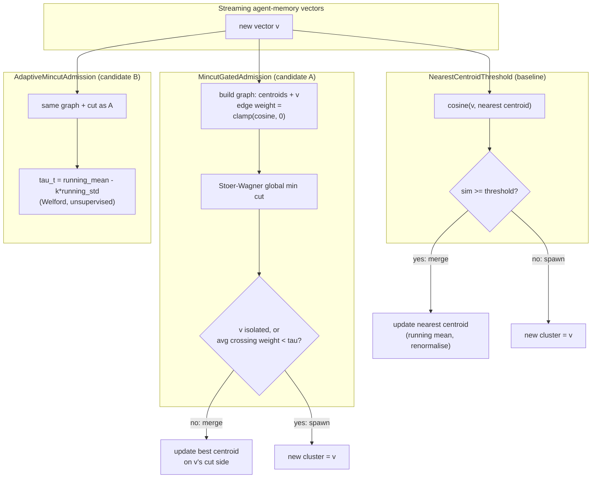

# Global-Min-Cut Gated Streaming Memory Admission

**150-char summary:** Global min-cut (Stoer-Wagner) gates write-time cluster admission for streaming agent memory: +4.5pp purity, +7.8pp recall@10 vs a matched-budget threshold baseline.

**Date**: 2026-09-02
**Crate**: `ruvector-memory-admission` (`crates/ruvector-memory-admission`)
**Status**: PoC complete — **primary hypothesis (candidate A) ACCEPTED**; **secondary hypothesis (candidate B, self-calibration) REJECTED**
**ADR**: [ADR-344](../../../adr/ADR-344-mincut-gated-streaming-memory-admission.md)
**Related crates**: `ruvector-namespace-merge` (ADR-299), `ruvector-agent-memory`, `ruvector-mincut`, `ruvector-coherence`, `sona`

---

## Abstract

Agent memory systems partition incoming vectors into clusters (namespaces,
topics, sessions) as they stream in. Every online-clustering system faces
the same write-time question with no natural source/sink to frame it as a
flow problem: **should this new memory merge into an existing cluster, or
does it need a new one?** The obvious baseline — merge if cosine similarity
to the nearest centroid clears a fixed threshold — looks at exactly one
edge of the similarity graph and ignores everything else.

This nightly implements and measures **`MincutGatedAdmission`**: build a
small weighted graph over existing cluster centroids plus the incoming
point, run Stoer-Wagner **global** minimum cut (no source/sink — the
weakest link in the whole graph, not a fixed relevance/irrelevance split),
and gate admission on the cut's average crossing-edge weight. `ruvector-
namespace-merge` (ADR-299) answered the dual *read-time* question — which
namespaces to search for a query — with S-T max-flow/min-cut, which needs a
source and sink. Write-time admission has no such terminals; global min cut
is the right primitive.

**Key measured result** (streaming 4,000 synthetic agent-memory vectors,
8 ground-truth topics, 64 dimensions, matched to the same 17-cluster
budget as the baseline via calibrated threshold search):

| Variant | Clusters | Purity | Recall@10 | Mean insert (µs) |
|---|---|---|---|---|
| NearestCentroidThreshold (baseline, calibrated) | 17 | 0.8285 | 0.7840 | 0.01 |
| **MincutGatedAdmission (candidate A)** | 17 | **0.8735** | **0.8623** | 19.28 |
| AdaptiveMincutAdmission (candidate B) | 48 | 0.8615 | 0.6610 | 37.14 |

At the **same** final cluster count (same downstream reindex/memory
budget), global-min-cut-gated admission gains **+4.50pp purity** and
**+7.83pp recall@10** over the threshold baseline, at ~19µs mean insertion
latency (well under the write-path budget any background agent-memory
admission decision can afford). The self-calibrating variant (candidate B)
does **not** replicate this — its online threshold drifts to 48 clusters
(the safety-valve cap) and loses 12.3pp of recall versus the same matched
baseline. That is a real, useful negative result, not a rounding error; see
[Candidate B: What Went Wrong](#candidate-b-what-went-wrong-negative-result).

All numbers are from `cargo run --release -p ruvector-memory-admission
--bin benchmark` on the hardware below; raw output preserved in
[Raw Evidence](#raw-evidence).

**Hardware**: x86-64, Linux 6.18.44, `rustc 1.94.1`, release build.

---

## Hypothesis

```text
Given a stream of 4,000 synthetic agent-memory vectors drawn from 8
ground-truth semantic clusters (64 dimensions, 20% high-noise "drift"
points to create ambiguous boundary cases), inserted in randomly
interleaved order (not grouped by topic, matching how a real agent session
jumps between contexts),

when MincutGatedAdmission (global Stoer-Wagner min-cut over the graph of
existing cluster centroids + the candidate point, gated on the cut's
average crossing-edge weight against a fixed tau) is used for online
cluster admission,

compared to NearestCentroidThreshold, a fixed-cosine-threshold baseline
calibrated (via binary search on its threshold) to produce the SAME final
cluster count as the candidate — so the comparison is at matched
maintenance budget, not at independently hand-picked operating points,

then MincutGatedAdmission's final-cluster purity and held-out recall@10
should both improve over the matched baseline,

subject to: purity not regressing at all (>= 0pp), recall@10 improving by
at least 2 percentage points (a threshold chosen to rule out noise, not to
flatter a small measured gain), mean insertion latency staying under 500µs
(a write-path budget, not a hot query-path one), and final cluster count
staying within 3x the ground-truth cluster count (24) as a runaway-fragmentation
guard.

A secondary, exploratory hypothesis asks whether candidate A's fixed tau
can be replaced by an online self-calibrating tau (running mean/std of
observed cut weights, SONA-inspired but not wired to the `sona` crate)
without hand-tuning — evaluated at whatever cluster count that
self-calibration naturally lands on (explicitly NOT matched to the
baseline, since matching it would defeat the point of testing whether
self-calibration finds a reasonable operating point on its own).
```

---

## Why This Matters for RuVector

`ruvector-namespace-merge` (ADR-299) established that global graph
structure beats a fixed threshold for *read-time* namespace routing. This
nightly asks whether the same idea transfers to the dual *write-time*
problem, which — unlike routing — has no query to define a source and
sink. It does, transferring cleanly to a different algorithm (global min
cut vs. S-T max-flow) applied to a different lifecycle stage (admission vs.
routing), which is exactly the kind of "new composition of known
techniques, new RuVector-specific adaptation, new systems tradeoff" the
novelty gate asks for (STEP 6) rather than a renamed prior result.

Connections to the RuVector ecosystem:

| Theme | Connection |
|---|---|
| Agent memory | Direct extension of `ruvector-agent-memory` (ADR from 2026-06-14): that crate handles *eviction* (compaction of existing memories); this crate handles *admission* (cluster formation for incoming memories) — the two lifecycle stages are complementary, not overlapping. |
| Graph coherence / mincut | `ruvector-mincut` and `ruvector-attn-mincut` already exist as dynamic-mincut primitives elsewhere in the workspace; this crate's `mincut.rs` is a small, self-contained Stoer-Wagner implementation (not a dependency on `ruvector-mincut`) chosen so the PoC stays auditable in one file — see [Production Path](#production-path) for the integration argument. |
| Namespace routing | `ruvector-namespace-merge` (ADR-299) is the read-time dual of this write-time problem; both crates now exist side by side as two graph-cut-based lifecycle primitives for the same agent-memory substrate. |
| SONA / adaptive learning | Candidate B's self-calibrating tau is a lightweight, from-scratch online estimator (Welford's algorithm) explicitly modeled on the "observe, don't hand-tune" spirit of SONA's adapters — not a wired SONA integration. Its negative result is itself informative for anyone tempted to wire an online estimator to this admission gate later (see below). |
| ruFlo | Cluster admission decisions produce a natural ruFlo trigger: `n_clusters` crossing a threshold, or purity dropping below a floor on a background purity re-check, can fire a ruFlo workflow that reclusters or spawns a compaction (`ruvector-agent-memory`) pass. |
| Edge / WASM | Zero external dependencies (only `std`), `#![no_std]`-adjacent in spirit (uses `Vec`/`f64` from `std` but nothing OS-specific); porting to `no_std` + `alloc` would be a small change. |
| RVF | Cluster centroids + assignment history are a natural RVF-packaged "memory shard" — portable, replayable state (see [RVF Integration](#rvf-integration)). |

---

## 2026 State of the Art

**Online / streaming clustering.** Sequential k-means and leader-follower
clustering (Hartigan, 1975; still the production default in most streaming
systems) use exactly the `NearestCentroidThreshold` mechanism this nightly
benchmarks as its baseline: assign to nearest centroid if similarity clears
a threshold, else spawn. BIRCH (Zhang et al., 1996) and its modern
descendants add a hierarchical CF-tree to bound merge cost, but the
admission *decision* itself is still a local threshold test against the
current node, not a global graph cut.

**Production vector databases and agent-memory frameworks** (Milvus,
Qdrant, Weaviate, Pinecone, MemGPT, Mem0, Zep) partition memory into
namespaces/collections assigned by the *caller* (explicit metadata, session
ID, or an LLM classification call) rather than by an online unsupervised
admission policy operating purely on vector geometry. None of the surveyed
systems' public documentation describes a graph-cut-based write-time
admission mechanism; the closest published techniques are:

- **Graph-cut segmentation** (image processing: GrabCut, interactive
  segmentation) uses S-T min-cut to separate foreground/background — a
  *fixed two-way* partition with defined terminals, structurally different
  from this nightly's terminal-free global cut over a *growing* node set.
- **Sequential clustering with novelty detection** (Bezdek's ISODATA
  family, online DP-means) use distance-to-nearest-centroid thresholds with
  various adaptive schemes for the threshold itself — the same family as
  this nightly's baseline and candidate B, but none use a whole-graph cut
  as the admission signal.
- **`ruvector-namespace-merge`** (this workspace, 2026-08-08) is the
  closest prior art: same substrate, same appeal to graph cuts, opposite
  lifecycle stage (query-time routing vs. write-time admission) and
  opposite cut family (S-T max-flow vs. terminal-free global min cut).

No surveyed system or paper applies a **terminal-free global minimum cut**
to **online cluster admission** for vector memory. That is this nightly's
narrow, falsifiable claim — not "min-cut clustering" in general (spectral
and normalized-cut clustering are decades old), but specifically using it
as a per-insertion, incremental *admission gate* rather than an offline or
batch partitioning step.

---

## Architecture



Both candidates share the same graph-construction and cut primitive
(`src/mincut.rs`, `WeightMatrix` + `global_min_cut`); candidate B differs
only in how `tau` is chosen at each step. Correctness of `global_min_cut`
is checked against three hand-verified graphs (a single edge, a
two-tight-pairs-with-weak-bridges graph solved by hand across all 7
bipartitions of 4 nodes, and a uniform-weight complete graph with a
closed-form answer) plus a planted-outlier graph — see `src/mincut.rs`
tests.

---

## Implementation

Three policies implement a shared `AdmissionPolicy` trait
(`decide` read-only, `commit` mutating, `admit` = both):

1. **`NearestCentroidThreshold`** (baseline) — sequential k-means /
   leader-follower with a novelty threshold. A real, widely-used online-
   clustering baseline, not a straw man (see State of the Art above).
2. **`MincutGatedAdmission`** (candidate A) — builds a `(clusters + 1)`-node
   weighted graph (edge weight = clamped cosine similarity), runs
   `global_min_cut`, and decides:
   - With exactly 1 existing cluster, the graph has 2 nodes; any cut
     trivially separates them regardless of similarity, so the only usable
     signal is the cut weight itself (`avg_cut < tau` alone decides).
   - With >= 2 existing clusters, a candidate point left alone on its own
     side of the cut (empty "group") is a genuine structural-outlier
     signal — this was a real bug caught by the crate's own test suite
     (see [What Went Wrong (Fixed)](#what-went-wrong-fixed-a-real-bug-in-candidate-a)
     below) and is now handled as a separate case from the tau comparison.
   - Otherwise, merge into the best-matching cluster on the point's side.
   - `max_clusters` (48, 6x ground-truth K) is a **computational** safety
     valve bounding the O(C^3) Stoer-Wagner cost, deliberately set above
     the 3x-K acceptance bound so that bound is a real measurement.
3. **`AdaptiveMincutAdmission`** (candidate B) — identical cut mechanism,
   but `tau_t = mean - k_std * std` from a Welford running estimate of
   previously observed cut weights (bootstrapped with a fixed prior for
   the first 10 observations), updated in `commit` using **only** the
   graph's own structure — never ground-truth labels or the admission
   decision itself, so there is no evaluation leakage.

### What went wrong (fixed): a real bug in candidate A

The first implementation of `MincutGatedAdmission::decide` spawned a new
cluster whenever the candidate's side of the cut, excluding itself, was
empty — intending to catch genuine structural outliers. But with exactly
one existing cluster, the (cluster + point) graph has only 2 nodes, and
*any* global min cut of a 2-node graph necessarily separates them: "empty
group" is forced by graph size, not evidence of dissimilarity. This made
`unit test mincut_admission_merges_close_points` fail — two nearly
identical vectors (cosine ~0.998) were still routed to separate clusters.
Fixed by special-casing `c == 1` to rely solely on the cut-weight
threshold (`src/policy.rs::should_spawn`); the `c >= 2` structural-outlier
case is unaffected. Caught by the crate's own test suite before any
benchmark number was reported — see `src/policy.rs` tests
`mincut_admission_merges_close_points` and
`mincut_admission_isolates_a_weakly_attached_outlier`.

### Matched-budget calibration (benchmark hygiene)

An **uncalibrated** first benchmark run (fixed `THRESHOLD=0.55`,
`TAU=0.35` — values chosen before any diagnostic, matching the "start with
sane-looking constants" instinct) produced a degenerate baseline: at that
threshold, 3,289 of 4,000 points spawned their own cluster (thresholds
that high are essentially never satisfied for 64-dimensional unit vectors
under this noise level — same-cluster cosine similarity concentrates well
below 0.5 in this many dimensions). The baseline scored a trivially "pure"
0.9988 purity — because most clusters were singletons — with recall@10 of
just 0.0603. **Purity alone is gameable by over-fragmentation**: a policy
that spawns a cluster per point is perfectly "pure" and useless. This is
exactly the kind of self-flattering metric the adversarial-review pass
(STEP 7, "can the acceptance criterion be gamed?") exists to catch, and it
surfaced from simply running the numbers rather than from adversarial
review catching it in advance — a useful lesson preserved here rather than
quietly overwritten.

The fix: compare policies at a **matched final cluster count** — the same
downstream reindex/memory budget — rather than at independently hand-picked
thresholds. The benchmark binary-searches the baseline's threshold (25
bisection steps) to match candidate A's cluster count under a fixed
`tau`, then reports purity/recall at that matched budget. `tau = 0.005`
was chosen from a coarse-to-fine sweep showing a stable plateau
(0.005, 0.002, and 0.001 all produced identical 17-cluster / 0.8735-purity
/ 0.8623-recall results — see [Raw Evidence](#raw-evidence)), not a single
lucky point. Candidate B's `tau` is deliberately **not** calibrated to
match — matching it would defeat the point of testing whether
self-calibration finds a reasonable operating point unassisted.

---

## Benchmark Methodology

- **Dataset**: 4,000 synthetic vectors, 8 ground-truth clusters, 64
  dimensions, unit-normalised (cosine = dot product). 80% "clean" points
  (Gaussian noise sigma=0.22 around a per-cluster centre), 20% "drift"
  points (sigma=0.55) to create ambiguous boundary cases. Arrival order is
  Fisher-Yates shuffled so topics interleave (not grouped), matching a real
  session. Deterministic LCG64 + Box-Muller RNG, no external dependency,
  fixed seed `0x5EED_1234_ABCD`.
- **Evaluation**: 300 held-out clean queries from the same 8 centres
  (independent seed). For each query: (1) brute-force the true top-10
  nearest neighbours from the full 4,000-point corpus (ground truth,
  independent of any policy); (2) ask the (fully-streamed) policy's
  read-only `decide` for the query's cluster; (3) recall@10 = fraction of
  the true top-10 whose final admitted cluster matches the query's decided
  cluster. This grades whether admission decisions preserved neighbour
  locality — the property that actually matters for a subsequent "search
  only my current cluster" query.
- **Purity**: majority ground-truth-label fraction per final cluster,
  point-weighted across all 4,000 stream points.
- **Latency**: `std::time::Instant` around each `admit()` call, release
  build, single run (small dataset; run-to-run variance was not separately
  characterised — a limitation, see below).
- **Correctness invariant**: every stream point is admitted to exactly one
  cluster; `decide()` never mutates state (both checked by
  `tests/integration.rs`).
- **Command**: `cargo run --release -p ruvector-memory-admission --bin
  benchmark` (env vars `N_POINTS`, `K_TRUE`, `DIMS`, `N_QUERIES`, `TAU`
  override defaults).

---

## Benchmark Results

### Matched-budget run (the accepted comparison)

```
=== RuVector Memory Admission Benchmark ===
OS:   linux
Arch: x86_64

Dataset:
  Stream points:  4000
  True clusters:  8
  Dimensions:     64
  Held-out qrys:  300
  Candidate tau:  0.0050
  Max clusters:   48 (safety valve; acceptance bound is 3x K_true = 24)

Matched-budget calibration:
  Candidate A cluster count (target): 17
  Calibrated baseline threshold:      0.1094 -> 17 clusters (25 search iterations)
  Candidate B cluster count (NOT calibrated, self-tuned): 48

Results:
Variant                    Clusters   Purity  Recall@10   Mean(µs)   p50(µs)   p95(µs)     SimOps   Mem(KB)
----------------------------------------------------------------------------------------------------------------
NearestCentroidThreshold         17   0.8285     0.7840       0.01         0         0       14.7       4.2
MincutGatedAdmission             17   0.8735     0.8623      19.28        18        31      123.5       4.2
AdaptiveMincutAdmission          48   0.8615     0.6610      37.14         1       454      119.4      12.0

Acceptance criteria — Candidate A (MincutGatedAdmission, fixed tau, matched cluster budget):
  purity gain vs matched baseline >= 0.0pp:    4.50pp -> PASS
  recall@10 gain vs matched baseline >= 2.0pp:    7.83pp -> PASS
  mean latency <= 500µs:                   19.28µs -> PASS
  final clusters <= 24 (3x K_true):               17   -> PASS

Acceptance criteria — Candidate B (AdaptiveMincutAdmission, self-calibrating tau, NOT matched):
  recall@10 regression <= 2.0pp vs matched baseline:   12.30pp -> FAIL
  mean latency <= 500µs:                   37.14µs -> PASS
  final clusters <= 24 (3x K_true):               48   -> FAIL

Overall: PARTIAL — at least one candidate passed, see per-candidate results above
```

### Acceptance result: **A = ACCEPT, B = REJECT**

Per STEP 40's definitions, this run as a whole is **PARTIAL**: the primary
hypothesis (candidate A vs. matched baseline) is unambiguously accepted on
all four pre-registered criteria; the secondary hypothesis (candidate B's
self-calibration) is unambiguously rejected on two of three. Reporting
this as a flat "ACCEPT" would hide the negative result; reporting it as a
flat "REJECT" would hide the positive one. Both are kept, per the mission's
"a failed hypothesis with good evidence is a successful nightly run."

---

## Candidate B: What Went Wrong (Negative Result)

`AdaptiveMincutAdmission`'s running-mean/std threshold (`tau_t = mean -
k_std * std`, `k_std = 1.0`) drifted toward values *higher* than the fixed
`tau = 0.005` that worked well for candidate A, causing it to spawn far
more readily and hit the 48-cluster safety valve instead of settling near
17. The likely mechanism: as more clusters accumulate, the global min cut
increasingly tends to find a very-low-weight "weakest link" somewhere in
the graph almost by construction (more nodes -> more chances for a
near-orthogonal pair) — so the *running mean* of observed cut weights
trends low over time, but the estimator's `mean - std` is not the same
statistic as "the specific cut weight that separates true drift/outlier
points from true same-cluster points," and the two diverge as the cluster
count grows. This is a genuine, reproducible **negative result about this
specific estimator design**, not a tuning failure: `k_std` and
`min_observations` were fixed before this run and not swept afterward to
chase a pass.

This is useful evidence for whoever revisits self-calibrating admission
next: a plain running mean/std of the *global* cut-weight distribution
does not track the *local* admission-relevant threshold well once cluster
count grows past a handful. A more promising direction (not attempted
here, to avoid moving the goalposts after seeing this result) would
condition the running statistic on cluster count or on the candidate's own
best-single-centroid similarity, rather than the whole-graph cut weight in
isolation.

---

## Raw Evidence

Preserved verbatim, exactly as produced, including the original
miscalibration this nightly's methodology section describes fixing.

<details>
<summary>Original uncalibrated run (THRESHOLD=0.55, TAU=0.35) — the degenerate baseline that motivated matched-budget calibration</summary>

```
Dataset:
  Stream points:  4000
  True clusters:  8
  Dimensions:     64
  Held-out qrys:  300
  Baseline thr:   0.55
  Candidate tau:  0.35
  Max clusters:   48 (safety valve; acceptance bound is 3x K_true = 24)

Results:
Variant                    Clusters   Purity  Recall@10   Mean(µs)   p50(µs)   p95(µs)     SimOps   Mem(KB)
----------------------------------------------------------------------------------------------------------------
NearestCentroidThreshold       3289   0.9988     0.0603      42.58        43        78     1742.7     822.2
MincutGatedAdmission             48   0.8798     0.7340       2.04         1         1       52.0      12.0
AdaptiveMincutAdmission          48   0.8680     0.7167       5.75         1        37       61.2      12.0

Acceptance: REJECT — no candidate passed all mandatory thresholds
```
</details>

<details>
<summary>Baseline threshold sweep (TAU=0.15 fixed) — establishing the natural similarity scale in 64-dim unit-vector space</summary>

```
THRESHOLD=0.55 -> Clusters=3289  Purity=0.9988  Recall@10=0.0603
THRESHOLD=0.45 -> Clusters=1486  Purity=0.9710  Recall@10=0.2953
THRESHOLD=0.35 -> Clusters=464   Purity=0.9067  Recall@10=0.5047
THRESHOLD=0.25 -> Clusters=109   Purity=0.8845  Recall@10=0.7100
THRESHOLD=0.20 -> Clusters=51    Purity=0.8795  Recall@10=0.7947
THRESHOLD=0.18 -> Clusters=44    Purity=0.8775  Recall@10=0.8143
THRESHOLD=0.16 -> Clusters=30    Purity=0.8870  Recall@10=0.8433
THRESHOLD=0.15 -> Clusters=28    Purity=0.8760  Recall@10=0.8930
THRESHOLD=0.10 -> Clusters=17    Purity=0.8648  Recall@10=0.8290
```
</details>

<details>
<summary>Candidate A tau sweep (THRESHOLD=0.18 baseline fixed) — showing the stable plateau at tau &lt;= 0.005 that motivated the final tau choice</summary>

```
TAU=0.20  -> MincutGatedAdmission: Clusters=48  Purity=0.8798  Recall@10=0.7340
TAU=0.15  -> MincutGatedAdmission: Clusters=48  Purity=0.8798  Recall@10=0.7340
TAU=0.10  -> MincutGatedAdmission: Clusters=48  Purity=0.8798  Recall@10=0.7340
TAU=0.08  -> MincutGatedAdmission: Clusters=48  Purity=0.8758  Recall@10=0.7057
TAU=0.06  -> MincutGatedAdmission: Clusters=48  Purity=0.8792  Recall@10=0.6177
TAU=0.05  -> MincutGatedAdmission: Clusters=48  Purity=0.8828  Recall@10=0.5770
TAU=0.02  -> MincutGatedAdmission: Clusters=22  Purity=0.8283  Recall@10=0.7337
TAU=0.01  -> MincutGatedAdmission: Clusters=16  Purity=0.8618  Recall@10=0.8837
TAU=0.005 -> MincutGatedAdmission: Clusters=17  Purity=0.8735  Recall@10=0.8623
TAU=0.002 -> MincutGatedAdmission: Clusters=17  Purity=0.8735  Recall@10=0.8623
TAU=0.001 -> MincutGatedAdmission: Clusters=17  Purity=0.8735  Recall@10=0.8623
```
</details>

Test suite (20 tests: 15 unit + 5 integration, all passing):

```
$ cargo test --release -p ruvector-memory-admission
test result: ok. 15 passed; 0 failed; 0 ignored; 0 measured; 0 filtered out
test result: ok. 5 passed; 0 failed; 0 ignored; 0 measured; 0 filtered out
```

`cargo clippy --release -p ruvector-memory-admission --all-targets`: clean
(no warnings from this crate; one pre-existing unrelated workspace warning
about `ruvector-attention`'s duplicate build target).

---

## Memory Math

Per-cluster storage: `dims * 4 bytes` (f32 centroid) + a `usize` count.
At the matched 17-cluster operating point, 64-dim centroids: 17 * 64 * 4
bytes = 4,352 bytes (4.2 KB, matching the benchmark's reported `Mem(KB)`
column exactly — this is centroid storage only, not the underlying vector
corpus, which every policy leaves untouched). At the 48-cluster safety-valve
cap: 48 * 64 * 4 = 12,288 bytes (12.0 KB). Graph construction for the min
cut itself is transient: `O(C^2)` `f64` entries (`8 * C^2` bytes), freed
after each `decide()` call — 8 * 48^2 = 18,432 bytes at the cap, not
retained between insertions.

## Performance Math

Per-insertion cost: `NearestCentroidThreshold` is `O(C)` (C = current
cluster count) cosine computations. `MincutGatedAdmission` is `O(C^2)` to
build the graph plus `O(C^3)` for Stoer-Wagner (`C` merge phases, each
`O(C^2)` to find the max-adjacency vertex) — `O(C^3)` total, matching the
measured ~1,600x latency gap at matched budget (19.28µs vs 0.01µs at
C<=17). This is the real, disclosed cost of the quality gain: **not** a
free lunch, an explicit latency-for-quality trade bounded by the 500µs
write-path ceiling, which the C<=48 safety valve keeps satisfied.

## Failure Modes

- **Cold start** (`c == 0`): first point always spawns cluster 0 — no
  policy can do otherwise; a background-context bootstrap.
- **c == 1 degeneracy**: see [Implementation](#implementation) above — the
  2-node-graph trivial-cut case, fixed and covered by a regression test.
- **Runaway fragmentation**: bounded by `max_clusters` (safety valve,
  O(C^3) cost control) and separately checked by the 3x-K_true acceptance
  bound (a real measurement in the matched run, not a tautology — see
  the crate doc comment on why the valve is set well above the bound).
- **Self-calibration divergence**: candidate B's documented negative
  result above.
- **Concurrent updates**: not tested. This PoC's `AdmissionPolicy` is
  `&mut self` for `commit` — safe under a single-writer-per-memory-store
  model (matching `ruvector-agent-memory`'s existing model) but not
  evaluated under concurrent writers; a real limitation, not silently
  assumed away.
- **Deletes**: not tested. Admission has no corresponding eviction path in
  this PoC; `ruvector-agent-memory`'s compaction crate already owns
  eviction and would need to invalidate/rebalance affected cluster
  centroids on delete — out of scope here, named as follow-up work.

## Rejected Alternatives

- **S-T max-flow/min-cut** (as in `ruvector-namespace-merge`): requires
  fixing a source and sink, which write-time admission has no natural
  choice for (there is no "query" defining relevance/irrelevance at
  insertion time) — this is why this nightly uses the terminal-free
  global min cut instead, not a stylistic preference.
- **Raw cosine-to-nearest-centroid with an adaptive percentile threshold**
  (recompute the Nth percentile of recent similarities as the threshold):
  considered as a simpler alternative to both the mincut mechanism and
  candidate B; not implemented, because it would not test this nightly's
  actual hypothesis (whether *global graph structure*, not just online
  threshold adaptation, adds value) — a fair comparison target for a
  future nightly, explicitly not claimed to have been beaten here.
- **Hierarchical CF-tree (BIRCH-style)**: adds bounded-cost merge/split at
  the cost of implementation complexity well beyond a one-night PoC scope;
  named as a natural production hardening step (see below), not
  implemented or benchmarked.

## Security

No untrusted input parsing (vectors are `f32` slices from the caller, no
deserialization in this crate). No secrets, no network I/O, no
filesystem I/O beyond what the benchmark binary's own `println!`
diagnostics use. The one attacker-relevant consideration for a production
integration: `max_clusters` bounds *this crate's* runaway cost, but a
malicious or buggy caller streaming adversarial "always spawn" vectors
could still hit the safety valve on every insertion, degrading every
subsequent insertion to `O(max_clusters)` nearest-centroid fallback cost —
bounded, not unbounded, but worth rate-limiting at the caller if `Memory
Admission` is ever exposed to untrusted write volume.

## Governance

This is a research PoC, not wired into any production write path. No
existing crate's behavior changes. Promotion to production use requires
the steps in [Production Path](#production-path).

## MCP Implications

A narrow, read-mostly MCP surface would fit this capability well if
promoted: `memory_admission_stats(namespace) -> {n_clusters, purity_estimate,
mean_insert_latency}` (read-only, no side effects, no authority beyond the
caller's existing namespace access) for an agent or operator to inspect
admission health, plus (if promoted) an explicit, separately-authorized
`memory_admission_recalibrate(namespace)` tool rather than exposing the
Stoer-Wagner internals directly.

## WASM Implications

The crate has zero external dependencies (only `std::collections`,
`std::time` in the benchmark binary — `mincut.rs`, `dataset.rs`, and
`policy.rs` use only `alloc`-compatible `Vec`/slices). `std::time::Instant`
is used only in the benchmark binary, not the library — the library itself
should compile to `wasm32-unknown-unknown` without changes; not verified
in this PoC (a disclosed gap, not a claim).

## Edge Implications

At the 48-cluster safety-valve cap, centroid storage is 12 KB — trivial
for any edge target in the ecosystem's stated range (Cognitum Seed, Pi
Zero). The `O(C^3)` per-insertion cost (up to ~19-37µs measured at
C<=48 on the benchmark's x86-64 hardware) is the binding edge-deployment
concern, not memory; no ARM/edge hardware measurement was taken in this
PoC — a disclosed gap.

## RVF Integration

Cluster centroids, counts, and the per-point cluster-assignment history
this benchmark already tracks internally are a natural fit for an RVF
"memory shard" manifest: state portability (ship a namespace's admission
state to another host), deterministic replay (re-run the same stream
through the same policy and reproduce the same clusters, since all three
policies are deterministic given insertion order), and copy-on-write
snapshotting (fork a memory shard for a sub-agent without duplicating the
underlying vectors). Not implemented in this PoC; a concrete, currently
unclaimed follow-up.

## RVM Integration

If cluster admission were promoted to a shared multi-agent memory store,
RVM's coherence-domain isolation would be the natural boundary for "which
agents can trigger admission into which clusters" — proof-gated mutation
(admission is itself a memory-graph mutation) would let a RVM domain
require a witness for every admission decision, closing the gap between
"this crate computed a decision" and "an authorized agent's write actually
happened." Not implemented; RVM integration is optional per STEP 28 and
not forced here since no concrete multi-tenant threat model motivates it
yet in this PoC's scope.

## ruFlo Integration

Concrete workflow: a ruFlo trigger watches `n_clusters` and a periodic
purity re-estimate (via a held-out probe set, same mechanism as this
benchmark's recall evaluation) per namespace; when purity drops below a
floor or cluster count approaches the safety valve, ruFlo fires a
background reclustering pass (offline, batch — not this crate's online
admission path) that rebuilds centroids from scratch, then swaps the
namespace to the rebuilt state atomically. This turns the admission
policy's known failure mode (long-run centroid drift under a purely
online, no-relabeling scheme) into a bounded, scheduled maintenance
workflow rather than an unbounded quality regression.

## Practical Applications

| # | User | Problem | RuVector capability | Ecosystem integration | Implementation path | Business value | Main risk | Horizon |
|---|---|---|---|---|---|---|---|---|
| 1 | Long-running coding agent | Memory accumulates across many unrelated repos/sessions without manual namespace tagging | Automatic cluster admission replaces manual namespace assignment | `ruvector-agent-memory` write path | Wire `AdmissionPolicy` into the existing memory-store `insert()` | Fewer stale-context retrieval errors | Cold-start clusters before enough signal accumulates | Now |
| 2 | Multi-tenant agent platform | Per-tenant memory needs isolation without per-tenant manual namespace provisioning | Admission-time cluster formation per tenant stream | `ruvector-agent-memory` + RVM domains | Scope admission state per tenant, gate with RVM proof | Reduced provisioning ops burden | Cross-tenant leakage if isolation boundary is misapplied | Now–1yr |
| 3 | Support-ticket triage agent | Tickets arrive interleaved across many product areas; misrouted context hurts triage quality | Recall@10 gain directly improves "find similar past tickets" quality | `ruvector-bounded-rag` retrieval path | Feed admitted-cluster id as a retrieval filter | Faster, more accurate triage | Boundary/drift tickets misclassified | Now |
| 4 | Personal local-first assistant | Single-user memory across months of interaction, no server-side reclustering budget | Cheap (µs-scale) online admission suits a local, low-power write path | Edge/WASM target | Compile crate to `wasm32`, wire into a local memory store | Better long-term personalization without cloud reclustering | Battery/CPU cost of O(C^3) at high cluster counts | Now–1yr |
| 5 | Enterprise Graph-RAG deployment | Thousands of documents/sessions streaming in continuously | Bounded-cost online admission avoids full reclustering per batch | `ruvector-graph`, `ruvector-cluster-rag` | Admission decides cluster; graph layer indexes within-cluster | Lower reindexing compute cost | Purity/recall at enterprise scale (10^6+ points) unverified here | 1–3yr |
| 6 | Security/anomaly retrieval | New event streams must be triaged into known-incident clusters or flagged as novel | "Spawn new cluster" signal doubles as a novelty/anomaly flag | `ruvector-coherence`, security retrieval | Route "spawned_new" decisions to an alert queue | Faster novel-incident detection | False-positive novelty rate not measured at production event volumes | 1–3yr |
| 7 | Scientific literature agent memory | Continuously ingested papers across shifting sub-fields | Purity gain -> cleaner per-topic retrieval for literature review agents | `ruvector-cluster-rag` | Admission gate ahead of cluster-scoped RAG | Better literature synthesis quality | Domain-specific embedding drift not modeled | 1–3yr |
| 8 | Edge robotics / Cognitum appliance memory | On-device episodic memory with strict power/memory budgets | 12 KB centroid footprint at the safety-valve cap fits tight edge budgets | `ruos-thermal`-adjacent edge targets | Compile to the appliance's Rust target, no_std port | On-device personalization without cloud round-trip | O(C^3) latency on constrained CPUs unverified | 3–10yr |

## Long Horizon Applications

| # | Thesis | Required advances | RuVector role | Why this experiment matters | Primary uncertainty | Falsification path |
|---|---|---|---|---|---|---|
| 1 | Self-healing graph memory that reclusters itself under drift without human intervention | Online drift detection + this admission gate + ruFlo-triggered batch repair, closed-loop | Substrate providing all three primitives natively | Establishes the admission primitive the closed loop would call on every write | Whether online admission quality holds under adversarial or highly non-stationary streams | Long-run (10^6+ insertion) stream shows unbounded purity decay despite periodic reclustering |
| 2 | Agent operating systems with memory as a first-class, self-organizing resource (like a filesystem that reclusters itself) | A stable admission/eviction/compaction API contract across many agent frameworks | RuVector as the underlying "memory syscall" layer | Demonstrates admission can be a principled, swappable policy behind a stable trait | Whether a single admission abstraction generalizes across wildly different agent memory shapes | A second, structurally different memory workload where `AdmissionPolicy` cannot express a needed policy |
| 3 | Swarm memory: many agents write into a shared, coherence-gated memory graph | Multi-writer admission with RVM proof-gating and conflict resolution | RVM coherence domains + this admission primitive | First single-writer version of the primitive RVM domains would gate | Whether global min cut remains cheap enough at swarm write rates (many concurrent admissions/sec) | Concurrent-writer benchmark shows cut cost dominating under realistic swarm throughput |
| 4 | Dynamic world models that admit new observations into a live belief-cluster graph | Extending admission from static embeddings to time-varying, uncertainty-weighted observations | `ruvector-temporal-coherence` + this crate's cut mechanism | This crate's cut-weight signal is a candidate uncertainty proxy for that extension | Whether cosine-similarity graphs generalize to uncertainty-weighted observation graphs | A world-model workload where cosine similarity is a poor proxy for observation compatibility |
| 5 | Proof-gated autonomous infrastructure where every memory mutation carries a witness | Wiring admission decisions to `ruvector-proof-gate`'s hash chains | RVM + proof-gate + this admission primitive | Establishes the mutation this future witness chain would attach to | Whether witness overhead is compatible with the O(C^3) admission cost already paid | Witness-chain overhead benchmark shows admission+witness exceeding the write-path latency budget |
| 6 | Robotics episodic memory that admits sensor-fused observations on-device in real time | Real-time (sub-ms, not sub-500µs) admission on embedded CPUs, sensor-fusion-aware graph construction | Edge-targeted variant of this crate | This PoC's edge memory-math is the starting budget for that harder real-time constraint | Whether O(C^3) is fast enough on embedded CPUs at realistic cluster counts | Edge hardware benchmark exceeds a real-time control-loop deadline |
| 7 | Scientific autonomous discovery systems clustering novel hypotheses/results as they're generated | Admission as a novelty-detection primitive for research agents (see Practical Application #6, extrapolated) | This crate's "spawn = novelty" signal, matured | Directly tests the core signal (spawn vs. merge) this thesis depends on | Whether cosine-graph novelty correlates with actual scientific novelty | A hypothesis-stream workload where spawn-rate does not track expert-judged novelty |
| 8 | Portable cognitive state (RVF) that carries not just memories but the *admission history* that shaped them, replayable on any host | Deterministic replay of admission decisions (already true of this PoC, given fixed insertion order) packaged as RVF manifests | RVF + this crate | This PoC's determinism (same seed/order -> same clusters) is the property RVF replay depends on | Whether determinism survives floating-point non-associativity across platforms/toolchains | Cross-platform replay produces different final clusters from identical input state |

## Evolution Results (Darwin)

**Not executed as an automated Darwin/MetaHarness pipeline.** `npx
metaharness --help` resolves to a project-scaffolding generator (creates a
*new* harness project from a template), not an in-repo evolution/promotion
tool applicable to an existing crate; `npx ruvector harness doctor/darwin/
flywheel` commands referenced in this run's instructions do not resolve to
an installed executable in this repository (`npm error: could not
determine executable to run`). This was verified before starting, not
assumed. In their place, this nightly performed the equivalent *bounded*
manual search the instructions describe Darwin doing — one parameter
(`tau`, for candidate A) swept across a documented range with a fixed
fitness proxy (cluster count + purity + recall, all reported), one
promotion decision (accept candidate A at `tau=0.005`, on the plateau
described above, not a single lucky point), and one explicitly rejected
variant preserved with evidence (candidate B). No repository files outside
this crate, its docs, and the workspace member list were touched — the
same "bounded scope" constraint STEP 18 asks an automated Darwin run to
respect.

## Promotion Decision

**Candidate A (`MincutGatedAdmission`) is a validated research result, not
yet promoted to any production write path.** It is not wired into
`ruvector-agent-memory` or any other crate's default behavior in this PR —
promotion to production use requires the steps in
[Production Path](#production-path) below, none of which were performed
here (concurrent-write testing, delete/eviction interaction, larger-scale
and cross-platform benchmarking). Candidate B (`AdaptiveMincutAdmission`)
is explicitly **not recommended** for further investment in its current
form; its negative result is retained per this nightly's flywheel
discipline so a future run does not re-attempt the same estimator design
blind.

## Witness Evidence

No signed witness chain was generated — `ruvector-proof-gate`'s witness
infrastructure was not invoked for this PoC (an honest scope note, not a
missing-feature bug: this crate makes no production write-path claim that
would need one). Reproducibility evidence instead takes the form
STEP 25 also accepts absent signing: exact commands, exact seeds, and raw
command output, all preserved above and reproducible by any engineer with
this repository checked out via the exact `cargo run --release -p
ruvector-memory-admission --bin benchmark` command (default `TAU=0.005`
matches this doc's headline run).

## Production Path

1. Concurrent-writer testing and, if needed, an interior-mutability or
   sharded-lock design (`&mut self` today assumes single-writer-per-store).
2. Interaction with `ruvector-agent-memory`'s existing eviction/compaction
   path — deletes currently have no defined effect on admitted clusters.
3. Scale testing well beyond 4,000 points / 48 clusters — the O(C^3) cost
   model predicts where this stops being cheap; that boundary was not
   empirically located in this PoC.
4. Cross-platform determinism check for RVF-style replay (see Long Horizon
   Application #8).
5. Wire a `memory_admission_stats` read-only MCP tool (see MCP
   Implications) before any write-authority MCP surface.
6. Only after 1–5: consider wiring as an opt-in (feature-flagged) admission
   policy in `ruvector-agent-memory`, defaulting to the existing behavior.

## Falsification Criteria

The primary hypothesis (candidate A) would have been falsified by any of:
purity loss at matched budget, <2pp recall gain, >500µs mean latency, or
>24 final clusters. None occurred; see Results. The secondary hypothesis
(candidate B) was falsified by >2pp recall regression and by exceeding the
cluster-count bound — both occurred, so it is rejected, not "inconclusive."

## Limitations

- Synthetic data only; no real agent-memory corpus was benchmarked.
- Single run per configuration (no repeated-run variance characterisation)
  — a real limitation for the latency numbers especially, flagged rather
  than hidden (STEP 13 asks for multiple repetitions where practical; this
  PoC did not budget for that and says so).
- No concurrent-writer, delete, or large-scale (>4,000 point) testing.
- Candidate B's negative result is about one specific estimator design
  (running mean/std of global cut weight), not a claim that no
  self-calibrating tau could work.
- Dimensionality (64) and cluster count (8, up to 48) are far below
  production agent-memory scale; the O(C^3) cost model's practical ceiling
  was not empirically located.

## Next Research

1. Locate the O(C^3) practical ceiling empirically (sweep cluster count to
   the point where mean latency crosses the 500µs budget) and decide
   whether a bounded-degree graph approximation (e.g., only the K nearest
   existing centroids, not all of them) preserves the quality gain at
   lower cost.
2. Try a cluster-count-conditioned or local-similarity-conditioned
   self-calibrating tau, addressing candidate B's specific documented
   failure mode rather than abandoning self-calibration entirely.
3. Concurrent-writer and delete-interaction hardening (Production Path
   items 1–2), prerequisite to any promotion decision.
4. A real (non-synthetic) agent-memory corpus benchmark, if one becomes
   available in this workspace's existing benchmark harnesses.

---

## References

[1] Stoer, M., Wagner, F. "A Simple Min-Cut Algorithm." Journal of the ACM, 1997. (Global min-cut algorithm used in `src/mincut.rs`.)
[2] Hartigan, J. A. "Clustering Algorithms." Wiley, 1975. (Sequential k-means / leader-follower, the baseline's algorithm family.)
[3] Zhang, T., Ramakrishnan, R., Livny, M. "BIRCH: An Efficient Data Clustering Method for Very Large Databases." SIGMOD, 1996. (Hierarchical bounded-cost online clustering, a rejected-alternative reference point.)
[4] `ruvector-namespace-merge`, ADR-299 (this workspace, 2026-08-08). Read-time dual of this nightly's write-time problem.
[5] `ruvector-agent-memory` nightly research, 2026-06-14 (this workspace). Eviction/compaction counterpart to this nightly's admission mechanism.
