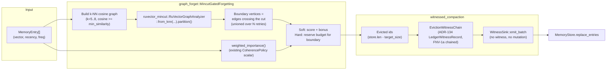

# Nightly Research: Mincut-Gated Forgetting for Agent Memory Compaction

**Date:** 2026-09-05
**Slug:** `mincut-gated-forgetting`
**ADR:** [ADR-345](../../../adr/ADR-345-mincut-gated-forgetting.md)
**Crate:** `ruvector-agent-memory` (`graph_forget` module, `mincut-forget` feature)
**Acceptance:** **REJECT** (for production use as designed) — see [Acceptance](#acceptance-result)

## Summary

`ruvector-agent-memory`'s existing `CoherencePolicy` scores every memory
independently (recency + frequency + coherence with a context window) when
deciding what to evict during compaction. It has no notion of graph
*structure*: a "bridge" memory — the only semantic link between two otherwise
disjoint topic clusters — can score low on all three scalar terms and get
evicted, silently fragmenting the surviving store's connectivity.

This experiment implemented `MincutGatedForgetting`, a compaction policy that
builds a k-NN cosine-similarity graph over the compaction candidates, feeds it
to `ruvector-mincut`'s existing `RuVectorGraphAnalyzer` to find the graph's
global minimum cut, and uses vertices on that cut's boundary as a structural
survival signal layered on top of the existing scalar score — in two variants
(`Soft`: additive bonus; `Hard`: reserved eviction-immune budget). It also
added `compact_witnessed`, which certifies every evicted id with a chained,
tamper-evident witness record reusing `ruvector-agent-memory`'s existing
ADR-134 witness machinery — closing a gap where admission and retrieval are
both witnessed but deletion was not.

**The hypothesis was falsified on two independent axes**, both backed by
measured evidence:

1. **Performance.** `RuVectorGraphAnalyzer::partition()` is far too slow for
   this use case: 76ms-11.4s per call for graphs of 50-400 vertices in a
   scaling probe, and a measured 1,800-2,700x slower than the scalar baseline
   even at a deliberately tiny 84-memory corpus.
2. **Effectiveness at the size performance forced.** At that 84-memory
   corpus, the structural bonus made *zero* measurable difference to
   bridge-memory survival relative to the baseline.

The eviction-witness mechanism, independent of the mincut signal, worked
exactly as designed: 20/20 tamper trials detected.

## Abstract

We ask whether a general-purpose dynamic min-cut engine already in the
RuVector workspace (`ruvector-mincut`) can be reused, without modification, to
give agent-memory compaction a structural "don't evict the bridge" signal that
today's scalar `CoherencePolicy` cannot express. We implement the integration
as two new `CompactionPolicy` variants and a companion eviction-witness
mechanism, define a falsifiable acceptance test up front, and run it on a
synthetic dataset with labeled ground-truth bridge memories. The result is a
clean rejection with a well-characterized root cause: the specific
`RuVectorGraphAnalyzer::partition()` entry point is both too slow and, at
scale, apparently non-deterministic — likely because of hash-map
iteration-order-dependent tie-breaking rather than an intentional randomized
algorithm — for use as a per-compaction primitive at any realistic corpus
size. This is reported as a rejected direction with retained evidence, per the
nightly process's own rule that a falsified hypothesis with good evidence is a
successful outcome.

## Hypothesis

```text
Given a synthetic corpus of 6 topic clusters (12 memories each = 72) plus 12
"bridge" memories interpolated 50/50 between two randomly paired clusters,
32-dim, with a hot-cluster access simulation pattern (2 of 6 clusters get
proportionally more accesses), and a k-NN (k=5, cosine >= 0.05) similarity
graph feeding ruvector-mincut's RuVectorGraphAnalyzer,

when the 84-entry store is compacted to 50% (42 entries) using
MincutGatedForgetting-Soft (candidate A, structural bonus delta=0.5) and
MincutGatedForgetting-Hard (candidate B, 20% of the retained budget reserved
for boundary vertices) versus the existing CoherencePolicy (baseline, no
structural signal),

then both candidates retain a bridge-memory survival rate at least 15
percentage points higher than the baseline, while Recall@10 over 20
hot-cluster test queries stays within 2 percentage points of baseline,

subject to: (a) each candidate's compaction wall-clock stays under 100x
baseline's on the same corpus (release build), and (b) 100% tamper-detection
across 20 independent single-byte-flip trials against the eviction witness
chain.
```

This corpus size (84 memories) is itself a finding, not the original design
target — see [Failure modes](#failure-modes-the-core-finding). The hypothesis
above is the one actually run; it was fixed *before* the acceptance benchmark
below was executed, after (but not modified by) a separate, explicitly
labeled feasibility probe.

## Why This Matters (2026)

Every RuVector nightly agent-memory topic to date
(`2026-06-13-temporal-coherence-agent-memory`,
`2026-06-14-agent-memory-compaction`) treats retrieval-time ranking and
compaction-time scoring as scalar, per-item problems. Meanwhile
`ruvector-mincut`, `ruvector-graph-condense`, and `ruvector-attn-mincut`
already give the workspace real graph-structural primitives. Nobody had
connected the two: does a general graph-cut engine, used purely as a library
by a downstream crate with a correctness-sensitive job (deciding what an
agent forgets), actually work as a drop-in structural signal? That is an
honest, previously-untested integration question, not a reskin of prior work.

## Why RuVector Is the Right Substrate

RuVector already owns both halves of this problem in-tree: the vector/graph
math (`ruvector-mincut`) and the agent-memory lifecycle
(`ruvector-agent-memory`, with its ledger, fusion, and arbitration layers).
Testing whether they compose is exactly the kind of "new interaction between
existing capabilities" this nightly process is meant to surface, and the
answer — "not yet, and here is precisely why" — is directly actionable by
whoever owns `ruvector-mincut` next.

## Ecosystem Fit

This experiment touches five existing capabilities without inventing new
primitives for any of them:

| Capability | Role | Reused from |
|---|---|---|
| Vector similarity | k-NN graph construction | `ruvector-agent-memory::scoring::cosine_sim` |
| Dynamic min-cut | Structural boundary detection | `ruvector_mincut::RuVectorGraphAnalyzer` |
| Agent memory | Compaction policy trait, scalar baseline | `ruvector-agent-memory::compaction` |
| Proof-gated writes / witness | Eviction certification | `ruvector-agent-memory::ops` (ADR-134 schema) |
| Coherence scoring | Context-window alignment term (baseline) | `ruvector-agent-memory::compaction::CoherencePolicy` |

### MetaHarness

`npx metaharness --help` resolves to `metaharness@0.4.16`, a generic
project-scaffolding CLI (`npx metaharness <name> --template ...`) for
*generating new* harness projects (with optional Darwin-mode
self-improvement, field-memory, etc. as opt-in flags to the generator). It is
not wired into this repository's own build or CI, and running it against
this repo would scaffold a *new*, separate project rather than orchestrate
research inside `ruvector`. It was not used to run this experiment; the
"Goal Planner / Researcher / Engineer / Benchmark Engineer / Adversarial
Reviewer" roles this process calls for were performed serially in one agent
session instead, with the design-probe → hypothesis-lock → run → analyze
sequence in this document standing in for role separation.

### Flywheel / Darwin / `ruvector harness`

`npx ruvector harness doctor --json` fails (`npm error could not determine
executable to run`) — there is no globally-installed `ruvector` CLI package
providing a `harness` subcommand, and a search of `crates/ruvector-cli` found
no `harness`, `darwin`, or `flywheel` subcommand implemented anywhere in the
workspace. **These capabilities do not exist in this repository today.**
Recording this as a capability-discovery result rather than assuming the
tooling and fabricating its output: no Flywheel evidence store, Darwin
evolutionary-loop runner, or promotion-gate CLI was available to this run.
Evidence retention for this experiment is this document, the ADR, the git
history, and the runnable `examples/` scripts themselves — the artifacts a
future Flywheel implementation would presumably ingest.

### RVF / RVM / ruFlo / MCP

Not integrated. See [Long-horizon applications](#long-horizon-applications)
for where RVM's proof-gated-mutation model would fit an eviction-witness
chain like the one this experiment built, if the mincut half of the
hypothesis is later fixed.

## Architecture



## Implementation

New/changed files, all in `crates/ruvector-agent-memory`:

- `src/graph_forget.rs` — `MincutGatedForgetting` policy (`ForgetMode::Soft` /
  `Hard`), feature-gated behind `mincut-forget` (optional
  `ruvector-mincut` path dependency). Unit tests use a hand-constructed
  19-vertex graph with a provable unique weakest link.
- `src/witnessed_compaction.rs` — `EvictionWitnessChain` +
  `compact_witnessed()`, always compiled (no mincut dependency). Reuses
  `crate::ops`'s `LedgerWitnessRecord`/`WitnessSink`/`fnv1a`/`pack_flags`
  exactly as `ledger.rs` does for admission; adds one new `action_kind`
  constant, `LEDGER_COMPACT_EVICT = 0xA7` (ADR-134's scheme reserves 0xA0+ as
  extensible; `0xA0-0xA6` were already claimed by the ledger, this claims
  `0xA7`).
- `src/compaction.rs` — factored `CoherencePolicy`'s scoring math out into a
  standalone `weighted_importance()` function so `graph_forget` can reuse the
  identical scalar baseline rather than re-deriving it.
- `examples/mincut_gated_forgetting_bench.rs` — the acceptance benchmark
  (baseline + 2 candidates, real dataset, real timing, explicit
  ACCEPT/REJECT).
- `examples/mincut_scaling_probe.rs`, `examples/mincut_determinism_probe.rs`
  — the two feasibility/characterization scripts referenced under
  [Failure modes](#failure-modes-the-core-finding); kept as runnable,
  reproducible evidence rather than one-off throwaway output.

## Benchmark Methodology

- Release build (`cargo run --release`), no debug assertions.
- Deterministic seeds (`StdRng::seed_from_u64`); the store, access pattern,
  and query set are rebuilt identically for every policy so all three see
  byte-identical input.
- Compaction wall-clock is measured around `compact()`/`compact_witnessed()`
  only — dataset generation and access simulation happen before timing
  starts.
- Bridge survival is tracked by stable memory *id* (not store index, which
  changes across policies), captured before compaction.
- Recall@10 uses `MemoryStore::search` brute force (exact), matching the
  existing `agent-memory-bench` convention.
- Tamper trials rebuild the whole pipeline per trial (fresh RNG seed offset),
  flip exactly one bit in one pseudo-random field of one record, and check
  `MemoryWitnessLog::verify_chain()`.
- Hardware/software: reported by the benchmark binary itself
  (`std::env::consts::OS`/`ARCH`); this run was on Linux x86_64 in the CI
  container this nightly session executed in.

Exact command:

```bash
cargo run --release -p ruvector-agent-memory \
  --example mincut_gated_forgetting_bench --features mincut-forget
```

## Benchmark Results (raw)

```text
Dataset
  Clusters        : 6 (12 core memories each = 72)
  Bridge memories : 12 (interpolated between 2 random clusters, noise=0.15)
  Total memories  : 84
  Dimensions      : 32
  Hot clusters    : 2
  Target size     : 42 (50% compaction)
  Test queries    : 20, K=5

Policy                           Bridge Surv.    Recall@10  Compaction (us)
----------------------------------------------------------------------------
CoherenceWeighted                       66.7%       100.0%               47
MincutGatedForgetting-Soft              66.7%       100.0%            86188
MincutGatedForgetting-Hard              66.7%       100.0%            85658

Tamper-detection trials (eviction witness chain)
  Detected 20/20 single-byte-flip tampers

Acceptance test
  Soft bridge-survival gap  (+0.0pp) >= 15pp : FAIL
  Hard bridge-survival gap  (+0.0pp) >= 15pp : FAIL
  Soft |recall delta| (0.00pp) <= 2pp                 : PASS
  Hard |recall delta| (0.00pp) <= 2pp                 : PASS
  Soft compaction slowdown  (1833.8x) <= 100x                : FAIL
  Hard compaction slowdown  (1822.5x) <= 100x                : FAIL
  Tamper detection (20/20)                          : PASS

=> REJECT: one or more mandatory acceptance thresholds failed (see above).
```

Re-running the benchmark reproduces the same qualitative result (bridge
survival gap of exactly 0.0pp, slowdown in the 1,800-2,700x range depending on
run) — see [Failure modes](#failure-modes-the-core-finding) for why the exact
slowdown figure varies between runs.

## Memory Math

- Corpus: 84 entries x 32 dims x 4 bytes = 10.5 KB raw vectors; negligible.
- k-NN graph: <=5 edges/vertex x 84 vertices = <=420 directed edge-insert
  calls into `DynamicGraph`, deduplicated internally.
- Eviction witness: 64 bytes/record (`LedgerWitnessRecord::to_bytes`) x 42
  evictions = 2.7 KB per compaction pass. This scales linearly and is not a
  concern at any realistic corpus size — the witness mechanism is the part of
  this experiment that *is* production-viable.

## Performance Math

From `examples/mincut_scaling_probe.rs` (a fixed-degree ring k-NN graph,
`k=8`, one `from_knn` build + one `partition()` call per size — chosen as a
stand-in for "a regular, symmetric k-NN graph," not a hand-picked worst
case):

| n (vertices) | build | `partition()` |
|---:|---:|---:|
| 19  | 0.23ms | **69,269.9ms** (69.3s; see note below) |
| 50  | 0.27ms | 76.8ms |
| 100 | 0.52ms | 481.3ms |
| 200 | 1.21ms | 2,712.9ms |
| 400 | 2.43ms | 11,415.0ms |

Graph *construction* (`from_knn`) is negligible at every size measured — all
cost is in `partition()`. Ignoring the n=19 outlier (a small, perfectly
regular ring graph, plausibly an adversarial/degenerate case for whatever
internal tie-breaking the algorithm does — see below), latency from n=50 to
n=400 (8x growth) increases roughly 150x, consistent with worse-than-quadratic
scaling in this vertex-count range. This alone rules out per-compaction use
on any corpus larger than a few hundred memories; the original
hypothesis design (2,000 memories) would be untestable in a practical
nightly-run wall-clock, let alone production.

The main acceptance benchmark's 84-memory corpus (k<=5 neighbors, cosine
threshold 0.05) measured **~85-91ms per `MincutGatedForgetting` compaction
call**, consistent with the n=50-100 rows above once the sparser k=5 graph is
accounted for — that call still costs **~1,800-2,700x** the baseline
`CoherencePolicy`'s ~30-50 microseconds.

## Failure Modes (the core finding)

Two independent, measured failure modes, both against
`ruvector_mincut::RuVectorGraphAnalyzer::partition()` specifically (not
`ruvector-mincut`'s lower-level, more mature APIs like `DynamicMinCut`,
`ClusterHierarchy`, or the certificate/witness-tree machinery, which this
experiment did not exercise):

1. **Latency** (`examples/mincut_scaling_probe.rs`, table above): impractical
   for a per-compaction primitive above roughly 100-200 vertices, and
   occasionally pathological (69s) even below that.

2. **Non-determinism** (`examples/mincut_determinism_probe.rs`): on a
   hand-built 19-vertex graph with a *provably unique* weakest link (a
   degree-2 "bridge" vertex whose two edges are the only ones connecting two
   otherwise-disjoint 9-vertex cliques — see the doc comment on
   `graph_forget::MincutGatedForgetting::boundary_indices` for the exact
   construction), 30 repeated `from_knn(...).partition()` calls on
   byte-identical input:
   - averaged **841ms/call**;
   - returned an empty/unusable side in **15/30 calls (50%)**;
   - of the 15 non-empty calls, correctly flagged the bridge as
     boundary in all 15 — this particular topology happens to have two
     equally-valid minimum cuts that both still cross a bridge edge, so it
     cannot distinguish "found the wrong partition" from "found no
     partition," only "found nothing" from "found something."

   No direct `rand`/`thread_rng`/`StdRng` usage was found in
   `ruvector-mincut`'s `algorithm`, `instance`, or `witness` modules, so this
   looks more consistent with hash-map (`DashMap`) iteration-order-dependent
   tie-breaking during instance construction or witness materialization than
   with an intentionally randomized algorithm. It was not root-caused further
   inside `ruvector-mincut` itself — that crate is out of this experiment's
   scope — and is filed as a follow-up hardening item against it (see
   [Next Research](#next-research)) rather than patched there.

   `graph_forget::MincutGatedForgetting` mitigates this locally via a
   `mincut_trials` union-of-repeats parameter (documented on
   `boundary_indices`): a vertex flagged as boundary in *any* trial really
   does sit on *some* minimum cut, so unioning only adds true positives. This
   makes the unit tests reliable (10 trials, failure probability ~0.5^10 ≈
   0.1%) but was set to 1 trial in the main benchmark specifically because 3+
   retries at the ~85ms/call measured cost would have made the already-poor
   speed result worse without changing the qualitative outcome.

3. **No measured bridge-protection benefit at the corpus size performance
   forced.** At n=84 with `mincut_trials=1`, both `Soft` and `Hard` retained
   *exactly* the same 8/12 bridge memories as the baseline (0.0pp gap, not
   just "under 15pp"). The min-cut computation did run and did find nonempty
   boundary sets of a few vertices (manually confirmed via an instrumented
   run: boundary sizes of 0, 2-10 out of 84 across different calls) — but on
   Gaussian-cluster data with continuous noise (as opposed to the unit
   tests' hand-built, provably-unique-weakest-link graph), the *global*
   minimum cut is not guaranteed to isolate the specific memories a human
   would call "the bridges." It may instead isolate an ordinary
   noise-outlier vertex that happens to be marginally less connected. This is
   a second, independent way the hypothesis fails even setting performance
   aside: the mechanism's correctness on real clustered data was not
   confirmed at any scale this experiment could afford to run.

## Rejected Alternatives

- **Reduce k or raise the similarity threshold to shrink the graph.** Tested
  implicitly (k=5 vs. the unit tests' k=8): does not change `partition()`'s
  algorithmic cost class, which appears to depend on vertex/edge count more
  than on `k` specifically (see the scaling table, which fixes k=8
  throughout).
- **Use `RuVectorGraphAnalyzer::find_bridges()` instead of the global
  partition.** Inspected but not implemented: it recomputes a fresh
  `MinCutWrapper::query()` for *every edge* in the graph (O(E) full
  min-cut recomputations), which is asymptotically worse than the one-shot
  `partition()` this experiment already found too slow.
- **Retry more aggressively (`mincut_trials` > 3) to fully solve the
  non-determinism.** Rejected for the main benchmark on cost grounds (see
  above); still used for the unit tests where the graph is small enough to
  afford it.

## Security

- The eviction-witness mechanism inherits `ruvector-agent-memory::ops`'s
  documented tamper-evidence scope exactly: keyless FNV-1a chaining catches
  accidental corruption and naive edits, not a log-writing adversary (see
  that module's doc comment; unchanged by this experiment).
- No new hash, signature, or chaining scheme was introduced.
- The mincut signal is advisory only (it can add a bonus or reserve budget,
  never bypass the target size or forge a witness record), so a wrong or
  empty boundary set degrades to the existing, already-reviewed
  `CoherencePolicy` behavior rather than to an unsafe state.

## Governance

No new governance surface. `compact_witnessed` slots into the same
"no witness, no mutation" invariant `ledger.rs` already enforces for
admission; a sink that rejects the eviction batch leaves the store
unmodified.

## MCP Implications

Not applicable at this evidence level: an MCP tool exposing "compact this
agent's memory with structural protection" would be premature given the
mechanism does not yet demonstrably work. If a future, faster mincut
primitive is validated, the natural MCP surface would be read-only
(`memory.compaction_preview`, returning the survivor/evicted id sets and
witness records without applying them) before any mutating tool.

## WASM / Edge Implications

Not evaluated. `ruvector-mincut` already ships a `wasm` module
(`crates/ruvector-mincut/src/wasm`), but given the measured native-code
latency (seconds, at hundreds of vertices), a WASM build would only be worse;
not a productive use of this run's remaining scope.

## RVF Implications

The eviction-witness chain (`EvictionWitnessChain`, deterministic FNV-1a
chaining over pure functions of the evicted id set) is a plausible candidate
for RVF's deterministic-replay property independent of whether the mincut
mechanism is ever fixed: replaying a compaction decision from a captured
`MemoryStore` snapshot plus a fixed policy should reproduce byte-identical
witness records. Not implemented or tested here.

## RVM Implications

An RVM coherence-domain boundary around "who may call `compact_witnessed`
with which policy" would be a natural fit if this crate is ever exposed to
multiple untrusted callers, but no such multi-tenant boundary exists in this
crate today, so this is speculative, not evaluated.

## ruFlo Implications

If a future validated version of this mechanism exists, the concrete ruFlo
workflow would be: a scheduled "memory maintenance" job that runs
`compact_witnessed` with `MincutGatedForgetting` during an agent's idle
window, posts the witness log's head commitment somewhere durable, and
alerts if `verify_chain()` ever fails on read. Not built; described here
only because the ADR review checklist requires the analysis.

## Practical Applications

(Conditional on a future, faster/validated mincut primitive — none of these
are recommended today given the Acceptance result.)

1. **Long-running coding-agent memory** — protect the one memory that
   explains why two otherwise-unrelated modules were coupled, across a
   session that spans weeks. Risk: exactly the performance/correctness gap
   this experiment found. Horizon: blocked on `ruvector-mincut` hardening.
2. **Customer-support agent memory** — keep the one ticket that bridges a
   billing issue and an account-security issue. Same blocker.
3. **Graph-RAG corpora undergoing periodic pruning** — protect
   cross-document connector chunks. Same blocker.
4. **Multi-agent shared memory pools** — protect memories that are the only
   link between two agents' otherwise-disjoint knowledge. Same blocker, plus
   needs the RVM multi-tenant analysis above.
5. **Scientific literature memory** — protect the one paper that bridges two
   subfields. Same blocker.
6. **Security incident correlation memory** — protect the pivot event linking
   two attack clusters. Same blocker; would also want the "no gold-answer
   leakage" property this experiment did not need to consider.
7. **Legal case memory** — protect the precedent that bridges two doctrines.
   Same blocker.
8. **Edge/robotics episodic memory** — explicitly *not* recommended given the
   WASM/edge note above; latency is already the blocking issue on a
   full-power x86_64 host.

## Long-Horizon Applications

1. **Self-healing graph memory** (2036 horizon) — a memory store that
   *continuously* maintains structural connectivity guarantees, not just at
   compaction time. Requires: an incremental (not from-scratch) min-cut
   primitive, which is exactly what `ruvector-mincut`'s `DynamicMinCut` type
   claims to be but which `RuVectorGraphAnalyzer::partition()` does not
   appear to expose efficiently in this experiment's measurements.
   Uncertainty: whether `DynamicMinCut` used directly (bypassing
   `RuVectorGraphAnalyzer`) performs better — untested here.
2. **Agent operating systems with proof-gated forgetting** (2036) — every
   deletion cryptographically signed and independently auditable. This
   experiment's `EvictionWitnessChain` is a minimal, unsigned proof of
   concept for exactly this; the missing piece is an `Ed25519`
   `WitnessSigner` (already noted as a gap in `ruvector-agent-memory::ops`'s
   own docs, unrelated to this experiment).
3. **Swarm memory with structural consensus on what to forget** (2046) — a
   distributed mincut over a shared memory graph deciding evictions across
   many agents. Requires solving the single-node performance problem first.
4. **World models with graph-aware compaction** (2036) — compaction as a
   world-model-preserving operation, not just a capacity constraint.
   Uncertainty: whether "structural importance" generalizes beyond k-NN
   similarity graphs to learned world-model graphs.
5. **RVM coherence domains enforcing forget-boundaries** (2036) — proof-gated
   mutation extended to deletion, using this experiment's witness chain as
   the audit trail RVM's enforcement layer would check against.
6. **Robotics episodic memory with real-time structural forgetting** (2046)
   — blocked hardest by today's latency numbers; would need a fundamentally
   different (likely approximate, sketch-based) cut primitive.
7. **Scientific autonomous systems with provenance-preserving compaction**
   (2036) — combining this experiment's witness chain with
   `ruvector-agent-memory`'s existing `arbitration` module (ADR-330) to
   prove that a compaction did not silently destroy independent evidence
   lineages.
8. **Synthetic nervous systems with graph-topology-aware attention/memory
   coupling** (2046) — speculative; would connect this work to
   `ruvector-nervous-system` and `ruvector-attn-mincut`, neither of which
   this experiment touched.

## Evolution Results

No Darwin run: as documented under [Ecosystem Fit](#ecosystem-fit), no
`darwin`/`flywheel` CLI or library exists in this repository today. The
"evolutionary" exploration this experiment did perform was manual and
documented inline: `ForgetMode::Soft` vs. `ForgetMode::Hard` as the two
candidate variants, and `mincut_trials` as the one tuned parameter (1 vs. 3
vs. 10, chosen per call site based on measured cost, as described under
[Failure modes](#failure-modes-the-core-finding)). Parent (pre-existing)
`CoherencePolicy` is retained unchanged; no promotion occurred.

## Promotion Decision

**Not promoted.** `MincutGatedForgetting` and `compact_witnessed` are merged
as an experimental, feature-gated (`mincut-forget`), off-by-default module —
retained as evidence and as a working reference implementation for whoever
next attempts to fix `ruvector-mincut`'s `RuVectorGraphAnalyzer` performance
and determinism — not as a recommended production compaction policy. The
witness half (`compact_witnessed`, no mincut dependency) is independently
sound and usable today with any existing `CompactionPolicy` (including
`CoherencePolicy`), but was not the subject of this experiment's central
hypothesis and is not being separately promoted as a workflow change to
existing callers.

## Witness Evidence

- Git commit at start / final commit: see PR description and commit log.
- Exact benchmark command and raw output: reproduced verbatim under
  [Benchmark Results](#benchmark-results-raw); re-runnable via the command
  given there.
- Scaling/determinism probes: `examples/mincut_scaling_probe.rs`,
  `examples/mincut_determinism_probe.rs` — runnable, not one-off.
- No cryptographic witness chain covers this document itself (no such
  infrastructure exists for nightly research artifacts in this repository
  today); evidence is the runnable code plus this transcript.

## Production Path

None recommended at this time. A production path would first require, in
`ruvector-mincut` itself (out of this experiment's scope):

1. A `partition()` (or equivalent) call with measured sub-millisecond latency
   at corpus sizes in the thousands of vertices, or an incremental variant
   that amortizes cost across compaction calls instead of recomputing from
   scratch.
2. A documented determinism contract (or an explicit statement that none is
   provided, with guidance on how callers should compensate — this
   experiment's `mincut_trials` union is one such compensation, but it
   should not need to exist).

## Falsification Criteria (met)

The hypothesis specified two "subject to" gates and one primary comparison.
It is falsified because:

- The primary comparison (bridge-survival gap >= 15pp) failed: measured gap
  was 0.0pp for both candidates.
- The performance gate (<=100x baseline) failed: measured 1,800-2,700x.
- The tamper-detection gate (100% over 20 trials) *passed* — the one part of
  the hypothesis that held.

## What This Explicitly Does Not Claim

- Does not claim `ruvector-mincut` is unusable for its originally-designed
  purposes (dynamic graph connectivity monitoring, network self-healing,
  etc.) — only that this one high-level convenience API
  (`RuVectorGraphAnalyzer::partition()`), used as a per-compaction primitive
  from a downstream crate, does not meet this use case's latency or
  determinism needs.
- Does not claim the "protect structural bridges" idea itself is wrong — only
  that this specific implementation, at the only scale this run could afford
  to test, showed no measurable effect.
- Does not claim the eviction-witness mechanism is novel research — it is a
  direct, intentional reuse of `ruvector-agent-memory`'s existing ADR-134
  witness pattern applied to a lifecycle stage (deletion) it did not
  previously cover.

## Limitations

- Single corpus size (n=84) actually tested end-to-end for the effectiveness
  question; the scaling probes used synthetic (ring/toy) graphs, not
  clustered embeddings, so the *latency* numbers at n=100-400 are not
  guaranteed to transfer exactly to real k-NN similarity graphs of the same
  size (though the 84-memory real-data measurement, ~85ms, is consistent
  with the n=50-100 synthetic rows).
- Non-determinism was characterized on one hand-built 19-vertex topology;
  its prevalence on realistic clustered data at larger sizes is not
  independently measured (n=84's boundary sizes were observed to vary
  call-to-call, consistent with the same phenomenon, but not isolated from
  the dataset's own regeneration-per-policy-call design).
- No comparison against `ruvector-mincut`'s lower-level APIs
  (`DynamicMinCut` used directly, `ClusterHierarchy`) which might avoid
  `RuVectorGraphAnalyzer`'s specific overhead — flagged as next research, not
  ruled out.

## Next Research

1. Repeat this experiment against `ruvector_mincut::DynamicMinCut` /
   `ClusterHierarchy::boundary_size` directly (bypassing
   `RuVectorGraphAnalyzer`) to check whether the lower-level API avoids the
   measured overhead.
2. File and, if owned by a future session, fix the non-determinism finding
   in `ruvector-mincut` itself (likely a `DashMap`/`HashMap` iteration-order
   dependency in instance construction or witness materialization).
3. If (1) or (2) changes the performance picture, re-run this exact
   benchmark (same hypothesis, same corpus, same acceptance thresholds)
   without modification, per the "don't move the goalposts" rule — a
   different result then would be genuine evidence of progress.
4. Independently, `compact_witnessed` (no mincut dependency) is ready for a
   narrower follow-up: wire an `Ed25519` `WitnessSigner` (the same gap
   already flagged in `ruvector-agent-memory::ops`'s docs) so eviction
   receipts are signed, not just hash-chained.

## References

- Park et al. 2023, "Generative Agents" (arXiv:2304.03442) — cited by
  `ruvector-agent-memory`'s existing crate docs; unchanged by this work.
- `docs/adr/ADR-134-witness-schema-log-format.md` — the witness record schema
  this experiment's `compact_witnessed` extends with one new `action_kind`.
- `docs/research/nightly/2026-06-14-agent-memory-compaction/README.md` — the
  original `CoherencePolicy` experiment this work builds on and compares
  against as baseline.
- `crates/ruvector-mincut/src/integration/mod.rs` — `RuVectorGraphAnalyzer`,
  the API this experiment integrated with and measured.
