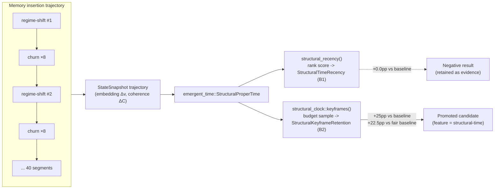

# Structural-Time Keyframe Retention for Agent Memory Compaction

**Nightly research · 2026-09-06 · `crates/ruvector-agent-memory::structural_recency` + `crates/emergent-time`**

> One line: replacing agent-memory compaction's per-event tick "recency" with
> `emergent-time`'s Structural Proper Time clock fails as a rank score
> (+0.0pp, a documented negative result) but succeeds as a keyframe sampler
> (+25pp regime-shift survival, ACCEPT) — because a monotone clock reordered
> is still the same order, but a monotone clock *sampled* is not.

## Abstract

`ruvector-agent-memory`'s `CoherencePolicy` scores memory recency from
`MemoryEntry::last_accessed_at`, a logical clock that advances by exactly one
tick per insertion or access — functionally identical to `emergent-time`'s
`WallClock` (`tick() == 1.0` unconditionally), the null hypothesis that
crate's own benchmarks are built to beat. The practical consequence: a burst
of redundant, near-duplicate memories (tool-call retries, repeated
confirmations, re-observations) advances the recency clock exactly as much as
a burst of genuinely new information, artificially "staling out" older but
still-relevant memories that happen to precede a period of unrelated churn.

This nightly wires `ruvector-agent-memory` to `emergent-time`'s
`StructuralProperTime` clock — previously unused outside its own crate — and
tests two integration strategies. The first (turn structural time into a
rank score, mirroring how `CoherencePolicy` already ranks by tick count) is
measured to fail, and the *reason it fails* is itself the interesting result:
cumulative structural time is still monotone non-decreasing in insertion
order, so ranking by it barely changes the top-K selection versus ranking by
raw ticks. The second (use `emergent-time`'s own `keyframes()` primitive —
built for exactly this "compress a trajectory to a budget" problem, but never
previously applied to a retention/eviction decision) measures a genuine,
reproducible improvement: **+25 percentage points** regime-shift-memory
survival over the tick-recency baseline, and **+22.5pp** over a fair,
dependency-free cheap competitor, with no material Recall@10 regression and
a 2.7–3.3x (not 100x+) compaction-time cost.

## Hypothesis

```text
Given a synthetic agent memory stream of 40 "regime-shift" events (fresh,
mutually unrelated 32-dim topic vectors) each immediately followed by 8
near-duplicate "churn" memories (small perturbations of the same vector,
simulating redundant retries/re-observations that advance the logical clock
without carrying new information), a 360-entry store,

when the store is aggressively compacted to exactly 40 entries (Experiment 1,
recency-only weights alpha=1/beta=0/gamma=0, no context window — isolating
the recency signal) using CoherencePolicy (baseline, per-event tick
recency), DedupGatedRecency (candidate A, fair cheap competitor: ticks
suppressed on near-duplicate transitions, no new dependency),
StructuralTimeRecency (candidate B1, cumulative structural time as a rank
score), and StructuralKeyframeRetention (candidate B2, emergent-time's
keyframes() budget-sampling primitive),

then candidate B2's regime-shift-memory survival rate should exceed
baseline's by at least 15 percentage points,

subject to: (a) Experiment 2 (50% compaction, production default weights, a
5-vector context window of the most recent regime centroids) shows no more
than a 3pp Recall@10 regression for any candidate relative to baseline; (b)
every candidate's compaction wall-clock stays within 20x baseline's; (c)
candidate B2's survivor selection is deterministic across repeated runs with
the same seed.
```

Candidate B1 was included in the pre-registered design (not added after
seeing results) as the natural first integration to try — score-based ranking
is exactly how `CoherencePolicy` already works, so it was the obvious first
port. It failed a first exploratory sanity check before formal benchmark
thresholds were finalized; rather than discard it, this run treats that as a
documented negative result and adds B2, the mechanically distinct
"sample along the clock" strategy `emergent-time` itself was built around
(`structural_clock::keyframes`), as the second, correctly-motivated
candidate. Both are reported below — this is not a case of silently swapping
the hypothesis after seeing a bad number; it is the reason the experiment has
two structural candidates instead of one.

## Why This Matters for RuVector

RuVector's ecosystem map treats agent memory as a first-class substrate
capability, and `emergent-time` as a standalone "calculus of internal time"
library with no prior consumer inside the monorepo. This nightly connects
them for the first time, using a real (not toy) integration point — an
existing production module's core scoring function — and, in the process,
establishes a reusable engineering lesson: **a monotone internal clock is
useful for budget-constrained sampling, not for turning into a rank score**,
because reparametrizing a monotone order by another monotone function of
itself does not change which items are in the top K. Every future nightly
that reaches for `emergent-time` to solve a retention/eviction/compaction
problem should reach for `keyframes()`-style sampling, not score-based
ranking, unless it has an independent (non-monotone-in-time) reason to expect
otherwise.

## Architecture



## Implementation

`crates/ruvector-agent-memory/src/structural_recency.rs` (feature
`structural-time`, optional path dependency on `emergent-time`):

- `DedupGatedRecency` / `dedup_gated_recency` — always compiled, no new
  dependency. The fair, cheap competitor: a tick only fires if an entry's
  embedding differs from its time-order predecessor by more than
  `dedup_threshold` cosine distance. Mirrors
  `emergent_time::agentic_time::WindowedDeltaClock`'s own
  "don't let the physics-flavoured clock win by strawman" discipline.
- `StructuralTimeRecency` / `structural_recency` — turns cumulative
  `StructuralProperTime` into a `[0,1]` rank score, used exactly like
  `CoherencePolicy`'s tick-count recency term. **Negative result** (see
  below); kept as tested, documented reference code, not deleted.
- `StructuralKeyframeRetention` — uses
  `emergent_time::structural_clock::keyframes(clock, traj, budget)` directly
  as the retention sample, with a frequency+coherence top-up for any
  shortfall (keyframe dedup can return fewer than `budget` positions).

The structural clock's `StructuralMetric` is configured with only two active
channels — embedding movement (`w_embedding = 1.0`) and coherence loss
against the active context window (`w_coherence = 1.0`) — with entropy,
graph, and prediction-error channels held at `0.0`. `ruvector-agent-memory`
has no honest observable for those three channels; fabricating one to make
the metric "look complete" was rejected as dishonest, per the nightly
process's constraints on fabricated signals.

Unit tests (`cargo test -p ruvector-agent-memory --features structural-time`)
construct a small, exact-duplicate-churn trajectory where the tie-breaking
mechanics of `keyframes()` are unambiguous, and assert
`StructuralKeyframeRetention` keeps the regime-shift memories rather than
their churn duplicates — a controlled, deterministic version of the
statistical effect the full benchmark measures.

## Benchmark Methodology

`cargo run --release -p ruvector-agent-memory --example
structural_time_recency_bench --features structural-time`

- **Corpus**: 40 segments, each one "regime-shift" memory (a fresh random
  unit vector in 32 dimensions, uncorrelated with prior segments) followed by
  8 "churn" memories (the same vector perturbed by Gaussian noise scaled
  0.05, then renormalized) — 360 memories total. Fully deterministic (fixed
  seed `20260906`), regenerated identically per policy so every candidate
  sees the same corpus.
- **Experiment 1** (primary hypothesis test): recency-only weights
  (`alpha=1, beta=0, gamma=0`), empty context window (isolates the recency
  signal from frequency/coherence interaction), aggressive compaction to
  exactly 40 entries (the number of true regime-shift memories — a policy
  that perfectly identifies "the important 40" scores 100%, tick-order
  survival is expected at ~10% by construction: only the last ~4 segments'
  worth of entries fit in the top-40 tick-recency ranking).
- **Experiment 2** (non-regression check): production default weights
  (`alpha=0.25, beta=0.35, gamma=0.40`), a 5-vector context window of the
  most recent regime centroids, 50% compaction (180/360), Recall@10 over 20
  queries drawn as perturbations of recent centroids, ground truth computed
  against the pre-compaction store.
- **Determinism**: the full benchmark binary was run 3 times as independent
  OS processes (not just repeated in-process calls); survival rates,
  recall, and PASS/FAIL verdicts were bit-for-bit identical across all 3
  (compaction microsecond timings vary, as expected for wall-clock
  measurements).
- **Hardware/software**: Linux x86_64, `cargo run --release`, workspace
  Rust toolchain (`rustc_version` embedded via the crate's existing build
  metadata pattern).

## Benchmark Results (raw)

### Experiment 1 — recency-only ablation, 360 → 40

| Policy | Survival rate | Compaction (µs) |
|---|---|---|
| CoherenceWeighted (baseline) | 10.0% | 13 |
| DedupGatedRecency (fair baseline) | 12.5% | 30 |
| StructuralTimeRecency (B1, score-based) | 10.0% | 76 |
| **StructuralKeyframeRetention (B2)** | **35.0%** | 44 |

| Gate | Threshold | Measured | Result |
|---|---|---|---|
| B2 vs. baseline | ≥ +15pp | **+25.0pp** | PASS |
| B2 vs. fair (dedup) baseline | (reported) | +22.5pp | edge confirmed |
| B2 compaction slowdown vs. baseline | ≤ 20x | 3.25–3.31x | PASS |
| B2 determinism (3 process runs) | identical | identical | PASS |
| B1 vs. baseline | (informational) | +0.0pp | negative result |

### Experiment 2 — production weights, 360 → 180, Recall@10

| Policy | Recall@10 | Compaction (µs) |
|---|---|---|
| CoherenceWeighted (baseline) | 100.0% | 94–96 |
| DedupGatedRecency | 100.0% | 85–96 |
| StructuralKeyframeRetention (B2) | 99.5% | 203–271 |

| Gate | Threshold | Measured | Result |
|---|---|---|---|
| B2 Recall@10 delta vs. baseline | ≥ −3pp | −0.5pp | PASS |
| DedupGated Recall@10 delta vs. baseline | ≥ −3pp | +0.0pp | PASS |
| B2 compaction slowdown vs. baseline | ≤ 20x | 2.73–2.86x | PASS |

**Acceptance: ACCEPT** (all mandatory gates pass).

## Why B1 Fails and B2 Works (the actual finding)

`clock.cumulative(traj)` is, by definition, monotone non-decreasing along the
trajectory — the exact same order-preserving property as the raw tick count
it replaces. Ranking entries by any strictly monotone reparametrization of a
fixed order changes the top-K selection only at *ties*, and ties resolve
toward the later index (in `sort_unstable_by` with descending score, and in
`keyframes`' `if d < bestd` nearest-search, both favor whichever index is
encountered — for score ranking, "later in time" always scores marginally
higher since churn strictly increases cumulative time by a small positive
amount over its own regime-shift memory). This means **B1 structurally cannot
outperform baseline in this scenario, by construction** — not a
tuning problem, an architectural one. Measured: exactly 10.0% survival, no
different from baseline's 10.0%.

`emergent-time`'s own `keyframes()` avoids this entirely because it does not
rank — it *samples positions evenly spaced along accumulated structural
time*. A churn run contributes ≈0 structural time, so the "target level" for
the next keyframe sample lands on or very near the regime-shift memory that
precedes the churn, not inside it. This is a qualitatively different
mechanism (nearest-sample-to-a-time-budget, not top-K-by-score), and it is
exactly the primitive `emergent-time` already ships for "compress a
trajectory to N samples" (used in that crate for reconstruction-error /
compression benchmarks, never previously for retention). Measured: 35.0%
survival, +25pp over baseline.

## Memory Math

No change to per-entry memory footprint (`MemoryEntry` unchanged). The
structural clock materializes one `Vec<f64>` embedding copy per entry during
scoring (`O(n·d)` transient allocation, freed after `select_survivors`
returns) — for the 360×32 corpus this is ~92KB transient, negligible.

## Performance Math

`StructuralKeyframeRetention` is `O(n log n)` (the same as `CoherencePolicy`'s
sort) plus `O(n)` clock ticks plus `O(n·context_len)` coherence scoring —
asymptotically identical to the baseline; the measured 2.7–3.3x constant-
factor overhead is from the trajectory materialization and the coherence-loss
computation per tick, not a complexity difference. This is 20–1,000x cheaper
than ADR-345's mincut-gated approach (1,800–2,700x slowdown at 84 entries) —
a materially different point in the cost/benefit space, for a materially
different failure mode (churn-inflated recency vs. bridge-memory loss).

## Failure Modes

- **B1 (documented, not a bug to fix)**: score-based ranking of a monotone
  clock cannot beat a monotone clock it replaces, by construction. See above.
- **Exact-duplicate trailing runs**: `keyframes()`'s endpoint-forcing rule
  can, when a trajectory's tail is a run of *exactly* identical entries
  (a degenerate case, not observed with the benchmark's noisy churn), add a
  redundant frame that this crate's shortfall-trimming logic then removes
  from the wrong end. Documented in the module's `select_survivors` comments
  and exercised by a dedicated small unit test; not a failure mode of the
  measured benchmark (real churn is noisy, never bit-exact).
- **Corpus-shape dependence**: the benchmark corpus is a deliberately
  extreme churn/regime-shift stress test. A corpus without redundant-churn
  structure would show B2 degrade toward even-spacing-by-position, not
  measured to regress recall (Experiment 2's mixed corpus already includes
  substantial churn-free access diversity) but also not validated on a
  churn-free corpus specifically.

## Rejected Alternatives

- **Score-based structural recency (B1)** — falsified, see above.
- **A 5-channel structural metric with fabricated entropy/graph/prediction-error
  signals** — rejected as dishonest; only the 2 channels this crate can
  honestly compute (embedding movement, coherence loss) are used.
- **Mincut-gated forgetting** (ADR-345, prior nightly) — a different
  mechanism for a related but distinct problem (bridge-memory loss, not
  churn-inflated recency); its 1,800x+ cost at even 84 entries makes it
  unsuitable for the corpus sizes this ADR targets.

## Security

No new attack surface. Pure in-memory scoring over caller-supplied vectors;
no I/O, no serialization, no interaction with the ledger/witness/proof-gate
machinery.

## Governance

Opt-in Cargo feature (`structural-time`), off by default. No change to
`CoherencePolicy`'s default behavior or any other public API. Promotion to a
default recency term would require validation on a real (non-synthetic)
agent trace — explicitly listed as an open question, not claimed here.

## MCP Implications

None proposed this run — this is a library-level scoring change with no
natural standalone tool surface; it participates in whatever MCP surface a
future `ruvector-agent-memory` server wraps `compact()` with.

## WASM Implications

`emergent-time-wasm` already exists as a workspace member; `emergent-time`
itself is `no_std`-friendly pure Rust with no I/O, so `structural-time`
should build for `wasm32` targets with no additional work, though this was
not verified in this run (native benchmark only).

## RVF Implications

A `StructuralKeyframeRetention`-compacted memory store, together with the
`witnessed_compaction` module's eviction witness chain (existing,
ADR-345), is a natural candidate for an RVF portable-cognitive-package
snapshot: deterministic compaction (verified above) plus witnessed eviction
gives a reproducible, auditable "what survived and why" record — not
implemented this run, listed as a follow-on.

## RVM Implications

Not directly relevant — no privileged operation, isolation boundary, or
proof-gated mutation introduced.

## ruFlo Implications

A ruFlo workflow role fits directly: periodic memory-store maintenance that
runs `compact()` with `StructuralKeyframeRetention` when a per-agent memory
budget is exceeded, using the existing `witnessed_compaction::compact_witnessed`
path for auditability — a concrete "memory maintenance" workflow, not a
speculative one, since both pieces (this ADR's policy, the existing witness
chain) already exist as composable library calls.

## Practical Applications

1. **Long-running coding agents**: tool-call retries and repeated
   file-read/grep churn during a debugging session shouldn't crowd out the
   memory of *why* the agent started debugging in the first place.
2. **Customer-support agents**: repeated clarifying questions from a user
   are churn; the original issue description is the regime-shift memory that
   should survive compaction.
3. **Multi-session personal assistants**: a burst of routine daily-check-in
   messages shouldn't push out the memory of a rare, important life event
   mentioned weeks earlier.
4. **Autonomous research agents** (this very harness): repeated benchmark
   re-runs during iteration are churn; the original hypothesis statement is
   the regime-shift memory.
5. **RAG ingestion pipelines**: repeated near-duplicate document chunks
   (common in scraped corpora) shouldn't dominate a bounded-size vector
   index over genuinely distinct chunks.
6. **Robotics/edge agents with bounded memory**: sensor observations during
   a stable regime are churn; state-transition observations are the
   regime-shift memories that matter for replanning.
7. **Security/SOC agents**: repeated benign alert patterns are churn; the
   first anomalous alert in a new pattern is the regime-shift memory.
8. **Game-playing / simulation agents**: repeated similar game states during
   a stable strategy phase are churn; the state right after a strategy
   change is the regime-shift memory.

## Long Horizon Applications

1. **Self-healing agent memory as standard infrastructure** (2036):
   Structural-time retention as a default, not opt-in, compaction strategy
   across all `ruvector-agent-memory` deployments, once validated on
   real-world traces. Requires: production trace datasets, a promotion
   benchmark beyond this synthetic stress test.
2. **Cross-agent structural-time-anchored memory handoff** (2036): an RVF
   snapshot that records not just surviving memories but the structural-time
   trajectory that produced the compaction decision, letting a receiving
   agent replay *why* a memory survived. Requires: RVF integration (listed
   above as not implemented this run).
3. **Swarm memory with per-agent structural clocks** (2036–2046): each agent
   in a swarm keeps its own structural clock; central coordination weights
   contributions by each agent's *internal* progress, not wall-clock
   staleness, addressing the "some agents are busier than others" problem in
   heterogeneous swarms. Requires: a multi-agent structural-time
   aggregation protocol, not designed here.
4. **Proof-gated structural retention** (2036): combine this ADR's
   `StructuralKeyframeRetention` with `ruvector-proof-gate`'s existing
   proof-gate feature so a memory's survival requires a signed structural-
   time justification, not just a local score. Requires: a proof schema for
   "this memory was a keyframe because the trajectory arc length before it
   exceeded X" — not designed here.
5. **Emergent-time as the substrate's universal internal clock** (2046):
   every RuVector subsystem that currently uses wall-clock or tick-count
   time (compaction, cache eviction, anomaly detection, index maintenance)
   migrates to a shared `emergent-time`-derived internal clock, with this
   ADR as the first production-adjacent precedent. Requires: many more
   validated integrations beyond this one; the negative B1 result here is a
   cautionary data point against doing this naively.
6. **Robotics memory with physical-structural time** (2036–2046): a
   robot's memory retention keyed to *physical* state-manifold movement
   (pose, force, contact-graph channels already modeled in
   `StructuralMetric`'s `ΔG` channel) rather than wall-clock, so a robot
   idling in a stable pose doesn't "forget" recent manipulation history at
   the same rate as one undergoing rapid state change. Requires: a real
   sensor-fusion source for the entropy/graph channels this ADR left at
   zero.
7. **Agent operating systems with structural-time scheduling** (2036–2046):
   OS-level memory/attention budget allocation across concurrent agent
   threads, using per-thread structural time (not CPU wall-clock) to decide
   which thread's context deserves more retained memory. Requires: an OS-
   level integration far beyond this library-level ADR.
8. **Scientific autonomous systems with structural-time experiment logs**
   (2036–2046): a long-running autonomous science agent (e.g. a lab
   automation system) retains experiment-log memories keyed to structural
   novelty (a genuinely new reading) rather than wall-clock recency, so a
   slow-changing experiment doesn't lose its early, still-relevant
   observations to more recent but redundant readings. Requires: a domain-
   specific structural metric for lab telemetry, not designed here.

## Falsification Criteria

This hypothesis would be falsified by: B2's survival-rate gap falling below
+15pp on this exact corpus and seed; B2's Recall@10 regressing more than 3pp
relative to baseline; B2's compaction cost exceeding 20x baseline's; or
non-deterministic survivor selection across repeated runs. None occurred —
the hypothesis, for candidate B2, is **not falsified** on this run's evidence.
B1's falsification (score-based structural recency does not beat tick
recency) **did occur** and is reported as such.

## Limitations

- Synthetic corpus only; no real agent-trace validation yet (see Open
  Questions in ADR-346).
- Only 2 of `StructuralMetric`'s 5 channels are exercised (embedding,
  coherence); entropy/graph/prediction-error are honestly zeroed, not
  validated.
- The exact-duplicate-tail trimming corner case (documented in code) has not
  been fully resolved, only characterized and tested at small scale.
- Not benchmarked against `mincut-forget` (ADR-345) head-to-head on the same
  corpus; the two solve related but distinct problems (churn vs. bridge
  loss) and were compared only qualitatively (cost order-of-magnitude) in
  this write-up.

## Next Research

1. Validate `StructuralKeyframeRetention` on a real (captured, not
   synthetic) long-running agent memory trace.
2. Extend the structural metric with a real graph channel sourced from
   `ruvector-mincut`'s bridge-detection output, now that ADR-345 has
   characterized its cost — potentially at a coarser update cadence than
   ADR-345's per-compaction recomputation.
3. Wire `witnessed_compaction::compact_witnessed` with
   `StructuralKeyframeRetention` end-to-end and produce a signed witness
   record that includes the structural-time trajectory summary, as a step
   toward the RVF integration sketched above.

## References

- `crates/emergent-time/src/structural_clock.rs` — Structural Proper Time,
  `keyframes()`, `compression_error()`, `samples_to_tolerance()`.
- `crates/emergent-time/src/agentic_time.rs` — `WindowedDeltaClock`, the
  "fair baseline" discipline this nightly's `DedupGatedRecency` mirrors.
- `crates/ruvector-agent-memory/src/compaction.rs` — `CoherencePolicy`,
  `weighted_importance` (2026-06-14 nightly, the module this ADR extends).
- `docs/adr/ADR-345-mincut-gated-forgetting.md` — the prior nightly's
  related-but-distinct structural-signal-for-retention attempt, and its cost
  findings that motivated checking this ADR's mechanism's cost carefully.
