# Nightly Research: Deterministic Minimum-Cut Witness Materialization

**Date:** 2026-09-07 (UTC) &middot; **Slug:** `deterministic-mincut-witness` &middot;
**Starting commit:** `edaffffb3b85768eb1f3ec1f683b7f46f0506af4` &middot;
**ADR:** [ADR-346](../../../adr/ADR-346-deterministic-mincut-witness-materialization.md) &middot;
**Crate:** `ruvector-mincut` (fix), `ruvector-agent-memory` (downstream regression check)

## Summary

The 2026-09-05 nightly (ADR-345, "Mincut-Gated Forgetting") rejected a
`ruvector-agent-memory` compaction policy built on
`ruvector-mincut::RuVectorGraphAnalyzer`, for two independent reasons:
unacceptable latency scaling, and ~50% of repeated `.partition()` calls
returning an empty/unusable result on a byte-identical graph. It left the
non-determinism's root cause as an explicit open question. This run answers
it: the dominant cause is a deterministic bug, not randomness --
`WitnessHandle::materialize_partition()` derives the complement side's
vertex universe from the *found cut set's own* highest vertex ID rather than
the graph's real vertex set, so it silently drops every higher-numbered
vertex whenever the cut set (typically the small side of an unbalanced cut)
doesn't happen to contain the graph's globally-highest ID -- which is nearly
always. A second, smaller contributor is genuine tie-breaking
non-determinism from unsorted `HashSet<VertexId>` iteration in
`BoundedInstance`.

Both are fixed. Reproducible before/after evidence across three topologies
(200 fresh-analyzer trials each) shows the empty/degenerate rate drop from
**99-100% to 0%**, and the count of distinct partitions observed across 200
trials on a fixed graph drop from 0-2 to **exactly 1** (fully deterministic)
once both fixes are applied. The crate's full test suite (515 tests) and the
downstream `ruvector-agent-memory` `mincut-forget` feature (63 tests) remain
green. The latency problem (ADR-345's other, independent rejection cause)
is not addressed here and remains open.

## Abstract

`ruvector-mincut`'s `RuVectorGraphAnalyzer` is the ecosystem's general
integration point between vector-similarity graphs and the crate's dynamic
minimum-cut engine, used for community detection, graph partitioning, and
(experimentally, per ADR-345) structural signals for agent-memory
compaction. Its `.partition()` method is meant to return a complete,
reproducible two-way split of a graph's vertices around the discovered
minimum cut. It did neither reliably: `WitnessHandle::materialize_partition()`
computed the non-membership side as `(0..=U.max()).filter(not in U)`,
implicitly assuming the cut set `U` contains the graph's highest vertex ID.
For a minimum cut, `U` (the small side) essentially never does. This nightly
run root-causes the defect with a corrected, reproducible probe; fixes it
with a graph-aware materialization method plus deterministic tie-breaking in
the underlying `BoundedInstance` search; and provides before/after evidence
across three topologies and both of `BoundedInstance`'s two internal code
paths (exhaustive brute-force for small graphs, LocalKCut-oracle search for
larger ones).

## Hypothesis

See ADR-346 for the full formal hypothesis. In short: applying (A) a
graph-aware witness-to-partition materialization and (B) deterministic
vertex ordering in `BoundedInstance`'s tie-breaking paths reduces the
measured empty/degenerate-partition rate to 0% and the count of distinct
partitions across 200 fresh-analyzer trials on a fixed graph to exactly 1,
without changing any min-cut *value* or regressing the existing test suite.

## Why this matters now (2026)

`RuVectorGraphAnalyzer` sits underneath every RuVector capability that
needs a structural (graph-topological) signal layered on top of vector
similarity: community detection over embedding neighborhoods, namespace
merge decisions (`ruvector-namespace-merge`), and any future
attempt at ADR-345's rejected agent-memory hypothesis. A partition API that
silently drops vertices, and whose specific output varies run to run on
identical input, cannot be trusted as a foundation for anything that claims
to be *witnessed* -- the whole point of this repository's witness-chain
infrastructure (ADR-134, ADR-307, ADR-340, ADR-341) is that a claim about
graph structure should be independently reproducible from the same inputs.
A structural witness that is not reproducible is not a witness.

## Why it could matter in 2036

If RuVector's graph-intelligence layer becomes the substrate for
proof-gated autonomous mutation (Darwin-style bounded evolution acting on
live agent memory graphs, or RVM coherence-domain enforcement deciding what
crosses an isolation boundary based on graph connectivity), every decision
in that pipeline needs to be replayable byte-for-byte from a signed input
state. A non-deterministic minimum-cut oracle at the bottom of that stack
would make every claim built on top of it unauditable, no matter how well
the layers above are witnessed.

## Why it could matter in 2046

Long-horizon "synthetic nervous system" or self-healing-graph-memory
architectures (see ADR-345's and this repository's exotic-applications
tradition) depend on structural signals -- bridges, cut points, community
boundaries -- being cheap, correct, and reproducible primitives, the same
way a biological nervous system's local circuits must be reliable before
higher-order learning can be built on top of them. This fix does not
deliver that future; it removes one concrete, measured obstacle (silent
data loss and non-reproducibility in the most basic partition query) that
would otherwise compound into every layer built above it.

## Why RuVector is the right substrate

`ruvector-mincut` already implements the paper-grade bounded-range dynamic
minimum-cut wrapper (arXiv:2512.13105) with a purpose-built
`RuVectorGraphAnalyzer` integration layer -- the algorithmic and
architectural investment already exists. What was missing was correctness
in the boundary between the implicit witness representation and the
explicit partition API consumers actually use. Fixing that boundary is a
small, surgical, high-leverage change relative to the alternative (building
a new integration layer from scratch).

## MetaHarness role

`npx metaharness --help` and `npx metaharness score/analyze/genome` are
available in this environment (metaharness 0.4.16, installed on first
invocation via `npx`); `npx ruvector harness doctor/status --json` is not
resolvable in this checkout (`npm error could not determine executable to
run` -- no `ruvector` CLI binary is wired to a `harness` subcommand in this
repository's current state). This run therefore used direct repository
inspection (`git log`, reading ADR-345 and its linked nightly folder, and
reading `ruvector-mincut`'s source) as the discovery and planning mechanism
in place of MetaHarness-orchestrated multi-agent roles; no MetaHarness run
was executed against this repository.

## Flywheel role

No `ruvector harness flywheel` CLI surface was resolvable in this
checkout (see above). This document, ADR-346, and the raw probe output
below serve as this run's flywheel record: hypothesis, evidence, decision,
and the specific open questions (latency, `find_bridges()` cost) carried
forward for a future run, exactly as ADR-345's evidence and open questions
were the direct input to this one.

## Darwin role

Not applicable to this run. This was a root-cause bug-fix investigation
directly following up on a prior nightly's explicit open question, not a
bounded-parameter-search problem with multiple competing variants to
evolve. There is exactly one correct fix per identified defect (use the
real vertex universe; use deterministic ordering), not a fitness landscape
to search.

## Architecture

```mermaid
flowchart TD
    subgraph before["Before (ADR-345 state)"]
        A1["RuVectorGraphAnalyzer::partition()"] --> A2["witness.materialize_partition()"]
        A2 --> A3["universe = 0..=U.max()"]
        A3 --> A4["V\\U loses every vertex\nnumbered above U.max()"]
        A4 --> A5["degenerate/incomplete\npartition returned"]
    end

    subgraph after["After (ADR-346 fix)"]
        B1["RuVectorGraphAnalyzer::partition()"] --> B2["graph.vertices()\n(real universe)"]
        B2 --> B3["witness.materialize_partition_within(universe)"]
        B3 --> B4["complete, deterministic\n(U, V\\U)"]
    end

    subgraph boundedinstance["BoundedInstance tie-breaking"]
        C1["self.vertices: HashSet\n(RandomState, unordered)"] -->|"before"| C2["vertex_vec / seed_vertices\nunsorted -> order varies per run"]
        C1 -->|"after: .sort_unstable()"| C3["deterministic order ->\nsame tied-optimal witness every run"]
    end
```



## Implementation

Four files changed in `crates/ruvector-mincut`:

- `src/instance/witness.rs`: new `WitnessHandle::materialize_partition_within(&self, universe: &[VertexId])`,
  strengthened documentation on the pre-existing `materialize_partition()`,
  and a new `witness_tests` module (2 tests) demonstrating the defect and
  its fix side by side.
- `src/integration/mod.rs`: `RuVectorGraphAnalyzer::partition()` now calls
  `materialize_partition_within(&self.graph.vertices())` instead of the
  universe-guessing `materialize_partition()`; new
  `test_partition_deterministic_and_complete` regression test (30
  fresh-analyzer trials against a graph shaped like the bug's trigger
  condition).
- `src/instance/bounded.rs`: `brute_force_min_cut()`'s `vertex_vec` and
  `search_for_cuts()`'s `seed_vertices` are now `.sort_unstable()`-ed before
  use, removing `RandomState`-seeded `HashSet` iteration order as a source
  of tie-breaking variance.
- `examples/determinism_probe.rs` (new): the reproducible probe backing
  every number in this document, testing three topologies spanning both of
  `BoundedInstance`'s internal code paths.

No new dependency. No feature flag (default-on fix). See ADR-346 for full
API shape and rationale on why `materialize_partition()` itself was left in
place rather than changed or removed.

## Benchmark methodology

- **Hardware:** 4-core x86_64 Linux container.
- **Toolchain:** `rustc 1.94.1`, `cargo 1.94.1`, `--release` build throughout.
- **Graph construction:** deterministic k-NN (k=8, cosine similarity,
  min_sim=0.05) over a fixed synthetic embedding set: two near-duplicate
  clusters (`per_cluster` copies of two orthogonal unit vectors) each with
  one "gateway" vector interpolated 50/50 toward a shared third axis, plus
  one bridge vector on that third axis alone. Three sizes tested:
  `per_cluster=8` (n=19, exercises `BoundedInstance`'s exhaustive
  brute-force path, `vertices.len() < 20`), `per_cluster=9` (n=21,
  exercises the LocalKCut-oracle path), `per_cluster=41` (n=85, exercises
  the LocalKCut-oracle path *and* `ClusterHierarchy` construction, which
  only activates above 50 vertices).
- **Trial protocol:** for each of 200 trials per topology, construct a
  *fresh* `RuVectorGraphAnalyzer::from_knn(&neighbors)` (matching ADR-345's
  methodology -- reusing one analyzer would mask the defect behind its
  result cache) and call `.partition()`. Record whether the result is
  empty/degenerate (`a.is_empty() || b.is_empty() || a.len()+b.len() != n`)
  and a canonicalized signature of the smaller side, to count distinct
  partitions observed.
- **Isolation of each fix's effect:** `git stash` was used to isolate the
  unfixed baseline, fix A alone, and fix A + fix B, rebuilding and re-running
  the identical probe binary against each state, all with the *same*
  (post-correction) probe source so the comparison is apples-to-apples.
- **Exact command:** `TRIALS=200 cargo run --release -p ruvector-mincut --example determinism_probe`

## Benchmark results (raw)

```text
=== BASELINE (unfixed main, corrected probe graph) ===
n=19 trials=200 empty_or_degenerate=200 (100%) distinct_partitions_seen=0 elapsed=247.39s avg_ms=1236.9
n=21 trials=200 empty_or_degenerate=200 (100%) distinct_partitions_seen=0 elapsed=0.05s avg_ms=0.2
n=85 trials=200 empty_or_degenerate=198 (99%) distinct_partitions_seen=2 elapsed=1.16s avg_ms=5.8

=== FIX A ONLY (materialize_partition_within) ===
n=19 trials=200 empty_or_degenerate=0 (0%) distinct_partitions_seen=2 elapsed=239.39s avg_ms=1196.9
n=21 trials=200 empty_or_degenerate=0 (0%) distinct_partitions_seen=2 elapsed=0.04s avg_ms=0.2
n=85 trials=200 empty_or_degenerate=0 (0%) distinct_partitions_seen=2 elapsed=1.08s avg_ms=5.4

=== FIX A + FIX B (+ sorted tie-breaking) ===
n=19 trials=200 empty_or_degenerate=0 (0%) distinct_partitions_seen=1 elapsed=233.51s avg_ms=1167.6
n=21 trials=200 empty_or_degenerate=0 (0%) distinct_partitions_seen=1 elapsed=0.04s avg_ms=0.2
n=85 trials=200 empty_or_degenerate=0 (0%) distinct_partitions_seen=1 elapsed=1.07s avg_ms=5.4
```

`raw-runs.txt` in this directory reproduces this exact transcript verbatim,
plus the interim diagnostic run that uncovered the bug in the *original*
(2026-09-05) probe's graph construction (a missing second gateway vector,
which made the graph genuinely disconnected rather than merely
witness-broken -- see ADR-346's "A trap in the original probe").

## Memory math

`materialize_partition_within` allocates two `HashSet<VertexId>` sized to
`membership.len()` and `universe.len()` respectively -- identical asymptotic
cost to the old `materialize_partition()` (`O(|V|)`, "should be used
sparingly" per its own docs, unchanged). The sorting added to
`BoundedInstance` is `O(n log n)` over at most a few hundred vertices in
realistic instance sizes (bounded by `MinCutWrapper`'s per-instance graph
copy, itself bounded by the caller's input graph); negligible relative to
the exhaustive `O(2^n)` brute-force search it sits next to.

## Performance math

See "Benchmark results" above. Neither fix measurably changes latency in
either direction beyond noise (largest observed delta: n=19's 1236.9ms ->
1167.6ms, a 5.6% *improvement*, plausibly just sort overhead being smaller
than the variance in which brute-force mask ordering happens to hit
short-circuit conditions first -- not a claimed optimization, since this
ADR's scope is correctness, not speed).

## Failure modes

See ADR-346's "Failure Modes" section. Summary: the n=19 latency outlier
(~1.2s/call) is real, measured, and **not** fixed by this ADR -- it is
ADR-345's other, independent rejection cause and remains open (see "Next
Research").

## Rejected alternatives

See ADR-346's "Alternatives Considered": in-place mutation of
`materialize_partition()` (rejected, no graph access without a breaking
signature change), `BTreeSet` refactor of `BoundedInstance::vertices`
(rejected as unnecessarily wide a diff given sort-at-use is already
sufficient per the evidence), and doing nothing on the grounds that the only
known consumer (`MincutGatedForgetting`) is already rejected (rejected,
since `RuVectorGraphAnalyzer` has other live consumers).

## Security

No new cryptographic primitive; see ADR-346. Fixing silent vertex loss is
itself a hardening for any future witness-auditing code that expects
`.partition()`'s two sides to sum to the graph's vertex count.

## Governance

None beyond ordinary code review; no schema or invariant changes.

## MCP implications

Not directly applicable -- `RuVectorGraphAnalyzer` has no MCP surface today,
and this fix does not change its public API shape in a way that would
affect one if added later. A future MCP tool exposing graph-partition
queries (e.g. `mincut.partition` returning a signed witness of `(U, V\U)`
for a given namespace) would now be safe to build without inheriting this
defect, whereas before this fix it would have silently returned incomplete
data to any caller.

## WASM / edge implications

`ruvector-mincut-wasm` and `ruvector-mincut`'s `wasm` module were not
touched by this change (the fix is entirely within
`instance/`/`integration/` and does not depend on any WASM-specific code
path). No binary size or memory impact measured or claimed; the changed
functions are not `wasm`-feature-gated, so any existing WASM build already
includes them and inherits the fix automatically on next build.

## RVF implications

If `RuVectorGraphAnalyzer`'s partition output is ever packaged as part of a
portable RVF cognitive artifact (e.g. a namespace's community-detection
result shipped alongside its vectors), this fix is a precondition for that
artifact being deterministically replayable: RVF's stated goal of
deterministic replay depends on every primitive underneath it being
reproducible, which `.partition()` was not before this ADR.

## RVM implications

Not directly evaluated this run -- no RVM coherence-domain logic currently
consumes `RuVectorGraphAnalyzer` output. Flagged as relevant if/when such an
integration is proposed, per the "why it could matter in 2036" note above.

## ruFlo implications

A ruFlo workflow that periodically re-runs graph-structure health checks
(e.g. "did `.partition()` on this namespace's similarity graph return a
complete, sane result") is now meaningful to build: before this fix, such a
workflow could not distinguish "the graph genuinely has structural issues"
from "the API silently dropped vertices," making any alerting built on top
of it unreliable.

## Practical applications

1. **Community detection over agent-memory embeddings** (existing
   `CommunityDetector`): now returns complete, reproducible communities
   instead of occasionally-truncated ones. User: any RuVector consumer
   running `CommunityDetector::detect`. Risk: low (existing code, bug fix
   only). Horizon: immediate.
2. **Distributed graph partitioning** (existing `GraphPartitioner`): same
   correctness guarantee extended to its recursive-bisection partitions.
   Horizon: immediate.
3. **Namespace-merge decisions** (`ruvector-namespace-merge`, prior
   nightly): if that crate's mincut integration goes through
   `RuVectorGraphAnalyzer::partition()`, it now gets complete/deterministic
   input for merge-safety decisions. Horizon: immediate (verification of
   that specific call site is a natural follow-up, not performed in this
   run's scope).
4. **A future retry at ADR-345's `MincutGatedForgetting`** (agent-memory
   compaction), should the separate latency problem also be solved: this
   ADR removes the non-determinism half of that rejection. Horizon:
   near-term, contingent on Open Question #1.
5. **Signed structural-witness receipts** (extending ADR-340's retrieval
   receipts to graph-structure claims): now buildable on a foundation that
   actually reproduces. Horizon: near-term.
6. **Reward-hack / drift detection over agent-memory graphs**: a monitor
   that periodically checks "is this memory graph's connectivity still
   healthy" can now trust repeated `.partition()` calls to agree with each
   other absent an actual graph change. Horizon: near-term.
7. **Edge-deployed graph health checks** (Cognitum-style appliances running
   `ruvector-mincut-wasm`): correctness fix propagates for free on next
   build; no additional edge-specific work identified. Horizon: near-term.
8. **Multi-agent swarm topology partitioning** (splitting a large agent
   swarm's coordination graph into sub-swarms via minimum cut): a plausible
   consumer of `GraphPartitioner`; now safe to build without inheriting
   silent data loss. Horizon: exploratory.

## Long horizon applications

1. **Proof-gated autonomous mutation over live memory graphs.** Thesis: a
   Darwin-style evolutionary loop that mutates agent-memory structure needs
   every structural query it bases decisions on to be replayable.
   Required advances: this fix plus a signed-witness wrapper around
   `.partition()`. RuVector's role: the underlying graph substrate. Why this
   experiment matters: removes a concrete, measured non-determinism source
   at the foundation. Primary uncertainty: whether the *latency* problem
   (unsolved) blocks this at realistic scale. Falsification: if a future
   attempt at scale still shows non-reproducible partitions after this fix,
   the fix is incomplete.
2. **Self-healing graph memory.** Thesis: a memory system that detects and
   repairs its own structural degradation needs a trustworthy "what is my
   current structure" oracle. RuVector's role: `RuVectorGraphAnalyzer` as
   that oracle. Uncertainty: whether structural signals derived from
   embedding similarity (as opposed to explicit semantic edges) are the
   right basis for "health" at all -- ADR-345 already found the global
   min-cut doesn't reliably isolate human-intended "bridges" on synthetic
   data. Falsification: repeat ADR-345's bridge-survival experiment on real
   (non-synthetic) embeddings once this fix and a latency fix both land.
3. **Synthetic nervous systems / RVM coherence domains.** Thesis: isolation
   boundaries between coherence domains could be informed by live
   connectivity analysis. Required advances: this fix, a latency fix, and
   an RVM integration design (not attempted here). Uncertainty: whether
   min-cut is the right boundary-detection primitive versus alternatives
   (e.g. spectral methods). Falsification: an RVM prototype that measures
   whether mincut-derived boundaries correlate with actual isolation needs.
4. **Agent operating systems with structural memory introspection.**
   Thesis: an agent OS exposing "show me the graph structure of my own
   memory" as a first-class, queryable, witnessed capability. Required
   advances: MCP surface (not built here), signed witnesses over
   `.partition()` output. Uncertainty: whether such introspection is
   actually useful to agents versus a novelty. Falsification: build the MCP
   tool, measure whether any agent workflow uses it.
5. **Swarm memory / multi-agent shared cognition.** Thesis: a swarm's
   shared memory graph could be partitioned to assign sub-swarms disjoint
   memory shards with minimal cross-shard traffic. RuVector's role:
   `GraphPartitioner`. Uncertainty: whether real swarm memory graphs have
   the kind of exploitable cut structure this assumes. Falsification:
   measure edge-cut quality on a real multi-agent workload's memory graph.
6. **Dynamic world models.** Thesis: a world model's internal graph
   (entities, relations) could use minimum-cut-based community detection to
   discover latent structure. Required advances: none beyond this fix for
   the graph-query layer; the world-model layer itself is unbuilt.
   Uncertainty: substantial -- purely speculative at this stage.
   Falsification: not yet falsifiable; no prototype exists.
7. **Scientific autonomous systems** (e.g. hypothesis-graph exploration in
   an automated research loop): community detection over a graph of
   related hypotheses/evidence could use this same corrected primitive.
   Uncertainty: whether hypothesis-similarity graphs have useful cut
   structure. Falsification: build a toy hypothesis-graph and measure.
8. **Robotics memory** (spatial/episodic memory graphs for embodied
   agents): same class of applicability as agent memory generally, with
   the added constraint of edge/WASM deployment (already unaffected by this
   fix per "WASM / edge implications" above). Falsification: measure on a
   real robotics memory trace once one exists in this ecosystem.

## Evolution results

Not applicable -- no Darwin phase run this night (see "Darwin role" above).

## Promotion decision

**ACCEPT.** Both fixes merged into `ruvector-mincut`'s default code path
(no feature flag). See ADR-346's "Rejection Criteria" for the (unmet)
conditions that would have caused rejection.

## Witness evidence

- Starting commit: `edaffffb3b85768eb1f3ec1f683b7f46f0506af4`
  (`claude/focused-darwin-1asj60` branch, HEAD at run start).
- Raw benchmark transcript: `raw-runs.txt` in this directory (verbatim
  terminal output of the baseline / fix-A / fix-A+B probe runs, plus the
  interim diagnostic that found the original probe's own bug).
- Test evidence: `cargo test --release -p ruvector-mincut --lib` (515
  passed / 0 failed / 5 pre-existing ignored),
  `cargo test --release -p ruvector-mincut --doc` (27 passed / 0 failed),
  `cargo test --release -p ruvector-agent-memory --features mincut-forget`
  (63 passed / 0 failed across lib + 3 integration suites),
  `cargo clippy --release -p ruvector-mincut --lib` (no new warnings),
  `cargo fmt -p ruvector-mincut -- --check` (clean).
- No cryptographic witness chain was generated for this run itself (no
  `ruvector harness flywheel`/`darwin` CLI surface was resolvable in this
  checkout -- see "MetaHarness role" / "Flywheel role" above); this
  document plus ADR-346 plus the committed, reproducible probe source serve
  as this run's evidence trail, in the same spirit as ADR-345's.

## Production path

Already production: this is a default-on bug fix in `ruvector-mincut`'s
existing public API, not an experimental/feature-gated addition. No
migration required of any caller.

## Falsification criteria

This hypothesis would have been falsified by any of: residual
empty/degenerate results after both fixes on any tested topology; more than
one distinct partition observed across 200 fresh-analyzer trials on a fixed
graph after both fixes; a regression in `ruvector-mincut`'s or
`ruvector-agent-memory`'s (`mincut-forget`) test suites. None occurred (see
"Benchmark results" and "Evidence" above).

## Limitations

- Evidence is limited to three synthetic topologies (n=19, 21, 85) and
  `BoundedInstance`'s two internal code paths (brute-force, LocalKCut
  oracle). Real (non-synthetic) embedding graphs at larger scale were not
  tested this run.
- The `agentic` feature's parallel query path (`query_parallel`,
  `AgenticAnalyzer`) was not exercised by this fix or its tests; it uses an
  entirely separate compact/parallel representation not touched here.
- Latency remains unresolved (see "Failure modes" / Open Question #1).

## Next research

1. **ADR-345 Open Question #1**: does `DynamicMinCut`/`ClusterHierarchy`,
   used directly instead of `MinCutWrapper`'s O(log n)-bounded-instance
   sweep, avoid the measured latency scaling (now isolated as the sole
   remaining known defect in this call path)? This is the natural next
   nightly in this lineage.
2. Audit `ruvector-namespace-merge`'s mincut integration (prior nightly,
   `2026-08-08-namespace-merge-mincut`) for whether it goes through
   `RuVectorGraphAnalyzer::partition()` and therefore benefited from this
   fix, or uses a different call path with its own independent
   universe-guessing bug.
3. Consider whether `find_bridges()`'s O(E) full-recompute-per-edge cost is
   worth replacing with a proper bridge-finding algorithm (e.g. via the
   `ClusterHierarchy`'s existing structure) now that the partition API it
   would build on top of is trustworthy.
4. Re-run ADR-345's bridge-survival benchmark (once the latency question is
   resolved) to check whether this fix changes its "no measured effect"
   finding at all -- current expectation, stated honestly, is *no*: that
   finding was about global-min-cut not aligning with intended bridges on
   noisy Gaussian-cluster data, a separate question from whether the
   witness plumbing returns complete results.

## References

- ADR-345: Mincut-Gated Forgetting (this run's direct predecessor and
  source of Open Question #2, answered here).
- `docs/research/nightly/2026-09-05-mincut-gated-forgetting/README.md`
  (prior methodology, `mincut_determinism_probe.rs`, `mincut_scaling_probe.rs`).
- arXiv:2512.13105 (the bounded-range dynamic minimum-cut wrapper paper
  `MinCutWrapper` implements, per its own module docs).
- ADR-134 (witness record schema referenced by `ruvector-agent-memory`'s
  `witnessed_compaction`, contextually related but not modified this run).
