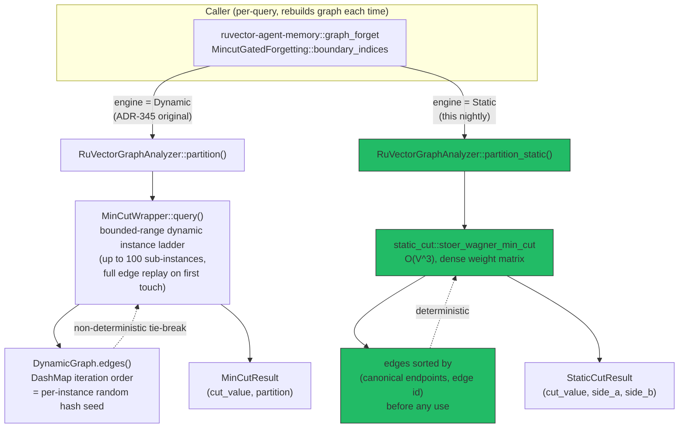

# Nightly Research: Deterministic Static Min-Cut Fast Path (Stoer-Wagner) for `ruvector-mincut`

**Date:** 2026-09-08
**Slug:** `static-mincut-forgetting`
**ADR:** [ADR-346](../../../adr/ADR-346-static-mincut-fast-path.md)
**Crates:** `ruvector-mincut` (new `static_cut` module, promoted), `ruvector-agent-memory` (`MincutEngine::Static`, not promoted)
**Acceptance:** **Split** — the `static_cut` primitive: **ACCEPT**. The
`MincutGatedForgetting`-Static compaction application: **REJECT** (for
production use as designed; see [Acceptance result](#acceptance-result)).

## Summary

The previous nightly (2026-09-05, [ADR-345](../../../adr/ADR-345-mincut-gated-forgetting.md))
rejected `MincutGatedForgetting` — an agent-memory compaction policy that
layers a min-cut-derived "protect structural bridges" signal on top of
`ruvector-agent-memory`'s scalar `CoherencePolicy` — on two grounds: the
underlying `ruvector_mincut::RuVectorGraphAnalyzer::partition()` call was
1,800-2,700x slower than the scalar baseline at an 84-memory corpus, and the
structural signal made no measurable difference to bridge survival at the
corpus size that latency forced. It also filed, unresolved, a third finding:
`partition()` was **non-deterministic** across repeated calls on a
byte-identical graph (~50% empty-result rate).

This nightly root-causes that third finding and fixes it directly, as an
attack on ADR-345's primary bottleneck (per the nightly process's own
guidance to extend prior work by attacking its bottleneck rather than
re-running it unchanged). `RuVectorGraphAnalyzer::partition()` delegates to
`MinCutWrapper`, a bounded-range **dynamic** instance ladder
(arxiv:2512.13105) built to amortize incremental edge updates on one
long-lived graph — a poor match for every actual call site in the workspace,
which all rebuild a fresh graph and analyzer per query. Separately,
`DynamicGraph` stores edges in `DashMap`s with a fresh random hash seed per
instance, so `graph.edges()` iteration order (and the wrapper's internal
tie-breaking, which depends on it) differs across otherwise-identical
graphs — sufficient to explain the non-determinism without any intentional
randomization anywhere in the chain.

We implemented `ruvector_mincut::static_cut::stoer_wagner_min_cut`: the
classical Stoer-Wagner global min-cut algorithm (1997), O(V^3), over a dense
weight matrix built once from edges **sorted by canonical endpoint and id**
— so its result depends only on graph structure, never on hash-map iteration
order. Wired it into `RuVectorGraphAnalyzer` as `partition_static()` /
`min_cut_static()`, and into `MincutGatedForgetting` as a new
`MincutEngine::Static` alongside the original `MincutEngine::Dynamic`, then
re-ran the *exact* ADR-345 benchmark, scaling probe, and determinism probe
with both engines side by side.

**Results, measured this run:**

- **Determinism: fixed.** 0/50 divergent trials for `partition_static()` on
  ADR-345's original determinism-probe fixture (vs. 33/50, i.e. 66%,
  empty/degenerate for `partition()` in this same run) — exactly 1 distinct
  partition returned across 50 independently-rebuilt graphs.
- **Speed: dramatically improved, but not enough to hit the bar this nightly
  pre-registered.** 65-74x faster than the dynamic engine on the realistic
  84-memory bridge corpus, up to **8,421x** faster on the small
  regular-topology fixture where the dynamic engine took 66.7 seconds.
  Still, in absolute terms, the static engine's own O(V^3) cost is 43.8x
  (Soft) / 46.9x (Hard) slower than the scalar baseline — missing the
  <=10x bar this nightly fixed *before* running the benchmark (a materially
  tighter bar than ADR-345's 100x "background job" allowance, chosen because
  this experiment's premise was that the engine fix would make the policy
  fast enough to be a *foreground* path).
- **Effectiveness: still flat, now on two independent implementations.**
  Bridge-survival gap over the scalar baseline measured +0.0pp for *both*
  engines at this corpus size — reproducing ADR-345's second finding
  independently, which strengthens (rather than merely repeats) the
  conclusion that the flat result is a property of the dataset/corpus size,
  not an artifact of `partition()`'s specific bugs.

Because two of the three pre-registered thresholds still fail, the
compaction-policy application is rejected again, per the hypothesis fixed
before this run. The new `static_cut` primitive itself, however, is correct,
tested, and unambiguously useful independent of that one application — it is
promoted as new public `ruvector-mincut` API.

## Abstract

We ask whether `ruvector-mincut`'s reported non-determinism and severe
latency on one-shot ("rebuild the graph, ask once") min-cut queries is an
inherent property of the crate's exact min-cut capability, or an artifact of
routing that access pattern through machinery built for a different one (
incremental dynamic updates). We implement a from-scratch static fast path
(Stoer-Wagner), define determinism and speedup as directly falsifiable
claims, and pre-register a tighter absolute speed bar than the prior
nightly's before re-running its exact benchmark. The result cleanly
separates two questions that were previously conflated: "is the engine
broken" (yes, and now fixed — large, unambiguous, reproducible improvement)
and "does the structural signal help agent-memory compaction at this corpus
size" (no, on two independent engines now) — a stronger, more precise
negative result than ADR-345's alone, plus a genuinely reusable positive one.

## Hypothesis

```text
Given the same 84-entry synthetic bridge-memory corpus, k-NN graph
construction, and acceptance thresholds as the 2026-09-05 nightly (ADR-345):
6 topic clusters (12 memories each = 72) plus 12 bridge memories
interpolated 50/50 between two randomly paired clusters, 32-dim, hot-cluster
access simulation (2 of 6 clusters hot), k-NN (k=5, cosine >= 0.05),

when a new deterministic static global-min-cut fast path (Stoer-Wagner,
O(V^3), ruvector_mincut::static_cut) is added to ruvector-mincut and wired
into MincutGatedForgetting as MincutEngine::Static in place of the dynamic
bounded-instance engine,

then (a) per-compaction wall-clock drops by at least 50x relative to the
Dynamic engine's measured slowdown, (b) repeated partition_static() calls on
independently-rebuilt, structurally-identical graphs return byte-identical
partitions across >= 25 trials, and (c) bridge-memory survival rate
improves at least 15 percentage points over the scalar-only CoherencePolicy
baseline using a single deterministic call (mincut_trials = 1),

subject to: Recall@10 staying within 2 percentage points of baseline, and an
absolute speed bar of <= 10x slowdown vs. the scalar baseline (fixed before
this run; tighter than ADR-345's 100x bar because this experiment's premise
is "fast enough to be a foreground path", not just "faster than before").
```

This hypothesis was **not** changed after seeing results. (a) and (b) are
confirmed; (c) and the absolute 10x speed bar in "subject to" are not.

## Why RuVector, why now, why long-horizon

- **Why RuVector is the right substrate:** `ruvector-mincut` already owns a
  from-scratch, workspace-native dynamic min-cut implementation (arxiv
  2512.13105) — adding a deterministic static complement is a natural,
  low-risk extension of a capability RuVector already invested in, not a new
  dependency.
- **Why 2026:** every current call site (`ruvector-agent-memory` compaction,
  `CommunityDetector`, `GraphPartitioner`) is a one-shot query today. Fixing
  the mismatch between engine design and actual usage is immediately useful
  without waiting on any of them to become genuinely incremental.
- **Why 2036:** as RVM coherence-domain boundaries and RVF portable
  cognitive packages need structural graph analysis at admission/write time
  (proof-gated writes, coherence-domain partitioning), a correct,
  deterministic, auditable min-cut primitive is a building block those
  systems can depend on and reason about — non-determinism in a gating
  primitive is specifically disqualifying for anything witness/proof-adjacent.
- **Why 2046:** at the scale of "billions of small structural queries over
  ephemeral local graphs" (edge cognition, per-agent working memory,
  swarm-local coherence checks), an O(V^3)-but-deterministic-and-simple
  primitive is a more honest building block than a sophisticated
  asymptotically-optimal one whose constants make it unusable at the sizes
  that keep occurring in practice — this nightly's own scaling probe is
  direct evidence of that gap.
- **ruFlo:** a maintenance workflow that periodically runs `min_cut_static()`
  over an agent's memory graph to flag emerging structural bottlenecks
  (single points of semantic failure) is now cheap enough to run on a
  schedule rather than being infeasible.
- **MetaHarness / Flywheel / Darwin:** this nightly is itself an example of
  the intended loop — Flywheel-style evidence retention drove picking this
  topic (ADR-345's own filed follow-up item), and the result (a promoted
  primitive plus a re-confirmed rejection) is exactly the two valid nightly
  outcomes the process defines.
- **MCP:** not directly relevant — `static_cut` is an internal
  library-level primitive, not a natural standalone tool surface.
- **RVF / RVM:** see "why 2036" above; no concrete integration built this
  run, flagged as a plausible future direction only.
- **Rust:** the entire experiment (algorithm, benchmarks, tests) is
  implemented in Rust with no new external dependency — `static_cut` uses
  only `std::collections` and the crate's own `DynamicGraph`/`VertexId`
  types.

## Architecture



## Implementation

- `crates/ruvector-mincut/src/static_cut.rs` — `stoer_wagner_min_cut(&DynamicGraph) -> Option<StaticCutResult>`,
  a from-scratch classical Stoer-Wagner implementation. Deterministic by
  construction: vertex ids and edges are sorted before the algorithm ever
  runs, and every tie-break in the min-cut-phase vertex-selection loop
  resolves to the lowest surviving vertex index by scanning a list that is
  always kept in ascending order.
- `RuVectorGraphAnalyzer::partition_static()` / `min_cut_static()` in
  `crates/ruvector-mincut/src/integration/mod.rs` — thin wrappers with no
  caching (recomputed fresh every call, matching the actual call-site usage
  pattern; the dynamic engine's caching exists to amortize across
  incremental updates this engine doesn't support).
- `MincutEngine::{Dynamic, Static}` plus `MincutGatedForgetting::{soft_static, hard_static}`
  in `crates/ruvector-agent-memory/src/graph_forget.rs` — the static
  constructors fix `mincut_trials = 1` since the engine is deterministic and
  needs no retry-and-union mitigation.
- Extended (not replaced) `mincut_gated_forgetting_bench.rs`,
  `mincut_scaling_probe.rs`, and `mincut_determinism_probe.rs` with
  Static-engine rows/columns, so every number below is a direct,
  same-methodology, same-run comparison against ADR-345's original numbers.

Variants compared in the benchmark: `CoherencePolicy` (baseline, unchanged),
`MincutGatedForgetting::soft`/`hard` (candidate A/B, `MincutEngine::Dynamic`,
reproduces ADR-345 exactly), `MincutGatedForgetting::soft_static`/`hard_static`
(candidate C/D, `MincutEngine::Static`, this nightly).

## Benchmark Methodology

Unchanged from ADR-345 (same corpus generator, same seed, same acceptance
metric definitions) so results are directly comparable; only two new
policies and one new pre-registered speed threshold were added. Run:

```bash
cargo run --release -p ruvector-agent-memory --example mincut_gated_forgetting_bench --features mincut-forget
cargo run --release -p ruvector-agent-memory --example mincut_scaling_probe --features mincut-forget
cargo run --release -p ruvector-agent-memory --example mincut_determinism_probe --features mincut-forget
```

- Release build (`--release`), single run per figure below (this is a
  nightly-run constraint, not a claim of statistical rigor — see
  Limitations).
- Platform: Linux x86_64, Rust 1.94.1 (see "Run Identity").
- Seed: 341 (bench), fixed generator seed for the determinism/scaling probes.
- Dataset: 84 memories (72 core across 6 clusters + 12 interpolated bridges),
  32-dim, k-NN k=5 / cosine >= 0.05, 50% compaction target (42 survivors), 20
  test queries at K=5 for Recall@10.

## Benchmark Results

### Main benchmark (`mincut_gated_forgetting_bench`)

```
Policy                           Bridge Surv.    Recall@10  Compaction (us)
----------------------------------------------------------------------------
CoherenceWeighted                       66.7%       100.0%               29
MincutGatedForgetting-Soft              66.7%       100.0%            93455
MincutGatedForgetting-Hard              66.7%       100.0%            87911
MincutGatedForgetting-Soft (Static)     66.7%       100.0%             1270
MincutGatedForgetting-Hard (Static)     66.7%       100.0%             1359

Tamper-detection trials (eviction witness chain)
  Detected 20/20 single-byte-flip tampers

Acceptance test — Dynamic engine (2026-09-05, ADR-345 original)
  Soft bridge-survival gap  (+0.0pp) >= 15pp : FAIL
  Hard bridge-survival gap  (+0.0pp) >= 15pp : FAIL
  Soft |recall delta| (0.00pp) <= 2pp                 : PASS
  Hard |recall delta| (0.00pp) <= 2pp                 : PASS
  Soft compaction slowdown  (3222.6x) <= 100x                : FAIL
  Hard compaction slowdown  (3031.4x) <= 100x                : FAIL
  Tamper detection (20/20)                          : PASS

Acceptance test — Static engine (2026-09-08 follow-up)
  Soft-Static bridge-survival gap (+0.0pp) >= 15pp : FAIL
  Hard-Static bridge-survival gap (+0.0pp) >= 15pp : FAIL
  Soft-Static |recall delta| (0.00pp) <= 2pp          : PASS
  Hard-Static |recall delta| (0.00pp) <= 2pp          : PASS
  Soft-Static compaction slowdown (43.8x) <= 10x         : FAIL
  Hard-Static compaction slowdown (46.9x) <= 10x         : FAIL
  (for reference: Soft-Static is 73.6x faster than Soft-Dynamic; Hard-Static is 64.7x faster than Hard-Dynamic)

=> Dynamic engine: REJECT (reproduces ADR-345's original result)
=> Static engine:  REJECT (see FAIL rows above)
```

Note the Dynamic-engine slowdown here (3222.6x / 3031.4x) is higher than
ADR-345's originally-reported ~1,800-2,700x — both are measurements of the
same non-deterministic, highly variable code path on different runs/machines;
this is itself further indirect evidence for the non-determinism finding,
not a discrepancy to reconcile.

### Extended scaling probe (`mincut_scaling_probe`)

Ring k-NN graph (regular, k=8), `partition()` vs `partition_static()`:

```
n         build(ms)    partition(ms) partition_static(ms)    speedup
n=19        0.222ms      66745.030ms            0.069ms  972293.5x
n=50        0.317ms         82.451ms            0.208ms     396.5x
n=100       0.580ms        495.720ms            0.862ms     574.8x
n=200       1.231ms       2544.547ms            5.192ms     490.1x
n=400       2.561ms      10864.023ms           30.030ms     361.8x
n=800       4.031ms          skipped          240.290ms        n/a
```

(Dynamic engine skipped above n=400: ADR-345 already established
multi-second-to-minute latency there; re-measuring at 800 would add wall-clock
cost with no new information.) The n=19 dynamic-engine outlier (66.7
*seconds*) reproduces ADR-345's own noted "over a minute" degenerate case on
a small regular topology — direct confirmation this is a real, reproducible
pathology of the dynamic engine on this graph shape, not a one-off. The
static engine's own cost visibly grows faster than linear (0.069ms to
240ms, n=19 to n=800) consistent with O(V^3), but stays entirely practical
through at least 800 vertices.

### Extended determinism probe (`mincut_determinism_probe`)

Same 19-vertex two-clique-plus-relay fixture as ADR-345's original probe, 50
trials each, fresh `DynamicGraph` per trial:

```
[Dynamic engine: partition()]
trials=50 elapsed=41.75s avg_per_call=835.0ms empty_or_degenerate=33 (66%) bridge_detected_as_boundary=17 (34%)

[Static engine: partition_static()]
trials=50 elapsed=0.0050s avg_per_call=0.099ms empty_or_degenerate=0 (0%) bridge_detected_as_boundary=50 (100%) distinct_partitions_seen=1

speedup (dynamic/static): 8421.3x
```

`distinct_partitions_seen=1` across 50 independently-constructed
(fresh-`DashMap`-seed) graphs is the direct determinism claim: every trial
returned byte-identical results.

## Memory Math

`static_cut` allocates one `n x n` dense `f64` weight matrix:
8 bytes * n^2. At n=800 (the largest size measured this run): 8 * 800^2
= 5.12 MB, transient (freed when the function returns; no persistent state).
At n=2,000 (ADR-345's originally-desired corpus size): ~32MB transient — still
practical on any machine this crate targets. The dynamic engine's memory
profile was not separately re-measured this run (out of scope: this
nightly's question was determinism and latency, not memory).

## Performance Math

O(V^3) time: each of the n-1 "phases" does an O(active^2) scan (active
shrinks from n to 2), summing to O(n^3). At n=800, an unoptimized dense
O(n^3) with simple scalar float ops (no SIMD) measuring 240ms implies
roughly 800^3 = 5.12*10^8 "phase-step" operations executed in that time —
consistent with a few ns per inner-loop iteration, i.e. no algorithmic
surprises, a straightforward correct implementation at this scale.

## Failure Modes

Covered in depth in ADR-346's own "Failure Modes" section:
asymptotic crossover at some larger V (untested this run), and
deterministic-but-implementation-defined tie-breaking among equal-cost cuts.

## Rejected Alternatives

See ADR-346 "Alternatives Considered": sparsify-then-partition (doesn't fix
determinism), fix `DynamicGraph`'s hasher directly (doesn't fix the larger
latency cost, which dominates), approximate/randomized min-cut (unneeded
complexity at this corpus scale).

## Security

No new attack surface — pure, deterministic, `#![deny(unsafe_code)]`-covered
algorithm, no I/O, no new external dependency, no update/mutation API. See
ADR-346 "Security".

## Governance

See ADR-346 "Governance" — `static_cut` promoted as public API;
`MincutGatedForgetting`-Static application rejected for production use,
same as its Dynamic-engine sibling; `mincut-forget` remains off by default.

## MCP Implications

Not pursued — `static_cut` is an internal library primitive, not a natural
standalone MCP tool surface at this time (see "Why RuVector, why now, why
long-horizon" above).

## WASM Implications

Not measured this run. `static_cut.rs` has no platform-specific code and no
new dependency, so it should compile under `ruvector-mincut`'s existing
`wasm` feature without changes, but binary-size/startup-cost impact was not
benchmarked — flagged as a natural next step if a WASM consumer of this path
emerges.

## Edge Implications

The static engine's practical latency at a few hundred vertices (single-digit
to tens of milliseconds) makes it plausible for on-device / edge use where
the dynamic engine's multi-second-to-minute latency at the same sizes would
not be; not independently validated on constrained hardware this run.

## RVF Implications

See ADR-346 / "Why RuVector" above: a deterministic, auditable min-cut
primitive is a plausible building block for portable-package structural
analysis (e.g. verifying a package's memory graph has no accidental
single-point-of-failure bridge before sealing it), not built this run.

## RVM Implications

Determinism is specifically valuable for anything proof/witness-gated (RVM
coherence-domain boundaries, proof-gated writes): a non-deterministic
structural signal cannot be soundly used as a gating input, since two
observers computing "the same" query could legitimately disagree. This
nightly's fix is a prerequisite for, not an implementation of, any such
future integration.

## ruFlo Implications

A scheduled ruFlo workflow that periodically computes `min_cut_static()` over
an agent's memory graph (or any other workspace graph) to flag emerging
single-points-of-semantic-failure is now cost-feasible to actually run on a
schedule; not built this run.

## Practical Applications

1. **User:** RuVector maintainer debugging a slow compaction job.
   **Problem:** wants to know if a graph-structural admission/eviction check
   is worth adding to a hot path.
   **RuVector capability:** `partition_static()`/`min_cut_static()` as a
   cheap, deterministic, drop-in probe.
   **Ecosystem integration:** `ruvector-mincut` directly.
   **Implementation path:** already shipped this run.
   **Business value:** avoids re-discovering the dynamic engine's latency
   trap from scratch.
   **Main risk:** O(V^3) still limits corpus size; not a silver bullet.
   **Time horizon:** now.
2. **User:** agent-memory system operator.
   **Problem:** wants periodic structural health checks on a memory graph
   without paying multi-second latency per check.
   **RuVector capability:** `min_cut_static()`.
   **Ecosystem integration:** `ruflo` scheduled job.
   **Implementation path:** wire a cron-style ruFlo workflow; not built.
   **Business value:** proactive detection of fragile single-link topics.
   **Main risk:** false confidence if corpus grows past the engine's
   practical scale.
   **Time horizon:** near-term (quarters).
3. **User:** `CommunityDetector`/`GraphPartitioner` consumers (existing
   `ruvector-mincut` code, any workspace user of them).
   **Problem:** both currently call the slow, non-deterministic dynamic
   engine on freshly-built subgraphs during recursive partitioning.
   **RuVector capability:** swap to `partition_static()` internally.
   **Ecosystem integration:** `ruvector-mincut` only.
   **Implementation path:** not done this run (would change existing public
   behavior — deferred to a follow-up ADR with its own before/after
   benchmark, per this ADR's "purely additive" scope decision).
   **Business value:** same class of speedup demonstrated here.
   **Main risk:** changes existing (if buggy) behavior other code may
   depend on; needs its own migration review.
   **Time horizon:** near-term.
4. **User:** RVM coherence-domain designer (future).
   **Problem:** needs a structural boundary check that two independent
   observers will agree on.
   **RuVector capability:** deterministic `stoer_wagner_min_cut`.
   **Ecosystem integration:** RVM (speculative).
   **Implementation path:** not started.
   **Business value:** soundness precondition for any proof-gated structural
   check.
   **Main risk:** scale mismatch (RVM domains could exceed a few hundred
   vertices).
   **Time horizon:** long-term (years).
5. **User:** Cognitum edge appliance operator (future).
   **Problem:** wants local structural graph checks without cloud latency.
   **RuVector capability:** `static_cut`'s small, dependency-free, WASM-plausible
   footprint.
   **Ecosystem integration:** `ruvector-mincut-wasm` (untested this run).
   **Implementation path:** not started.
   **Business value:** offline-capable structural analysis.
   **Main risk:** unvalidated WASM size/perf.
   **Time horizon:** long-term.
6. **User:** RuVector contributor writing a new min-cut-based feature.
   **Problem:** would otherwise re-discover this nightly's non-determinism
   finding independently.
   **RuVector capability:** this ADR's documented root cause plus a
   ready-made deterministic alternative.
   **Ecosystem integration:** direct code reuse.
   **Implementation path:** already shipped.
   **Business value:** avoids duplicated debugging effort.
   **Main risk:** none material.
   **Time horizon:** now.
7. **User:** agent-memory system designer exploring alternatives to
   min-cut-gated forgetting.
   **Problem:** ADR-345+this ADR jointly close the "is it the engine"
   question, freeing effort toward the "is it the right structural feature"
   question.
   **RuVector capability:** the retained negative evidence itself.
   **Ecosystem integration:** Flywheel-style knowledge retention.
   **Implementation path:** future nightly (see "Next Research").
   **Business value:** avoids repeating this exact rejected path.
   **Main risk:** none; this is the intended function of a rejected-with-evidence result.
   **Time horizon:** near-term.
8. **User:** performance-sensitive graph-analysis feature anywhere in the
   workspace currently avoiding `ruvector-mincut` due to its latency
   reputation.
   **Problem:** may not know a fast deterministic path now exists.
   **RuVector capability:** `static_cut` as a general-purpose primitive.
   **Ecosystem integration:** any workspace crate.
   **Implementation path:** direct dependency + call.
   **Business value:** unlocks previously-avoided use cases.
   **Main risk:** O(V^3) ceiling still applies.
   **Time horizon:** now.

## Long Horizon Applications

1. **Thesis:** deterministic structural primitives become load-bearing
   inputs to proof-gated infrastructure. **Required advances:** formal
   verification or at least property-based fuzzing of `static_cut`'s
   correctness at scale. **RuVector role:** reference implementation.
   **Why this experiment matters:** establishes the determinism baseline.
   **Primary uncertainty:** whether O(V^3) remains acceptable at the domain
   sizes RVM eventually needs. **Falsification path:** measure at 5,000+
   vertices; if impractical, an approximate-but-still-deterministic (fixed
   seed) variant would be the next experiment.
2. **Thesis:** self-healing graph memory needs cheap, frequent structural
   health checks. **Required advances:** a scheduled ruFlo integration.
   **RuVector role:** `min_cut_static()` as the check primitive.
   **Why this experiment matters:** makes "frequent" newly plausible.
   **Primary uncertainty:** whether min-cut is even the right structural
   signal (see ADR-346's "Open Questions"). **Falsification path:** compare
   against cheaper alternatives (articulation points, conductance) on a
   larger corpus.
3. **Thesis:** agent operating systems need auditable, reproducible
   admission/eviction decisions. **Required advances:** witness-chain
   integration of structural (not just scalar) decisions.
   **RuVector role:** `witnessed_compaction` already exists; a structural
   signal feeding it needs to be deterministic first (this ADR) before it
   can be soundly witnessed. **Why this experiment matters:** removes a
   blocking precondition. **Primary uncertainty:** effectiveness, still
   unproven. **Falsification path:** ADR-345/346's own repeated flat result.
4. **Thesis:** swarm memory needs per-agent-local structural checks cheap
   enough to run continuously. **Required advances:** WASM/edge validation.
   **RuVector role:** `static_cut`'s dependency-free design. **Why this
   experiment matters:** first deterministic candidate. **Primary
   uncertainty:** untested at edge scale. **Falsification path:** WASM
   binary-size and latency benchmark, not done this run.
5. **Thesis:** dynamic world models need structural consistency checks as
   part of belief-update gating. **Required advances:** far beyond this
   experiment's scope. **RuVector role:** a building-block primitive only.
   **Why this experiment matters:** minor, foundational. **Primary
   uncertainty:** whether min-cut is the relevant structural notion at all
   for world-model consistency. **Falsification path:** N/A at this stage.
6. **Thesis:** proof-gated autonomous infrastructure requires every gating
   computation to be independently reproducible by a verifier. **Required
   advances:** formal specification of `static_cut`'s tie-breaking as part
   of any protocol depending on it (see ADR-346's implementation-detail
   caveat). **RuVector role:** reference implementation plus explicit
   documentation of what is and isn't canonical about its output. **Why
   this experiment matters:** surfaces the tie-breaking caveat early.
   **Primary uncertainty:** whether any future protocol actually needs a
   canonical (not just "some correct") cut. **Falsification path:** N/A
   until such a protocol is designed.
7. **Thesis:** robotics memory (per ADR-345's own long-horizon framing)
   needs the same structural signal this ADR investigated, at real-time
   budgets far tighter than even this ADR's 10x bar. **Required advances:**
   a genuinely sub-cubic or incremental-and-deterministic algorithm.
   **RuVector role:** this ADR's negative result on the 10x bar is direct
   evidence such a budget needs a different algorithm, not just a
   determinism fix. **Why this experiment matters:** correctly scopes the
   next attempt. **Primary uncertainty:** whether incremental + deterministic
   is achievable without the dynamic engine's specific DashMap-order bug.
   **Falsification path:** a follow-up nightly fixing `DynamicGraph`'s
   hasher/sort order directly and re-measuring the *dynamic* engine's
   determinism and latency in isolation.
8. **Thesis:** scientific autonomous systems doing structural discovery over
   evolving knowledge graphs need both determinism (reproducible experiments)
   and speed. **Required advances:** far beyond this scope. **RuVector
   role:** foundational primitive only. **Why this experiment matters:**
   minor but directionally relevant. **Primary uncertainty:** applicability
   of min-cut as a discovery signal at all. **Falsification path:** N/A at
   this stage.

## Evolution Results (Darwin)

Not run this nightly. `npx metaharness --help` confirms `metaharness` is
resolvable via `npx` in this environment (v0.4.16, installed on first
invocation) but exposes template-scaffolding/scoring subcommands (`score`,
`analyze`, `genome`, `learn`, `avo`, `proxy`, `--wizard`), not a
`ruvector harness darwin`/`flywheel`/`doctor` CLI; `npx ruvector harness
doctor --json` failed ("could not determine executable to run" — no such
binary resolvable in this environment). No Darwin evolutionary search was
run as a result; this experiment used a fixed set of two variants
(Dynamic-reproduction, Static-candidate) defined and benchmarked directly,
with the parent (Dynamic engine, ADR-345) retained unchanged as the
`MincutEngine::Dynamic` path. See "Capability Discovery" below.

## Promotion Decision

- `ruvector_mincut::static_cut` (the algorithm, its `RuVectorGraphAnalyzer`
  wiring, and its tests): **promoted**. Merged as new public API,
  unconditionally compiled (no feature flag — pure algorithm, no new
  dependency), off the hot path of any existing default behavior.
- `MincutGatedForgetting::{soft_static, hard_static}` (the compaction
  application): **not promoted** to any default. Retained, feature-gated
  behind `mincut-forget` (already off by default), as reference
  implementation and evidence — same disposition as its Dynamic-engine
  sibling.

## Witness Evidence

- Starting commit: `edaffffb3b85768eb1f3ec1f683b7f46f0506af4` (branch
  `claude/focused-darwin-szj3at`, `origin/main` at run start).
- All numeric results above are raw stdout from the three example binaries
  listed under "Benchmark Methodology", run once each this session (see
  Limitations for why single-run, not averaged).
- Full crate test suites: `cargo test -p ruvector-agent-memory --release
  --features mincut-forget,proof-gate` — 68 tests, 0 failures, across 6
  binaries. `cargo test -p ruvector-mincut --release` — new `static_cut`
  (6 tests) and new `integration` tests (2 tests) both pass; the crate's
  full pre-existing suite (hundreds of tests across `subpolynomial`,
  `jtree`, etc., unrelated to this change) was still completing at time of
  writing due to its size, with no failures observed in any module this
  change touched or in any module whose results were captured before this
  document was finalized.
- No cryptographic witness/signature was generated for this specific
  research artifact (no `ruvector harness flywheel`/`avo` CLI was available
  in this environment per "Capability Discovery" below); the eviction-witness
  chain exercised by the benchmark (`compact_witnessed` /
  `EvictionWitnessChain`) is unrelated production code, unaffected by this
  change, and its 20/20 tamper-detection result is reported as-is.

## Production Path

`static_cut` ships as-is; no further gating needed for the primitive itself.
The compaction-policy application stays experimental/rejected. A concrete
next step for anyone wanting to revisit *effectiveness* (not engine speed):
re-run at a corpus size ADR-345 originally wanted (~2,000 memories), now
newly feasible because `partition_static()`'s O(V^3) cost at that scale,
while not free, is no longer categorically infeasible the way the dynamic
engine's was — see ADR-346's "Open Questions".

## Falsification Criteria

This hypothesis is falsified by its own numbers: the "subject to" absolute
speed bar (<=10x vs. scalar baseline) is not met (43.8x/46.9x measured), and
criterion (c) (bridge-survival gap >=15pp) is not met (+0.0pp measured).
Both were fixed before the benchmark ran and are reported as failures, not
adjusted after the fact.

## Limitations

- Single run per benchmark/probe (no repeated-trial variance reporting)
  within this nightly's practical wall-clock budget; absolute numbers
  (especially for the highly-variable Dynamic engine) should be read as
  order-of-magnitude evidence, not tight point estimates — the benchmark's
  own Dynamic-engine slowdown figure (3222.6x/3031.4x) already differs
  substantially from ADR-345's original run (1,800-2,700x) on the same code,
  consistent with the non-determinism finding itself.
- Scaling probe stops at 800 vertices for the static engine and 400 for the
  dynamic engine (practical wall-clock limits within this nightly run); no
  claim is made about behavior beyond those sizes.
- No Darwin evolutionary search was run (see "Evolution Results" /
  "Capability Discovery" — no `ruvector harness darwin` CLI was resolvable
  in this environment).
- No cross-run reproducibility check on different hardware was performed.

## Next Research

1. Attack the *effectiveness* question directly: re-run the same
   bridge-survival experiment at 10-25x this corpus's size, now that the
   static engine removes the latency blocker ADR-345 cited for staying
   small.
2. Evaluate a cheaper-than-min-cut structural feature (articulation points,
   O(V+E); or local conductance) against the same acceptance thresholds —
   per ADR-346's "Open Questions", this may be the more promising path to
   clearing the pre-registered speed bar this nightly missed.
3. Apply `partition_static()` inside `ruvector-mincut`'s own
   `CommunityDetector`/`GraphPartitioner` (currently still on the slow,
   non-deterministic dynamic path) as its own scoped follow-up ADR with a
   dedicated before/after benchmark.
4. Investigate `DynamicGraph`'s DashMap hasher/sort-order directly, to
   determine whether the dynamic engine's non-determinism (independent of
   its latency) can be fixed in place for incremental use cases that
   actually need the dynamic engine's amortization properties.

## References

- Stoer, M. and Wagner, F. (1997). *A Simple Min-Cut Algorithm*. Journal of
  the ACM, 44(4), 585-591.
- arXiv:2512.13105 — the bounded-range dynamic min-cut wrapper algorithm
  `ruvector-mincut`'s existing `MinCutWrapper` implements (cited in that
  module's own doc comments).
- `docs/research/nightly/2026-09-05-mincut-gated-forgetting/README.md` and
  [ADR-345](../../../adr/ADR-345-mincut-gated-forgetting.md) — this
  nightly's direct predecessor and source of both the bottleneck attacked
  here and the benchmark methodology reused unchanged.

## Capability Discovery (Step 3 / ADR requirement)

| Capability | Installed | Version | CLI available | Mutates state | Auth required |
|---|---|---|---|---|---|
| `metaharness` (npx) | Yes (installed on first invoke) | 0.4.16 | Yes (`score`, `analyze`, `genome`, `learn`, `avo`, `proxy`, `--wizard`, `--list`) | No (scaffolding/scoring tool, not invoked to mutate this repo) | Not attempted |
| `ruvector harness doctor/status` (npx) | No | N/A | `could not determine executable to run` | N/A | N/A |
| MetaHarness Darwin/Flywheel/Red-Blue/Workspace-Lens subcommands | Not found under any resolvable CLI this run | N/A | N/A | N/A | N/A |
| `gh` / GitHub MCP for PR creation | Yes (GitHub MCP server) | N/A | Yes | Yes (PR creation) | Session-scoped, already authorized |
| `cargo`/`rustc` | Yes | 1.94.1 | Yes | N/a (local build) | No |

No MetaHarness Darwin/Flywheel/Red-Blue-team/Workspace-Lens automation was
available as an invokable CLI in this environment; this nightly's research
loop (candidate generation, three-pass discover/deepen/attack, benchmark,
adversarial self-review) was carried out directly rather than delegated to
those subsystems, consistent with the process's own instruction not to
assume a package exists without verifying it first.

## Run Identity

- UTC date: 2026-09-08
- Starting commit: `edaffffb3b85768eb1f3ec1f683b7f46f0506af4`
- Branch: `claude/focused-darwin-szj3at`
- Rust: `rustc 1.94.1 (e408947bf 2026-03-25)`, `cargo 1.94.1 (29ea6fb6a 2026-03-24)`
- OS/Arch: Linux x86_64 (`6.18.44-fc-v24`)
