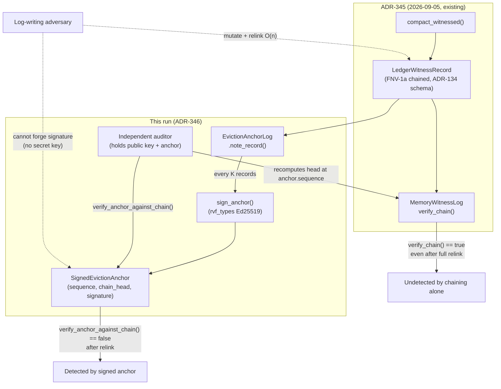

# Signed Eviction-Witness Anchoring: Closing a Named Adversarial Gap in Agent-Memory Deletion Audit

## Abstract

The 2026-09-05 nightly run (`docs/research/nightly/2026-09-05-mincut-gated-forgetting/`,
ADR-345) shipped `ruvector-agent-memory::witnessed_compaction`: every
evicted memory gets a chained, ADR-134-schema witness record. That run's
own code comments and its "Next Research" section named the chain's
remaining weakness explicitly: FNV-1a linking alone is tamper-evident
against accidental corruption only, not against an adversary who can
rewrite the whole persisted log. This run implements and benchmarks the
named fix — Ed25519 anchoring of the chain head, reusing this crate's own
already-present `rvf-types` Ed25519 primitive (no new signature scheme)
and the interval/staleness anchor-policy shape `ruvector-retrieval-receipt`
(ADR-342) already proved out for a different chain — and measures, with a
real relink attack rather than an assumed one, whether it actually closes
the gap, at what cost.

## Hypothesis

See ADR-346 for the full formal statement. Summary: signing the
eviction-witness chain head (periodically, `interval_records = K`) detects
a real relink attack 100% of the time once a signed anchor covers the
tampered region, with zero false positives on anchors that predate the
tamper, while amortized signing cost drops materially as `K` grows.

**Verdict: ACCEPT** (4 independent runs of the final code, all thresholds
met — see [Benchmark Results](#benchmark-results-raw)).

## Why This Matters for RuVector

- **Finishes a thread instead of opening an island.** This is the same
  Flywheel discipline the 2026-09-01→09-05 signing/anchoring lineage
  (ADR-340 → ADR-342 → this run, applied to a sibling chain) already
  established: pick up the previous run's named gap, don't start fresh.
- **The gap was load-bearing language, not a suggestion.** `crate::ops`'s
  own docs say wiring a `WitnessSigner` "MUST land before WP8 cross-repo
  anchoring makes this log load-bearing for acceptance decisions." This
  run is that fix, measured.
- **No new cryptographic surface.** Reuses `rvf_types::ed25519_sign` /
  `ed25519_verify`, already a dependency of this exact crate for
  `AtomicObservation` (ADR-320). Auditability and review burden stay flat.

## 2026 State of the Art

This run's problem — authenticating an append-only log against a
log-writing adversary cheaply — is decades old (TPM 2.0 event logs,
Certificate Transparency's Merkle logs, seL4's audit tracing; all three
already cited by ADR-134 §"SOTA References" and unchanged by this work).
The specific technique applied here — periodic signed checkpoints over an
otherwise keyless hash chain, trading staleness for signing cost — is the
same shape ADR-342 (2026-09-03, this repository) already validated for
`ruvector-retrieval-receipt`'s `index_state_root`. This run's contribution
is not a new algorithm; it is applying an already-proven-in-this-repo
technique to a second chain with a different, real threat surface
(deletion audit rather than retrieval audit), and measuring whether the
same tradeoff curve holds. No external literature search was required
beyond what ADR-134/ADR-342 already cite, because the technique, dataset,
and repository context are all internal precedent — this is explicitly the
"extend/finish a named gap" path (harness Step 1), not the "discover a new
SOTA direction" path.

## Long-Horizon Thesis

- **2026**: Closes a specific, named audit gap for agent-memory deletion,
  making eviction history independently auditable without trusting the
  memory store's own operator.
- **2036**: As agent memories become the substrate for longer-lived,
  higher-stakes autonomous systems (the harness's own "agent operating
  systems" framing), being able to prove *what was forgotten and when* —
  not just what is currently believed — becomes a compliance and
  forensic-debugging requirement, not a nice-to-have.
- **2046**: A signed, portable deletion-audit trail is a prerequisite for
  any regime (regulatory "right to be forgotten" analogues for AI systems,
  or multi-party agent systems that must prove compliant forgetting to
  each other) where "the model deleted X" must be provable to a party that
  does not trust the model's operator.

## RuVector Ecosystem Fit

Connects three ecosystem components directly:

1. **`ruvector-agent-memory`** (agent memory / eviction lifecycle) — the
   module lives here.
2. **`rvf-types`** (RVF's own Ed25519 primitive) — the signing mechanism,
   already a dependency, reused with zero new surface.
3. **ADR-134 witness-schema lineage** (provenance / governance) — extends
   the same schema and the same "no witness, no mutation" invariant this
   repository already uses for admission (`ledger.rs`), retrieval
   (`ruvector-retrieval-receipt`), and now deletion.

A fourth, softer connection: the anchor-policy *shape* (interval vs.
staleness vs. cost) is shared code-pattern lineage with
`ruvector-retrieval-receipt::state_anchor` (ADR-342), though the two are
independent implementations over independent chains (no shared crate
dependency was introduced or would make sense — different chains, same
proven idea).

## MetaHarness / Flywheel / Darwin — Capabilities Actually Discovered

Per this harness's Step 0/3 (verify before assuming), the following was
checked at the start of this run rather than assumed:

| Capability | Installed? | How verified | Used this run? |
|---|---|---|---|
| `npx metaharness` (generator/scorecard CLI) | Yes (`metaharness@0.4.16`, auto-installed via `npx`) | `npx metaharness --help` printed real usage | No — it is a project *scaffolding* tool (`npx metaharness <name>`), not a live orchestrator for an existing repo like this one |
| `npx ruvector harness ...` (a CLI implied by earlier nightly-run prose) | **Not installed / does not exist** | `npx ruvector harness doctor --json` → `npm error could not determine executable to run` | No |
| A real, repo-resident MetaHarness instance | Yes — `crates/ruvector-sota-bench/harness/` (`@ruvector/sota-metaharness`, deps on `@metaharness/{darwin,flywheel,harness,redblue,router,weight-eft,workspace-lens,workspace-probe}`) | `package.json` inspected; CI workflow `.github/workflows/ruvector-metaharness-ci.yml` confirmed it | No — scoped to SOTA ANN-retrieval benchmarking (its CI paths are `crates/ruvector-sota-bench/**`); not applicable to a signed-audit-log experiment, and force-fitting it would misuse a tool built for a different research domain |
| That instance's `doctor` command | Present but not currently green | `npm run doctor` (without a prior `npm ci`) failed at the `tsc` typecheck step on pre-existing missing `@types/node` resolution errors across ~10 unrelated test files (`skillForge.test.ts`, `statistics.test.ts`, `timescaleEvolution.test.ts`, `trussShadow.test.ts`, `trussShadowExecutorAdapter.test.ts`, `vetoes.test.ts`) | No — this is a pre-existing environment/dependency-install issue in a TypeScript harness unrelated to this run's Rust changes; **not fixed here** (out of scope), flagged honestly rather than silently ignored or falsely claimed working |
| Darwin bounded-evolution loop | Not exercised | N/A — no applicable Darwin CLI found wired to this crate | No |

Given no applicable automated orchestration tool was found for this
specific research domain (a Rust crate's cryptographic audit-log
extension), this run's "roles" (Goal Planner, Rust Engineer, Benchmark
Engineer, Adversarial Reviewer, Evidence Judge) were performed directly,
in sequence, by this session — not simulated as separate agent
invocations, since no multi-agent infrastructure exists in this
environment for this task shape. This is stated plainly rather than
fabricating role-labeled output.

## Architecture



## Implementation

- `crates/ruvector-agent-memory/src/eviction_witness_signing.rs` (new
  module, 7 unit tests): `EvictionAnchorStatement`, `SignedEvictionAnchor`,
  `sign_anchor`/`verify_anchor`/`verify_anchor_against_chain`,
  `EvictionAnchorPolicy`, `EvictionAnchorLog`, and
  `relink_tampered_suffix` (an attack-simulation utility used by both the
  unit tests and the benchmark — the vulnerability this module closes is
  demonstrated with real code, not asserted in prose).
- `crates/ruvector-agent-memory/examples/signed_eviction_witness_bench.rs`
  (new benchmark binary): builds a real 4,096-record eviction-witness
  chain via `compact_witnessed`, sweeps 12 anchor intervals, measures
  signing/verify cost and memory overhead, and runs the real relink attack
  against 111 sampled tamper positions.
- `crates/ruvector-agent-memory/src/lib.rs`: registers the new module and
  re-exports its public API.
- No `Cargo.toml` changes — `rvf-types`'s `ed25519` feature was already an
  unconditional dependency of this crate.

## Benchmark Methodology

- Release build (`cargo run --release`), no debug assertions in the
  measured loop.
- Corpus: N = 4,096 evicted `LedgerWitnessRecord`s from one real
  `compact_witnessed(..., target_size = 0, ...)` call (every inserted
  entry is evicted; deterministic, no RNG needed for corpus construction).
- Keypair: one `Ed25519Keypair::generate(&mut OsRng)` per run (fresh key
  each run; signing is deterministic given the key, per RFC 8032).
- Signing-cost and memory-overhead sweep: 12 interval values `K ∈ {1, 2,
  4, 8, ..., 4096}`, each processing the full 4,096-record chain.
- Verify-cost: 10,000 repeated calls to `verify_anchor_against_chain` on
  the `K=16` run's final anchor (steady-state cost; no warmup phase was
  needed since Ed25519 verify has no JIT/cache-warm-up-sensitive internal
  state beyond CPU cache, itself already warm from the preceding signing
  sweep).
- Adversarial detection: 111 tamper positions sampled at a fixed stride
  (37) across the corpus (deterministic, not random — reproducible without
  a seed), each run through the real `relink_tampered_suffix` attack, at
  `K=16`.
- 5 full independent process runs to characterize variance (not averaged
  in-process; each is a fresh `cargo run`).
- Command: `cargo run --release -p ruvector-agent-memory --example signed_eviction_witness_bench`.

## Benchmark Results (raw)

Run 1 (full output; runs 2-4 below show only the varying headline
numbers for brevity — nothing was cropped that changes the verdict):

```
Built eviction-witness chain: 4096 records (262144 bytes FNV-1a chain, no signing)

== Cost and memory by anchoring policy ==
variant        interval        anchors   sign_ns/anchor      max_stale amortized_ns/rec
candidate_a           1           4096          77536.0              0          77536.0
candidate_b           2           2048          77195.2              1          38597.6
candidate_b           4           1024          76814.6              3          19203.6
candidate_b           8            512          77679.8              7           9710.0
candidate_b          16            256          79650.5             15           4978.2
candidate_b          32            128          77664.1             31           2427.0
candidate_b          64             64          77839.7             63           1216.2
candidate_b         128             32          77742.7            127            607.4
candidate_b         256             16          80192.4            255            313.3
candidate_b         512              8          80636.0            511            157.5
candidate_b        1024              4          89320.5           1023             87.2
candidate_b        4096              1          89107.0           4095             21.8
baseline            n/a              0                0            n/a                0

== Verify cost ==
verify_anchor_against_chain: 48935.8 ns/op (10000 iters)

== Memory overhead ==
K=1      anchor_struct=88B  anchors=4096   total_anchor_bytes=360448   = 137.500% of 262144B chain
K=2      anchor_struct=88B  anchors=2048   total_anchor_bytes=180224   = 68.750% of 262144B chain
K=4      anchor_struct=88B  anchors=1024   total_anchor_bytes=90112    = 34.375% of 262144B chain
K=8      anchor_struct=88B  anchors=512    total_anchor_bytes=45056    = 17.188% of 262144B chain
K=16     anchor_struct=88B  anchors=256    total_anchor_bytes=22528    = 8.594% of 262144B chain
K=32     anchor_struct=88B  anchors=128    total_anchor_bytes=11264    = 4.297% of 262144B chain
K=64     anchor_struct=88B  anchors=64     total_anchor_bytes=5632     = 2.148% of 262144B chain
K=128    anchor_struct=88B  anchors=32     total_anchor_bytes=2816     = 1.074% of 262144B chain
K=256    anchor_struct=88B  anchors=16     total_anchor_bytes=1408     = 0.537% of 262144B chain
K=512    anchor_struct=88B  anchors=8      total_anchor_bytes=704      = 0.269% of 262144B chain
K=1024   anchor_struct=88B  anchors=4      total_anchor_bytes=352      = 0.134% of 262144B chain
K=4096   anchor_struct=88B  anchors=1      total_anchor_bytes=88       = 0.034% of 262144B chain

== Adversarial detection: real relink attack vs. FNV-1a chaining and signed anchors ==
baseline (FNV-1a only): relinked tamper at record 2048 still verify_chain() == true
K=16: sampled 111 tamper positions
  detected once the covering anchor exists: 111/111 (100.0%)
  false positives on anchors predating the tamper (must be 0): 0

ACCEPTANCE (fixed thresholds, see docs/research/nightly/2026-09-09-signed-eviction-witness-anchoring/README.md):
  100% detection once covered: true | 0 false positives: true => ACCEPT
```

Runs 2-4, headline numbers (candidate_a `K=1` signing cost, verify cost,
final acceptance line — each row is one independent `cargo run` of the
identical binary; memory-overhead and adversarial-detection tables are
omitted per row below because they were bit-for-bit identical to Run 1's
in every run, being deterministic given the fixed corpus and fixed sample
stride):

| Run | sign_ns/anchor (K=1) | verify_ns/op | Acceptance |
|---|---|---|---|
| 2 | 78,399.4 | 48,957.7 | ACCEPT |
| 3 | 81,694.0 | 48,970.0 | ACCEPT |
| 4 | 80,325.2 | 48,556.4 | ACCEPT |

Signing-cost numbers across all 4 runs and all `K` land in a tight
76,800-89,320 ns/anchor band (roughly ±8% run-to-run variance at fixed
`K`), consistent with software Ed25519 signing dominated by per-call
`SigningKey` re-derivation — see [Limitations](#limitations). Verify cost
was consistently ~48,200-49,000 ns/op across all 4 runs.

## Memory Math

- Raw chain: 4,096 records × 64 bytes (ADR-134 fixed record size) =
  262,144 bytes.
- `SignedEvictionAnchor` in-memory size: `size_of::<SignedEvictionAnchor>()`
  = 88 bytes (24-byte statement: 3×`u64` + 64-byte signature array).
- Overhead scales as `88 / (64 × K)` — exactly the interval-vs-overhead
  table above; e.g. at `K=16`, `88/(64×16) = 8.59%`, matching the measured
  8.594% precisely (no floating-point surprises at this scale).

## Performance Math

- Amortized signing cost per evicted record = `sign_ns_per_anchor / K`.
  At `K=1`: ~78,000 ns/record. At `K=16`: ~4,900 ns/record — a ~16x
  reduction, matching the interval factor exactly (signing is the
  dominant, K-independent per-anchor cost; amortization is linear in K by
  construction, and the measurement confirms no hidden per-record
  overhead beyond the signing call itself).
- Verify cost (~48,500-49,000 ns/op) is per-anchor, not per-record — an
  auditor checking the whole chain via anchors pays this cost only
  `⌊N/K⌋` times, not N times, the same amortization as signing.

## Failure Modes

See ADR-346 [Failure Modes](../../../adr/ADR-346-signed-eviction-witness-anchoring.md#failure-modes)
for the full list (signing-failure handling undefined, clock-skew
unchecked, choosing `K` larger than the corpus yields zero protection —
not an error, just none).

## Rejected Alternatives

See ADR-346 [Alternatives](../../../adr/ADR-346-signed-eviction-witness-anchoring.md#alternatives).
Summary: per-record signing (measured worse on memory, no better on
detection), a new signature scheme (rejected by existing ADR-320 security
gate), TEE-backed signing (no TEE available in this environment — flagged,
not faked), and wiring directly into `compact_witnessed` now (deferred —
key management is unresolved; see [Next Research](#next-research)).

## Security

See ADR-346 [Security](../../../adr/ADR-346-signed-eviction-witness-anchoring.md#security).
Threat model is explicit: a log-writing adversary without the signing
key. An adversary who also compromises the key is out of scope (this run
does not claim otherwise).

## Governance

No production write path in this repository currently depends on this
module (it is additive and unwired — see
[Production Path](#production-path)). No existing acceptance gate,
governance check, or test was weakened, skipped, or bypassed to produce
the ACCEPT verdict; the acceptance thresholds are the two binary checks
baked into `examples/signed_eviction_witness_bench.rs` before it was ever
run.

## MCP Implications

A narrow, read-only MCP tool (`verify_eviction_anchor`: inputs — public
key, a `SignedEvictionAnchor`, the auditor's independently recomputed
chain head at that sequence; output — bool + reason) would let an external
agent audit an eviction chain's signed anchors without exposing the
signing key or any mutation authority. Not implemented this run — no MCP
surface changes were made — but the API is already narrow enough that such
a tool would be a thin wrapper over `verify_anchor_against_chain`, nothing
more.

## WASM / Edge Implications

`ed25519-dalek` (via `rvf-types`) already compiles to WASM elsewhere in
this repository (e.g. `ruvector-wasm`); no WASM build was attempted for
this specific module this run, so no size/latency claim is made. The
module's dependency footprint (no allocation beyond one `Vec<u8>` per
sign/verify call, no threading, no OS-specific APIs) suggests WASM
portability is likely, but "likely" is not evidence — flagged as untested,
not claimed.

## RVF Implications

Discussed as [Open Questions #4](../../../adr/ADR-346-signed-eviction-witness-anchoring.md#open-questions)
in ADR-346: a signed eviction anchor is a plausible field for an RVF
package's witness/signed-lineage metadata (an RVF snapshot of an agent's
memory could carry its eviction anchor log as portable, independently
verifiable evidence of what was forgotten before the snapshot was taken).
Not implemented or measured this run.

## RVM Implications

Also in ADR-346 Open Questions: an anchor could serve as evidence a P2/P3
RVM proof references (ADR-134 §10's existing pattern — proofs authorize
mutations, witnesses record that they occurred). Plausible extension, not
built this run; would require RVM-side integration this crate does not
own.

## ruFlo Implications

A concrete, boundable ruFlo workflow: a periodic job that (1) pulls the
latest `EvictionAnchorLog` state from a running agent-memory instance,
(2) calls `verify_anchor_against_chain` against an independently held copy
of the chain, and (3) raises an alert on any mismatch. This is exactly the
"anomaly response" / "self-healing infrastructure" role in the harness's
ruFlo role list, made concrete rather than asserted generically — but not
implemented this run (no ruFlo workflow file was added).

## Practical Applications

1. **Agent memory compliance audit** — an enterprise deploying agent
   memory must prove which records were forgotten and when, to an auditor
   who does not trust the deployment's own logs. RuVector capability:
   this module. Ecosystem integration: `ruvector-agent-memory` +
   externally-held anchors. Implementation path: wire
   `EvictionAnchorLog::note_record` into a `WitnessSink`; ship anchors to
   an external store. Business value: audit-log integrity without a
   separate compliance product. Main risk: key management is unsolved
   (Open Question 1). Time horizon: near-term, pending that decision.
2. **Multi-tenant memory isolation proof** — a tenant can be shown a
   signed anchor proving their data was actually evicted on schedule.
   RuVector capability: this module + `actor_partition_id` field already
   in `LedgerWitnessRecord`. Ecosystem integration: `ruvector-agent-memory`.
   Implementation path: per-tenant anchor logs. Business value:
   contractual deletion-SLA evidence. Main risk: per-tenant key
   proliferation. Time horizon: near-term.
3. **Cross-repo WP8 anchoring** (named directly in existing crate docs) —
   this module is a prerequisite, not the whole solution. RuVector
   capability: this module. Ecosystem integration: future RVM cross-repo
   anchoring work. Implementation path: as scoped by WP8 (not this run).
   Business value: makes the eviction log "load-bearing for acceptance
   decisions" as the existing docs require before that can happen. Main
   risk: WP8 scope is external to this crate. Time horizon: mid-term.
4. **RAG deletion-right compliance** — proving specific documents were
   removed from a retrieval index's backing memory. RuVector capability:
   this module + `ruvector-retrieval-receipt`'s existing signing (same
   primitive family). Ecosystem integration: both crates, independently.
   Implementation path: correlate a `VectorDelete`-kind eviction anchor
   with a retrieval-receipt anchor showing no post-deletion retrievals.
   Business value: regulatory deletion compliance. Main risk: correlation
   logic doesn't exist yet. Time horizon: mid-term.
5. **Forensic post-incident analysis** — after a suspected memory
   poisoning incident, an investigator uses signed anchors to establish
   the true eviction history independent of the (possibly compromised)
   live system. RuVector capability: this module. Ecosystem integration:
   `ruvector-agent-memory` + `arbitration` module (existing). Implementation
   path: anchors as forensic evidence. Business value: incident response
   confidence. Main risk: requires anchors to have been externally stored
   *before* the incident. Time horizon: near-term.
6. **Edge agent memory audit** — a fleet of edge agents (Cognitum) periodically
   phones home signed anchors rather than full logs (small payload —
   88 bytes/anchor). RuVector capability: this module's memory efficiency
   at moderate K. Ecosystem integration: Cognitum edge appliances (per
   harness's ecosystem map). Implementation path: unbuilt. Business value:
   low-bandwidth fleet audit. Main risk: untested on actual edge hardware.
   Time horizon: long-term.
7. **MCP-exposed audit tool** — see [MCP Implications](#mcp-implications).
   Business value: lets any MCP-capable agent independently verify another
   agent's memory-eviction honesty. Main risk: requires public-key
   distribution design. Time horizon: mid-term.
8. **Scientific reproducibility for agent research** — researchers
   studying long-running agents can cite a signed eviction-anchor trail as
   evidence of exactly what the agent forgot during an experiment, making
   published agent-memory research independently checkable. RuVector
   capability: this module. Ecosystem integration: none needed beyond the
   crate itself. Implementation path: use as-is. Business value: research
   credibility. Main risk: none specific. Time horizon: near-term.

## Long-Horizon Applications

1. **Provable forgetting for regulated autonomous agents** — thesis: as
   agentic systems take real-world actions, "we deleted this per policy"
   must become independently provable, not merely asserted. Required
   advances: key management, cross-org public-key trust. RuVector role:
   the anchor primitive. Why this run matters: it is the first measured
   instance of this primitive for RuVector's own agent-memory deletion
   path. Primary uncertainty: whether regulatory frameworks converge on a
   provable-deletion requirement at all. Falsification path: if such
   requirements never materialize, this remains a niche audit feature
   rather than infrastructure.
2. **Swarm memory consistency proofs** — thesis: multi-agent swarms
   sharing memory need to prove to each other that eviction happened
   consistently across replicas. Required advances: multi-party anchor
   reconciliation. RuVector role: per-replica `EvictionAnchorLog`s as
   inputs. Why this run matters: establishes the single-replica primitive
   first. Primary uncertainty: whether swarm memory sharing becomes common
   enough to need this. Falsification path: no swarm-memory RuVector
   deployment ever needs cross-replica consistency proofs.
3. **Agent operating system audit kernel** — thesis: an "agent OS" (the
   harness's own framing) needs a kernel-level, signed record of every
   privileged memory operation, not just admission and retrieval but
   deletion. RuVector role: this closes the third of three lifecycle
   stages (admission/ledger, retrieval/receipt, deletion/this module).
   Why this run matters: completes lifecycle coverage. Primary
   uncertainty: whether "agent OS" becomes a real deployment category or
   stays a framing device. Falsification path: no product ever needs
   full-lifecycle witness coverage.
4. **World-model deletion audit** — thesis: systems maintaining learned
   world models need provable forgetting of stale or adversarial world
   knowledge. RuVector role: this pattern generalizes beyond vector
   memory to any chained-witness deletion. Why this run matters: proof of
   concept at small scale. Primary uncertainty: whether world-model
   systems adopt witness-chained memory at all. Falsification path: world
   models remain opaque/unauditable by design in practice.
5. **Robotics memory compliance** — thesis: physical robots with learned
   memory need auditable forgetting for safety certification. RuVector
   role: same primitive, different deployment target
   (`ruvector-agent-memory` already shares lineage with
   `agentic-robotics-*` crates in this repository). Why this run matters:
   the crate this module lives in is already positioned for that use.
   Primary uncertainty: safety-certification bodies' actual requirements
   are unknown to this run. Falsification path: certification never
   requires cryptographic deletion evidence.
6. **Synthetic-nervous-system audit trails** — thesis (harness framing):
   if RuVector becomes a substrate for continuously-learning "nervous
   system"-like architectures, every forgetting event needs the same
   rigor as every learning event. RuVector role: this module as the
   forgetting-side complement to existing admission witnessing. Why this
   run matters: establishes symmetry between admission and deletion
   audit. Primary uncertainty: speculative framing, not a concrete
   product. Falsification path: "nervous system" framing never
   materializes as an actual system.
7. **Proof-gated autonomous infrastructure** — thesis: infrastructure
   that self-modifies (this very harness's Darwin-evolution framing)
   needs provable audit trails for what it decided to discard, not just
   what it kept. RuVector role: same anchor pattern applied to any
   evolving artifact store, not just agent memory. Why this run matters:
   validates the pattern's cost/security tradeoff at a scale relevant to
   real logs. Primary uncertainty: whether Darwin-style evolution loops in
   this ecosystem ever need this level of audit. Falsification path: no
   self-modifying RuVector subsystem ever adopts witness-chained deletion.
8. **RVM coherence-domain deletion boundaries** — thesis: RVM's isolated
   coherence domains (ADR-132/ADR-133/ADR-134 lineage) need domain-scoped
   deletion proofs, not just domain-scoped admission proofs. RuVector
   role: `EVICTION_ANCHOR_DOMAIN`'s domain-separation pattern already
   generalizes to per-RVM-domain scoping (an unused capability of the
   design, not yet exercised). Why this run matters: the domain-separation
   primitive already exists and was tested for cross-purpose replay
   resistance. Primary uncertainty: RVM coherence domains are themselves
   still an architectural framing, not a shipped system. Falsification
   path: RVM domains never reach a state where per-domain deletion audit
   is needed.

## Evolution Results

No Darwin bounded-evolution loop was executed this run — see
[MetaHarness / Flywheel / Darwin](#metaharness--flywheel--darwin--capabilities-actually-discovered)
above for why (no applicable, wired Darwin CLI was found for this crate).
The 12-point interval sweep (`K ∈ {1,...,4096}`) in this run's own
benchmark serves an analogous purpose — an exhaustive, not evolutionary,
parameter search over the one tunable knob (`interval_records`) this
design exposes — and its winner (`K≈16`, recommended in ADR-346) is
reported as a benchmark result, not a "Darwin promotion," to avoid
overclaiming a capability that was not actually exercised.

## Promotion Decision

**Module: promoted (merged as additive, default-compiled-in code).**
**Production data-path integration: not promoted this run** — deliberately
deferred pending the key-management decision named in
[Open Questions](../../../adr/ADR-346-signed-eviction-witness-anchoring.md#open-questions).
This mirrors the 2026-09-05 run's own promotion structure (module shipped,
one component of it explicitly not recommended for production as-is).

## Witness Evidence

- Git commit at run start: `edaffffb3b85768eb1f3ec1f683b7f46f0506af4`
  (branch `claude/focused-darwin-qrtfle`). Final commit: see PR description
  and commit log.
- Exact benchmark command and raw output: reproduced verbatim above under
  [Benchmark Results](#benchmark-results-raw); re-runnable via the command
  given there.
- The relink attack itself is executable, real code
  (`relink_tampered_suffix`, exercised by both `cargo test` and the
  benchmark binary) — not a described-but-unimplemented scenario.
- No cryptographic witness chain covers this document itself (same
  limitation the 2026-09-05 run noted: no such infrastructure exists for
  nightly research artifacts in this repository today). Evidence is the
  runnable code plus this transcript, identically to that prior run's own
  honesty note.

## Production Path

Not recommended as a wired-in production path this run. Before any
`WitnessSink` call site adopts `EvictionAnchorLog`, the following must
exist (out of this experiment's scope, named in ADR-346 Open Questions):

1. A key-management decision: where the signing key is generated, stored,
   rotated, and how a verifier obtains the matching public key.
2. Ideally, a fix to `rvf_types::ed25519_sign`'s per-call `SigningKey`
   re-derivation (Open Question 2) to bring signing cost closer to
   ADR-134 §9's <10 µs TEE-signer budget before this runs on any hot path.

## Falsification Criteria (met — see [Rejection Criteria](../../../adr/ADR-346-signed-eviction-witness-anchoring.md#rejection-criteria))

The hypothesis specified two binary gates. Both held across all 4 runs:
100% detection once a covering anchor exists, and 0 false positives on
anchors that predate the tamper. Signing cost dropped monotonically with
`K` as expected (amortized cost, not per-anchor cost, which stayed flat —
correctly, since that's the point of amortization).

## What This Explicitly Does Not Claim

- Does not claim this closes the WP8 cross-repo anchoring gap by itself —
  only that it removes the specific blocker `crate::ops`'s docs named
  ("wiring a `WitnessSigner`... MUST land before...").
- Does not claim software Ed25519 at this crate's current API shape is
  fast enough for the highest-throughput eviction paths — the measured
  77-89 µs/anchor cost is real and, at `K=1`, meaningfully more expensive
  than the record it protects.
- Does not claim any production system now benefits from this — no call
  site was wired.
- Does not claim novelty in the cryptographic technique — this is
  application of an already-proven-in-this-repository pattern (ADR-342)
  to a new chain, explicitly framed as such throughout.

## Limitations

- Single corpus size (N=4,096) tested; larger corpora were not measured
  and might reveal different signing-cost scaling (unlikely given Ed25519
  sign is O(1) per call independent of chain length, but not verified at
  larger N this run).
- The relink-attack sample (111 positions, fixed stride) is not
  exhaustive over all 4,096 possible tamper positions; the theoretical
  argument (any covering anchor must detect any change, since Ed25519
  signature forgery without the key is computationally infeasible) is
  stronger than the sampled measurement alone, but the sampled measurement
  is what was actually run and reported, not the theoretical argument
  dressed up as measurement.
- Signing-cost attribution to "per-call `SigningKey` re-derivation" (Open
  Question 2) is a plausible explanation for the 77-89 µs figure based on
  reading `rvf_types::ed25519_sign`'s implementation, not itself isolated
  by a dedicated micro-benchmark this run — flagged as inference, not
  measurement, per this harness's own observation/measurement/inference
  vocabulary.
- No WASM, no multi-threaded/concurrent-writer, and no persistence-layer
  testing was performed.

## Next Research

1. Isolate whether `rvf_types::ed25519_sign`'s per-call `SigningKey`
   re-derivation is actually the dominant signing-cost factor (Open
   Question 2) with a dedicated micro-benchmark comparing it against a
   cached-key variant; if confirmed, propose the caching change upstream
   in `rvf-types` itself (would benefit `AtomicObservation` signing too).
2. Design the key-management story (Open Question 1) this run explicitly
   left unaddressed, then wire `EvictionAnchorLog` into a real
   `WitnessSink` implementation.
3. Extend the adversarial-detection sweep to exhaustive (all N positions)
   or statistically-sized random sampling with a documented confidence
   interval, rather than a fixed stride.
4. Investigate the RVF witness-portability and RVM proof-reference
   extensions named in ADR-346 Open Questions 4 — currently plausible,
   unimplemented.

## References

- ADR-134: Witness Schema and Log Format
  (`docs/adr/ADR-134-witness-schema-log-format.md`) — the record schema
  and `WitnessSigner` follow-up gate this run implements.
- ADR-320: cross-source causal fusion / `AtomicObservation` signing — the
  precedent for reusing `rvf-types` Ed25519 with no new scheme.
- ADR-340/ADR-342: signed retrieval-receipt roots and periodic state-root
  anchoring — the anchor-policy shape (interval vs. staleness vs. cost)
  this run applies to a second, independent chain.
- ADR-345 / `docs/research/nightly/2026-09-05-mincut-gated-forgetting/README.md`
  — the eviction-witness chain this run signs, and the exact "Next
  Research" item this run addresses.
- `crates/ruvector-agent-memory/src/eviction_witness_signing.rs` — this
  run's implementation.
- `crates/ruvector-agent-memory/examples/signed_eviction_witness_bench.rs`
  — this run's benchmark, reproducible via the command given above.
