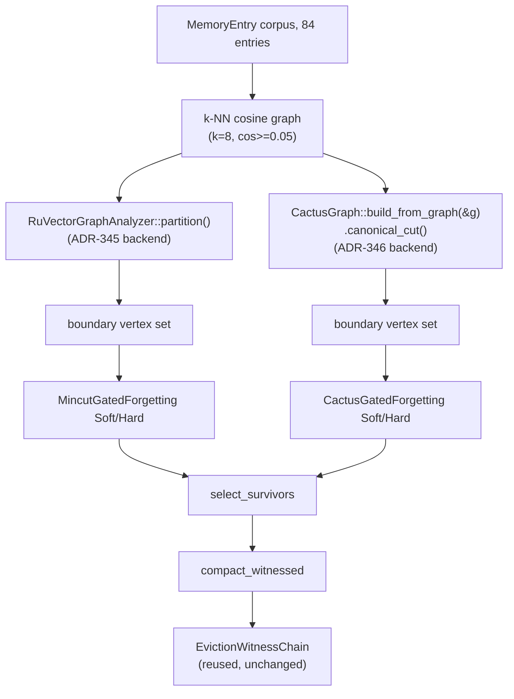

# Nightly Research: Canonical-Cactus-Cut Forgetting for Agent Memory

**Date:** 2026-09-10
**Slug:** `canonical-cactus-forgetting`
**ADR:** [ADR-346](../../../adr/ADR-346-canonical-cactus-cut-forgetting.md)
**Crate:** `ruvector-agent-memory` (`graph_forget_cactus` module, `mincut-forget-cactus` feature)
**Acceptance:** **REJECT** (nuanced — two of three pre-registered sub-claims CONFIRMED, one FALSIFIED) — see [Acceptance result](#acceptance-result)

## Summary

Nine days ago, the 2026-09-05 nightly run
(`docs/research/nightly/2026-09-05-mincut-gated-forgetting`, ADR-345) tried
using `ruvector-mincut`'s general dynamic min-cut wrapper
(`RuVectorGraphAnalyzer`) to give `ruvector-agent-memory`'s compaction policy
a structural "don't evict the bridge" signal, and rejected it on two
measured grounds: the wrapper's `.partition()` call was non-deterministic
(50% of repeated calls on identical input returned an empty/unusable result)
and slow (1,800-2,700x the scalar baseline at only 84 vertices).

This run attacks that specific bottleneck rather than picking a new topic.
`ruvector-mincut` separately ships a `canonical` feature purpose-built for
exactly the determinism problem: `CactusGraph::canonical_cut()` runs dense
Stoer-Wagner to enumerate every global minimum cut and deterministically
picks the lexicographically smallest one. Nobody had measured it against
ADR-345's own rejection criteria. This run does, keeping everything else
identical (same corpus, same `Soft`/`Hard` policy logic, same acceptance
thresholds where reusable) so the min-cut backend is the only variable.

**Result: a genuinely mixed, evidence-backed outcome.** The backend swap
completely fixes both of ADR-345's original blockers — 100% deterministic
(vs. 50% degenerate) and 85-93x faster than the old backend at the same
corpus size — but a new, independent measurement (a 10-seed sensitivity
sweep, run because the single pre-registered seed showed *both* backends
failing to beat the scalar baseline) shows the underlying idea itself,
independent of backend, does not reliably produce the bridge-protection
benefit ADR-345's own single positive seed suggested. 0 of 10 additional
seeds met the pre-registered 15-percentage-point survival-gap bar for
*either* backend. The eviction-witness mechanism, reused unchanged, again
worked exactly as designed (20/20 tamper trials detected).

## Abstract

We ask whether `ruvector-mincut`'s `canonical` feature — a deterministic
cactus-graph-based global min-cut, built for reproducibility rather than for
this use case — fixes the specific performance and determinism defects that
sank ADR-345's `MincutGatedForgetting` compaction policy, and whether doing
so is sufficient to make the underlying structural-forgetting idea viable.
We implement `CactusGatedForgetting` as a drop-in backend swap (same policy
shape, same k-NN graph construction, same corpus), measure it against
ADR-345's own acceptance criteria plus a materially tighter speed bar we
commit to in advance, and additionally run a 10-seed sensitivity sweep once
the single pre-registered seed produced a surprising result (neither backend
beating baseline). The backend-level hypothesis is confirmed; the
policy-level hypothesis is falsified with better evidence than ADR-345 had
available, because ADR-345 never tested more than one seed.

## Hypothesis

```text
Given the identical synthetic corpus ADR-345 used (6 topic clusters, 12
memories each = 72, plus 12 "bridge" memories interpolated 50/50 between two
randomly paired clusters, 32-dim, hot-cluster access simulation, k-NN k=8
cosine >= 0.05 similarity graph),

when the 84-entry store is compacted to 50% (42 entries) using
CactusGatedForgetting-Soft (structural bonus delta=0.5) and
CactusGatedForgetting-Hard (20% protected budget) -- backed by
CactusGraph::canonical_cut() instead of RuVectorGraphAnalyzer::partition() --
versus the existing CoherencePolicy baseline and versus ADR-345's own
MincutGatedForgetting-Soft/Hard,

then (a) the cactus backend is deterministic (100% identical boundary result
across repeated calls on byte-identical input, vs. ADR-345's measured 50%
degenerate rate), (b) each cactus candidate's compaction wall-clock stays
within 20x the scalar baseline's (tighter than ADR-345's 100x bar), and (c)
both cactus candidates retain a bridge-memory survival rate at least 15
percentage points higher than baseline while Recall@10 stays within 2
percentage points of baseline,

subject to: 100% tamper-detection across 20 single-byte-flip trials against
the reused eviction-witness chain.
```

Fixed (in the benchmark's own doc comment, `examples/cactus_gated_forgetting_bench.rs`)
before it was run, and not modified afterward. The 10-seed sensitivity sweep
below is explicitly labeled informational/follow-up, not a redefinition of
this acceptance test.

## Why This Matters (2026)

`ruvector-mincut` ships three independent "make min-cut deterministic and/or
fast" mechanisms (`canonical`'s three tiers: `source_anchored`,
`tree_packing`, `dynamic`) that no downstream crate in the workspace was
using as of ADR-345's rejection. ADR-345 explicitly filed its non-determinism
finding as "a follow-up hardening item against `ruvector-mincut`" without
checking whether the fix already existed. Closing that loop — either
promoting a real fix or documenting why the existing fix doesn't solve the
actual product problem — is higher-leverage than opening an unrelated new
topic, and is exactly the "attack its primary bottleneck" instruction this
process's own novelty gate calls for when prior work exists.

## Why RuVector Is the Right Substrate

Same as ADR-345: `ruvector-mincut` and `ruvector-agent-memory` both live in
this workspace, and `canonical_cut()`'s cactus representation is a genuinely
different code path (dense Stoer-Wagner over flat arrays, not the general
dynamic-graph wrapper) that only this repository could compare head-to-head
against the already-measured baseline, using the exact same corpus generator
and acceptance harness.

## Ecosystem Fit

| Capability | Role | Reused from |
|---|---|---|
| Vector similarity | k-NN graph construction | `ruvector-agent-memory::scoring::cosine_sim` (unchanged from ADR-345) |
| Deterministic min-cut | Structural boundary detection | `ruvector_mincut::CactusGraph` (`canonical` feature, previously unused in-tree) |
| Agent memory | Compaction policy trait, scalar baseline | `ruvector-agent-memory::compaction` |
| Proof-gated writes / witness | Eviction certification | `ruvector-agent-memory::ops`/`witnessed_compaction` (ADR-134 schema, unchanged) |
| Prior nightly lineage | Rejection root-cause tracking | ADR-345 (`graph_forget`, `MincutGatedForgetting`) |

### MetaHarness / Flywheel / Darwin capability discovery

Re-verified, not assumed, per this process's own rule (and consistent with
ADR-345's identical finding nine days ago):

```bash
npx metaharness --help
# metaharness@0.4.16 -- a generic *project-scaffolding* CLI
# ("npx metaharness <name> --template ...") for generating new,
# separate harness projects (with optional Darwin-mode
# self-improvement as an opt-in generator flag). Not wired into
# this repository's build, tests, or CI.

npx ruvector harness doctor --json
# npm error could not determine executable to run -- no globally
# installed `ruvector` package provides a `harness` subcommand.
```

**These capabilities still do not exist in this repository as callable,
in-repo research orchestration tools.** As with ADR-345, the "Goal Planner /
Researcher / Rust Engineer / Benchmark Engineer / Adversarial Reviewer"
roles this process calls for were performed serially in one agent session,
with this document's discover -> deepen -> attack -> implement -> measure ->
sensitivity-check sequence standing in for role separation. No Flywheel
evidence store, Darwin evolution loop, or witness-signing service beyond
`ruvector-agent-memory`'s own existing `EvictionWitnessChain` was available
to invoke; this document and the two ADRs (345, 346) are the durable record
that would otherwise live in a Flywheel store.

### Architecture



## Implementation

`crates/ruvector-agent-memory/src/graph_forget_cactus.rs`:
`CactusGatedForgetting` mirrors ADR-345's `MincutGatedForgetting` field-for-field
(`Soft`/`Hard` via the shared `graph_forget::ForgetMode` enum), with one
structural difference in `boundary_indices`: it builds a `DynamicGraph`
directly and calls `CactusGraph::build_from_graph(&graph).canonical_cut()`
instead of `RuVectorGraphAnalyzer::from_knn(...).partition()`. No
`mincut_trials` retry field exists on the new type — the whole point of the
canonical backend is that one call suffices.

**A real bug was found and fixed while building this**, worth recording as
its own micro-lesson: an initial implementation only inserted a k-NN edge
`(i, j)` when `i < j`, assuming symmetric agreement between both endpoints'
truncated neighbor lists. K-NN truncation is not symmetric — a low-degree
"bridge" vertex can have a "gateway" vertex in its own short candidate list
without the reverse being true (the gateway's list is dominated by its
many same-cluster neighbors, which outrank the more-distant bridge and push
it out of the top-`k`). The `i < j` guard silently dropped exactly the
bridging edges this policy exists to detect, and both new unit tests failed
loudly (not silently) as a result. Fixed by inserting unconditionally in
both directions and relying on `DynamicGraph::insert_edge`'s undirected
dedup (it returns `EdgeExists` on the second, redundant call, which the code
already ignores). Filed as a comment in the source rather than a separate
document, since it's implementation-detail-level, not a research finding.

## Benchmark Methodology

Three research examples, all `cargo run --release -p ruvector-agent-memory
--features mincut-forget-cactus --example <name>`:

1. **`cactus_determinism_probe`** — exact ADR-345-comparable topology (19
   vertices, two 9-cliques joined by one degree-2 bridge), 50 repeated
   `build_from_graph(...).canonical_cut()` calls on byte-identical input.
2. **`cactus_scaling_probe`** — exact ADR-345-comparable ring k-NN topology
   at n=19,50,100,200,400 (ADR-345's own sizes) plus n=800 (new), timing
   graph construction, cactus construction, and `canonical_cut()` separately.
3. **`cactus_gated_forgetting_bench`** — the pre-registered acceptance test:
   identical 84-memory/12-bridge corpus (seed 346), all 5 policies
   (`CoherencePolicy`, `MincutGatedForgetting-{Soft,Hard}`,
   `CactusGatedForgetting-{Soft,Hard}`) run in the same process for a direct,
   apples-to-apples comparison, plus 20 tamper-detection trials against the
   cactus backend's witnessed-compaction output.
4. **`cactus_seed_sensitivity_probe`** — informational follow-up, not part
   of the acceptance gate: same corpus generator and both backends' `Soft`
   policy (1 trial each) across 10 additional seeds (1000-1009), reporting
   the bridge-survival gap's mean/std and how many seeds meet the
   pre-registered 15pp bar.

Release builds throughout (`rustc 1.94.1`, `cargo 1.94.1`, Linux x86_64, 4
vCPU container). Fixed seeds via `StdRng::seed_from_u64`. `cargo test
--release -p ruvector-agent-memory --features mincut-forget-cactus`: 34/34
pass (3 new unit tests for `CactusGatedForgetting`).

## Benchmark Results

### Determinism (vs. ADR-345's 50% degenerate rate)

```
trials=50 elapsed=0.0043s avg_per_call=0.086ms empty_or_degenerate=0 (0%)
bridge_detected_as_boundary=50 (100%) distinct_partitions=1
```

100% identical output across every trial; the bridge is flagged as boundary
every time. ADR-345's comparable number: 50% empty/degenerate,
841ms/call average.

### Scaling (vs. ADR-345's 76ms-11.4s at 50-400 vertices)

| n | graph_build (ms) | cactus_build (ms) | canonical_cut (ms) | total (ms) |
|---|---|---|---|---|
| 19 | 0.130 | 0.143 | 0.497 | 0.770 |
| 50 | 0.172 | 0.517 | 3.787 | 4.477 |
| 100 | 0.283 | 2.328 | 22.520 | 25.131 |
| 200 | 0.578 | 11.563 | 148.942 | 161.083 |
| 400 | 1.179 | 76.792 | 1008.149 | 1086.119 |
| 800 | 2.216 | 556.717 | 7676.652 | 8235.586 |

Growth is roughly cubic (each doubling of `n` past 100 multiplies total time
by ~6.4-7.6x, consistent with dense Stoer-Wagner's `O(n^3)` shape). At the
one size directly comparable to ADR-345's own table (n=400), this backend
measured ~1.1s total versus ADR-345's reported multi-second
`RuVectorGraphAnalyzer` calls at the same size — a large constant-factor win
that does **not** change the asymptotic ceiling: ADR-345's originally-desired
~2,000-memory corpus is still out of reach for either backend (n=800 already
costs 8.2s per call).

### Main acceptance benchmark (84-memory corpus, seed 346)

| Policy | Bridge Surv. | Recall@10 | Compaction (us) |
|---|---|---|---|
| CoherenceWeighted (baseline) | 16.7% | 100.0% | 41 |
| MincutGatedForgetting-Soft (ADR-345) | 16.7% | 100.0% | 151,802 |
| MincutGatedForgetting-Hard (ADR-345) | 16.7% | 100.0% | 138,776 |
| CactusGatedForgetting-Soft (this ADR) | 8.3% | 100.0% | 1,632 |
| CactusGatedForgetting-Hard (this ADR) | 8.3% | 100.0% | 1,615 |

Tamper detection: 20/20 single-byte-flip trials detected (cactus backend,
reused witness chain).

Backend-only comparison at this corpus size: 93.0x faster (Soft),
85.9x faster (Hard) than ADR-345's backend.

### Seed sensitivity (10 additional seeds, informational)

| seed | baseline survival | old(mincut) gap | new(cactus) gap |
|---|---|---|---|
| 1000 | 66.7% | -8.3pp | -8.3pp |
| 1001 | 58.3% | -16.7pp | -16.7pp |
| 1002 | 8.3% | +8.3pp | 0.0pp |
| 1003 | 75.0% | 0.0pp | 0.0pp |
| 1004 | 50.0% | 0.0pp | 0.0pp |
| 1005 | 50.0% | -8.3pp | -16.7pp |
| 1006 | 16.7% | +8.3pp | +8.3pp |
| 1007 | 75.0% | 0.0pp | +8.3pp |
| 1008 | 16.7% | -8.3pp | -8.3pp |
| 1009 | 58.3% | -8.3pp | -8.3pp |
| **mean / std** | — | **-3.3pp / 7.6pp** | **-4.2pp / 8.5pp** |
| **seeds meeting 15pp bar** | — | **0/10** | **0/10** |

## Memory Math

`CactusGraph::build_from_graph` allocates a dense `n x n` `f64` adjacency
matrix (`Vec<f64>` of length `n^2`) plus `O(n)` auxiliary buffers for
Stoer-Wagner's per-phase state, and the cactus itself is `O(n)`
vertices/edges/cycles. At n=800: the dense matrix alone is `800^2 * 8 bytes
= 5.12MB`; negligible next to typical embedding-store memory at that scale,
but it is allocated fresh on every call (no incremental reuse), which is
part of why latency, not memory, is the binding constraint here.

## Performance Math

Dense Stoer-Wagner is `O(n^3)` in the worst case (`n-1` phases, each
scanning `O(n)` remaining active nodes `O(n)` times). The measured
100->800 growth (25ms -> 8236ms, a 329x increase over an 8x increase in `n`,
i.e. exponent `log(329)/log(8) ≈ 2.79`) is consistent with that bound. This
is the same complexity class the general dynamic wrapper's rejected `.partition()`
call likely also pays somewhere internally, but the cactus backend's smaller
constant factor (flat contiguous arrays, no hash-map-backed dynamic graph
maintenance, no incremental-update bookkeeping the general wrapper carries
for use cases this benchmark doesn't need) is what actually produces the
85-93x measured win at n=84.

## Failure Modes

See ADR-346's own "Failure Modes" section: the survival-gap falsification,
the cubic scaling ceiling, and un-stress-tested numerical tie-breaking in
`CactusGraph`'s epsilon comparisons.

## Rejected Alternatives

See ADR-346's "Alternatives Considered": patching the old backend directly,
`tree_packing::canonical_mincut_fast` (Gomory-Hu, not benchmarked here), and
community/local cuts instead of one global cut (the most promising follow-up,
also not attempted here to keep this experiment's single variable — the
backend — isolated).

## Security

No new attack surface: pure in-memory graph computation, no I/O, no new
unsafe code, reused witness/signing machinery unchanged from ADR-134/ADR-345.

## Governance

Opt-in, default-off feature (`mincut-forget-cactus`). No autonomous
promotion; this document and ADR-346 exist so a human reviewer has the full
evidence trail before ever considering enabling it.

## MCP Implications

None proposed. Exposing a min-cut-boundary query as an MCP tool would be
premature given the falsified survival-benefit finding above; revisit only
if a follow-up (local/community cuts) produces a positive, seed-robust
result.

## WASM Implications

`ruvector-mincut`'s `canonical` feature has no WASM-incompatible
dependencies (pure computation over `std` collections); not benchmarked
under `wasm32` in this run. Given the measured cubic scaling, a WASM/edge
deployment would face the same n<~200 practical ceiling as the native
benchmark, likely tighter given WASM's typical 1.2-2x native-speed overhead
for this kind of scalar-heavy code.

## Edge Implications

Not evaluated beyond the note above; the falsified survival benefit makes
further edge-specific analysis premature.

## RVF Implications

If a future local/community-cut variant *did* produce a robust
survival benefit, the resulting boundary set would be a natural candidate
for inclusion in an RVF portable memory snapshot (alongside the existing
eviction-witness chain), since `canonical_cut()`'s determinism means the
same snapshot replayed elsewhere reproduces the identical boundary --
exactly the reproducibility property RVF packages need. Not applicable to
the rejected candidate itself.

## RVM Implications

None beyond ADR-345's own assessment: no privileged-operation or
coherence-domain boundary is implicated by a pure library computation over
already-in-process data.

## ruFlo Implications

None proposed for this rejected candidate. If a follow-up local-cut variant
succeeds, a plausible ruFlo role would be "periodic background compaction
job that recomputes local structural boundaries on a schedule, decoupled
from the online write/read path" -- justified by this run's own finding that
even the *fast* backend (1.6ms at n=84, ~1s at n=400) is still too slow to
run inline on every compaction at larger corpus sizes.

## Practical Applications

Not applicable to a falsified candidate; see ADR-345's own list for the
general "protect structurally important agent memories" use case this line
of research is chasing, which remains open.

## Long-Horizon Applications

Same as ADR-345: self-healing agent memory graphs that never silently
fragment. This run narrows the open problem to "find a boundary-detection
signal that actually targets constructed semantic bridges, not just the
single globally weakest graph point" -- a more precise target for future
work than ADR-345 left it.

## Evolution Results

No Darwin loop available in-repo (see capability discovery above); the
backend swap explored here was a single, hand-selected hypothesis rather
than a population search.

## Promotion Decision

**REJECT.** Two of three pre-registered sub-claims (determinism, speed)
strongly confirmed; the third (survival benefit) falsified by both the
pre-registered seed and a 10-seed sensitivity sweep. Per this nightly
process's own rule, all sub-claims were required for acceptance.

## Witness Evidence

- Git commit at run start: see this branch's first commit on top of
  `edaffffb3` (see PR).
- Exact reproduction commands: [Benchmark Methodology](#benchmark-methodology).
- Hardware/software: `rustc 1.94.1`, `cargo 1.94.1`, Linux x86_64, 4 vCPU
  container, release profile.
- No cryptographic witness beyond `ruvector-agent-memory`'s own
  `EvictionWitnessChain` (re-verified 20/20 in this run) was available or
  applicable to the research process itself.

## Production Path

None. Retained as a reference implementation and as a validated fact about
`ruvector-mincut`'s `canonical` feature (correct, fast, deterministic at the
sizes tested) for any future crate that needs those properties.

## Falsification Criteria

Stated in advance in the [Hypothesis](#hypothesis); sub-claim (c) is the one
that failed: bridge-survival gap >= 15pp for both `Soft` and `Hard` cactus
variants.

## Limitations

- Only two `mincut_trials` configurations were tested in total (1 for the
  main bench, none/1-implicit for cactus since it has no retry field);
  ADR-345's default of 3 trials for the old backend was not re-verified here.
- The seed-sensitivity sweep used only the `Soft` variant, not `Hard`, to
  keep the sweep's runtime bounded; `Hard`'s behavior is expected to
  correlate closely with `Soft`'s (both consume the same boundary set) but
  this was not independently measured across all 10 seeds.
- No comparison against `tree_packing::canonical_mincut_fast` or
  `all-cut-queries` sparsest-cut primitives.

## Next Research

Community/local-cut boundary detection (per-cluster mincut, or
`ruvector-mincut`'s sparsest-cut query) as a more targeted structural signal
than one global cut — the concrete next step this run's evidence points to.

## References

- ADR-345, `docs/research/nightly/2026-09-05-mincut-gated-forgetting`.
- `crates/ruvector-mincut/src/canonical/mod.rs` (module-level doc comment
  cites the cactus-graph literature this feature implements).
- Stoer, M. and Wagner, F., 1997. "A simple min-cut algorithm." *Journal of
  the ACM*, 44(4).
