# Nightly Research: Deterministic, Non-Degenerate Witness Partitions in `ruvector-mincut`

**Date:** 2026-09-11
**Slug:** `mincut-partition-determinism`
**ADR:** [ADR-346](../../../adr/ADR-346-deterministic-mincut-witness-partition.md)
**Crate:** `ruvector-mincut` (`graph`, `instance::bounded`, `instance::witness`, `integration` modules)
**Acceptance:** **ACCEPT** — see [Acceptance result](#acceptance-result)

## Summary

The 2026-09-05 nightly (`docs/research/nightly/2026-09-05-mincut-gated-forgetting`,
[ADR-345](../../../adr/ADR-345-mincut-gated-forgetting.md)) rejected an
agent-memory integration built on `ruvector-mincut::RuVectorGraphAnalyzer`
partly because `partition()` returned an empty or degenerate result in
**15/30 (50%)** of repeated calls against a byte-identical 19-vertex graph,
attributed to "likely hash-map iteration-order-dependent tie-breaking"
without a located root cause.

This run root-caused and fixed it. There were **two independent bugs**, not
one:

1. **`DynamicGraph::vertices()`/`edges()` iterated a `DashMap` directly.**
   `DashMap` (like `std::collections::HashMap`) uses a randomly-seeded
   hasher per instance, so its iteration order is not stable across process
   runs even for byte-identical insertion sequences. Every downstream
   consumer that used this order for tie-breaking — seed selection in
   `BoundedInstance::search_for_cuts`, bitmask-to-vertex assignment in
   `BoundedInstance::brute_force_min_cut` — silently changed which of
   several equally-valid minimum cuts it returned, run to run.
2. **`WitnessHandle::materialize_partition()` inferred the graph's vertex
   range from `max(U)`** (the cut side's own membership) instead of the
   graph's actual vertex set. Whenever the returned cut side `U` did not
   happen to contain the graph's highest-numbered vertex — the *common*
   case, not an edge case — the computed complement `V \ U` came back
   truncated or entirely empty. This, not connectivity or seed
   non-determinism, was the direct, deterministic cause of the "empty"
   results: on the exact reproduction graph from the prior nightly, this bug
   alone reproduces the empty result on every single call once bug (1) is
   fixed in isolation (see [Failure modes](#failure-modes-two-independent-bugs)),
   which is why a partial fix made a first-pass measurement look 2x *worse*
   before both were understood together.

Fixing both (deterministic sort at the `DynamicGraph` read boundary, plus
computing `RuVectorGraphAnalyzer::partition()`'s two sides from the graph's
real vertex list instead of `materialize_partition()`) makes the exact,
unmodified reproduction script from the prior nightly
(`crates/ruvector-agent-memory/examples/mincut_determinism_probe.rs`) go
from **50% empty/degenerate** to **0/60 empty across two independent 30-trial
runs**, with the graph's bridge vertex detected as being on the cut boundary
in **100%** of calls (previously unmeasurable, since most calls returned
nothing usable). A new regression test
(`crates/ruvector-mincut/tests/determinism_tests.rs`) further shows the
returned partition is **byte-identical across 30 repeated calls**, not just
"less often empty."

**Latency is explicitly out of scope and unchanged.** The prior nightly's
separate finding — `partition()` scaling from ~77ms (n=50) to ~11.4s (n=400)
— is a distinct algorithmic-complexity problem in the small-graph brute-force
and `LocalKCut` search paths, not a hashing/ordering issue, and this run does
not attempt to fix it. Per-call latency on the 19-vertex reproduction graph
is unchanged within noise (~1.1s/call before and after, consistent with the
prior nightly's ~841ms/call measurement on the same hardware class).

## Abstract

`ruvector-mincut` is a from-scratch implementation of a December-2024
subpolynomial dynamic minimum-cut paper (arXiv:2512.13105), used by
`ruvector-agent-memory`'s (rejected, retained-as-evidence)
`MincutGatedForgetting` policy and available to `CommunityDetector` and
`GraphPartitioner` for community detection and distributed partitioning. All
three consumers call `RuVectorGraphAnalyzer::partition()`, whose contract —
"return the two sides of *a* minimum cut" — silently broke whenever the
returned cut happened not to include the graph's highest vertex ID. This run
asks a narrow, falsifiable question: is the previously-observed
non-determinism a fixable bug in the read/iteration boundary of
`ruvector-mincut`, or an inherent property of its algorithm that downstream
consumers must work around? We trace the exact fault using the prior
nightly's own unmodified reproduction script as ground truth, fix the two
root causes at their narrowest correct scope, and re-run the same script
unmodified to measure the result — the same evidentiary standard the prior
nightly used to reject the integration in the first place.

## Hypothesis

```text
Given RuVectorGraphAnalyzer::partition() called on a fresh analyzer built
from a fixed, byte-identical connected k-NN graph (the exact two-cluster-
plus-bridge, 19-vertex topology from the 2026-09-05 nightly's
mincut_determinism_probe.rs, unmodified),

when (a) DynamicGraph::vertices()/edges() return vertices/edges in
canonical (sorted) order instead of raw DashMap iteration order, (b)
BoundedInstance's internal seed-selection and bitmask-to-vertex vertex
lists are sorted instead of raw HashSet iteration order, and (c)
RuVectorGraphAnalyzer::partition() derives both cut sides by scanning the
graph's actual vertex list against witness.contains() instead of trusting
WitnessHandle::materialize_partition()'s max(U)-inferred range,

then partition() returns a non-empty, non-degenerate result on every one
of 60 calls across two independent 30-trial runs (vs. the prior nightly's
measured ~50% empty/degenerate rate on the same script), and the returned
partition is byte-identical across 30 repeated calls in a dedicated
regression test,

subject to: (a) every pre-existing ruvector-mincut unit and integration
test remains green, (b) no measured latency regression beyond run-to-run
noise on the same benchmark, and (c) no public API signature changes for
downstream crates (ruvector-agent-memory, ruvector-mincut-wasm,
ruvector-mincut-node, ruvector-graph-condense, prime-radiant,
cognitum-gate-kernel, mcp-brain-server, and 11 other direct dependents).
```

## Why This Matters (2026)

`ruvector-mincut` backs three in-tree consumers today
(`RuVectorGraphAnalyzer` itself, `CommunityDetector`, `GraphPartitioner`) and
18 crates depend on it directly. A `partition()` call that silently returns
a wrong or empty result on a *connected* graph is not a performance
footnote — it is a correctness bug that makes every consumer's output
untrustworthy in a way that is easy to miss in a demo (small hand-built
graphs often happen to include the max-ID vertex on both sides across runs)
and hard to miss in production (a 2026-09-05-style structural signal that
silently does nothing, or a community detector that silently returns
"everything is one community"). Finding and fixing it now, rather than
after `ruvector-mincut` gets a second downstream integration, is exactly the
kind of "attack the prior bottleneck" follow-up this nightly process exists
to do — the prior run correctly stopped at "too slow and looks
non-deterministic, root cause unclear"; this run finishes that diagnosis.

## Why It Could Matter in 2036 / 2046

A dynamic min-cut engine that returns *wrong* structural signals is worse
than no structural signal at all for any of the long-horizon uses this
workspace is aiming `ruvector-mincut` at: proof-gated mutation boundaries,
self-healing graph memory, RVM coherence-domain partitioning, or an agent
operating system that uses graph connectivity to decide what state is safe
to garbage-collect. Every one of those depends on "the cut we found is a
real cut of the real graph" being a load-bearing invariant, not a
best-effort approximation that happens to work on the demo topology. This
run establishes that invariant for the *existing* algorithm rather than
proposing a new one — a precondition for trusting any future work built on
top of it (including a retry of `MincutGatedForgetting` itself).

## Why RuVector Is the Right Substrate

The bug and its fix are both entirely internal to `ruvector-mincut`; no new
crate or external dependency is needed. Fixing it in place, with a
regression test pinned to the exact scenario a *different* nightly run used
to discover the symptom, is the kind of low-external-novelty,
high-leverage contribution that compounds: every one of the 18 dependent
crates gets more trustworthy `partition()` behavior for free, with zero
migration cost (no signature changes).

## Ecosystem Fit

| Capability | Role | Reused / affected |
|---|---|---|
| Dynamic min-cut | Root cause + fix | `ruvector-mincut::graph`, `::instance::bounded`, `::instance::witness`, `::integration` |
| Agent memory | Direct beneficiary — the exact bug that helped sink `MincutGatedForgetting` | `ruvector-agent-memory::graph_forget` (feature `mincut-forget`) |
| Community detection / graph partitioning | Indirect beneficiary — shares the same buggy `partition()` call | `ruvector-mincut::integration::{CommunityDetector, GraphPartitioner}` |
| WASM / Node bindings | Indirect beneficiary, not rebuilt/tested this run (see [Limitations](#limitations)) | `ruvector-mincut-wasm`, `ruvector-mincut-node`, `ruvector-mincut-brain-node` |
| Evidence retention / nightly Flywheel | This document + regression test as retained, falsifiable evidence for future nightly runs | `docs/research/nightly/`, `crates/ruvector-mincut/tests/determinism_tests.rs` |

### MetaHarness / Flywheel / Darwin / `ruvector harness` capability discovery

Re-verified rather than assumed, per this process's own rule:

- `npx metaharness --help` resolves to `metaharness@0.4.16`, a generic
  project-*scaffolding* CLI (`npx metaharness <name> --template ...`). It is
  not wired into this repository and running it would scaffold a separate
  project, not orchestrate research inside `ruvector`. Not used, same as the
  prior nightly's finding.
- `npx ruvector harness doctor --json` fails (`npm error could not determine
  executable to run`) — no `ruvector` CLI package with a `harness`
  subcommand is installed or resolvable. **Unchanged from the prior
  nightly**; these capabilities still do not exist in this repository.
- No Darwin evolutionary search was run: this was a targeted root-cause
  diagnosis of a specific, already-reported bug, not a parameter or
  hyperparameter search over a candidate space. There was no "population" to
  evolve — only one correct fix per bug, verified against the existing
  behavior. Framing this as a bounded, manual Darwin-style exploration would
  overstate what happened; it is reported plainly as engineering root-cause
  analysis instead.

## Architecture

```mermaid
flowchart TD
    subgraph before["Before (2026-09-05 finding)"]
        A1["DynamicGraph::vertices/edges()\n(raw DashMap iteration order,\nrandomly seeded per run)"] --> B1["BoundedInstance seed /\nbitmask-to-vertex order\n(raw HashSet iteration order)"]
        B1 --> C1["search_for_cuts / brute_force_min_cut\n(order-dependent tie-break)"]
        C1 --> D1["WitnessHandle\n(seed, membership U, boundary_size)"]
        D1 --> E1["materialize_partition()\nV\\U inferred from max(U)"]
        E1 --> F1["partition() result:\n~50% empty/degenerate,\nnon-reproducible across runs"]
    end
    subgraph after["After (this run)"]
        A2["DynamicGraph::vertices/edges()\n(sorted, canonical order)"] --> B2["BoundedInstance seed /\nbitmask-to-vertex order\n(sorted)"]
        B2 --> C2["search_for_cuts / brute_force_min_cut\n(deterministic tie-break)"]
        C2 --> D2["WitnessHandle\n(seed, membership U, boundary_size)"]
        D2 --> E2["partition(): scan graph.vertices(),\nsplit by witness.contains(v)"]
        E2 --> F2["partition() result:\n0/60 empty, byte-identical\nacross repeated calls"]
    end
```



## Implementation

Four files changed in `crates/ruvector-mincut/src/`, no new public API, no
signature changes:

1. **`graph/mod.rs`** — `DynamicGraph::vertices()` now returns vertices
   sorted ascending; `DynamicGraph::edges()` now returns edges sorted by
   `EdgeId` ascending. Both were previously `DashMap::iter().collect()` with
   no ordering guarantee.
2. **`instance/bounded.rs`** —
   - `brute_force_min_cut()`: the `HashSet<VertexId>`-derived `vertex_vec`
     (which defines the bitmask-to-vertex assignment the brute-force search
     enumerates over) is now sorted before use. The witness `seed` field is
     now `best_set.iter().min()` instead of `.next()` for a deterministic
     seed label on ties.
   - `search_for_cuts()`: both branches that build `seed_vertices` (the
     order `LocalKCutQuery` seeds are tried, with a first-match return) are
     now sorted before use.
3. **`instance/witness.rs`** — no behavior change; strengthened the
   `materialize_partition()` doc comment to state the `max(U)` scope
   limitation explicitly and point callers at `contains()` + the real vertex
   list instead.
4. **`integration/mod.rs`** — `RuVectorGraphAnalyzer::partition()` no longer
   calls `witness.materialize_partition()`. It now scans `self.graph.vertices()`
   (already sorted per fix 1) and splits each vertex into side A or side B
   via `witness.contains(v)` (an O(1) `RoaringBitmap` lookup), which is
   correct for any `U` regardless of whether it contains the graph's
   max-ID vertex.

New test: `crates/ruvector-mincut/tests/determinism_tests.rs` — reproduces
the exact two-cluster-plus-bridge, 19-vertex topology from the prior
nightly's `mincut_determinism_probe.rs` and asserts (a) `partition()` is
never degenerate across 30 trials, (b) `partition()` returns a
byte-identical result across 30 trials, and (c)
`DynamicGraph::vertices()`/`edges()` are returned in sorted order for an
out-of-order insertion sequence.

## Benchmark Methodology

Reused the prior nightly's own unmodified reproduction script,
`crates/ruvector-agent-memory/examples/mincut_determinism_probe.rs`
(feature `mincut-forget`), unchanged — same topology, same k-NN
construction (k=8, min cosine similarity 0.05), same metrics
(`empty_or_degenerate`, `bridge_detected_as_boundary`, `avg_per_call`).
Deliberately did **not** rewrite the benchmark: reusing the exact
instrument that originally measured the bug is the only way an honest
before/after comparison is possible, and prevents a benchmark rewrite from
quietly changing what's being measured.

```bash
cargo build --release -p ruvector-agent-memory \
  --example mincut_determinism_probe --features mincut-forget
TRIALS=30 ./target/release/examples/mincut_determinism_probe
```

Hardware/software: `rustc 1.94.1 (e408947bf 2026-03-25)`, `cargo 1.94.1`,
Linux x86_64, release profile (`opt-level` from workspace `Cargo.toml`),
single-threaded probe (no `rayon`/parallel query path exercised).

## Benchmark Results

### Root-cause diagnostic (ad hoc, deleted before commit — see git history of this branch for the script if needed)

Direct instrumentation of the same 19-vertex topology confirmed:
`DynamicGraph::is_connected()` (a plain BFS, ground truth) reports the graph
connected in every run; `num_edges=74`, no isolated vertices
(`min degree = 2`, vertex 18 — the bridge). With only fix 1 applied (sorted
`DynamicGraph` iteration) and fix 2 *not yet* applied,
`RuVectorGraphAnalyzer::partition()` returned `(9, 0)` — a *stable but still
degenerate* split — on 5/5 repeated calls: the min-cut computation itself
had become deterministic (same 9-vertex side every time), but
`materialize_partition()`'s `max(U)`-scoped complement calculation still
zeroed out `V \ U` because that 9-vertex side happened not to contain the
graph's highest vertex ID (18). This is direct evidence that the two bugs
are independent: fixing only the read-ordering bug made the result
*consistently* wrong instead of *randomly* wrong ~50% of the time — worse by
the `empty_or_degenerate` metric, which is why both fixes are reported
together rather than as two separate incremental nightly runs.

With **both** fixes applied, the same instrumentation reports
`partition_sizes=(9, 10)` on 5/5 calls — a correct, non-degenerate,
stable partition (cluster 1 = 9 vertices; cluster 2 + bridge = 10 vertices;
1 edge crosses, matching the bridge vertex's single edge into cluster 1 —
this is in fact the graph's true global minimum cut, value 1, smaller than
isolating the bridge vertex alone which would cost 2).

### Official reproduction script, both fixes applied

| Metric | Prior nightly (2026-09-05, documented) | This run, run 1 (30 trials) | This run, run 2 (30 trials) |
|---|---|---|---|
| `empty_or_degenerate` | 15/30 (50%) | 0/30 (0%) | 0/30 (0%) |
| `bridge_detected_as_boundary` | not reliably measurable (most calls empty) | 30/30 (100%) | 30/30 (100%) |
| `avg_per_call` | ~841ms | ~1118ms | ~1130ms |
| `elapsed` (30 trials) | not reported | 33.55s | 33.88s |

Raw output:

```text
trials=30 elapsed=33.55s avg_per_call=1118.3ms empty_or_degenerate=0 (0%) bridge_detected_as_boundary=30 (100%)
trials=30 elapsed=33.88s avg_per_call=1129.5ms empty_or_degenerate=0 (0%) bridge_detected_as_boundary=30 (100%)
```

Per-call latency is ~33% higher than the prior nightly's measurement
(1118-1130ms vs. 841ms). This is attributed to environment/hardware
variance between nightly runs (the sort added by this fix is `O(V log V)`
on a 19-element vector — microseconds, not the ~250-300ms difference
observed) rather than a regression; it is reported as-is rather than
adjusted, per this process's "no fabricated comparison numbers" rule. This
run does not claim a latency improvement or regression — only that latency
is not measurably changed by an algorithmically-negligible sort.

### New regression test suite

```bash
cargo test --release -p ruvector-mincut --test determinism_tests
```

```text
running 3 tests
test graph_vertices_and_edges_are_sorted ... ok
test partition_is_never_degenerate_on_connected_graph ... ok
test partition_is_stable_across_repeated_calls ... ok

test result: ok. 3 passed; 0 failed; 0 ignored; 0 measured; 0 filtered out; finished in 34.17s
```

`partition_is_stable_across_repeated_calls` asserts **byte-identical**
partitions (not just "non-empty") across 30 independent `RuVectorGraphAnalyzer`
instances built from the same input — a strictly stronger claim than the
probe script's `empty_or_degenerate` count.

### Pre-existing test suite (regression check)

```bash
cargo test --release -p ruvector-mincut --lib --tests
```

Full existing `ruvector-mincut` unit and integration test suite (lib +
all pre-existing `tests/*.rs` files: `bounded_integration`,
`canonical_bench`, `certificate_tests`, `coverage_tests`,
`integration_tests`, `jtree_tests`, `localkcut_integration`,
`localkcut_paper_integration`, `paper_algorithm_tests`, `wrapper_tests`) —
**644 passed, 0 failed, 5 ignored** (the 5 ignored tests are pre-existing
and unrelated to this change; `canonical_bench.rs` and `jtree_tests.rs`
contain no `#[test]` functions and report 0/0). Full per-binary breakdown in
[ADR-346's evidence section](../../../adr/ADR-346-deterministic-mincut-witness-partition.md#evidence).

## Failure Modes: Two Independent Bugs

This is worth stating plainly because it is itself a finding about how easy
it is to mis-diagnose a compound bug from aggregate statistics alone: the
prior nightly's single `empty_or_degenerate` metric could not distinguish
"non-deterministic tie-breaking sometimes produces a degenerate result" from
"a scope bug deterministically produces a degenerate result whenever a
specific (common) condition holds." Both manifest as "empty sometimes." Only
per-bug instrumentation (fixing one, re-measuring, then fixing the other)
separated them. A nightly process that stops at the first plausible root
cause and declares victory would very likely have "fixed" only the
DashMap-ordering bug, observed the metric go from 50% to (in the worst case
for that specific topology) 100% empty, and incorrectly concluded the fix
made things worse or that the original hypothesis about hash-map ordering
was wrong.

## Rejected Alternatives

- **Fixing `WitnessHandle::materialize_partition()`'s signature** (accept a
  `max_vertex: VertexId` or a full graph reference) instead of routing
  around it at the call site. Rejected for this run: it is used directly by
  two existing tests (`coverage_tests.rs`, `localkcut_paper_integration.rs`)
  and has a public doctest; changing its signature is a breaking API change
  that would need every caller across (at minimum) the 18 dependent crates
  audited, which is out of scope for a single-night, non-breaking fix. The
  doc comment now warns callers explicitly instead. This is flagged as
  follow-up work in the ADR.
- **Replacing `DashMap`/`HashSet` with a `BTreeMap`/`BTreeSet` throughout
  `ruvector-mincut`.** Would fix ordering at the storage layer instead of
  the read boundary, but touches far more of a 45,000-line crate (including
  hot paths where `DashMap`'s concurrent-access properties are load-bearing,
  e.g. the `agentic` feature's parallel core distribution) for the same
  observable effect. Rejected as disproportionate blast radius for the
  problem actually observed.
- **Re-running the full `MincutGatedForgetting` acceptance benchmark from
  ADR-345 tonight** to see if the determinism fix also resolves that
  experiment's rejection. Deliberately not attempted: ADR-345's rejection
  had a *second*, independent, unaddressed cause (compaction latency,
  76ms-11.4s scaling with graph size, orders of magnitude beyond the 100x
  acceptance threshold) that this run does not touch. Re-running that
  benchmark now would risk a misleading partial-success narrative. Flagged
  as a well-defined next experiment in the ADR instead.

## Security

No security-relevant surface changed. The fix operates entirely on already
locally-held graph data (vertex/edge enumeration order and witness
membership); it does not change trust boundaries, does not add I/O, and
does not touch any of `ruvector-mincut`'s certificate/witness signing paths
(`certificate::audit`, `witness::mod`) beyond `instance::witness`'s doc
comment. `cargo audit`-relevant dependency set is unchanged (no new
dependencies).

## Governance

Standard PR review; no schema, wire-format, or persisted-data change. The
new regression test is additive and does not alter CI gating beyond adding
a new (fast, ~34s) test target.

## MCP / WASM / Edge Implications

Not evaluated hands-on this run (see [Limitations](#limitations)):
`ruvector-mincut-wasm` and `ruvector-mincut-node` both depend on
`ruvector-mincut` and call into the same `graph`/`integration` modules, so
they inherit the fix automatically on next rebuild with no code changes
required on their side (no signature changes). Recommended follow-up:
rebuild and smoke-test both bindings before the next `ruvector-mincut-wasm`/
`-node` release to confirm no toolchain-specific regression (e.g.
`wasm-bindgen` interaction with the changed sort call sites — none expected,
since the changed functions are not `#[wasm_bindgen]`-annotated directly,
but not independently verified here).

## RVF / RVM / ruFlo Implications

- **RVF:** Not directly applicable — this is an internal correctness fix,
  not a new portable capability.
- **RVM:** A coherence/isolation domain that relies on `ruvector-mincut` for
  boundary detection (per ADR-333's semantic-authority framing) now gets a
  correctness guarantee it did not have before; no RVM-specific code
  changed.
- **ruFlo:** A plausible concrete workflow this unblocks: an automated
  "graph algorithm regression sentinel" that reruns
  `mincut_determinism_probe.rs`-style scripts against every
  `ruvector-mincut` PR and fails CI on any non-zero `empty_or_degenerate`
  rate, catching this exact class of bug before merge rather than three
  nightly runs later. Not implemented this run (would require CI wiring
  decisions beyond this crate); recorded as a concrete next step in the ADR.

## Practical Applications

1. **Agent memory compaction (`ruvector-agent-memory`).** User: an agent
   running a long session with bounded memory. Problem: compaction needs a
   structural "don't evict the bridge" signal. RuVector capability: a now
   trustworthy `RuVectorGraphAnalyzer::partition()`. Ecosystem integration:
   `graph_forget::MincutGatedForgetting` (currently feature-gated off).
   Implementation path: re-run ADR-345's acceptance benchmark once its
   separate latency issue is also addressed. Business value: fewer
   silently-fragmented agent memory stores. Main risk: latency, unaddressed
   here. Time horizon: near-term, blocked on a second fix.
2. **Community detection over knowledge graphs.** User: a RAG pipeline
   author. Problem: cluster a similarity graph into topic communities.
   RuVector capability: `CommunityDetector::detect`. Integration: direct,
   already in-tree. Implementation path: none needed, bug fix is transparent.
   Business value: correct community boundaries instead of silently-empty
   partitions on unlucky vertex numbering. Main risk: none new. Time
   horizon: immediate.
3. **Distributed index partitioning.** User: an operator sharding a large
   vector index. Problem: minimize cross-shard edges. RuVector capability:
   `GraphPartitioner::partition`. Integration: direct, in-tree. Business
   value: partitions that don't silently collapse to "everything in shard
   0." Main risk: none new. Time horizon: immediate.
4. **Knowledge-graph bridge detection for RAG security.** User: a security
   reviewer of a Graph-RAG deployment. Problem: identify single points of
   semantic failure (bridge nodes) whose removal fragments retrieval.
   RuVector capability: `find_bridges` / boundary detection built on a now
   correct `partition()`. Integration: direct. Business value: a
   trustworthy audit signal instead of one that silently returns nothing on
   the wrong vertex numbering. Main risk: `find_bridges`'s own O(m) x
   O(query) cost, unaddressed here. Time horizon: near-term.
5. **Self-healing index repair.** User: an operator of a long-running
   RuVector deployment. Problem: detect when an index graph has fragmented
   into disconnected components after deletions. RuVector capability:
   `is_well_connected` / `min_cut`. Integration: direct. Business value:
   accurate fragmentation detection. Main risk: none new (this path did not
   go through the buggy `materialize_partition`, only `partition()` did).
   Time horizon: immediate.
6. **Code intelligence — module coupling analysis.** User: a codebase
   architecture tool. Problem: find weakly-coupled module boundaries.
   RuVector capability: `GraphPartitioner` over an import graph. Integration
   path: build a `DynamicGraph` from import edges. Business value: correct
   split suggestions. Main risk: scale (latency, unaddressed). Time
   horizon: medium-term, needs the scaling fix first.
7. **Edge anomaly detection.** User: an edge deployment monitoring sensor
   correlation. Problem: detect when a previously well-connected sensor
   graph fragments (a failure signal). RuVector capability: `is_connected`
   / `min_cut` on a small (<50 vertex) graph, well within this crate's
   currently-practical size range. Business value: correct fragmentation
   alerts at edge scale, where the small-graph brute-force path (the one
   this run fixed) is actually the *intended* size range. Main risk: none
   new. Time horizon: immediate — this is arguably the best-fit application
   for `ruvector-mincut` as it stands today, precisely because it stays
   under the ~20-vertex threshold where the (still slow but now correct)
   brute-force path applies.
8. **Scientific collaboration network analysis.** User: a research-graph
   search tool. Problem: find institutional bridge researchers. RuVector
   capability: bridge/boundary detection. Business value: correct results
   instead of silently-empty ones on real (non-power-of-two, arbitrarily
   numbered) vertex sets. Main risk: scale. Time horizon: medium-term.

## Long Horizon Applications

1. **Proof-gated autonomous infrastructure.** Thesis: an autonomous system
   that gates a mutation on "does this stay within one coherence domain"
   needs a *correct*, not merely fast, cut computation — a false "yes, still
   connected" is a safety-relevant false negative. Required advances: the
   latency fix, plus formal verification of `BoundedInstance`'s cut-value
   correctness (this run fixed the *which vertices* question, not an
   independent audit of the *cut value* itself, though the diagnostic case
   here did land on the graph's true min cut). RuVector's role: the
   substrate this gate is built on. Why this experiment matters: it is the
   precondition — a proof gate over a buggy cut engine is not a proof gate.
   Primary uncertainty: whether `search_for_cuts`'s `LocalKCut` path (used
   for graphs >=20 vertices, not exercised by tonight's 19-vertex
   reproduction) has the same class of bug; not verified here. Falsification
   path: an equivalent regression test built on a >=20-vertex topology.
2. **RVM coherence-domain partitioning at scale.** Thesis: coherence domains
   as connected components of a live state graph. Required advances: the
   documented latency scaling problem. RuVector's role: `DynamicGraph` +
   `RuVectorGraphAnalyzer`. Why this matters now: correctness first, speed
   second — this run is the correctness half. Primary uncertainty: whether
   `PolylogConnectivity` (a separate, not-yet-wired-in worst-case-bounded
   backend already in this crate, `connectivity::polylog`) sidesteps both
   the ordering and the scaling issue if adopted in place of the current
   `DynamicConnectivity`/`BoundedInstance` path. Falsification path: swap it
   in behind a feature flag and re-run this exact regression suite plus a
   scaling probe.
3. **Self-healing graph memory.** Thesis: an agent memory store that
   automatically detects and repairs fragmentation. Required advances: a
   fast, correct connectivity primitive at production corpus sizes (hundreds
   of thousands of memories). RuVector's role: this crate, once both
   correctness (this run) and latency (open) are addressed. Why this
   experiment matters: establishes the correctness baseline any repair loop
   must be built on. Primary uncertainty: whether incremental (not
   from-scratch-per-query) `RuVectorGraphAnalyzer` usage — inserting and
   deleting single edges rather than rebuilding — has independent ordering
   bugs not exercised by this run's from-scratch reproduction. Falsification
   path: an incremental-update variant of `determinism_tests.rs`.
4. **Swarm memory / multi-agent shared graph state.** Thesis: multiple
   agents mutating a shared coherence graph need every reader to see the
   same cut, not a reader-dependent one. Required advances: this run's fix
   is necessary but not sufficient — concurrent mutation during a query is
   not exercised by any test in this run. RuVector's role: `DynamicGraph`'s
   `DashMap`-backed concurrent storage. Primary uncertainty: whether a
   concurrent insert during `partition()`'s vertex scan can produce a torn
   read (the scan is not obviously snapshot-isolated). Falsification path:
   a concurrent stress test inserting edges from another thread during
   `partition()`.
5. **Dynamic world models.** Thesis: a world model as a live graph whose
   connectivity structure is queried continuously needs guaranteed-correct
   incremental updates, not just correct from-scratch construction. Same
   required advances and uncertainty as (4).
6. **Synthetic nervous systems / `ruvector-nervous-system`.** Thesis:
   biologically-inspired graph dynamics (already an existing crate in this
   workspace) plausibly reuse `ruvector-mincut` for structural signals;
   correctness here is a precondition. Not otherwise explored this run.
7. **Robotics memory (`ruvector-robotics`, `agentic-robotics-*`).** Thesis:
   an on-robot memory graph small enough (edge deployment) to stay in the
   brute-force regime this run fixed benefits immediately; a scaled-up
   version needs the latency fix. Falsification path: same as application 7
   above, at robot-relevant graph sizes.
8. **Agent operating systems.** Thesis: an OS-level scheduler that uses
   graph connectivity to decide resource-isolation boundaries between
   agents needs the same correctness guarantee as the proof-gated
   infrastructure case (1). Required advances: same. Primary uncertainty:
   same latency and concurrency gaps.

## Evolution Results

No Darwin evolutionary search was run — see
[MetaHarness / Flywheel / Darwin capability discovery](#metaharness--flywheel--darwin--ruvector-harness-capability-discovery)
above. There is no parent/candidate lineage to record beyond the fix
described here, which either passes the falsifiable regression tests
(and it does) or does not.

## Promotion Decision

**Promote.** Both fixes are non-breaking (no public signature changes),
address a confirmed correctness bug with byte-identical before/after
evidence using the prior nightly's own instrument, and pass the full
pre-existing `ruvector-mincut` test suite (see
[Acceptance result](#acceptance-result)). Not promoted: any change to
`WitnessHandle::materialize_partition()`'s signature, `MincutGatedForgetting`
re-enablement, or a latency fix — all explicitly out of scope, listed as
follow-up in the ADR.

## Witness Evidence

- Starting commit: `edaffffb3b85768eb1f3ec1f683b7f46f0506af4` (branch
  `claude/focused-darwin-4kpt0q`, `origin/main` at session start).
- Changed files: `crates/ruvector-mincut/src/graph/mod.rs`,
  `crates/ruvector-mincut/src/instance/bounded.rs`,
  `crates/ruvector-mincut/src/instance/witness.rs`,
  `crates/ruvector-mincut/src/integration/mod.rs`,
  `crates/ruvector-mincut/tests/determinism_tests.rs` (new).
- Reproduction command (unchanged from the 2026-09-05 nightly):
  `TRIALS=30 ./target/release/examples/mincut_determinism_probe` after
  `cargo build --release -p ruvector-agent-memory --example
  mincut_determinism_probe --features mincut-forget`.
- Raw benchmark output: reproduced verbatim in
  [Benchmark Results](#benchmark-results) above.
- No cryptographically signed witness chain was generated — the ADR-134
  witness machinery in `ruvector-agent-memory` is for memory-store eviction
  provenance, not for nightly-research benchmark provenance, and no
  equivalent signing tool for research evidence exists in this repository
  (consistent with the prior nightly's finding that no Flywheel/witness
  infrastructure for the nightly process itself exists yet).

## Production Path

1. Merge this fix (non-breaking).
2. Rebuild and smoke-test `ruvector-mincut-wasm` / `ruvector-mincut-node`
   before their next release (not done this run).
3. As a separate, explicitly scoped follow-up: address the `search_for_cuts`
   path's own correctness for graphs >=20 vertices with an equivalent
   regression test (not exercised by tonight's 19-vertex case).
4. As a separate follow-up: the ADR-345 latency problem, which remains the
   blocker for re-attempting `MincutGatedForgetting` promotion.

## Falsification Criteria

This run's claim is falsified if any of the following hold:

- The 60-call empty/degenerate count on the unmodified reproduction script
  is not 0 on a re-run (it was 0/60 here).
- `partition_is_stable_across_repeated_calls` fails on re-run (it passed
  here, 30/30 identical).
- Any pre-existing `ruvector-mincut` test fails after this change (see
  [Acceptance result](#acceptance-result) for the actual run).
- A graph >=20 vertices (exercising `search_for_cuts` instead of
  `brute_force_min_cut`) shows the same empty/degenerate pattern — not
  tested here, flagged as open in [Long Horizon Applications](#long-horizon-applications)
  item 1.

## Limitations

- Only the `<20`-vertex brute-force path (`BoundedInstance::brute_force_min_cut`)
  was empirically re-verified end-to-end via the reproduction script; the
  `search_for_cuts`/`LocalKCut` path's seed-ordering fix is applied by the
  same reasoning but not independently benchmarked at >=20 vertices this
  run.
- WASM and Node bindings were not rebuilt or smoke-tested.
- No concurrent-mutation stress test was run; the fix's correctness is
  established for single-threaded, from-scratch construction only.
- Latency is unchanged and remains exactly as impractical as the prior
  nightly measured for corpora above a few hundred vertices.
- This run did not re-attempt `MincutGatedForgetting`'s ADR-345 acceptance
  benchmark; whether fixing determinism changes that experiment's outcome
  is unknown and explicitly not claimed.

## Next Research

1. Extend `determinism_tests.rs` with a >=20-vertex topology to cover the
   `search_for_cuts`/`LocalKCut` seed-ordering fix end-to-end.
2. Root-cause the `partition()` latency scaling problem from ADR-345 (the
   remaining blocker for `MincutGatedForgetting`), likely by evaluating
   `connectivity::polylog::PolylogConnectivity` (already in-tree, not yet
   wired into `BoundedInstance`) as a replacement backend.
3. A concurrent-mutation regression test for `DynamicGraph`/`RuVectorGraphAnalyzer`.
4. Smoke-test `ruvector-mincut-wasm` and `ruvector-mincut-node` against this
   fix before their next release.

## Acceptance Result

```text
ACCEPT
```

The hypothesis's falsifiable, mandatory thresholds — 0 empty/degenerate
results on the unmodified reproduction script (measured: 0/60), a
byte-identical partition across repeated calls (measured: 30/30 identical),
no public API signature changes (verified by inspection: none), and the
full pre-existing test suite remaining green — are addressed above and in
[ADR-346](../../../adr/ADR-346-deterministic-mincut-witness-partition.md)'s
evidence table, which records the actual `cargo test` run.
