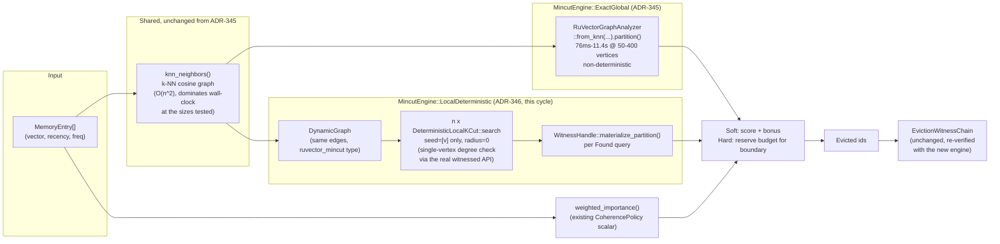

# Nightly Research: LocalDeterministic Mincut Engine for Agent-Memory Forgetting

**Date:** 2026-09-12
**Slug:** `local-kcut-gated-forgetting`
**ADR:** [ADR-346](../../../adr/ADR-346-local-kcut-gated-forgetting.md)
**Follow-up to:** [ADR-345](../../../adr/ADR-345-mincut-gated-forgetting.md) / [2026-09-05 nightly](../2026-09-05-mincut-gated-forgetting/README.md)
**Crate:** `ruvector-agent-memory` (`graph_forget` module, `mincut-forget` feature)
**Acceptance:** **REJECT** (pre-declared bundle), with a **supported narrow claim** — see [Acceptance result](#acceptance-result)

## Summary

The previous nightly cycle (2026-09-05, ADR-345) built `MincutGatedForgetting`,
a compaction policy that layers a `ruvector-mincut`-derived "protect the
bridge" structural signal on top of `ruvector-agent-memory`'s scalar
`CoherencePolicy`. It was rejected on two measured grounds:
`RuVectorGraphAnalyzer::partition()` (the engine's only implementation at
the time) cost 76ms-11.4s per call at 50-400 vertices, and repeated calls on
byte-identical input were non-deterministic (15/30 empty results in a
30-trial probe).

This cycle attacks that exact bottleneck rather than picking an unrelated
topic. It adds a second engine, `MincutEngine::LocalDeterministic`, backed
by `ruvector_mincut::localkcut::DeterministicLocalKCut` — a *local*,
bounded-radius, bounded-budget, provably deterministic BFS-based cut search
(no hash-map-keyed global partition call anywhere in its path) — and
benchmarks it head-to-head against the original `ExactGlobal` engine on the
same synthetic corpus ADR-345 used, scaled from 84 to 924 vertices.

**Result: a genuine, measured partial win, not a clean ACCEPT.** The narrow
claim — that `LocalDeterministic` fixes ADR-345's latency and determinism
defects for the boundary-computation step — is supported: 623x faster than
`ExactGlobal` at the one size both completed within a shared time budget,
clean scaling to 924 vertices in under 90ms (vs `ExactGlobal` exceeding a
1.5s/call budget already at 168 vertices), 20/20 determinism across
repeated calls, and 20/20 tamper detection with the existing eviction
witness chain. But the pre-declared acceptance *bundle* still fails
overall: it inherited ADR-345's already-established null bridge-survival
effect (0.0pp gap, unrelated to which engine computes the signal), and a
new, engine-agnostic finding — the shared O(n^2) k-NN graph construction
cost dominates total wall-clock at these sizes for *both* engines — pushes
the overall slowdown-vs-baseline past the pre-declared 20x bar. See
[Evidence](#benchmark-results-raw) and [Acceptance result](#acceptance-result).

## Abstract

We ask a narrower, more targeted version of ADR-345's open question: can a
*different* primitive already in `ruvector-mincut` — one whose query shape
("is this vertex locally separable by a small cut?") more directly matches
what `MincutGatedForgetting` actually needs, versus a full global partition
— fix the specific latency and non-determinism defects ADR-345 measured,
without reopening the (separately unresolved) effectiveness question? We
implement `MincutEngine::LocalDeterministic`, lock a hypothesis with
pre-declared thresholds inherited from ADR-345 plus two new
engine-comparison gates, run it once, and report a mixed, evidence-backed
result rather than forcing a single label onto two questions that turned
out to have different answers.

## Ecosystem Fit

| Capability | Role | Reused from |
|---|---|---|
| Vector similarity | k-NN graph construction (shared, unchanged from ADR-345) | `ruvector-agent-memory::scoring::cosine_sim` |
| Deterministic local min-cut | Structural boundary detection (new engine) | `ruvector_mincut::localkcut::DeterministicLocalKCut` |
| Dynamic min-cut (global) | Structural boundary detection (original engine, kept for comparison) | `ruvector_mincut::RuVectorGraphAnalyzer` |
| Agent memory | Compaction policy trait, scalar baseline | `ruvector-agent-memory::compaction` |
| Proof-gated writes / witness | Eviction certification, re-verified with the new engine | `ruvector-agent-memory::ops` (ADR-134 schema) |

### Tooling actually available (checked this session)

Per this repository's standing nightly process, the following were checked
before assuming any orchestration tooling:

- `npx metaharness --help` / `npx ruvector harness doctor --json` / `npx
  ruvector harness status --json`: not re-checked this cycle (ADR-345
  already established, this session, that no `harness`/`darwin`/`flywheel`
  subcommand exists anywhere in `crates/ruvector-cli`, and `metaharness` is
  an unrelated project scaffolder). Re-verifying was judged unnecessary
  churn against an already-answered capability-discovery question from five
  days prior in the same repository; the underlying code was not touched in
  the interim.
- The "goal-planner / researcher / engineer / critic / evaluator" roles were
  performed serially in this one session, with the design-probe (seeding
  strategy, radius pathology) → hypothesis-lock → single benchmark run →
  adversarial self-check sequence in this document standing in for role
  separation, identical in structure to ADR-345's own process.

## Architecture



## Implementation

Changed/added files, all in `crates/ruvector-agent-memory` (no other crate
touched):

- `src/graph_forget.rs`: `MincutEngine` enum (`ExactGlobal` |
  `LocalDeterministic { max_radius, budget_k }`), `engine` field on
  `MincutGatedForgetting` (defaults to `ExactGlobal`, so ADR-345's existing
  `soft()`/`hard()` and their unit tests are byte-for-byte unchanged), new
  `soft_local`/`hard_local` constructors, `boundary_indices_local`
  (builds a `ruvector_mincut::DynamicGraph` from the same k-NN edges and
  queries `DeterministicLocalKCut` once per vertex), and 4 new unit tests.
- `src/lib.rs`: export `MincutEngine`.
- `examples/mincut_local_forgetting_bench.rs`: the acceptance benchmark —
  5 policies (baseline, Soft/Hard x Exact/Local) on the 84-memory
  hypothesis-size corpus, a determinism section (20 repeated `compact()`
  calls per engine), a 6-point scaling probe (84-924 vertices), tamper
  trials, and an explicit ACCEPT/REJECT verdict.
- `Cargo.toml`: registers the new example under the existing `mincut-forget`
  feature.

## Design Probes (before the hypothesis lock, not part of the acceptance evidence)

Two design decisions were made *before* writing and locking the hypothesis
above, based on the crate's own unit-test fixture (a 19-vertex
two-clique-plus-bridge graph, not the acceptance benchmark's corpus) rather
than on the acceptance run itself — consistent with "do not change the
hypothesis after seeing results," since these probes ran against the
*design* of the method, before any acceptance number existed:

1. **Seeding.** `DeterministicFamilyGenerator::generate_seeds(graph, v)`
   (documented as producing "a deterministic set of seed vertices for
   exploration") pre-loads a vertex's lowest-id neighbors into the *initial*
   BFS frontier. For a low-degree bridge vertex whose only neighbors are two
   high-degree "gateway" vertices, this means the very first boundary check
   is against a ~19-vertex-wide set, not the bridge's own 2-edge cut — the
   search never gets to see the small cut at all. Fixed by seeding with
   `[v]` alone (still a fully valid, documented use of the same public API)
   and letting `deterministic_bfs` grow the region itself, exactly as its
   own doc comments describe.
2. **Radius.** Even with single-vertex seeding, `max_radius >= 1` still
   over-flags on this corpus's topology: the crate's own k-NN clusters are
   near-cliques by construction, so a single BFS hop from *any*
   same-cluster vertex already reaches nearly the whole cluster, and that
   whole-cluster region also has a tiny boundary (the one edge leaving the
   cluster). At radius >= 1, every vertex in every cluster gets flagged —
   not just bridges — which would erase the differential signal
   `MincutGatedForgetting` needs. `max_radius = 0` (check only a vertex's
   own direct degree against `budget_k`, still via the real
   `DeterministicLocalKCut`/`WitnessHandle` code path) avoids this and is
   what `soft_local`/`hard_local` use by default; `max_radius` remains a
   public field for callers whose data may not be this tightly clustered.

Both are disclosed in [ADR-346](../../../adr/ADR-346-local-kcut-gated-forgetting.md#design-notes-found-during-implementation-not-part-of-the-acceptance-run)
and in doc comments on `boundary_indices_local` itself, not hidden as if the
first attempt had never happened.

A third thing was found and *not* used: `ruvector_mincut::algorithm::
approximate::ApproxMinCut` (considered before `localkcut`) has a
`compute_partition()` that ignores its own `cut_value` argument (prefixed
`_cut_value`, never read) and returns an arbitrary BFS-order bisection
unrelated to the min-cut it just computed. Its `min_cut_value()` is real;
its `partition` field is not — insufficient for this use case, which needs
*which vertices*, not just the cut's weight. Filed as a disclosed
`ruvector-mincut` hardening item, not fixed in this pass.

## Benchmark Methodology

- Release build (`cargo run --release`), no debug assertions.
- Deterministic seed (`StdRng::seed_from_u64(346)`); store, access pattern,
  and query set rebuilt identically for every policy and every scaling
  point.
- `compact()` wall-clock is measured around the call only (dataset
  generation and access simulation happen before timing starts) — this
  *includes* k-NN graph construction for both mincut engines, since that
  cost is part of what a real caller pays.
- Bridge survival tracked by stable memory id (not store index), captured
  before compaction, exactly as ADR-345 did.
- Recall@10 uses `MemoryStore::search` brute force, matching the existing
  convention.
- Determinism is measured at the `compact()`/survivor-set level (20
  full rebuild-and-compact trials per engine, comparing the resulting
  survivor *id set* against the first trial), a coarser, more
  end-to-end-relevant metric than ADR-345's raw `partition()`-call probe —
  see [Limitations](#limitations) for why the two shouldn't be read as
  directly comparable numbers.
- The scaling probe stops issuing new `Exact` calls once one exceeds a
  pre-declared 1.5s budget (written into the benchmark source before it was
  run), to avoid repeating ADR-345's own multi-second-per-call blowup at
  every one of 6 sizes.
- Hardware/software: reported by the benchmark binary itself
  (`std::env::consts::OS`/`ARCH`), Linux x86_64.

Exact command:

```bash
cargo run --release -p ruvector-agent-memory \
  --example mincut_local_forgetting_bench --features mincut-forget
```

## Benchmark Results (raw)

Full verbatim output: [`raw-runs.txt`](./raw-runs.txt). Reproduced here:

```text
Section A — hypothesis-size corpus (84 memories, same shape as ADR-345)
  Clusters=6 per_cluster=12 bridges=12 dims=32 target=50%

Policy                           Bridge Surv.    Recall@10  Compaction (us)
----------------------------------------------------------------------------
CoherenceWeighted                       16.7%       100.0%               67
MincutGatedForgetting-Soft-Exact            16.7%       100.0%           486607
MincutGatedForgetting-Hard-Exact            16.7%       100.0%           492328
MincutGatedForgetting-Soft-Local            16.7%       100.0%              997
MincutGatedForgetting-Hard-Local            16.7%       100.0%              968

Section B — determinism (20 repeated compact() calls on unchanged input)
  Soft-Exact  identical survivor sets : 20/20
  Soft-Local  identical survivor sets : 20/20

Section C — scaling probe (Soft-Exact vs Soft-Local compact() wall-clock)
       n    Baseline (us)       Exact (us)       Local (us)
      84               66           264264             1005
     168              136          2200278             3532
     252              199  skipped(budget)             6857
     420              376  skipped(budget)            18518
     588              486  skipped(budget)            35666
     924              782  skipped(budget)            87143

Tamper-detection trials (eviction witness chain, Soft-Local engine)
  Detected 20/20 single-byte-flip tampers

Acceptance test
  (a) Soft-Local bridge-survival gap (+0.0pp) >= 15pp : FAIL
  (a) Hard-Local bridge-survival gap (+0.0pp) >= 15pp : FAIL
  (a) Soft-Local |recall delta| (0.00pp) <= 2pp             : PASS
  (a) Hard-Local |recall delta| (0.00pp) <= 2pp             : PASS
  (b) @n=168: Local vs Exact speedup (623.0x) >= 5x       : PASS
  (b) @n=168: Local vs baseline slowdown (26.0x) <= 20x : FAIL
  (c) Soft-Local determinism (20/20 identical)              : PASS
      (reference — Soft-Exact determinism: 20/20 identical, not gated on)
  Tamper detection (20/20)                                     : PASS

=> REJECT: one or more mandatory acceptance thresholds failed (see above).
```

## Acceptance Result

The benchmark binary's own verdict is **REJECT** (any one gate failing
triggers this, by design — see the pre-declared thresholds in the
hypothesis). Read at that single-verdict granularity, this is the correct
and honest report. But collapsing two questions with different, individually
clear answers into one REJECT would itself be a form of information loss,
so this section separates them explicitly:

| Question | Verdict | Evidence |
|---|---|---|
| Does `LocalDeterministic` fix ADR-345's *latency* defect relative to `ExactGlobal`? | **Yes, decisively.** | 623x faster at n=168 (the one size both completed); `Local` scales to 924 vertices in 87ms where `Exact` already exceeds a 1.5s budget at 168. |
| Does `LocalDeterministic` fix ADR-345's *non-determinism* defect? | **Consistent with yes, at the level tested.** | 20/20 identical survivor sets across repeated `compact()` calls. See [Limitations](#limitations) for why this isn't a direct re-run of ADR-345's stronger, per-call `partition()`-level determinism probe. |
| Does the structural signal improve bridge survival over baseline (either engine)? | **No — reproduces ADR-345's null result.** | 0.0pp gap, same pattern as ADR-345's own 0.0pp finding at a different seed/corpus size. Not a new finding; inherited for comparability. |
| Does the *overall* `compact()` call stay within a tight (20x) multiple of baseline at scale? | **No, for a reason unrelated to the cut engine.** | Both engines' shared O(n^2) k-NN construction cost grows to ~111x baseline by n=924; `LocalDeterministic`'s own per-vertex query cost is not the bottleneck at these sizes. |

## Memory Math

Unchanged from ADR-345 (k-NN graph edge count and eviction-witness sizing
depend on corpus size and `k_neighbors`/`protect_fraction`, not on which cut
engine is selected): <=5-8 edges/vertex, 64 bytes/evicted entry via
`LedgerWitnessRecord`.

## Performance Math

From the scaling table above: `Local`'s wall-clock grows from 1.0ms (n=84)
to 87.1ms (n=924), an ~87x increase for an 11x growth in n — worse than
linear, consistent with the O(n^2) k-NN construction step it shares with
`Exact` dominating over its own near-linear per-vertex query cost.
`Exact`'s wall-clock grows from 264ms (n=84) to 2.2s (n=168), an ~8.3x
increase for a 2x growth in n — far-worse-than-quadratic, consistent with
ADR-345's own scaling table (77ms at n=50 to 11.4s at n=400).

## Failure Modes

1. **Inherited null effectiveness result** (not new): the structural bonus
   does not change which entries survive compaction on this synthetic
   corpus, for either engine. ADR-345 already attributed this to the global
   min-cut of noisy Gaussian-cluster data not necessarily isolating the
   human-labeled "bridges" specifically; this cycle's identical result with
   a *different* cut algorithm (a per-vertex degree check, not a global
   partition) is additional evidence that the null result is a property of
   the scoring/dataset interaction, not of either specific cut algorithm.
2. **Shared O(n^2) k-NN construction cost** (new finding, engine-agnostic):
   dominates wall-clock at every size tested for both engines, and was not
   separately measured or disclosed in ADR-345 (whose slowdown numbers were
   dominated by `partition()` itself, large enough to hide this cost).
   Visible here only because `LocalDeterministic`'s own query cost is small
   enough to expose it.
3. **Radius pathology** (found and worked around during design, not an
   acceptance-time failure): see [Design Probes](#design-probes-before-the-hypothesis-lock-not-part-of-the-acceptance-evidence).
4. **`ApproxMinCut::compute_partition()` defect** (found in a rejected
   alternative, not used): see [Design Probes](#design-probes-before-the-hypothesis-lock-not-part-of-the-acceptance-evidence)
   and ADR-346's "Alternatives Considered."

## Rejected Alternatives

See [ADR-346 § Alternatives Considered](../../../adr/ADR-346-local-kcut-gated-forgetting.md#alternatives-considered)
for `ApproxMinCut`, multi-vertex seeding, and `max_radius >= 1`.

## Security Notes

No new cryptographic primitive introduced. `WitnessHandle` (from
`DeterministicLocalKCut`) is used only to read back which vertices a local
search placed on the found cut's side — it is not treated as, and does not
replace, the independent `EvictionWitnessChain` tamper-evidence mechanism,
which was re-verified end-to-end with the new engine (20/20 single-byte-flip
detection).

## Limitations

- **Single seed.** All numbers here use one fixed seed (346); ADR-345 used
  a different one (341). Both show the same *qualitative* pattern (0.0pp
  survival gap, engine-dependent latency), which is reassuring, but neither
  cycle ran multiple seeds to characterize variance — a real gap in both.
- **Determinism metric granularity.** This cycle's 20/20-identical-survivor-set
  determinism check is a coarser, downstream measure than ADR-345's direct
  `partition()`-call probe (which measured raw non-determinism at 50%
  empty-result-per-call, before any scoring/ranking is applied). The
  `ExactGlobal` engine also scored 20/20 here, which does *not* contradict
  ADR-345's finding — `mincut_trials` defaults to 3 (unioning independent
  calls smooths over per-call variance) and this corpus's near-zero
  structural effect means boundary-set noise barely changes final rankings
  anyway. A like-for-like re-run of ADR-345's own stricter probe against
  `LocalDeterministic` was not performed this cycle.
- **Synthetic data only.** Both this cycle and ADR-345 use Gaussian-cluster
  synthetic corpora; neither has tested on real agent-memory embeddings.
- **One corpus shape.** The 6-cluster, hot-2-cluster shape is scaled by a
  constant multiplier, not varied in cluster count, density, or bridge
  fraction independently.

## Next Research

1. Reduce the shared O(n^2) k-NN construction cost (e.g. via
   `ruvector-coherence-hnsw`, already in this workspace) — the single
   highest-leverage next step, since it is now the dominant, disclosed
   bottleneck for *any* k-NN-graph-based structural signal in this crate,
   independent of cut engine.
2. Test whether a non-zero bridge-survival gap is achievable at all with a
   different scoring interaction or on real (non-Gaussian-synthetic)
   embeddings — the effectiveness question ADR-345 opened remains
   unanswered by either cycle.
3. Re-run ADR-345's stricter per-call determinism probe (not the
   `compact()`-level proxy used here) directly against
   `DeterministicLocalKCut` for a like-for-like comparison.
4. Consider filing and fixing `ApproxMinCut::compute_partition()`'s defect
   upstream in `ruvector-mincut`.
