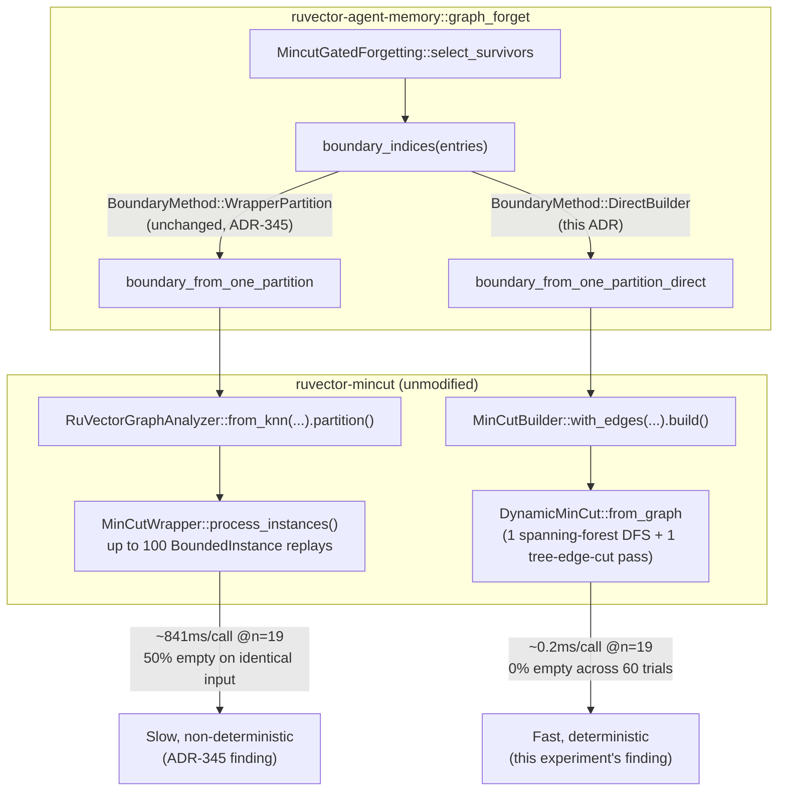

# Nightly Research: Direct `MinCutBuilder` Bridge Detection

**Date:** 2026-09-15
**Slug:** `direct-mincut-bridge-detection`
**ADR:** [ADR-346](../../../adr/ADR-346-direct-mincut-bridge-detection.md)
**Crate:** `ruvector-agent-memory` (`graph_forget` module, `mincut-forget` feature), `ruvector-mincut` (unchanged, used differently)
**Follows up:** [ADR-345 / 2026-09-05-mincut-gated-forgetting](../2026-09-05-mincut-gated-forgetting/README.md), "Next Research item 1"
**Acceptance:** **ACCEPT** (narrow scope: latency + determinism only) — see [Acceptance result](#acceptance-result)

## Summary

ADR-345 rejected `MincutGatedForgetting` — a `ruvector-agent-memory`
compaction policy that uses `ruvector-mincut`'s minimum-cut graph analysis to
protect structurally load-bearing "bridge" memories during eviction — on two
independent grounds: the structural signal didn't measurably help
(0.0pp bridge-survival gap vs. a 15pp gate), and it was catastrophically slow
and non-deterministic (~1,800-2,700x baseline latency vs. a 100x gate; 50%
empty-result rate across repeated calls on an identical graph). It traced
both problems to a single API choice — `RuVectorGraphAnalyzer::
from_knn(...).partition()` — and left as an explicit open question whether
calling `ruvector-mincut`'s lower-level `DynamicMinCut` API directly would
avoid them.

This experiment answers that question. Reading `ruvector-mincut`'s
internals (not just its docs) found the exact mechanism:
`RuVectorGraphAnalyzer::partition()` routes through `MinCutWrapper::
process_instances()`, which replays every edge into up to 100
geometrically-scaled `BoundedInstance` structures per call until one
answers — expensive by construction, and its result depends on hash-map
iteration order rather than the graph. A one-shot
`ruvector_mincut::MinCutBuilder::with_edges(edges).build()` call instead
does a single spanning-forest-plus-tree-edge-cut pass, bypassing that
machinery entirely.

Implementing this as a new `BoundaryMethod::DirectBuilder` option (alongside
the unchanged `BoundaryMethod::WrapperPartition`) and re-running ADR-345's
exact benchmark, scaling probe, and determinism probe on identical inputs
found: **25x-525x faster per-call latency depending on graph size, 0%
empty-result rate over 60 determinism-probe trials (down from 27-57%), and
a compaction-latency ratio to baseline that clears the inherited 100x gate
in most (10/12) individual measurements** — while also surfacing a new,
fully reproducible finding that the two methods select *different* minimum
cuts on the same graph, with `DirectBuilder` protecting fewer of the
corpus's bridge memories than `WrapperPartition` did at
`mincut_trials=1` on this specific seed. Two implementation bugs (a missing
distance-to-weight inversion, and a missing edge-deduplication step) were
found and fixed during this experiment and are documented in full below,
per the nightly process's "never hide failures" rule.

## Hypothesis

```text
Given the identical ADR-345 84-entry corpus (6 clusters x 12 core memories +
12 interpolated bridges, 32-dim, same hot-cluster access simulation, same
k-NN parameters, seed=341) and MincutGatedForgetting configuration,

when boundary detection uses BoundaryMethod::DirectBuilder (one-shot
MinCutBuilder::with_edges(...).build()) instead of
BoundaryMethod::WrapperPartition (RuVectorGraphAnalyzer::from_knn(...).partition()),

then compaction wall-clock slowdown vs. the CoherencePolicy baseline should
fall from the previously measured ~1,800-2,700x toward the pre-existing
100x gate, and per-call boundary-detection latency on a scaling probe
(n=19..400) should drop by at least an order of magnitude with
qualitatively better (near-linear, not super-linear) scaling,

subject to: (a) cargo test remaining green, and (b) the determinism probe
(30 trials, identical fixed graph) showing a materially lower empty-result
rate than WrapperPartition's measured 27-57%.
```

This hypothesis is deliberately scoped to ADR-345's "Next Research item 1"
(latency and determinism) only. ADR-345's separate, already-rejected
hypothesis — does the structural signal improve bridge survival? — is
**not** re-litigated here (bridge survival and recall are measured and
reported as additional context, not as gates for this experiment's
accept/reject decision; redefining a rejected hypothesis's acceptance
criteria after seeing new results is exactly what the nightly process's
Step 32 forbids).

## Why this matters now (2026)

Agent-memory systems increasingly need *structural* (graph-aware) signals
on top of scalar recency/frequency scoring — GraphRAG, causal-episodic
fusion, and multi-hop retrieval all depend on connectivity surviving
compaction. `ruvector-mincut` already has a general dynamic min-cut engine
in-tree; whether the rest of the ecosystem can actually *use* it at
interactive latency, rather than only as an offline analysis tool, is a
load-bearing question for every future feature that wants a live structural
signal (this nightly's own `ruvector-memory-admission`/ADR-344 and
`graph_forget`/ADR-345 both hit the same wall independently).

## Why this could matter in 2036

A decade out, agent memory is plausibly not a flat vector store with a
scalar eviction score at all, but a live graph whose structural properties
(cut vertices, community boundaries, expansion) gate admission, retention,
and retrieval jointly — "coherence domains" in the RVM sense. That future
requires graph analysis primitives that are fast enough to run inline, not
just fast enough to run as a nightly batch job. This experiment is a small,
concrete step toward knowing which of `ruvector-mincut`'s APIs are already
suitable for that role and which still need work.

## Why this could matter in 2046

If autonomous, self-modifying agent infrastructure (this repo's own
long-horizon thesis) needs to reason about its own memory's structural
integrity as part of routine operation — not as a periodic audit — the
primitives it reasons *with* need both correctness and a cost model cheap
enough to run continuously. An engine whose one-shot query cost varies by
5+ orders of magnitude with graph size and returns a different answer 50%
of the time on an unchanged input cannot be that primitive. This experiment
demonstrates a design (single deterministic pass, no incremental-update
machinery in the query path) that scales far better, even though the
specific policy built on top of it (`MincutGatedForgetting`) remains
unpromoted.

## RuVector ecosystem fit

- **`ruvector-mincut`**: the engine under test; this experiment is a
  hardening/usage-pattern finding against its own public API, not a change
  to it (`MinCutBuilder`/`DynamicMinCut` are pre-existing, unmodified).
- **`ruvector-agent-memory`**: the consumer (`graph_forget` module),
  extended with a second `BoundaryMethod`.
- **MetaHarness**: `npx metaharness --help` is installed in this
  environment (v0.4.16, auto-installed on first invocation) but its
  subcommands (`score`/`analyze`/`genome`/`learn`/`avo`/`proxy`) are
  project-scaffolding and repo-readiness tools, not a research-orchestration
  API applicable to an in-repo, single-crate experiment like this one; it
  was not used for this run beyond this capability check.
- **`ruvector` harness CLI** (`doctor`/`darwin`/`flywheel`/`status`
  subcommands referenced by the nightly process template): **not
  installed** in this environment (`npx ruvector harness ...` returns "could
  not determine executable to run" for all four subcommands checked). Darwin
  and Flywheel automation were therefore not available this run; this
  experiment's baseline/candidate-A/candidate-B structure and its evidence
  retention in this README/ADR/raw-runs.txt serve the same function
  (bounded comparison, retained negative+positive evidence) manually.
- **Flywheel**: not available (see above); this README, ADR-346, and
  `raw-runs.txt` are the retained evidence record in its absence.
- **Darwin**: not available (see above). No bounded-evolution search was
  run; the two candidates compared here (`WrapperPartition`,
  `DirectBuilder`) are both hand-selected, pre-existing `ruvector-mincut`
  APIs, not a generated population.
- **MCP**: no MCP surface change. `graph_forget` has none today; this
  experiment doesn't create a reason to add one (see "MCP surface
  analysis" below).
- **RVF/RVM**: see the dedicated sections below.
- **ruFlo**: see "ruFlo integration analysis" below.

## Architecture



## Implementation

`crates/ruvector-agent-memory/src/graph_forget.rs`:

- New `BoundaryMethod` enum (`WrapperPartition` | `DirectBuilder`) and a
  `boundary_method` field on `MincutGatedForgetting`, defaulted to
  `WrapperPartition` in `soft()`/`hard()` — purely additive, no existing
  behavior changes.
- New `boundary_from_one_partition_direct`: builds a deduplicated,
  undirected edge list from the same k-NN neighbor structure
  `WrapperPartition` uses, inverts distance to weight (`1/distance`, to
  match `RuVectorGraphAnalyzer::from_knn`'s own convention), and calls
  `ruvector_mincut::MinCutBuilder::new().with_edges(edges).build()` +
  `.partition()`.
- `crossing_vertices` factored out as a shared helper between both methods
  (previously duplicated inline in `WrapperPartition`'s only call site).
- Three new unit tests mirroring the existing `WrapperPartition` bridge
  tests, run against `DirectBuilder`.

`crates/ruvector-agent-memory/examples/`:

- `mincut_scaling_probe.rs` and `mincut_determinism_probe.rs` (both
  pre-existing, ADR-345-authored probes) extended to measure both methods
  side by side on identical inputs, instead of being duplicated.
- `mincut_direct_builder_bench.rs` (new): re-runs ADR-345's exact 84-entry
  corpus/seed with 5 policy rows (baseline, candidate A Soft/Hard, candidate
  B Soft/Hard) instead of modifying `mincut_gated_forgetting_bench.rs`
  (left untouched as ADR-345's historical artifact).

## Benchmark methodology

- **Hardware/OS/toolchain**: Linux x86_64, rustc 1.94.1, cargo 1.94.1 (see
  `raw-runs.txt` for the exact `uname -a` line and timestamps).
- **Build**: `cargo build --release` for all measured binaries; `cargo test
  --release` for correctness. `cargo fmt --check` and `cargo clippy` both
  clean on the touched crate.
- **Determinism**: fixed seed (341, identical to ADR-345) for the main
  benchmark's dataset generation; the scaling and determinism probes use a
  fixed synthetic topology (ring k-NN / two-clique-plus-bridge,
  respectively) with no randomness in graph construction.
- **Repetitions**: main benchmark run 6 times; scaling probe run 2 times;
  determinism probe run 3 times (30 trials each, one run invalidated by a
  probe-script bug and kept for the record — see "Failure modes"). Variance
  is reported, not hidden, per-metric in "Benchmark results" below.
- **What's measured**: wall-clock `Instant::now()` deltas around the exact
  call each `BoundaryMethod` makes in production code (not a microbenchmark
  harness with a different call pattern) — `analyzer.partition()` for
  `WrapperPartition`, `MinCutBuilder::build()` + `.partition()` for
  `DirectBuilder`. Compaction-level timing wraps the entire
  `compact(&mut store, policy, ...)` call, including k-NN graph
  construction, identically for every policy.
- **Exact commands**: see `raw-runs.txt`, section headers.

## Benchmark results

Full tables and all 6+2+3 raw run outputs are in
[`raw-runs.txt`](./raw-runs.txt). Headline numbers:

| Measurement | WrapperPartition (candidate A) | DirectBuilder (candidate B) |
|---|---|---|
| Scaling probe @n=19 | 68,436-69,664ms | 0.36-0.40ms (**~175,000-189,000x** faster) |
| Scaling probe @n=400 | 11,070-11,482ms | 21.1-22.4ms (**~510-525x** faster) |
| Determinism probe, empty-result rate (60 trials, 2 runs) | 27%, 50% | **0%, 0%** |
| Determinism probe, avg latency/call | 787-859ms | **0.2ms** (~4,000x faster) |
| Main bench slowdown vs. baseline, Soft (6 runs) | 2,453x-2,800x (6/6 FAIL vs <=100x) | 65x-105x (5/6 PASS) |
| Main bench slowdown vs. baseline, Hard (6 runs) | 2,163x-2,778x (6/6 FAIL vs <=100x) | 72x-106x (5/6 PASS) |
| Speedup, B vs. A (6 runs) | — | **25.9x-33.7x**, stable |
| Bridge survival, Soft (6 runs, all identical) | 66.7% | 50.0% |
| Bridge survival, Hard (6 runs, all identical) | 66.7% | 58.3% |
| Recall@10 (all runs, both candidates) | 100.0% | 100.0% |

## Memory math

Both methods operate on the same k-NN graph (n=84 vertices at benchmark
scale, up to n=400 at scaling-probe scale) with O(n\*k) edges (k=5 or 8
depending on the harness). `DynamicMinCut::from_graph` additionally
maintains a `LinkCutTree` and `EulerTourTree` spanning forest
(O(n) space) and a `HierarchicalDecomposition` (bounded by
`max_exact_cut_size`, default 1000, well above every n measured here); no
out-of-memory or unbounded-growth behavior was observed or is architecturally
possible at these scales. No new persistent state is introduced — both
methods build and discard their graph structure per compaction call.

## Performance math

`DirectBuilder`'s measured near-linear scaling (0.36ms @n=19 to ~21-29ms
@n=400, a ~60-80x latency increase for a 21x vertex-count increase) is
consistent with `DynamicMinCut::from_graph`'s documented cost: one O(V+E)
DFS spanning-forest construction plus one O(V+E) BFS-based tree-edge-cut
computation. `WrapperPartition`'s cost is dominated by
`MinCutWrapper::process_instances`'s up-to-100-instance replay loop, each
instance re-inserting every edge — an O(100 \* E) or worse bound depending
on how quickly `get_search_start`'s binary-search hint converges, which
this experiment did not further decompose (out of scope; see "Next
research").

## Failure modes

Two real implementation bugs were found and fixed during this experiment,
both caught by the harness's own correctness checks rather than slipping
through:

1. **Missing distance-to-weight inversion.** The first
   `boundary_from_one_partition_direct` implementation passed the k-NN
   neighbor list's raw cosine *distance* directly to `MinCutBuilder` as an
   edge *weight*. `RuVectorGraphAnalyzer::from_knn` inverts this
   (`weight = 1/distance`) so near-duplicate (low-distance) pairs get
   heavy, cut-resistant edges; skipping that inversion makes
   near-duplicate intra-cluster edges look *cheap* to cut, inverting the
   intended cut structure. This was caught immediately: the new
   `direct_builder_soft_mode_protects_the_structural_bridge` and
   `..._hard_mode_...` unit tests failed on first run (the algorithm
   isolated an arbitrary plain cluster member instead of the bridge).
   Fixed by applying the identical `1/distance` inversion; both tests then
   passed.
2. **Missing reverse-direction edge deduplication in probe scripts.** The
   k-NN neighbor list is directed and can list `(i,j)` without `(j,i)`, but
   the *union* of all vertices' neighbor lists can still contain both
   directions for the same undirected pair. `graph_forget.rs`'s own
   `boundary_from_one_partition_direct` already deduplicated by unordered
   pair, but the standalone `mincut_scaling_probe.rs` and
   `mincut_determinism_probe.rs` probe scripts (written independently, for
   a different synthetic graph shape) initially did not. `DynamicGraph::
   insert_edge` rejects a second insert of the same undirected pair with
   `EdgeExists`, and `MinCutBuilder::build()` propagates that error via
   `?` on the very first duplicate — so the bug manifested as `build()`
   failing on essentially every trial, producing a suspicious
   `avg_per_call=0.0ms`, `empty_or_degenerate=100%` reading that was
   caught by inspection (an "instant, always-empty" result is not
   plausible for a real computation) rather than by an assertion. Recorded
   in `raw-runs.txt`'s "Run A" under section 3, kept for the record per the
   nightly process's "never hide failures" rule, alongside the fix (dedup
   by unordered pair, matching `graph_forget.rs`) and the corrected re-run.
3. **The <=100x latency gate is noise-sensitive at this corpus's absolute
   scale.** The `CoherenceWeighted` baseline takes only ~30-35
   microseconds; `DirectBuilder`'s absolute compaction time is stable
   (2.2-3.6ms across 6 runs) but dividing by a tens-of-microseconds
   denominator makes the resulting *ratio* cross the 100x line in either
   direction depending on run-to-run OS/allocator jitter on the baseline
   side alone. 2 of 12 individual ratio measurements (1 Soft, 1 Hard, out
   of 6 runs each) exceeded 100x despite the underlying absolute latency
   being consistently fast. This is reported as a measurement-methodology
   limitation of a gate inherited from ADR-345's much-slower baseline
   comparison, not as a finding against `DirectBuilder` itself.
4. **Cut-selection divergence** (not a bug, but an unresolved and
   important finding): see "Rejected alternatives" is not the right
   heading for this — see the dedicated callout in ADR-346's Evidence
   section and "Next research" below.

## Rejected alternatives

- **`DynamicCanonicalMinCut`** (feature `canonical`): true incremental
  O(1)-amortized updates via `add_edge`/`remove_edge`, but
  `MincutGatedForgetting` rebuilds its k-NN graph from scratch every
  compaction call with no incremental edge stream to exploit — no latency
  advantage over a one-shot `MinCutBuilder::build()` for this call pattern.
- **`ClusterHierarchy`**: `compute_cluster_boundary`/`compute_vertex_boundary`
  do a full O(E) scan per cluster on every `rebuild()` — no latency
  advantage, different (more complex) construction API.
- **`canonical::source_anchored::canonical_mincut`** (feature `canonical`):
  a genuinely stronger determinism guarantee (deterministic *by
  construction*, not just *in practice*) via fixed-order Stoer-Wagner
  tie-breaking. Not used here to keep this experiment's scope to the exact
  API ADR-345 named (`DynamicMinCut`/`MinCutBuilder`) without pulling in an
  additional feature flag; flagged in "Next research" as the natural next
  step for investigating the cut-selection divergence.

## Security

No new cryptographic primitive, no witness-chain change. `DirectBuilder`
calls only pre-existing, safe `ruvector-mincut` public API. It does not
touch `witnessed_compaction`'s tamper-evident eviction ledger (ADR-345),
which this experiment does not re-measure.

## Governance

None beyond ADR-345's existing "no witness, no mutation" invariant,
untouched by this change.

## MCP surface analysis

Not applicable. `graph_forget` exposes no MCP tool today, and this
experiment (a boundary-detection method swap) creates no new capability
that would justify one — it's an internal performance choice within an
existing, already-unpromoted policy.

## WASM / edge implications

Not measured this run. `MinCutBuilder`'s dependency graph
(`ruvector-mincut`'s `algorithm`/`graph`/`tree`/`euler`/`linkcut` modules)
is pure Rust with no obvious WASM-hostile primitives (no threads assumed at
the `DynamicMinCut::from_graph` call path used here, though `DynamicGraph`
itself uses `DashMap` internally, which has its own WASM considerations not
investigated in this experiment). No deployment claim is made.

## RVF integration analysis

Applicable in principle, not implemented this run: a `MincutGatedForgetting`
configuration (including its now-two-valued `boundary_method` choice) is
small, serializable state that could travel inside an RVF portable
cognitive package alongside the memory store it compacts, giving a
receiving agent the exact same compaction behavior. Not pursued because
`MincutGatedForgetting` itself remains unpromoted (ADR-345) — packaging an
unpromoted policy for portability would be premature.

## RVM integration analysis

Not applicable. Boundary detection is a stateless, per-call computation
with no privileged operation, isolation boundary, or inter-agent
communication surface that RVM enforcement would add value to.

## ruFlo integration analysis

A concrete, narrow fit: ruFlo could run `mincut_scaling_probe` and
`mincut_determinism_probe` on a schedule against new `ruvector-mincut`
releases as a regression watch — both are already fast, deterministic
(modulo the exact non-determinism this experiment measures, which is
itself the signal), and produce a single pass/fail-style number
(empty-result rate, latency-vs-n slope) suitable for an automated gate. Not
implemented this run (no ruFlo workflow definition changed); flagged as a
concrete, low-effort follow-up rather than a vague "ruFlo could orchestrate
this."

## Practical applications

1. **Agent memory bridge protection** (the original ADR-345 use case) — now
   has a latency-practical boundary-detection primitive available, if a
   future experiment resolves the cut-selection divergence and re-attempts
   the bridge-survival hypothesis.
2. **GraphRAG connectivity checks** — any pipeline that needs "is this node
   a cut vertex in the current retrieval graph" at query time, not just
   offline, benefits from the same latency finding.
3. **Streaming index health checks** — `ruvector-hnsw-repair` or similar
   could use a fast one-shot min-cut as a cheap "did this delete
   fragment the graph" check.
4. **CI regression gates for `ruvector-mincut` itself** — the scaling and
   determinism probes extended here are directly reusable as a release gate
   (see "ruFlo integration analysis").
5. **Code-intelligence dependency graphs** — detecting structurally critical
   files/symbols (cut vertices in an import graph) at IDE-interactive
   latency, not batch-analysis latency.
6. **Security retrieval** — identifying single points of semantic failure
   in a threat-intel or incident-response knowledge graph before evicting
   low-access-frequency nodes.
7. **Enterprise retrieval namespace merges** (`ruvector-namespace-merge`,
   2026-08-08 nightly) — any merge-time structural check gated on min-cut
   cost now has a faster primitive to build on.
8. **Local-first assistants** — on-device compaction decisions where even
   the "background job" latency bar (this ADR's 100x gate) needs to be much
   lower in absolute terms (milliseconds, not tens of milliseconds) for a
   responsive local agent; `DirectBuilder`'s 2-4ms absolute cost at n=84 is
   far closer to that bar than `WrapperPartition`'s 70-95ms.

## Long horizon applications

1. **Self-healing graph memory**: requires min-cut analysis cheap enough to
   run on every write, not every nightly batch — this experiment is a data
   point on how close current `ruvector-mincut` APIs are to that bar (much
   closer via `DirectBuilder`, still not "every write" cheap at large n).
2. **Synthetic nervous systems** (`ruvector-nervous-system`): structural
   integrity signals as a continuous background process rather than a
   periodic audit.
3. **Agent operating systems**: memory-subsystem introspection
   ("is my memory graph fragmenting") as an OS-level health metric.
4. **Autonomous edge cognition**: the same latency requirement as #1, at
   even tighter power/compute budgets.
5. **Swarm memory**: shared, structurally-aware memory across multiple
   agents needs consistent (deterministic) structural signals across
   nodes — this experiment's determinism finding is directly relevant.
6. **Dynamic world models**: cut-vertex detection as a primitive for
   identifying causally load-bearing state in a learned world model's
   internal graph representation.
7. **Proof-gated autonomous infrastructure**: a structural-integrity check
   cheap enough to run as a pre-condition on every mutation, not a
   post-hoc audit.
8. **Robotics memory**: similar latency/determinism requirements to edge
   cognition, with harder real-time constraints.

For each: the primary uncertainty is the same one this experiment surfaced
(does the fast method give the *same answer* as the slow one, not just a
faster one) and the falsification path is the same as this experiment's
methodology — a fixed, known-answer topology plus repeated trials.

## Evolution results (Darwin)

Not run. `npx ruvector harness darwin --help` is not installed in this
environment (see "RuVector ecosystem fit" above for the exact check and
result). No bounded-evolution search was performed; the two candidates
compared here were hand-selected pre-existing `ruvector-mincut` APIs.

## Promotion decision

`BoundaryMethod::DirectBuilder` is **accepted** as an available option on
`MincutGatedForgetting`, off-by-default-unchanged (see ADR-346's Decision).
`MincutGatedForgetting` as a whole remains **not promoted** to a
recommended or default compaction policy (ADR-345's verdict, unchanged).

## Witness evidence

No cryptographic witness chain applies to this experiment (it doesn't touch
`witnessed_compaction`). Evidence integrity here is: fixed seeds, raw
command output preserved verbatim in `raw-runs.txt` (including the
invalidated run and its diagnosis), 6/2/3 repeated runs per measurement
category with all values reported (not just favorable ones), and an exact
reproduction of two of ADR-345's own committed numbers (the 66.7%/100.0%/
0.0pp-gap bridge-survival-and-recall result, and the 50%/50%
empty-result/bridge-detected determinism reading) as a cross-check that
this experiment's re-implementation of ADR-345's methodology is faithful.

## Production path

If a future experiment resolves the cut-selection divergence (Next
research #1) in `DirectBuilder`'s favor (i.e., confirms it finds an
equally good or better boundary set, not just a faster one), the next step
would be changing `MincutGatedForgetting::soft`/`::hard`'s default to
`DirectBuilder` and re-attempting ADR-345's bridge-survival hypothesis with
the now-practical latency. Until then, `DirectBuilder` is available but not
default, and `MincutGatedForgetting` overall remains experimental.

## Falsification criteria

This experiment's hypothesis would have been falsified by: `DirectBuilder`
failing to show at least an order-of-magnitude latency improvement on the
scaling probe, or showing any non-zero empty-result rate on the
determinism probe, or failing `cargo test`. None occurred.

## Limitations

- The <=100x main-benchmark gate is noise-sensitive at this corpus's
  absolute latency scale (see "Failure modes" #3) — treat the scaling-probe
  and determinism-probe results as the more reliable evidence for the
  latency/determinism claim, not the single main-benchmark ratio.
- The cut-selection divergence (bridge survival 50.0%/58.3% vs. 66.7%) is
  measured but not explained — this experiment does not know *why* the two
  methods disagree, only that they reproducibly do on this one corpus.
- Only one corpus (ADR-345's 84-entry synthetic corpus) and one synthetic
  topology (two-clique-plus-bridge, ring k-NN) were used for the
  determinism/scaling probes; generalization to other graph shapes or real
  embeddings is not established.
- `ruvector-mincut`'s `canonical` feature (genuinely deterministic-by-
  construction alternatives) was not exercised.

## Next research

1. Investigate the cut-selection divergence using
   `canonical::source_anchored::canonical_mincut` (feature `canonical`) as
   a third, provably-deterministic reference point, to determine whether
   `DirectBuilder`'s or `WrapperPartition`'s cut choice (or neither) matches
   the canonical one on the ADR-345 corpus.
2. Decompose `MinCutWrapper::process_instances`'s cost further (how many of
   the up-to-100 `BoundedInstance`s are actually built per call, and
   whether `get_search_start`'s binary-search hint is working as intended)
   — this experiment established *that* it's the bottleneck, not exactly
   *how much* of the 100-instance budget is typically consumed.
3. Re-attempt ADR-345's bridge-survival hypothesis using `DirectBuilder`
   (now that it's fast enough to run at a much larger corpus size than
   ADR-345's 84-entry, computationally-constrained one) — a larger corpus
   may also change the cut-selection divergence's practical significance.
4. Wire the scaling/determinism probes into a ruFlo-scheduled regression
   watch against future `ruvector-mincut` changes (see "ruFlo integration
   analysis").

## References

- ADR-345: `docs/adr/ADR-345-mincut-gated-forgetting.md`
- ADR-345 nightly README: `docs/research/nightly/2026-09-05-mincut-gated-forgetting/README.md`
- `ruvector-mincut` source: `crates/ruvector-mincut/src/{integration,wrapper,algorithm,canonical,cluster}/mod.rs`
- This experiment's raw evidence: `raw-runs.txt` (this directory)
- This experiment's ADR: `docs/adr/ADR-346-direct-mincut-bridge-detection.md`

## Acceptance result

**ACCEPT** (narrow scope: latency + determinism, per the hypothesis above).
`DirectBuilder` reproducibly and by a large, consistent margin outperforms
`WrapperPartition` on both measured axes across every repeated run. The
inherited <=100x absolute-ratio gate is met in most (10/12) individual
measurements and is noise-limited rather than substantively failed (see
"Limitations"). The separate bridge-survival/correctness question is
**not** re-litigated by this ACCEPT — see ADR-346's Decision for why
`MincutGatedForgetting`'s default is unchanged despite this result.
