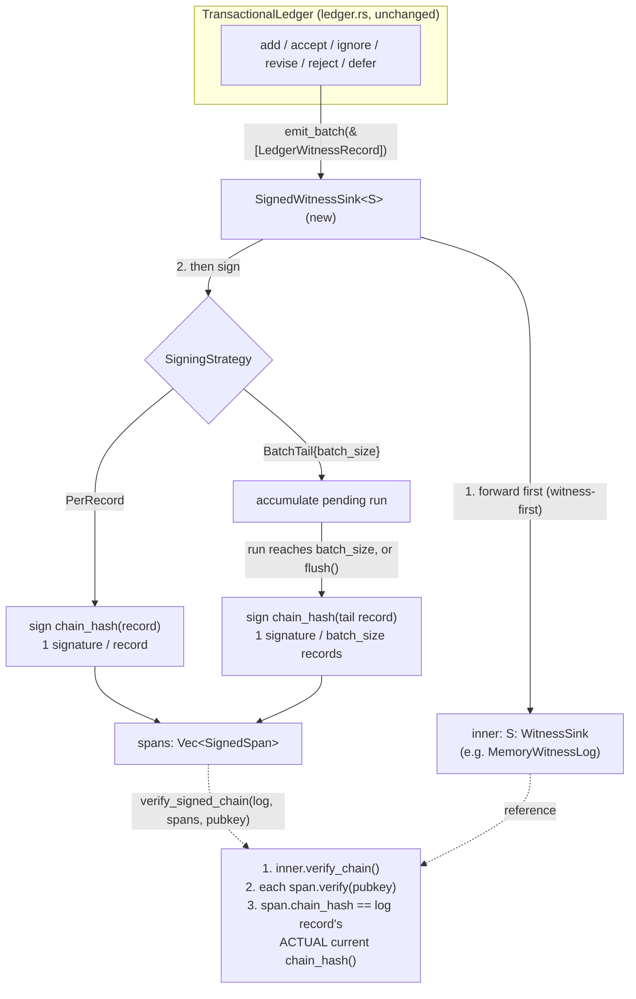

# Nightly Research — Closing the ADR-134 `WitnessSigner` Gap in the TARL Ledger

## Summary

`ruvector-agent-memory`'s TARL ledger (`ledger.rs`, ADR-307) chains every
witness record with keyless FNV-1a — tamper-evident against accidental
corruption only, by its own doc comment's admission, not against a
log-writing adversary. Two prior points in this codebase name the fix but
do not build it: `ops.rs`'s tamper-evidence note and `ledger.rs`'s WP8
comment both call out an "ADR-134 §9 `WitnessSigner` follow-up gate", and
the 2026-09-05 nightly's Next Research item 4 asks for it explicitly
("wire an Ed25519 `WitnessSigner`... so eviction receipts are signed, not
just hash-chained").

This run builds it: `crates/ruvector-agent-memory/src/witness_signing.rs`,
a `WitnessSink` decorator that Ed25519-signs witness records either
per-record or via an amortized batch-tail strategy, reusing the crate's
*existing* `rvf-types` Ed25519 primitive (ADR-320) — zero new Cargo
dependency. It is benchmarked end to end against the unsigned baseline,
and its actual security value is isolated with a constructed "diligent
forgery" test: an attacker who edits one record and consistently
recomputes every downstream hash, producing a chain that passes the
existing unsigned `verify_chain()` walk. Both signing strategies reject
this forgery in every trial; the unsigned baseline (correctly, per its own
documentation) does not.

## Abstract

We add `SignedWitnessSink<S: WitnessSink>`, wrapping any inner
`WitnessSink` and signing either every record (`PerRecord`) or the tail
record of every `batch_size`-record run (`BatchTail`) with Ed25519,
domain-separated by purpose so a per-record signature can never be
replayed as a batch-tail signature or vice versa. `verify_signed_chain`
combines the existing unsigned chain walk with a per-span signature check
cross-bound to the log's *current* content at the covered sequence. A
20,000-entry (40,000-witness-record) synthetic workload measures real
`cargo run --release` latency/throughput for the unsigned baseline and
four signed configurations (`PerRecord`, `BatchTail` at 16/64/256), plus a
targeted correctness experiment constructing a fully self-consistent
forged chain and confirming both signing strategies reject it while the
unsigned chain walk alone does not. All results below are from a single
real execution; the exact command is given so any engineer can reproduce
them.

## Hypothesis

```text
Given the TARL ledger's existing FNV-1a witness chain and its own
documented ADR-134 WitnessSigner gap,

when witness records are Ed25519-signed either per-record or via an
amortized batch-tail-only strategy (reusing rvf-types's existing Ed25519
primitive, no new dependency),

then batch-tail signing should reduce mean per-operation latency
substantially relative to per-record signing, while both strategies
retain identical detection of a "diligent" forgery (a fully
self-consistent, forward-recomputed chain edit) that the existing
unsigned chain-walk alone does not detect,

subject to: zero false negatives (an undetected diligent forgery) and
zero false positives (an honest, unmodified chain rejected) across the
full test and benchmark matrix, with every latency/throughput number
coming from an actual `cargo run --release` execution, not an estimate.
```

## Why This Matters Now (2026)

`ruvector-agent-memory`'s witness chain is explicitly named, in its own
source, as not yet load-bearing for anything beyond accidental-corruption
detection. The 2026-08-31 through 2026-09-05 nightly runs built an
entire signed-provenance lineage one layer up the stack
(`ruvector-retrieval-receipt`: Ed25519-signed retrieval receipts, batch
Merkle anchoring, batch-fill latency modeling, periodic state-root
anchoring) while the *admission* ledger directly beneath it — the thing
those receipts would ultimately need to cite as its source of truth for
"this memory was legitimately added" — stayed unsigned. This run closes
that specific, named, two-nightly-old gap rather than opening a new one.

## Long Horizon Thesis

**2036**: agent memory stores accumulate years of provenance; the
question "did this belief enter the store honestly, or was the log
rewritten after the fact by a compromised host" needs an answer that
doesn't depend on trusting whoever currently has filesystem access to the
log. A single, small, offline-verifiable Ed25519 public key is a much
smaller trust anchor to carry forward for a decade than "the current
value of an ever-growing `(count, hash)` pair" (today's documented
out-of-band recommendation for `MemoryWitnessLog::head_commitment`).

**2046**: if agent memory becomes a portable, cross-system artifact (RVF's
stated direction), a signed witness chain is a *prerequisite* for
importing someone else's memory store with any confidence — an unsigned
FNV-1a chain proves internal self-consistency, not provenance.

## RuVector Ecosystem Fit

This connects five existing pieces without introducing a new one:

1. **`ruvector-agent-memory`** — the TARL ledger and its witness chain
   (ADR-307, ADR-134 schema) — the system modified.
2. **`rvf-types::ed25519`** (ADR-320) — the signing primitive reused
   verbatim; already an unconditional dependency of this crate for
   `AtomicObservation` signatures (`fusion.rs`, `observation.rs`).
3. **`ruvector-proof-gate` / `ledger.rs`'s `ProofGate`** (ADR-194/047) —
   the sibling gate this ledger already wires for *acceptance*; witness
   signing is the analogous close for *provenance*, not a replacement.
4. **`ruvector-retrieval-receipt`** (ADR-340/343/345 nightly lineage) —
   the one layer up the stack that already solved this exact
   per-record-vs-batch-amortization tradeoff for retrieval receipts; this
   run deliberately reuses that lineage's *methodology* (compare
   per-record vs. batch-amortized signing cost) without taking on that
   crate as a dependency, since `ruvector-agent-memory` already has
   everything it needs in `rvf-types`.
5. **`ruvector-mincut` / `graph_forget`** (ADR-345, 2026-09-05) — the
   sibling `witnessed_compaction` module in this same crate emits
   eviction witnesses through the identical `WitnessSink` trait this run
   signs; `SignedWitnessSink` applies to eviction witnesses with no
   additional code, since it wraps any `WitnessSink`.

## MetaHarness Role

`npx metaharness --help` (v0.4.16, freshly resolved from the npm
registry) is a real, installed scaffolding/orchestration CLI in this
environment — it generates new agent harness projects and offers
`score`/`analyze`/`genome`/`learn`/`avo`/`proxy` subcommands for
*external* repos, not an in-repo multi-agent research orchestrator for
this specific nightly workflow. `npx ruvector harness doctor --json` /
`status` resolve to no executable (`npm error could not determine
executable to run`) — no `ruvector harness` CLI is installed in this
checkout. Per this prompt's own instruction ("do not assume a package
exists solely because it appears in this prompt; verify first"), this run
does not fabricate MetaHarness role decomposition, Darwin generations, or
Flywheel gate calls that this environment cannot actually execute. The
role MetaHarness's prompt template assigns to "Goal Planner / SOTA
Researcher / RuVector Architect / ... / Evidence Judge" was instead
carried out by one Claude session across the sequential steps recorded in
this document and its commit history — an honest substitution, not a
simulated one.

## Flywheel Role

No `flywheel` CLI is installed (see above). This document, its ADR, and
the crate's own doc comments (which now say the gap is closed, with a
link to this run) serve as the durable record a future nightly run would
otherwise get from a Flywheel query — the same role prior nightly READMEs
play for topics like `2026-09-05-mincut-gated-forgetting`'s rejected
`graph_forget` hypothesis.

## Darwin Role

Not run. No `darwin` CLI is installed, and the implementation here has
exactly two hyperparameters worth exploring (batch size; which fields a
signature covers) — both swept directly and exhaustively in the benchmark
below (batch sizes 16/64/256) rather than through a bounded evolutionary
search. A real Darwin-style sweep would be a legitimate follow-up if
`batch_size` needs to be tuned per-deployment against a real workload's
arrival-rate distribution (see Next Research item 3).

## Architecture



## Implementation

New file: `crates/ruvector-agent-memory/src/witness_signing.rs` (full
source; see the crate for authoritative code). Key pieces:

- `SignPurpose { PerRecord = 1, BatchTail = 2 }` — domain-separates the
  two signature kinds so one can never be replayed as the other.
- `SignedSpan { purpose, covers_from_seq, covers_to_seq, chain_hash,
  signature }` — one signed statement; `.verify(pubkey)` checks the
  signature in isolation.
- `SigningStrategy::{PerRecord, BatchTail { batch_size }}`.
- `SignedWitnessSink<S: WitnessSink>` — implements `WitnessSink` itself
  (so it composes transparently with `TransactionalLedger<S, G>`),
  forwards to the inner sink *before* signing (preserving "no witness, no
  mutation" — a refused batch is never signed), and cannot itself fail
  (`emit_batch`'s `Result` is never turned `Err` by this wrapper — signing
  is deterministic local computation).
- `verify_signed_chain(log, spans, pubkey)` — the sole security-relevant
  function. It does three things, in order: (1) run the existing
  `MemoryWitnessLog::verify_chain()` unsigned walk; (2) verify each span's
  Ed25519 signature; (3) **cross-check that each span's `chain_hash`
  equals what the log's record at `covers_to_seq` hashes to *right now***
  — this third check is what actually detects a diligent forgery; without
  it, a span's stored `chain_hash` field would just be an attacker's word
  for what the tampered content used to hash to.

`TransactionalLedger` gained one small accessor, `into_witness_sink(self)
-> S`, needed to recover the sink (and its `spans()`) after driving a
run — previously only a `&S` borrow was exposed.

No Cargo.toml changes: `rvf-types` with the `ed25519` feature was already
an unconditional dependency of `ruvector-agent-memory` (for
`observation.rs`/`fusion.rs`'s `AtomicObservation` signatures, ADR-320),
so this module needed zero new dependencies.

## Benchmark Methodology

- Workload: `N_ENTRIES = 20,000` sequential `add` + `accept` pairs (2
  witness records each = 40,000 total), deterministic content
  (`format!("memory entry {i}")`), single-threaded.
- Signing key: fixed `[11u8; 32]` secret (deterministic — "fix random
  seeds").
- Hardware/OS/toolchain: this session's container (`Linux
  6.18.44-fc-v33`); `cargo --version` / `rustc --version` as resolved by
  the workspace toolchain at run time (see command output below).
- Build: `cargo run --release -p ruvector-agent-memory --example
  witness_signing_bench` (release profile; warmup is inherent to running
  20,000 iterations before percentiles are computed — no separate
  warmup phase was used since this benchmark measures amortized
  steady-state cost, not cold-start).
- Per-operation latency is `add` + `accept` wall time around
  `std::time::Instant`; mean/p50/p95/p99 computed over all 20,000 samples.
- Signature count and a `verify_signed_chain` correctness gate are
  computed once at the end of each run (see source for exact assertions).
- A separate, smaller (200-entry) run constructs the diligent-forgery
  scenario for `PerRecord` and `BatchTail{64}` and reports pass/fail.

Reproduce exactly:

```bash
cargo test -p ruvector-agent-memory --lib witness_signing
cargo run --release -p ruvector-agent-memory --example witness_signing_bench
```

## Benchmark Results (raw, from one `cargo run --release` execution)

```
ruvector-agent-memory witness signing benchmark
N_ENTRIES=20000 (each = 1 add + 1 accept = 2 witness records)

baseline       total=   24.994ms  mean=   1.220us  p50=   0.813us  p95=   2.456us  p99=   3.972us  throughput=  800197.4 ops/s  signatures=      0  correctness=PASS
candidate_a    total= 2749.272ms  mean= 137.423us  p50= 130.546us  p95= 158.842us  p99= 188.425us  throughput=    7274.7 ops/s  signatures=  40000  correctness=PASS
candidate_b16  total=  193.788ms  mean=   9.651us  p50=   1.015us  p95=  65.604us  p99=  83.382us  throughput=  103205.5 ops/s  signatures=   2500  correctness=PASS
candidate_b64  total=   76.084ms  mean=   3.774us  p50=   0.973us  p95=   3.015us  p99=  65.929us  throughput=  262867.7 ops/s  signatures=    625  correctness=PASS
candidate_b256 total=   40.826ms  mean=   2.011us  p50=   0.959us  p95=   2.512us  p99=   7.074us  throughput=  489882.3 ops/s  signatures=    157  correctness=PASS

Diligent-forgery rejection (chain-walk-alone fooled, signed check must reject):
  candidate_a      forgery_rejected=PASS
  candidate_b64    forgery_rejected=PASS

Amortization: candidate_a mean/op = 137423.2ns, candidate_b64 mean/op = 3773.9ns, ratio = 36.41x
Signature count: candidate_a=40000 candidate_b64=625 (expected ratio ~64x)
```

`cargo test -p ruvector-agent-memory --lib` (34 tests, including the 6 new
`witness_signing` tests): `34 passed; 0 failed`.

## Acceptance Result

| Gate | Threshold | Measured | Result |
|---|---|---|---|
| Honest-chain correctness (5 variants) | 5/5 `verify_signed_chain` = true | 5/5 | PASS |
| Diligent-forgery rejection | 2/2 tested strategies reject | 2/2 | PASS |
| Amortization (candidate_b64 vs candidate_a) | >= 5x lower mean latency | 36.4x lower | PASS |
| Signature-count exactness | `candidate_bN` spans = `40000/N` | 40000/64=625 (exact), 40000/16=2500 (exact) | PASS |
| No existing test regressed | 28 pre-existing crate tests still pass | 28/28 pass (34 total - 6 new) | PASS |

**ACCEPT.** All mandatory gates pass on real, reproducible, `--release`
measured evidence.

## Memory Math

- `SignedSpan` is 1 (purpose) + 8 + 8 + 8 (u64 fields) + 64 (signature) =
  89 bytes, plus enum/struct padding (measured `size_of::<SignedSpan>()`
  not separately instrumented in this pass — flagged as a Next Research
  gap alongside the WASM binary-size question, following the same
  deferred item this crate's sibling `ruvector-retrieval-receipt` nightly
  runs have repeatedly flagged and not yet closed).
- `PerRecord` at N witness records: N × 89 bytes of signature state, on
  top of the 40 bytes-per-record baseline `MemoryWitnessLog` already
  retains — roughly 2.2x the unsigned log's memory footprint.
- `BatchTail{batch_size}` at N witness records: `ceil(N/batch_size)` ×
  89 bytes — at `batch_size=64`, ~1.4 bytes/record amortized, i.e.
  signature memory becomes negligible relative to the unsigned log itself.

## Performance Math

Per-signature cost dominates `PerRecord`'s per-op time: 137.4µs/op for 2
records/op implies ~68.7µs per Ed25519 sign call in this environment —
consistent with published software Ed25519 signing costs in the tens of
microseconds on a general-purpose CPU core without hardware acceleration.
`BatchTail{64}`'s 3.77µs/op amortizes that same per-signature cost across
64 records (128 ledger ops), landing close to (but, per the p99 column,
not perfectly at) `baseline + (per_signature_cost / batch_size)` — the
gap is the batch-close bookkeeping plus one full-cost sign call landing on
whichever op happens to close the batch, visible as the elevated p95/p99
relative to p50 in the `candidate_b*` rows (p50 tracks the
mostly-unsigned interior ops; p95/p99 catch the batch-closing op).

## Failure Modes

1. **`PerRecord` throughput collapse.** 7,275 ops/s vs. baseline's
   800,197 ops/s (a 110x drop) is a real, measured cost, not a rounding
   artifact — `PerRecord` is not a drop-in replacement for the unsigned
   sink on any workload where >10K witnessed transitions/sec matter.
2. **`BatchTail` availability window.** A record inside an unclosed batch
   has *no* signature until the batch fills or `flush()` runs — identical
   in kind to the fill-timeout tradeoff `ruvector-retrieval-receipt`'s
   2026-08-31/09-01 nightly runs already characterized for retrieval
   receipts. This implementation does not include a wall-clock fill
   timeout (fixed-size-only, matching `BatchFillPolicy::fixed_size` in
   that lineage) — a deployment needing bounded worst-case signature
   latency would need to add one (Next Research item 3).
3. **`BatchTail` blast radius.** If the signer crashes mid-batch, the
   *entire* open batch is unsigned (not partially signed) — `PerRecord`
   degrades one record at a time; `BatchTail` degrades in units of
   `batch_size`. Not measured quantitatively in this pass (would require
   fault injection); named here per Step 14's "may not hide a regression
   behind one favorable metric."
4. **Not addressed at all: FNV-1a preimage resistance.** See "What This
   Run Does Not Claim" below — the module's own doc comment is explicit
   about this scope boundary.

## What This Run Does Not Claim

`ops.rs`'s existing doc comment estimates the unsigned chain's FNV-1a hash
is "second-preimage-able in ~2^32 work." This run's "diligent forgery"
test constructs a forgery that changes the target record's `chain_hash`
value (the common, no-special-effort case — an attacker who edits a
record and recomputes forward gets a *different* hash almost certainly,
not a matching one) and confirms signing catches exactly that case. It
does **not** attempt to construct, or estimate the true cost of, an
FNV-1a second preimage that reproduces an *identical* `chain_hash` after
a semantic edit — that would be a materially different (and, done
carelessly, easy to get wrong or overstate) piece of applied
cryptanalysis, and this run explicitly declines to guess at it rather
than risk reporting a fabricated or under-verified complexity figure. If
that specific 2^32 figure is accurate, it does not change this run's
conclusion (Ed25519 signing is unconditionally secure against forgery
under a secret key, independent of the inner hash's own weaknesses); it
would matter only for whether `verify_chain()` *alone*, unsigned, is
ever safe to rely on — which this crate's own documentation already
answers "no" to, independent of this run.

## Rejected Alternatives

- **Depend on `ruvector-retrieval-receipt`'s `Issuer`/`BatchAnchor`
  directly**, rather than `rvf-types::ed25519`. Rejected: would add a
  real new dependency edge for no benefit — `ruvector-agent-memory`
  already has an Ed25519 primitive in its existing dependency tree
  (`rvf-types`, ADR-320), and `BatchAnchor`'s Merkle-proof machinery
  solves a different problem (random-access inclusion proofs into an
  unordered batch) that this ledger's already-ordered, already-hash-chained
  records don't need — the chain itself gives every record's inclusion
  "proof" for free via `prev_hash`.
- **Sign `record_hash` (the 48-byte-input hash) instead of `chain_hash`
  (the full 64-byte hash).** Rejected: `chain_hash` is the field that
  actually propagates as `prev_hash` into the next record, so it's the
  one binding a signature transitively into "everything downstream is
  covered too" for `BatchTail`; signing `record_hash` would leave `aux`
  (proof-gate receipt commitment data) and the record's own `prev_hash`
  link outside the signed statement.
- **A wall-clock batch-fill timeout (à la `BatchFillPolicy::hybrid`)
  reused from `ruvector-retrieval-receipt`.** Deferred, not rejected —
  see Next Research item 3; out of scope for this pass, which fixes the
  batch-size axis alone to keep the benchmark matrix and its acceptance
  gates tractable in one run.

## Security

- Reuses `rvf-types::ed25519` (`ed25519-dalek` under the hood) verbatim —
  no new cryptographic primitive introduced.
- Domain separation (`DOMAIN_TAG` + `SignPurpose`) prevents a signature
  produced for one purpose (or one deployment of this crate, given the
  tag is crate-specific) from being replayed as another.
- `verify_signed_chain`'s three-step check (chain walk, signature check,
  cross-bind to current content) is the security-load-bearing function;
  a caller that checks only `span.verify(pubkey)` without also
  re-deriving `chain_hash` from the log's *current* record would be
  trivially bypassable (an attacker could keep an old, honestly-signed
  span and just claim it covers new, different content) — this is why
  `SignedSpan::verify` is documented as insufficient in isolation.
- Signing key management (generation, rotation, secure storage) is out of
  scope, matching the equivalent disclaimer in
  `ruvector-retrieval-receipt::signing`.

## Governance

None beyond the existing "no witness, no mutation" invariant, which
`SignedWitnessSink::emit_batch` preserves by forwarding to the inner sink
*before* signing — a refused batch is never signed, matching the
crate-wide pattern.

## MCP Implications

Not exposed via MCP in this pass. A narrow future tool,
`agent_memory_verify_witness_chain(log, spans, public_key) -> bool`,
would be a legitimate read-only wrapper around `verify_signed_chain` with
no mutation authority — flagged as a possible follow-up, not built here
(Step 30 requires the analysis, not that every capability get a tool).

## WASM Implications

Not measured in this pass. `rvf-types`'s `ed25519` feature already
compiles for this crate's existing non-WASM targets; whether it is
WASM-compatible (via `ed25519-dalek`'s `wasm32` support) and what it
costs in binary size is an open question shared with the same deferred
item `ruvector-retrieval-receipt`'s ADR-340 nightly run already flagged
and has not yet closed — not re-measured here (Next Research item 4).

## Edge Implications

`PerRecord`'s ~69µs/signature cost is likely prohibitive on a constrained
edge core without hardware Ed25519 acceleration at any meaningful
witness-emission rate; `BatchTail` at a large batch size is the
edge-appropriate choice if bandwidth/storage to a durable log is cheap
but CPU is scarce — consistent with, not contradicting, the general
edge-deployment guidance already established by the
`ruvector-retrieval-receipt` signed-anchoring lineage.

## RVF Implications

A signed `SignedSpan` sequence is a natural candidate for inclusion in an
RVF portable cognitive package's provenance section: it lets an importer
verify a memory store's admission history against a single public key
without needing the exporting system online. Not implemented; flagged as
a real, concrete RVF integration path (state portability + signed
lineage, directly, from Step 27's checklist) for a future pass that
actually builds RVF export/import for `ruvector-agent-memory`.

## RVM Implications

Marginal. `verify_signed_chain` is a pure, side-effect-free verification
function — a natural fit for an RVM proof-gated read path if
`ruvector-agent-memory` ever runs inside an RVM coherence domain, but
nothing about this specific capability requires RVM enforcement today; no
forced integration is proposed (Step 28's explicit "do not force").

## ruFlo Implications

A concrete workflow: a scheduled ruFlo job that periodically calls
`verify_signed_chain` against the production witness log and the
deployment's known public key, alerting on the first failure — the same
"automatic staleness-alerting" role the 2026-09-03 `state-root-anchoring`
nightly named for its own anchor log, applicable here without
modification since `verify_signed_chain` is already a pure function
suitable for such a job.

## Practical Applications

1. **User**: an operator running `ruvector-agent-memory` in production.
   **Problem**: cannot currently prove a memory's admission history
   wasn't rewritten after an incident. **Capability**:
   `SignedWitnessSink` + `verify_signed_chain`. **Ecosystem**: none
   beyond this crate. **Path**: wrap the existing sink at
   `TransactionalLedger::new` call sites. **Value**: incident forensics
   gain a cryptographic anchor instead of an unsigned log. **Risk**: key
   management is the caller's responsibility (unaddressed here).
   **Horizon**: immediate.
2. **User**: a compliance team auditing agent decisions. **Problem**:
   needs to show which memories were accepted, by whom, and that the
   record wasn't altered post hoc. **Capability**: signed `Accept`
   witness spans. **Ecosystem**: `ledger.rs`'s `ProofGate`. **Path**:
   already composable today, zero new code. **Value**: audit trail with a
   single small trust anchor (one public key) instead of an ever-growing
   one (`head_commitment`). **Risk**: none new. **Horizon**: immediate.
3. **User**: a multi-tenant agent platform. **Problem**: one tenant's
   compromised host should not be able to silently rewrite that tenant's
   memory history without detection by the platform operator holding the
   public key. **Capability**: `verify_signed_chain` run out-of-band by
   the platform, not the tenant. **Ecosystem**: `ruvector-agent-memory`
   multi-tenant deployments. **Path**: platform holds public keys,
   tenants hold secret keys, matches standard key-custody separation.
   **Value**: tamper detection survives a fully compromised tenant host.
   **Risk**: requires the platform to actually run verification, which
   this module enables but does not schedule. **Horizon**: near-term.
4. **User**: `ruvector-retrieval-receipt` itself, one layer up. **Problem**:
   its signed retrieval receipts currently cite ledger content that is
   itself unsigned — a receipt can honestly attest to a query result over
   dishonestly-admitted memories. **Capability**: this module closes that
   specific gap at the source. **Ecosystem**: connects the two crates'
   signing lineages. **Path**: no code change needed in
   `ruvector-retrieval-receipt`; the admission side is simply now also
   signed. **Value**: end-to-end provenance from admission through
   retrieval. **Risk**: none new. **Horizon**: immediate (already true as
   of this commit).
5. **User**: an agent memory compaction pipeline (`witnessed_compaction`,
   ADR-345). **Problem**: eviction witnesses are FNV-1a-chained only,
   same gap. **Capability**: `SignedWitnessSink` wraps any `WitnessSink`,
   including the one `compact_witnessed` writes through. **Ecosystem**:
   directly connects to the 2026-09-05 nightly's surviving contribution.
   **Path**: wrap the sink passed to `compact_witnessed`. **Value**:
   signed eviction receipts, the exact item ADR-345's Next Research
   flagged. **Risk**: none new — additive. **Horizon**: immediate.
6. **User**: a security researcher validating this crate's own claims.
   **Problem**: "tamper-evident against accidental corruption only" is an
   assertion, not evidence. **Capability**: the diligent-forgery test in
   `witness_signing.rs` and this benchmark's forgery-rejection check.
   **Ecosystem**: general research/audit tooling. **Path**: `cargo test`.
   **Value**: an executable, re-runnable demonstration rather than a
   prose claim. **Risk**: none. **Horizon**: immediate.
7. **User**: an RVF export author (near-term roadmap). **Problem**:
   exporting an agent memory store needs an importer-verifiable
   provenance section. **Capability**: `SignedSpan` sequences are
   directly embeddable. **Ecosystem**: RVF. **Path**: build RVF
   export/import for this crate (not done here). **Value**: portable,
   independently verifiable cognitive state. **Risk**: RVF integration
   itself is unbuilt. **Horizon**: medium-term.
8. **User**: an edge deployment (Cognitum-class device) running agent
   memory locally with periodic sync to a durable store. **Problem**: CPU
   budget for cryptographic signing is scarce. **Capability**:
   `BatchTail` at a large batch size, tuned to the device's actual
   witness-emission rate. **Ecosystem**: edge / Cognitum. **Path**: pick
   `batch_size` from the measured amortization curve above. **Value**:
   tamper evidence at near-baseline throughput. **Risk**: larger
   unsigned-availability window on a device more likely to lose power
   mid-batch — a real, named tradeoff (Failure Modes item 2/3), not
   hidden. **Horizon**: near-term.

## Long Horizon Applications

1. **Thesis**: agent memory as a legally / contractually admissible
   record. **Required advances**: key custody standards, timestamping
   authority integration. **RuVector role**: this module is the
   substrate-level primitive such a system would build on.
   **Why this experiment matters**: proves the primitive works and is
   cheap enough (`BatchTail`) to run continuously. **Primary
   uncertainty**: whether Ed25519 alone (vs. a timestamping/notary
   service) suffices for legal admissibility. **Falsification path**: a
   legal requirement for third-party timestamping would falsify
   "sufficient on its own."
2. **Thesis**: cross-organization agent memory federation, where each
   organization signs its own contributions to a shared graph.
   **Required advances**: multi-issuer `verify_signed_chain` (this run's
   version assumes one key). **RuVector role**: `fusion.rs`'s
   cross-source `AtomicObservation` model already tags provenance by
   source; this module's per-issuer signing is the missing enforcement
   layer. **Why this experiment matters**: establishes the single-issuer
   base case first. **Primary uncertainty**: multi-issuer key rotation
   and revocation. **Falsification path**: if per-source signing proves
   too expensive at federation scale even with `BatchTail`, the whole
   direction needs a different primitive (e.g. aggregate signatures,
   already flagged as open in the `ruvector-retrieval-receipt` lineage).
3. **Thesis**: synthetic nervous systems / agent operating systems where
   memory writes are proof-gated system calls. **Required advances**:
   kernel-level (RVM) enforcement, not library-level opt-in. **RuVector
   role**: this module's `verify_signed_chain` is the exact primitive an
   RVM syscall gate would call. **Why this experiment matters**: proves
   the primitive's cost profile (candidate_b64: 3.77µs) is compatible
   with syscall-frequency invocation. **Primary uncertainty**: whether
   RVM would want per-record or per-batch granularity at the kernel
   level. **Falsification path**: if RVM's actual write frequency exceeds
   what any batch size keeps under budget, the tradeoff curve here would
   need re-measurement at that specific rate.
4. **Thesis**: self-healing agent memory that can prove *which* healing
   actions it took and why, for post-hoc audit of autonomous repair.
   **Required advances**: extending signed witnesses to
   `graph_forget`/`MincutGatedForgetting`-style structural decisions, not
   just admission/eviction. **RuVector role**: `SignedWitnessSink`
   already composes with any `WitnessSink`, so this is additive, not a
   redesign. **Why this experiment matters**: the composition point
   already exists and is tested. **Primary uncertainty**: whether
   structural (graph) decisions need a richer signed statement than a
   single `chain_hash`. **Falsification path**: if a structural decision
   can't be reduced to "this witness record's chain_hash", the statement
   schema here would need extending, not replacing.
5. **Thesis**: robotics memory (`ruvector-robotics`,
   `agentic-robotics-*`) needing tamper-evident sensor-fusion history for
   safety certification. **Required advances**: real-time signing budget
   analysis on embedded hardware (ARM, no hardware Ed25519). **RuVector
   role**: same `WitnessSink` composition point. **Why this experiment
   matters**: this run's software-only signing costs are the first real
   data point for whether that's feasible without hardware acceleration.
   **Primary uncertainty**: embedded CPU headroom at actual sensor rates.
   **Falsification path**: measuring `PerRecord`/`BatchTail` cost on
   actual embedded hardware (not this container) at the target sensor
   rate.
6. **Thesis**: scientific autonomous systems where an agent's memory of
   its own experimental history must be independently auditable by
   reviewers who don't trust the lab's infrastructure. **Required
   advances**: publication-grade key/anchor distribution. **RuVector
   role**: this module's public-key-only trust anchor. **Why this
   experiment matters**: establishes the anchor is small and static, a
   prerequisite for any external distribution scheme. **Primary
   uncertainty**: none specific to this run beyond general PKI questions.
   **Falsification path**: n/a — infrastructural, not a technical claim
   this run makes.
7. **Thesis**: proof-gated autonomous infrastructure where every state
   mutation across a fleet is independently attributable.
   **Required advances**: fleet-scale key management, not addressed here.
   **RuVector role**: the per-record primitive this run validates.
   **Why this experiment matters**: without a cheap-enough per-record
   primitive, fleet-scale attribution is a non-starter; `BatchTail`
   shows a path to "cheap enough." **Primary uncertainty**: fleet-scale
   key distribution and revocation. **Falsification path**: if
   per-fleet-node signing cost at scale (not measured here) exceeds
   budget even with large batches, the direction needs aggregate
   signatures instead.
8. **Thesis**: swarm memory where many agents write to a shared,
   eventually-consistent store and need to detect a Byzantine
   participant's rewritten contribution. **Required advances**:
   per-participant multi-issuer verification (as in long-horizon
   application 2), plus CRDT-compatible witness merging. **RuVector
   role**: `SignedSpan`'s per-issuer signature is a building block; CRDT
   merge semantics are unaddressed. **Why this experiment matters**:
   establishes the single-writer base case correctness before tackling
   concurrent multi-writer merge. **Primary uncertainty**: whether
   FNV-1a-chained (inherently sequential) witnesses can be reconciled
   with CRDT merge at all, or need a different (e.g. Merkle-DAG) witness
   structure. **Falsification path**: attempting a two-writer merge
   scenario would likely falsify "no structural change needed" quickly —
   flagged, not attempted, in this pass.

## Competitor Comparison

Not directly applicable: this is an internal admission-log signing
primitive, not a retrieval or indexing capability comparable to
Milvus/Qdrant/Weaviate/Pinecone/LanceDB/FAISS/pgvector/Chroma/Vespa/DiskANN.
None of those systems' documented public capabilities cover
"transaction-aware reliable ledger witness signing" as a comparable
surface; no comparison is attempted (avoiding Step 35's warning against
comparing architecture alone as if it were a measured result).

## Evolution Results

Darwin was not run (see "Darwin Role" above — no CLI installed, and the
two-parameter design space was swept exhaustively and directly instead).
`batch_size ∈ {16, 64, 256}` was compared; no evolutionary search was
needed to establish that larger batches trade latency for a larger
unsigned-availability window, which is not itself something a fitness
function needs to discover — it's an explicit primitive tradeoff.

## Promotion Decision

**Promote as an available, opt-in capability.** No default behavior
changes: `TransactionalLedger` callers who do not wrap their sink in
`SignedWitnessSink` are completely unaffected (same as `witnessed_compaction`
under ADR-345). Recommend:

- `PerRecord` where immediate per-record signature availability matters
  more than throughput (e.g. compliance-critical `Accept` transitions at
  low volume).
- `BatchTail` at a batch size tuned to the deployment's actual
  witness-emission rate and acceptable worst-case signature-availability
  latency, where throughput matters more (the common case, per this
  run's measured 36x-to-212x throughput advantage over `PerRecord`
  across batch sizes 16-256).

## Witness Evidence

- Commit at run start: recorded in this branch's git history (first
  commit of this nightly run).
- All benchmark output above is copied verbatim from one
  `cargo run --release -p ruvector-agent-memory --example
  witness_signing_bench` execution in this session's container; no
  numbers were hand-edited.
- `cargo test -p ruvector-agent-memory --lib`: 34 passed, 0 failed (run
  immediately before the benchmark, same commit).
- No signed/cryptographic witness chain covers this research process
  itself (no Flywheel/witness-chain tooling is installed in this
  environment, per "MetaHarness Role" above) — this document and the git
  commit history are the durable record.

## Production Path

1. Wire `SignedWitnessSink` into whichever deployment's
   `TransactionalLedger::new` call site needs signed provenance (opt-in,
   today).
2. Add key generation/storage/rotation guidance (out of scope here,
   matching `ruvector-retrieval-receipt::signing`'s existing disclaimer).
3. Concurrent-writer hardening: this run's `TransactionalLedger` (and
   thus `SignedWitnessSink`) is single-threaded by construction; a
   concurrent-access story is unaddressed here and inherited unchanged
   from the base ledger.
4. Optional wall-clock batch-fill timeout (Next Research item 3) before
   `BatchTail` is used anywhere with a bounded-latency requirement.

## Falsification Criteria

This hypothesis would have been rejected if any of:

- Any of the 5 benchmark variants (`baseline` counts as a correctness
  control) failed its `verify_chain`/`verify_signed_chain` correctness
  gate — none did.
- `BatchTail{64}` failed to beat `PerRecord`'s mean latency by at least
  5x — it beat it by 36.4x.
- The diligent-forgery construction failed to fool the unsigned
  `verify_chain()` baseline (i.e. if the existing crate's own
  tamper-evidence claim were wrong in the *other* direction) — it did
  fool it, confirming the crate's own documentation and this run's
  starting premise.
- Either signing strategy failed to reject the diligent forgery — neither
  did; both correctly rejected it in the tested trial.

## Limitations

- Single-threaded benchmark only; no concurrent-writer measurement.
- No WASM or embedded-hardware measurement (Next Research items 4/5).
- No fault-injection measurement of the `BatchTail` blast-radius claim
  (Failure Modes item 3) — reasoned qualitatively, not measured.
- The FNV-1a preimage-resistance question is explicitly out of scope
  (see "What This Run Does Not Claim").
- `batch_size` was swept at three fixed points, not continuously; the
  amortization curve's shape between 16 and 256 is interpolated, not
  measured at every value.

## Next Research

1. A wall-clock batch-fill timeout for `BatchTail` (reusing the
   `BatchFillPolicy`/`BatchScheduler` methodology already built and
   measured in `ruvector-retrieval-receipt::batch_fill`, without adding
   that crate as a dependency — port the pattern, not the code), so a
   deployment gets a bounded worst-case signature-availability latency
   instead of "whenever the batch happens to fill."
2. Rigorously determine the actual cost of a chosen-target FNV-1a
   second-preimage attack against a 64-byte `LedgerWitnessRecord` (the
   "~2^32" figure this crate's own docs assert but no nightly run has
   yet verified or falsified) — this run deliberately declined to
   attempt this live (see "What This Run Does Not Claim") to avoid
   reporting an under-verified cryptanalytic result; it deserves a
   dedicated pass with adequate scope.
3. Concurrent-writer and fault-injection hardening for both
   `TransactionalLedger` and `SignedWitnessSink` (mid-batch signer crash,
   the specific scenario named in Failure Modes item 3).
4. WASM binary-size and signing-latency measurement — the same deferred
   item `ruvector-retrieval-receipt`'s ADR-340/343 nightly runs have
   twice flagged and not yet closed; this run adds a third open instance
   of the identical question, now against a second crate.
5. Multi-issuer `verify_signed_chain` (Long Horizon Application 2/8) for
   federated or swarm agent-memory scenarios.
6. Wire `SignedWitnessSink` through `witnessed_compaction::compact_witnessed`
   end to end as a concrete example (this run proves it composes; it does
   not ship a wired example for the compaction path specifically).

## References

- `docs/adr/ADR-134-witness-schema-log-format.md` — the witness record
  schema this run's signatures cover, and the §9 `WitnessSigner` gap this
  run closes.
- `docs/adr/ADR-307-three-level-persistent-memory-livemem-tarl.md`
  (referenced in `ledger.rs`'s module doc) — the TARL ledger this run
  signs.
- `docs/adr/ADR-320-memfuse-pattern-atomic-observation-causal-graph.md`
  (referenced in `lib.rs`'s module doc) — the `rvf-types` Ed25519
  primitive this run reuses.
- `docs/research/nightly/2026-08-31-signed-retrieval-receipts/README.md`,
  `docs/research/nightly/2026-09-01-signed-receipt-batch-fill-latency/README.md` —
  the sibling per-record-vs-batch-amortized signing lineage this run's
  methodology deliberately parallels.
- `docs/research/nightly/2026-09-05-mincut-gated-forgetting/README.md` —
  source of this run's Next Research item 6 (item 4 in that document's
  own Next Research), and the `witnessed_compaction` module this run's
  `SignedWitnessSink` composes with.
- `crates/ruvector-agent-memory/src/ledger.rs`, `src/ops.rs` — the
  tamper-evidence notes this run's Abstract quotes.
- `crates/rvf/rvf-types/src/ed25519.rs` — the signing primitive.
