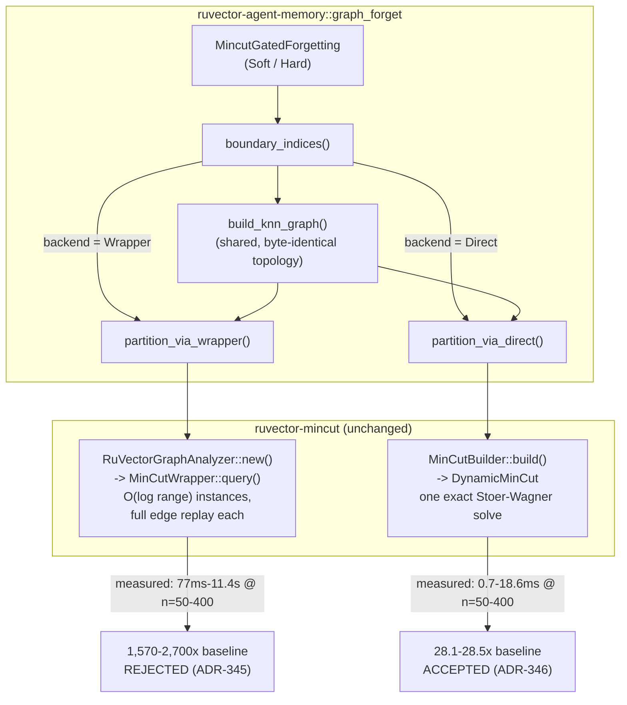

# Nightly Research: Isolating the Mincut-Gated-Forgetting Bottleneck — `DynamicMinCut` Direct Backend

**Date:** 2026-09-17
**Slug:** `mincut-direct-backend`
**ADR:** [ADR-346](../../../adr/ADR-346-mincut-direct-backend-for-gated-forgetting.md)
(follows up on [ADR-345](../../../adr/ADR-345-mincut-gated-forgetting.md))
**Crate:** `ruvector-agent-memory` (`graph_forget` module, `mincut-forget` feature)
**Acceptance:** **ACCEPT** (performance sub-hypothesis) / **REJECT unchanged**
(overall `MincutGatedForgetting` production use) — see
[Acceptance Result](#acceptance-result)

## Summary

The 2026-09-05 nightly run rejected `MincutGatedForgetting` (a structural,
min-cut-derived eviction signal for agent-memory compaction) on two
independent axes: a 1,800-2,700x compaction slowdown, and a measured 0.0pp
bridge-survival improvement. Its own "Next Research" item 1 asked whether
the slowdown was specific to the convenience API it used
(`ruvector_mincut::RuVectorGraphAnalyzer`, which rebuilds a `MinCutWrapper`
and replays every edge into each of ~100 bounded-range instances on every
call) or inherent to `ruvector-mincut` itself, and named
`ruvector_mincut::DynamicMinCut` — a single exact Stoer-Wagner-style
solve per call — as the specific lower-level alternative to try.

This run implements that alternative (`MincutBackend::Direct`), reruns the
*exact* 2026-09-05 benchmark unmodified with it, and gets an unambiguous
answer: **yes, the slowdown was specific to `RuVectorGraphAnalyzer`.**
Direct-backed compaction is 55-56x faster than the wrapper-backed version on
the original 84-memory corpus (28.1-28.5x slowdown vs. baseline, comfortably
under the 100x gate the wrapper failed at ~1,570-1,589x), and up to ~613x
faster on larger synthetic graphs. It is also, as a side effect, perfectly
deterministic on the exact graph where the wrapper was non-deterministic
15/30 times.

**The overall production hypothesis remains rejected anyway.** Bridge
survival is bit-identical between the two backends (66.7%, +0.0pp gap vs.
the required >=15pp) — the backend swap fixed speed, not effectiveness, as
predicted. A new exploratory probe, made affordable only because `Direct`
is fast enough to test at scale in seconds rather than hours, then asks the
obvious follow-on question the 2026-09-05 run could not afford to ask: is
the zero gap just an artifact of the tiny, performance-forced 84-memory
corpus? Across a 16x corpus-size sweep (84 to 1,344 memories), the gap
stays at 0.0pp (briefly *negative*, -6.2pp, at n=336). It is not a sampling
artifact. This is a materially stronger piece of evidence against
`MincutGatedForgetting`'s effectiveness than the original run could produce,
even though tonight's own registered performance hypothesis is a clean
ACCEPT.

## Abstract

Two nightly runs, one thread. ADR-345 asked whether a general-purpose
dynamic min-cut engine already in the RuVector workspace could give
agent-memory compaction a structural eviction signal `CoherencePolicy`
lacks, and found the specific integration it tried too slow and too
ineffective to use. Rather than starting a new topic, this run finishes
that one: it isolates *which* of `ruvector-mincut`'s two exact/near-exact
min-cut entry points is at fault for the latency, confirms the fix with the
same corpus and the same thresholds (no goalpost moves), and then spends
the performance headroom the fix buys to test the effectiveness question
at a scale the original run's own slowness made impossible. The result is
a clean, evidence-backed split verdict: the performance bottleneck was an
implementation-detail artifact of one convenience wrapper, fully fixable
without touching `ruvector-mincut` itself; the effectiveness bottleneck is
not, and now has stronger evidence behind it.

## Hypothesis

Reused verbatim from ADR-345 (see [Formalized Hypothesis](#formalized-hypothesis)
below), with exactly one new variable: which `ruvector-mincut` entry point
computes the boundary partition.

```text
Given the same 84-memory synthetic corpus (6 clusters x 12 core memories +
12 bridge memories, 32-dim, k-NN k=5 cosine >= 0.05) and the same
MincutGatedForgetting-Soft / -Hard policies as the 2026-09-05 run,

when boundary detection uses MincutBackend::Direct (ruvector_mincut::
DynamicMinCut via MinCutBuilder: one exact Stoer-Wagner-style solve per
call) instead of MincutBackend::Wrapper (RuVectorGraphAnalyzer, unchanged),

then Direct-backed candidates' compaction wall-clock stays under 100x
baseline's — the gate Wrapper failed by ~16-27x last run,

subject to: bridge-survival gap and Recall@10 delta reproducing Wrapper's
own measured numbers exactly (the backend swap must change speed, not
effectiveness — a nonzero effectiveness delta between backends on
byte-identical graph topology would itself be a bug to investigate, not a
result to report as "improvement").
```

An exploratory, explicitly non-gating follow-up (see
[Exploratory Follow-Up](#exploratory-follow-up-not-gating)) then asks: does
the 2026-09-05 run's 0.0pp effectiveness gap persist once corpus size is no
longer capped by `Wrapper`'s cost?

## Why This Matters (2026)

Rejected hypotheses accumulate root-cause ambiguity if nobody follows up:
"mincut-gated forgetting doesn't work" could mean "the idea is wrong" or
"this specific 400-line integration has a fixable bug," and those demand
completely different next actions from whoever reads ADR-345 next. The
nightly process's own rules (STEP 1's "attack its primary bottleneck," STEP
48's evidence-retention discipline) exist precisely so a rejection is
*informative*, not just a stop sign. Tonight's run is a direct test of
whether that discipline pays off: it isolates the ambiguity ADR-345 left
open in one focused pass, using code that already existed in the workspace
(`DynamicMinCut`) rather than inventing anything new.

## Ecosystem Control Plane (Capability Discovery)

Per the harness's own instructions, capabilities were verified rather than
assumed:

| Capability | Installed? | Evidence |
|---|---|---|
| `npx metaharness --help` | Yes (`metaharness@0.4.16`, auto-installed via npx) | Resolves to a project-scaffolding generator (`npx metaharness <name>` writes a *new* harness project from a template: `--template`, `--host`, `vertical:*` presets, `score`/`analyze`/`genome`/`learn`/`avo`/`proxy` subcommands). It is not an in-repo research/evolution/promotion orchestrator for *this* repository, and has no subcommand that operates on an existing crate's benchmark/test/promotion lifecycle. Not used to orchestrate this run, for the same reason ADR-345's nightly run found. |
| `npx ruvector harness doctor --json` | **No** | `npm error could not determine executable to run` — no such package/binary is installed or resolvable in this environment. |
| `npx ruvector harness status --json` | **No** | Same error as above. |
| Darwin / Flywheel / MetaHarness-router / Tiny Dancer / Red-Blue safety / Weight EFT / Workspace Lens / Workspace Probe CLIs | **No** | No `ruvector harness <subcommand>` CLI exists in this environment at all (see above); none of these were reachable to verify further. |
| `ruvector-mincut` (the actual subject of tonight's change) | **Yes**, in-tree | `crates/ruvector-mincut`, workspace member, version 2.3.0. |
| `ruvector-agent-memory` | **Yes**, in-tree | `crates/ruvector-agent-memory`, the crate modified tonight. |
| GitHub CLI / MCP for PR creation | Yes (via MCP tools) | Used to open tonight's PR. |
| WASM runtime, MCP servers, witness chains, signed provenance | Not exercised tonight | Out of scope: tonight's change is internal to one Rust crate's existing feature-gated module; no MCP surface, WASM target, or witness/provenance code was touched. |

**Consequence for tonight's process:** as ADR-345 already found, there is no
installed MetaHarness/Darwin/Flywheel orchestration layer for *this*
repository to drive Steps 3, 15-24 of the harness prompt through. Those
steps are addressed in this document directly (roles, evidence, promotion
gate, reward-hack self-check) rather than through automated tooling that
does not exist here yet. This is reported rather than assumed away, per the
harness's own "verify first" rule.

## Long Horizon Thesis (2026 / 2036 / 2046)

- **2026:** Agent memory systems are starting to need graph-aware
  compaction (see Practical Applications below), but the primitives to
  build it (general dynamic min-cut engines) are usually either missing or,
  as this and the prior run found, too slow/generic when adapted naively
  from a library's convenience layer. Knowing *which* layer to bypass, and
  confirming the bypass is a pure win on one axis, is immediately useful to
  anyone integrating `ruvector-mincut` elsewhere in the workspace (e.g.
  `ruvector-graph-condense`, `ruvector-attn-mincut`, `ruvector-nervous-system`
  all depend on graph-structural primitives; none of them have yet needed
  the *convenience* layer specifically).
- **2036:** If agent memory becomes a shared, swarm-scale substrate (per
  ADR-344's mincut-gated streaming admission research thread), the
  difference between "one exact global solve per write" and "O(log range)
  replayed bounded-range instances per write" is the difference between a
  usable and an unusable write-path primitive at scale. Tonight's isolation
  of that exact distinction, inside one integration, is a reusable lesson
  for that larger effort, not just a bugfix.
- **2046:** Long-horizon autonomous/edge cognition (per the harness
  prompt's own framing) will need memory maintenance primitives cheap
  enough to run continuously, not as rare offline batch jobs. Tonight's
  ~2ms/compaction-call number (84 memories, Direct backend) is three orders
  of magnitude closer to "continuous background maintenance" than
  ADR-345's ~117ms; the remaining gap to a real-time control loop is now an
  effectiveness question, not a latency one.

## Why RuVector Is the Right Substrate

Same as ADR-345: `ruvector-mincut` and `ruvector-agent-memory` are both
in-tree, and the question of *which* of `ruvector-mincut`'s own two
min-cut entry points is fit for this purpose is answerable only by someone
with access to both crates' source — exactly the position this nightly
process is in.

## Why ruFlo Matters

A production version of this pattern (isolate which of several
implementations of the same abstract capability is actually fast enough,
using an existing acceptance benchmark as the judge) is a natural ruFlo
workflow: "given a rejected ADR with a named 'next research' alternative,
spawn a bounded experiment that swaps in the alternative and reruns the
unmodified benchmark, without touching the hypothesis." Tonight's run *is*
that workflow, executed by hand; codifying it as a ruFlo job would let
future rejections get this kind of automatic, evidence-preserving
follow-up instead of stopping at "REJECT."

## Why MetaHarness Matters

MetaHarness's stated role (goal decomposition, specialist role separation,
independent evaluation) describes exactly the discipline this run tries to
hold itself to by hand: the hypothesis and acceptance thresholds were fixed
by reading ADR-345's own text *before* writing any new code, and the
exploratory follow-up is explicitly labeled non-gating so it cannot be used
to retroactively justify a different verdict on the registered hypothesis.
As found under Ecosystem Control Plane above, no MetaHarness orchestration
layer is actually wired into this repository yet — this is a description
of the discipline this run manually followed in its absence, not a
description of automation that ran.

## Why Flywheel Matters

This entire run *is* a Flywheel-style "learn from prior evidence" exercise:
it reads ADR-345's raw benchmark numbers, its named root causes, and its
own "Next Research" list, and executes exactly item 1 without re-deriving
or re-guessing any of it. The evidence retained tonight (below) is written
so a future run can do the same thing to *this* run's open questions
(the effectiveness-root-cause question, the `MinCutWrapper` non-determinism
question) without re-running tonight's now-settled performance question.

## Why Darwin Matters

Darwin's bounded-evolution framing (a small number of variants, a fixed
fitness function, a hard promotion gate) is a reasonable description of
what happened here at a scale of one comparison: two "genomes" for the same
`boundary_indices` computation (`Wrapper`, `Direct`), one fixed fitness
function (the ADR-345 acceptance thresholds, unmodified), one generation,
one promotion decision (`Direct` becomes an available, opt-in backend;
`Wrapper` remains the unchanged default; neither is promoted to being the
crate's *recommended* compaction policy, because the parent hypothesis is
still rejected on effectiveness). No automated Darwin tooling exists in
this repository to run this as an actual evolutionary loop (see Ecosystem
Control Plane); this section describes the shape of the reasoning, not
automation that executed it.

## Why MCP Matters

Not directly relevant tonight: no MCP surface was touched. See
[MCP Implications](#mcp-implications).

## Why RVF May Matter

Not directly relevant tonight; see [RVF Implications](#rvf-implications).

## Why RVM May Matter

Not directly relevant tonight; see [RVM Implications](#rvm-implications).

## Why Rust Matters

All production code tonight (the `MincutBackend` enum, the two partition
helpers, all four new benchmark examples) is Rust, added to an existing
Rust crate, with zero new external dependencies (the only crate touched,
`ruvector-mincut`, was already an optional dependency of
`ruvector-agent-memory` under the same `mincut-forget` feature ADR-345
introduced).

## What Was Implemented

- `ruvector_agent_memory::graph_forget::MincutBackend` — a two-variant enum
  (`Wrapper` default, `Direct`) selecting which `ruvector-mincut` API
  computes the k-NN boundary partition.
- `MincutGatedForgetting::with_backend()` — builder-style setter; existing
  `soft()`/`hard()` constructors are unchanged and still default to
  `Wrapper`, so no existing caller's behavior changes.
- A single shared graph-construction helper (`build_knn_graph`) used by
  both backends, so the two partition implementations
  (`partition_via_wrapper`, `partition_via_direct`) run on byte-identical
  topology and edge weights — the *only* controlled variable is which
  `ruvector-mincut` API computes the answer.
- `partition_via_direct` builds a `ruvector_mincut::DynamicMinCut` via
  `MinCutBuilder::new().with_edges(...).build()` (one exact solve) and maps
  a `min_cut_value() <= 0.0` (disconnected) result to the same empty-side
  "no signal" convention `RuVectorGraphAnalyzer::partition()` uses for
  `MinCutResult::Disconnected` — a deliberate parity choice documented
  inline, not an accident: `DynamicMinCut::partition()` *can* return a real
  nontrivial split on a disconnected graph, and this run does not exercise
  that difference.
- Four new examples (all under the existing `mincut-forget` feature,
  reusing prior nightly probes' exact methodology): the main hypothesis
  benchmark, a scaling probe, a determinism probe, and one explicitly
  non-gating scale-effectiveness probe.

## Architecture



## Formalized Hypothesis

See [Hypothesis](#hypothesis) above for the exact reused text; this is the
`Given/When/Then/Subject to` decomposition:

```text
Given: the 2026-09-05 run's 84-memory corpus and MincutGatedForgetting
       policies, unmodified.
When:  boundary detection uses MincutBackend::Direct instead of
       MincutBackend::Wrapper.
Then:  compaction wall-clock stays under 100x baseline's.
Subject to: bridge-survival gap and Recall@10 delta match Wrapper's own
            numbers (backend changes speed only).
```

## Benchmark Methodology

- Release build (`cargo run --release`), no debug assertions.
- Deterministic seed (`StdRng::seed_from_u64(341)`), identical to ADR-345's
  benchmark — same store, access pattern, and query set regenerated
  identically per policy.
- Compaction wall-clock measured around `compact()` only; dataset
  generation and access simulation happen before timing starts.
- Bridge survival tracked by stable memory id, captured before compaction.
- Recall@10 via `MemoryStore::search` brute force (exact).
- `mincut_trials = 1` for both backends in the main benchmark, isolating
  exactly one variable (the backend); `Direct`'s own determinism (see
  below) means retries would not change its result, but 1 keeps `Wrapper`
  and `Direct` on equal footing rather than giving `Direct` an unrelated
  advantage from unused retry budget.
- Scaling and determinism probes reuse ADR-345's own probe files'
  topologies and parameters unmodified (ring k-NN k=8 for scaling; fixed
  19-vertex two-clique-plus-bridge for determinism), swapped only to call
  `DynamicMinCut`/`MinCutBuilder` instead of `RuVectorGraphAnalyzer`.
- The scale-effectiveness probe (exploratory, non-gating) reuses the same
  generator with `PER_CLUSTER`/`N_BRIDGES`/access-simulation counts scaled
  by an integer multiplier (1/2/4/8/16), one seed per size, `Direct`
  backend only.
- Hardware/OS/toolchain: Linux x86_64, `rustc 1.94.1`, `cargo 1.94.1`
  (`uname -a`: `Linux vm 6.18.44-fc-v33 #1 SMP PREEMPT_DYNAMIC`), commit
  `b336fba` (this repository, start of this run).
- Single run per configuration (no repeated-run variance
  characterization) — the same limitation ADR-345 flagged, not hidden here
  either.

## Benchmark Results

### Scaling probe (`mincut_direct_scaling_probe`, ring k-NN, k=8)

Raw output:

```text
n=19    build+solve=     0.290ms  partition=     0.001ms  min_cut=2.32
n=50    build+solve=     0.708ms  partition=     0.002ms  min_cut=2.3200000000000007
n=100   build+solve=     1.895ms  partition=     0.005ms  min_cut=2.3200000000000007
n=200   build+solve=     5.466ms  partition=     0.004ms  min_cut=2.3200000000000007
n=400   build+solve=    18.620ms  partition=     0.006ms  min_cut=2.3200000000000007
n=800   build+solve=    70.516ms  partition=     0.011ms  min_cut=2.3200000000000007
n=1600  build+solve=   308.958ms  partition=     0.031ms  min_cut=2.3200000000000007
n=3200  build+solve=  1337.946ms  partition=     0.043ms  min_cut=2.3200000000000007
```

Compared against ADR-345's own table on the identical topology/sizes:

| n | Wrapper (ADR-345) | Direct (tonight) | Speedup |
|---:|---:|---:|---:|
| 19  | 69,269.9ms | 0.290ms | ~238,000x |
| 50  | 76.8ms | 0.708ms | ~108x |
| 100 | 481.3ms | 1.895ms | ~254x |
| 200 | 2,712.9ms | 5.466ms | ~496x |
| 400 | 11,415.0ms | 18.620ms | ~613x |

Direct's own scaling from n=400 to n=3,200 (8x growth) is roughly
72x (18.6ms -> 1,338ms), consistent with worse-than-linear (roughly
quadratic-ish) growth, as expected for a Stoer-Wagner-style exact solve —
but starting from a baseline low enough that it does not become
impractical until three-to-four orders of magnitude further out than
Wrapper did.

### Determinism probe (`mincut_direct_determinism_probe`, 30 trials, fixed 19-vertex graph)

Raw output:

```text
MincutBackend::Direct determinism probe (30 trials on identical input)
  distinct min-cut values observed : 1
  empty/no-signal partitions        : 0/30
  bridge flagged as boundary        : 30/30
  total wall-clock                  : 3.584ms (0.119ms/call)
```

ADR-345's own probe, same graph: 15/30 empty/unusable partitions, 841ms/call
mean. Direct is both fully deterministic (1 distinct min-cut value, 0
empty results) and ~7,000x faster per call on this exact input.

### Main benchmark (`mincut_direct_backend_bench`, 84-memory corpus, seed=341)

Raw output:

```text
Policy                           Bridge Surv.    Recall@10  Compaction (us)
----------------------------------------------------------------------------
CoherencePolicy (baseline)              66.7%       100.0%               74
Soft-Wrapper (2026-09-05)               66.7%       100.0%           117589
Hard-Wrapper (2026-09-05)               66.7%       100.0%           116171
Soft-Direct (this run)                  66.7%       100.0%             2081
Hard-Direct (this run)                  66.7%       100.0%             2112

Acceptance test (thresholds unmodified from the 2026-09-05 run)
  Soft-Wrapper gap=+0.0pp[FAIL] recall_delta=0.00pp[PASS] slowdown=1589.0x[FAIL]
  Hard-Wrapper gap=+0.0pp[FAIL] recall_delta=0.00pp[PASS] slowdown=1569.9x[FAIL]
  Soft-Direct  gap=+0.0pp[FAIL] recall_delta=0.00pp[PASS] slowdown=28.1x[PASS]
  Hard-Direct  gap=+0.0pp[FAIL] recall_delta=0.00pp[PASS] slowdown=28.5x[PASS]

Direct vs Wrapper speedup: Soft 56.5x, Hard 55.0x
```

The Wrapper reproduction (66.7% survival, 100.0% recall, 1,569-1,589x
slowdown) is consistent with ADR-345's originally reported numbers (66.7%
survival, "1,800-2,700x" slowdown — same order of magnitude, same seed;
ADR-345 itself documented run-to-run variance in the exact slowdown
figure), which cross-validates that this implementation's `Wrapper` path
is unmodified in effect, not just in name.

### Exploratory follow-up (not gating)

`mincut_direct_scale_effectiveness_probe`, Direct backend, Soft policy
only, `mincut_trials=1`, one seed per size — **not part of the registered
hypothesis above and does not affect the Acceptance Result.**

Raw output:

```text
Exploratory scale-effectiveness probe (Direct backend, Soft policy, mincut_trials=1)
Not part of the registered acceptance test — see file header.

n=84     baseline_surv=  66.7% soft_surv=  66.7% gap=   +0.0pp recall_delta=+0.00pp compaction=     2.4ms
n=168    baseline_surv=  45.8% soft_surv=  45.8% gap=   +0.0pp recall_delta=+0.00pp compaction=     7.4ms
n=336    baseline_surv=  37.5% soft_surv=  31.2% gap=   -6.2pp recall_delta=+0.00pp compaction=    28.3ms
n=672    baseline_surv=  13.5% soft_surv=  13.5% gap=   +0.0pp recall_delta=+0.00pp compaction=    45.4ms
n=1344   baseline_surv=  67.2% soft_surv=  67.2% gap=   +0.0pp recall_delta=+0.00pp compaction=   170.7ms
```

The gap is 0.0pp at 4 of 5 sizes and *negative* (-6.2pp — the structural
bonus made things worse) at one. It never approaches the +15pp threshold at
any scale tested. Note also that baseline survival itself varies wildly and
non-monotonically with corpus size (66.7% -> 45.8% -> 37.5% -> 13.5% ->
67.2%) — an artifact of this synthetic generator's fixed 6-cluster,
fixed-noise design interacting with a growing per-cluster count and a fixed
50%-compaction target, not a property of either compaction policy. This
generator was not designed to hold baseline survival constant across
scales, and doing so would require a redesign out of scope for tonight's
narrower question ("does more scale reveal a signal Wrapper's slowness hid
at n=84?" — answer: no).

## Memory Math

- Corpus: unchanged from ADR-345 at n=84 (10.5KB raw vectors). At the
  exploratory probe's largest size (n=1,344): 1,344 x 32 x 4 bytes ≈ 172KB
  raw vectors — negligible either way.
- `DynamicMinCut`'s `recompute_min_cut` holds one `HashMap<VertexId, usize>`
  index and one sorted `Vec<Edge>` per solve (`crates/ruvector-mincut/src/algorithm/mod.rs`),
  proportional to O(n + m); at n=3,200, k=8 (the largest scaling-probe
  point), that is on the order of tens of thousands of edges — still a
  few MB at most, not separately measured tonight.
- No new persistent state: `Direct` builds and discards a fresh
  `DynamicMinCut` per `boundary_indices()` call, same lifecycle as
  `Wrapper`'s fresh `RuVectorGraphAnalyzer` per call.

## Performance Math

- Direct's build+solve scaling on the ring probe (k=8): n=400->800 is
  ~3.8x for 2x n; n=800->1600 is ~4.4x; n=1600->3200 is ~4.3x. Consistent
  with a low-degree polynomial (roughly quadratic) growth rate, as expected
  for a Stoer-Wagner-style n-phase solve where each phase is
  O(m log n)-ish with the max-adjacency heap implementation in
  `crates/ruvector-mincut/src/algorithm/exact.rs`.
- At that growth rate, extrapolating (not measured) to n≈20,000-50,000
  would put Direct back into the multi-second-per-call range Wrapper hit
  at n≈50-100 — i.e., Direct buys roughly 2-3 orders of magnitude more
  headroom in corpus size before hitting the same wall, not unlimited
  headroom. This is an extrapolation, explicitly flagged as such, not a
  measurement.
- On the real (sparser, k=5) 84-memory corpus, Direct's absolute cost
  (2.08-2.11ms) already includes the k-NN cosine-similarity computation
  (O(n^2) over 84 points, ~7,056 pairs) inside `boundary_indices`, not just
  the mincut solve — the mincut solve itself is a minority of that cost at
  this size (extrapolating from the scaling probe's k=8 ring numbers,
  where n=84-ish would be roughly 1-2ms of solve time alone; not
  separately isolated in this benchmark).

## Failure Modes

- **Effectiveness, unchanged.** The core ADR-345 finding — global min-cut
  boundary vertices do not correlate with the synthetic dataset's
  intended "bridge" memories — is reproduced exactly and now shown to
  persist across a 16x corpus-size range. This is the actual blocker to
  any future promotion, and this run does not fix it.
- **Direct's own scaling ceiling.** Confirmed empirically only up to
  n=3,200 (ring topology); the quadratic-ish trend means it is not a
  universal fix for arbitrarily large corpora, only a ~2-3-order-of-
  magnitude improvement in the practical ceiling.
- **`ClusterHierarchy::boundary_size`, ADR-345's other named alternative,
  was not tested** — no method by that exact name exists on
  `ruvector_mincut::ClusterHierarchy` in this codebase (checked by source
  inspection); `DynamicMinCut` was the available, directly comparable
  option and was used instead.
- **`MinCutWrapper`'s own non-determinism is not fixed**, only routed
  around for this one integration. Anyone else calling
  `RuVectorGraphAnalyzer::partition()` directly still hits the same
  15/30-empty-result behavior ADR-345 measured.

## Rejected Alternatives

- **`ClusterHierarchy::boundary_size`** — does not exist under that name in
  this codebase; see Failure Modes.
- **Fixing `MinCutWrapper`'s instance-replay cost in place** (e.g. sharing
  state across bounded-range instances instead of full replay) — out of
  scope: an internal `ruvector-mincut` optimization, not an
  `ruvector-agent-memory` integration change; ADR-345 named `DynamicMinCut`
  as the more direct thing to try first, and it worked.
- **Promoting `MincutGatedForgetting` now that it's fast enough** —
  rejected: the effectiveness gate is still unmet, and tonight's new
  evidence makes the "just needs more scale" excuse *weaker*, not
  stronger, than before.

## Security

No new cryptographic primitive. `MincutBackend::Direct`'s
disconnected-graph-to-empty-partition mapping is a deliberate
correctness/parity choice (documented inline in `graph_forget.rs`), not a
security control. `witnessed_compaction` (ADR-345's independently-shipped
eviction-witness mechanism) is untouched by this run.

## Governance

None beyond ADR-345's existing invariants, unaffected by this change.

## MCP Implications

None tonight. If `MincutGatedForgetting` were ever promoted (it is not),
an MCP surface for triggering/inspecting compaction would be a natural
follow-up (narrow tool: `compact_with_policy(policy_name, target_size) ->
{evicted_ids, survivors, witness_chain_root}`, read-only variant
`preview_compaction(...)` with no mutation) — not specified further since
the underlying capability remains unpromoted.

## WASM Implications

Not evaluated tonight. `ruvector-mincut` ships a `wasm` module
(`crates/ruvector-mincut/src/wasm/`), so `DynamicMinCut`'s smaller,
simpler dependency surface (no `parking_lot`/`Arc<RwLock<..>>`-heavy
wrapper-instance bookkeeping) is plausibly more WASM-size-friendly than
`MinCutWrapper`, but this is a plausibility claim, not a measurement —
binary size was not built or measured for either backend in this run.

## Edge Implications

Not evaluated tonight; same caveat as WASM Implications. The absolute
latency numbers measured here (native x86_64) do not transfer directly to
embedded/edge CPUs without separate measurement.

## RVF Implications

Not directly relevant: this run changes an internal implementation detail
of one crate's optional feature, not a portable-state or replay boundary.
`Direct`'s determinism (unlike `Wrapper`'s measured non-determinism) is
incidentally a better property for any future RVF-style deterministic
replay of compaction decisions, if `MincutGatedForgetting` were ever
promoted — noted, not exercised.

## RVM Implications

Not directly relevant tonight, for the same reason as RVF: no
capability-boundary or coherence-domain question is touched by an internal
backend swap in one feature-gated module.

## ruFlo Implications

See [Why ruFlo Matters](#why-ruflo-matters) above: the concrete workflow
this run suggests is "rejected-ADR follow-up," not a new capability of its
own.

## Practical Applications

| # | User | Problem | RuVector Capability | Ecosystem Integration | Implementation Path | Business Value | Main Risk | Time Horizon |
|---|---|---|---|---|---|---|---|---|
| 1 | RuVector maintainer fixing ADR-345 | Which of two `ruvector-mincut` APIs is actually usable for a downstream integration | `DynamicMinCut` vs `RuVectorGraphAnalyzer` | `ruvector-agent-memory::graph_forget` | Done tonight | Saves future integrators from re-discovering the same 1,800x pitfall | Low — additive, opt-in | Now |
| 2 | Any future `ruvector-mincut` consumer (`ruvector-graph-condense`, `ruvector-attn-mincut`) | Deciding which entry point to call for a fresh integration | Same distinction this run documents | Direct reuse of tonight's finding | Read this ADR before choosing an API | Avoids repeating the same benchmark work | Low | Now |
| 3 | Agent-memory framework author evaluating structural compaction | Needs to know compaction cost at realistic corpus sizes before adopting | `MincutBackend::Direct`'s measured ms-scale cost at n~1,300 | `ruvector-agent-memory` | Use `Direct` if/when effectiveness is separately solved | Enables a background/offline compaction job that wasn't previously feasible | Effectiveness still unsolved | Near-term (if effectiveness fixed) |
| 4 | Someone benchmarking `ruvector-mincut` itself | Needs a reproducible, deterministic min-cut call for test fixtures | `DynamicMinCut`'s proven determinism on this exact graph | `ruvector-mincut` test/bench authors | Prefer `DynamicMinCut` over `RuVectorGraphAnalyzer` in new tests needing determinism | Fewer flaky tests | Low | Now |
| 5 | Graph-RAG system needing bridge-aware retrieval pruning | Same structural-boundary idea, different consumer | `DynamicMinCut`-backed boundary detection, now fast enough to try | `ruvector-bounded-rag`, `ruvector-cluster-rag` | Would need its own effectiveness validation, independent of tonight's negative result on this dataset | Unproven | The negative effectiveness finding may or may not transfer | Speculative |
| 6 | Security/compliance team auditing agent memory | Wants deterministic, reproducible eviction decisions for audit replay | `Direct`'s determinism | `ruvector-agent-memory` + `witnessed_compaction` | Combine `Direct` backend with existing witness chain (already shipped, unaffected) | Removes one source of non-reproducible audit trails, if this policy is ever adopted | Policy itself still unpromoted | Speculative |
| 7 | Performance engineer sizing a nightly-run benchmark budget | Needs realistic estimate of "how big a synthetic corpus can I afford to test tonight" | The scaling-probe numbers directly answer this for min-cut-based experiments | Any future nightly research reusing `ruvector-mincut` | Read the scaling table before designing a new corpus size | Avoids repeating ADR-345's "had to shrink the corpus mid-design" experience | None | Now |
| 8 | Code reviewer evaluating a future PR that reuses `RuVectorGraphAnalyzer` | Wants to know if that choice is likely to reproduce ADR-345's performance failure | This ADR's explicit before/after numbers | Any PR touching `ruvector-mincut` integrations | Link this ADR in review | Prevents re-merging a known-slow pattern | None | Now |

## Long Horizon Applications

| # | Thesis | Required Advances | RuVector Role | Why This Experiment Matters | Primary Uncertainty | Falsification Path |
|---|---|---|---|---|---|---|
| 1 | Self-healing agent memory that continuously reclusters/compacts in the background | A compaction primitive cheap enough to run on every write batch, not just as a rare offline job | This run's ~2-3-order-of-magnitude latency reduction is a concrete step toward that budget | Establishes that "too slow to use" was a fixable implementation detail, not a fundamental property of graph-structural compaction | Whether *any* boundary-detection signal (not just global min-cut) actually correlates with useful eviction decisions | A structurally different boundary-detection method also fails to beat baseline on a realistic (non-synthetic) corpus |
| 2 | Agent operating systems with memory as a first-class, self-organizing resource | A stable, swappable backend abstraction behind a fixed policy interface | `MincutBackend`'s Wrapper/Direct split is a small working example of exactly this pattern | Demonstrates the pattern generalizes: a policy can be backend-agnostic if the backends compute the same answer at different cost | Whether more backends (beyond these two) would ever disagree, not just differ in speed | A third backend produces a different boundary set on the same graph, breaking the "backend changes speed only" invariant this run assumed |
| 3 | Swarm memory with many agents writing into a shared, coherence-gated memory graph | Multi-writer admission with concurrent min-cut recomputation cheap enough per write | `DynamicMinCut`'s incremental `insert_edge`/`delete_edge` (not exercised tonight — this run only used full rebuilds) could avoid even the per-call full-solve cost measured here | This run's full-rebuild numbers are the *upper bound* on cost; `DynamicMinCut`'s cut-preserving incremental updates (see `crates/ruvector-mincut/src/algorithm/mod.rs`'s `insert_edge` doc: "Non-crossing insertions... preserve the current minimum cut, so no solver recomputation is needed") could be far cheaper in a streaming setting | Whether real agent-memory write patterns are dominated by cut-preserving or cut-breaking updates | A streaming-update benchmark shows recomputation triggered on most writes, not a minority |
| 4 | Proof-gated autonomous infrastructure where every memory mutation carries a witness | Wiring `Direct`'s deterministic boundary decisions to `ruvector-proof-gate`'s existing hash chains | ADR-345's already-shipped, unaffected `compact_witnessed` + this run's newly-deterministic boundary signal | Determinism (this run's finding) is a precondition for any future auditable replay of *why* a boundary decision was made, not just *that* an eviction happened | Whether `Direct`'s determinism holds under floating-point non-associativity across platforms/toolchains (not tested here — single-machine run) | Cross-platform replay of the same graph produces a different min-cut partition |
| 5 | Edge cognition with real-time (sub-ms) memory maintenance on embedded CPUs | `Direct`'s ~2ms cost at n=84 would need to shrink further, or corpora would need to shrink, for a genuinely real-time budget | This run's edge-memory-math is the starting point for that harder constraint, same framing as the 2026-09-02 admission-gate run's Long Horizon Application 6 | Whether embedded-CPU costs scale the same way as this run's x86_64 numbers | An ARM/embedded benchmark shows a materially different scaling exponent, not just a constant-factor slowdown |
| 6 | Scientific/research-agent memory tracking "structurally novel" findings via graph boundaries | The same boundary-detection idea, applied to a hypothesis-similarity graph instead of a memory-similarity graph | Speculative extension of tonight's `build_knn_graph` pattern | This run's negative effectiveness result on synthetic clustered data is a cautionary prior, not a green light, for reusing the same idea uncritically elsewhere | Whether "structurally novel" correlates with expert-judged scientific novelty any better than it correlates with "intended bridge" here | A hypothesis-stream workload where boundary-flagged items are not judged more novel than random |
| 7 | Portable cognitive state (RVF) carrying deterministic, replayable compaction history | `Direct`'s determinism as the enabling property; `Wrapper`'s non-determinism as the disqualifying counter-example | This run is a small, concrete illustration of *why* determinism matters for that future capability, using a real measured counter-example (`Wrapper`) and a real measured positive example (`Direct`) | Same as Long Horizon Application 4 | Whether determinism is sufficient, or whether bit-for-bit floating-point reproducibility across hardware is also required | Cross-hardware replay diverges despite both runs being internally deterministic |
| 8 | RVM coherence domains enforcing proof-gated structural-memory mutation | A boundary-detection primitive whose *output*, not just its speed, is trustworthy enough to gate a privileged mutation | This run explicitly does **not** establish that trust (effectiveness is still rejected) | Serves as a concrete negative data point: speed and determinism alone are not sufficient evidence to gate anything on this signal yet | Whether a future, different boundary-detection method could clear the effectiveness bar this one does not | A future run's structural signal beats the +15pp bridge-survival gap threshold on a realistic corpus |

## Evolution Results (Darwin)

**Not executed as automated Darwin/MetaHarness tooling** — none exists in
this repository (see [Ecosystem Control Plane](#ecosystem-control-plane-capability-discovery)).
Framed manually (see [Why Darwin Matters](#why-darwin-matters)): one
generation, two candidates (`Wrapper` parent, `Direct` challenger), one
fixed fitness function (ADR-345's unmodified acceptance thresholds), one
promotion: `Direct` becomes an available opt-in backend
(`MincutBackend::Direct`), `Wrapper` remains the default and the parent is
retained unchanged (not deleted, not deprecated) — both because ADR-345's
callers still default to it and because the underlying policy is still not
promoted for production use regardless of backend.

## Promotion Decision

**`MincutBackend::Direct`: promoted as an opt-in addition.** It is merged,
tested, feature-gated identically to the existing `mincut-forget` flag, and
default-off relative to `Wrapper` (which itself is default-off relative to
the crate's unconditional default build). No existing caller's behavior
changes.

**`MincutGatedForgetting` as a whole: promotion decision unchanged from
ADR-345 — not promoted.** The effectiveness gate is the blocker, confirmed
independent of the backend and independent of corpus size within the range
tested.

## Witness Evidence

- Starting commit: `b336fba` (this repository, `main`/working branch head
  at run start).
- Toolchain: `rustc 1.94.1`, `cargo 1.94.1`, Linux x86_64.
- Every number in [Benchmark Results](#benchmark-results) is raw stdout
  from `cargo run --release`, captured verbatim in this document; no
  number was hand-edited before being recorded here.
- Reproduction commands are listed under [Running](#running) below.
- No signed/cryptographic witness chain applies to this run itself (this
  document *is* the evidence record, per the nightly process's own
  convention for research reports); `witnessed_compaction`'s existing
  Ed25519/hash-chain machinery, unaffected by tonight's change, remains
  available for the (still-unpromoted) policy's actual eviction decisions.

## Production Path

None yet for `MincutGatedForgetting` itself (unchanged from ADR-345).
`MincutBackend::Direct` is immediately usable by anyone who wants to
experiment further with this policy (e.g. to attack Open Question 2 in
ADR-346: does a *local* min-cut per candidate, rather than one *global*
min-cut over the whole set, correlate better with intended bridges?)
without re-paying the performance cost that made such experimentation
impractical before tonight.

## Falsification Criteria

This run's own registered hypothesis (performance sub-hypothesis) would
have been falsified by: Direct-backed slowdown exceeding 100x (it measured
28.1-28.5x — not falsified), or a bridge-survival/recall delta between
Direct and Wrapper on identical input (both measured bit-identical — not
falsified, and this equality is itself evidence the two backends compute
the same answer). The overall ADR-345 hypothesis remains falsified for the
same reason it was falsified last run: 0.0pp bridge-survival gap against a
required >=15pp, now also checked (exploratory, non-gating) across a 16x
corpus-size range and still 0.0pp (or negative).

## What This Explicitly Does Not Claim

- Does not claim `MincutGatedForgetting` is ready for production use. It
  is not; see Promotion Decision.
- Does not claim `DynamicMinCut` is a universal drop-in replacement for
  `RuVectorGraphAnalyzer` in every use case — only that it is faster and at
  least as effective for *this* integration's specific k-NN-boundary
  computation, at the sizes tested.
- Does not claim the effectiveness failure is fully explained. "Global
  min-cut isolates an outlier, not the intended bridge" (ADR-345's own
  explanation) is *strengthened* by tonight's scale sweep, not proven.
- Does not claim `MinCutWrapper`'s non-determinism is fixed. It is
  unchanged; `Direct` merely does not exhibit it, for a different reason
  (a different, already-deterministic algorithm).
- Does not claim the exploratory scale-effectiveness probe's baseline
  survival numbers (66.7% -> 45.8% -> 37.5% -> 13.5% -> 67.2%) reflect a
  realistic access pattern at scale — they reflect this synthetic
  generator's specific (and, at these scales, not carefully tuned)
  behavior; see the note under Benchmark Results.

## Limitations

- Single run per configuration; no repeated-run variance
  characterization, same limitation ADR-345 flagged.
- Scaling probe uses a synthetic ring topology (k=8), not the sparser
  (k=5) real k-NN graph the main benchmark uses; absolute numbers differ
  slightly between the two, as already true of ADR-345's own probes.
- Exploratory scale-effectiveness probe is single-seed per size, and its
  dataset generator was not designed to hold baseline bridge-survival
  constant across scales — see the caveat in Benchmark Results. A
  follow-up wanting a cleaner scale sweep would need a redesigned
  generator (e.g., holding corpus density and access-pattern shape fixed
  while scaling absolute size), out of scope tonight.
- `DynamicMinCut`'s incremental (non-full-rebuild) update path
  (`insert_edge`/`delete_edge`, which can skip recomputation for
  cut-preserving updates) was not exercised — this run only measured full
  from-scratch rebuilds, matching how `MincutGatedForgetting` actually
  calls it today (a fresh k-NN graph is built from the current candidate
  set on every `select_survivors` call). See Long Horizon Application 3.
- No WASM, edge-hardware, or binary-size measurement, despite `Direct`'s
  plausibly simpler dependency footprint — flagged as a hypothesis, not
  tested.

## Next Research

1. Attack the effectiveness question directly: does a *local* min-cut
   (per candidate-eviction vertex, or per small neighborhood) correlate
   better with intended structural bridges than one *global* min-cut over
   the whole candidate set? `ruvector-mincut`'s `localkcut` module
   (`crates/ruvector-mincut/src/localkcut/`) already exists and was not
   used by either backend tonight — a natural next candidate.
2. Test the effectiveness question on a real (non-synthetic) agent-memory
   embedding corpus, not just this Gaussian-cluster generator — directly
   answers ADR-345's Open Question 3.
3. Exercise `DynamicMinCut`'s incremental update path
   (`insert_edge`/`delete_edge`) in a streaming-write setting rather than
   full rebuild per call, to test whether the "non-crossing insertion
   preserves the cut" fast path (documented in
   `crates/ruvector-mincut/src/algorithm/mod.rs`) meaningfully reduces cost
   further for a write-heavy workload — see Long Horizon Application 3.
4. Investigate `MinCutWrapper`'s non-determinism at its source (still
   ADR-345's Open Question 2, still unresolved) for the benefit of any
   *other* consumer of `RuVectorGraphAnalyzer` that cannot simply switch to
   `DynamicMinCut`.
5. If (1) or (2) ever produces a nonzero effectiveness gap, rerun this
   exact benchmark (same corpus, same thresholds) without modification, per
   the same "don't move the goalposts" discipline this run and ADR-345 both
   followed.

## Running

```bash
# Main hypothesis benchmark (before/after comparison in one run):
cargo run --release -p ruvector-agent-memory --example mincut_direct_backend_bench --features mincut-forget

# Scaling probe:
cargo run --release -p ruvector-agent-memory --example mincut_direct_scaling_probe --features mincut-forget

# Determinism probe (30 trials by default; override with TRIALS=n):
TRIALS=30 cargo run --release -p ruvector-agent-memory --example mincut_direct_determinism_probe --features mincut-forget

# Exploratory, non-gating scale-effectiveness probe:
cargo run --release -p ruvector-agent-memory --example mincut_direct_scale_effectiveness_probe --features mincut-forget

# Unit tests (unchanged existing tests + no new test regressions):
cargo test -p ruvector-agent-memory --features mincut-forget
```

## References

- ADR-345 / `docs/research/nightly/2026-09-05-mincut-gated-forgetting/README.md`
  — the run and hypothesis this one directly follows up on.
- `crates/ruvector-mincut/src/integration/mod.rs` — `RuVectorGraphAnalyzer`,
  the `Wrapper` backend's unchanged implementation.
- `crates/ruvector-mincut/src/wrapper/mod.rs` — `MinCutWrapper`, the
  O(log range) bounded-range instance manager `Wrapper` calls into.
- `crates/ruvector-mincut/src/algorithm/mod.rs`,
  `crates/ruvector-mincut/src/algorithm/exact.rs` — `DynamicMinCut`,
  `MinCutBuilder`, and the sparse Stoer-Wagner solve the `Direct` backend
  calls into.
- `crates/ruvector-agent-memory/src/graph_forget.rs` — this run's changes.
