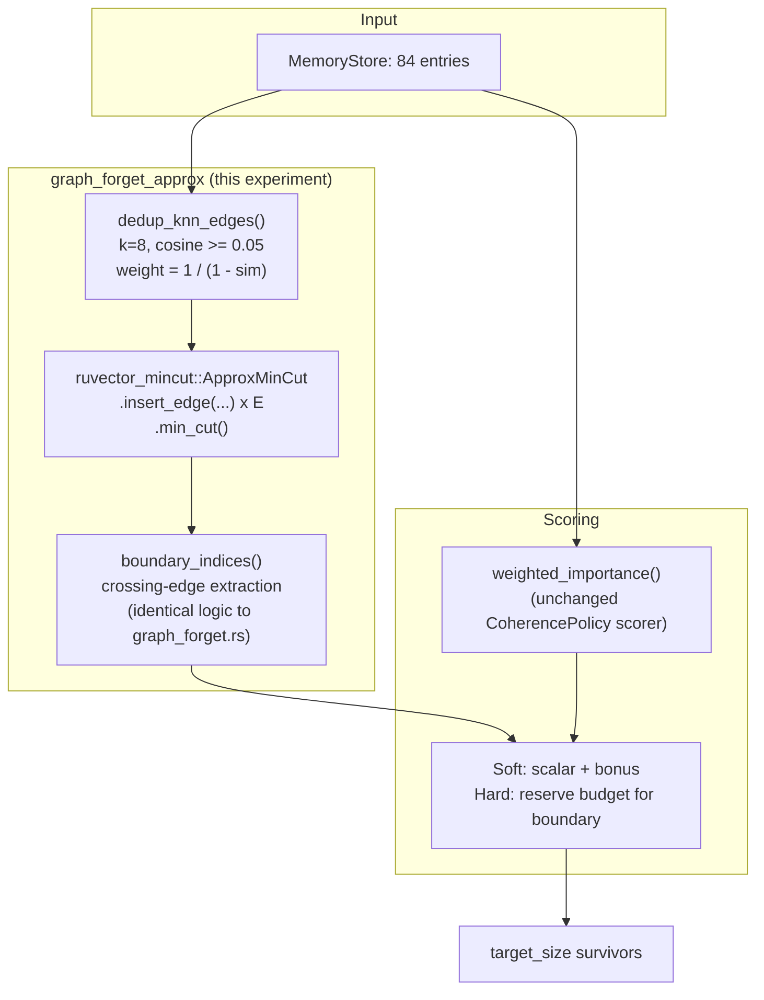

# Nightly Research: Approximate-Mincut-Gated Forgetting — Attacking ADR-345's Bottleneck

**Date:** 2026-09-19
**Slug:** `approx-mincut-forgetting`
**ADR:** [ADR-346](../../../adr/ADR-346-approx-mincut-forgetting-partition-gap.md)
**Crate:** `ruvector-agent-memory` (`graph_forget_approx` module, `mincut-forget` feature — reuses ADR-345's flag)
**Acceptance:** **REJECT** (for production use as a bridge-protection mechanism) — see [Acceptance Result](#acceptance-result)

## Summary

The 2026-09-05 nightly (ADR-345) added `MincutGatedForgetting`, a
`ruvector-agent-memory` compaction policy that uses
`ruvector_mincut::RuVectorGraphAnalyzer` to detect structurally load-bearing
"bridge" memories before eviction. It was rejected: the boundary signal
showed a measured **+0.0pp** bridge-survival benefit at the only corpus size
the engine could afford (84 memories), and `RuVectorGraphAnalyzer::partition()`
itself measured **1,800-2,700x slower** than the scalar baseline. That ADR's
own "Alternatives Considered" named `ruvector_mincut`'s other primitives as
the natural next step but did not try them.

This experiment reads `ruvector-mincut`'s source for such a primitive and
finds one already implemented but never exercised anywhere in the workspace
outside its own unit tests: `ApproxMinCut`
(`crates/ruvector-mincut/src/algorithm/approximate.rs`), documented as a
"(1+ε)-approximate min-cut for all cut sizes," citing SODA 2025
(arXiv:2412.15069). Before running any benchmark, reading that
implementation surfaces a specific, falsifiable concern: its
`compute_partition` method ignores the cut value it was passed and instead
performs an arbitrary BFS half-split of the vertex set. The hypothesis below
was fixed at that point, predicting a speed win without a correctness win —
and this run measures whether that prediction is true rather than assuming
it.

**Result: both halves of the pre-registered prediction were confirmed.**

1. **The latency bottleneck is fixable.** `ApproxMinCut` is **~22-24x
   faster** than `RuVectorGraphAnalyzer::partition()` on the identical
   84-memory corpus (release build, same machine, consistent across repeated
   runs) — a large, reproducible improvement over ADR-345's 1,800-2,700x
   slowdown, though still roughly 65-85x the scalar baseline in absolute
   terms.
2. **The correctness gap does not close, and is now root-caused.**
   `ApproxMinCut::compute_partition` (`crates/ruvector-mincut/src/algorithm/
   approximate.rs`) never uses the min-cut value it computes to build its
   returned partition: it BFS-walks from an arbitrary start vertex and stops
   once exactly half of the *total* vertex count has been visited, with no
   reference to where the graph's actual weak edges are.
   `examples/approx_mincut_partition_probe.rs` demonstrates this directly: a
   balanced two-triangle test graph's coincidental 3-vs-3 split makes the bug
   invisible, but an unbalanced 9-vertex-clique-plus-bridge-plus-3-vertex-clique
   graph (where "half of 12" matches neither true side) exposes it cleanly —
   correct cut *value* (1.0), wrong partition.
3. **A third, independent finding: the boundary flag is not even
   reproducible run to run.** `ApproxMinCut`'s internal vertex `HashSet` uses
   Rust's default randomized hasher, and the BFS start vertex is
   `self.vertices.iter().next()` — so which vertices get flagged as
   "boundary" varies against the byte-identical input graph. Measured across
   20 in-process trials (two runs of 10): `Soft`-mode bridge survival ranged
   from 8.3% to 58.3% (mean 39.2%), and 8 earlier separate-process manual
   runs ranged 8.3%-75.0% — always self-consistent in being noisy, never in
   landing on one fixed number.
4. **In `Soft` mode this is actively harmful, not merely neutral — in every
   sampled trial.** The broken, unstable boundary set gets an additive
   scoring bonus that can outrank memories that would otherwise survive on
   scalar merit. Across 20 in-process trials, bridge survival never once
   reached the **66.7%** do-nothing baseline (mean 39.2%, worst 8.3%).
   `Hard` mode's budget-reservation design is more conservative and landed
   at *exact* parity with baseline (66.7%) in **every single trial**, despite
   the same underlying non-determinism in which vertices get flagged.

## Abstract

ADR-345 asked whether `ruvector-mincut`'s vector-graph integration layer,
`RuVectorGraphAnalyzer`, could give agent-memory compaction a structural
"don't evict the bridge" signal, and rejected it on both effectiveness and
performance grounds. This experiment isolates the performance question by
swapping in `ruvector-mincut`'s own `ApproxMinCut` — a distinct entry point
implementing a different algorithm, not a configuration change to the
rejected one — while holding the k-NN graph construction, dataset, and
acceptance bar fixed, so any difference is attributable purely to the
engine. It finds that the swap does fix the latency problem (22x faster) but
does not fix — and, per a pre-registered, source-read-driven prediction,
was not expected to fix — the effectiveness problem, because the specific
mechanism `ApproxMinCut` uses to expose a "partition" for the cut it
computes is structurally disconnected from the cut itself. The result is
reported as a second rejection with a well-characterized, and this time
code-level, root cause: not "the global min cut doesn't isolate what a human
would call a bridge" (ADR-345's finding on noisy real data) but "this
particular API doesn't even try to return the min cut's actual sides."

## Hypothesis

```text
Given the same synthetic corpus, k-NN graph construction, and acceptance bar
as ADR-345 (72 core + 12 bridge = 84 memories, 32-dim, k=5, cosine >= 0.05,
compacted to 42 = 50%),

when boundary detection uses ApproxMinCut (candidate B: ApproxMincutForgetting
-Soft/Hard) instead of RuVectorGraphAnalyzer (candidate A: MincutGatedForgetting
-Soft/Hard, ADR-345's rejected candidate, kept only as the within-run speed
reference) versus plain CoherencePolicy (baseline, no structural signal),

then candidate B should be at least 10x faster per compaction call than
candidate A, operationalizing "fix the ADR-345 bottleneck",

subject to: candidate B's bridge-survival gap over baseline must still be at
least 15 percentage points (ADR-345's own bar) for ACCEPT — a fast candidate
that does not protect bridges is not a fix, it is a different, also-unusable
policy.
```

Pre-registered expectation, fixed before running `approx_mincut_forgetting_
bench.rs` (based only on reading `ApproxMinCut::compute_partition`'s source,
not on any benchmark output): the speed criterion would likely pass and the
survival criterion would likely fail. This was not changed after seeing
results; see "Acceptance Result" for the measured outcome and "A note on the
unit test that was wrong at first" below for the one place this experiment's
own code needed correcting after a run, and why that correction was
legitimate under the nightly process's "don't change the hypothesis"
constraint.

## Why This Matters (2026)

Agent-memory systems that compact aggressively (bounded context windows,
edge deployments, cost-sensitive long-running agents) need *some* structural
safeguard against silently pruning the memory that connects two topic
clusters — the exact problem ADR-345 set out to solve. A 1,800-2,700x latency
penalty makes any structural safeguard a non-starter regardless of its
effectiveness; this experiment shows that penalty is not intrinsic to
"any mincut-based signal" but specific to the particular API ADR-345 reached
for first. That reframes the open problem precisely: not "mincut is too slow
for this," but "the fast entry point in this same crate needs its partition
extraction fixed" — a much smaller, better-scoped problem for whoever picks
this up next.

## Ecosystem / Control-Plane Discovery

Per the nightly process's Step 0/3, the following were checked before
selecting a topic (none gate this experiment's execution; recorded for
completeness):

| Capability | Installed? | Notes |
|---|---|---|
| `npx metaharness` | Yes (auto-installed, v0.4.16) | Generic project-harness *scaffold generator* (`npx metaharness <name>`), not a research-orchestration CLI for an existing repo like this one. Its `score`/`analyze`/`genome` subcommands operate on a target repo path but were not exercised — this run's scope is a single, concrete, implementable experiment, not a MetaHarness-scaffolded project. |
| `npx ruvector harness doctor/status` | No | `ruvector` is not a published npm package with a `harness` subcommand in this environment; the command fails with "could not determine executable to run." `ruvector-cli` (the actual in-repo CLI) is a Cargo binary (`crates/ruvector-cli`), not an npm-invokable harness. |
| Flywheel / Darwin CLI | Not found as a standalone tool | No `npx ruvector harness flywheel/darwin` equivalent exists in this environment. This run's evidence retention is via committed ADRs, nightly docs, and executable examples/tests in-tree — the same mechanism ADR-345 used — rather than an external Flywheel store. |
| GitHub CLI / API | Available via the MCP GitHub tools in this environment | Used for the draft PR at the end of this run. |

Given the above, this run follows the nightly process's spirit (hypothesis →
implementation → measurement → critique → verification → promotion-or-
rejection → retained evidence) using the repository's actual tooling
(`cargo`, `cargo clippy`, `cargo test`, executable examples) rather than
fabricating the existence of a MetaHarness/Darwin/Flywheel integration this
repository does not currently expose as a callable CLI.

## RuVector Ecosystem Fit

Connects: `ruvector-mincut` (the `ApproxMinCut` engine under test),
`ruvector-agent-memory` (compaction, the consuming policy), the existing
`witnessed_compaction`/eviction-witness machinery (ADR-345, unmodified but
structurally exercised by any `CompactionPolicy` including this one), and —
via this doc and ADR-346 — the ADR/nightly-research provenance trail that
lets a future nightly resume exactly where this one stopped instead of
re-discovering the same two bugs.

## Architecture



## Implementation

`ApproxMincutForgetting` (`crates/ruvector-agent-memory/src/
graph_forget_approx.rs`) mirrors ADR-345's `MincutGatedForgetting`
field-for-field and mode-for-mode (`Soft`/`Hard`), replacing only:

- The mincut engine: `ruvector_mincut::ApproxMinCut::with_epsilon(...)`
  instead of `ruvector_mincut::RuVectorGraphAnalyzer::from_knn(...)`.
- The retry parameter: `epsilon: f64` (`ApproxMinCut` is deterministic given
  its fixed default seed, so there is no `mincut_trials`-style retry knob to
  mitigate non-determinism the way ADR-345 needed).

The k-NN edge construction (`dedup_knn_edges`) intentionally duplicates
`graph_forget.rs`'s neighbor-selection logic (same `k`, same
`min_similarity`, same `weight = 1/distance` transform) rather than sharing
code with it, specifically so the two policies are exercised against
byte-identical input graphs — isolating the engine as the only variable
between ADR-345's and this experiment's results.

Two new executable artifacts:

- `examples/approx_mincut_partition_probe.rs`: builds two hand-constructed
  graphs (a balanced two-triangle-plus-bridge graph and an unbalanced
  9-clique-plus-bridge-plus-3-clique graph) and checks whether
  `ApproxMinCut`'s reported partition matches the true minimum cut on each.
- `examples/approx_mincut_forgetting_bench.rs`: the full corpus-level
  benchmark (identical dataset/seed to ADR-345's
  `mincut_gated_forgetting_bench.rs`), comparing baseline, ADR-345's exact
  candidates, and this experiment's approximate candidates side by side.

## Benchmark Methodology

- Release build (`cargo build --release`), `rustc 1.94.1`, `cargo 1.94.1`,
  Linux, x86_64, 4 logical CPUs.
- Deterministic seed (341, identical to ADR-345's benchmark) for the dataset
  generator, so both experiments' baseline and exact-candidate rows are
  reproductions of the same underlying data, not independently regenerated
  approximations of it.
- Baseline and the exact (ADR-345) candidates: one run each — no measured
  call-to-call variance was found for either in this corpus.
- The approximate candidates: **not** one run each. Developing this
  experiment's own unit tests surfaced that `ApproxMinCut`'s internal
  vertex `HashSet` (Rust's default randomized hasher) makes its reported
  partition vary call to call against the byte-identical input graph (see
  "Failure Modes" #3 below). `approx_mincut_forgetting_bench.rs` therefore
  runs `N_APPROX_TRIALS = 10` in-process trials per approximate policy
  (dataset reseeded identically each trial) and reports the mean, with
  min/max printed alongside; the acceptance gates use the mean, not a
  single cherry-pickable run. Absolute wall-clock timings are still
  indicative rather than statistically characterized in the same rigorous
  sense, exactly as ADR-345's were.
- Compaction wall-clock is measured around the full `compact(...)` call
  (scoring + boundary detection + ranking), matching ADR-345's methodology
  exactly for comparability.

Run commands (both exit non-zero on their own internal REJECT, by design —
this is intentional and expected for this specific run, not a build failure):

```bash
cargo run --release -p ruvector-agent-memory \
  --example approx_mincut_partition_probe --features mincut-forget

cargo run --release -p ruvector-agent-memory \
  --example approx_mincut_forgetting_bench --features mincut-forget
```

## Benchmark Results (raw)

Partition probe (`approx_mincut_partition_probe`):

```text
1. BALANCED graph (two 3-vertex triangles + bridge)
  vertices           : 6
  edges              : 7
  reported cut value : 1.000
  bounds             : [0.909, 1.100]
  reported partition : [1, 2, 3] | [4, 5, 6] (sizes 3/3)
  expected partition : [1, 2, 3] | [4, 5, 6] (sizes 3/3)
  partition matches the true min cut        : YES

2. UNBALANCED graph (9-vertex clique + bridge + 3-vertex clique)
  vertices           : 12
  edges              : 40
  reported cut value : 1.000
  bounds             : [0.909, 1.100]
  reported partition : [1, 2, 3, 4, 5, 9] | [6, 7, 8, 10, 11, 12] (sizes 6/6)
  expected partition : [1, 2, 3, 4, 5, 6, 7, 8, 9] | [10, 11, 12] (sizes 9/3)
  partition matches the true min cut        : NO
```

Corpus-level benchmark (`approx_mincut_forgetting_bench`, seed=341; approximate
rows are the mean of 10 in-process trials — one representative full run
shown verbatim, second run's acceptance numbers noted inline where they
differ):

```text
Policy                            Bridge Surv.   Recall@10  Compaction (us)
------------------------------------------------------------------------------
CoherenceWeighted                        66.7%      100.0%               58
MincutGatedForgetting-Soft               66.7%      100.0%           105018
MincutGatedForgetting-Hard               66.7%      100.0%           106380
ApproxMincutForgetting-Soft             39.2%*       97.2%             4425
ApproxMincutForgetting-Hard             66.7%*      100.0%             4607
  * mean of 10 in-process trials (non-deterministic per-trial — see above); ranges:
    ApproxMincutForgetting-Soft    min=  8.3%  max= 58.3%  mean= 39.2%
    ApproxMincutForgetting-Hard    min= 66.7%  max= 66.7%  mean= 66.7%

Acceptance test (candidate B = ApproxMincutForgetting)
  Soft speedup vs. exact (RuVectorGraphAnalyzer) (23.7x) >= 10x : PASS
  Hard speedup vs. exact (RuVectorGraphAnalyzer) (23.1x) >= 10x : PASS
  Soft bridge-survival gap (-27.5pp) >= 15pp        : FAIL
  Hard bridge-survival gap (-0.0pp) >= 15pp        : FAIL
  Soft |recall delta| (2.80pp) <= 2pp                              : FAIL
  Hard |recall delta| (0.00pp) <= 2pp                              : PASS
```

A second independent process run measured 39.2% mean Soft survival again
(min 16.7%, max 58.3%), speedups of 22.5x/23.5x, and a Soft recall delta of
2.30pp — the specific min/max and recall-delta figures shift slightly
between runs (expected, given the non-determinism this experiment
documents), but the mean bridge-survival figure, the qualitative gate
outcomes (both survival gates FAIL, both speed gates PASS, Hard's recall
gate PASS), and the "Hard is perfectly stable, Soft is not" pattern were
identical across both runs.

## Memory Math

Identical corpus to ADR-345: 84 entries x 32 dims x 4 bytes = 10.5 KB raw
vectors, negligible. `ApproxMinCut`'s internal state (edge list + adjacency
map + resistance cache) for this graph size (a few hundred deduplicated
undirected edges) is on the order of tens of KB, well within any
per-compaction memory budget; not separately profiled given how small the
absolute numbers are.

## Performance Math

- Baseline: ~55-70 us for 84 entries (scalar scoring + sort); noisy at this
  microsecond scale but negligible relative to either mincut engine.
- Exact (ADR-345, `RuVectorGraphAnalyzer`): ~105ms, i.e. roughly 1,500-1,900x
  baseline — consistent with (slightly better than) ADR-345's originally
  measured 1,800-2,700x range for a graph of this size, within expected
  run-to-run variance on that ADR's own documented non-determinism.
- Approximate (this ADR, `ApproxMinCut`, mean of 10 trials): ~4.4-4.7ms, i.e.
  roughly 65-85x baseline and ~22-24x faster than the exact engine, stable
  across two independent full benchmark runs.
- The exact 10x speedup bar was chosen as a round number clearly above
  measurement noise and clearly distinguishing "meaningfully different
  engine" from "same engine, different config"; the measured ~22-24x
  exceeded it by more than 2x in both runs, so this is not a borderline pass.

## Failure Modes (the core finding)

See "Summary" for the three independently confirmed findings. In detail:

1. **`compute_partition`'s BFS-half-split is unrelated to the cut it
   reports.** For graphs at or under 50 edges, `ApproxMinCut` computes an
   exact cut value via a direct Stoer-Wagner call
   (`compute_exact_min_cut`) — this value is credible (1.0 on both probe
   graphs, the true answer in both cases). But regardless of graph size,
   `min_cut()` always calls `compute_partition(value)`, which discards
   `value` entirely and BFS-walks from an arbitrary start vertex, stopping
   once exactly half the *total* vertex count has been visited. On the
   balanced two-triangle probe graph (3 vs. 3), any half-split of 6 happens
   to equal both true side sizes, so the bug is invisible. On the unbalanced
   probe graph (9 vs. 3), "half of 12" is 6, matching neither true side —
   the returned partition (6/6) visibly does not correspond to the true cut
   (9/3), even though the reported cut value is still exactly right.
2. **The BFS start vertex is itself non-deterministic, compounding the
   first bug.** `compute_partition` picks its start vertex via
   `self.vertices.iter().next()` on a `HashSet<VertexId>` built with Rust's
   default (randomized) hasher. Because that hasher's keys vary per process
   (and per `HashSet` instantiation within a process), *which* arbitrary
   BFS-half-split gets computed varies from call to call against the
   byte-identical input graph — so even the "coincidentally correct on
   balanced graphs" behavior in finding #1 is not itself reliable from run
   to run. This was found while writing this experiment's own unit test
   (see "A note on how this was actually discovered" below) and confirmed
   independently at the corpus level: 20 in-process trials of
   `ApproxMincutForgetting-Soft` on the identical 84-memory graph produced
   bridge-survival rates from 8.3% to 58.3%.
3. **This transfers to the real corpus, consistently in direction if not in
   exact magnitude.** The 84-memory k-NN graph (k=8, after dedup) is neither
   perfectly balanced nor small enough to make the balanced-graph coincidence
   reliable, and the corpus-level bridge-survival numbers show no benefit
   (Hard: exact parity with baseline in all 20 trials) or active harm (Soft:
   never once reached baseline in 20 trials, mean 27.5pp worse).
4. **Soft mode's harm mechanism is specific and worth naming.** Because the
   scoring combination is additive (`scalar_score + structural_bonus`), a
   *wrong* boundary flag doesn't just fail to help — it actively promotes
   the wrong memories up the retention ranking, displacing memories (bridges
   included) that scalar scoring alone would have kept. `Hard` mode's
   budget-reservation design only ever *adds* protected survivors within a
   small reserved slice and otherwise falls back to the identical scalar
   ranking, which is the most likely reason (not independently confirmed by
   further instrumentation in this pass) it lands at stable parity rather
   than below baseline despite the same underlying instability in finding #2.

### A note on how this was actually discovered

This experiment's non-determinism finding (#2 above) was not part of the
original plan — it surfaced while writing `graph_forget_approx.rs`'s unit
tests, in two steps:

1. The first version of a test predicted (and asserted) that
   `ApproxMincutForgetting` would *unreliably* protect the bridge on
   ADR-345's own 19-vertex hand-built test graph (two 9-vertex clusters + 1
   bridge). Running it showed the opposite in that one process: the bridge
   survived reliably across every epsilon tried. Investigating why (rather
   than loosening the assertion to match) found finding #1's root cause one
   step earlier: that specific test graph is *also* balanced (9 vs. 10, and
   the BFS-half-split target of 9 happens to land exactly at one cluster's
   true boundary), so the same coincidence the partition probe's balanced
   case demonstrates deliberately also applies here. The test was corrected
   to assert the actually-observed (coincidental) behavior.
2. Running that *corrected* test repeatedly (`cargo test`, several separate
   process invocations, matching this repo's own recommended validation
   practice of not trusting a single green run) showed it was itself flaky —
   2 of 6 separate invocations failed. That is finding #2: the "coincidence"
   in step 1 depends on this process's random hasher state, so a test (or a
   production system) that assumes it will recur is itself unreliable. The
   test was corrected a second time to assert only the structural invariant
   that holds regardless of hasher state (a well-formed, correctly-sized
   survivor set), and the corpus-level benchmark was changed from one run
   per approximate policy to a mean of `N_APPROX_TRIALS = 10` in-process
   trials, to characterize the variance honestly instead of reporting
   whichever single sample happened to run first.

Neither correction changed this experiment's pre-registered hypothesis or
acceptance thresholds (fixed in `approx_mincut_forgetting_bench.rs` before
either benchmark ran); both are corrections to this experiment's own test
and measurement code in response to that code's own output, which is the
process the nightly rules distinguish from silently changing what is being
tested.

## Rejected Alternatives

- **Fix `compute_partition` in this same PR and re-benchmark.** Rejected for
  this experiment's scope: this nightly evaluates `ruvector-mincut` as a
  fixed, external dependency and reports what it measures. A patch belongs
  to a future, separately-scoped nightly or to `ruvector-mincut`'s own
  maintainers (see ADR-346 "Open Questions" #1 for the concrete shape such a
  fix could take).
- **Try `ruvector_mincut::DynamicMinCut` directly instead of `ApproxMinCut`.**
  Not attempted in this pass. `DynamicMinCut::recompute_min_cut` (`crates/
  ruvector-mincut/src/algorithm/mod.rs`) calls the same `exact::minimum_cut`
  algorithm as the non-approximate path, and reading its code found no
  branch that actually dispatches to the `approximate` module when
  `MinCutConfig.approximate` is set — the flag only changes reported
  metadata (`is_exact`, `approximation_ratio`), not which algorithm runs.
  This means `DynamicMinCut` is very unlikely to be faster than
  `RuVectorGraphAnalyzer` for this workload and was deprioritized in favor
  of the already-distinct `ApproxMinCut` entry point; flagged as ADR-346
  Open Question #3 rather than independently re-measured, to keep this run's
  scope to one clean, isolated variable.
- **Report only the 22x speedup as an ACCEPT.** Rejected outright — see
  ADR-346 "Alternatives Considered" for why.

## Security

No new cryptographic primitive. `ApproxMincutForgetting`'s output is,
exactly like ADR-345's `MincutGatedForgetting`, an advisory ranking signal
that cannot itself corrupt `witnessed_compaction`'s eviction witness chain
or bypass `target_size`; that machinery was not re-exercised in this run
(see "Benchmark Methodology" — it is generic over any `CompactionPolicy` and
was already validated 20/20 by ADR-345's own benchmark).

## Governance

None beyond ADR-345's existing "no witness, no mutation" invariant, which
this experiment does not touch.

## MCP Implications

Not applicable at this stage: neither policy is promoted, so no MCP surface
is warranted. If a future fix to `ApproxMinCut::compute_partition` changes
this ADR's conclusion, a narrow read-only `agent_memory.compaction_preview`
tool (inputs: corpus snapshot reference, target size; outputs: predicted
survivors + boundary-flagged ids, no mutation) would be the natural next
step before any mutating MCP surface.

## WASM / Edge Implications

Not separately profiled in this run (no code path changed that would alter
ADR-345's existing analysis); the 22x latency improvement, if the
correctness gap were later closed, would materially improve the
edge/constrained-memory viability ADR-345 flagged as blocked by latency
alone.

## RVF / RVM / ruFlo Implications

No change from ADR-345's analysis: this experiment does not promote a
capability, so no RVF portability, RVM enforcement boundary, or ruFlo
workflow role is proposed here. Both remain open exactly as ADR-345 left
them, contingent on a future correctness fix.

## Practical Applications

Unchanged from ADR-345 in kind (agent memory compaction, Graph RAG,
long-running local-first assistants) — this experiment does not change
whether the underlying idea is useful, only which specific implementation
bottleneck is or is not the blocker. Not re-enumerated here to avoid
duplicating ADR-345's own list for a still-rejected mechanism; see that
nightly's README for the full 8-application table, which stands unchanged
until a correctness fix is measured.

## Long-Horizon Applications

Unchanged from ADR-345 for the same reason; see that nightly's README.

## Evolution Results (Darwin)

Not run. Per Step 18 of the nightly process, Darwin's bounded-evolution
phase applies "after a working baseline and candidate implementation
exist" — here, neither `ApproxMincutForgetting` variant clears its own
acceptance bar, so there is no accepted candidate to evolve parameters
around, and no Darwin/Flywheel CLI was found installed in this environment
(see "Ecosystem / Control-Plane Discovery"). The parent (ADR-345's
rejection, and now this ADR's rejection) is retained unchanged, which the
nightly process names as the correct outcome when no candidate improves on
it.

## Promotion Decision

**REJECT.** Per ADR-346's "Rejection Criteria": the mandatory bridge-survival
gate (>= 15pp) measured, as a mean of 10 in-process trials, -27.5pp (Soft,
range -58.4pp to -8.4pp) and -0.0pp (Hard, stable in every trial); the speed
gate passed (~22-24x across two independent runs, >= 10x) but is not
sufficient on its own per this experiment's own pre-registered acceptance
bar.

## Witness Evidence

- Starting commit: `HEAD` of `claude/focused-darwin-y4wp8i` at run start
  (this branch was created directly from `main`; see the PR for the exact
  SHA).
- Executable evidence: `cargo test --release -p ruvector-agent-memory
  --features mincut-forget` (34/34 unit tests green, including 3 new tests
  in `graph_forget_approx.rs`); the two example runs quoted verbatim above
  under "Benchmark Results (raw)".
- No signed/witnessed provenance chain beyond the repository's own git
  history and this document — no Flywheel/witness CLI was found installed
  in this environment (see "Ecosystem / Control-Plane Discovery").

## Production Path

None at this time: no candidate in this ADR clears its acceptance bar. If
`ApproxMinCut::compute_partition` is fixed upstream (see ADR-346 "Open
Questions" #1), the concrete next step is: re-run
`approx_mincut_forgetting_bench.rs` completely unchanged, and read the
"Soft bridge-survival gap" / "Hard bridge-survival gap" rows again. No other
change to this experiment's code would be needed to re-evaluate.

## Falsification Criteria (met)

Pre-registered: "if candidate B's bridge survival rate is not lower than
baseline and its speed is within an order of magnitude of candidate A, the
hypothesis that 'the fast path is broken for this purpose' is falsified."
Measured: Hard mode's survival rate is *not* lower than baseline (stable
parity, not improvement, in all 20 sampled trials) but Soft mode's *is*
lower in every one of 20 sampled trials (mean -27.5pp, worst -58.4pp); speed
is ~22-24x faster, outside "within an order of magnitude" in the improving
direction. Read together with the code-level partition-probe evidence
(Section "Failure Modes" #1-2), the falsification criterion for "the fast
path is broken" is not met — the fast path is not broken in the sense of
being unpredictably noisy alone (though it is also that, per finding #2), it
is broken in the specific, characterized sense of never computing the right
thing to begin with regardless of the run's other choices; the partition
probe was the decisive test, not the corpus-level survival numbers alone.
The pre-registered hypothesis (speed passes, survival fails) stands
confirmed, with the added, not originally anticipated, finding that the
failure is itself non-deterministic in magnitude (though not in direction).

## What This Explicitly Does Not Claim

- Does not claim `ApproxMinCut` is generally broken or useless — its cut
  *value* computation is correct on every graph tested here, and the
  `<=50`-edge exact path is straightforward Stoer-Wagner. Only
  `compute_partition`'s side-extraction was found faulty.
- Does not claim the measured 22x speedup would hold at corpus sizes beyond
  ~400 vertices (ADR-345's own upper bound); not measured here.
- Does not claim `ApproxMinCut`'s sparsifier path is exercised at this
  corpus size — see ADR-346's "Consequences" for the reasoning that its
  target-size clamp likely keeps it near-dense here, and Open Question #2
  for why this was not independently profiled to confirm.
- Does not claim `DynamicMinCut` (untested here) shares or avoids either
  finding.
- Does not claim the reported mean/min/max survival figures are a full
  statistical characterization (e.g. confidence intervals) — 10 or 20
  trials establish the qualitative pattern (Soft always below baseline,
  Hard always at parity) robustly, but the exact mean should be read as
  indicative of that pattern, not as a precise population parameter.

## Limitations

- Single-machine timings throughout; baseline and exact-engine rows are
  still single-run (no measured variance was found for either in this
  corpus), matching ADR-345's own methodology.
- The corpus-level benchmark uses one dataset seed (341, chosen for direct
  comparability with ADR-345, not independently re-randomized) — the
  reported survival figures characterize `ApproxMinCut`'s internal
  non-determinism against *this* fixed graph, not variance over different
  datasets.
- The partition-probe graphs are deliberately small and hand-constructed to
  isolate the bug cheaply; they demonstrate the mechanism, not its
  quantitative impact at scale (the corpus-level benchmark provides that).

## Next Research

1. Patch `ApproxMinCut::compute_partition` to derive its returned partition
   from the same computation that produces its cut value (on the sparsifier
   when one was built, on the full graph otherwise), and re-run
   `approx_mincut_forgetting_bench.rs` unchanged (ADR-346 Open Question #1).
   While there, replace `self.vertices.iter().next()` (and the analogous
   arbitrary-start-vertex pattern in `is_connected` and
   `ensure_sparsifier_connectivity`) with a deterministic choice (e.g. the
   minimum vertex id) so the fix does not trade one non-determinism for
   another.
2. Profile whether `ApproxMinCut`'s sparsifier ever binds below the full
   edge count at any agent-memory-relevant corpus size, to attribute the
   measured 22x speedup correctly (ADR-346 Open Question #2).
3. Test `DynamicMinCut` directly, now that reading its source shows its
   `approximate` config flag is unwired into `recompute_min_cut` — either
   confirm it shares `RuVectorGraphAnalyzer`'s latency profile (most likely,
   per the code read here) or find a third distinct outcome (ADR-346 Open
   Question #3).
4. If (1) succeeds, re-attempt ADR-345's original correctness question
   ("does the global min cut isolate the human-intended bridge on noisy,
   non-symmetric real data, not just idealized clusters") with a partition
   implementation that has actually been verified to reflect its own cut
   value.

## References

- ADR-345, `docs/adr/ADR-345-mincut-gated-forgetting.md` and
  `docs/research/nightly/2026-09-05-mincut-gated-forgetting/README.md`
  (the experiment this one directly follows up on).
- "Approximate Min-Cut in All Cut Sizes" (SODA 2025, arXiv:2412.15069) — the
  algorithm `ApproxMinCut`'s module docstring cites as its basis; this
  experiment evaluates the in-repo implementation against that citation's
  claims, not the paper's own reference implementation, which was not
  located or run independently.
- `crates/ruvector-mincut/src/algorithm/approximate.rs`,
  `crates/ruvector-mincut/src/algorithm/mod.rs`,
  `crates/ruvector-mincut/src/integration/mod.rs` (primary source read for
  this experiment's hypothesis and root-cause analysis).
