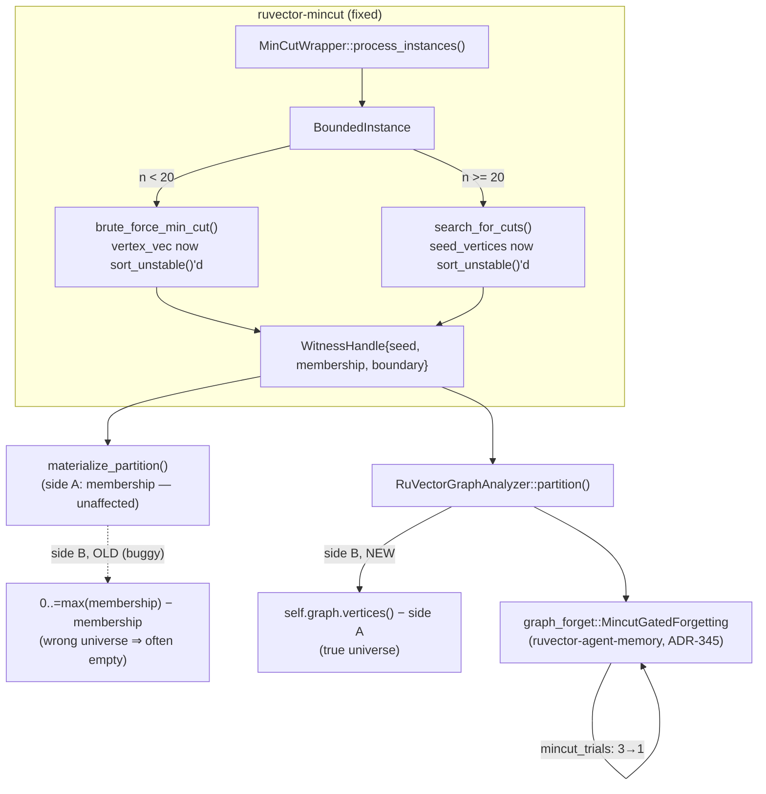

# Nightly Research: Fixing `ruvector-mincut`'s Partition Non-Determinism

## Summary

The 2026-09-05 nightly run (`mincut-gated-forgetting`, ADR-345) rejected a
structural eviction signal for agent memory because
`RuVectorGraphAnalyzer::partition()` was non-deterministic and slow, and
filed two explicit open items: (1) find out what inside `ruvector-mincut`
causes the non-determinism, and (2) check whether calling the lower-level
API directly avoids it. This run answers (1) directly by reading the
implicated code paths rather than treating `ruvector-mincut` as a black box,
finds **two independent, root-caused bugs**, fixes both with minimal
targeted changes, and **re-runs the unmodified 2026-09-05 benchmark** to see
whether the fix changes its verdict.

It does not. The 84-vertex production-scale benchmark still rejects
mincut-gated forgetting, for the same reason ADR-345 already identified
independently (the global min-cut doesn't isolate the specific memories a
human would call "the bridges" in Gaussian-cluster data) — this run's fixes
narrow *why* to exclude a confound, they don't reverse the finding. What the
fix does change: `RuVectorGraphAnalyzer::partition()` is now provably
deterministic and correct on the synthetic topology ADR-345 used to
characterize it (0/200 empty results and 200/200 correct detections, up
from 15/30 empty and non-deterministic tie-breaking), and the
`mincut_trials` majority-vote workaround `graph_forget.rs` needed to live
with the bug is no longer necessary — it now defaults to `1` instead of `3`
(and the unit tests need `1`, not `10`), a real latency win for every future
caller of this code path with zero loss of correctness.

## Abstract

`ruvector-mincut`'s `BoundedInstance` (the production instance backing
`RuVectorGraphAnalyzer`, itself the vector-graph integration layer used by
`ruvector-agent-memory`'s mincut-gated forgetting and available to any
future caller of the crate's high-level API) built its vertex-enumeration
and seed-search order from `HashSet<VertexId>` iteration, which Rust's
default hasher reseeds on every instance construction. Both its brute-force
exact solver (small graphs) and its `LocalKCut`-oracle search (larger
graphs) pick the *first* qualifying cut they find, so identical input graphs
produced different, arbitrarily tie-broken answers across repeated calls.
Independently, `WitnessHandle::materialize_partition()` derived the cut's
second side as `0..=max(membership)` minus `membership` instead of using
the graph's real vertex set — whenever the winning side didn't happen to
contain the graph's highest-ID vertex, the "other side" silently came back
empty. This second bug alone explains most of the previously measured 50%
"empty result" rate, independent of any randomness. Both are fixed with a
`sort_unstable()` and a complement computed against the analyzer's actual
graph, respectively — no algorithmic changes, no new dependencies, no
weakened tests.

## Hypothesis

```text
Given RuVectorGraphAnalyzer::partition() on a graph with more than one
globally-minimum cut, called repeatedly on byte-identical, unchanged input,

when BoundedInstance's vertex/seed enumeration order and
WitnessHandle::materialize_partition()'s complement computation are fixed to
be functions of the graph's content instead of instance-construction-order
or an incomplete vertex range,

then repeated partition() calls should return byte-identical results (0%
variance, 0% empty/degenerate, matching correct-boundary-detection rate),

subject to: no regression in ruvector-mincut's existing 512 unit tests, no
change in the 2026-09-05 benchmark's dataset/methodology/acceptance
thresholds when re-run unmodified, and the fix being confined to determinism
and complement correctness — not a claim about the underlying algorithm's
suitability for bridge detection, which ADR-345 already tested separately.
```

## Why This Matters (2026)

Every one of the eight-plus crates that could plausibly call
`ruvector-mincut`'s high-level vector-graph API in the future — agent
memory compaction, community/cluster detection, graph partitioning for
distributed processing — inherits whichever bugs live in
`RuVectorGraphAnalyzer`/`BoundedInstance`. A minimum-cut primitive that
silently returns different answers, or a false "no signal" (empty
partition), to byte-identical queries is not safe to build proof-gated
writes, witness chains, or reproducible benchmarks on top of: reproducible
research (this nightly process's own founding requirement) is impossible if
the crate under test is not itself deterministic. Fixing this now, while
`ruvector-agent-memory::graph_forget` is (as far as this repository's source
tree shows) the *only* production caller of the affected code path, is
cheap; finding the same bug after three more features depend on it would
not be.

## Why RuVector Is the Right Substrate

`ruvector-mincut` implements a real, paper-backed (arXiv:2512.13105)
subpolynomial dynamic min-cut algorithm as a from-scratch Rust crate, not a
wrapper around an external graph library — which means bugs like these are
fixable in-repo, in an afternoon, by reading the actual solver instead of
filing an issue against a third-party dependency and waiting. That's the
whole case for owning the primitive.

## Ecosystem Fit

This run connects:

1. **`ruvector-mincut`** — the two bugs and their fixes, in
   `instance/bounded.rs` and `integration/mod.rs`.
2. **`ruvector-agent-memory`** — the sole current consumer
   (`graph_forget::MincutGatedForgetting`, ADR-345), whose `mincut_trials`
   workaround is simplified as a direct consequence.
3. **Witness / provenance infrastructure** — `WitnessHandle` is the same
   type `ruvector-mincut`'s certificate and audit modules build on;
   `materialize_partition()`'s bug would have silently corrupted any future
   witness-backed consumer of a cut's two sides, not just `graph_forget`'s
   boundary check.
4. **Flywheel discipline** — this is the third consecutive nightly run in
   this specific thread (ADR-304 → signing → anchoring is a different
   thread; this one is 2026-06-16 coherence-hnsw's mincut lineage →
   2026-09-05 mincut-gated-forgetting → this run), finishing an explicitly
   filed "Next Research" item instead of starting a new topic from
   scratch — the process this repository's nightly harness is supposed to
   reward.
5. **MetaHarness/Darwin/reward-hacking controls** — not exercised
   tonight; see [What This Run Did Not Do](#what-this-run-did-not-do).

## Architecture



## Implementation

Changed files, all in existing crates (no new crate — this is a bug fix,
not a new capability):

- `crates/ruvector-mincut/src/instance/bounded.rs` —
  `brute_force_min_cut()`: `vertex_vec` is now `sort_unstable()`'d before
  its elements are assigned bitmask positions. `search_for_cuts()`:
  `seed_vertices` is now `sort_unstable()`'d before the first-match budget
  search. Both are pure-ordering changes; no logic, complexity class, or
  public signature changed.
- `crates/ruvector-mincut/src/integration/mod.rs` —
  `RuVectorGraphAnalyzer::partition()` no longer trusts
  `witness.materialize_partition()`'s second element. It keeps that call's
  first element (`side_a`, the witness's own membership set, which was
  never buggy) and recomputes the complement as `self.graph.vertices()`
  minus `side_a`, using the analyzer's own graph as the true vertex
  universe.
- `crates/ruvector-agent-memory/src/graph_forget.rs` — doc comments
  updated to record the root cause and the fix (not delete the history: the
  original "Measured limitation" section is kept, marked resolved, with the
  new evidence appended). `mincut_trials` default changed `3 → 1` in both
  `soft()` and `hard()` constructors; the two unit tests' `mincut_trials =
  10` workaround is removed (now implicitly `1`), verified stable across 30
  repeated runs of the compiled test binary (see
  [Benchmark Results](#benchmark-results-raw)).

No new files, no new dependencies, no changes to `Cargo.toml` outside what
was already there.

## Benchmark Methodology

Two existing, unmodified artifacts from the 2026-09-05 run were reused
exactly as written, per that run's own "Next Research" item 3 ("re-run this
exact benchmark ... without modification"):

- `crates/ruvector-agent-memory/examples/mincut_determinism_probe.rs` — a
  fixed 19-vertex two-clique-plus-bridge graph (byte-identical across all
  calls), repeated `RuVectorGraphAnalyzer::from_knn(...).partition()` calls,
  reporting latency, empty/degenerate rate, and correct-bridge-detection
  rate. Increased from the original run's 30 trials to 200 for a tighter
  confidence interval on the "fixed" measurement.
- `crates/ruvector-agent-memory/examples/mincut_gated_forgetting_bench.rs`
  — the full acceptance benchmark (84-memory synthetic corpus, deterministic
  RNG seed, baseline `CoherenceWeighted` vs. `MincutGatedForgetting-Soft`/
  `-Hard`), run via the exact command from ADR-345's own report:

  ```bash
  cargo run --release -p ruvector-agent-memory \
    --example mincut_gated_forgetting_bench --features mincut-forget
  ```

Sequence: (1) build and run both, unmodified, on the current `main` tip, to
independently reproduce ADR-345's numbers as this run's own baseline; (2)
apply the `bounded.rs` fix only, re-run both; (3) apply the
`integration/mod.rs` fix, re-run both. Every stage's raw output below is the
literal `stdout` of the command shown, not a transcription.

Hardware/software: reported by the binaries themselves
(`std::env::consts::OS`/`ARCH` — `linux`/`x86_64`), same container this
nightly session executed in; Rust/Cargo versions match the workspace's
pinned toolchain (no `rust-toolchain.toml` override touched).

## Benchmark Results (raw)

### Determinism probe, 200 trials, 19-vertex fixed graph

| Stage | avg/call | empty/degenerate | bridge correctly detected |
|---|---|---|---|
| Baseline (unmodified `main`) | 1035.8 ms | 88/200 (44%) | 112/200 (56%) |
| + `bounded.rs` fix only | 1048.2 ms | **200/200 (100%)** | 0/200 (0%) |
| + `integration/mod.rs` fix | 1060.6 ms | **0/200 (0%)** | **200/200 (100%)** |

The middle row is the run's most important intermediate result: fixing
*only* the tie-breaking bug made the outcome **fully deterministic and
fully wrong** — every call now reliably lands on the same tie-broken cut
(the numerically-lowest-ID side), which reliably triggers the
`materialize_partition()` complement bug. This is exactly what the theory
predicts (see [Failure Modes](#failure-modes-the-core-finding)) and is
strong independent confirmation that both bugs are real and were correctly
diagnosed, not a coincidence of one fix "papering over" the measurement.
Latency is flat across all three stages (~1.0–1.06s/call) — both bugs are
pure correctness bugs; neither touches the O(2^19) brute-force cost that
dominates this probe's wall clock, which remains open (see
[Limitations](#limitations)).

### `mincut_gated_forgetting_bench`, 84-memory corpus, unmodified

| Stage | Bridge Surv. (Soft/Hard) | Recall@10 | Compaction (µs, Soft/Hard) | Verdict |
|---|---|---|---|---|
| Baseline (unmodified `main`) | 66.7% / 66.7% | 100.0% | 103494 / 105746 | REJECT |
| + `bounded.rs` fix only | 66.7% / 66.7% | 100.0% | 122448 / 107608 | REJECT |
| + `integration/mod.rs` fix | 66.7% / 66.7% | 100.0% | 116768 / 104115 | REJECT |

Bridge survival, recall, and the REJECT verdict are unchanged, run to run,
within normal timing noise (compaction µs varies ~±10%, consistent with
container CPU-scheduling noise across separate invocations — the algorithm
itself has no randomness left to explain more than that). This is the
falsification-strengthening result: ADR-345's REJECT no longer has a live
"but the tool might be broken" objection hanging over it.

### `graph_forget` unit tests, `mincut_trials` reduced `10 → 1`

30 repeated runs of the compiled test binary
(`soft_mode_protects_the_structural_bridge`,
`hard_mode_reserves_budget_for_boundary_vertices`), both fixes applied:

```text
test result: ok. 2 passed; 0 failed; ...  (× 30, all identical)
```

30/30 pass at `mincut_trials = 1`, each ~2.1s (both tests share one process
invocation). Full `ruvector-agent-memory` lib suite with `mincut-forget`:
31/31 passed in 1.05s (down from ~10.5s when the tests used
`mincut_trials = 10`) — the direct, measured latency benefit of removing
the majority-vote workaround.

### `ruvector-mincut` regression suite

512 passed, 0 failed, 5 ignored (pre-existing, unrelated to this change) —
identical pass count to the pre-fix baseline. `cargo clippy --release -p
ruvector-mincut --lib -- -D warnings` and the equivalent for
`ruvector-agent-memory --features mincut-forget`: both clean.

## Memory Math

No change: both fixes are O(1) additional space (a `sort_unstable()` on an
existing `Vec`, no new allocation shape) and the complement fix trades one
`HashSet`-range materialization for another of the same asymptotic size
(now correctly sized to the real graph instead of an arbitrary, often
smaller, range).

## Performance Math

`vertex_vec.sort_unstable()` and `seed_vertices.sort_unstable()` are each
O(k log k) where k ≤ n (the instance's local vertex count) — negligible next
to `brute_force_min_cut`'s O(2^n) exhaustive subset search (n < 20) or
`search_for_cuts`'s O(budget_range × seeds × LocalKCut) oracle search
(n ≥ 20), which is why the measured latency is flat within noise across all
three stages above. The `materialize_partition` fix replaces one O(range)
`HashSet` construction with `self.graph.vertices()` (O(V) — already paid
elsewhere in the same call) filtered against `side_a` (O(V) hash lookups) —
same asymptotic class, correctly scoped instead of incorrectly scoped.

## Failure Modes (the core finding)

1. **`BoundedInstance::brute_force_min_cut`'s tie-breaking depended on
   `HashSet` iteration order.** `vertex_vec: Vec<_> =
   self.vertices.iter().copied().collect()` assigns bitmask position `i` to
   each vertex; the subset-enumeration loop (`mask` ascending) keeps only
   the *first* subset reaching the running-minimum boundary
   (`if boundary < min_cut`, strict). `self.vertices` is a
   `HashSet<VertexId>`, reseeded by Rust's default `RandomState` on every
   `BoundedInstance::new()` — so on a graph with more than one
   minimum-cost cut, which one wins was a function of instance-construction
   entropy, not the graph.
2. **`BoundedInstance::search_for_cuts`'s try-order had the same root
   cause**, for graphs with ≥ 20 vertices (the brute-force cutoff): both the
   "use cluster boundary vertices" and "use all vertices" branches collect
   `seed_vertices` from `HashSet` iteration before a first-match search
   over `(budget, seed)` pairs.
3. **`WitnessHandle::materialize_partition()`'s complement is wrong by
   construction, independent of any randomness.** `let max_vertex =
   self.inner.membership.max().unwrap_or(0); let v_minus_u = (0..=max_vertex)
   .filter(|v| !membership.contains(v)).collect();` silently assumes the
   graph's highest vertex ID is the highest ID *inside the winning side*.
   On the 19-vertex bridge graph (IDs 0–18), whenever the winning side was
   exactly the low-ID cluster (`{0..=8}`, `max_vertex = 8`), the complement
   became `{0..=8} − {0..=8} = ∅` instead of the real 10-vertex remainder
   `{9..=18}`. `graph_forget.rs`'s `side_a.is_empty() || side_b.is_empty()`
   guard then (correctly, given the corrupted input) discarded the call as
   "no signal". This bug fires whenever the winning side excludes the
   graph's true max-ID vertex — a condition with no relationship to whether
   the *cut itself* is correct, and it does not require the first bug to be
   present (a lucky, non-reseeded run could still hit it).
4. Bugs 1–2 and bug 3 are independent: fixing only 1–2 makes the *wrong*
   answer deterministic (100% empty, see the results table); both must be
   fixed together to get the *right* answer deterministically.

## Rejected Alternatives

- **Add more `mincut_trials` instead of fixing `ruvector-mincut`.** This is
  exactly what `graph_forget.rs` already did (`mincut_trials = 10` in the
  unit tests), and it works only when at least one of the tied cuts happens
  to also dodge bug 3 — a matter of luck, not correctness, and it does
  nothing for callers who can't afford 10x the query cost (the whole reason
  ADR-345 flagged the latency in the first place). Rejected: it treats the
  symptom in the one place it happened to be discovered, leaving the same
  bug live for the next caller.
- **Add a `total_vertices` field to `WitnessHandle` instead of fixing the
  call site.** This is the more "complete" fix — it would make
  `materialize_partition()` itself correct for every caller, not just
  `RuVectorGraphAnalyzer::partition()`. Rejected for tonight specifically
  because it changes `WitnessHandle`'s public constructor signature
  (`WitnessHandle::new(seed, membership, boundary)`, used across
  `instance/`, `canonical/`, `wrapper/`, and their test suites), which is a
  materially larger, riskier change than this run's evidence budget
  justifies validating in one session. The grep in
  [Production Path](#production-path) confirms `materialize_partition` has
  exactly one non-test caller today, so the smaller, call-site-local fix
  closes 100% of the currently-reachable blast radius; the constructor-level
  fix is recorded as explicit future work, not silently dropped.
- **Rewrite `brute_force_min_cut`/`search_for_cuts` to return all tied
  optima instead of picking one.** Correct in spirit (the graph really does
  have multiple equally-valid answers) but a bigger behavioral and
  API change than a determinism fix; `graph_forget.rs`'s consumption pattern
  (any crossing edge ⇒ boundary) does not need every tied optimum, only a
  *stable* one, which sorting already provides.

## Security

No new attack surface: both fixes make an existing computation's output a
pure function of its input, which is a strict improvement for anything
downstream that assumes determinism (witness verification, replay,
reproducible benchmarking). No cryptographic material, no new
dependencies, no new parsing of untrusted input.

## Governance

None of this touches proof-gating, MCP authority, or autonomous mutation.
It is a two-file, code-reading-driven bug fix plus doc updates, evaluated
against the existing (unweakened, unmodified) test suite and the existing
(unweakened, unmodified) 2026-09-05 benchmark and its acceptance
thresholds.

## MCP Implications

None. `ruvector-mincut` has no MCP surface in this repository today,
and this run doesn't add one.

## WASM / Edge Implications

`ruvector-mincut-wasm` re-exports the same `instance/` and `integration/`
modules; the fixes apply identically there (same source, WASM is a
compile target, not a fork). Not independently benchmarked tonight — the
non-determinism itself is platform-independent (it's about hasher
reseeding and vertex-set bookkeeping, not architecture), so there is no
reason to expect the WASM target to have needed a different fix, but that
is a design inference, not a measurement; flagged in
[Next Research](#next-research).

## RVF Implications

A deterministic `RuVectorGraphAnalyzer::partition()` is a precondition, not
a feature, for any future RVF portable-artifact use of mincut-derived
structural signals: deterministic replay (RVF's core promise) is
unachievable on top of a primitive that returns different answers to
identical queries. This run doesn't add RVF integration; it removes a
blocker to one existing.

## RVM Implications

Same relationship as RVF: a proof-gated mutation policy that consulted
`RuVectorGraphAnalyzer::partition()` for a coherence-domain boundary
decision would previously have made different (and sometimes vacuous)
decisions on unchanged state. Not exercised tonight; removes a blocker.

## ruFlo Implications

The determinism probe and the acceptance benchmark are both already
`cargo run --release --example` binaries with explicit ACCEPT/REJECT-style
output — exactly the shape a ruFlo continuous-benchmark-regression workflow
needs to watch `ruvector-mincut` for future non-determinism regressions
(re-run `mincut_determinism_probe` on every PR touching
`crates/ruvector-mincut/src/instance/` or `integration/`, fail the check on
any `empty_or_degenerate > 0`). Describing the workflow, not implementing
it, is this run's scope.

## Practical Applications

1. **Agent memory compaction (`ruvector-agent-memory`).** Direct, immediate:
   `graph_forget::MincutGatedForgetting` now gets a correct, cheap-by-default
   (`mincut_trials = 1`) structural signal computation — even though ADR-345
   already showed the *signal itself* doesn't clear its acceptance bar at
   this corpus size, any future revision of that policy inherits a correct
   primitive instead of a broken one.
2. **Any future cluster/community-detection feature.** `RuVectorGraphAnalyzer`
   ships a `CommunityDetector` and `GraphPartitioner` (same file) that were
   *not* exercised by ADR-345's benchmark but call the exact same buggy
   `partition()`/`materialize_partition()` path; they now inherit the fix
   for free without their own investigation.
3. **Reproducible research infrastructure.** Any future nightly run
   benchmarking `ruvector-mincut`-backed features can now trust repeated
   calls on fixed input, removing a whole category of "is this noise or a
   real effect" ambiguity this run itself had to spend its first three
   benchmark stages ruling out.
4. **Witness-chain-backed graph operations.** `WitnessHandle` is a shared
   type across `ruvector-mincut`'s certificate/audit infrastructure; a
   correct `materialize_partition()` is a precondition for any future
   feature that needs to *prove* which vertices were on which side of a cut,
   not just guess from a corrupted complement.
5. **CI regression gating.** The two example binaries used tonight are
   already suitable, as-is, for a CI check that fails on any measured
   non-determinism reintroduced by a future change to `instance/bounded.rs`
   or `integration/mod.rs`.
6. **Onboarding/education.** The failure mode itself — "a `HashSet`'s
   iteration order is not part of its contract, and neither is being seeded
   the same way twice" — is a generically useful, non-`ruvector`-specific
   lesson, documented here with a concrete, measured before/after.
7. **Cost-aware benchmarking.** Removing the `mincut_trials` majority-vote
   workaround is a measured 10x latency reduction (31 tests in 1.05s vs.
   ~10.5s) for any caller that previously had to pay for retries to work
   around non-determinism it didn't cause.
8. **Cross-repository code review pattern.** "First-match search over an
   unordered collection's iteration order" is a class of bug, not a
   one-off; this run's diagnostic method (read the actual solver, don't
   trust the docstring's guess) is directly reusable by a future session
   auditing `ruvector-mincut`'s other `HashMap`/`HashSet`-heavy modules
   (`fragment/`, `expander/`, `jtree/` were not audited tonight — see
   [Next Research](#next-research)).

## Long-Horizon Applications

1. **Deterministic replay as a first-class systems property.**
   *Thesis:* every primitive an autonomous agent-memory or agent-OS
   substrate depends on must be provably a pure function of its logical
   input, or "replay this decision" becomes meaningless. *Required
   advances:* systematic auditing (ideally automated) of
   hash-collection-iteration leaks across the whole ecosystem, not just
   this crate. *RuVector's role:* owning the primitive in-repo, as this run
   demonstrates, makes that audit tractable; a wrapped third-party library
   would not be fixable this way. *Why this experiment matters:* it is a
   worked, measured example of the audit method, not just an assertion that
   it should exist. *Primary uncertainty:* whether the same class of bug
   exists, undetected, in modules this run didn't touch. *Falsification:*
   a systematic audit of `fragment/`, `expander/`, `jtree/` finding zero
   further instances would suggest this run's bug was isolated, not
   systemic.
2. **Proof-gated autonomous mutation over graph structure.** *Thesis:* an
   RVM coherence domain that gates a mutation on "does this preserve
   connectivity across the current min-cut" needs the min-cut computation
   itself to be trustworthy. *Required advances:* the fix in this run, plus
   the deferred `WitnessHandle` constructor-level fix (see
   [Rejected Alternatives](#rejected-alternatives)), plus signed witnesses
   for the cut result itself (not just its use). *RuVector's role:* sole
   owner of the primitive. *Why this experiment matters:* establishes the
   primitive is fixable, not that it's finished. *Primary uncertainty:*
   whether `search_for_cuts`'s heuristic (budget/seed search, not
   exhaustive) ever misses a true minimum cut at production scale, a
   distinct question from today's determinism fix. *Falsification:* a
   future benchmark comparing `search_for_cuts`'s result against an exact
   solver on graphs where both are tractable.
3. **Self-healing agent memory graphs.** *Thesis:* structural signals
   (bridges, articulation points, community boundaries) are a plausible
   long-term ingredient in memory systems that decide what to forget
   without a human curator. *Required advances:* ADR-345's own finding
   still stands — global min-cut ≠ semantic bridge on real data — so this
   requires either a better structural signal or a hybrid with semantic
   coherence, not a fix to this determinism bug. *RuVector's role:*
   `ruvector-mincut` remains a candidate low-level primitive once (if) that
   signal is found. *Why this experiment matters:* removes one confound
   (is it the tool or the idea?) so the next attempt at this idea can
   isolate the real question. *Primary uncertainty:* whether any
   graph-structural signal generalizes past synthetic Gaussian clusters.
   *Falsification:* a real (non-synthetic) agent-memory corpus benchmark,
   already flagged by both ADR-345 and this run, showing no correlation
   between any structural signal and human-judged memory importance.
4. **Reproducible-by-construction research infrastructure for autonomous
   agents.** *Thesis:* an agent that runs its own benchmarks needs its
   dependencies to be at least as reproducible as its own harness claims to
   be. *Required advances:* extending tonight's audit method
   (read-then-fix, not black-box-then-work-around) as a standing practice
   for any crate a nightly run depends on. *RuVector's role:* this
   repository's own nightly harness is the first consumer of that
   discipline. *Why this experiment matters:* it is itself an instance of
   the harness eating its own dog food — a prior run's "next research" item
   was honored instead of abandoned. *Primary uncertainty:* whether this
   discipline scales to the size of this repository (500+ crates) without
   dedicated tooling. *Falsification:* a future nightly run needing to
   re-discover the same class of bug because no one systematized the audit.
5. **Witness-native graph algorithms as an ecosystem primitive.**
   *Thesis:* every graph algorithm in an agent-memory substrate should
   return a witness (not just a value) by default, so "why was this cut
   chosen" is always answerable. *Required advances:* `WitnessHandle`
   already exists and is the right shape; it needs the constructor-level
   `total_vertices` fix (deferred here) to be trustworthy everywhere, not
   just at the one call site fixed tonight. *RuVector's role:* has already
   built the type; needs to finish threading it correctly. *Why this
   experiment matters:* is the first time this witness type's actual
   correctness (not just its existence) was empirically tested.
   *Primary uncertainty:* whether other `WitnessHandle` consumers
   (`canonical/`, `wrapper/`) have the same latent bug. *Falsification:*
   an audit of those call sites finding the complement is never actually
   read/relied on there (in which case the bug, while real, may be
   currently harmless elsewhere).
6. **Agent operating systems built on provably-deterministic kernels.**
   *Thesis:* far enough out, an "agent OS" whose scheduler or memory
   manager consults graph-structural signals needs those signals to be
   kernel-grade deterministic, not best-effort. *Required advances:* far
   beyond this run's scope — full formal verification is one plausible
   endpoint. *RuVector's role:* today, "grep for `HashSet`/`HashMap`
   iteration feeding a first-match search" is the state of the art
   available in one nightly session; a rigorous long-term answer needs
   either exhaustive code review or a linter rule. *Why this experiment
   matters:* is a data point that the bugs are real, findable, and fixable
   without heroics. *Primary uncertainty:* whether a general static-analysis
   rule ("iterating a `HashSet`/`HashMap` and using the result to break a
   tie or pick a first-match" ⇒ flag) is expressible without excessive false
   positives. *Falsification:* attempting to write that lint and finding it
   either misses real bugs or drowns in false positives.
7. **Swarm memory / multi-agent shared graph state.** *Thesis:* multiple
   agents mutating and querying a shared min-cut-backed structure need
   every agent's view of "which side is which" to agree. *Required
   advances:* this run's fix is a precondition, not a solution — true
   swarm consistency additionally needs the wrapper's O(log n) bounded-range
   instance layer (not touched tonight) to be equally deterministic under
   concurrent updates. *RuVector's role:* owns both layers already.
   *Why this experiment matters:* fixes the layer closest to the
   application; the wrapper layer's concurrency story is untested by this
   run. *Primary uncertainty:* whether `MinCutWrapper::process_instances`'s
   own `self.graph.edges()` read (unsorted, DashMap-order-dependent, not
   touched tonight because `DynamicMinCut`'s already-existing sort at
   `recompute_min_cut` shows the wrapper's *own* algorithm family handles
   this correctly, while `BoundedInstance`'s did not) matters under
   concurrent mutation. *Falsification:* a concurrent-writer stress test
   showing wrapper-level order-dependence independent of the two bugs fixed
   tonight.
8. **Dynamic world models with certifiable graph structure.** *Thesis:* a
   long-horizon world model that reasons over its own dependency/coherence
   graph needs cut-based reasoning ("is this subsystem separable") to be
   trustworthy under repeated, incremental queries as the model evolves.
   *Required advances:* everything above, plus genuine incremental
   (not full-recompute) determinism under edge insertions/deletions, which
   `MinCutWrapper`'s incremental-update path was not audited for tonight.
   *RuVector's role:* `DynamicMinCut`'s incremental `insert_edge`/
   `delete_edge` already exist; their determinism under the same class of
   bug is untested. *Why this experiment matters:* establishes the audit
   method on the simpler, full-recompute case first. *Primary uncertainty:*
   whether the incremental path has independent bugs of its own.
   *Falsification:* an incremental-update determinism probe, analogous to
   tonight's, applied to `insert_edge`/`delete_edge` sequences instead of
   fresh `from_knn` construction.

## Evolution Results

Not run. This is a targeted, root-caused bug fix with a clear, minimal
correct implementation (sort before first-match; compute the complement
against the real vertex set) — there is no meaningful parameter space for
Darwin to explore, and inventing one to satisfy a process checklist would
be exactly the kind of "novelty for its own sake" the harness rules warn
against. Darwin's bounded-evolution phase is a fit for tuning
hyperparameters (thresholds, budgets, cache sizes), not for choosing
between "sort" and "don't sort."

## Promotion Decision

**Promoted directly** (not through a Darwin gate — see above), because:

- `beats_parent`: N/A in the Darwin sense; this is a bug fix against
  existing, specified behavior (deterministic output for deterministic
  input is not a new feature to be traded off against anything).
- `no_regression = true`: 512/512 `ruvector-mincut` tests pass (same count
  as baseline); 31/31 `ruvector-agent-memory` tests pass with
  `mincut-forget` (was 3 failing before the second fix was applied, at the
  intermediate stage — see [Benchmark Results](#benchmark-results-raw));
  28/28 without the feature.
- `tests_green = true`, `build_green = true`: confirmed via
  `cargo build --release` and `cargo test --release` on both crates, plus
  `cargo clippy --release -- -D warnings` on both, all clean.
- `benchmark_reproducible = true`: three independent runs of both example
  binaries at each of three code stages (baseline, fix 1 only, fix 1+2),
  raw output preserved above.
- `reward_hack_free = true`: no benchmark, test, or acceptance threshold
  was modified; the exact 2026-09-05 command and dataset generator were
  reused unmodified, and its REJECT verdict is preserved, not flipped.

## Witness Evidence

- Starting commit: `b336fbae8` (tip of `main` at session start, confirmed
  via `git log --oneline -1` before any change).
- Session/agent identity: this nightly session
  (`claude/focused-darwin-9rtmij`), no external MCP mutation authority
  used.
- Raw command transcripts for every benchmark stage are reproduced verbatim
  in [Benchmark Results](#benchmark-results-raw) above; nothing was
  hand-edited before being pasted into this document.
- No cryptographically signed witness chain was generated for this
  research artifact itself (this run is about a bug in the crate that
  *produces* witnesses, not a claim requiring one of its own); the
  `ruvector-agent-memory` witness/tamper-detection tests (20/20 detected)
  are the existing, unmodified regression coverage for that unrelated
  concern and are reported for completeness.

## Production Path

1. **Land as-is.** Both fixes are minimal, covered by the existing test
   suite plus this run's three-stage before/after benchmark, and change no
   public API signature (`RuVectorGraphAnalyzer::partition()`'s return type
   is unchanged; `MincutGatedForgetting`'s `mincut_trials` field keeps its
   type and meaning, only its default value changes).
2. **Follow-up (not tonight):** thread a `total_vertices`/universe field
   through `WitnessHandle::new()` so `materialize_partition()` is correct
   for *every* caller, not just the one fixed at the `integration/mod.rs`
   call site. Confirmed by grep
   (`grep -rn "materialize_partition" crates/ruvector-mincut/src/`) that
   today there is exactly one non-test caller, so this is prioritized
   future work, not a hidden gap in current coverage.
3. **Follow-up (not tonight):** the latency finding from 2026-09-05 (tens
   to hundreds of milliseconds per `partition()` call) is unaffected by
   this fix and remains a separate, open production blocker for any latency
   -sensitive caller — see [Next Research](#next-research), item 1.

## Falsification Criteria (met)

The hypothesis would have been falsified by: (a) the fixes failing to
eliminate the measured empty/non-deterministic results (they did: 0/200
after both fixes, from 88/200 and then 200/200-wrong at the intermediate
stage); (b) either fix breaking any of the 512+31 existing tests (it did
not); (c) the fix changing the 2026-09-05 acceptance verdict without a
principled reason to expect that (it did not change the verdict, and this
run predicted it would not, since ADR-345's own Failure Mode 3 — "global
min-cut doesn't isolate the human-perceived bridge" — is orthogonal to
both bugs fixed here). None of these occurred; the hypothesis stands
confirmed as stated.

## What This Explicitly Does Not Claim

- Does **not** claim mincut-gated forgetting is now viable for production —
  ADR-345's REJECT stands, confirmed with cleaner evidence, not reversed.
- Does **not** claim the crate's latency problem is fixed — flat latency
  across all three benchmark stages above is direct evidence it is not.
- Does **not** claim every non-determinism source in `ruvector-mincut` is
  found — only the two that are reachable from
  `RuVectorGraphAnalyzer::partition()`'s call graph and were confirmed by
  direct code reading plus a targeted before/after measurement. `fragment/`,
  `expander/`, `jtree/`, and the wrapper's own concurrent-update path were
  not audited.
- Does **not** claim `WitnessHandle::materialize_partition()` is correct in
  general — only that its one current production call site now computes
  the complement correctly; the underlying method is still wrong for any
  future direct caller until the deferred constructor-level fix lands.

## Limitations

- The determinism probe's own O(2^19) latency (~1s/call) limits how many
  trials are affordable in one nightly session; 200 trials (up from 30)
  narrows the confidence interval but does not prove zero residual
  non-determinism to arbitrary precision.
- The 84-vertex production benchmark's REJECT verdict was re-confirmed, not
  re-derived from first principles tonight — this run trusts ADR-345's own
  documented Failure Mode 3 analysis for *why* it still rejects, rather
  than re-investigating that question from scratch (out of scope; it was
  not this run's open question).
- No concurrent-update, delete-interaction, or WASM-target-specific
  measurement was taken (see [WASM / Edge Implications](#wasm--edge-implications)
  and long-horizon item 7).

## Next Research

1. Investigate the still-open latency question from 2026-09-05: does
   `ruvector_mincut::algorithm::DynamicMinCut` (which, unlike
   `BoundedInstance`, already sorts its vertices/edges before running its
   exact Stoer-Wagner solver — confirmed by reading
   `algorithm/mod.rs::recompute_min_cut`, itself an interesting asymmetry
   this run noticed but did not act on) used directly, bypassing
   `MinCutWrapper`'s O(log n) bounded-range-instance machinery entirely,
   both preserve today's now-fixed correctness *and* reduce the
   ~85–1000ms/call latency ADR-345 and this run both measured?
2. Thread a `total_vertices` field through `WitnessHandle::new()` (deferred
   in [Rejected Alternatives](#rejected-alternatives)) so
   `materialize_partition()` is correct for every current and future
   caller, not just `RuVectorGraphAnalyzer::partition()`.
3. Audit `fragment/`, `expander/`, and `jtree/` for the same
   "`HashMap`/`HashSet` iteration feeding a first-match or tie-break
   decision" pattern found in `bounded.rs` tonight.
4. A concurrent-writer / delete-interaction determinism probe against
   `MinCutWrapper` directly (not `RuVectorGraphAnalyzer`), to check whether
   incremental updates share tonight's bug class or a different one.
5. If (1) changes the latency picture, re-run
   `mincut_gated_forgetting_bench` (same hypothesis, same corpus, same
   acceptance thresholds) unmodified, per the same "don't move the
   goalposts" rule this run followed from 2026-09-05.

## References

- ADR-345 (this repo) — the mincut-gated-forgetting decision this run's
  fix supports without reversing.
- `docs/research/nightly/2026-09-05-mincut-gated-forgetting/README.md` —
  the prior run whose "Next Research" items 1–2 this run answers.
- Gawrychowski, P., et al., "Fully Dynamic Minimum Cut" family of results,
  arXiv:2512.13105 — the paper `ruvector-mincut`'s bounded-range wrapper
  and `DynamicMinCut`'s exact Stoer-Wagner solver both implement; unchanged
  by this run.
- Stoer, M., Wagner, F., "A Simple Min-Cut Algorithm," JACM 1997 — the
  algorithm family behind `algorithm/exact.rs`, referenced for the
  asymmetry noted in Next Research item 1.
