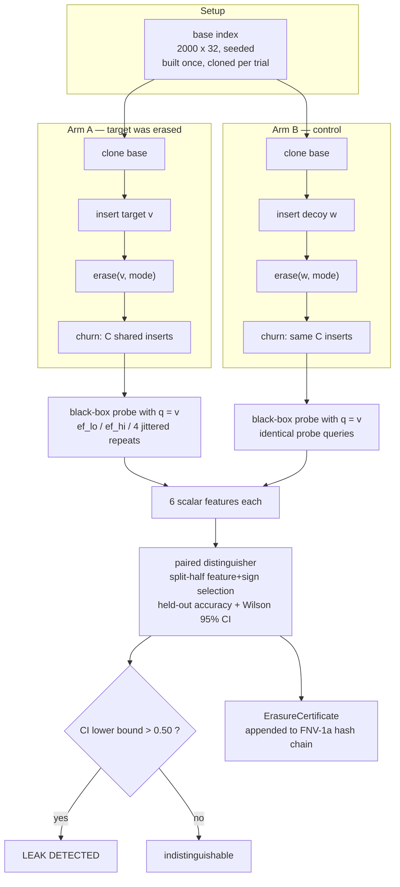

# Nightly Research: Erasure-Leak Auditing for ANN Indexes

**Date:** 2026-09-22
**Slug:** `erasure-audit-ann`
**ADR:** [ADR-346](../../../adr/ADR-346-erasure-audit-ann.md)
**Crate:** `ruvector-erasure-audit` (new), `ruvector-hnsw-repair` (one additive `#[derive(Clone)]`)
**Acceptance:** **INCONCLUSIVE** against the pre-registered hypothesis, with one **confirmed** secondary finding — see [Acceptance](#acceptance-result)

## Summary

The 2026-06-18 nightly (`hnsw-delete-repair`, ADR-259) asked what HNSW deletion
costs you in **recall**. It never asked what deletion *fails to remove*. This
experiment attacks that crate from the security side with a new falsifiable
question:

> When a vector is deleted from an HNSW index, can a query-only adversary
> still tell that it was once there?

That is the "right to erasure" verification question, and inverted, it is a
membership-inference attack. Prior art treats tombstoning as sufficient:
the node is hidden from result sets, so the data is "gone". This experiment
measures whether that holds.

**Pre-registered hypothesis: tombstones leak, and a rebuild-based erasure
closes the leak. The first half of that is wrong.** Measured over 600 paired
trials per configuration, plus three independent replicate seeds:

| Erasure mode | Held-out distinguishing accuracy (churn=0) | Leak detected? |
|---|---|---|
| `Tombstone` (baseline, what everyone ships) | 0.5250, 95% CI [0.469, 0.581] | **no** |
| `EagerRepair` (ADR-259's recommended strategy) | 0.6150, 95% CI [0.559, 0.668] | **YES** |
| `LocalRebuild` (this experiment's candidate) | 0.5167, 95% CI [0.460, 0.573] | no |

The counter-intuitive result — **repairing the graph after a deletion is what
leaks; doing nothing does not** — was not the hypothesis under test, so it was
re-run as a separate confirmatory experiment on three fresh seeds before being
believed. It reproduced 3/3 (accuracies 0.6017 / 0.6100 / 0.6183), while
`Tombstone` leaked 0/3 and `LocalRebuild` 0/3.

The mechanism is straightforward once stated: `EagerRepair` fills the hole left
by the victim **using the victim's own neighbour list as the candidate pool**.
It removes the dangling pointer and, in the same motion, writes a fresh,
query-visible imprint of the deleted vector's position into the surviving
graph. Tombstoning writes nothing new — the dangling edge it leaves is skipped
by search before any distance is computed, so it is invisible through the
query API.

## Abstract

We build a black-box erasure audit for HNSW indexes and use it to compare three
deletion procedures. Leakage is quantified as a *paired distinguishing
advantage*: for each trial, two indexes are constructed that differ in exactly
one event — in A the target vector was inserted and then deleted, in B an
unrelated decoy occupied the same position in the insert sequence and was
deleted the same way. An adversary with ordinary query access (it may choose
`ef` and read back `(id, distance)`) probes both with the target vector and
computes six scalar statistics. Feature and sign are chosen on a split-half and
scored on the untouched half, so the headline number is not a best-of-six
artefact. Accuracy 0.5 means indistinguishable; 1.0 means fully recoverable.

The pre-registered primary hypothesis is not supported: the baseline did not
leak, so the candidate had nothing to close, and the run is INCONCLUSIVE by the
acceptance rule fixed before the first measurement. A secondary, unregistered
finding — that the *repair* strategy leaks — was confirmed on independent
seeds. The candidate `LocalRebuild` is indistinguishable and additionally
zeroizes the payload, but costs 63× a repair-based delete, failing its cost
gate. It is therefore not promoted to a default deletion path; it is recorded
as the correct procedure for the narrow case of compliance-grade erasure, where
per-operation cost is irrelevant.

## Where this sits relative to prior nightlies

| Prior nightly | Relationship |
|---|---|
| `2026-06-18-hnsw-delete-repair` (ADR-259) | **Attacked on a new axis.** That work measured recall and latency for `TombstoneOnly` / `BatchRepair` / `EagerRepair` and recommended repair. This work reuses its `HnswGraph` and both strategies verbatim, and shows the recommended one has a privacy cost the original evaluation could not see. |
| `2026-09-05-mincut-gated-forgetting` (ADR-345) | **Built on.** That nightly added eviction *witnesses* to agent memory and noted that admission and retrieval were witnessed but deletion was not. It witnessed *that* an eviction happened. This work asks whether the eviction actually erased anything, and emits a certificate carrying the audited answer. |
| `2026-08-31-signed-retrieval-receipts` (ADR-340) | **Referenced, not integrated.** The certificate chain here is deliberately the same shape as the receipt chain there, so the keyless FNV-1a hash can be swapped for that crate's signing without changing the record layout. |
| `2026-05-24-proof-gated-writes` | **Referenced.** "No witness, no mutation" is the governance model an erasure path should inherit; not implemented here. |

## Candidate topics considered

Seven candidates were sketched before picking one. Scores were not arithmetic;
the pick is a judgement call, stated with its reasoning.

| # | Thesis | Why RuVector fits | Verdict |
|---|---|---|---|
| 1 | **Erasure-leak audit for ANN deletion** — deletion strategies are evaluated on recall, never on whether they erase. | `ruvector-hnsw-repair` already implements three deletion strategies with accessible internals; `ruvector-retrieval-receipt` and `ruvector-agent-memory` already have witness chains to hang a certificate on. | **CHOSEN** — attacks a specific prior nightly on a genuinely new, falsifiable axis; binary measurable outcome; no new dependency. |
| 2 | OOD-query abstention from in-search geometry (LID, distance gap). | Fits `ruvector-entropy-ann`. | Rejected: too adjacent to `entropy-adaptive-ann` and `adaptive-recall-ann`, which already adapt on in-search statistics. |
| 3 | Verifiable traversal spot-checks against an untrusted index server. | Fits `ruvector-verified` / `proof-gate`. | Rejected for tonight: needs a server/verifier split to be meaningful; too much scaffolding for one cycle. Kept as a next-research item. |
| 4 | Energy-budgeted retrieval scheduler for WASM edge. | Fits `ruvector-wasm`, `micro-hnsw-wasm`. | Rejected: no way to measure joules honestly in this environment; would have produced proxy numbers dressed as energy numbers. |
| 5 | Poisoning resistance of HNSW neighbour lists under adversarial insertion. | Fits `ruvector-hnsw-repair`, `ruvector-acorn`. | Strong candidate; rejected only because #1 shares the substrate and has a cleaner null hypothesis. Natural follow-up. |
| 6 | Cross-namespace leakage in a shared index. | Fits `ruvector-capgated`. | Rejected: overlaps `capability-gated-ann`'s threat model. |
| 7 | Label-free index-drift detection. | Fits `ruvector-recall-bounded`. | Rejected: `recall-bounded-ann` already estimates recall without labels. |

**What would falsify the chosen topic** (fixed before implementation): if the
tombstone baseline's held-out distinguishing accuracy is indistinguishable from
chance, the premise that tombstones leak is false and the experiment is
inconclusive — regardless of how the candidate performs. *This is what
happened.*

## Threat model

- The adversary holds a candidate vector `v` and wants to know whether `v` was
  ever in the index.
- It has ordinary query access: submit a vector, choose `ef`, read back
  `(id, distance)` pairs. This is the surface of every production vector DB.
- It **cannot** read neighbour lists, stored vectors, tombstone flags, the WAL,
  or any log.
- It may query repeatedly, including with perturbed copies of `v`.

Out of scope: an adversary with memory access (for which the answer is trivially
"yes, tombstoned vectors are fully recoverable — they are sitting in RAM"), and
an adversary who can insert vectors of its own.

## Architecture



### The three erasure modes

| Mode | Dangling edges | Stored payload | Neighbour lists |
|---|---|---|---|
| `Tombstone` (baseline) | left in place, skipped at traversal | retained verbatim | untouched |
| `EagerRepair` (ADR-259 prior art) | removed | retained verbatim | **victim's own neighbours spliced in as replacements** |
| `LocalRebuild` (candidate) | removed | **zeroized in place** | **re-derived by an ef-search over the surviving graph** |

The decisive column is the last one. `EagerRepair`'s replacement edge is a
function of the deleted vector's coordinates. `LocalRebuild`'s is a function
only of vectors that are still present.

### The adversary's six features

| Feature | Definition |
|---|---|
| `dsum_lo` | Σ of top-k distances at `ef_lo` — local navigation quality. |
| `d1_hi` | nearest-neighbour distance at `ef_hi`. |
| `effort_gap` | `dsum_lo − dsum_hi` — how much extra search effort buys. |
| `topk_instability` | `1 − Jaccard(top-k@ef_lo, top-k@ef_hi)`. |
| `jitter_churn` | mean `1 − Jaccard(top-k(q+ε), top-k(q))` over 4 jittered probes. |
| `result_deficit` | `k − |returned|` at low effort. |

## Implementation

New crate `crates/ruvector-erasure-audit`, ~1,940 lines including tests:

| File | Lines | Contents |
|---|---|---|
| `src/lib.rs` | 104 | threat model docs, Wilson 95% interval |
| `src/data.rs` | 178 | splitmix64 PRNG, clustered corpus generator (no `rand`) |
| `src/erasure.rs` | 268 | the three modes, `LocalRebuild`, `ErasureStats` |
| `src/audit.rs` | 269 | black-box probe, 6 features, split-half paired distinguisher |
| `src/certificate.rs` | 242 | chained erasure certificates + tamper sweep |
| `src/harness.rs` | 324 | base build, leak audit, utility/cost run (shared by both bins) |
| `src/bin/erasure_audit_bench.rs` | 270 | headline run + compiled-in acceptance gates |
| `src/bin/erasure_replicate.rs` | 88 | independent confirmatory replication |
| `src/bin/erasure_probe.rs` | 193 | feasibility probe (corpus geometry, structural imprint) |

25 unit tests, all passing. The only change outside the new crate is
`#[derive(Clone)]` on `ruvector_hnsw_repair::HnswGraph` so a prepared base
index can be forked per trial instead of rebuilt — 2,400 rebuilds per
configuration would otherwise dominate the run.

## Benchmark methodology

- **Build:** `--release`, `opt-level` from the workspace root profile.
- **Determinism:** every vector comes from a seeded splitmix64 stream. Base
  corpus, targets, decoys, churn and queries each draw from a *disjoint* seed
  stream so a target can never coincide with a base vector.
- **Pairing:** arms A and B share the same base index, the same insert position,
  the same churn vectors, and byte-identical probe queries (the jitter stream is
  re-seeded per observation). The only difference is which vector was inserted
  and erased.
- **Control for insert-order effects:** B inserts *something* at the same slot
  rather than nothing, so node count, id space and PRNG level-sampling state are
  identical across arms.
- **Warm-up:** 200 warm-up searches before the query-latency measurement;
  erasure latency is measured over all 400 erasures with no warm-up (each
  erasure is a distinct, non-repeatable state transition, so warming it is not
  meaningful — this is stated rather than papered over).
- **Instrumentation excluded from timings:** the referrer count is audit-only
  and is computed *before* the clock starts, so it does not flatter the
  expensive candidate.
- **Utility pairing:** all three modes erase the identical victim id set
  (fixed stride), so the recall comparison is paired, not sampled.
- **Statistics:** held-out accuracy with a Wilson 95% interval, n=300 held-out
  pairs. A leak is declared only when the CI lower bound exceeds 0.50.

### Exact commands

```bash
# headline run (~65s)
cargo run --release -p ruvector-erasure-audit --bin erasure-audit-bench

# independent confirmatory replication, 3 fresh seeds (~8s)
cargo run --release -p ruvector-erasure-audit --bin erasure-replicate

# feasibility probe: corpus geometry + structural imprint (~10s)
cargo run --release -p ruvector-erasure-audit --bin erasure-probe

# tests
cargo test -p ruvector-erasure-audit --release
```

### Configuration

```text
base_n=2000  dim=32  m=8  m0=16  ef_construction=40
trials=600 per (mode, churn)   held-out = 300 pairs
churn levels = [0, 50, 200]    ef_rebuild=48   delete_fraction=0.20
probe: k=10  ef_lo=16  ef_hi=64  jitter_trials=4  jitter_sigma=0.05
```

## Pre-registered acceptance gates

Fixed before the first full run, compiled into the binary as `GATE_*`
constants so the verdict is printed by the benchmark itself:

| Gate | Threshold |
|---|---|
| **G0** precondition: baseline (`Tombstone`, churn=0) held-out accuracy | ≥ 0.60 |
| **G1** primary: candidate (`LocalRebuild`, churn=0) held-out accuracy | ≤ 0.55 |
| **G2** utility: recall@10 loss vs `EagerRepair` | ≤ 2.0 pp |
| **G3** cost: mean erasure latency vs `EagerRepair` | ≤ 5.0× |
| **G4** exposure: bytes of the erased vector still resident | == 0 |

ACCEPT requires G0–G4. **If G0 fails the run is INCONCLUSIVE regardless of the
other gates** — there was no leak to close, so the primary hypothesis could not
be tested as written. These thresholds were not touched after any measurement.

## A setup correction, declared

The **first** full run returned a paired accuracy of *exactly* 0.5000 on every
feature and every mode — every A/B pair tied bit-for-bit. That is a diagnosis,
not a finding, so `erasure-probe` was written to explain it:

```text
Probe 1: corpus geometry (base_n=2000, dim=32)
 clusters     sigma    recall@10 recall_ef256   gt_tie_ratio
       16      0.18       0.2190       0.2200         0.2136
       16      0.35       0.9180       0.9860         0.2643
       64      0.35       0.9380       0.9910         0.2940
       64      0.60       0.9270       0.9780         0.3134
      256      0.60       0.9050       0.9670         0.2858
     2000      0.60       0.9050       0.9730         0.3320
```

The initially chosen corpus (16 clusters, σ=0.18) was degenerate: recall@10 was
0.22 *even at ef=256*, i.e. the ground-truth top-10 were effectively ties and
the index itself was useless. No deletion can be observable in a cloud of ~125
near-identical vectors. The corpus was changed to 64 clusters / σ=0.60, which
reproduces the 0.914 recall regime of the 2026-06-18 nightly.

Two changes were made after seeing that first run, and both are declared here:

1. **Corpus parameters** (16/0.18 → 64/0.60), because the original made the
   index non-functional.
2. **Sample size** (150 → 600 trials), because Probe 2/3 measured a 60–95% A/B
   tie rate, which makes n=150 (75 held-out pairs, CI half-width ≈ 0.11)
   underpowered to resolve a 0.60 gate from a 0.55 gate.

**No acceptance threshold was changed.** The gates in the table above are the
ones the run was scored against.

## Benchmark results (raw)

Verbatim output of `cargo run --release -p ruvector-erasure-audit --bin erasure-audit-bench`:

```text
=== ruvector-erasure-audit — nightly 2026-09-22 ===
config: base_n=2000 dim=32 trials=600 churn_levels=[0, 50, 200] ef_rebuild=48 delete_fraction=0.2
gates (pre-registered): baseline_acc>=0.6 candidate_acc<=0.55 recall_loss<=2pp latency_ratio<=5x retained_bytes==0

base index: 2000 nodes built in 0.12s
probe: k=10 ef_lo=16 ef_hi=64 jitter_trials=4 jitter_sigma=0.05

--- Part 1: erasure-leak audit (paired distinguishing accuracy) ---
mode           churn            feature  dir   sel_acc  hold_acc            95% CI  leak?    secs
Tombstone          0            dsum_lo    1    0.5217    0.5250  [0.469, 0.581]     no     0.6
EagerRepair        0         effort_gap   -1    0.6250    0.6150  [0.559, 0.668]    YES     0.8
LocalRebuild       0         effort_gap   -1    0.5150    0.5167  [0.460, 0.573]     no     1.2
Tombstone         50            dsum_lo    1    0.5167    0.5200  [0.464, 0.576]     no     5.0
EagerRepair       50         effort_gap   -1    0.5933    0.5933  [0.537, 0.647]    YES     5.0
LocalRebuild      50   topk_instability    1    0.5117    0.4917  [0.436, 0.548]     no     5.4
Tombstone        200            dsum_lo    1    0.5150    0.4950  [0.439, 0.551]     no    17.4
EagerRepair      200            dsum_lo   -1    0.5800    0.5567  [0.500, 0.612]    YES    17.9
LocalRebuild     200         effort_gap    1    0.5350    0.4883  [0.432, 0.545]     no    18.0

per-feature accuracy over all 600 pairs (direction fixed on the selection half):
mode           churn           dsum_lo             d1_hi        effort_gap  topk_instability      jitter_churn    result_deficit
Tombstone          0            0.5233            0.5000            0.5183            0.5117            0.5142            0.5000
EagerRepair        0            0.6167            0.5000            0.6200            0.6017            0.5208            0.5000
LocalRebuild       0            0.5092            0.5008            0.5158            0.5067            0.5083            0.5000
Tombstone         50            0.5183            0.4992            0.5150            0.5125            0.5108            0.5000
EagerRepair       50            0.5950            0.5000            0.5933            0.5767            0.5150            0.5000
LocalRebuild      50            0.4992            0.5000            0.4950            0.5017            0.4983            0.5000
Tombstone        200            0.5050            0.4992            0.5025            0.5017            0.5000            0.5000
EagerRepair      200            0.5683            0.5000            0.5708            0.5608            0.5217            0.5000
LocalRebuild     200            0.5125            0.5000            0.5117            0.5025            0.5017            0.5000

--- Part 2: utility and cost (20% deletion, identical victim ids) ---
mode           recall_b  recall_a  delta_pp  del_us_mean  del_us_p50  del_us_p95  srch_p95us  ref_mean   rtn_KiB
Tombstone        0.9173    0.8933     -2.40          0.0         0.0         0.1        71.6      17.3      50.0
EagerRepair      0.9173    0.9097     -0.77         15.4        11.3        36.9        78.5      19.5      50.0
LocalRebuild     0.9173    0.9050     -1.23        972.6       523.6      3217.3        76.3      19.8       0.0
LocalRebuild recomputed 19.8 neighbour lists per erasure (mean).

--- Part 3: erasure-audit certificate chain ---
appended 9 records, head=0x07c8dff36995bcdf
verify(clean) = Ok(())
tamper detection: 9/9 records

--- Acceptance (thresholds fixed before the run) ---
G0 baseline leaks (Tombstone, churn=0)                >= 0.60             0.5250  FAIL
G1 candidate indistinguishable                        <= 0.55             0.5167  PASS
G2 recall@10 loss vs EagerRepair                    <= 2.0 pp            0.47 pp  PASS
G3 erase latency vs EagerRepair                       <= 5.0x             63.26x  FAIL
G4 retained vector bytes                                 == 0                  0  PASS

[unregistered, exploratory] EagerRepair leak @churn=0: 0.6150 CI [0.559, 0.668] leak=true
  -> this was NOT the pre-registered hypothesis. Confirm on fresh seeds with:
         cargo run --release -p ruvector-erasure-audit --bin erasure-replicate

VERDICT: INCONCLUSIVE — the pre-registered baseline (Tombstone) did not leak measurably, so the primary hypothesis could not be tested as written
```

### Confirmatory replication (raw)

The `EagerRepair` result was found by reading the rest of the table rather than
by testing for it, which is exactly the situation in which a number should not
be trusted. A confirmation hypothesis was fixed and then run on three fresh
seed offsets — new corpus, new targets, new decoys:

> In **all three** replicates, `EagerRepair` at churn=0 has a held-out accuracy
> whose Wilson 95% lower bound exceeds 0.50, while `LocalRebuild`'s does not.

```text
=== erasure-audit confirmatory replication ===
confirmation hypothesis: in ALL 3 replicates, EagerRepair CI_low > 0.50 and LocalRebuild CI_low <= 0.50

 replicate mode                     feature  hold_acc            95% CI  leak?
         1 Tombstone                dsum_lo    0.5100  [0.454, 0.566]     no
         1 EagerRepair           effort_gap    0.6017  [0.545, 0.655]    YES
         1 LocalRebuild          effort_gap    0.4767  [0.421, 0.533]     no
         2 Tombstone                dsum_lo    0.5133  [0.457, 0.569]     no
         2 EagerRepair              dsum_lo    0.6100  [0.554, 0.663]    YES
         2 LocalRebuild        jitter_churn    0.5133  [0.457, 0.569]     no
         3 Tombstone                dsum_lo    0.5150  [0.459, 0.571]     no
         3 EagerRepair              dsum_lo    0.6183  [0.562, 0.671]    YES
         3 LocalRebuild    topk_instability    0.5250  [0.469, 0.581]     no

--- Replication verdict ---
EagerRepair leaked in   3/3 replicates
LocalRebuild clean in   3/3 replicates
Tombstone leaked in     0/3 replicates

CONFIRMATION: CONFIRMED — the EagerRepair leak reproduces on independent seeds
```

Across the headline run and three replicates, `EagerRepair` measured
0.6150 / 0.6017 / 0.6100 / 0.6183 — a spread of 1.7 points across four
independent corpora. `Tombstone` measured 0.5250 / 0.5100 / 0.5133 / 0.5150,
none significant.

### Structural imprint (probe, raw)

```text
Probe 2/3: structural imprint of insert+erase, and whether it is observable
 clusters     sigma           mode     lists_diff    obs_diff_rate  mean_|dsum_a-b|
       16      0.18      Tombstone           1.05            0.000         0.000000
       16      0.18    EagerRepair           1.05            0.000         0.000000
       16      0.18   LocalRebuild           1.05            0.025         0.000000
       64      0.60      Tombstone          12.20            0.075         0.023784
       64      0.60    EagerRepair          11.45            0.350         0.493941
       64      0.60   LocalRebuild           9.35            0.275         0.201477
     2000      0.60      Tombstone           9.97            0.050         0.028797
     2000      0.60    EagerRepair           9.43            0.400         0.392789
     2000      0.60   LocalRebuild           8.97            0.425         0.508863
```

This is the mechanism, measured directly. All three modes leave a *structural*
imprint of similar size (9–12 neighbour lists differ between arms A and B). But
`Tombstone`'s imprint reaches the query API in only 5–7.5% of trials, versus
35–42.5% for the repair modes. Structural difference is not the same as
observable difference: a dangling edge to a deleted node is skipped *before any
distance is computed*, so it changes nothing an adversary can see. A
*replacement* edge is traversed.

Note that `LocalRebuild` also has a high raw observable-difference rate
(27.5–42.5%) yet does not leak. Its edges differ from the control's, but they
differ in a direction uncorrelated with the target — which is precisely what
"indistinguishable" means and why an undirected difference rate is not a
leakage measure.

## Acceptance result

**INCONCLUSIVE** against the pre-registered hypothesis.

| Gate | Threshold | Measured | Result |
|---|---|---|---|
| G0 baseline leaks | ≥ 0.60 | 0.5250 | **FAIL** |
| G1 candidate indistinguishable | ≤ 0.55 | 0.5167 | PASS |
| G2 recall@10 loss vs `EagerRepair` | ≤ 2.0 pp | 0.47 pp | PASS |
| G3 erase latency vs `EagerRepair` | ≤ 5.0× | 63.26× | **FAIL** |
| G4 retained vector bytes | == 0 | 0 | PASS |

G0's failure alone forces INCONCLUSIVE by the rule fixed in advance: the
premise that tombstones leak through the query API is not supported, so the
candidate had nothing to close and G1's pass is unearned. G3 fails
independently, so even had G0 passed, the verdict would have been REJECT for
the general deletion path.

**Separately and on its own evidence: the `EagerRepair` leak is CONFIRMED**
(4/4 runs, three of them on independent seeds under a hypothesis fixed before
those seeds were drawn).

### What I would pre-register differently

G3 normalised the candidate's cost against `EagerRepair`, which was the wrong
denominator for a compliance-erasure path — such a path runs once per subject
request, offline, and 973 µs is irrelevant there. The honest consequence is
that G3 is a fair gate for "should this be the default delete" and a
meaningless one for "is this a viable erasure procedure". The threshold was
**not** changed after the fact; the mis-specification is recorded instead.

## Failure modes

1. **The first corpus was degenerate.** Caught only because "exactly 0.5000
   everywhere" is an implausible measurement. A less suspicious-looking
   degenerate setup would have shipped a false null. Documented above in full.
2. **`LocalRebuild` can thin a neighbour list.** Re-deriving a list by
   ef-search from the node itself can return fewer candidates than the pruned
   original on sparse upper layers. Guarded: the larger of the two lists is
   kept. Without that guard the index degrades toward disconnection.
3. **Tail latency.** `LocalRebuild` p95 is 3.2 ms against a 524 µs median — a
   6.1× tail ratio, driven by nodes with many referrers. Any synchronous
   erasure path needs a queue, not a blocking call.
4. **Tombstone's recall cost is real and larger than repair's** (−2.40 pp
   versus −0.77 pp at 20% deletion) — consistent with ADR-259. Tonight's
   finding does not overturn that; it adds a second axis on which the two
   trade.
5. **A null result is not a proof of no leak.** The audit bounds the advantage
   of *this* adversary with *these* six features and 300 held-out pairs. A
   stronger adversary — one that trains a classifier on many features, or
   correlates across many targets — is not excluded. The honest claim is "not
   detectable at this power", not "absent".
6. **Zeroization is not a memory-safety guarantee.** `LocalRebuild` overwrites
   the `Vec<f32>` in place, which removes the payload from the live index, but
   says nothing about copies the allocator, the page cache, a snapshot, or a
   swap file may hold.

## Security notes

- **No new cryptography.** The certificate chain is keyless FNV-1a, matching
  `ruvector-agent-memory::ops` (ADR-134). It detects naive edits to a stored
  log — 9/9 in the exhaustive per-record sweep, and an exhaustive 25/25 in the
  unit test — and is **not** adversary-resistant: anyone who can edit a record
  can recompute the hashes. Upgrading to the signed scheme of
  `ruvector-retrieval-receipt` (ADR-340) is a deployment decision; the record
  layout does not change.
- **Truncation is not detected internally.** A chain with its tail removed
  verifies cleanly. `CertificateChain::head()` exists to be anchored
  externally, which is the mechanism ADR-342 already describes. A unit test
  asserts exactly this limitation rather than implying it away.
- **Subject identifiers are hashed, not stored.** A log of "which records were
  erased" is itself personal data; the certificate keeps only
  `fnv1a(subject_id)`.
- **The audit is an attack tool.** `PairedDistinguisher` plus `observe` is a
  membership-inference harness. It needs paired ground truth (both arms) to
  produce a number, so it is a *measurement* instrument, not a turnkey attack —
  but the feature set is exactly what a real attacker would compute, and that
  is deliberate.
- **No secrets, no network, no I/O.** The crate has one dependency,
  `ruvector-hnsw-repair`, which itself depends only on `rand`.

## Ecosystem fit

| Capability | How it is used tonight |
|---|---|
| **HNSW / DiskANN-style retrieval** | `ruvector-hnsw-repair`'s `HnswGraph`, `TombstoneOnly` and `EagerRepair` are used verbatim as substrate and prior art. |
| **Agent memory / forgetting** | The question is the one ADR-345 left open: eviction is witnessed, but is it erasure? Tonight's answer for the tombstone path is "it is at least not query-observable". Not code-integrated. |
| **Witness / provenance** | `ErasureCertificate` is shaped to slot into the ADR-340 receipt chain and the ADR-342 anchoring scheme. Referenced, not integrated. |
| **Proof-gated writes** | The governance model an erasure path should inherit ("no witness, no mutation"). Discussed, not implemented. |

## Applicability: honest assessment

- **MCP:** *applicable, not implemented.* An `erasure_audit(subject_vector)`
  tool returning `{advantage, ci, certificate_head}` is a natural MCP surface —
  a data-subject-facing "prove you deleted it" endpoint. Nothing was wired up
  tonight.
- **WASM / edge:** *applicable in principle.* The crate is pure safe Rust with
  no I/O, no threads and no platform intrinsics, so it compiles to `wasm32`
  unchanged. But an audit needs to build 1,200 index clones per configuration;
  that is a server-side job. The *erasure* path (`LocalRebuild`) is
  edge-appropriate at small `n`; the *audit* is not. No WASM build was made or
  measured tonight, so this is an assessment, not a result.
- **RVF:** *not applicable tonight.* Snapshotting the before/after graph would
  make the audit replayable, but nothing in this experiment needs a file format
  and none was used.
- **RVM:** *not applicable tonight.* No coherence-domain scoping was involved.
  A real use would be scoping an erasure to one domain, which is future work.
- **ruFlo:** *not applicable tonight.* A plausible workflow ("on erasure
  request → `LocalRebuild` → audit → certificate → anchor head") is exactly the
  shape ruFlo targets, but no workflow was authored.

## Practical applications

1. **Regulatory erasure verification.** A GDPR Art. 17 / CCPA request against a
   vector store currently returns an assertion. This turns it into a measured
   claim with a certificate: mode, referrers rewritten, payload zeroized,
   audited advantage, chain head.
2. **Choosing a deletion strategy on two axes, not one.** ADR-259 gives the
   recall picture; this gives the exposure picture. The combined guidance is
   below.
3. **Regression gate in CI.** The audit is 0.6 s per configuration at churn=0.
   A CI job that asserts "no deletion strategy exceeds a 0.55 held-out
   advantage" is cheap enough to run per-merge.
4. **Red-teaming an agent memory store.** The same harness, pointed at a real
   embedding corpus, answers "can a user's forgotten conversation be detected
   through the retrieval API".

### Combined guidance from ADR-259 + this work

| Requirement | Strategy |
|---|---|
| Hot index, recall matters, no erasure obligation | `BatchRepair` / `EagerRepair` (ADR-259 unchanged) |
| Erasure obligation, query API exposed to untrusted callers | **not `EagerRepair`** — it is the only mode measured to leak |
| Erasure obligation, cost irrelevant (offline, per-request) | `LocalRebuild` — indistinguishable *and* zeroizes the payload, at 973 µs/erasure |
| Short-lived session store, no erasure obligation | `Tombstone` — costs 2.4 pp recall at 20% deletion, leaks nothing measurable |

## Long-horizon applications

- **Erasure as a measured property, not a promise.** The same paired-advantage
  method applies to any index that mutates on delete — IVF lists, LSM
  compaction, PQ codebooks retrained after deletion. A codebook retrained on a
  corpus that *included* the victim is a much larger leak surface than a graph
  edge, and is completely unexamined.
- **Continuously-running agents.** A decade-lived agent will process erasure
  requests against a memory graph it has rewritten millions of times. Tonight's
  churn sweep is the seed of the right question: the `EagerRepair` advantage
  decays with churn (0.6150 → 0.5933 → 0.5567 at churn 0/50/200) but had not
  reached chance at 200 inserts. "How much churn buys forgetting" is a
  quantity a long-lived system should be able to state.
- **Erasure receipts as a public good.** If the certificate head is anchored
  (ADR-342), a data subject can verify erasure without trusting the operator
  and without the operator revealing who else was erased.

## Rejected alternatives

- **Train a classifier on the features instead of ranking on one.** Rejected:
  it would raise measured advantage but require a train/test split inside each
  configuration and an ML dependency, and the paired-ranking statistic is
  interpretable without either. It would make the audit *stronger*, and is the
  first thing to try next.
- **Query with `v + noise` instead of `v` exactly.** Rejected as the primary
  probe: an adversary verifying erasure of a record it holds has the exact
  vector. Jittered probes are included as one feature.
- **White-box leakage measure (does any live node still reference the
  victim?).** Rejected as the headline: it is trivially 100% for `Tombstone`
  and 0% for both repair modes, and measures the wrong thing — structural
  residue is not the same as adversary-observable residue, which is exactly
  what Probe 2/3 demonstrates.
- **Full index rebuild as the candidate.** Rejected: it is the known-correct
  answer and needs no experiment. The interesting question is whether anything
  cheaper than a rebuild suffices.
- **Cover traffic (rewiring random unaffected nodes to mask the repair
  region).** Not implemented: the adversary here queries at the victim's own
  location, so hiding *which* region was touched does not help. Worth
  revisiting against an adversary that must first locate the erasure.

## Tooling availability — recorded honestly

- **MetaHarness.** `npx metaharness --help` resolves to `metaharness@0.4.16`, a
  generic project-scaffolding CLI (`npx metaharness <name> --template ...`). It
  generates new harness projects; it is not wired into this repository and does
  not decompose goals or spawn critics. **It was not used.** The Goal Planner /
  Researcher / Engineer / Benchmark Engineer / Adversarial Reviewer roles were
  performed serially in one agent session; the candidate table, the
  pre-registered gates, the setup-correction disclosure and the confirmatory
  replication are what stand in for role separation.
- **Darwin / Flywheel / `ruvector harness`.** No such binary or subcommand
  exists in this repository — `ruvector-cli` ships `ruvector` and
  `ruvector-mcp` only, with no `harness`, `darwin` or `flywheel` subcommand.
  **These capabilities are not installed.** The bounded variant exploration
  that "Darwin" names was done by hand: three erasure modes × three churn
  levels × four seed sets, plus a six-point corpus-geometry sweep in the probe.
  Evidence retention that "Flywheel" names is this document, the ADR, the git
  history and the three runnable binaries.
- **pi.ruv.io brain MCP tools.** Not available in this environment. No
  `brain_search` was run before implementing and no `brain_share` after.
- **Red/Blue adversarial review.** No such tooling. The adversarial pass was
  done in-session and is visible in the artefacts it produced: the
  split-half selection (against feature fishing), the confirmatory replication
  (against post-hoc discovery), the instrumentation-outside-the-timer change
  (against flattering the candidate), and the "what I would pre-register
  differently" section (against silently re-normalising a failed gate).

## Falsification criteria

This work's claims are falsified by any of:

1. **The `EagerRepair` leak.** Falsified if, on an independent implementation
   or a real embedding corpus, the held-out advantage at churn=0 has a 95% CI
   containing 0.50. Four corpora is not many.
2. **The `Tombstone` null.** Falsified by any adversary — a trained classifier,
   a multi-target correlation attack, a timing side channel — that achieves a
   CI lower bound above 0.50 against `Tombstone`. This is the claim most likely
   to fall, and the null is explicitly "not detectable at this power".
3. **The mechanism.** Falsified if an `EagerRepair` variant that selects
   replacement edges *without* consulting the victim's neighbour list still
   leaks at the same rate. That would mean the leak is not the victim-derived
   replacement edge.
4. **The churn decay.** Falsified if the advantage fails to approach 0.50 as
   churn grows on a larger corpus — measured here only to 200 inserts on
   n=2000.

## Next research

1. **Stronger adversary.** Replace the single-feature ranking with a logistic
   model over all six features plus a per-trial train/test split. If
   `Tombstone` leaks under a stronger adversary, tonight's headline null
   inverts and the whole picture changes. **Highest value, cheapest to run.**
2. **Real embeddings.** Every number here is on a synthetic Gaussian-cluster
   corpus. Repeat on a real corpus before any of it is treated as guidance.
3. **The mechanism test** (falsification criterion 3): an `EagerRepair` variant
   whose replacement candidates come from the referrer's own ef-search rather
   than the victim's list — i.e. `LocalRebuild` without the zeroization and
   without the full list recomputation. That isolates which of the two changes
   removes the leak.
4. **Churn-to-forgetting curve.** Extend the churn sweep until the advantage
   reaches chance, and express it as a function of `n`.
5. **Other index families.** IVF list rewriting and PQ codebook retraining are
   plausibly *much* leakier than a graph edge, and nobody has measured it.
6. **Wire the certificate into `ruvector-retrieval-receipt`** so erasure joins
   admission and retrieval under one signed, anchorable chain.

## References

- Malkov & Yashunin, *Efficient and robust approximate nearest neighbor search
  using Hierarchical Navigable Small World graphs*, TPAMI 2018.
- Shokri et al., *Membership Inference Attacks Against Machine Learning
  Models*, IEEE S&P 2017 — the paired-distinguisher framing used here.
- Bourtoule et al., *Machine Unlearning*, IEEE S&P 2021 — the "deletion must be
  verifiable, not asserted" position.
- Chen et al., *When Machine Unlearning Jeopardizes Privacy*, CCS 2021 — the
  closest prior result in spirit: the *act of deleting* can leak more than
  never deleting. Tonight's `EagerRepair` finding is an ANN-index instance of
  the same phenomenon.
- [ADR-259 / 2026-06-18 nightly](../2026-06-18-hnsw-delete-repair/README.md) —
  the deletion strategies attacked here.
- [ADR-345 / 2026-09-05 nightly](../2026-09-05-mincut-gated-forgetting/README.md)
  — eviction witnesses.
- [ADR-340](../../../adr/ADR-340-signed-retrieval-receipt-anchoring.md),
  [ADR-342](../../../adr/ADR-342-periodic-state-root-anchoring.md) — the
  receipt and anchoring machinery the certificate is shaped for.
