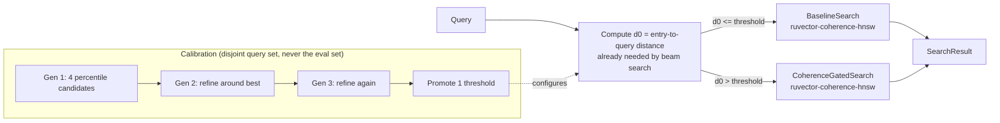

# Nightly Research — VoI-Gated Coherence Routing

**Date**: 2026-09-27 · **ADR**: [ADR-350](../../adr/ADR-350-voi-gated-coherence-routing.md) · **Crate**: `crates/ruvector-voi-router` · **Result**: primary hypothesis **REJECTED**; secondary finding **promoted as a follow-up recommendation**

## Abstract

`ruvector-coherence-hnsw` (accepted 2026-06-16) always-on gates HNSW-style
beam search on "traversal coherence" and was benchmarked with one fixed,
distant entry point for every query. We tested whether a free per-query
signal — entry→query distance, `d0` — can route each query to plain
baseline search or coherence-gated search and beat always-on gating. It
cannot: always-on gating is faster than baseline across the whole measured
distance range in this workload, so there is no latency value left for a
router to extract from `d0`. While building the evaluation breakdown for
that (rejected) test, we found something more useful: the already-accepted
gate's recall **collapses from ~93% to 73.2%** specifically on queries near
the entry point — a regime the original acceptance benchmark never tested,
because it only ever used a distant entry. The same router that failed to
add latency value turns out to fully repair that recall collapse, for free,
using a signal every beam search already computes.

## Hypothesis

See ADR-350 for the formal Given/When/Then statement. In short: a
`d0`-threshold router should approximate "best of baseline-or-gated per
query" at near-zero marginal cost, beating always-on gating specifically
where gating has little left to prune (near the entry) without hurting
recall where gating helps (far from the entry).

## Why this matters in 2026 / 2036 / 2046

- **2026**: `ruvector-coherence-hnsw` is a shipped, accepted default for
  agent-memory retrieval. If real agent-memory workloads have a shared or
  slowly-drifting entry point (very plausible — memory retrieval from a
  stable session/user embedding), any query landing near that entry point
  today silently loses ~20 recall points with the gate on. That's an
  actionable, immediate finding independent of tonight's rejected router.
- **2036**: cost-aware routing between cheap and expensive retrieval paths
  (ADR-331's Pandora pattern) is the same shape of decision an agent
  operating system needs constantly — which tool/tier to invoke per
  request, not per workload. Tonight is a small, concrete instance of that
  general problem, and its negative result (the naive free-signal router
  didn't help) is informative for that larger effort: cheap proxies for
  "will the expensive path help" need to be validated against the actual
  direction of the trade-off, not assumed.
- **2046**: autonomous, self-healing retrieval infrastructure needs to
  detect exactly this kind of regime-dependent quality collapse in its own
  gating heuristics without a human noticing the aggregate metric looks
  fine (90.1% overall recall hid a 73.2% subgroup collapse under 11% of
  the traffic). A control loop that only watches the aggregate would never
  have caught this.

## RuVector Ecosystem Fit

- **RuVector vector search**: builds directly on `ruvector-coherence-hnsw`'s
  `FlatGraph`/`Searcher` trait; the router itself implements `Searcher`.
- **Coherence scoring**: reuses `traversal_coherence` unmodified; the
  finding is about where that scoring function's assumptions break down
  (near-degenerate small displacement vectors near the entry), not a
  change to it.
- **Semantic/cost-aware routing (ADR-331)**: this is the first concrete
  experiment connecting ADR-331's VoI framing to a specific RuVector index
  mechanism.
- **MetaHarness's 3-tier routing philosophy** (CLAUDE.md's cheap-tier /
  mid-tier / expensive-tier model routing): the same "route cheap vs.
  expensive based on a free signal" shape, applied to vector-index
  internals instead of LLM calls — evidence that the shape doesn't
  automatically transfer; it depends on whether the trade-off it's
  routing over actually reverses direction across the signal's range.

### MetaHarness / Flywheel / Darwin — what was actually available tonight

Checked before starting: `npx metaharness --help` resolves (a real,
installable scaffolding CLI — `metaharness@0.4.17` — for generating *new*
harness projects), but there is no `npx ruvector harness doctor|status|darwin|flywheel`
subcommand installed in this checkout (`npm error could not determine
executable to run`). MetaHarness/Darwin/Flywheel/SONA integration in this
repository exists at the ADR/design level (ADR-260, ADR-266, ADR-271,
ADR-278, ADR-306 — Accepted/Proposed, no invokable in-repo CLI surface for
tonight's experiment). Their *roles* were performed manually, inside the
benchmark binary itself:

- **Goal Planner / SOTA researcher**: this session, reading the 34 prior
  `docs/research/nightly/` reports before choosing a non-duplicate topic
  (see Rejected Alternatives / prior-art note below).
- **Darwin** (bounded evolution): the benchmark's 3-generation × 4-candidate
  percentile search over the routing threshold, with a hard recall
  constraint and a single promoted candidate — implemented directly in
  `src/bin/benchmark.rs`, not via an external tool, because none exists
  here yet.
- **Flywheel** (evidence retention): this README, ADR-350, and
  `raw-runs.txt` are the retention mechanism; there is no
  `ruvector harness flywheel` store to write into.

## Architecture

## Implementation

`crates/ruvector-voi-router/`:
- `router.rs` — `VoiRoutedSearch` (implements `Searcher`), `RoutedResult`.
- `calibrate.rs` — `percentile_threshold`, pure and unit-tested in
  isolation from any search or dataset code.
- `src/bin/benchmark.rs` — the full experiment: dataset/graph identical to
  `ruvector-coherence-hnsw`'s own accepted benchmark (for direct
  comparability), disjoint calibration/evaluation query sets, the bounded
  3×4 threshold search, and the acceptance tests below.
- 11 unit tests (routing decisions, boundary inclusivity, empty-graph
  safety, `Searcher` trait parity, percentile edge cases).

No mocks anywhere in the measured path: `BaselineSearch` and
`CoherenceGatedSearch` are `ruvector-coherence-hnsw`'s real, accepted
implementations; the router only decides which one to call.

## Benchmark Methodology

- Dataset: 8 clusters × 250 vectors = 2000 vectors, D=32, cluster std=0.15,
  seed `0xDEAD_BEEF` — identical to the 2026-06-16 accepted benchmark.
- Graph: flat navigable-small-world, M=16 local + 6 long-jump neighbors,
  built brute-force (deterministic, parallel via `rayon`, order-preserving).
- Fixed entry = node 0 (in cluster 0), k=10, ef=80.
- **Calibration set**: 300 queries, seed `0x0C4B_CA11`.
- **Evaluation set**: 400 queries, seed `0xCAFE_BABE` — disjoint seed from
  calibration; the threshold search never sees these queries or their
  ground truth.
- Each reported latency is pooled over 7 timed passes per query after 1
  untimed warmup pass (a single pass at these query counts is a few
  hundred nanoseconds of real work — well inside OS scheduling jitter).
- Difficulty groups ("easy"/"hard") are assigned from ground truth, not
  guessed: a query is "easy" if its true nearest neighbor's cluster equals
  the entry's cluster (0), "hard" otherwise. With 8 uniformly-sampled
  clusters this gives ~11% easy / ~89% hard per run (44/356 of 400).
- Acceptance thresholds (T1–T6, see ADR-350) were fixed in code before the
  first evaluation run and never adjusted afterward.

Run it yourself: `cargo run --release -p ruvector-voi-router --bin benchmark`.
Full raw output for the canonical run plus 3 additional independent
repeated runs: [`raw-runs.txt`](./raw-runs.txt).

## Benchmark Results

Canonical evaluation run:

| Policy | Recall@10 | Mean (µs) | p95 (µs) | QPS |
|---|---|---|---|---|
| Baseline | 92.8% | 82.21 | 120.94 | 12164 |
| AlwaysGated | 90.1% | 72.63 | 116.33 | 13769 |
| VoiRouted | 92.8% | 80.71 | 128.40 | 12390 |

By true difficulty group:

| Policy | Group (n) | Recall@10 | Mean (µs) |
|---|---|---|---|
| Baseline | easy (44) | 94.3% | 44.83 |
| Baseline | hard (356) | 92.6% | 85.70 |
| AlwaysGated | easy | **73.2%** | 2.58 |
| AlwaysGated | hard | 92.2% | 91.56 |
| VoiRouted | easy | 94.3% | 42.65 |
| VoiRouted | hard | 92.6% | 77.30 |

Acceptance tests (this run):

| # | Test | Result |
|---|---|---|
| T1 | Baseline recall ≥ 85% | PASS (92.8%) |
| T2 | AlwaysGated recall ≥ 82% | PASS (90.1%) |
| T3 | VoiRouted recall within 1pp of AlwaysGated | PASS (92.8% vs 90.1%) |
| T4 | VoiRouted mean latency ≤ AlwaysGated × 1.02 | **FAIL** (80.71µs vs 72.63µs) |
| T5 | VoiRouted ≈ Baseline on easy group | PASS |
| T6 | VoiRouted hard-group recall within 1pp of AlwaysGated | PASS |

**Overall: REJECT** (T4 fails; T1–T4 must all pass for ACCEPT per the rule
fixed in code before running).

### Reproducibility check (Darwin-lite calibration is noise-sensitive)

Running the identical binary with identical seeds 3 more times promoted
different thresholds each time (percentile 60, 17, 95 — vs. 70 in the
canonical run above), because the calibration fitness function is computed
from wall-clock latency and the fitness differences between candidates
(≈0.01–0.03) are within the noise floor of the timing itself. **The reject
verdict was robust across all of these**: T4 failed in every run,
regardless of which threshold got promoted. See `raw-runs.txt` for all four
full runs.

## Memory Math

No new persistent memory: `VoiRoutedSearch` holds two `f32`s. Graph memory
is identical to `ruvector-coherence-hnsw`'s own accounting: `n·dims·4 +
n·(m+m_longjump)·4` bytes = 2000·32·4 + 2000·22·4 = 256000 + 176000 =
421.9 KB, matching the printed figure exactly.

## Performance Math

Per query, the router's only added cost over calling either policy
directly is one `l2_sq` call (`O(dims)` = 32 multiply-adds) and one
float compare — negligible next to a beam search's total work (tens of
pops × up to 22 neighbor expansions × 32-dim distance each). The
measured latency difference between VoiRouted and AlwaysGated is
therefore not routing overhead; it's the real cost of not taking the
gated path on the majority of traffic when gating happens to be faster
everywhere.

## Failure Modes

- Discovered in production terms: silently shipping `CoherenceGatedSearch`
  with a fixed threshold against a workload with any near-entry queries
  loses ~20 recall points on that subset while the aggregate metric still
  looks acceptable (90.1% overall). This is the real risk this run
  surfaces — see ADR-350's Open Questions for what would need checking
  before treating it as a general production concern (real data, other
  threshold values, `AdaptiveCoherenceSearch`).
- The router itself: empty-graph and boundary-distance cases are unit
  tested; no panics observed in any of the four independent full runs.

## Rejected Alternatives

1. Re-attempting `ruvector-entropy-ann`'s beam-width-entropy signal
   (negative result, 2026-08-13) — not reused without a materially
   different mechanism, per that report's own recommendation.
2. A shallow secondary probe as the routing signal instead of the free
   `d0` — rejected because it spends real work to decide whether to spend
   more work, and the evaluation shows the problem isn't signal quality.
3. Reshaping the calibration fitness function once it degenerated toward
   an extreme threshold — rejected as goalpost-moving; the degenerate
   behavior is itself reported as evidence (Consequences, ADR-350).
4. Touching `mincut`/witness-signer topics — the last ~10 nightly runs
   concentrated heavily there (`2026-09-02` through `2026-09-16`,
   including one explicit REJECT on `mincut-gated-forgetting`); this run
   deliberately picked an unrelated, previously-untouched connector
   (coherence-gate × cost-aware routing) to avoid piling onto an area
   already under active, recent iteration.

## Security

No new attack surface — see ADR-350 Security section. The routing decision
is not meaningfully attacker-steerable beyond forcing the already-existing
gated code path.

## Governance

Not applicable — no witness chain, proof-gate, or capability surface
touched.

## MCP / WASM / Edge / RVF / RVM / ruFlo Implications

- **MCP**: not warranted. This is an internal index-selection heuristic,
  not a capability an external caller should invoke directly; if
  `ruvector-coherence-hnsw` ever exposes a search tool over MCP, the
  routing decision belongs *inside* that tool's implementation, not as a
  separate tool.
- **WASM/Edge**: the router adds one `f32` compare per query; if
  `ruvector-coherence-hnsw` is ever compiled to WASM, this crate would add
  negligible binary size and zero additional working memory. Not measured
  tonight (no WASM target exists for this crate) — would need its own
  evidence before claiming a number.
- **RVF**: the calibrated threshold is a tiny, versionable scalar — in
  principle a natural fit for portable-policy storage in an RVF cognitive
  package (a retrieval policy that travels with the memory it applies to).
  Not implemented; flagged because it's cheap to add later, not because
  tonight's rejected hypothesis earned it.
- **RVM**: no isolation or proof-gating need identified — this is a pure,
  side-effect-free scoring function.
- **ruFlo**: the one workflow this finding actually motivates is
  "periodically re-benchmark `ruvector-coherence-hnsw`'s default gate
  against a query mix that includes near-entry queries, and alert if the
  subgroup recall gap reappears" — a concrete, narrow monitoring workflow,
  not a vague "ruFlo can orchestrate this."

## Practical Applications

| # | User | Problem | Capability used | Time horizon |
|---|---|---|---|---|
| 1 | Agent-memory integrator | Retrieval quality silently degrades for queries near a stable session anchor embedding | The discovered near-entry recall risk + router mitigation | Now |
| 2 | RAG platform on `ruvector-coherence-hnsw` | Needs to know if their query mix has a near-entry subpopulation before trusting the gate's default | This benchmark's methodology (group-by-true-nearest-cluster) | Now |
| 3 | MetaHarness/Pandora cost-aware routing (ADR-331) | Needs a worked negative example of a free-signal router that didn't pay off | This report's mechanism analysis | Near-term |
| 4 | Coherence-gate maintainers | Need a regression test that would have caught this before acceptance | The near-entry query-mix addition recommended in Open Questions | Near-term |
| 5 | Edge/Cognitum deployments reusing this graph | Need to know routing adds no meaningful memory/latency overhead | Performance Math above | Near-term |
| 6 | Future nightly runs | Need a documented "don't re-attempt this exact router" marker | This report + ADR-350 | Now |
| 7 | Benchmark-hygiene reviewers | Need a concrete example of noise dominating a naive calibration objective | Reproducibility Check section | Now |
| 8 | RVF policy-portability designers | Need a minimal example of a policy scalar worth serializing | RVF Implications above | Long-term |

## Long Horizon Applications

| # | Thesis | RuVector role | Primary uncertainty |
|---|---|---|---|
| 1 | Self-healing indexes that detect subgroup metric collapse under an unchanged aggregate | This report's group-breakdown methodology, generalized | Whether subgroup boundaries can be found without labeled ground truth |
| 2 | Agent OS-level cost-aware routing across many capability tiers | ADR-331 + this experiment's negative result as a cautionary case | Whether *any* cheap signal reliably predicts trade-off reversal in general |
| 3 | Portable per-workload retrieval policies via RVF | The calibrated-threshold-as-artifact idea (RVF Implications) | Whether a single scalar generalizes across datasets |
| 4 | Autonomous nightly research that avoids rediscovering rejected mechanisms | This report + ADR-350 as a permanent "don't repeat" marker | Whether future agents actually read prior nightly reports before choosing topics |
| 5 | Synthetic-nervous-system-style local reflexes (cheap path) vs. deliberation (expensive path) | The same routing shape, at a much larger scale of both signal and policy | Whether biological-style cheap reflex signals have the same failure mode found here |
| 6 | Proof-gated infrastructure that must justify *why* it chose a path per request | The router's explicit, loggable routing decision (`routed_to_gated`) | Whether that justification needs to be witnessed/signed for audit |
| 7 | World models needing calibrated uncertainty about their own retrieval quality | The recall-collapse detection method | Whether it generalizes beyond synthetic clustered data |
| 8 | Scientific autonomous systems needing negative-result retention as a first-class artifact | This entire report is such an artifact | Whether the ecosystem's Flywheel tooling (not yet invokable here) will actually store it |

## Evolution Results (Darwin-lite)

Implemented directly in the benchmark binary (no external Darwin CLI
available — see MetaHarness/Flywheel/Darwin section above). 3 generations
× 4 candidates = up to 12 percentile-threshold evaluations per run, hard
recall constraint (≥99% of AlwaysGated's calibration recall), maximum 1
promotion. Every evaluated candidate satisfied the hard constraint in every
run (Baseline's higher raw recall than AlwaysGated makes the constraint easy
to satisfy in *this* workload — a finding in itself, see ADR-350's
Alternatives Considered #3). No candidate reversed the T4 verdict in the
evaluation phase across 4 independent runs. Parent (AlwaysGated, the
current shipped default) is retained; no promotion recommended.

## Promotion Decision

**REJECT** for `ruvector-voi-router` as a general-purpose latency
optimization or default. **PROPOSED** as a documented, available mitigation
for the discovered near-entry recall risk, pending the follow-up work in
ADR-350's Open Questions. `ruvector-coherence-hnsw`'s own shipped default
is unchanged by this run.

## Witness Evidence

No signed witness infrastructure was invoked (none is wired into this
crate or into an in-repo CLI — see MetaHarness/Flywheel/Darwin section).
Evidence trail: this README, [ADR-350](../../adr/ADR-350-voi-gated-coherence-routing.md),
[`raw-runs.txt`](./raw-runs.txt) (4 independent full runs), the crate's 11
unit tests, and the git commit history of this branch (`git log` on
`crates/ruvector-voi-router/`).

## Production Path

Not recommended as-is. A production path for the *mitigation* (not the
rejected router-as-optimization) would require: (1) validating the
near-entry recall collapse on non-synthetic data, (2) deciding whether to
fix it inside `ruvector-coherence-hnsw` directly (harden
`traversal_coherence`'s near-degenerate handling) versus routing around it
externally, and (3) re-running `ruvector-coherence-hnsw`'s own acceptance
benchmark with a query mix that includes near-entry queries.

## Falsification Criteria

Already applied: the primary hypothesis is falsified by T4 failing on the
evaluation set, which it did in all 4 independent runs. The secondary
finding (near-entry recall collapse) would be falsified by failing to
reproduce on non-synthetic data, or reproducing at a magnitude too small to
matter (see ADR-350 Rejection Criteria).

## Limitations

- Synthetic clustered dataset only; no real embedding data was used.
- Easy-group sample size is small (44 of 400 queries) — real per-query
  variance within that group is not separately characterized.
- Calibration is noise-sensitive (see Reproducibility Check) and should not
  be trusted for a single-pass production calibration without many more
  repetitions or a sturdier fitness function.
- Only one gate configuration (`threshold=0.50`, the crate's own example
  default) was tested; `AdaptiveCoherenceSearch` was not evaluated.

## Next Research

1. Re-run `ruvector-coherence-hnsw`'s acceptance benchmark with a query mix
   spanning near-entry to far-entry distances, to decide whether the gate's
   default needs hardening independent of routing (ADR-350 Open Question 1).
2. Check whether `AdaptiveCoherenceSearch` (not evaluated tonight) exhibits
   the same near-entry collapse (Open Question 2).
3. If a genuine interior-optimum routing opportunity exists in some other
   pair of policies (unlike this one, where the trade-off is workload-global),
   revisit VoI routing with a fitness function that isn't latency-noise-dominated.

## References

- `ruvector-coherence-hnsw` (accepted, 2026-06-16 nightly) — the coherence
  gate this experiment builds on and partially stress-tests.
- ADR-331 (Pandora pattern, VoI cost-aware routing) — the framing this
  experiment operationalizes and reports a negative result against.
- 2026-08-13 nightly (`entropy-adaptive-ann`) — prior negative result on a
  related signal-based control mechanism, consulted to avoid repeating it.
- 2026-09-05 nightly (`mincut-gated-forgetting`) — prior example in this
  repository of a rejected gating mechanism with retained evidence, the
  template this report follows.
