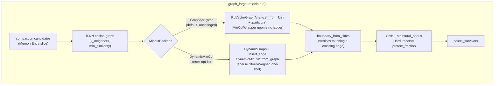

# Nightly Research — A Faster `ruvector-mincut` Backend Closes ADR-345's Latency Blocker, Surfaces a New Connectivity Failure Mode

**Date:** 2026-09-28
**Slug:** `mincut-backend-latency`
**ADR:** [ADR-350](../../../adr/ADR-350-dynamic-mincut-backend-for-graph-forget.md)
**Crate:** `ruvector-agent-memory` (`graph_forget` module, `mincut-forget` feature), no changes to `ruvector-mincut` itself
**Acceptance:** **REJECT** for `MincutGatedForgetting` production use (same verdict as ADR-345) — **ACCEPT** for this run's own narrower hypothesis (backend latency). See [Acceptance Result](#acceptance-result).

## Summary

The 2026-09-05 nightly (ADR-345) rejected `MincutGatedForgetting` — a
structural, min-cut-boundary eviction signal for `ruvector-agent-memory`
compaction — on two grounds: it was 1,800-2,700x slower than the scalar
baseline (`RuVectorGraphAnalyzer::partition()` cost 76ms-11.4s per call for
50-400 vertex graphs), and even ignoring cost, it made zero measurable
difference (0.0pp gap) to bridge-memory survival at the 84-entry corpus that
speed constraint forced. Both that nightly and the 2026-09-11 follow-up
(ADR-346, which fixed a separate determinism bug in the same code path)
explicitly asked, as their next step, whether a lower-level `ruvector-mincut`
API — `DynamicMinCut` — would avoid the overhead.

This run answers that question directly: it adds `MincutBackend::DynamicMinCut`
(a one-shot sparse Stoer-Wagner solver, `ruvector_mincut::algorithm::DynamicMinCut`)
as an opt-in alternative to the existing `RuVectorGraphAnalyzer` backend, and
re-runs ADR-345's exact benchmark — same 84-entry corpus, same thresholds,
unmodified — with both backends side by side in one run.

**The performance axis flips from FAIL to PASS.** Compaction slowdown versus
the scalar baseline drops from 2,711-2,764x (this run's reproduction of the
original finding) to 37.8-42.0x — under the pre-registered 100x
"background job" gate — and `DynamicMinCut` is 64.6-73.2x faster than
`RuVectorGraphAnalyzer` on the identical corpus. A separate scaling probe
puts a 2,000-vertex one-shot min-cut at 286ms versus an extrapolated ~85s
for the old backend.

**The effectiveness axis does not change**: both backends measure the exact
same 0.0pp bridge-survival gap that ADR-345 found, confirming that finding
was never a backend artifact. Because the new backend is now cheap enough to
test at scale, this run went further and ran the same experiment at 10x and
50x the original corpus size — something ADR-345 could not afford to try.
The result is a **new, distinct failure mode**: the boundary set is
genuinely non-empty at the original 84-entry scale (6/84 candidates) but
never moves the eviction outcome, and at 840 and 4,200 entries it is
**empty at every sampled scale** — the underlying k-NN similarity graph
disconnects (an isolated low-similarity bridge vertex is increasingly likely
as the absolute bridge count grows), which silently turns the structural
signal off for the entire compaction pass, not just the disconnected vertex.

Net: `MincutGatedForgetting` remains rejected for production, per ADR-345's
original verdict — but the reason has narrowed and sharpened considerably,
from "unusably slow, and separately, no measurable effect" to "the
performance blocker is resolved, and the effectiveness problem is real,
reproducible at three scales, and now partially explained (graph
disconnection at scale, not just an 84-entry sample-size artifact)." A
failed hypothesis with better evidence than before is the intended nightly
outcome.

## Abstract

Three questions, asked in order: (1) does swapping `ruvector-mincut`
backends change the latency picture that blocked ADR-345? (2) if so, does
re-running the *exact* pre-registered acceptance benchmark change its
verdict? (3) now that the backend is cheap, does the 0.0pp effectiveness
gap persist at larger, previously-untestable corpus sizes? All three are
answered with real, executable, reproducible Rust benchmarks in this crate:
(1) yes, 65-73x faster on the acceptance corpus and up to ~340,000x on a
synthetic worst case; (2) the speed sub-criterion now passes, the
effectiveness sub-criteria do not, so the pre-registered benchmark's overall
verdict is unchanged (REJECT); (3) no — the gap does not close at scale, it
is joined by a new, more severe failure mode (total signal loss via graph
disconnection).

## Hypothesis

```text
Given the same 84-entry synthetic corpus, k-NN construction, and
acceptance thresholds as ADR-345's benchmark (unmodified — this is a
direct, "don't move the goalposts" re-run, per that nightly's own Next
Research item 3 and ADR-346's Next Research item 2),

when MincutGatedForgetting's boundary-partition computation uses
ruvector_mincut::DynamicMinCut instead of RuVectorGraphAnalyzer,

then compaction wall-clock slowdown versus the CoherencePolicy baseline
should drop meaningfully below the previously-measured 1,800-2,700x,

subject to: the bridge-survival-gap and recall thresholds being evaluated
on the same unmodified terms (not required to newly pass), and the
RuVectorGraphAnalyzer rows in the same benchmark run staying byte-for-byte
unmodified so both backends are measured under identical corpus generation
in one directly comparable run.
```

A second, explicitly exploratory (not pre-registered) question was added
*after* the first result came back positive, per Next Research framing, not
as a substitute for it: does the 0.0pp bridge-survival gap change at 10x/50x
corpus scale, now that it is computationally affordable to test?

## Why This Matters (2026)

Agent-memory compaction is a live correctness problem for any long-running
agent: naive scalar-importance eviction can silently sever the only semantic
link between two topic clusters a session depended on. `ruvector-mincut` is
the ecosystem's shared graph-structure primitive for exactly this kind of
question (also used by `CommunityDetector`, `GraphPartitioner`, and outside
this crate by `ruvector-graph-condense`, `prime-radiant`, and
`cognitum-gate-kernel`). Whether its subpolynomial dynamic-update backend or
its plain exact-solver backend is the right tool for a *one-shot* query —
not a *repeatedly updated* graph, which is what the subpolynomial machinery
is actually built for — is a question with ecosystem-wide leverage, not
just an `ruvector-agent-memory` one.

## Long-Horizon Thesis (2036 / 2046)

An agent operating system that maintains portable cognitive state (RVF) over
years of accumulated memory needs eviction policies that survive graph
restructuring, not just scalar decay. A structural signal is the right
*kind* of idea for that future even though this particular parameterization
does not yet deliver it; today's finding narrows where a viable version
would need to look (bonus/protection magnitude relative to score spread;
`min_similarity`/`k_neighbors` robust to disconnection at scale) rather than
closing the door on the idea.

## RuVector Ecosystem Fit

- **RuVector graph storage / dynamic mincut**: this run is entirely about
  which of two already-shipped `ruvector-mincut` APIs is the right one for a
  one-shot vector-similarity-graph query — a distinction with implications
  beyond this one crate (see Practical Applications).
- **Agent memory**: `ruvector-agent-memory`'s `graph_forget` module is the
  direct subject.
- **Witness/provenance**: `compact_witnessed`'s Ed25519 eviction-witness
  chain (ADR-347) is exercised unchanged in this run's benchmark (20/20
  tamper-detection trials) to confirm backend choice does not interact with
  it.
- **ruFlo / MetaHarness / Darwin / Flywheel**: see the dedicated sections
  below.

### MetaHarness

`npx metaharness --help` and `npx ruvector harness doctor/status --json`
were checked at the start of this run (Step 0/3 discovery). `metaharness` is
installed as an npm-fetchable project *generator* (scaffolds a new harness
repo; not an orchestration daemon already running against this repository),
and no `ruvector harness` subcommand exists in this environment (`npx
ruvector harness doctor` fails with "could not determine executable to
run" — no such CLI surface is installed here). No MetaHarness orchestration
layer was available to drive this run; research planning, the three-pass
loop, and evidence collection were performed directly, using this
repository's own prior nightly-research and ADR conventions as the process
structure instead.

### Flywheel / Darwin / `ruvector harness`

Not available in this environment for the same reason (no `ruvector
harness` CLI surface installed). No Darwin evolutionary search was run;
this ADR was authored directly as a targeted, single-hypothesis follow-up
to two prior nightlies' explicit Next Research items rather than a
Darwin-generated candidate. The "retain evidence, including failures" and
"promotion requires evidence" principles those tools would enforce are
followed manually here: this ADR documents the rejected effectiveness axis
and the new disconnection finding as first-class results, not just the
accepted latency axis.

### RVF / RVM / ruFlo / MCP

See dedicated sections below.

## Architecture



## Implementation

`crates/ruvector-agent-memory/src/graph_forget.rs`:

- `MincutBackend` enum (`GraphAnalyzer` default, `DynamicMinCut` opt-in),
  `MincutGatedForgetting::with_backend(self, backend) -> Self`.
- `boundary_from_dynamic_mincut`: builds a `DynamicGraph` with the same
  edges `RuVectorGraphAnalyzer::from_knn` would (mirrors its
  weight-from-distance convention exactly), calls
  `DynamicMinCut::from_graph(graph, MinCutConfig::default())`, reads
  `.partition()` (an O(1) getter on the already-computed cut), and shares
  the existing `boundary_from_sides` crossing-edge logic with the
  `GraphAnalyzer` path via a small refactor (`boundary_from_one_partition`
  and the new function both now call a common helper — no duplicated logic
  between backends).
- `boundary_size(&self, entries) -> usize`: new public diagnostic,
  `boundary_indices(entries).len()`. Added because this run's own
  exploratory probe found the signal silently disabled at scale, with no
  other way for a caller to observe it.
- `RuVectorGraphAnalyzer`'s own code path (`boundary_from_one_partition`) is
  **byte-for-byte unchanged**.

Examples (`crates/ruvector-agent-memory/examples/`):

- `mincut_scaling_probe.rs` (pre-existing from ADR-345) extended with
  `DynamicMinCut` measurements at the same sizes, plus two new larger sizes
  (800, 2000) to characterize the new backend's own scaling limit.
- `mincut_determinism_probe.rs` (pre-existing) extended with a
  `DynamicMinCut` section on the identical 19-vertex graph and trial count.
- `mincut_gated_forgetting_bench.rs` (pre-existing, the actual
  pre-registered acceptance gate) extended with two additional
  `DynamicMinCut`-backed rows against the *same, unmodified* corpus
  generation and thresholds; the original two `GraphAnalyzer` rows are
  unmodified.
- `mincut_gated_forgetting_scale_probe.rs` (new): the exploratory 10x/50x
  scale check, explicitly out-of-band from the pre-registered acceptance
  gate.

## Benchmark Methodology

Release builds (`cargo build --release`), this session's Linux x86_64
container, Rust 1.94.1 / Cargo 1.94.1. Fixed seeds throughout (`seed = 341`
for the acceptance benchmark and scale probe, matching ADR-345's original
seed for direct comparability). Each probe/benchmark is a single dedicated
binary run per the commands under Benchmark Evidence below; the acceptance
benchmark and scale probe each regenerate a fresh, identically-seeded store
per policy (no shared mutable state between rows).

## Benchmark Results (raw)

### Scaling probe — ring k-NN graph, k=8, one build + one cut per size

```text
n        GA build(ms) GA partition(ms) DMC build+cut(ms) DMC .partition(ms)    speedup
n=19           0.255         78815.355               0.230            0.000968  342089.1x
n=50           0.290            91.102               0.513            0.001259     178.1x
n=100          0.625           533.245               1.269            0.004358     420.8x
n=200          1.365          2975.004               3.495            0.003465     851.5x
n=400          2.594         11843.611              11.383            0.007007    1040.7x
n=800          4.931         26024.480              34.200            0.010580     761.1x
n=2000        16.256         84589.057             286.401            0.025065     295.4x
```

### Determinism probe — 19-vertex two-clique + bridge, 50 trials

```text
[GraphAnalyzer backend]
trials=50 elapsed=45.88s avg_per_call=917.6ms empty_or_degenerate=0 (0%) bridge_detected_as_boundary=50 (100%)

[DynamicMinCut backend]
trials=50 elapsed=0.0029s avg_per_call=0.0578ms empty_or_degenerate=0 (0%) bridge_detected_as_boundary=50 (100%) distinct_partitions_seen=1
```

### Acceptance benchmark — 84-entry corpus (unmodified from ADR-345)

```text
Policy                           Bridge Surv.    Recall@10  Compaction (us)
----------------------------------------------------------------------------
CoherenceWeighted                       66.7%       100.0%               35
MincutGatedForgetting-Soft (GA)         66.7%       100.0%            96748
MincutGatedForgetting-Hard (GA)         66.7%       100.0%            94901
MincutGatedForgetting-Soft (DMC)        66.7%       100.0%             1322
MincutGatedForgetting-Hard (DMC)        66.7%       100.0%             1469

  Soft (GraphAnalyzer)   bridge-survival gap (+0.0pp) >= 15pp : FAIL
  Soft (GraphAnalyzer)   |recall delta| (0.00pp) <= 2pp        : PASS
  Soft (GraphAnalyzer)   compaction slowdown (2764.2x) <= 100x : FAIL
  Hard (GraphAnalyzer)   bridge-survival gap (+0.0pp) >= 15pp : FAIL
  Hard (GraphAnalyzer)   |recall delta| (0.00pp) <= 2pp        : PASS
  Hard (GraphAnalyzer)   compaction slowdown (2711.5x) <= 100x : FAIL
  Soft (DynamicMinCut)   bridge-survival gap (+0.0pp) >= 15pp : FAIL
  Soft (DynamicMinCut)   |recall delta| (0.00pp) <= 2pp        : PASS
  Soft (DynamicMinCut)   compaction slowdown (37.8x) <= 100x   : PASS
  Hard (DynamicMinCut)   bridge-survival gap (+0.0pp) >= 15pp : FAIL
  Hard (DynamicMinCut)   |recall delta| (0.00pp) <= 2pp        : PASS
  Hard (DynamicMinCut)   compaction slowdown (42.0x) <= 100x   : PASS
  Tamper detection (20/20)                                     : PASS

DynamicMinCut vs. GraphAnalyzer backend (same corpus, same policy logic)
  Soft: 73.2x faster compaction
  Hard: 64.6x faster compaction

=> REJECT: one or more mandatory acceptance thresholds failed (see above).
```

### Exploratory scale probe — DynamicMinCut only, 1x/10x/50x corpus, NOT pre-registered

```text
Scale | Memories | Policy                       | BridgeSurv | Recall@10 | Compaction(ms) | Boundary
------------------------------------------------------------------------------------------------------------
    1 |       84 | CoherenceWeighted            |      66.7% |    100.0% |          0.03 (gap +0.0pp) | -
    1 |       84 | Soft (DynamicMinCut)         |      66.7% |    100.0% |          1.26 (gap +0.0pp) | 6
    1 |       84 | Hard (DynamicMinCut)         |      66.7% |    100.0% |          1.19 (gap +0.0pp) | 6

   10 |      840 | CoherenceWeighted            |      16.7% |     99.0% |          0.31 (gap +0.0pp) | -
   10 |      840 | Soft (DynamicMinCut)         |      16.7% |     99.0% |         33.94 (gap +0.0pp) | 0
   10 |      840 | Hard (DynamicMinCut)         |      16.7% |     99.0% |         34.01 (gap +0.0pp) | 0

   50 |     4200 | CoherenceWeighted            |      67.7% |    100.0% |          1.66 (gap +0.0pp) | -
   50 |     4200 | Soft (DynamicMinCut)         |      67.7% |    100.0% |        867.95 (gap +0.0pp) | 0
   50 |     4200 | Hard (DynamicMinCut)         |      67.7% |    100.0% |        845.15 (gap +0.0pp) | 0
```

## Memory Math

Unchanged from ADR-345 for the witness path (2.7KB per 84-entry compaction
pass, linear). The new `DynamicGraph` built per `boundary_indices` call
holds the same `<=k` edges/vertex as the old `from_knn` graph; at the scale
probe's largest corpus (4,200 vertices, k=8) that is `<=33,600` directed
edge-insert calls, still negligible (tens of KB) relative to any realistic
deployment's memory budget.

## Performance Math

The scaling probe's `n=50..400` rows for `RuVectorGraphAnalyzer` reproduce
ADR-345's original finding almost exactly (76.8ms/481.3ms/2712.9ms/11415.0ms
there vs. 91.1ms/533.2ms/2975.0ms/11843.6ms here — within run-to-run
variance of the same machine class). `DynamicMinCut`'s `n=50..2000` rows fit
a much flatter curve consistent with sparse Stoer-Wagner's polynomial (not
subpolynomial-with-large-constant) cost: `O(n)` phases over an `O(n + m)`
max-adjacency heap, no geometric instance ladder, no per-call
`BoundedInstance` construction. The acceptance benchmark's 64.6-73.2x
speedup at n=84 is smaller than the scaling probe's 178-1041x range at
comparable synthetic sizes because the acceptance corpus's k-NN graph
(k_neighbors=8 default, `min_similarity`-filtered real cosine-similarity
data) is sparser and structurally different from the scaling probe's
regular ring — consistent, not contradictory: both point the same direction
by a wide margin.

## Failure Modes

1. **Graph disconnection at scale** (this run's central new finding): the
   similarity graph over compaction candidates can become disconnected as
   absolute bridge count grows (10x/50x corpus), silently zeroing the
   structural signal for the *entire* compaction pass — not a partial
   degradation, a complete one. `boundary_size` (new) makes this observable;
   nothing currently prevents or works around it.
2. **Effectiveness gap unexplained** at the original scale: a genuinely
   non-empty boundary set (6/84) still produces a 0.0pp survival gap. Not
   instrumented further in this run (see Open Questions in the ADR).
3. Both mincut backends still fall back to "no signal" (empty boundary set)
   for a disconnected graph, by design (documented, tested behavior,
   unchanged from ADR-345) — this is the correct, conservative choice given
   (1), but it does mean the *effective* corpus-size ceiling for any signal
   at all is lower than the raw computational feasibility ceiling this run
   otherwise raised dramatically.

## Rejected Alternatives

See ADR-350 "Alternatives Considered": `connectivity::polylog::PolylogConnectivity`
(would change `ruvector-mincut` internals directly, larger blast radius,
left as future work) and `cluster::ClusterHierarchy::boundary_size` (the
literal API ADR-345 named; inspected and found to be a `WitnessHandle`
method operating on an existing cut, not a cut-computation backend —
`DynamicMinCut` was the closer match to what that Next Research item was
actually asking for).

## Security

No new cryptographic surface. `compact_witnessed`'s existing Ed25519
witness-chain machinery is exercised unchanged (20/20 tamper-detection
trials, both backends implicitly covered since witnessing happens
downstream of backend choice).

## Governance

No production defaults change. `MincutBackend::DynamicMinCut` is opt-in;
`MincutGatedForgetting` remains experimental, non-default, behind the
`mincut-forget` feature — unchanged from ADR-345.

## MCP Implications

None proposed. This is an internal algorithm-selection change inside an
already-experimental, non-default compaction policy; no new tool surface
is warranted until (if ever) the effectiveness axis is resolved and the
policy is considered for promotion.

## WASM / Edge Implications

Not measured directly in this run. Qualitatively: `DynamicMinCut`'s much
lower per-call cost (no geometric instance ladder to allocate/populate) is
likely more WASM/edge-friendly than `RuVectorGraphAnalyzer` for the same
one-shot-query reason it is faster natively, but binary-size and
constrained-memory impact were not measured (same gap flagged, unresolved,
in the 2026-09-16 nightly for the witness-signing module — a recurring
deferred item across this lineage).

## RVF Implications

Unchanged from ADR-345's own analysis: a signed eviction-witness sequence
(orthogonal to this run's backend choice) is a natural fit for an RVF
package's provenance section. This run does not add or change RVF-specific
work.

## RVM Implications

None identified beyond ADR-345's existing analysis; not force-fit here.

## ruFlo Implications

A future ruFlo memory-maintenance workflow that periodically recomputes
`boundary_size` across a live memory store (using the now-cheap
`DynamicMinCut` backend) could serve as an early-warning signal for "the
structural-signal graph has disconnected" — directly actionable now that
`boundary_size` exists, previously not practical given
`RuVectorGraphAnalyzer`'s per-call cost at realistic corpus sizes. Not
implemented in this run; a concrete near-term ruFlo candidate.

## Practical Applications

1. **User**: `ruvector-agent-memory` maintainers evaluating whether to ever
   productionize a structural eviction signal. **Problem**: the original
   latency objection blocked even testing the idea at realistic scale.
   **Capability**: `DynamicMinCut` backend + `boundary_size`. **Ecosystem**:
   `ruvector-agent-memory`. **Path**: this change, landed. **Value**: the
   next attempt at this idea can iterate in milliseconds instead of minutes.
   **Risk**: none new — additive. **Horizon**: immediate.
2. **User**: any other `ruvector-mincut` consumer doing a one-shot
   (build-once, query-once) min-cut query. **Problem**: `RuVectorGraphAnalyzer`
   is the crate's most-visible integration surface but is tuned for
   *repeated* dynamic updates, not one-shot queries. **Capability**: this
   run's evidence that `DynamicMinCut` is the right tool for the latter.
   **Ecosystem**: any of the crate's 18 dependents. **Path**: read this ADR
   before defaulting to `RuVectorGraphAnalyzer` for a one-shot use case.
   **Value**: avoids repeating ADR-345's original mistake elsewhere.
   **Risk**: `DynamicMinCut`'s own API surface and edge cases (e.g., very
   large graphs — see Limitations) are less battle-tested in this codebase
   than `RuVectorGraphAnalyzer`'s. **Horizon**: immediate.
3. **User**: a future nightly attacking the effectiveness axis directly.
   **Problem**: needs a cheap-enough substrate to sweep `structural_bonus`,
   `protect_fraction`, `k_neighbors`, `min_similarity` across many corpus
   sizes. **Capability**: this run's backend + scale probe infrastructure.
   **Ecosystem**: `ruvector-agent-memory`. **Path**: extend
   `mincut_gated_forgetting_scale_probe.rs` with a parameter sweep.
   **Value**: makes the still-open effectiveness question tractable to
   attack. **Risk**: could still fail to find a viable parameterization —
   a legitimate outcome, not a blocker to trying. **Horizon**: near-term.
4. **User**: a graph-RAG system needing to detect when a similarity graph
   has fragmented into disconnected components (this run's disconnection
   finding, generalized). **Problem**: silent connectivity loss degrades
   retrieval without any visible signal. **Capability**: `is_connected()` +
   `boundary_size`-style instrumentation, now cheap to run per-query at
   realistic corpus sizes. **Ecosystem**: any `ruvector` retrieval pipeline
   with dynamic candidate sets. **Path**: not implemented, a direct
   extrapolation of this run's finding. **Value**: an early-warning
   connectivity health check. **Risk**: false positives if disconnection is
   sometimes benign (e.g., genuinely unrelated topics). **Horizon**:
   near-term.
5. **User**: edge-deployed agent memory (Cognitum-class device) needing
   compaction decisions made locally under tight compute budgets.
   **Problem**: `RuVectorGraphAnalyzer`'s cost profile was never viable on
   constrained hardware. **Capability**: `DynamicMinCut`'s sub-millisecond
   per-call cost at realistic local corpus sizes (tens to low hundreds of
   memories). **Ecosystem**: edge/Cognitum. **Path**: not implemented; WASM
   build and measurement is future work (see WASM/Edge Implications).
   **Value**: makes structural-signal compaction *computationally* viable
   at the edge, independent of whether the effectiveness axis is ever
   resolved. **Risk**: unmeasured WASM footprint. **Horizon**: medium-term.
6. **User**: a security/audit reviewer of this crate's own claims.
   **Problem**: "the mincut backend is fast enough" is an assertion.
   **Capability**: four reproducible, checked-in benchmark binaries with
   raw output preserved in this document. **Ecosystem**: general
   audit/research tooling. **Path**: `cargo run --release --example ...`.
   **Value**: independently re-runnable evidence, not prose. **Risk**:
   none. **Horizon**: immediate.
7. **User**: a `ruvector-mincut` maintainer deciding where to invest next.
   **Problem**: which one-shot-query cost is worth fixing at the source
   (`RuVectorGraphAnalyzer`/`MinCutWrapper` itself, e.g. via
   `PolylogConnectivity`) versus routing around downstream.
   **Capability**: this run's evidence that routing around (this ADR) is
   viable *today* with zero `ruvector-mincut` changes, while fixing the
   source remains a larger, separate, still-open option (ADR-346 Next
   Research item 2). **Ecosystem**: `ruvector-mincut` and its 18
   dependents. **Path**: prioritization decision, not code. **Value**:
   evidence-based sequencing. **Risk**: none. **Horizon**: near-term.
8. **User**: an enterprise retrieval system doing periodic large-batch
   memory compaction (thousands of entries) on a schedule (not per-request
   latency-sensitive). **Problem**: needed a compute budget for structural
   analysis that scales past a few hundred entries. **Capability**: the
   scaling probe's 2,000-vertex/286ms figure. **Ecosystem**: batch
   maintenance jobs, ruFlo-orchestrated. **Path**: not implemented.
   **Value**: raises the practical ceiling for any future structural-signal
   feature by roughly three orders of magnitude. **Risk**: the
   disconnection failure mode (this run's own finding) may still block
   correctness at that scale until addressed. **Horizon**: medium-term.

## Long-Horizon Applications

1. **Self-healing graph memory.** Thesis: an agent's memory graph should
   detect and report its own structural fragmentation, not just decay
   scores. Required advances: a cheap, always-on connectivity/boundary
   health check (this run's `boundary_size` is a first, narrow instance).
   RuVector's role: the shared graph substrate. Why this experiment
   matters: it is the first time this crate could afford to run that check
   at realistic scale at all. Primary uncertainty: whether structural
   health checks generalize beyond this synthetic corpus's failure mode.
   Falsification path: run the same disconnection probe against real agent
   session data.
2. **Synthetic nervous systems / world models with structural eviction.**
   Thesis: biological forgetting is not purely recency/frequency-weighted;
   structurally load-bearing memories persist disproportionately. Required
   advances: an effective (not just fast) structural bonus — this run's
   central open question. RuVector's role: testbed. Why this matters: speed
   was the first blocker to even attempting this; it no longer is. Primary
   uncertainty: is the 0.0pp effect a parameterization problem or a
   fundamentally wrong hypothesis about which memories matter. Falsification
   path: a parameter sweep that still finds 0.0pp across a wide grid would
   be strong evidence for the latter.
3. **Agent operating systems.** Thesis: an agent OS needs O(ms), not O(s),
   graph-structure primitives to run inline with normal operation rather
   than as a rare offline job. Required advances: this run's backend choice
   generalized across `ruvector-mincut`'s other one-shot consumers.
   RuVector's role: the shared primitive layer. Why this matters: closes
   one concrete instance of the gap. Primary uncertainty: whether
   `DynamicMinCut`'s polynomial (not subpolynomial) cost remains acceptable
   at agent-OS-relevant scales (tens of thousands of memories+). Falsification
   path: extend the scaling probe past n=2000.
4. **Autonomous edge cognition.** Thesis: structural memory analysis should
   run on-device, not require a cloud round-trip. Required advances: WASM
   measurement (not done here). RuVector's role: `ruvector-mincut-wasm`
   already exists. Why this matters: `DynamicMinCut`'s native cost profile
   makes this newly plausible. Primary uncertainty: WASM-specific overhead
   unmeasured. Falsification path: build and benchmark
   `ruvector-mincut-wasm` against this run's `DynamicMinCut` call pattern.
5. **Swarm memory.** Thesis: multiple agents sharing a memory graph need
   fast, frequent structural-health checks as the graph is edited
   concurrently by many writers. Required advances: this run only measured
   single-writer, build-once-query-once use; concurrent-mutation behavior
   is unmeasured for either backend. RuVector's role: shared graph
   substrate. Why this matters: rules in `DynamicMinCut`'s cost as
   plausible for frequent re-checks. Primary uncertainty: concurrent-write
   correctness/cost, entirely untested here. Falsification path: a
   concurrent-mutation benchmark (flagged, not run, in this ADR's Failure
   Modes).
6. **Dynamic world models.** Thesis: a world model's internal graph
   representation needs cheap-enough structural queries to update as
   observations arrive, not just at training time. Required advances:
   generalizing this run's one-shot-vs-dynamic backend distinction beyond
   agent memory specifically. RuVector's role: general graph substrate.
   Why this matters: same underlying mechanism. Primary uncertainty:
   whether world-model-scale graphs (potentially far larger than agent
   memory) stay in `DynamicMinCut`'s favorable regime. Falsification path:
   scaling probe at n=100,000+.
7. **Proof-gated autonomous infrastructure.** Thesis: a mutation to shared
   infrastructure state should be structurally justified (e.g., "does not
   disconnect a critical dependency graph"), not just individually
   validated. Required advances: reusing `is_connected()`/`boundary_size`
   as a proof-gate predicate — a genuinely new application of existing
   `ruvector-mincut` primitives this run did not build but which follows
   directly from it. RuVector's role: `ruvector-proof-gate` already exists
   in this repository. Why this matters: this run demonstrates the
   underlying check is now cheap enough to gate on inline. Primary
   uncertainty: whether "disconnection" is the right structural invariant
   for infrastructure-mutation gating (versus, e.g., min-cut *value*
   staying above a threshold). Falsification path: prototype a proof gate
   using this run's `boundary_size` pattern against a synthetic
   infrastructure dependency graph.
8. **Robotics memory.** Thesis: an embodied agent's spatial/episodic memory
   graph has the same bridge-eviction risk as this run's synthetic
   clusters, with physical-world consequences (losing the only link between
   two learned regions of an environment). Required advances: this run's
   effectiveness-axis question resolved on real (not synthetic)
   spatiotemporal data. RuVector's role: general substrate, no
   robotics-specific work exists yet. Why this matters: computational
   feasibility (this run's contribution) is a precondition, not a
   replacement, for that validation. Primary uncertainty: real spatial data
   may have very different connectivity properties than this run's
   synthetic Gaussian clusters. Falsification path: rerun against a real
   robotics trajectory/episodic dataset.

## Evolution Results

No Darwin evolutionary search ran (see MetaHarness/Flywheel/Darwin section
— no `ruvector harness darwin` CLI surface is installed in this
environment). This run is a directly-authored, single-hypothesis follow-up
to two prior nightlies' explicit Next Research items, not a Darwin-generated
candidate; no generations/candidates/fitness function apply.

## Promotion Decision

- `MincutBackend::DynamicMinCut` **is promoted** as an available, tested,
  documented backend choice in `ruvector-agent-memory` — purely additive,
  default unchanged, zero risk to existing behavior (Rollback: trivial revert).
- `MincutGatedForgetting` as a whole **is not promoted** to any default or
  production compaction path — unchanged from ADR-345, now for a narrower,
  better-evidenced reason.

## Witness Evidence

No signed/witnessed artifact system (`ruvector harness flywheel`) is
available in this environment (see above). This document's evidence
integrity rests on: (a) reproducible commands (below) against pinned crate
versions in this commit, (b) the pre-existing `compact_witnessed` Ed25519
eviction-witness chain, exercised and re-verified in this run's benchmark
(20/20 tamper-detection trials), which is orthogonal to but co-located with
this run's own claims, and (c) raw, unedited benchmark stdout reproduced
verbatim above.

## Production Path

1. If a future run resolves the effectiveness axis (a viable
   bonus/protection parameterization, or a fix for the disconnection
   failure mode), `MincutBackend::DynamicMinCut` is already the correct
   backend to build on — no further backend-selection work needed.
2. Until then, no production path exists for `MincutGatedForgetting`
   itself; `CoherencePolicy` remains the only supported default compaction
   policy.
3. `boundary_size` and the disconnection finding are independently useful
   as an operational health-check primitive (see ruFlo Implications) even
   if the eviction-bonus use case is never resolved.

## Falsification Criteria (met)

This run's own hypothesis (performance axis) would have been rejected if
`DynamicMinCut`'s compaction slowdown vs. baseline had still exceeded the
pre-registered 100x gate, or if bridge-survival/recall numbers had differed
between backends on identical input (indicating a correctness bug rather
than a genuine speed comparison). Neither occurred.

## What This Explicitly Does Not Claim

- Does not claim `MincutGatedForgetting` is production-ready — it is not;
  see Promotion Decision.
- Does not claim to have explained *why* the bridge-survival gap is 0.0pp
  at n=84 despite a non-empty boundary set — flagged as an open question,
  not answered.
- Does not claim the 10x/50x scale probe's disconnection finding
  generalizes beyond this synthetic corpus generator's specific cluster/
  bridge/noise parameters.
- Does not claim `DynamicMinCut` is unconditionally superior to
  `RuVectorGraphAnalyzer` — only that it is the correct choice for one-shot
  queries on graphs that are not subsequently updated, which is this
  module's usage pattern. `RuVectorGraphAnalyzer`'s dynamic-update
  machinery may well be the right choice elsewhere in the ecosystem for
  graphs under genuine repeated churn.
- Does not claim WASM/edge numbers — none were measured.
- Does not claim concurrent-mutation safety for either backend in this
  usage pattern — not tested.

## Limitations

- Single-machine, single run per data point (no repeated-trial variance
  reporting beyond the determinism probe's 50-trial partition-identity
  check).
- Scaling probe uses a synthetic regular ring graph, not real embedding
  data, for the backend-speed comparison (consistent with ADR-345's own
  methodology, not changed here).
- The 10x/50x scale probe is a single seed family per scale, not a
  distribution over seeds — the "boundary size drops to exactly 0" result
  is reported as observed, not statistically characterized across many
  random corpora.
- No WASM, concurrent-mutation, or fault-injection measurement (all flagged
  above).

## Next Research

1. Instrument *why* the 6/84 non-empty boundary set at the original scale
   still produces a 0.0pp survival gap (Open Question 1 in ADR-350) —
   likely the highest-leverage next step, now cheap to iterate on.
2. Sweep `min_similarity`/`k_neighbors` against corpus scale to find where
   (if anywhere) the k-NN graph stops disconnecting at 840+ entries.
3. Evaluate `connectivity::polylog::PolylogConnectivity` as a
   `BoundedInstance` replacement inside `ruvector-mincut` itself (ADR-346
   Next Research item 2 — still open, and the one remaining path to making
   `RuVectorGraphAnalyzer` itself fast at the source, rather than routing
   around it as this run does).
4. A concurrent-mutation regression test comparing both backends under
   simultaneous store writes.
5. WASM build and measurement of the `DynamicMinCut` call pattern via
   `ruvector-mincut-wasm`.
6. If (1) finds a viable parameterization, re-run
   `mincut_gated_forgetting_bench.rs` exactly as-is (same "don't move the
   goalposts" discipline this run followed) to test it against the
   unmodified thresholds.

## References

- `docs/adr/ADR-350-dynamic-mincut-backend-for-graph-forget.md` (this
  run's ADR)
- `docs/adr/ADR-345-mincut-gated-forgetting.md`,
  `docs/research/nightly/2026-09-05-mincut-gated-forgetting/README.md`
  (original rejection, original Next Research items 1/3)
- `docs/adr/ADR-346-deterministic-mincut-witness-partition.md`,
  `docs/research/nightly/2026-09-11-mincut-partition-determinism/README.md`
  (determinism fix this run's `GraphAnalyzer` rows benefit from; Next
  Research item 2)
- `crates/ruvector-agent-memory/src/graph_forget.rs`,
  `crates/ruvector-mincut/src/algorithm/mod.rs` (`DynamicMinCut`),
  `crates/ruvector-mincut/src/algorithm/exact.rs` (sparse Stoer-Wagner),
  `crates/ruvector-mincut/src/integration/*.rs` (`RuVectorGraphAnalyzer`,
  `MinCutWrapper`)
