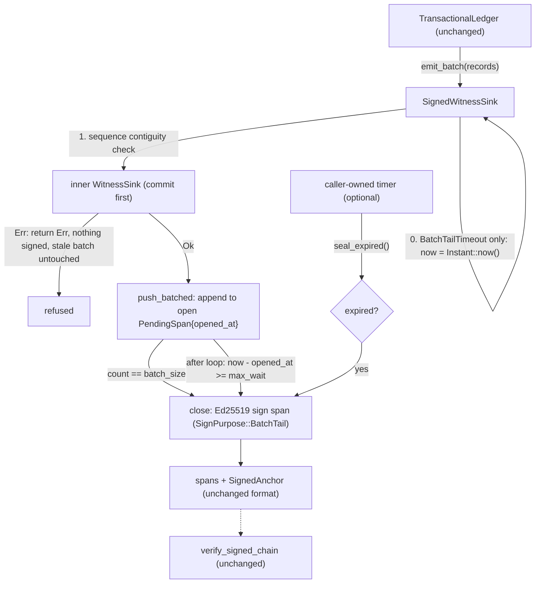

# Nightly Research — Bounded Batch-Fill (Count-or-Timeout) Signing for the TARL Witness Chain

**Result: REJECT.** The hypothesis's own bound (worst-case signature
availability ≤ `max_wait`) failed in 3/3 runs. The new strategy
(`SigningStrategy::BatchTailTimeout`) is still kept as an opt-in, but it is
documented only with the bound that was actually measured. See the
Acceptance Result section.

> **How this run was executed.** MetaHarness/Darwin/Flywheel orchestration
> was probed and is not runnable in this repo. `npx -y metaharness` resolves
> to a project-scaffolding CLI (templates and host targets for *new*
> harnesses), not an in-repo research orchestrator. `npx ruvector harness
> doctor --json` fails with `npm error could not determine executable to
> run`. As in every prior run in `docs/research/nightly/`, one Claude
> session did all the work: researcher, implementer, benchmark engineer
> and adversarial reviewer. No Darwin generations or Flywheel gate calls are
> claimed.

## Summary

The 2026-09-16 nightly (ADR-347) gave `ruvector-agent-memory`'s TARL
ledger an Ed25519 `SignedWitnessSink`. Its amortized `BatchTail {
batch_size }` strategy only signs when a batch fills or when the caller
calls `seal()`. Under slow or bursty writes, a partial batch can therefore
stay unsigned indefinitely. That run's Next Research item 1 asked for a
wall-clock batch-fill timeout, porting the `BatchFillPolicy::hybrid`
pattern from `ruvector-retrieval-receipt` (ADR-343) without depending on
that crate.

This run builds it: `SigningStrategy::BatchTailTimeout { batch_size,
max_wait }`, plus a `seal_expired()` hook and a `pending_age()` monitor.
It is benchmarked with real Ed25519 signing, real `std::time::Instant`
timing and real `thread::sleep` gaps. On a deterministic bursty workload,
maximum signature-availability latency fell from **~250 ms** (plain
`BatchTail{64}`) to **~37.3 ms** (`BatchTailTimeout{64,10ms}`). With a
caller-owned 1 ms `seal_expired()` poll it fell to **11.2–11.8 ms**. There
was no measurable steady-state throughput cost (median ratio 0.86–1.01) and
no correctness change. The hypothesis still fails, because 37.3 ms is not
≤ `max_wait` (10 ms + 1 ms tolerance). Without a background timer, the
timeout can only fire on a later write, so the real bound is `max_wait +
time until the next write or poll`.

## Abstract

Batching amortizes signing, but it adds an availability window. A record
has no signature until its batch closes. ADR-343 measured this for
retrieval receipts in a discrete-event simulation. Here the same
count-or-timeout policy is built inside a *live* synchronous sink that has
no runtime and no timer thread. The deadline is checked in two places:
after each `emit_batch` has committed to the inner sink, and whenever the
caller calls `seal_expired()`. A timeout close is signed exactly like a
size close (`SignPurpose::BatchTail`), so the signed message format and
`verify_signed_chain` stay byte-for-byte unchanged.

We pre-registered six gates in the benchmark source before the first run:
dense-throughput ratio, timeout inertness, correctness, forgery rejection,
the hypothesis bound, and a workload-validity check. We then ran the
benchmark three times. Five gates pass. The hypothesis bound fails by 3.4×
in every run, which matches the analysis: with write-driven checks alone,
a batch that expires during an idle gap is only signed when the next write
arrives.

## Hypothesis

This is verbatim from the run brief, fixed before any code was written:

```text
Given a SignedWitnessSink<S> configured with SigningStrategy::BatchTail{batch_size},
under a bursty/slow write workload where batches sometimes stay open indefinitely
below batch_size,

when a new SigningStrategy::BatchTailTimeout{batch_size, max_wait} variant is added
that closes and signs a partially-filled batch once max_wait wall-clock time has
elapsed since the batch opened (even if batch_size has not been reached),

then worst-case signature-availability latency (time from a record being witnessed
to a signature covering it existing) should be bounded by max_wait,

subject to: correctness of verify_signed_chain unchanged (5/5 PASS as before),
diligent-forgery rejection unchanged (still rejects), the existing tests in
ruvector-agent-memory remaining green, and steady-state throughput (fast, dense
writes that fill batches before timeout) not regressing materially relative to
plain BatchTail{batch_size}.
```

The brief also fixed the design constraint that caused the failure: "this
sink has no background thread/timer — a timeout only fires on a subsequent
write or an explicit flush()". "Bounded by `max_wait`" was turned into a
concrete gate before the run: max measured latency ≤ `max_wait` + 1 ms.
The 1 ms covers one Ed25519 sign (~50–100 µs here) plus clock and scheduler
jitter. "Not regressing materially" became: median dense run time ratio ≤
1.10. Both are constants in `examples/bounded_batch_fill_bench.rs`.

## Why This Matters Now

The signed witness chain is only useful if records actually get signed.
`verify_signed_chain` fails closed on an unsigned tail
(`SignedChainError::UnsignedTail`). A crash loses any pending batch
permanently (ADR-347 Limit 2). So the time a record spends unsigned is
both an availability gap and a durability gap. Agent workloads are bursty:
tool-call clusters followed by long thinking or idle periods. That is
exactly the regime where fixed-size batching leaves the tail hanging. The
bursty benchmark below shows it: plain `BatchTail{64}` left records
unsigned for up to 250 ms and still had 42 records unsigned when the run
ended.

## SOTA Context

Count-or-timeout batching is a long-established, widely deployed pattern,
not a contribution of this run. Real reference points, described from
their public documentation:

- **Apache Kafka producer** `batch.size` + `linger.ms`: a partition batch
  is sent when it is full or when `linger.ms` has elapsed. The Kafka
  producer has a dedicated sender I/O thread, so linger expiry does not
  depend on another `send()`. That is exactly what this sink lacks, and
  the root cause of this run's rejection.
- **Database group commit** (e.g. PostgreSQL `commit_delay` /
  `commit_siblings`, MySQL/InnoDB binlog group commit): flush the WAL for
  several transactions at once, trading a small bounded delay for fewer
  fsyncs. The flush is again driven by a committing backend or background
  writer, not by the next unrelated commit.
- **Nagle's algorithm (RFC 896)** and TCP delayed ACK coalesce small
  writes, and are notorious for exactly this class of tail-latency surprise
  when the "fill or timeout" trigger interacts badly with application
  write patterns.
- **Certificate Transparency (RFC 6962)** logs issue a Signed Certificate
  Timestamp immediately and promise inclusion in the signed tree head
  within a Maximum Merge Delay. This is signature batching with an
  operational latency *promise* that is enforced by the log operator's own
  scheduler, not by the submitter's next request.
- **ADR-343** (`ruvector-retrieval-receipt::batch_fill`): the in-repo
  precedent. Its simulation assumed the timeout fires exactly at the
  deadline, so it measured ≤ 50.06 ms against a 50 ms timeout. This run
  shows what that assumption costs when there is no event loop to fire it.

## RuVector Ecosystem Fit

1. **`ruvector-agent-memory`** (`witness_signing`, ADR-347; TARL ledger,
   ADR-307) is the modified system. `BatchTailTimeout` wraps any
   `WitnessSink`, so it also covers `witnessed_compaction`'s eviction
   witnesses.
2. **`ruvector-retrieval-receipt::batch_fill`** (ADR-343) is where the
   pattern comes from. It was ported, not imported: that type is a
   clock-free scheduler holding a `Vec` of members, while here the "batch"
   is one streaming SHA-256 `PendingSpan` with an `opened_at: Instant`.
3. **`rvf-types`** (ADR-320) provides SHA-256 records digests. Ed25519
   comes via the `ed25519-dalek` `SigningKey` the sink already holds. There
   are no new primitives and no new dependencies.
4. **The witness/provenance chain** (ADR-134 schema; `SignedAnchor`
   rollback floor): unchanged. Timeout-closed spans chain through
   `prev_link` exactly like size-closed spans.

## Architecture



## Implementation

- `crates/ruvector-agent-memory/src/witness_signing.rs` (505 lines):
  - new `SigningStrategy::BatchTailTimeout { batch_size, max_wait: Duration }`;
  - `ZeroBatchSize` validation extended to cover it;
  - `PendingSpan.opened_at: Option<Instant>`;
  - `emit_batch` now reads the clock only for the timeout strategy and
    delegates to `emit_batch_inner`;
  - the old `BatchTail` loop moved into `push_batched`, with behavior
    unchanged.
- `crates/ruvector-agent-memory/src/witness_batch_fill.rs` (new, 122
  lines; a `#[path]` child module, so it can see the sink's private
  state):
  - `push_batched`, which does the size close and then the post-append
    expiry check;
  - `pub seal_expired()` and `pub(crate) seal_expired_at(now)`;
  - `pub pending_age()`;
  - `clock_if_timed`;
  - `#[cfg(test)] emit_batch_at(records, now)`.
- Tests:
  - The `STRATEGIES` matrix in `witness_signing_tests.rs` gains
    `BatchTailTimeout{4, 1h}` (never fires) and `BatchTailTimeout{8, 0}`
    (fires on every write). Every existing honest-chain, old-anchor,
    PoC1/PoC3, splice and diligent-forgery test therefore now also runs
    against the new strategy.
  - `witness_signing_timeout_tests.rs` adds 8 tests. They simulate elapsed
    time with synthetic `Instant`s. One real-clock test sleeps 3 ms.
- Benchmark: `crates/ruvector-agent-memory/examples/bounded_batch_fill_bench.rs`
  (new, sibling to `witness_signing_bench.rs`). No `Cargo.toml` change.

Design choice worth flagging: when a write finds the open batch expired,
that write's records join the stale batch and are signed with it. The
alternative would close the stale batch first and open a new one. Our
choice saves one signature per timeout, and gives the triggering records
~0 latency instead of another `max_wait`.

## Benchmark Methodology

- **Environment:** `Linux vm 6.18.44-fc-v37 #1 SMP PREEMPT_DYNAMIC x86_64`,
  4 logical CPUs (`nproc`), `rustc 1.94.1 (e408947bf 2026-03-25)`,
  `cargo 1.94.1 (29ea6fb6a 2026-03-24)`, release profile. This is a shared
  container VM, so expect timing noise.
- **Key:** fixed secret `[11u8; 32]`, the same as `witness_signing_bench`.
- **Part A (dense):** 20,000 `add`+`accept` pairs through a real
  `TransactionalLedger`. `BatchTail{64}` and `BatchTailTimeout{64,10ms}`
  run as 7 interleaved repetitions, alternating so drift hits both
  equally. The comparison uses the median total run time.
- **Part B (bursty):**
  - Schedule: 80 bursts from xorshift64 seed `0x5eed20260929`. Each burst
    has 1–6 pairs (277 pairs, 554 records), followed by a real
    `thread::sleep` idle gap of 2–30 ms (1,240 ms idle in total; 51/80
    gaps > 10 ms; max gap 29 ms).
  - Records: real ledger-generated witness records, replayed one per
    `emit_batch` call into a fresh `SignedWitnessSink` for each variant.
    The ledger only lends `&S`, so a caller-owned poller could not
    otherwise reach `seal_expired`.
  - Latency: per record, from the `Instant` *before* the `emit_batch` that
    witnessed it (conservative) to the `Instant` after the call or poll
    that closed its span.
  - Censoring: records still unsigned when the schedule ends are reported
    separately, with the age of the oldest, rather than being folded into
    the latency distribution.
- **Clock-read cost:** measured separately by a throwaway `rustc -O`
  probe that was not committed (10M `Instant::now()` calls: ~34.5–45.8 ns
  per call).
- **Type sizes:** measured with `size_of` in the same probe, using a
  mirror enum with identical shape: `Option<Instant>` = 16 B;
  `SigningStrategy` 16 B → 24 B.

Reproduce:

```bash
cargo test -p ruvector-agent-memory --lib
cargo clippy -p ruvector-agent-memory --all-targets -- -D warnings
cargo run --release -p ruvector-agent-memory --example bounded_batch_fill_bench
cargo run --release -p ruvector-agent-memory --example witness_signing_bench   # regression
```

## Benchmark Results (raw)

Run 1, complete and unedited:

```
ruvector-agent-memory bounded batch-fill signing benchmark (ADR-352)
batch_size=64 max_wait=10ms tolerance=1ms

Part A: dense workload, N=20000 add+accept pairs, 7 interleaved reps
  rep 0: plain_b64 total=  90.384ms sigs=625  timeout_b64 total=  70.006ms sigs=625
  rep 1: plain_b64 total=  70.126ms sigs=625  timeout_b64 total=  78.928ms sigs=625
  rep 2: plain_b64 total=  80.912ms sigs=625  timeout_b64 total=  80.844ms sigs=625
  rep 3: plain_b64 total=  79.353ms sigs=625  timeout_b64 total=  88.320ms sigs=625
  rep 4: plain_b64 total=  80.444ms sigs=625  timeout_b64 total=  79.947ms sigs=625
  rep 5: plain_b64 total=  72.531ms sigs=625  timeout_b64 total=  75.642ms sigs=625
  rep 6: plain_b64 total=  74.590ms sigs=625  timeout_b64 total=  84.149ms sigs=625
  median: plain_b64=79.353ms (3.968us/pair)  timeout_b64=79.947ms (3.997us/pair)  ratio=1.007

Part B: bursty workload, seed=0x5eed20260929, 80 bursts, 277 add+accept pairs (554 records), idle 1240ms total, 51/80 gaps > max_wait
plain_b64              signed= 512 p50= 62.439ms p95=184.821ms p99=249.848ms max=249.854ms  unsigned_at_end= 42 (oldest age  47.895ms)  signatures=  9  correctness=PASS
timeout_b64_10ms       signed= 543 p50= 16.462ms p95= 29.168ms p99= 37.289ms max= 37.292ms  unsigned_at_end= 11 (oldest age  13.131ms)  signatures= 65  correctness=PASS
timeout_b64_10ms+poll  signed= 554 p50= 10.227ms p95= 11.124ms p99= 11.212ms max= 11.218ms  unsigned_at_end=  0 (oldest age   0.000ms)  signatures= 65  correctness=PASS

Acceptance (gates fixed before the first run):
  A1 dense median ratio timeout/plain <= 1.10                      PASS
  A2 dense signature counts identical (timeout never fired)        PASS
  A3 verify_signed_chain PASS, all dense + bursty runs             PASS
  A4 diligent forgery rejected (timeout_b64_10ms bursty log)       PASS
  B1 HYPOTHESIS: timeout_b64_10ms max latency 37.292ms <= 11.0ms   FAIL
  B2 workload validity: plain_b64 max latency 249.854ms > 11.0ms   PASS
  (supplementary, not a gate) timeout+1ms poll max latency 11.218ms vs max_wait+poll+tol 12.0ms

BOUNDED BATCH-FILL ACCEPTANCE RESULT: REJECT
```

Runs 2 and 3, key lines, unedited (A2–A4 PASS in both, omitted by the
`grep`):

```
  median: plain_b64=80.100ms (4.005us/pair)  timeout_b64=78.997ms (3.950us/pair)  ratio=0.986
plain_b64              signed= 512 p50= 62.398ms p95=185.089ms p99=249.875ms max=249.880ms  unsigned_at_end= 42 (oldest age  47.746ms)  signatures=  9  correctness=PASS
timeout_b64_10ms       signed= 543 p50= 16.359ms p95= 29.166ms p99= 37.362ms max= 37.366ms  unsigned_at_end= 11 (oldest age  13.187ms)  signatures= 65  correctness=PASS
timeout_b64_10ms+poll  signed= 554 p50= 10.297ms p95= 11.048ms p99= 11.116ms max= 11.849ms  unsigned_at_end=  0 (oldest age   0.000ms)  signatures= 65  correctness=PASS
  A1 dense median ratio timeout/plain <= 1.10                      PASS
  A4 diligent forgery rejected (timeout_b64_10ms bursty log)       PASS
  B1 HYPOTHESIS: timeout_b64_10ms max latency 37.366ms <= 11.0ms   FAIL
  B2 workload validity: plain_b64 max latency 249.880ms > 11.0ms   PASS
BOUNDED BATCH-FILL ACCEPTANCE RESULT: REJECT

  median: plain_b64=86.233ms (4.312us/pair)  timeout_b64=74.529ms (3.726us/pair)  ratio=0.864
plain_b64              signed= 512 p50= 62.481ms p95=184.830ms p99=250.299ms max=250.306ms  unsigned_at_end= 42 (oldest age  47.746ms)  signatures=  9  correctness=PASS
timeout_b64_10ms       signed= 543 p50= 16.424ms p95= 29.169ms p99= 37.318ms max= 37.322ms  unsigned_at_end= 11 (oldest age  13.178ms)  signatures= 65  correctness=PASS
timeout_b64_10ms+poll  signed= 554 p50= 10.356ms p95= 11.105ms p99= 11.156ms max= 11.173ms  unsigned_at_end=  0 (oldest age   0.000ms)  signatures= 65  correctness=PASS
  A1 dense median ratio timeout/plain <= 1.10                      PASS
  A4 diligent forgery rejected (timeout_b64_10ms bursty log)       PASS
  B1 HYPOTHESIS: timeout_b64_10ms max latency 37.322ms <= 11.0ms   FAIL
  B2 workload validity: plain_b64 max latency 250.306ms > 11.0ms   PASS
BOUNDED BATCH-FILL ACCEPTANCE RESULT: REJECT
```

Regression: the existing `witness_signing_bench` (ADR-347), unmodified,
same session:

```
baseline       total=   29.862ms  mean=   1.452us  p50=   1.000us  p95=   2.926us  p99=   4.692us  throughput=  669742.2 ops/s  signatures=      0  correctness=PASS
candidate_a    total= 2002.369ms  mean= 100.042us  p50=  96.465us  p95= 130.590us  p99= 167.379us  throughput=    9988.2 ops/s  signatures=  40000  correctness=PASS
candidate_b16  total=  186.911ms  mean=   9.296us  p50=   2.572us  p95=  50.353us  p99=  62.539us  throughput=  107003.0 ops/s  signatures=   2500  correctness=PASS
candidate_b64  total=   94.920ms  mean=   4.685us  p50=   2.343us  p95=   5.217us  p99=  52.076us  throughput=  210704.8 ops/s  signatures=    625  correctness=PASS
candidate_b256 total=   59.642ms  mean=   2.941us  p50=   1.876us  p95=   3.892us  p99=  24.286us  throughput=  335332.1 ops/s  signatures=    157  correctness=PASS

Diligent-forgery rejection (chain-walk-alone fooled, signed check must reject):
  candidate_a      forgery_rejected=PASS
  candidate_b64    forgery_rejected=PASS

Amortization: candidate_a mean/op = 100042.3ns, candidate_b64 mean/op = 4684.5ns, ratio = 21.36x
Signature count: candidate_a=40000 candidate_b64=625 (expected ratio ~64x)
```

Tests and lint:

- `cargo test -p ruvector-agent-memory --lib`: `test result: ok. 53
  passed; 0 failed`. That is 45 pre-existing tests, all green, plus 8 new.
- `cargo clippy -p ruvector-agent-memory --all-targets -- -D warnings`:
  clean, both at baseline and after the change.
- `cargo fmt --check`: clean.

The brief expected 34 pre-existing tests. The real baseline on this
commit is 45, because ADR-347's post-review hardening added 11.

## Acceptance Result

| Gate (fixed before run 1) | Threshold | Run 1 / 2 / 3 | Result |
|---|---|---|---|
| A1 steady-state throughput | median timeout / plain ≤ 1.10 | 1.007 / 0.986 / 0.864 | PASS |
| A2 timeout inert on dense load | equal signature counts | 625 = 625 | PASS |
| A3 correctness | `verify_signed_chain` OK everywhere | all PASS | PASS |
| A4 diligent forgery | rejected (log contains timeout-closed spans) | rejected | PASS |
| **B1 hypothesis: latency bound** | **write-driven max ≤ 11.0 ms** | **37.292 / 37.366 / 37.322 ms** | **FAIL** |
| B2 workload validity | plain `BatchTail` max > 11.0 ms | 249.854 / 249.880 / 250.306 ms | PASS |
| Existing tests | 45/45 green | 45/45 (+8 new) | PASS |
| Existing bench | 5/5 correctness, 2/2 forgery | 5/5, 2/2 | PASS |

**REJECT.** The hypothesis promised worst-case latency bounded by
`max_wait`. The strategy as specified (checked on write, no timer)
produced 37.3 ms against a 10 ms `max_wait` in every run. The measured
maximum sits just under the analytical ceiling for this schedule, `max_wait
+ max gap` = 10 + 29 = 39 ms. So the failure is structural, not noise.
Every other gate passed.

What the evidence *does* support, stated separately so it is not
mistaken for a softened verdict:

- Write-driven checks turn "unbounded" into "`max_wait` + inter-write
  gap": the maximum fell 6.7×, and p50 fell 3.8× (62.4 → 16.4 ms).
- A caller-owned 1 ms `seal_expired()` poll achieves ≤ `max_wait` +
  poll + tolerance (11.17–11.85 ms ≤ 12 ms) in 3/3 runs. This was a
  supplementary row, not a pre-registered gate.

## Memory Math

- `PendingSpan` grows by one `Option<Instant>` = 16 B (measured; the
  niche in `Instant` means the `Option` adds no discriminant). There is at
  most one `PendingSpan` per sink, so this is 16 B per sink, not per
  record.
- `SigningStrategy` grows from 16 B to 24 B (measured on a mirror enum),
  because it now carries a `Duration` (16 B) next to a `usize`. There is
  one per sink.
- No per-record or per-span growth: `SignedSpan` is unchanged. Timeout
  closes do create *more* spans on slow workloads: 65 vs 9 on the bursty
  schedule. Each span holds a 64 B signature, a 32 B digest, two `u64`s
  and a purpose byte.

## Performance Math

- **Dense path:** one `Instant::now()` per `emit_batch` (~35–46 ns
  measured), and 2 calls per pair, adds ~70–90 ns to a ~4.0 µs pair
  (~2%). That is below the ±14% run-to-run noise of the medians, which is
  why A1 cannot distinguish them. A size close already resets the batch,
  so the expiry comparison is almost never true on dense load, and 625 =
  625 signatures confirms the timeout never fired.
- **Bursty, write-driven:**
  - Worst case for a record = (time from its batch opening to the deadline)
    + (time from the deadline to the next write) ≤ `max_wait` + max gap
    = 39 ms. Measured maximum: 37.3 ms.
  - p50 of 16.4 ms ≈ `max_wait` + a typical partial gap, because most
    timeouts are discovered by the first write after an idle gap.
- **Bursty, polled:** bound ≈ `max_wait` + poll interval + sleep overshoot
  + sign time. Measured 11.17–11.85 ms ≈ 10 + ≤1 + ~0.1–0.8 ms of
  `thread::sleep` overshoot on a shared VM.
- **Signature count:** 65 spans for 554 records (~8.5 records per span)
  vs 9 spans for 512 records under plain `BatchTail{64}`. This is the
  amortization lost to bounded latency. ADR-343 reports the same trade
  (mean batch 31.9 → 3.5 at light load).

## Failure Modes

1. **Idle writer, no poller:** an expired batch stays unsigned until the
   next write, `seal_expired()` or `seal()`. This is the B1 failure.
   Unbounded if writes stop entirely.
2. **Slow poller:** the bound degrades to `max_wait` + poll interval.
3. **`max_wait` too small for the write rate:** the strategy degrades
   toward per-call signing, with no latency benefit left to buy.
4. **Crash with an expired but undiscovered batch:** the tail is
   permanently unsigned and fails closed (ADR-347 Limit 2, unchanged).
5. **Refused write after expiry:** the stale batch is *not* sealed by the
   failing call. The next successful write or `seal_expired()` seals it.
   This is covered by a test.

## Rejected Alternatives

- **Background timer thread in the sink:** it would need shared
  ownership and locking around the sink and the inner sink, and would
  change the `WitnessSink` threading model. It may be the right answer for
  a hard bound, but it deserves its own ADR rather than a nightly change
  (see Next Research item 1).
- **Depend on `ruvector-retrieval-receipt::BatchScheduler`:** forbidden by
  the brief. Its `Vec<PendingMember>` shape is also redundant with a
  streaming digest.
- **Close the stale batch before appending new records:** one extra
  signature per timeout, and a worse latency for the triggering records.
- **A new `SignPurpose::BatchTimeout`:** would change the verifier and
  authenticate information no verifier needs.
- **A generic `Clock` type parameter:** too much API weight. A test-only
  injection point suffices.

## Security

- The signed message, domain tags, `SignPurpose` values and
  `verify_signed_chain` are unchanged. A timeout-closed span *is* a
  `BatchTail` span.
- Witness-first is preserved. The strategy never turns `Ok` into `Err`,
  and a refused batch is never signed.
- `verify_strict` and the unsigned-tail, coverage and anchor checks from
  ADR-347 all apply unchanged. The STRATEGIES matrix re-runs the PoC1,
  PoC3, splice and forgery tests against both new configurations.
- Minor, noted and not mitigated: span boundaries now leak coarse idle
  timing (a partial span implies an idle period ≥ `max_wait`). The clock
  is unauthenticated, but it can only move *when* signing happens, never
  *whether* an unsigned record verifies.

## Governance

"No witness, no mutation" is unchanged. This is an opt-in variant with no
feature flag and no default change. The research was done by a single
session. Adversarial review found and fixed one design flaw before the
first commit: polling via a rebuilt `TransactionalLedger` would have
restarted sequence numbers. The final benchmark drives the sink directly
instead.

## MCP Implications

A read-only `agent_memory_signing_status` tool exposing `pending_age()`
and `unsigned_pending()` would be a reasonable monitor. An MCP-driven
`seal_expired()` would be a mutation and would need its own review. None
is built.

## WASM Implications

On `wasm32-unknown-unknown`, `std::time::Instant::now()` panics. A WASM
build that selects `BatchTailTimeout` would therefore need a different
clock source, for example the `#[cfg(test)]` injection path promoted to a
public API. Plain `BatchTail` and `PerRecord` never read the clock and are
unaffected. This was not measured here, and this crate's WASM status is
already an open item from ADR-347.

## Edge Implications

Edge devices are the most likely to be idle for long stretches and to
lose power mid-batch. On edge devices, use `BatchTailTimeout` together
with a periodic `seal_expired()` from the device's main loop. The polled
row shows that the pair gives `max_wait` + tick latency at negligible
steady-state cost.

## RVF Implications

None. Spans are unchanged, so any future RVF export of signed spans is
unaffected.

## RVM Implications

Not applicable. There is no RVM integration of this crate. If one existed,
an RVM scheduler tick would be the natural driver for `seal_expired()`.

## ruFlo Implications

A ruFlo job could alert when `pending_age()` exceeds `max_wait` + poll
interval. That condition means the poller has stalled, which is exactly
the gap this run measured.

## Practical Applications

1. **Compliance-critical `Accept` transitions at low volume:** the latency
   to a signed audit record becomes ~`max_wait` with a poll, instead of
   "whenever 63 more writes arrive".
2. **Interactive agents with bursty tool calls:** records signed within
   one `max_wait` of a burst ending, if the host event loop polls.
3. **Edge / Cognitum devices:** bounds how much unsigned history a power
   loss can destroy to ~`max_wait` + tick.
4. **Graceful shutdown hooks:** `seal_expired()` in a periodic
   housekeeping task means `seal()` at shutdown handles at most one
   `max_wait` of records.
5. **Eviction witnesses** (`witnessed_compaction`): compaction runs are
   rare and bursty, so their witnesses benefit most.
6. **Monitoring SLOs:** `pending_age()` gives an operator a direct "oldest
   unsigned record" gauge.
7. **Cross-crate provenance:** `ruvector-retrieval-receipt` receipts that
   cite ledger state can rely on that state being signed within a known
   window when polled.
8. **Test harnesses:** `BatchTailTimeout{n, 0}` gives deterministic
   "sign every write call" behavior without switching to `PerRecord`'s
   one-span-per-record cost.

## Long Horizon Applications

1. **Latency SLAs on provenance:** "signed within T" as a contractual
   property of agent memory, like CT's Maximum Merge Delay. This needs a
   scheduler-owned timer, which this run shows is necessary.
2. **Runtime-integrated signing schedulers:** an agent OS or RVM kernel
   tick driving every sink's `seal_expired`. That makes the bound a system
   property rather than a per-caller chore.
3. **Adaptive batching:** `max_wait` and `batch_size` tuned online from
   the observed arrival process (Darwin-style), trading amortization
   against latency.
4. **Federated memory:** multi-issuer logs where each issuer's
   signing-latency bound is part of the federation contract.
5. **Safety-certified robotics memory:** bounded unsigned windows as a
   certifiable property of sensor-fusion history.
6. **Aggregate signatures:** batch-close cost amortized further, making
   small `max_wait` values cheaper (ADR-340/343 open item).
7. **Crash-consistent signing:** persisting `PendingSpan` state so an
   expired batch can be signed on restart.
8. **Swarm memory with Byzantine peers:** bounded signing latency limits
   how long a peer can hold unauthenticated writes before others can
   distinguish "slow" from "withholding".

## Next Research

1. **Hard bound:** an optional, feature-gated timer driver (e.g. a
   `tokio` interval or a `std::thread` ticker behind `Arc<Mutex<_>>`)
   that calls `seal_expired()`. Re-run B1 against it with the same seed
   and gate.
2. **Promote a public clock-injection API**
   (`emit_batch_at`/`seal_expired_at`) for WASM and simulation, and
   decide `#[non_exhaustive]` on `SigningStrategy` before publishing.
3. **Measure on a real agent trace** rather than uniform 2–30 ms gaps.
4. **Fault injection:** a crash while an expired batch is undiscovered,
   quantifying lost-signature windows with and without polling.
5. **Carry over from ADR-347:** WASM size/latency and a multi-issuer
   verifier.

## References

- `docs/adr/ADR-352-bounded-batch-fill-witness-signing.md`: this run's ADR.
- `docs/adr/ADR-347-witness-signer-tarl-ledger.md` and
  `docs/research/nightly/2026-09-16-witness-signer-agent-memory/README.md`:
  the extended module, and Next Research item 1.
- `docs/adr/ADR-343-signed-receipt-batch-fill-latency-simulation.md`,
  `docs/research/nightly/2026-09-01-signed-receipt-batch-fill-latency/README.md`,
  `crates/ruvector-retrieval-receipt/src/batch_fill.rs`: the ported
  pattern.
- Apache Kafka producer configuration documentation (`batch.size`,
  `linger.ms`).
- PostgreSQL documentation, WAL configuration (`commit_delay`,
  `commit_siblings`).
- J. Nagle, RFC 896, "Congestion Control in IP/TCP Internetworks" (1984).
- B. Laurie, A. Langley, E. Kasper, RFC 6962, "Certificate Transparency"
  (2013): Maximum Merge Delay.
